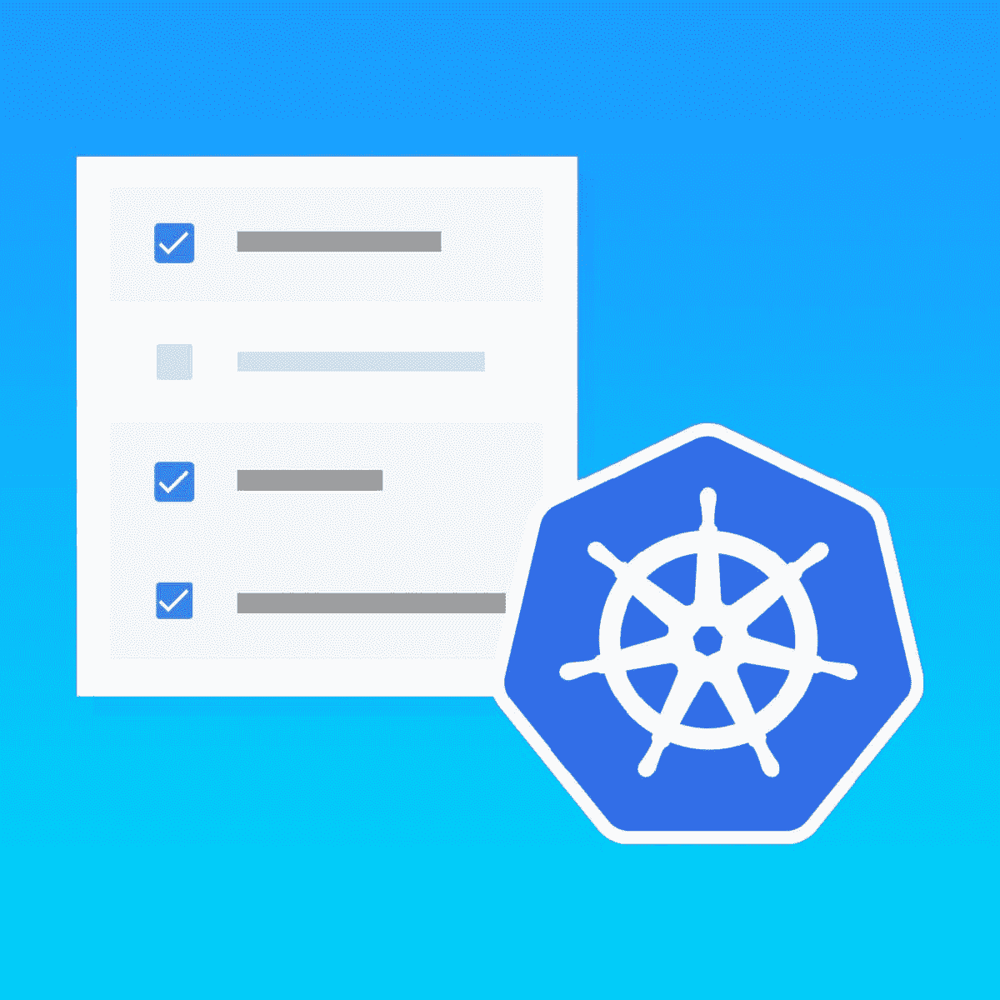
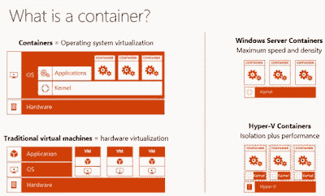
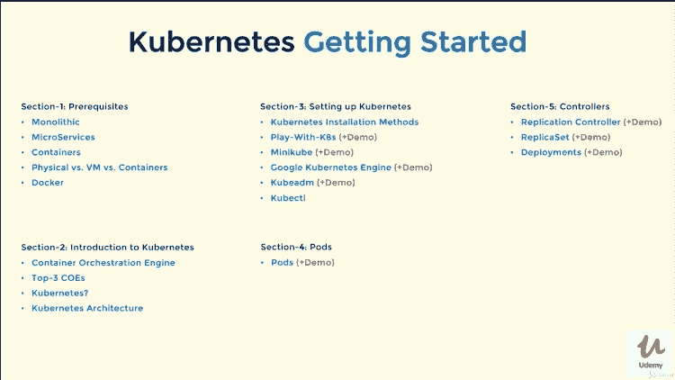
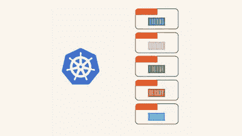

# 2023 年针对初学者的 8 个最佳免费 Kubernetes 课程

> 原文：<https://medium.com/javarevisited/7-free-online-courses-to-learn-kubernetes-in-2020-3b8a68ec7abc?source=collection_archive---------0----------------------->

## 使用这些免费的在线培训课程学习 Kubernetes，并在你丰富多彩的简历中添加一项热门技能。

image — [学习 DevOps:完整的 Kubernetes 课程](https://click.linksynergy.com/deeplink?id=JVFxdTr9V80&mid=39197&murl=https%3A%2F%2Fwww.udemy.com%2Fcourse%2Flearn-devops-the-complete-kubernetes-course%2F)

大家好，DevOps 正在成为当今编程和软件开发世界的一项基本技能，Kubernetes 是 [DevOps 工程师](https://javarevisited.blogspot.com/2018/09/the-2018-devops-roadmap-your-guide-to-become-DevOps-Engineer.html)的一个重要工具。它将基于容器的部署提升到另一个层次，并允许您大规模管理它。

您可以使用 Kubernetes 来扩展您的容器环境，或者通过利用其**自动扩展特性让 Kubernetes 为您完成所有工作。**

很多 DevOps 初学者认为 Docker 和 Kubernetes 是一样的，其实不然。Docker 提供了一个容器来部署你的应用程序和命令与这些容器进行交互，但 [Kubernetes](https://kubernetes.io/) 实际上是一种容器管理技术，它决定需要多少容器，并处理其他管理方面的问题。

*事实上，* ***Kubernetes 或者 K8s*** *可以说是目前世界上最重要的容器管理技术，你不应该对 Kubernetes 的根源在于 Google 本身感到惊讶。这不是一个谷歌工具，而是由几个谷歌开发人员创建的，作为他们在[谷歌](https://javarevisited.blogspot.com/2012/01/google-interview-questions-answers-top.html)中用于大规模管理容器的类似工具的开源替代品。Kubernetes 有一些令人难以置信的特性，比如自动缩放，它非常可靠，也是一个非常强大的容器编排引擎，可能是目前最好的。

它允许您将基础架构转换为容器即服务(平台)，引入一些令人惊叹的功能，如零停机时间部署、容错、自动扩展、云和存储集成，这些都是极难实现的。

越来越多的人意识到 DevOps 和学习工具的重要性，如 [Jenkins](https://javarevisited.blogspot.com/2018/09/top-5-jenkins-courses-for-java-and-DevOps-Programmers.html) 、 [Docker](http://www.java67.com/2018/02/5-free-docker-courses-for-java-and-DevOps-engineers.html) 和 [Kubernetes](https://www.java67.com/2019/03/5-free-devops-courses-to-learn-jenkins.html) ，如果你也正好在同一条船上，那么这些*免费课程*将为你提供进入 DevOps 世界所需的跳板。顺便说一下，如果你不介意花几块钱学习像 Kubernetes 一样有价值的东西，那么我建议你也看看 Udemy 上的[**Docker 和 Kubernetes:完全指南**](https://click.linksynergy.com/fs-bin/click?id=JVFxdTr9V80&subid=0&offerid=634352.1&type=10&tmpid=14538&RD_PARM1=https%3A%2F%2Fwww.udemy.com%2Fdocker-and-kubernetes-the-complete-guide%2F) 课程，它不是免费的，但你可以在每个月举行的许多 Udemy flash 销售中只花 10 美元就能得到它。*

<https://click.linksynergy.com/fs-bin/click?id=JVFxdTr9V80&subid=0&offerid=634352.1&type=10&tmpid=14538&RD_PARM1=https%3A%2F%2Fwww.udemy.com%2Fdocker-and-kubernetes-the-complete-guide%2F>  

你将同时学习 Docker 和 Kubernetes，这意味着你可以一举两得。这是 2023 年从 Docker 和 Kubernetes 开始的完美课程。

# DevOps 工程师学习 Kubernetes 的 8 门最佳免费课程

无论如何，这是我列出的 2023 年可以从 Kubernetes 学习的一些最好但免费的课程。你可以利用这些课程为工作学习 Kubernetes，或者如果你正在准备 [Kubernetes 管理员认证 CKA](/javarevisited/6-best-certified-kubernetes-administrator-courses-and-practice-tests-to-crack-cka-exam-46a14549720f) 或 [CKAD](/javarevisited/7-best-certified-kubernetes-application-developer-ckad-courses-practice-tests-in-2021-9b8b7d2c375) ( *认证 Kubernetes 管理员开发者*)。

尽管这些课程是免费的，但它们是很好的课程，只是由他们的讲师出于宣传和教育目的而免费提供的。如果你刚开始学习 Kubernetes，我建议你参加其中的一个课程，了解一下什么是 Kubernetes，以及它如何帮助你完成开发工作。

## 1.[刚够危险的库伯内特斯](https://click.linksynergy.com/fs-bin/click?id=JVFxdTr9V80&subid=0&offerid=634352.1&type=10&tmpid=14538&RD_PARM1=https%3A%2F%2Fwww.udemy.com%2Fjust-enough-kubernetes%2F)

这是一门非常好的课程，可以在很短的时间内学习 Kubernetes，准确地说是在 1.5 小时内。它有助于您快速上手 Kubernetes，并在通过实践学习的同时建立基础。

您不仅将使用 Google kubernetes 引擎建立 Kubernetes 集群，还将学习如何部署一个[微服务](https://javarevisited.blogspot.com/2018/02/top-5-spring-microservices-courses-with-spring-boot-and-spring-cloud.html)应用程序并将其发布给全世界。

由 Gaurav Shah 创建，在本课程中，您还将学习如何使用 kubernetes 的自动扩展功能动态扩展您的应用，在不停机的情况下发布应用更新，或者实现零停机部署。

您还将学习到 **kubectl** 实用程序的基础知识，这是使用 Kubernetes 的一个重要工具。简而言之，这是一个免费开始您的 Kubernetes 之旅的完美课程。

**这里是免费加入本课程的链接—** [刚好够危险的库伯内特斯](https://click.linksynergy.com/fs-bin/click?id=JVFxdTr9V80&subid=0&offerid=634352.1&type=10&tmpid=14538&RD_PARM1=https%3A%2F%2Fwww.udemy.com%2Fjust-enough-kubernetes%2F)

## 2.[谷歌 Kubernetes 引擎入门](https://coursera.pxf.io/c/3294490/1164545/14726?u=https%3A%2F%2Fwww.coursera.org%2Flearn%2Fgoogle-kubernetes-engine)【Coursera】

这是一个从 Coursera 学习 Kubernetes 的免费在线培训课程，由 Google Cloud 创建。像其他 Coursera 课程一样，这也是免费审核的，但如果你需要认证，就需要付费。

这个为期一周的速成在线培训课程将教你如何在 Docker 容器中封装应用程序，将它们部署到 Google Kubernetes 引擎提供的 Kubernetes 集群中，并扩展这些应用程序以处理增加的流量。

本课程是 [**准备 Google 云认证的一部分:Cloud DevOps 工程师专业证书**](https://coursera.pxf.io/c/3294490/1164545/14726?u=https%3A%2F%2Fwww.coursera.org%2Fprofessional-certificates%2Fsre-devops-engineer-google-cloud) ，您还将学习如何在 Kubernetes 集群中持续部署新代码以提供应用程序更新。

谈到社会证明，超过 75，000 人已经参加了这门课程，28%的人说他们在完成这些课程后开始了新的职业生涯，33%的人从这门课程中获得了切实的职业利益，如加薪或晋升。总的来说，这是一个学习 Coursera 上 Kubernetes 的好课程。

**这里是免费参加本课程的链接**——[开始使用 Google Kubernetes 引擎](https://coursera.pxf.io/c/3294490/1164545/14726?u=https%3A%2F%2Fwww.coursera.org%2Flearn%2Fgoogle-kubernetes-engine)

顺便说一下，这个课程提供了一个 Kubernetes 的简短概述。对于完整的 Kubernetes 知识，你也可以在 Coursera 上看到谷歌 Kubernetes 引擎专业化 的 [**架构。**](https://coursera.pxf.io/c/3294490/1164545/14726?u=https%3A%2F%2Fwww.coursera.org%2Flearn%2Ffoundations-google-kubernetes-engine-gke)

<https://coursera.pxf.io/c/3294490/1164545/14726?u=https%3A%2F%2Fwww.coursera.org%2Flearn%2Ffoundations-google-kubernetes-engine-gke>  

如果你觉得 Coursera 的课程很有用，因为它们是由知名公司如谷歌、IBM、亚马逊和世界上最好的大学创建的，我建议你加入 Coursera 的订阅计划 [**Coursera Plus**](https://coursera.pxf.io/c/3294490/1164545/14726?u=https%3A%2F%2Fwww.coursera.org%2Fcourseraplus)

<https://coursera.pxf.io/c/3294490/1164545/14726?u=https%3A%2F%2Fwww.coursera.org%2Fcourseraplus>  

这种单次订阅可以让你无限制地访问他们最受欢迎的**课程**、**专业化**、**职业证书**和**指导项目**。它每年花费大约 399 美元，但是它完全物有所值，因为你可以获得无限的证书。

## 3.[通过 kops 和 terraform 学习 DevOps Kubernetes 部署](https://click.linksynergy.com/fs-bin/click?id=JVFxdTr9V80&subid=0&offerid=634352.1&type=10&tmpid=14538&RD_PARM1=https%3A%2F%2Fwww.udemy.com%2Flearn-devops-kubernetes-deployment-by-kops-and-terraform%2F)

这是另一个通过使用 kops 和 Terraform 在 AWS 上学习 Kubernetes 的实用课程。在本课程中，您将学习如何在 [AWS](https://hackernoon.com/top-5-online-courses-to-crack-amazon-web-service-aws-solutions-architect-associate-exam-saa-c01-c667514ca72) 中部署 Kubernetes 集群，以及如何使用 Terraform 运行不可变的基础设施。

您还将了解 Kubernetes 中的水平扩展部署，以及如何使用 Kops 来加速 Kubernetes 集群。

最重要的是，您将学习如何查看日志，如何进入 Kubernetes 中 pod 内的 [Docker](/@javinpaul/10-free-courses-to-learn-docker-and-devops-for-frontend-developers-691ac7652cee) 容器。总的来说，在 2023 年用 [AWS](http://www.java67.com/2018/05/top-5-amazon-web-services-or-aws-courses-to-learn-online.html) 学习 Kubernetes 是一个不错的小实用课程。

**以下是加入本课程的链接—** [通过 kops 和 terraform 了解 DevOps Kubernetes 部署](https://click.linksynergy.com/fs-bin/click?id=JVFxdTr9V80&subid=0&offerid=634352.1&type=10&tmpid=14538&RD_PARM1=https%3A%2F%2Fwww.udemy.com%2Flearn-devops-kubernetes-deployment-by-kops-and-terraform%2F)

## 4.[Kubernetes 简介](https://www.awin1.com/cread.php?awinmid=6798&awinaffid=631878&clickref=&p=%5B%5Bhttps%3A%2F%2Fwww.edx.org%2Fcourse%2Fintroduction-to-kubernetes)【免费 edX 课程】

这是另一个深入了解 Kubernetes 的*免费课程*。这是一门自定进度的课程，为期 14 周，每周需要学习 2 到 3 个小时。由 edX 团队创建的

，在本课程中，您将学习到一些 [Kubernetes 的基本概念](https://javarevisited.blogspot.com/2019/01/top-5-free-kubernetes-courses-for-DevOps-Engineer.html)，并讨论该系统的架构、它所解决的问题以及它用来处理容器化部署扩展的模型。

本课程不仅介绍了 [Kubernetes](/javarevisited/10-best-kubernetes-courses-for-developers-and-devops-engineers-94c35cd3a2fd) ，还包括如何部署独立和多层应用程序的技术说明。它还教你配置映射和秘密，以及如何使用入口。

**这里是免费参加本课程的链接**——[Kubernetes 简介](https://www.awin1.com/cread.php?awinmid=6798&awinaffid=631878&clickref=&p=%5B%5Bhttps%3A%2F%2Fwww.edx.org%2Fcourse%2Fintroduction-to-kubernetes)

完成本课程后，您将对 Kubernetes 的起源、架构和构建模块有一个坚实的理解，并将能够在云原生环境中使用 Kubernetes 大规模构建、测试和部署容器，如 [AWS](https://hackernoon.com/top-5-amazon-web-services-or-aws-courses-to-learn-online-free-and-best-of-lot-d94e192054b7) 、[谷歌云](https://javarevisited.blogspot.com/2019/07/top-5-google-cloud-platform-gcp-courses-certifications-online.html)或 [Azure](https://javarevisited.blogspot.com/2019/07/top-5-courses-to-crack-azure-architecture-technologies-certification-az-300-exam.html) 。

## 5.[集装箱 101](https://click.linksynergy.com/fs-bin/click?id=JVFxdTr9V80&subid=0&offerid=634352.1&type=10&tmpid=14538&RD_PARM1=https%3A%2F%2Fwww.udemy.com%2Fcontainers-101%2F) 【免费 Udemy 课程】

这是一个很好的免费课程，学习如何用 Kubernetes、 [Docker](/javarevisited/top-10-free-courses-to-learn-maven-jenkins-and-docker-for-java-developers-51fa7a1e66f6?source=collection_home---4------3-----------------------) 和 Helm 构建和部署容器化的应用程序。

顾名思义，在本课程中，您将学习构建和部署容器化应用程序的基础知识。

该课程介绍了由 [Docker](https://hackernoon.com/10-free-courses-to-learn-docker-for-programmers-and-devops-engineers-7ff2781fd6e0) 驱动的容器的概念以及如何创建它们。您还将了解现代 DevOps 所需的基本要素，包括编排、打包以及基于快速增长的 [Docker](https://dzone.com/articles/top-10-docker-course-for-java-developers) 、 [Kubernetes](https://dev.to/javinpaul/top-10-courses-to-learn-docker-and-kubernetes-for-programmers-4lg0) 和 Helm stack 构建的更多内容。

简而言之，深入学习集装箱的完美课程，用 6 小时的优质素材。

**以下是加入本课程的链接—** [集装箱 101](https://click.linksynergy.com/fs-bin/click?id=JVFxdTr9V80&subid=0&offerid=634352.1&type=10&tmpid=14538&RD_PARM1=https%3A%2F%2Fwww.udemy.com%2Fcontainers-101%2F)

## 6. [Kubernetes:入门](https://click.linksynergy.com/deeplink?id=JVFxdTr9V80&mid=39197&murl=https%3A%2F%2Fwww.udemy.com%2Fcourse%2Fkubernetes-getting-started%2F)【plural sight 免费试用】

这是另一个免费的课程，学习关于容器编排引擎和 Kubernetes 的基础知识，开始进入 Kubernetes 的世界。

该课程由 Srinath Challa 创建，内容超过 3 小时 41 分钟，将教您 Kubernetes 基础知识。您将学习如何在移动、云上以及本地笔记本电脑上构建和管理生产级 Kubernetes 集群

您还将了解 Pod，它们如何连接和通信，最后将向您展示如何编写 Pod 清单文件并将其部署到 Kubernetes 上。它还涵盖了一些高级主题，如使用 ReplicaSet、ReplicationController 和 DaemonSet 管理应用程序保护和高可用性，

总的来说，这是一个学习 Kubernetes 的免费在线课程，适合 DevOps 工程师、[开发人员、](/javarevisited/top-10-frameworks-full-stack-java-developers-can-learn-in-2020-5995021401e5)、管理员或任何有兴趣学习 Kubernetes 的人，它受到 29，000 多名学生的信任，讲述了它的用处。

**这里是免费参加本课程的链接**——[Kubernetes:入门](https://click.linksynergy.com/deeplink?id=JVFxdTr9V80&mid=39197&murl=https%3A%2F%2Fwww.udemy.com%2Fcourse%2Fkubernetes-getting-started%2F)

如果你觉得这个课程很有用，而且斯里纳斯的教学风格也很好，那么你也可以去看看他的付费课程[**Kubernetes Easy**](https://click.linksynergy.com/deeplink?id=JVFxdTr9V80&mid=39197&murl=https%3A%2F%2Fwww.udemy.com%2Fcourse%2Fkubernetes-made-easy%2F)，其中涵盖了 Kubernetes 的更多细节。它有超过 14.5 小时的内容和 54 个可下载的资源。

## 7. [Kubernetes，给赶时间的人](https://click.linksynergy.com/deeplink?id=JVFxdTr9V80&mid=39197&murl=https%3A%2F%2Fwww.udemy.com%2Fcourse%2Fkubernetes-for-people-in-a-hurry%2F)【Udemy 免费教程】

这是另一个在 Udemy 上学习 Kubernetes 的免费课程，Udemy 是最好的在线学习平台之一。这门课程是为绝对的 Kubernetes 初学者开设的。在对 Kubernetes 一无所知的情况下，完成本课程后，您将可以在 Kubernetes 平台上部署自己的应用程序。

本课程很好地概述了 Kubernetes 及其对象，您将了解 Kubernetes 上的组件、对象和部署的基础知识

虽然你不需要了解 Kubernetes，但是对 Linux、YAML 和命令行的基本理解是必需的。本课程非常适合开发人员、系统管理员/运营人员、IT 经理以及任何不熟悉容器编排的人

**这里是免费参加这个课程的链接**——[Kubernetes，为赶时间的人准备的](https://click.linksynergy.com/deeplink?id=JVFxdTr9V80&mid=39197&murl=https%3A%2F%2Fwww.udemy.com%2Fcourse%2Fkubernetes-for-people-in-a-hurry%2F)

## 8.通过 Pluralsight 开始使用 Kubernetes

这是另一个在线学习 Kubernetes 的实践课程。在本课程中，您将学习尽快使用容器和 Kubernetes 所需的理论和实践技能。

课程在逻辑上可以分为三个部分。在第一部分中，您将深入 Kubernetes 体系结构，主要的组件和服务是什么，以及它们如何一起构建生产级容器基础设施。

在第二和第三部分中，您将学习如何在几个[云平台](https://javarevisited.blogspot.com/2019/07/top-5-google-cloud-platform-gcp-courses-certifications-online.html)上安装和部署 [Kubernetes](https://kubernetes.io/) ，并学习使用 pod、部署和服务。

**以下是加入本课程的链接—**[**Kubernetes**](https://pluralsight.pxf.io/c/1193463/424552/7490?u=https%3A%2F%2Fwww.pluralsight.com%2Fcourses%2Fgetting-started-kubernetes)入门

本课程结束时，您将对 Kubernetes 及其工作原理有一个扎实的了解，并掌握部署 Kubernetes 集群和简单应用程序的技能。

顺便说一句，你需要一个 [**Pluralsight 会员**](https://pluralsight.pxf.io/c/1193463/424552/7490?u=https%3A%2F%2Fwww.pluralsight.com%2Fpricing) 才能加入这个课程，费用大约是每月 29 美元或每年 299 美元(14%的折扣)。如果你没有这个计划，我强烈推荐你加入，因为它能促进你的学习，而且作为一名程序员，你总是需要学习新的东西。

或者，你也可以使用他们的 **1** [**0 天免费试用**](https://pluralsight.pxf.io/c/1193463/424552/7490?u=https%3A%2F%2Fwww.pluralsight.com%2Flearn) 免费观看本课程。

<https://pluralsight.pxf.io/c/1193463/424552/7490?u=https%3A%2F%2Fwww.pluralsight.com%2Flearn>  

以上就是 2023 年学习 Kubernetes 的一些**免费课程。正如我说过的，Kubernetes 是最重要的容器管理技术之一，如果你正在考虑云中的 [DevOps](/hackernoon/the-2018-devops-roadmap-31588d8670cb) ，它真的很重要。我建议你花些时间学习 Kubernetes 提供的各种工具和特性，包括 Kubernetes 的自动缩放特性。

其他**编程课程**你可能喜欢
[2023 年 Java 开发者路线图](https://javarevisited.blogspot.com/2019/10/the-java-developer-roadmap.html)
[2023 年 DevOps 程序员路线图](https://javarevisited.blogspot.com/2018/09/the-2018-devops-roadmap-your-guide-to-become-DevOps-Engineer.html)
[10 门免费课程学习 Maven、Jenkins、 和 Docker](/javarevisited/top-10-free-courses-to-learn-maven-jenkins-and-docker-for-java-developers-51fa7a1e66f6)
[10 个框架 Java 和 Web 开发者应该学习的](https://javarevisited.blogspot.com/2018/01/10-frameworks-java-and-web-developers-should-learn.html)
[10 个面向有经验开发者的免费 Java 课程](http://www.java67.com/2018/08/top-10-free-java-courses-for-beginners-experienced-developers.html)
[5 个免费课程学习 Core Spring 和 Spring Boot](http://www.java67.com/2017/11/top-5-free-core-spring-mvc-courses-learn-online.html)
[10 个免费课程学习 Docker 2023 年](http://www.java67.com/2018/02/5-free-docker-courses-for-java-and-DevOps-engineers.html)
[10 个课程学习 DevOps 面向 Java 开发者的工具](/javarevisited/top-10-courses-to-learn-devops-for-experienced-programmers-d93b666db151)
[5 个免费课程学习 Scala 2023 年【T33](https://javarevisited.blogspot.com/2019/01/5-free-scala-programming-courses-for-java-programmers-learn-online.html) [2023 年学习 Maven 和 Jenkins 的 5 门免费课程](http://www.java67.com/2018/02/6-free-maven-and-jenkins-online-courses-for-java-developers.html)

感谢阅读本文至今。 如果你觉得这些免费的 Kubernetes 课程有用，那么请与你的朋友和同事分享。如果您有任何问题或反馈，请留言。**

**P. S. —** 这些免费的 Kubernetes 培训课程也有助于准备 Kubernetes 认证管理员认证，但如果你想准备得更好，我也强烈推荐 Udemy 网站上 KodeCloud training 的 [**认证 Kubernetes 管理员(CKA)**](https://click.linksynergy.com/deeplink?id=JVFxdTr9V80&mid=39197&murl=https%3A%2F%2Fwww.udemy.com%2Fcourse%2Fcertified-kubernetes-administrator-with-practice-tests%2F)培训课程。它带有现场模拟测试，你也可以在你的浏览器上进行。

<https://click.linksynergy.com/deeplink?id=JVFxdTr9V80&mid=39197&murl=https%3A%2F%2Fwww.udemy.com%2Fcourse%2Fcertified-kubernetes-administrator-with-practice-tests%2F> 