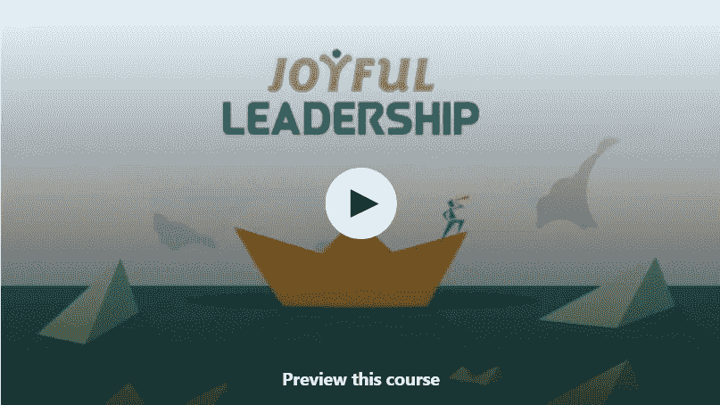
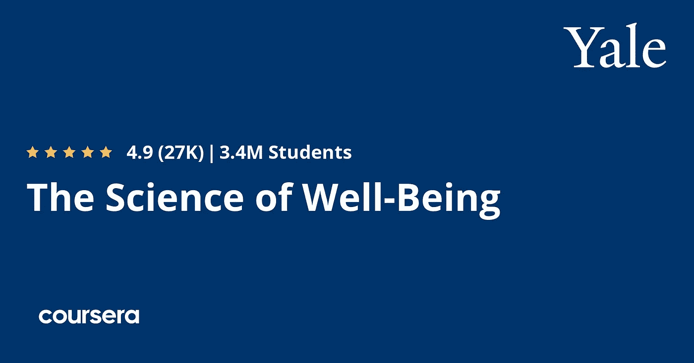
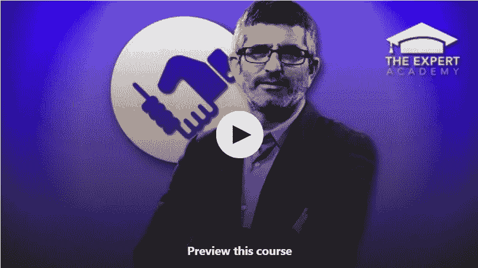
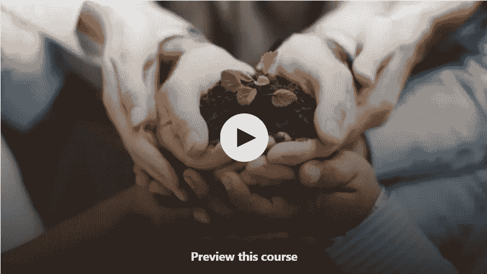
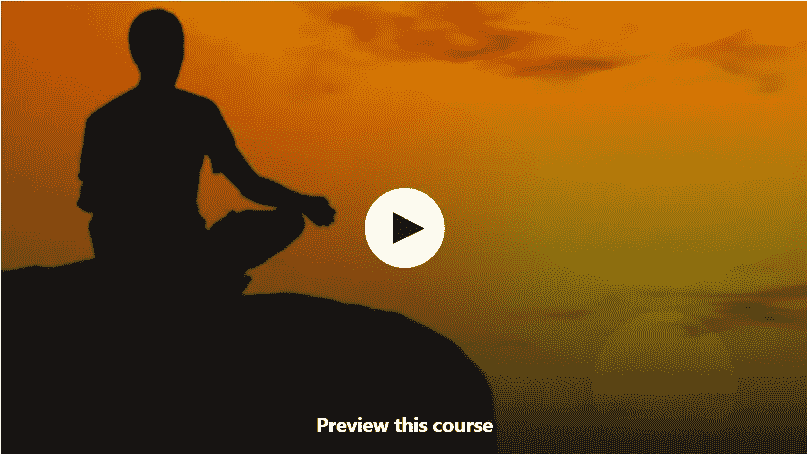
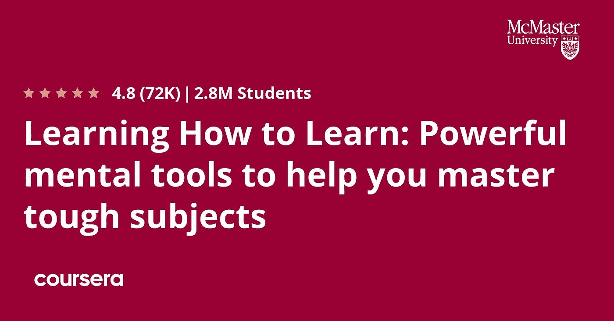
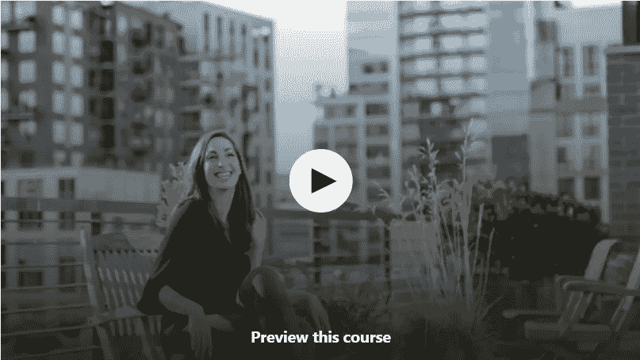

# 2023 年 7 门最佳免费个人发展和领导力在线课程

> 原文：<https://medium.com/javarevisited/7-free-personal-development-courses-for-programmers-and-developers-ecd6dc049b24?source=collection_archive---------1----------------------->

## 我最喜欢的个人发展和学习软技能的免费在线课程，如谈判、领导、自学、自我提高等，来自 Coursera、Udemy 和 Pluralsight

image_credit — Udemy

你好，伙计们，如果你想提高自己，并寻找最好的个人发展资源，如在线课程，那么你来对地方了。此前，我已经为没有编程经验的人分享了 [**最佳编程课程**](/javarevisited/7-best-coding-course-to-learn-programming-with-zero-experience-in-2020-52f7d0d9cb80) ，今天，我将分享免费的在线课程，以学习个人发展和其他软技能，如领导力、自我学习、自我提高等。

这些个人发展课程清单包括关于提高你的学习能力、谈判技巧、健康和福祉以及价值观教育的课程。

这些免费的在线个人发展课程非常有助于发挥你最好的一面。

无论情况如何，伟大的人格总是会有所帮助。如果你的个性很吸引人，你会自然而然地成为一名优秀的演讲者、听众、开发者、技术领导者和教师。

在这个每个人都忙于生活的技术时代，没有人愿意投入到一场沉闷或无聊的谈话中。你只有人品好才能吸引人。

这里的个性指的是“标记你的存在”这个概念。如果你在找工作，准备面试，这一点就更重要了。软技能和[技术](https://www.java67.com/2018/05/top-75-programming-interview-questions-answers.html)和[编码技能](https://www.java67.com/2016/02/5-books-to-improve-coding-skills-of.html)一样重要。

如果你想提高自己的个性，并寻找一些个人发展在线课程，那么你来对地方了。在这篇文章中，我将分享你可以参加的最佳个人发展课程，以提高你的[软技能](https://javarevisited.blogspot.com/2018/02/top-5-professional-email-writing-courses-for-programmers.html)，并以更好的方式展示你的实力。

你会注意到那些优秀的演讲者拥有抓住听众注意力的技能，一旦人们开始关注，你就可以利用这些技能达到你想要的目的。拥有一个好的个性，你可以销售你的产品和服务，并且可以轻松地通过最艰难的面试。如果你想要一个好的、吸引人的性格，你就是最佳人选。我们列出了 5 门课程，你可以从中学习培养良好人格的艺术。所有这些课程都是免费的、可靠的，它们会教你基本的软技能，如领导力、谈判、快速学习和整体福祉。

顺便说一句，说到学习，我个人最喜欢的是乔纳森·李维在 Udemy 上的 [**成为超级学习者:学习速读和增强记忆**](https://click.linksynergy.com/deeplink?id=JVFxdTr9V80&mid=39197&murl=https%3A%2F%2Fwww.udemy.com%2Fcourse%2Fbecome-a-superlearner-2-speed-reading-memory-accelerated-learning%2F) 课程。它不是免费的，但它完全值得你花时间和金钱，因为它会教你如何更快地学习，更容易地使用世界上最快的读者和记忆记录保持者的技能。

<https://click.linksynergy.com/deeplink?id=CuIbQrBnhiw&mid=39197&murl=https%3A%2F%2Fwww.udemy.com%2Fcourse%2Fbecome-a-superlearner-2-speed-reading-memory-accelerated-learning%2F>  

# 2023 年 7 门免费的个人发展和领导力在线课程

这些在线个人发展课程选自 Udemy 和 Coursera，你可以免费参加。这些也是网上最好的个人发展免费课程。

它们是由专家创造的，受到成千上万人的信任，不仅仅是程序员，而是来自不同领域的人，因为它们可以改善他们的个性，更好地发挥他们的优势。

## 1.[快乐领导力](https://click.linksynergy.com/deeplink?id=JVFxdTr9V80&mid=39197&murl=https%3A%2F%2Fwww.udemy.com%2Fcourse%2Fjoyful-leader%2F)【免费 Udemy 课程】

这是 Udemy 上学习领导力和个人发展的最佳免费课程。在本课程中，你将学习领导力，以及为什么领导力对每个人都如此重要。这是一个 5 小时的视频课程，评分为 4.5 分(满分为 5 分)，目前已有 8，000 名学生注册。本课程将帮助你学习管理一群人和建立一个成功团队的技巧。这门课程将帮助你在个人和职业成功中过上平衡的生活。

一些学生在参加了这个课程后能够发现自己的优势和劣势。导师会教你如何快乐，如何享受生活的每一刻。除此之外，你还会学到说话的艺术。

你将解决有趣的谜题和测验，所有这些都将帮助你建立一个令人惊叹的个性。如果你想成为你生活中的领导者，想过快乐的生活，你必须看看这个课程。

**这是参加本课程** — [快乐领导力](https://click.linksynergy.com/deeplink?id=JVFxdTr9V80&mid=39197&murl=https%3A%2F%2Fwww.udemy.com%2Fcourse%2Fjoyful-leader%2F)的链接

## 2.[幸福的科学](https://coursera.pxf.io/c/3294490/1164545/14726?u=https%3A%2F%2Fwww.coursera.org%2Flearn%2Fthe-science-of-well-being)【Coursera 免费课程】

这是关于个人发展和整体良好开端的最好的课程之一。这门课程遵循科学的方法，以帮助你成为一个更好的人。

这是互联网上最好的个性发展课程之一。超过 270 万名学生注册了该课程，在这 270 万名学生中，32%的学生改变了他们的流向。

这是一个长达 19 小时的视频课程，它将关注你思维的每一个方面。在最初的几分钟里，你会发现它既有趣又鼓舞人心。由耶鲁大学提供，可以在 [**Coursera 平台**](https://coursera.pxf.io/c/3294490/1164545/14726?u=https%3A%2F%2Fwww.coursera.org%2F) 观看。

这个课程帮助你在你的周围建立一个环境，这样你就可以一直保持积极和冷静。这门课程将帮助你释放你隐藏的潜力，到达你在个人生活和职业生涯中从未到达过的巅峰。

**这是加入本课程的链接** — [幸福的科学](https://coursera.pxf.io/c/3294490/1164545/14726?u=https%3A%2F%2Fwww.coursera.org%2Flearn%2Fthe-science-of-well-being)

顺便说一句，如果你计划参加多个 Coursera 课程或专业，那么考虑参加 [**Coursera Plus 订阅**](https://coursera.pxf.io/c/3294490/1164545/14726?u=https%3A%2F%2Fwww.coursera.org%2Fcourseraplus) ，它可以让你无限制地访问他们最受欢迎的课程、专业、专业证书和指导项目。它的费用约为 399 美元/年，但很值得，因为你可以访问 7000 多门课程和项目，还可以获得无限的证书。

<https://coursera.pxf.io/c/3294490/1164545/14726?u=https%3A%2F%2Fwww.coursera.org%2Fcourseraplus>  

## 3.[自由品尝者:谈判——了解性格类型](https://click.linksynergy.com/deeplink?id=JVFxdTr9V80&mid=39197&murl=https%3A%2F%2Fwww.udemy.com%2Fcourse%2Fnegotiation-how-to-craft-agreements-that-give-everyone-more%2F)

这门课程实际上并不注重塑造人格，相反，它更注重区分人格。在这门课中，你将学习如何根据人们的个性来区分他们。

由[专家学院](https://click.linksynergy.com/deeplink?id=CuIbQrBnhiw&mid=39197&murl=https%3A%2F%2Fwww.udemy.com%2Fuser%2Fexpert-academy%2F)打造，本课程将帮助你结交更好的朋友，最终帮助你成为一个优秀而智慧的个体。对于那些想要过上幸福的个人生活和成功的职业生活的人来说，这是一门伟大的课程。你将有 12 次不同的讲座，每次讲座都会教你一些新的有价值的东西。除此之外，这是一个非常短的视频课程，只有 32 分钟，而这 32 分钟将是最有成效的时间。这是一门非常简单的课程，到目前为止，已经有 25，000 人注册了这门课程。

这是学习谈判技巧的最好的免费在线课程之一*谈判技巧对于谈判工作机会非常重要，这个简单的技巧可以为你的整体薪酬带来几千美元的变化。建议至少看一下这个课程。我们确信，它不会让你失望。*

***以下是加入本课程** — [谈判—了解性格类型](https://click.linksynergy.com/deeplink?id=JVFxdTr9V80&mid=39197&murl=https%3A%2F%2Fwww.udemy.com%2Fcourse%2Fnegotiation-how-to-craft-agreements-that-give-everyone-more%2F)的链接*

**

## *4.[价值观教育](https://click.linksynergy.com/deeplink?id=JVFxdTr9V80&mid=39197&murl=https%3A%2F%2Fwww.udemy.com%2Fcourse%2Fvalue-education%2F)【Udemy 免费课程】*

*这是 Udemy 的另一门领导力课程，完全免费，但这门课程通过故事的帮助教会你所有有价值的课程。这是一个 1 小时长的视频课程，评分为 4.1 分(满分为 5 分)，已有超过 2300 名学生注册。

本课程重点教育学生了解我们国家存在的各种威胁，它将指导你如何避免在生活中做出错误的决定。*

*由 [LetsTute Make it Easy](https://click.linksynergy.com/deeplink?id=CuIbQrBnhiw&mid=39197&murl=https%3A%2F%2Fwww.udemy.com%2Fuser%2Fletstute-2%2F) 创建的这个免费的 udemy 课程鼓励你建立一个快乐的社会，并帮助你培养对你的环境和其他人类的责任感。价值观教育课程将帮助你成为一个负责任的公民和更好的个人。本课程旨在帮助你在各个方面实现转变。我们相信每个人都必须参加这个课程。*

***这里是加入这个免费课程**——[价值观教育](https://click.linksynergy.com/deeplink?id=JVFxdTr9V80&mid=39197&murl=https%3A%2F%2Fwww.udemy.com%2Fcourse%2Fvalue-education%2F)的链接*

**

## *5.[用瑜伽认识自己](https://click.linksynergy.com/deeplink?id=JVFxdTr9V80&mid=39197&murl=https%3A%2F%2Fwww.udemy.com%2Fcourse%2Fananda-marga-rajadhiraja-yoga%2F)【Udemy 免费课程】*

*你可能会觉得这门课脱离了上下文，但你错了。这门课不是关于瑜伽的。这是关于找到你的内在自我。在这里瑜伽只是实现它的一个工具。这是一个长达 3 小时的视频课程，有超过 1 万名学生报名参加。对于那些正在处理不安或焦虑的人来说，这是一个很好的课程。这门课程帮助你在生活中获得和谐，它将直接影响你的社会生活。

这种瑜伽会教你如何冷静处理情况，如何在内心探索自己。了解你自己瑜伽课程有 7 个不同的部分，每个部分处理一个特定的问题。这更像是一门精神课程，但毫无疑问，它对每个人都有帮助。如果你想在生活中得到放松和精神上的平静，这个课程就是为你准备的。除此之外，它将帮助你在个人和职业生活中建立更好的关系。*

***这里是加入这个免费课程的链接**——[用瑜伽认识你自己](https://click.linksynergy.com/deeplink?id=JVFxdTr9V80&mid=39197&murl=https%3A%2F%2Fwww.udemy.com%2Fcourse%2Fananda-marga-rajadhiraja-yoga%2F)*

**

## *6.[学会如何学习:帮助你掌握困难科目的强大智力工具](https://coursera.pxf.io/c/3294490/1164545/14726?u=https%3A%2F%2Fwww.coursera.org%2Flearn%2Flearning-how-to-learn)*

*这是 Coursera 提供的另一个很棒的免费课程，可以提高你的学习能力。这门课程由麦克马斯特大学和加州大学圣地亚哥分校提供，可以在 Coursera 上免费下载。*

*在这门课程中，你将学到艺术、音乐、文学、数学、科学、体育和许多其他学科的专家所使用的无价的学习技巧。你将了解大脑如何使用两种非常不同的学习模式，以及它如何封装信息。*

*你还将学习记忆技巧，处理拖延症，以及研究表明最有效地帮助你掌握棘手问题的最佳实践。*

*谈到学习成果，超过 28%的学习者在完成这些课程后开始了新的职业生涯，24%的学习者从这门课程中获得了切实的职业利益。此外，超过 280 万人已经参加了这一课程。*

***这里是加入这个免费课程** — [学习如何学习](https://coursera.pxf.io/c/3294490/1164545/14726?u=https%3A%2F%2Fwww.coursera.org%2Flearn%2Flearning-how-to-learn)的链接*

**

*顺便说一下，如果你觉得 Coursera 的课程很有用，因为它们是由世界各地知名的公司和大学创建的，我建议你加入 Coursera Plus 的订阅计划，它可以让你无限制地访问他们最受欢迎的课程、专业知识、专业证书和指导项目。*

*<https://coursera.pxf.io/c/3294490/1164545/14726?u=https%3A%2F%2Fwww.coursera.org%2Fcourseraplus> * 

## *7.[提高影响力的 7 个科学证明的步骤](https://click.linksynergy.com/deeplink?id=CuIbQrBnhiw&mid=39197&murl=https%3A%2F%2Fwww.udemy.com%2Fcourse%2F7-scientifically-proven-steps-to-increase-your-influence%2F)*

*这是 Udemy 上另一个很棒的免费课程，你可以加入学习一些行之有效的步骤来增加你的影响力。本课程由 Vanessa Van Edwards 创建，将教你魅力科学，以及如何通过 7 个科学步骤增加你的影响力、影响力和收入。*

*在这门免费课程中，您将学到以下内容:*

1.  *成为房间里最令人难忘的人*
2.  *得到你想要的工作*
3.  *增加你的影响力*
4.  *赢得朋友*
5.  *利用你的魅力*
6.  *增加你的收入*
7.  *掌握社交场合*
8.  *掌控你的声誉*
9.  *对你遇到的人产生影响*

*总的来说，这是一个非常棒的个人发展免费课程，我强烈推荐给大家。*

***这是加入本课程的链接**——[7 个经过科学验证的提升影响力的步骤](https://click.linksynergy.com/deeplink?id=CuIbQrBnhiw&mid=39197&murl=https%3A%2F%2Fwww.udemy.com%2Fcourse%2F7-scientifically-proven-steps-to-increase-your-influence%2F)*

**

*以上是学习个人发展和提升个人形象的最佳在线课程。个性发展不是一朝一夕可以完成的，你必须非常有耐心。一步走错会毁了你所有的努力。参加这些课程后，你必须仔细注意自己的变化。如果你有良好的个性，你会感到有动力，对自己有信心。去创造你吸引人的个性吧。记住，这是一种技能，你可以在生活的任何阶段发展它。*

*您可能喜欢的其他**职业和编程文章***

*   *[学习云计算的 10 门最佳 Coursera 课程](https://javarevisited.blogspot.com/2020/08/top-10-coursera-certifications-to-learn-cloud-computing-aws.html#axzz6WK1yC5WW)*
*   *[Coursera Plus Review——在 Coursera 上学习的更好方式](https://javarevisited.blogspot.com/2020/08/coursera-plus-better-way-to-take-coursera-courses-specilizations-certification.html)*
*   *[学习 Web 开发的十大 Coursera 课程](https://javarevisited.blogspot.com/2020/08/top-10-coursera-certifications-to-learn-web-development.html)*
*   *[2023 年学习人工智能的 7 门最佳课程](/javarevisited/7-best-courses-to-learn-artificial-intelligence-in-2020-26d59d62f6fe)*
*   *Udemy vs Pluralsight？哪个学习平台比较好？*
*   *[5 个最佳 Coursera 程序员职业证书](https://javarevisited.blogspot.com/2019/10/top-5-coursera-professional-certificates-for-programmers-IT-professionals.html)*
*   *[YouTube 上的最佳 Coursera 认证](https://www.youtube.com/watch?v=6NKULJuitcU)*
*   *[面向程序员和开发人员的十大 Coursera 项目](https://javarevisited.blogspot.com/2020/08/top-10-coursera-projects-to-learn-essential-programming-skills.html)*
*   *[你可以在 Coursera 上在线申请的前 5 个计算机科学学位](https://javarevisited.blogspot.com/2020/04/is-it-possible-to-get-master-of-computer-science-degree-online-coursera.html)*
*   *[学习数据科学的十大 Coursera 课程](https://javarevisited.blogspot.com/2020/08/top-10-coursera-certifications-to-learn-Data-Science-Visualization-and-Data-Analysis.html)*
*   *[学习 Python 的 10 个 Coursera 专业化和认证](https://javarevisited.blogspot.com/2020/02/10-best-coursera-courses--for-python.html)*
*   *[开始职业生涯的十大 Coursera 认证](/javarevisited/top-10-coursera-certificates-to-start-your-career-in-cloud-data-science-ai-mainframe-and-it-558690c83587)*
*   *Udemy vs Educative vs Codecademy？新手用哪个好*
*   *[你可以在 Coursera Online 上获得 5 个数据科学学位](https://www.java67.com/2020/06/top-5-data-science-degree-you-can-earn-online-coursera-edx.html)*
*   *[Java 上的最佳 Coursera 认证访问 Youtube 频道](https://www.youtube.com/watch?v=6NKULJuitcU)*
*   *[Udemy vs CocdeCademy vs one month？](https://javarevisited.blogspot.com/2019/09/codecademy-vs-udemy-vs-onemonth-which-is-better-for-learning-code.html#axzz6VYKcmyZz)*
*   *[Coursera 的 10 项数据科学和机器学习认证](/javarevisited/top-10-machine-learning-and-data-science-certifications-and-training-courses-for-beginners-and-a6308497b764)*

*感谢阅读这篇文章。如果你喜欢这些免费的个人发展课程，请与你的朋友和同事分享。如果您有任何问题或反馈，请留言。*

***附言——**如果你想提高你的谈判技巧，并且正在寻找一门好的课程来学习一些有用的谈判技巧，那么我强烈推荐你参加 Udemy 网站上由 Chris Croft 开设的 [**成功谈判:掌握你的谈判技巧**](https://click.linksynergy.com/deeplink?id=JVFxdTr9V80&mid=39197&murl=https%3A%2F%2Fwww.udemy.com%2Fcourse%2Fa-practical-guide-to-negotiating%2F) 课程。学习一些现实世界中的否定技巧是一个很好的课程，这些技巧不仅会在工作中帮助你，也会在接受和拒绝工作邀请时帮助你。*

*<https://click.linksynergy.com/deeplink?id=JVFxdTr9V80&mid=39197&murl=https%3A%2F%2Fwww.udemy.com%2Fcourse%2Fa-practical-guide-to-negotiating%2F> *