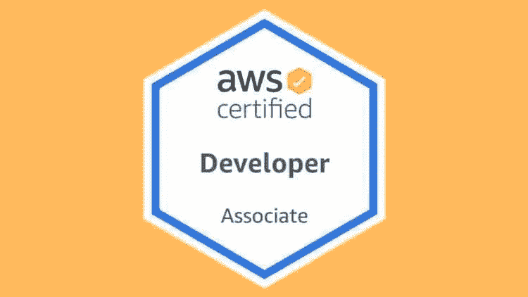
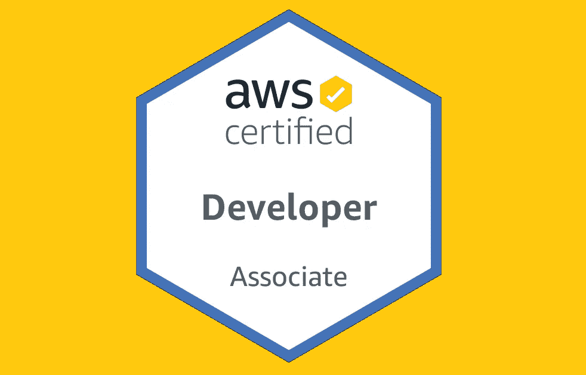
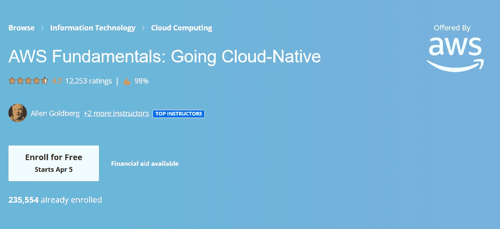

# 2023 年破解 AWS 开发者助理认证的 7 门最佳免费课程

> 原文：<https://medium.com/javarevisited/7-free-resources-to-crack-aws-developer-associate-certification-for-beginners-b365aea4cd3c?source=collection_archive---------0----------------------->

## 我最喜欢的免费在线课程，为 2023 年的 AWS 开发人员助理认证做准备

大家好，如果你正在准备 **AWS 认证开发者助理考试**并寻找免费的在线课程，那么你来对地方了。

在过去，我分享了免费的在线课程来准备 [**AWS 云从业者**](/javarevisited/7-free-aws-cloud-practitioner-certification-courses-to-crack-exam-in-2021-f13d6a996019) 和[系统管理员](https://www.java67.com/2020/08/top-5-free-courses-to-pass-aws-sysops-administrator-associate-exam.html)认证，今天我将分享免费的在线培训课程来准备著名的 AWS 开发人员助理考试。

考试需要 AWS 的实际操作经验，但这还不够，你还需要准备所有的考试主题，这就是这些在线课程可以帮助你的地方。

这些是最好的、完全免费的课程，来自像 Udemy T1、T2 Coursera T3、freeCodeCamp 和 Youtube 这样的网站，你可以用它们来准备这个著名的 AWS 云认证。

如果你期待在[云计算](/javarevisited/5-best-cloud-computing-courses-to-learn-in-2020-f5f091159401)领域发展事业，那么 AWS 开发助理将是一个非常适合你的职位。你可以作为 AWS 开发人员助理开始你的职业生涯，但在此之前，亚马逊将进行一次考试，以便为你提供 AWS 开发人员助理的专业认证。

即使在这个行业，公司也在寻找[认证的 AWS 开发人员助理](/javarevisited/top-5-online-courses-to-become-aws-certified-developer-associate-in-2020-best-of-lot-9b22baf84ca8)，因为没有人会欣赏他们必须在你身上投资才能让你成为专家的事实。

除此之外，还有几种方法可以顺利通过 AWS 开发人员助理考试。其中之一是参加免费课程(如下所列)，然后一旦你有了足够的技术知识，你就可以轻松通过 AWS 开发人员助理考试。

我们在本文中列出了所有最好的免费课程，通过这些课程，您可以通过 AWS 开发人员助理考试。它们不像夏羽·马瑞克的 [**AWS 开发者课程**](https://click.linksynergy.com/deeplink?id=JVFxdTr9V80&mid=39197&murl=https%3A%2F%2Fwww.udemy.com%2Fcourse%2Faws-certified-developer-associate-dva-c01%2F) 那样全面，是最全面和最好的 AWS 开发者认证课程之一，但它们仍然足够好，足以做好准备。

<https://click.linksynergy.com/deeplink?id=JVFxdTr9V80&mid=39197&murl=https%3A%2F%2Fwww.udemy.com%2Fcourse%2Faws-certified-developer-associate-dva-c01%2F>  

# 2023 年将加入 7 门免费的 AWS 开发人员助理认证课程

这些是准备 AWS 开发人员助理考试的最佳免费课程。该列表包含来自 Udemy、T2、Coursera 和 T4 的免费 AWS 课程。你可以使用这些免费的培训材料来准备这个著名的考试。

## 1. [AWS 开发人员助理培训](https://click.linksynergy.com/deeplink?id=JVFxdTr9V80&mid=39197&murl=https%3A%2F%2Fwww.udemy.com%2Fcourse%2Faws-developer-associate-training%2F)【免费 Udemy 课程】

本课程是专为您在 AWS 开发人员助理考试中取得更好成绩而设计的。在本课程中，讲师将向您传授与 AWS 平台相关的所有基础知识。除了 AWS 开发人员助理培训之外，讲师 Alan Rodrigues 将为您提供其他 AWS 服务的基础培训。到目前为止，已有两万名学生注册了这个长达 7 小时的视频课程。课程的前 4 个小时用于理解部分，其余 2 个小时用于实施。在本课程中，将为您提供一些实时问题，您需要在进入下一个级别之前解决这些问题。

除此之外，本课程的 USP 是由讲师根据 AWS 规则引入的新更新不断更新。

如果你正在寻找一些有趣的东西，由于课程中使用的动画，并且直接通过了 [AWS 开发人员助理考试](https://javarevisited.blogspot.com/2020/09/how-to-crack-aws-certified-developer-associate-certification-exam.html)，那么本课程最适合你。

**这里是加入这个免费课程的链接** — [AWS 开发人员助理培训](https://click.linksynergy.com/deeplink?id=JVFxdTr9V80&mid=39197&murl=https%3A%2F%2Fwww.udemy.com%2Fcourse%2Faws-developer-associate-training%2F)

## 2. [AWS 基础:向云迁移](https://coursera.pxf.io/c/3294490/1164545/14726?u=https%3A%2F%2Fwww.coursera.org%2Flearn%2Faws-fundamentals-cloud-migration)【免费 Coursera 课程】

在这个免费的 Coursera AWS 课程中，专家们将分享他们在 AWS 和云计算方面的宝贵经验；这些建议会对你的职业生涯有所帮助。这门课程在 Coursera 上是免费的，由 [AWS](https://aws.amazon.com/) 自己提供，据讲师说，他们使用 Coursera 来传授他们的知识，因为 Coursera 是最好的在线培训平台之一，他们想帮助尽可能多的有志之士。

Coursera 上还有几个免费的 AWS 课程，是这个专业的一部分，你可以学习无服务器、安全和云迁移。

如果您正在寻找一门全面的免费 AWS 课程，可以帮助您准备 AWS 开发人员助理考试，那么这门课程就是为您准备的。

**以下是参加本课程的链接** — [AWS 基础知识:云原生](https://coursera.pxf.io/c/3294490/1164545/14726?u=https%3A%2F%2Fwww.coursera.org%2Flearn%2Faws-fundamentals-cloud-migration)

本课程是 [**AWS 基础专业化**](https://coursera.pxf.io/c/3294490/1164545/14726?u=https%3A%2F%2Fwww.coursera.org%2Fspecializations%2Faws-fundamentals) **w** 的一部分，包含更多 AWS 课程，以便更好地准备。

<https://coursera.pxf.io/c/3294490/1164545/14726?u=https%3A%2F%2Fwww.coursera.org%2Fspecializations%2Faws-fundamentals>  

顺便说一句，如果你计划参加多个 Coursera 课程或专业，那么考虑参加 [**Coursera Plus 订阅**](https://coursera.pxf.io/c/3294490/1164545/14726?u=https%3A%2F%2Fwww.coursera.org%2Fcourseraplus) ，它可以让你无限制地访问他们最受欢迎的课程、专业、专业证书和指导项目。它每月花费大约 59 美元，但很值得，因为你可以访问 7000 多门课程和项目，还可以获得无限的证书。

<https://coursera.pxf.io/c/3294490/1164545/14726?u=https%3A%2F%2Fwww.coursera.org%2Fcourseraplus>  

## 3.AWS 认证开发者-2023 联盟[FreeCodeCamp]

这是另一个为初学者准备 AWS 开发人员助理考试的很棒的免费资源。

Freecodecamp.org 创建了这个课程，它可以在 YouTube 上看到，这个课程的创建者选择 YouTube 的原因是他们希望世界各地的任何人都可以免费访问它。

虽然这些教师也在 Udemy 上授课，但他们更喜欢 YouTube 上的这门特殊课程。

在本课程中，讲师将向您传授与 AWS 开发人员助理考试相关的所有知识。

这是 AWS 开发人员助理考试网上提供的最详细的课程之一。如果你期待通过一门课程学到所有的东西，这是为你准备的。您也可以将本课程与这些 [AWS 开发人员实践测试](https://javarevisited.blogspot.com/2020/07/top-5-aws-certified-developer-associate-practice-tests-mock-exams.html)结合起来，以便更好地准备。

**您也可以在 Youtube 上或点击这里观看本课程**:

## 4.[AWS Essentials【Udemy 免费课程】](https://click.linksynergy.com/deeplink?id=JVFxdTr9V80&mid=39197&murl=https%3A%2F%2Fwww.udemy.com%2Fcourse%2Flinux-academy-aws-essentials-2019%2F)

这个免费的 Udemy 课程更多的是对 AWS 平台的基本介绍。在本课程中，讲师将介绍 AWS 平台提供的所有服务。

在这个免费的 AWS 课程中，您将了解所有服务的点滴信息，总体而言，它将帮助您创建一个广泛的投资组合，并最终帮助您创造更多的就业机会。

除此之外，本课程将为您提供足够的信息来通过 AWS 开发人员资格考试。如果你对 AWS 开发助理[有所了解，那么本课程是你的最佳选择。](/javarevisited/top-5-online-courses-to-become-aws-certified-developer-associate-in-2020-best-of-lot-9b22baf84ca8)

本课程将帮助您探索各种其他选项，而不仅仅是 AWS 开发人员助理。Linux Academy 创建这个课程，这家公司以教授专业技能而闻名。

他们使用了清晰而详细的动画，使整个理解过程变得容易。除此之外，在这个 7 小时 35 分钟长的视频课程中，讲师将向您全面介绍您所从事的大多数 [AWS 服务](https://javarevisited.blogspot.com/2020/02/top-5-courses-to-crack-aws-certified-cloud-practitioner-exam-certification-clf-c01.html)。

**这里是加入这个免费资源的链接**——[AWS 要点](https://click.linksynergy.com/deeplink?id=JVFxdTr9V80&mid=39197&murl=https%3A%2F%2Fwww.udemy.com%2Fcourse%2Flinux-academy-aws-essentials-2019%2F)

## 5. [AWS 概念(免费 Udemy 课程)](https://click.linksynergy.com/deeplink?id=JVFxdTr9V80&mid=39197&murl=https%3A%2F%2Fwww.udemy.com%2Fcourse%2Faws-concepts%2F)

Udemy 的另一门课程将帮助您围绕 AWS 服务建立基础。在本课程中，您还将了解到由 [AWS](https://javarevisited.blogspot.com/2020/08/top-10-coursera-certifications-to-learn-cloud-computing-aws.html) 提供的所有基本服务，并且通过本课程，您将探索一种新的选择，在这种选择中，您可以建立自己的职业生涯。但是与[“AWS 基础知识”](https://click.linksynergy.com/deeplink?id=JVFxdTr9V80&mid=39197&murl=https%3A%2F%2Fwww.udemy.com%2Fcourse%2Flinux-academy-aws-essentials-2019%2F)课程相比，本课程非常简短和直接。

本课程专为那些正在寻找各种 AWS 服务简介的学生而设计。虽然本课程将涵盖所有服务，并向您简要介绍每项服务，但如果您正在寻找详细信息，则您必须注册其他高级课程。

除此之外，在 [AWS 开发人员助理考试](https://javarevisited.blogspot.com/2020/05/top-5-courses-to-crack-aws-certified-developer-associate-certification-exam.html)中，本课程将帮助创建一个基础，要成功通过 AWS 开发人员助理考试，您必须再次注册另一门课程。

如果你正在寻找一个开始，那么这个课程是你最好的选择。

**这里是加入这个免费 Udemy 课程的链接** — [AWS 概念](https://click.linksynergy.com/deeplink?id=JVFxdTr9V80&mid=39197&murl=https%3A%2F%2Fwww.udemy.com%2Fcourse%2Faws-concepts%2F)

## 6.AWS 初学者基础—完整课程[YouTube]

这是另一个学习 AWS 基础知识直至高级云计算概念的免费课程。这门课程非常适合初学者——绝对不需要云计算经验！

本课程由 Neal Davis 创建，他是数字云培训的创始人，也是我最喜欢的关于 AWS 和云计算主题的 Udemy 讲师之一。参加了他的 [***AWS 认证开发人员助理考试培训 2023【新】***](https://click.linksynergy.com/deeplink?id=JVFxdTr9V80&mid=39197&murl=https%3A%2F%2Fwww.udemy.com%2Fcourse%2Faws-certified-developer-associate-exam-training%2F) 课程后，我非常确定这个免费课程将是准备 AWS 认证(包括 AWS 开发人员助理)的一个很好的资源，我没有失望。

有很多使用 AWS 免费层帐户的实践练习，给你亚马逊网络服务的实际经验。可视化幻灯片和动画将帮助您深入了解云计算。

你可以在 Youtube 或这里观看这个免费课程:

## 7.AWS 开发人员认证| AWS 认证开发人员助理(前 6 个小时)

这是 2023 年成为 AWS 认证开发人员的另一个免费资源。本课程实际上是 Ranga 的 [**AWS 开发人员助理认证—循序渐进— 2023**](https://click.linksynergy.com/deeplink?id=JVFxdTr9V80&mid=39197&murl=https%3A%2F%2Fwww.udemy.com%2Fcourse%2Faws-certified-developer-associate-step-by-step%2F%3FreferralCode%3D8F5DCA2483DD36E3DDE2) Udemy 课程的前 6 个小时，该课程也是该主题中评分最高的课程之一。

这个免费课程提供了超级和优质的内容，并涵盖了 EC2，负载平衡器，AustoScaleGroup，Lambda 等重要概念的细节。

你可以在 YouTube 或这里观看这个免费课程:

这就是 2023 年通过 AWS 开发人员助理认证 **考试的最好的**免费在线培训课程。所有这些课程都将帮助您准备 AWS 开发人员助理考试，但没有一门课程能保证帮您解决问题。你必须探索所有不同的知识来源，这些知识可以帮助你获得超过及格线的额外分数。记住，你准备得越好，受益就越多。****

您可能喜欢的其他 **AWS 和云计算文章**

*   [2023 年十大 AWS 认证](https://javarevisited.blogspot.com/2020/09/top-10-aws-certifications-for-cloud-professionals.html)
*   [如何破解 AWS 解决方案架构师助理考试](https://javarevisited.blogspot.com/2019/08/how-to-crack-aws-certified-solution-architect-exam.html)
*   [破解 AWS 解决方案架构师助理认证的 5 大课程](https://javarevisited.blogspot.com/2019/05/top-5-courses-to-crack-aws-solutions-architect-associate-certification-exam-SAA-C01.html#axzz5rHwAwycj)
*   [面向 Java 开发人员的五大 AWS 和云课程](https://javarevisited.blogspot.com/2020/05/top-5-cloud-courses-for-java-and-spring-boot-developers.html)
*   [我最喜欢的深入学习 AWS 的课程](/javarevisited/top-10-courses-to-learn-amazon-web-services-aws-cloud-in-2020-best-and-free-317f10d7c21d)
*   [初学者和有经验的开发人员学习 AWS 的 5 大课程](https://javarevisited.blogspot.com/2020/05/top-5-amazon-web-services-aws-courses-for-beginners-and-experienced-programmers.html)
*   [通过 AWS 认证开发人员助理考试的前 5 门课程](https://javarevisited.blogspot.com/2020/05/top-5-courses-to-crack-aws-certified-developer-associate-certification-exam.html)
*   [官方 AWS 认证考试指南](https://aws.amazon.com/certification/certified-developer-associate/)
*   [通过谷歌云专业数据工程师认证的前 5 门课程](https://javarevisited.blogspot.com/2020/06/top-5-course-to-crack-google-cloud-professional-data-engineer-certification.html)
*   [通过 Google Cloud DevOps 工程师认证的 5 门免费课程](https://www.java67.com/2020/08/top-5-free-courses-to-become-google.html)
*   [成为 AWS 解决方案架构师专家的前 5 门课程](https://javarevisited.blogspot.com/2020/04/top-5-course-to-crack-aws-solution-architect-professional-sap-c01-certification-exam.html)
*   [破解 AWS DevOps 工程师考试的 5 大课程](https://javarevisited.blogspot.com/2020/04/top-5-course-to-crack-aws-certified-devops-engineer-professional-exam-certification.html)
*   [破解 AWS 解决方案架构师专业考试的前 5 门课程](https://javarevisited.blogspot.com/2020/04/top-5-course-to-crack-aws-solution-architect-professional-sap-c01-certification-exam.html)
*   [成为谷歌云专业云架构师的 5 门最佳课程](https://javarevisited.blogspot.com/2020/07/top-5-courses-to-become-google-cloud-professional-architect.html)
*   [5 门免费课程破解 AWS 云从业者考试](https://www.java67.com/2020/08/top-5-free-courses-to-pass-aws-cloud.html)
*   [成为谷歌云平台助理云工程师的 5 门课程](https://javarevisited.blogspot.com/2020/05/top-5-course-to-crack-google-cloud-associate-cloud-engineer-certification-exam.html)
*   [排名前五的谷歌云课程和认证](https://javarevisited.blogspot.com/2019/07/top-5-google-cloud-platform-gcp-courses-certifications-online.html)
*   [学习亚马逊网络服务的 5 门免费课程](https://www.java67.com/2018/05/top-5-amazon-web-services-or-aws-courses-to-learn-online.html)
*   [成为 AWS DevOps 工程师专家的 5 门课程](https://javarevisited.blogspot.com/2020/04/top-5-course-to-crack-aws-certified-devops-engineer-professional-exam-certification.html)
*   [5 次免费的 AWS 解决方案架构师助理实践测试、转储和模拟考试](https://javarevisited.blogspot.com/2019/08/top-5-free-aws-solution-architect-Associate-certification-dumps-practice-questions.html)
*   [AWS 云从业者(CLF-C01)前 5 名模拟测试和考试转储](https://javarevisited.blogspot.com/2020/03/top-5-aws-certified-cloud-practitioner-mock-test-practice-questions.html)
*   [通过 AWS 云从业者考试的 5 门最佳课程](https://javarevisited.blogspot.com/2020/02/top-5-courses-to-crack-aws-certified-cloud-practitioner-exam-certification-clf-c01.html)
*   [如何准备 AWS 解决方案架构师认证](/javarevisited/top-10-courses-to-learn-amazon-web-services-aws-cloud-in-2020-best-and-free-317f10d7c21d)

感谢您阅读本文。如果你喜欢这些*免费的 AWS 认证开发者课程*，那么请与你的朋友和同事分享。如果您有任何问题或反馈，请留言。

**附言——**如果你真的想第一次就通过 AWS 开发人员助理认证，并且可以花 10 美元购买高质量的培训材料，那么我强烈建议你去看看[**2023 年 AWS 认证开发人员助理终极考试——新！**](https://click.linksynergy.com/deeplink?id=JVFxdTr9V80&mid=39197&murl=https%3A%2F%2Fwww.udemy.com%2Fcourse%2Faws-certified-developer-associate-dva-c01%2F) 课程由夏羽·马瑞克在 Udemy 上完成。这是最好的也是最实惠的课程之一，它将帮助你在第一次尝试中通过考试，在重试中节省 200 美元。

<https://click.linksynergy.com/deeplink?id=JVFxdTr9V80&mid=39197&murl=https%3A%2F%2Fwww.udemy.com%2Fcourse%2Faws-certified-developer-associate-dva-c01%2F> 