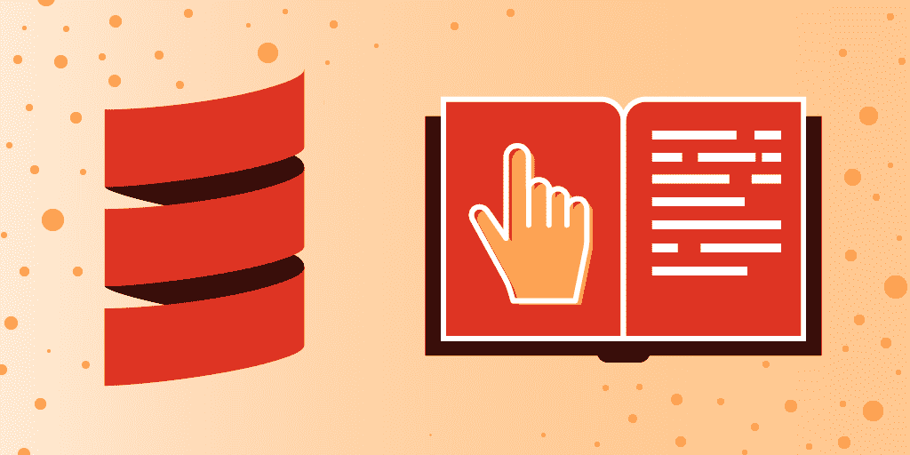
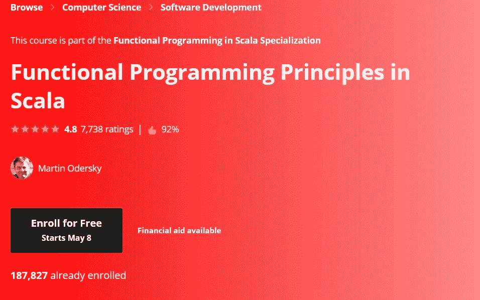
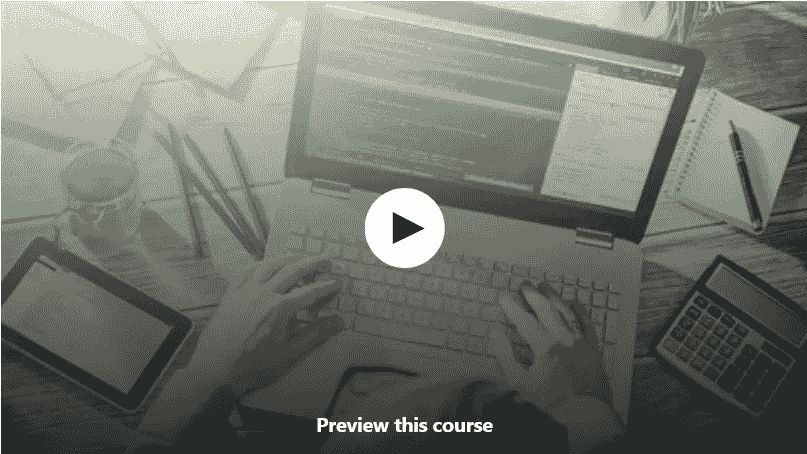
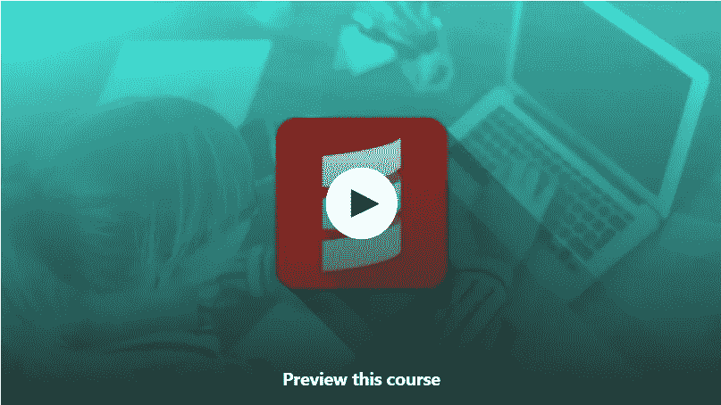
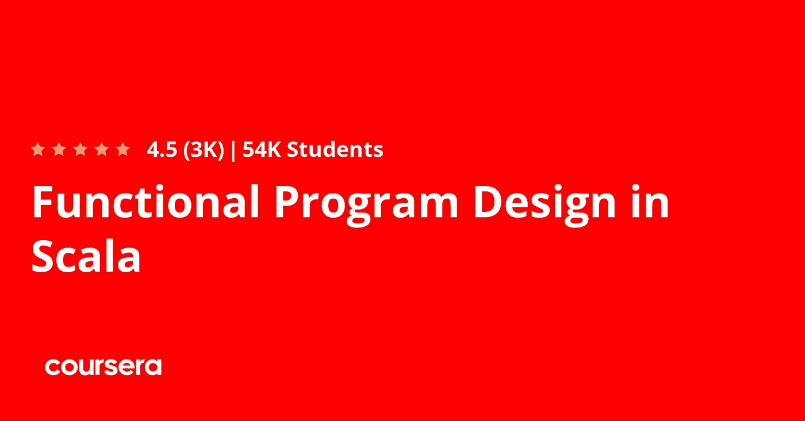

# 2023 年在线学习的 7 门最佳免费 Scala 和函数式编程课程

> 原文：<https://medium.com/javarevisited/7-free-scala-and-functional-programming-courses-for-beginners-370f3cd41a4e?source=collection_archive---------0----------------------->

## 我最喜欢的 2023 年学习 Scala 和函数式编程的免费在线课程、认证和教程来自 Udemy、Coursera、Pluralsight 和 Educative。

image_credit —教育性

大家好，如果你想在 2023 年学习 Scala 和函数式编程，并寻找最好的资源，那么你来对地方了。早些时候，我已经分享了最好的 Scala 课程</javarevisited/10-best-scala-and-functional-programming-online-courses-for-beginners-b6461b27bf>**，在这篇文章中，我将分享从 Udemy、Coursera、Educative 等热门网站学习 Scala 和函数式编程的最好的免费课程。**

**您可能知道 Scala 是一种强大的面向对象的函数式编程语言，长期以来一直被吹捧为 Java 的继承者，或将在未来取代 Java。**

**嗯，这在过去几年里并没有发生，但是 [Scala](https://javarevisited.blogspot.com/2018/01/10-reasons-to-learn-scala-programming.html) 无疑已经取得了很大的进步，并且已经确立了自己作为一种可扩展编程语言的地位。**

**如果你是一个社交媒体用户，并且知道 Twitter，那么让我告诉你，他们正在使用 Scala，这证明了 [Scala](/javarevisited/why-java-developer-should-learn-scala-programming-in-2020-3ca01a47eb0d) 拥有你需要的所有工具来构建一个像 Twitter 这样的高性能、可扩展的应用程序，而且 Twitter 不是唯一一家正在使用 Scala 的公司。如果你看看 Scala 的网站，你会发现 IBM、高盛、威瑞森和 SAP 都在用 Scala 解决他们的问题。**

**如果你是 Java 开发人员或者想学习和探索 Scala 的人，那么我必须祝贺你，这是一个伟大的决定。以前分享过[最好的 Scala 课程](https://javarevisited.blogspot.com/2020/09/top-5-courses-to-learn-scala.html#axzz6aeNM5Zax)、[书籍](http://javarevisited.blogspot.sg/2017/04/5-books-to-learn-scala-and-functional-programming.html#axzz56TfcHxTJ)、[文章](https://hackernoon.com/10-reasons-to-learn-scala-and-functional-programming-2fce385e6ec7)、[面试题](https://javarevisited.blogspot.com/2017/03/top-30-scala-and-functional-programming.html)学习 Scala，今天分享一些 2023 年学习 Scala 的免费在线课程。

你可能已经知道 Scala 是**可扩展语言的缩写，**或者应该说是可扩展编程语言。它实际上是一种现代的多范例编程语言，旨在以简洁、优雅和类型安全的方式表达常见的编程模式。**

**Scala 也是许多重要框架的编程语言，包括 Apache Spark、Kafka 和 Akka。它为 Twitter、Tumblr 和 Coursera 等网站提供核心基础设施。为了给你一些关于 Scala 的历史，它是由 EPFL 的 Martin Odersky 写的。实际上是谁结合了前辈们最好的部分，如 [Java](http://www.java67.com/2018/08/top-10-free-java-courses-for-beginners-experienced-developers.html) 、 [C++](http://www.java67.com/2018/02/5-free-cpp-courses-to-learn-programming.html) 以及其他函数式编程语言，如 Haskell，来创造这个。

最棒的是和 Java 类似，Scala 也是静态类型的，运行在 JVM 上。它既是[功能性的](http://www.java67.com/2018/10/java-8-stream-and-functional-programming-interview-questions-answers.html)又是[面向对象的](https://javarevisited.blogspot.com/2018/08/5-object-oriented-programming-and-design-courses-for-Java-programmers.html)并且完全可以与 Java 互操作。简而言之，Scala 被设计成以一种简洁、优雅、类型安全的方式来表达常见的编程模式。**

**顺便说一句，如果你不介意花钱学习像 Scala 这样有价值的东西并寻找全面的资源，那么你绝对应该看看[**Rock JVM！Scala 和函数式编程初学者**Udemy 上的](https://click.linksynergy.com/fs-bin/click?id=JVFxdTr9V80&subid=0&offerid=323058.1&type=10&tmpid=14538&RD_PARM1=https%3A%2F%2Fwww.udemy.com%2Frock-the-jvm-scala-for-beginners%2F)课程，学习 Scala 和函数式编程的最佳课程之一。**

**<https://click.linksynergy.com/fs-bin/click?id=JVFxdTr9V80&subid=0&offerid=323058.1&type=10&tmpid=14538&RD_PARM1=https%3A%2F%2Fwww.udemy.com%2Frock-the-jvm-scala-for-beginners%2F>  

# 2023 年学习 Scala 和函数式编程的 7 门最佳免费课程

有些人不喜欢从免费课程中学习，认为它们质量低劣，纯粹是浪费时间，但事实并非总是如此。我同意付费课程一般质量更好，但这些免费课程大多是那样的。他们只是出于宣传和教育的目的，从他们的讲师那里免费获得，一旦达到目标，可能会转换为付费课程。

事不宜迟，下面是我列出的 2023 年学习 Scala 的一些最佳课程。

## 1.[Scala 中的函数式编程原理](https://coursera.pxf.io/c/3294490/1164545/14726?u=https%3A%2F%2Fwww.coursera.org%2Flearn%2Fscala-functional-programming)【免费】

这是从 Coursera 学习 Scala 和函数式编程的最好的在线课程之一。这门课程不是别人，正是 Scala 的创造者 Martin Oderskey 自己创建的，由 EPFL 提供。

在本课程中，您将学习函数式编程风格的元素，并学习如何在日常编程任务中有效地应用它们，例如建模业务领域或实现业务逻辑。

本课程也是 Scala Specialization 中 [**函数式编程原理的一部分，后者是一个最好的 Scala 课程集合，包含编程练习和项目。完成所有的课程、项目和评估将会给你一个证书。**](https://coursera.pxf.io/c/3294490/1164545/14726?u=https%3A%2F%2Fwww.coursera.org%2Fspecializations%2Fscala)

在本课程中，通过触及不变量的证明和符号化的执行追踪，你还将为函数式程序的推理打下坚实的基础。

课程是动手操作；大多数单元引入短程序，作为重要概念的说明，并邀请你玩它们，修改和改进它们。

**这里是加入这个 Scala 课程的链接**——[Scala 中的函数式编程原理](https://coursera.pxf.io/c/3294490/1164545/14726?u=https%3A%2F%2Fwww.coursera.org%2Flearn%2Fscala-functional-programming)

但是为什么当参加审计专业的免费课程时，你将不会得到任何证书。如果你参加这个课程是为了获得 Coursera 证书，那么你需要注册专业化或者参加像 [**Coursera Plu**](https://coursera.pxf.io/c/3294490/1164545/14726?u=https%3A%2F%2Fwww.coursera.org%2Fcourseraplus) s 这样的订阅计划，该计划提供 5000 多个 Coursera 课程、项目和专业证书的无限制访问。

<https://coursera.pxf.io/c/3294490/1164545/14726?u=https%3A%2F%2Fwww.coursera.org%2Fcourseraplus>  

## [2。面向初学者的 Scala 编程迷你训练营](https://click.linksynergy.com/fs-bin/click?id=JVFxdTr9V80&subid=0&offerid=634352.1&type=10&tmpid=14538&RD_PARM1=https%3A%2F%2Fwww.udemy.com%2Fscala-programming-complete-mini-boot-camp-beginner-to-advance%2F)

这是 Udemy 中学习 Scala 最好的免费课程之一。该课程是为想从头开始学习 Scala 编程的人设计的。

由 [**Joydeep Ghosh**](https://click.linksynergy.com/deeplink?id=CuIbQrBnhiw&mid=39197&murl=https%3A%2F%2Fwww.udemy.com%2Fuser%2Fjoydipghosh2%2F) 打造，这个免费的 Scala 课程也不指望任何 Scala 的先验知识。最棒的是，你可以用 Scala 做很多编程练习，这使得它非常实用。

以下是本课程涉及的一些主题:

*   安装指南
*   变量
*   价值观念
*   功能
*   目录

简而言之，从免费的 [Scala 开始的一门优秀的小课程](http://javarevisited.blogspot.sg/2014/01/top-5-free-books-to-learn-scala-programming-PDF.html)。它只有一个小时，所以你不会花太多时间学习 Scala，但是在完成本教程后，你会发现自己在使用 Scala 方面达到了中等专业水平。

这里是加入这个免费课程——[的链接。面向初学者的 Scala 编程迷你训练营](https://click.linksynergy.com/fs-bin/click?id=JVFxdTr9V80&subid=0&offerid=634352.1&type=10&tmpid=14538&RD_PARM1=https%3A%2F%2Fwww.udemy.com%2Fscala-programming-complete-mini-boot-camp-beginner-to-advance%2F)

## 3.[升级 Scala 培训—设置说明](https://click.linksynergy.com/deeplink?id=CuIbQrBnhiw&mid=39197&murl=https%3A%2F%2Fwww.udemy.com%2Fcourse%2Fstairway-to-scala-setup-instructions%2F)

这是另一个不错的小课程，它将教你如何在 Linux 中设置 Scala，特别是如何运行 Activator、Scala 和合适的 Scala IDEs，如 IntelliJ IDEA 或 Eclipse。

实际上，这门课是对其他[迪克沃尔](https://click.linksynergy.com/deeplink?id=CuIbQrBnhiw&mid=39197&murl=https%3A%2F%2Fwww.udemy.com%2Fuser%2Frichard-wall%2F)课程的介绍，比如 [**Scala 应用**](https://click.linksynergy.com/deeplink?id=CuIbQrBnhiw&mid=39197&murl=https%3A%2F%2Fwww.udemy.com%2Fcourse%2Fstairway-to-scala-applied-part-1%2F) 和 [**Scala 高级课程**](https://click.linksynergy.com/deeplink?id=CuIbQrBnhiw&mid=39197&murl=https%3A%2F%2Fwww.udemy.com%2Fcourse%2Fscala-advanced-part-1-the-scala-type-system%2F) ，从这个角度来看非常完美。

教师提供简单的分步说明，并在最后对配置进行某种回顾。唯一的问题是课程很简洁，所以除了设置之外，你不会得到太多，但这难道不是学习一项新技术最具挑战性的部分吗？

**这里是加入 Scala 课程的链接**——[升级 Scala 培训](https://click.linksynergy.com/deeplink?id=CuIbQrBnhiw&mid=39197&murl=https%3A%2F%2Fwww.udemy.com%2Fcourse%2Fstairway-to-scala-setup-instructions%2F)

## [4。Scala:入门](https://pluralsight.pxf.io/c/1193463/424552/7490?u=https%3A%2F%2Fwww.pluralsight.com%2Fcourses%2Fscala-getting-started) [Pluralsight]

这是一门真正的 Scala 课程，它不仅会教你 Scala 的基础知识，还会教你如何编写更少的样板代码和更多的业务代码。

课程从零开始，让你快速熟悉 Scala 的一些最强大的特性，比如 REPL、模式匹配、理解、[递归](https://javarevisited.blogspot.com/2012/12/recursion-in-java-with-example-programming.html)、[不变性](http://javarevisited.blogspot.sg/2013/03/how-to-create-immutable-class-object-java-example-tutorial.html)、互操作性等等。如果你正在寻找新的、令人兴奋的、最重要的是简洁的东西，那么 Scala 就是适合你的语言，而这门课就是学习它的课程。

**这里是加入本课程的链接** — [Scala:入门](https://pluralsight.pxf.io/c/1193463/424552/7490?u=https%3A%2F%2Fwww.pluralsight.com%2Fcourses%2Fscala-getting-started)

顺便说一句，你需要一个 [**Pluralsight 会员**](https://pluralsight.pxf.io/c/1193463/424552/7490?u=https%3A%2F%2Fwww.pluralsight.com) 才能进入这个课程，费用大约是每月 29 美元或每年 299 美元(14%的折扣)。如果你还没有 Pluralsight 会员资格，我鼓励你申请一个，因为它可以让你访问他们 5000 多门关于所有最新主题的在线课程，如前端和后端开发、机器学习等。它还包括交互式测验、练习和最新的认证材料。他们还提供为期 10 天的免费试用，无需任何承诺，这是一个很好的方式，不仅可以免费学习这门课程，还可以在加入 Pluralsight 之前检查课程的质量。

<http://pluralsight.pxf.io/c/1193463/424552/7490?u=https%3A%2F%2Fwww.pluralsight.com%2Flearn>  

## [5。Scala 和 Spark 2 —入门](https://click.linksynergy.com/fs-bin/click?id=JVFxdTr9V80&subid=0&offerid=634352.1&type=10&tmpid=14538&RD_PARM1=https%3A%2F%2Fwww.udemy.com%2Fscala-and-spark-2-getting-started%2F)

你可能不知道，Scala 在大数据领域非常受欢迎，因为它的速度和一些强大的框架，如 [Spark](/javarevisited/5-free-courses-to-learn-apache-spark-in-2020-bdff2d60c800) 。

本课程将教你如何设置开发环境来构建基于 Scala 的 Spark 应用，这是学习一门新的编程语言或框架最重要的事情。

你将学习如何下载和设置 Scala 和 [Spark](https://javarevisited.blogspot.com/2017/12/top-5-courses-to-learn-big-data-and.html) 、IntelliJ IDEA 和 Scala 插件，以及如何在 IDEA 上开发 Scala 应用。简而言之，如果你正在学习 Scala 来解决大数据领域的一些问题，这是一门完美的课程。

**这里是加入这个免费课程的链接** — [Scala 和 Spark 2 —入门](https://click.linksynergy.com/fs-bin/click?id=JVFxdTr9V80&subid=0&offerid=634352.1&type=10&tmpid=14538&RD_PARM1=https%3A%2F%2Fwww.udemy.com%2Fscala-and-spark-2-getting-started%2F)

## 6.[Scala 中的函数式程序设计](https://coursera.pxf.io/c/3294490/1164545/14726?u=https%3A%2F%2Fwww.coursera.org%2Flearn%2Fscala-functional-program-design)【免费 Coursera 课程】

这是 Coursera 和 Martin Oderskey 的另一门免费 Scala 课程，是 Scala 专业化 中 [**函数式编程原则的一部分。在本课程中，你将学习如何在更大的 Scala 应用程序的设计中应用函数式编程风格。您将了解重要的新函数式编程概念，从惰性求值到使用单子构建库。**](https://coursera.pxf.io/c/3294490/1164545/14726?u=https%3A%2F%2Fwww.coursera.org%2Fspecializations%2Fscala)

你还将研究更大更复杂的例子，从状态空间探索到随机测试到离散电路模拟器。

您还将学习一些在现实世界中如何编写好的 Scala 代码的最佳实践。最后，您将学习如何利用编译器的能力从类型中推断值。

**这里是加入这个免费 Scala 课程的链接**——[Scala 中的函数式程序设计](https://coursera.pxf.io/c/3294490/1164545/14726?u=https%3A%2F%2Fwww.coursera.org%2Flearn%2Fscala-functional-program-design)

顺便说一下，如果你觉得 Coursera 的课程有用，那么你也可以获得 [**Coursera Plus**](https://coursera.pxf.io/c/3294490/1164545/14726?u=https%3A%2F%2Fwww.coursera.org%2Fcourseraplus) ，这是 Coursera 的一个订阅计划，让你可以无限制地访问他们最受欢迎的课程、专业、专业证书和指导项目。

<https://coursera.pxf.io/c/3294490/1164545/14726?u=https%3A%2F%2Fwww.coursera.org%2Fcourseraplus>  

## 7.[从零开始学习 Scala】【免费教育课程】](https://www.educative.io/courses/learn-scala-from-scratch?affiliate_id=5073518643380224)

这是另一个为初学者学习 Scala 的非常棒的免费在线课程。本课程由 [**教育**](https://www.educative.io/subscription?affiliate_id=5073518643380224) 平台提供，这是一个基于文本的交互式在线学习平台。

Scala 为你提供了简单有效地构建可伸缩程序的工具。它是一种静态类型的高级语言，将函数式编程和面向对象编程结合到一个灵活的包中。

这门免费的 Scala 课程将帮助你保持领先地位，制作出色的、可扩展的应用程序，并学习一门令人垂涎的新编程语言。它有超过 12 个小时的材料，121 课，9 个测验，20 个挑战，191 个操场，142 幅插图。

**这里是加入这个免费课程的链接**——[从头开始学习 Scala】](https://www.educative.io/courses/learn-scala-from-scratch?affiliate_id=5073518643380224)

而且，如果你发现教育平台和他们的搜索课程，像[搜索系统设计面试](https://www.educative.io/collection/5668639101419520/5649050225344512?affiliate_id=5073518643380224)，搜索面向对象编程面试，然后考虑获得 [**教育订阅**](https://www.educative.io/subscription?affiliate_id=5073518643380224) ，提供每月 18 美元的 250 多门课程。非常划算，非常适合准备编码面试。

<https://www.educative.io/subscription?affiliate_id=5073518643380224>  

以上就是学习 Scala 编程语言的一些**免费在线课程。如果你是一名 Java 开发人员或想学习 Scala 的人，这些免费课程可以为你提供一个发射台，开始你在 Scala 世界的美好旅程。**

尽管这些规模课程都是免费的，除了 Pluralsight 上的一个需要会员资格，但要小心 Udemy 上的免费课程变成了付费课程。在你加入他们之前，一定要核实一下课程的价格。

其他**编程课程**和**文章**你可能喜欢

*   [2023 年 Java 开发者路线图](https://javarevisited.blogspot.com/2019/10/the-java-developer-roadmap.html)
*   [2023 年学习 Spring 框架的前 6 门课程](https://javarevisited.blogspot.com/2018/06/top-6-spring-framework-online-courses-Java-programmers.html)
*   [我最喜欢的学习软件架构的课程](/javarevisited/top-5-courses-to-learn-software-architecture-in-2020-best-of-lot-5d34ebc52e9)
*   [2023 年 Java 开发人员应该学会的 10 件事](https://javarevisited.blogspot.com/2017/12/10-things-java-programmers-should-learn.html#axzz5atl0BngO)
*   [深入学习 Spring 框架的 5 门课程](https://javarevisited.blogspot.com/2018/06/top-6-spring-framework-online-courses-Java-programmers.html)
*   [学习和掌握 IntelliJ IDEA 和 Android Studio 的 5 条途径](https://javarevisited.blogspot.com/2018/09/top-5-courses-to-learn-intellij-idea-java-and-android-development.html)
*   [2023 年学习机器学习和数据科学的 10 门课程](https://javarevisited.blogspot.com/2018/10/data-science-and-machine-learning-courses-using-python-and-R-programming.html)
*   [面向程序员的 2023 年 DevOps 路线图](https://javarevisited.blogspot.com/2018/09/the-2018-devops-roadmap-your-guide-to-become-DevOps-Engineer.html)
*   [2023 年学习 Spring Boot 的十大课程](/javarevisited/top-10-courses-to-learn-spring-boot-in-2020-best-of-lot-6ffce88a1b6e)
*   Java 和 Web 开发人员应该学习的 10 个框架
*   [面向程序员的 5 大 Java 设计模式课程](https://javarevisited.blogspot.com/2018/02/top-5-java-design-pattern-courses-for-developers.html)
*   [5 门免费课程学习芯泉和 Spring Boot](http://www.java67.com/2017/11/top-5-free-core-spring-mvc-courses-learn-online.html)
*   [面向程序员和工程师的 10 门 DevOps 课程](https://javarevisited.blogspot.com/2018/09/10-devops-courses-for-experienced-java-developers.html)
*   [学习 Java 集合和流的 7 门最佳课程](/javarevisited/7-best-java-collections-and-stream-api-courses-for-beginners-in-2020-3ad18d52c38)
*   [编码面试的 10 门最佳系统设计课程](/javarevisited/10-best-system-design-courses-for-coding-interviews-949fd029ce65)

感谢您阅读本文。如果你喜欢这些最好的*免费 Scala 和函数式编程课程*，那么请分享给你的朋友和同事。如果您有任何问题或反馈，请留言。

**附言——**如果你正在寻找最好的 Scala 课程，并且不介意支付一些费用，那么[**摇滚 JVM！面向初学者的 Scala 和函数式编程**](https://click.linksynergy.com/fs-bin/click?id=JVFxdTr9V80&subid=0&offerid=323058.1&type=10&tmpid=14538&RD_PARM1=https%3A%2F%2Fwww.udemy.com%2Frock-the-jvm-scala-for-beginners%2F) 是一门完美的入门课程。这将是 2023 年学习 Scala 的正确选择。

<https://click.linksynergy.com/fs-bin/click?id=JVFxdTr9V80&subid=0&offerid=323058.1&type=10&tmpid=14538&RD_PARM1=https%3A%2F%2Fwww.udemy.com%2Frock-the-jvm-scala-for-beginners%2F> **