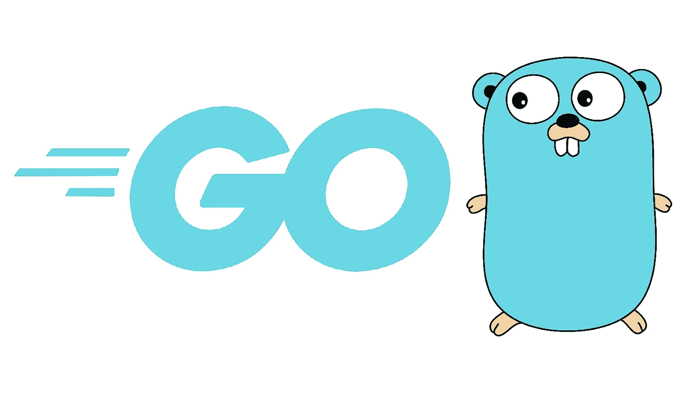
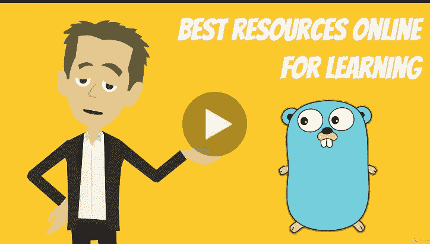
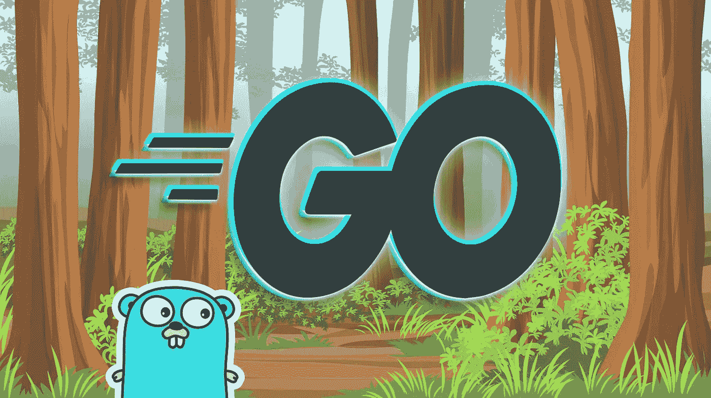
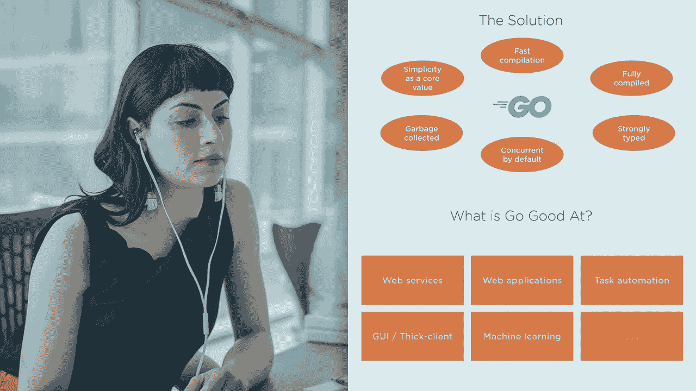
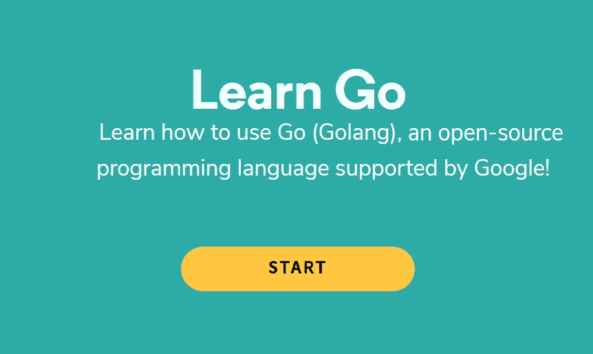
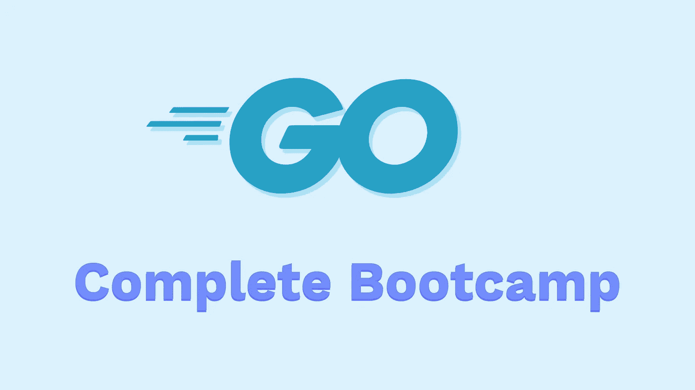
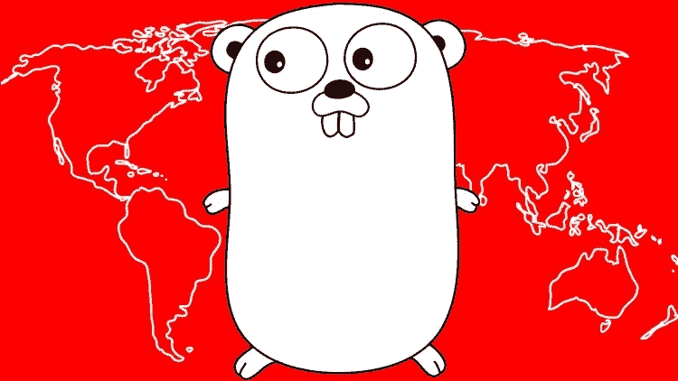
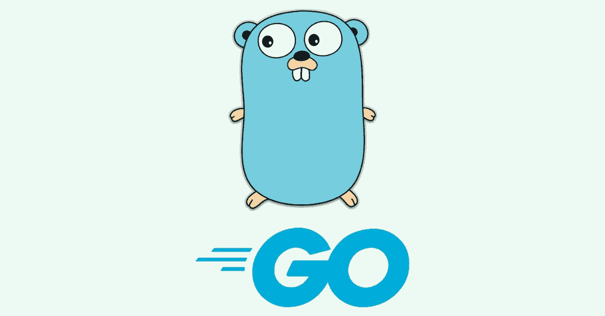
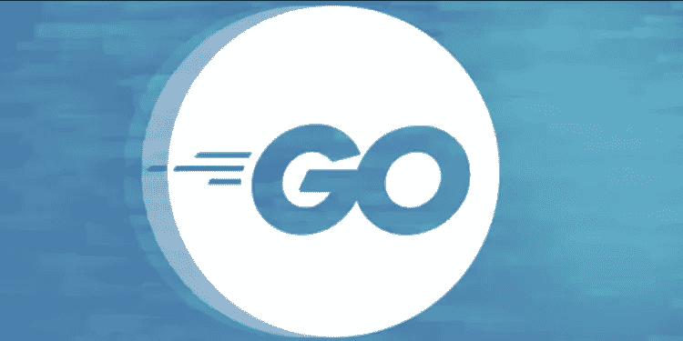

# 2023 年学习 Golang/Go 的 10 大在线课程—最佳选择

> 原文：<https://medium.com/javarevisited/7-online-courses-to-learn-golang-or-go-programming-languages-in-2020-f599a25cf14a?source=collection_archive---------0----------------------->

## 这些是从 Udemy、Pluralsight、Coursera 和 CodeCademy 学习围棋编程语言的最佳在线培训课程。

伙计们，今天，我要分享一种最流行的现代编程语言，叫做 Go 或 Golang。这种强大的编程语言是由 Google 创建的，目的是使他们的软件开发过程更流畅、更好，所以你可以想象这种编程语言带来的强大和简单。

2009 年，谷歌开始创造一种新的编程语言**，这种语言速度快、效率高、编码有趣**，但不影响可读性、生产率和简单性，这就是“如何编程语言”的诞生。

即使谷歌的名字还不够，这种编程语言是由 Ken Thompson 创造的，他发明了久经考验的技术，如 [C 编程语言](https://javarevisited.blogspot.com/2019/11/top-5-courses-to-learn-c-programming-in.html)和 [UNIX 操作系统](https://javarevisited.blogspot.com/2018/02/5-courses-to-learn-shell-scripting-in-linux.html)，以及两名谷歌员工 Robert Griesemer 和 Rob Pike 的重要贡献。

> Golang 是由谷歌设计的，其固有的快速、可靠和高效得到了网飞、优步，当然还有谷歌等公司的信任。

谷歌专门为其广泛的服务器网络使用 Go，Go 也为谷歌自己的云平台 [GCP](https://javarevisited.blogspot.com/2020/05/top-5-course-to-crack-google-cloud-associate-cloud-engineer-certification-exam.html) 或[谷歌云平台](https://javarevisited.blogspot.com/2019/07/top-5-google-cloud-platform-gcp-courses-certifications-online.html)提供支持。世界各地的软件开发人员在应用程序开发、web 开发、运营和基础设施团队等领域使用 Go。

也是云原生基础设施和[软件开发](/javarevisited/11-essential-skills-to-become-software-developer-in-2020-c617e293e90e)的流行语言之一。如果你想在 2023 年学习围棋，并寻找一些类似*在线培训课程*的优秀资源，那么你来对地方了。

在这篇文章中，我将为初学者和有经验的开发人员分享一些学习 Golang 或 [*Go 编程语言*](/@javinpaul/what-is-go-or-golang-programming-language-why-learn-go-in-2020-1cbf0afc71db) *的*最佳课程。所有的课程都是完全在线的，你可以在舒适的办公室或家里学习。**

# 2023 年学习 Golang 的 10 个最佳在线培训课程

无论如何，在不浪费你更多时间的情况下，这里是我列出的从头开始学习 Go 或 Golang 编程语言的一些最佳课程。列表包括免费和最好的课程，而且价格也很实惠。你可以在 Udemy 上花 9.9 美元买到大多数课程。

## 1. [Go:完全开发者指南(Golang)](https://click.linksynergy.com/deeplink?id=JVFxdTr9V80&mid=39197&murl=https%3A%2F%2Fwww.udemy.com%2Fcourse%2Fgo-the-complete-developers-guide%2F) — Udemy

这是另一个在 Udemy 上学习 Go 编程语言(Golang)的基础和高级特性的很棒的课程。

由斯蒂芬·格里德教授，这是一门经过深思熟虑、结构严谨的课程。这也是为数不多的几门课程之一，在这里你将学到 Golang 的一些强大而先进的特性，比如它的**并发模型**和接口类型系统。Stephen Grider 也是我在 Udemy 上最喜欢的导师之一，参加过他的[**Modern React with Redux**](https://click.linksynergy.com/deeplink?id=JVFxdTr9V80&mid=39197&murl=https%3A%2F%2Fwww.udemy.com%2Fcourse%2Freact-redux%2F)和其他几门课程，我可以说他的课程完全值得你的时间和金钱。

谈到社交证明，这门课程受到了超过 34000 名学生的信任，平均而言，它拥有来自近 9300 名参与者的 4.6 分的评分，这很令人惊讶。

**这是在线参加本课程的链接** — [Go:完全开发者指南(Golang)](https://click.linksynergy.com/deeplink?id=JVFxdTr9V80&mid=39197&murl=https%3A%2F%2Fwww.udemy.com%2Fcourse%2Fgo-the-complete-developers-guide%2F)

## 2. [Go 编程(Golang):完整的开发者指南](https://academy.zerotomastery.io/p/learn-golang?affcode=441520_zytgk2dn)

这是 2023 年又一个从零开始学习 Golang 编程与开发的牛逼在线课程。这个课程是 Andrei 的团队在 ZTM 学院创建的，它将从头开始教你 Go 编程语言！不需要以前的经验。

这个 10.5 小时的课程是由 Jayson Lennon 的 Golang 专家创建的，他将教你在 2023 年成为 Golang 开发者所需学习的一切。

你不仅会学到 golang 的基础知识和基本概念，还会学到高级并发技术，这样你就能从初学者成为一名 Go 开发者了！

该课程附带 23 个以上的额外练习、项目和资源，您还将构建一个企业级项目，包括一个视频共享应用程序，您可以将其添加到您的开发人员组合中。

**这里是加入本课程的链接**——[Go 编程(Golang):完全开发者指南](https://academy.zerotomastery.io/p/learn-golang?affcode=441520_zytgk2dn)

顺便说一句，你需要一个 [**ZTM 会员**](https://academy.zerotomastery.io/a/aff_c0gnlvf7/external?affcode=441520_zytgk2dn) 来观看这个课程，这个课程每月花费大约 23 美元，但也提供了许多超级吸引人和有用的课程，比如这个 [J *avaScript Web 项目:20 个项目来建立你的投资组合课程* e](https://academy.zerotomastery.io/p/javascript-projects?affcode=441520_zytgk2dn) 。您还可以使用我的代码朋友 10 获得您选择的任何订阅的 10%的折扣。

 [## 学习编码。被录用。加入零至掌握学院。|零到精通

### 不要在无聊、过时的教程上浪费时间。加入 500，000 多名学生的行列，学习编程，获得聘用并在以下领域取得成功…

academy.zerotomastery.io](https://academy.zerotomastery.io/a/aff_c0gnlvf7/external?affcode=441520_zytgk2dn) 

## 3.[用 Google Go 专门化编程](https://coursera.pxf.io/c/3294490/1164545/14726?u=https%3A%2F%2Fwww.coursera.org%2Fspecializations%2Fgoogle-golang) (Coursera)

你可能会有点惊讶，Coursera 在围棋编程语言方面也有专长，由 os 继续教育部门提供。

本专业介绍来自 Google 的 Go 编程语言，为学习者提供 Go 的特色概述。

这个专精有 3 门课程:
1。[Go](https://coursera.pxf.io/c/3294490/1164545/14726?u=https%3A%2F%2Fwww.coursera.org%2Flearn%2Fgolang-getting-started)2 入门。[Go](https://coursera.pxf.io/c/3294490/1164545/14726?u=https%3A%2F%2Fwww.coursera.org%2Flearn%2Fgolang-functions-methods)
3 中的函数、方法、接口。[Go 中的并发性](https://coursera.pxf.io/c/3294490/1164545/14726?u=https%3A%2F%2Fwww.coursera.org%2Flearn%2Fgolang-concurrency)

所有这些课程都是 Ian Harris 想出来的，在完成三个课程序列后，学习者将获得使用 Go 创建简洁、高效、干净的应用程序所需的知识和技能。一旦你完成了所有的测验、作业和项目，你还会得到一份结业证书。

你可以把这个认证放在你的简历或者 LinkedIn 个人资料上，展示你懂 Golang——谷歌的编程语言。

**这里是在线加入本课程的链接**——[Google Go 专业化编程](https://coursera.pxf.io/c/3294490/1164545/14726?u=https%3A%2F%2Fwww.coursera.org%2Fspecializations%2Fgoogle-golang)

如果你发现 Coursera 的课程很有用，因为它们是由知名公司如**谷歌**、 **IBM** 、**亚马逊**和世界上最好的大学创建的，我建议你加入 Coursera 的订阅计划 [**Coursera Plus**](https://coursera.pxf.io/c/3294490/1164545/14726?u=https%3A%2F%2Fwww.coursera.org%2Fcourseraplus)

这种单一订阅让你可以无限制地访问他们最受欢迎的**课程**、**专业化**、**专业证书**和**指导项目**。它每年花费大约 399 美元，但是它完全值你的钱，因为你得到了**无限证书**。

 [## Coursera Plus |无限制访问 7，000 多门在线课程

### 用 Coursera Plus 投资你的职业目标。无限制访问 90%以上的课程、项目…

coursera.pxf.io](https://coursera.pxf.io/c/3294490/1164545/14726?u=https%3A%2F%2Fwww.coursera.org%2Fcourseraplus) 

## 4.奈杰尔·波尔顿的围棋基础

这是 2023 年在 Pluralsight 上学习 Golang 的另一个在线课程。如果你有 Pluralsight 会员资格，并且正在寻找一个很棒的 Golang 课程，那么你应该加入这个课程。

这个课程是由 Nigel Poulton 创建的，他是 Pluralsight 上 [Docker Deep Dive](https://pluralsight.pxf.io/c/1193463/424552/7490?u=https%3A%2F%2Fwww.pluralsight.com%2Fcourses%2Fdocker-deep-dive-update) 课程的作者，这是我学习 Docker 最喜欢的课程，这个课程也不负众望。

在本课程中，你将学习如何使用谷歌越来越流行的 Go 编程语言进行编程。从零开始，假设没有任何先验知识，这门课程会让你感觉编写小型围棋程序很舒服，并熟悉这些语言的所有主要特性

。如果你不知道，这门课程的讲师 Nigel Poulton 是一名 Docker 队长和流行技术作者。他以关于云原生技术的引人入胜的视频和书籍而闻名，如 [Docker](https://javarevisited.blogspot.com/2018/02/10-free-docker-container-courses-for-Java-Developers.html#axzz63ewnlq5p) 和 [Kubernetes](https://javarevisited.blogspot.com/2019/05/top-5-courses-to-learn-docker-and-kubernetes-for-devops.html) 。

**这是在线参加本课程的链接** — [围棋基础](https://pluralsight.pxf.io/c/1193463/424552/7490?u=https%3A%2F%2Fwww.pluralsight.com%2Fcourses%2Fgo-fundamentals)

顺便说一句，你需要一个 [**Pluralsight 会员**](https://pluralsight.pxf.io/c/1193463/424552/7490?u=https%3A%2F%2Fwww.pluralsight.com%2Fpricing) 才能加入这个课程，费用大约是每月 29 美元，每年 299 美元(14%的折扣)，但是完全值得。另类。你也可以使用他们的 [**10 天免费试用**](https://pluralsight.pxf.io/c/1193463/424552/7490?u=https%3A%2F%2Fwww.pluralsight.com%2Flearn) 来免费观看这个课程。

 [## 为个人培养更好的技术技能| Pluralsight

### 培养从网络安全到软件开发等各方面的技能。然后利用这些技能…

pluralsight.pxf.io](https://pluralsight.pxf.io/c/1193463/424552/7490?u=https%3A%2F%2Fwww.pluralsight.com%2Flearn) 

## 5.[学习继续代码学院](https://www.gopjn.com/t/TUJGR0lLR0JHRklJSkhCR0ZISk1N?url=https%3A%2F%2Fwww.codecademy.com%2Flearn%2Flearn-go)

如果你一直在网上学习，那么你可能知道 CodeCademy，这是交互式网上学习的最佳场所之一。我使用过 [CodeCademy](https://www.codecademy.com/pro/community) 学习 Python、Java、Bash 和 JavaScript，我可以说它们提供了最好的学习体验。

你会很高兴知道他们也有一个学习 Go (Golang)编程语言的互动课程，最棒的是它是与[谷歌](https://javarevisited.blogspot.com/2012/01/google-interview-questions-answers-top.html)合作创建的，谷歌也是 [Golang](https://www.java67.com/2019/12/top-5-courses-to-learn-go-or-golang.html) 的创建者和支持者。

这是在线学习 Go 编程语言的最具**实践性和互动性的课程**，因为你不仅会听到像变量、条件和函数这样的 Go 基础知识，还会用 Go 编程语言构建几个项目。你将学习语法，参加如何声明函数的测验，并从事像星际旅行社的飞行协调员这样的项目。如果你喜欢**基于项目的**和**互动学习**，这是学习 Go online 的最佳课程。

“学习围棋”的前四个模块目前正在 CodeCademy 中运行，而且它们**完全免费**。

这里是在线参加本课程的链接——[继续在代码学院学习](https://www.gopjn.com/t/TUJGR0lLR0JHRklJSkhCR0ZISk1N?url=https%3A%2F%2Fwww.codecademy.com%2Flearn%2Flearn-go)

## 6.Go (Golang):完整训练营(Udemy 最佳课程)

这是另一门很好的课程。去吧，乌代米。本课程最棒的部分是它非常直观，你会发现很多动画有助于你更好地理解这个概念。

课程还有 1 个 **000+动手练习**和**项目**，这对学习技术非常重要。是的，你只是不能通过阅读或观看视频来学习，除非你开始[编码](/javarevisited/top-20-sites-to-learn-coding-in-2020-f57ff63d9cb3)并构建一些东西。由何塞·马西亚尔·波尔蒂利亚和英南·古穆斯创建的这门课程受到了 7000 多名学生的信任，平均有 4.5 个来自 1000 多个评级的评论，这充分说明了它的质量。何塞·波尔蒂利亚是我在 Udemy 上崇拜的另一位教练。参加过他的 [Python](https://click.linksynergy.com/deeplink?id=JVFxdTr9V80&mid=39197&murl=https%3A%2F%2Fwww.udemy.com%2Fcomplete-python-bootcamp%2F) 和 [SQL Bootcamp](https://click.linksynergy.com/fs-bin/click?id=JVFxdTr9V80&subid=0&offerid=323058.1&type=10&tmpid=14538&RD_PARM1=https%3A%2F%2Fwww.udemy.com%2Fthe-complete-sql-bootcamp%2F) 课程后，我可以保证他的课程质量，尽管他是这门课程的共同讲师，而且主要由英南·古穆斯教授，但质量非常好。

**这是在线参加本课程的链接**——[Go(Golang):完整训练营](https://click.linksynergy.com/deeplink?id=JVFxdTr9V80&mid=39197&murl=https%3A%2F%2Fwww.udemy.com%2Fcourse%2Flearn-go-the-complete-bootcamp-course-golang%2F)

老实说，花 10 美元上他的课就像是免费的一样；我不知道为什么它们卖 10 美元，这对于一个 22 小时的在线课程来说是非常低的，但作为一个学习者，这是一个你永远不想错过的交易。

## 7.[7 小时学会 Golang](https://www.youtube.com/watch?v=YS4e4q9oBaU)(FreeCodecamp 频道 Youtube)

这是 FreeCodeCamp 的 Youtube 频道上在线学习 Golang 的最好的免费课程之一。

学习围棋编程语言(Golang)在这个循序渐进的教程初学者。Go 是 Google 设计的一种开源编程语言，它使构建简单、可靠和高效的软件变得容易。

您可以在 Youtube 上免费观看该在线培训课程，也可以点击以下链接:

## 8.[围棋/围棋速成班](https://www.youtube.com/watch?v=SqrbIlUwR0U) — Taversy Media YouTube

这是 Youtube 上另一个学习 Golang 在线课程。这门课程是由我最喜欢的 Udemy 导师之一 [Brad Traversy](https://medium.com/u/861216ad5921?source=post_page-----f599a25cf14a--------------------------------) ，作者 [**现代 HTML & CSS 从头开始**](https://click.linksynergy.com/deeplink?id=JVFxdTr9V80&mid=39197&murl=https%3A%2F%2Fwww.udemy.com%2Fcourse%2Fmodern-html-css-from-the-beginning%2F) 和[现代 JavaScript 从头开始](https://click.linksynergy.com/deeplink?id=JVFxdTr9V80&mid=39197&murl=https%3A%2F%2Fwww.udemy.com%2Fcourse%2Fmodern-javascript-from-the-beginning%2F)课程。

在这个速成课程中，我们将开始学习 Go 编程语言。不需要围棋的先验知识。我们将建立一个工作空间，并查看变量、切片、条件、映射、结构等基础知识

您可以在 Taversy media youtube 频道上免费观看此在线培训课程，或点击以下链接:

## 9.[Golang(Go)行业 REST 微服务简介](https://click.linksynergy.com/deeplink?id=JVFxdTr9V80&mid=39197&murl=https%3A%2F%2Fwww.udemy.com%2Fcourse%2Fgolang-the-ultimate-guide-to-microservices-in-go-part-1%2F)

这是从 web 开发角度了解 Golang 的另一个很好的课程。由于其强大的功能和简单的开发模型，Go 编程语言是当今 web 开发的最佳选择。

比 [Ruby on Rails](/@javinpaul/top-5-free-courses-to-learn-ruby-and-rails-for-beginners-best-of-lot-e149fe03c964) 、 [Python](/swlh/5-free-python-courses-for-beginners-to-learn-online-e1ca90687caf) 、 [Django](https://www.java67.com/2020/06/top-5-courses-to-learn-django-and-python-for-web-development.html) 、 [Node.js](https://www.java67.com/2019/07/top-5-free-nodejs-courses-for-web-development.html) 、 [PHP](/javarevisited/top-10-free-courses-to-learn-php-and-mysql-for-web-development-e96e69982675) 、 [ASP](https://javarevisited.blogspot.com/2019/10/top-5-courses-to-learn-asp-net-in-2019.html) 等标准框架和编程语言要好得多。

您可以使用 Go 编程语言来创建 web 应用程序、Web APIs、微服务和其他分布式服务，本课程将教您这些。

这是一门综合课程，有 16 个小时的内容，教你使用 Go 编程语言创建 web 应用程序所需的一切。

谈到社交证明，这是 Udemy 上评分最高的 Golang 课程之一，211 名参与者的平均评分为 4.6，该课程已经得到了超过 1527 名学生的信任。

**这里是在线参加本课程的链接**——[Golang(Go)行业 REST 微服务介绍](https://click.linksynergy.com/deeplink?id=JVFxdTr9V80&mid=39197&murl=https%3A%2F%2Fwww.udemy.com%2Fcourse%2Fgolang-the-ultimate-guide-to-microservices-in-go-part-1%2F)

## 10. [Golang Mastry by Boot。开发](https://boot.dev/course/3b39d0f6-f944-4f1b-832d-a1daba32eda4/9e6acea2-8081-404d-9c34-3b5f677fa580/a74a68e0-9e85-4328-8868-5db0089ea11b/?via=javin)【互动课程】

这是另一个深入学习 Golang 的互动在线课程。我很久都不知道这个课程，但是当我知道它的时候，我真的很喜欢它。

Boot.dev 上的[“Go Mastery”课程](https://boot.dev/course/3b39d0f6-f944-4f1b-832d-a1daba32eda4/9e6acea2-8081-404d-9c34-3b5f677fa580/a74a68e0-9e85-4328-8868-5db0089ea11b/?via=javin)专门给你在 Go 中构建真实项目的实践经验。你学习的每一个概念都伴随着浏览器中的编码分配，他们的平台实际上检查你在每一步都得到预期的输出。

一旦你完成他们的课程，他们甚至会提供项目说明，这样你就可以从头开始学习如何构建一个真正的微服务。

您也可以使用我的代码“JAVIN 之友”获得本课程 10%的折扣。

**以下是参加本课程** — [Golang Mastry by Boot 的链接。开发](https://boot.dev/course/3b39d0f6-f944-4f1b-832d-a1daba32eda4/9e6acea2-8081-404d-9c34-3b5f677fa580/a74a68e0-9e85-4328-8868-5db0089ea11b/?via=javin)

 [## Go Mastery | Boot.dev

### Go 是一种开源编程语言，被成千上万的公司用来提供快速、高效和可靠的…

启动.开发](https://boot.dev/course/3b39d0f6-f944-4f1b-832d-a1daba32eda4/9e6acea2-8081-404d-9c34-3b5f677fa580/a74a68e0-9e85-4328-8868-5db0089ea11b/?via=javin) 

## 11.[围棋大师(Golang)编程:完整的围棋训练营 202](https://click.linksynergy.com/deeplink?id=JVFxdTr9V80&mid=39197&murl=https%3A%2F%2Fwww.udemy.com%2Fcourse%2Fmaster-go-programming-complete-golang-bootcamp%2F) 3 (Udemy 最佳课程)

这是从零开始学习 Go 编程语言最好最全面的课程之一。这个课程对初学者和有经验的开发者来说都是完美的，因为它不仅教你围棋，还教你编程。

课程充满了实例、动手忍者练习、动手练习的解决方案，以及令人惊叹的代码库。它还有计算机基础的课程，对初学者来说很棒。如果你正在学习编码并选择 **Golang** 作为[编程语言](https://dev.to/javinpaul/top-5-programming-languages-to-learn-to-get-a-job-at-google-facebook-microsoft-or-work-as-a-freelance-developer-3ma5)，这是你应该加入的课程。

超过 46.5 小时的内容，82，000 名学生和超过 11，000 条评论，这是真正的**最全面的 Go 编程语言课程**。

**以下是在线参加本课程的链接** — [围棋大师(Golang)编程:2023 年围棋训练营](https://click.linksynergy.com/deeplink?id=JVFxdTr9V80&mid=39197&murl=https%3A%2F%2Fwww.udemy.com%2Fcourse%2Fmaster-go-programming-complete-golang-bootcamp%2F)

## 12.[Go on educative . io 中的编程介绍](https://www.educative.io/courses/introduction-to-programming-in-go?affiliate_id=5073518643380224)

如果你正在寻找一个基于文本的课程来学习 2023 年的 Go 编程语言，那么 Eduative.io 上的 Go 课程中的编程介绍是一个很好的开始。

由于 Golang 的流行、并发支持和开发人员生产力的全面提高，许多程序员在 2023 年学习 Golang，像这样的课程使学习 Go 编程语言变得非常容易。

这门课程不仅为初学者提供了详细的围棋入门知识。但它也阐明了 Go 与程序员习惯的传统编程语言有什么不同。

以下是您将在本课程中学到的内容:

1.  数据类型和集合类型
2.  打包、导入和编码基础知识
3.  控制流程和方法
4.  接口和并发支持

在这个过程中，您还将解决 Golang 中的许多编码挑战，以便更好地学习这种编程语言。

**这里是加入本课程** — [围棋编程入门](https://www.educative.io/courses/introduction-to-programming-in-go?affiliate_id=5073518643380224)的链接

顺便说一句，你需要一个 [**教育订阅**](https://www.educative.io/subscription?affiliate_id=5073518643380224) 来加入这个课程，它不仅提供了对这个课程的访问，而且提供了 500 多个课程来学习基本的技术技能，为编码面试做准备，并作为一个开发人员提高自己。如果你想投资自己并提升你的技术技能，这是一个你绝对需要的订阅。

 [## 教育无限:保持领先

### 我们听到了您的反馈。你现在只需支付一次费用，就可以获得 Educative 上的所有课程。

www.educative.io](https://www.educative.io/subscription?affiliate_id=5073518643380224) 

以上是关于学习 Go 或 Golang 编程语言的一些**最佳课程。正如我所说的，Go 被设计成可伸缩、快速、高效和使用有趣的，它得到了像网飞、优步、CodeCademy，当然还有谷歌这样的公司的开发者的信任。**

学习 Golang 或 Gol 编程语言可以促进你的职业发展，还可以帮助你在谷歌找到一份工作，这是许多软件开发人员的梦想。

其他**编程资源**您可能想查看

*   [2023 年 Java 开发者路线图](https://javarevisited.blogspot.com/2019/10/the-java-developer-roadmap.html)
*   [2023 年学习 Python 的十大课程](/better-programming/top-5-courses-to-learn-python-in-2018-best-of-lot-26644a99e7ec)
*   [面向 Java 和 DevOps 工程师的 5 门免费 Docker 课程](http://www.java67.com/2018/02/5-free-docker-courses-for-java-and-DevOps-engineers.html)
*   [学习 Ruby 编程的前 5 门课程](https://www.java67.com/2018/02/5-free-ruby-and-rails-courses-to-learn-online.html)
*   [学习 Java 编程的 5 门免费课程](/javarevisited/10-free-courses-to-learn-java-in-2019-22d1f33a3915)
*   [2023 年学习 JavaScript 的十大课程](https://javarevisited.blogspot.com/2018/06/top-10-courses-to-learn-javascript-in.html)
*   [2023 年学习 Swift 编程的前 5 门课程](https://javarevisited.blogspot.com/2019/01/top-5-ios-developer-course-to-learn-ios.html)
*   [2023 年学习 Spring Boot 的 10 门课程](/javarevisited/top-10-courses-to-learn-spring-boot-in-2020-best-of-lot-6ffce88a1b6e)
*   [学习 Jenkins、Docker 和 Maven 的 10 门免费课程](/javarevisited/top-10-free-courses-to-learn-maven-jenkins-and-docker-for-java-developers-51fa7a1e66f6)
*   [2023 年学习 Java 编程的 10 门课程](/javarevisited/top-5-java-online-courses-for-beginners-best-of-lot-1e1e240a758)
*   [2023 年学习 C 编程的前 5 门课程](https://javarevisited.blogspot.com/2019/11/top-5-courses-to-learn-c-programming-in.html)

非常感谢您阅读这篇文章。如果你觉得这些 Golang 或 Go 编程语言课程有用且有趣，那么请分享给你的朋友和同事。如果您有任何问题或反馈，请留言。

如果你对学习 Go 编程语言感兴趣，但正在寻找免费的在线培训课程，那么你也可以在 Udemy 上查看[**get going:Golang 简介**](https://click.linksynergy.com/deeplink?id=JVFxdTr9V80&mid=39197&murl=https%3A%2F%2Fwww.udemy.com%2Fcourse%2Fgetgoing%2F) 课程。这是完全免费的，你只需要一个免费的 Udemy 帐户就可以进入这个课程，现在已经有 9500 多名学生注册学习围棋了。

 [## 免费 API 教程-get going:Golang 简介

### 服务器端开发人员、解决方案架构师和 DevOps 系统管理员。之前在 Atlan 担任后端开发人员…

udemy.com](https://click.linksynergy.com/deeplink?id=JVFxdTr9V80&mid=39197&murl=https%3A%2F%2Fwww.udemy.com%2Fcourse%2Fgetgoing%2F) 

祝 Golang 之旅一切顺利。