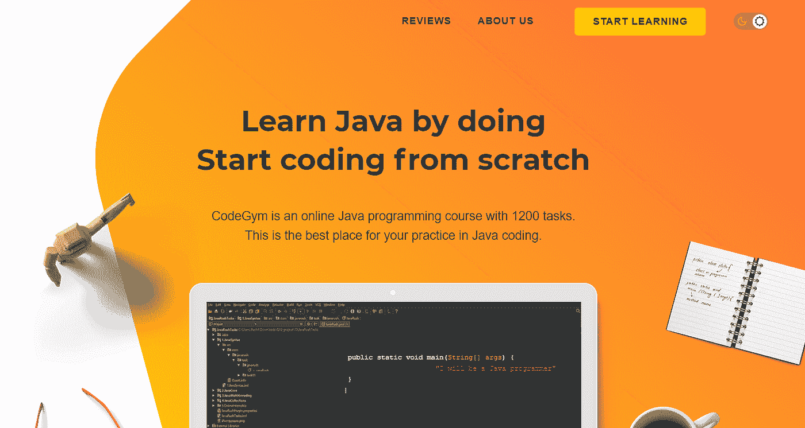
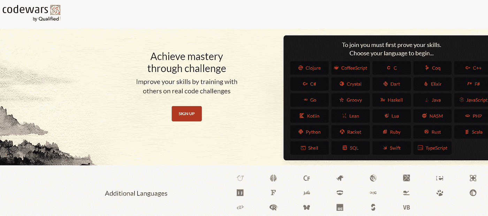
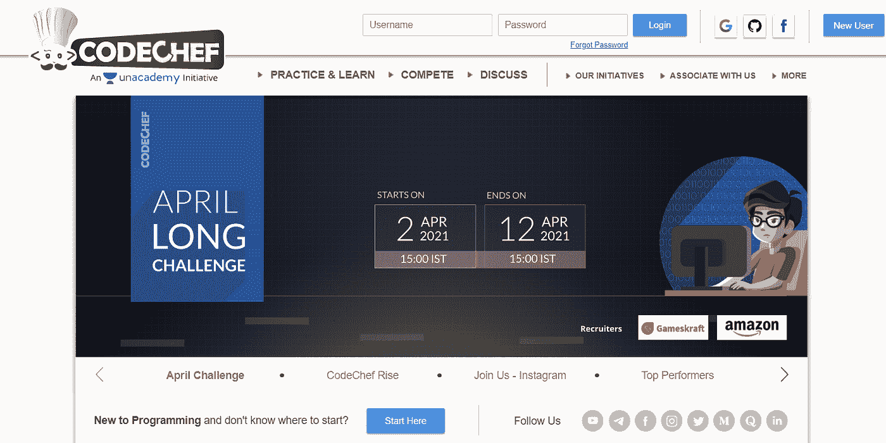
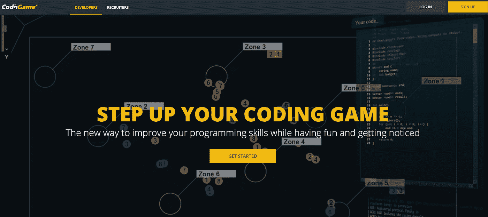
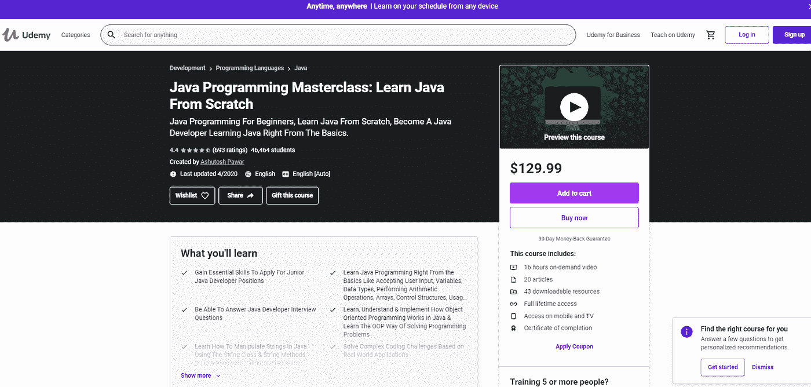
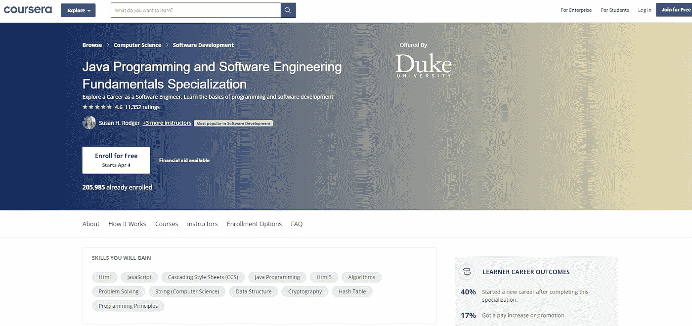
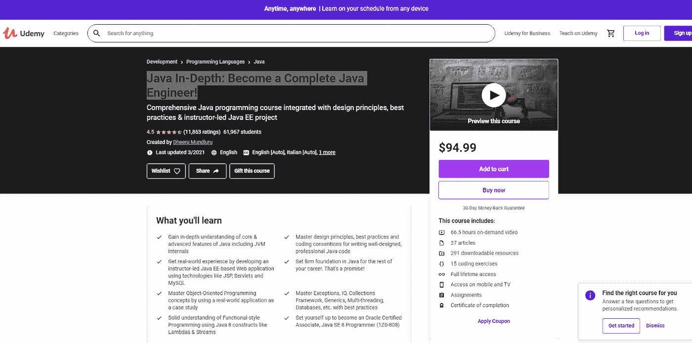

# 面向 Java 初学者的 7 门一流课程

> 原文：<https://medium.com/javarevisited/7-stellar-courses-for-java-beginners-242f0941f120?source=collection_archive---------4----------------------->

“学习永远不会耗尽大脑。”

当我开始学习 Java 编程语言时，达芬奇的这句历史性的话对我来说很有意义。

原因？很多啊！

首先，Java 编程语言非常容易学习，并且对行业有着最大的影响。于是问题就来了:“学 Java 选哪门课？”

这个博客充满了你作为一个初学者或者有抱负的 [Java 程序员](/javarevisited/top-10-free-courses-to-learn-spring-framework-for-java-developers-639db9348d25)所需要的信息。先来列举一下 [*最好的 Java 实用课程*](/javarevisited/top-5-java-online-courses-for-beginners-best-of-lot-1e1e240a758) 你可以选择。

# 面向初学者的实用 Java 课程

对初学者来说，最大的障碍之一是找到对你有益的最佳课程。有几十种在线资源可供选择，很难做出选择。在文章的这一部分，我将向您介绍一些非常有用的在线门户，它们提供了最佳的 java 学习体验。

# [CodeGym](https://codegym.cc/)

向老派学习说再见，感谢 CodeGym 为年轻和有抱负的 Java 开发人员提供了一个平台，提供完全实用的学习和游戏化，使学习变得有益和有趣。

CodeGym 提供了 40 个不同的级别和 1200 多个编码挑战，可以快速学习，既不乏味也不无聊。整个学习过程从基本的 Java 语法开始，然后移动到 [OOP 原理](/javarevisited/10-oop-design-principles-you-can-learn-in-2020-f7370cccdd31)、[集合](/javarevisited/7-best-java-collections-and-stream-api-courses-for-beginners-in-2020-3ad18d52c38)和[多线程](/javarevisited/8-best-multithreading-and-concurrency-courses-for-experienced-java-developers-8acfd3b25094)。简而言之，CodeGym 课程涵盖了整个核心 Java(目前除了较新的 Java 版本的一些特性之外)甚至更多。

你学习讲座，然后解决一定数量的编码任务，开下一个讲座等等，一级一级。您将每个解决方案提交给 CodeGym 智能验证器进行审查。如果有问题，验证器会给你提示，让你继续前进。

每完成一关，下一关就会解锁。此外，你可以完成几个基于游戏的任务，一个慷慨的程序员社区来分享和讨论想法，以及一些你可以得到的非常酷的功能。

在价格方面，CodeGym 有一个免费的入门级访问。你也可以免费使用游戏版块和文章。CodeGym 课程的高级订阅(包括所有讲座和任务)每月收费 49 美元，最后，CodeGym 提供高级专业订阅，价格为每月 99 美元。

Premium Pro subscription 增加了几个功能:您可以重新检查您的解决方案(以不同的方式解决相同的问题，并使用智能验证器多次检查)，还可以获得对您的编码风格的分析。

# [代码大战](https://www.codewars.com/)

如果不是因为 Codewars，学习竞争性编程永远不会这么有趣！这个在线平台是基于一个叫做“形”的日本术语，它指的是在激烈的决斗之前，一个特定的战斗队形。

在这个平台上，你会发现不同层次的编码挑战。成功完成挑战后，您将获得荣誉和奖励，这有助于完善您自己的档案。除此之外，Codewars 有一个非常酷的专家社区，所以你可以讨论问题，学习如何设计你的代码。

不仅仅是 Java，你可以学习 [20 种不同的编程语言](/hackernoon/10-best-programming-languages-to-learn-in-2019-e5b05af4a972)和 12 种新的板载语言也让你着迷。

价格为 9.99 美元/月，可以访问学习例程和其他教程。

# [厨师长](https://www.codechef.com/)

CodeChef 以举办编码竞赛而闻名，全球的程序员都可以参加这些竞赛来获得奖励和成就。对于新手和有抱负的程序员来说，这个平台提供了很多培训课程，在这些课程中，新手们会被训练到一个他们有信心参加任何比赛的水平。

即使知道 CodeChef 是完全免费的，谁也不会选择它，所以不要等了，赶快动手吧！但是请记住，这不是一门课程，这是一个编程平台，你应该知道你的[编程语言](/javarevisited/why-java-is-the-best-programming-language-to-learn-coding-for-beginners-cba79aed1271)至少一点点，即使是对于一个新手的挑战。

# [编码名称](https://www.codingame.com/start)

当你点击这个网址的时候，你会被重定向到主页，在那里你会看到一个游戏，你会觉得你是其中的一部分。这个平台将扔给你的下一个东西，是一个带有使命陈述的对话框。之后，它会给你密码，并要求你把它放在一个合适的地方，这样你在游戏中的武器就可以重新装载弹药，开始向敌人的飞船开火！

除了学习 java，你还可以从总共 27 种编程语言中进行选择。CodinGame 的另一个重要优势是，它是一个来自不同公司的招聘人员不断检查你表现的平台。如果你的游戏足够好，谁知道你会不会作为一名有成就的程序员在财富 500 强公司中获得一个席位呢？

和 CodeChef 一样，这个平台也需要你具备一些编程知识。

UPD >开发者练习技能的平台对每个人都是免费的。CodinGame for Work 提供 14 天的免费试用，之后，你可以选择价格为 349 美元/月的增长套餐，然后是价值 249 美元/月的企业套餐，为期一年。

# 理论 Java 课程

下面，你会发现一些真正足智多谋的 java 学习课程，确保注册这些课程是绝对值得的！

# [完整的 Java Masterclass](https://www.udemy.com/course/java-programming-course/)

凭借 4.4 分的优秀评分和超过 40，000 名在线学生的受益， [Java 编程大师班](https://javarevisited.blogspot.com/2020/11/review-java-programming-masterclass-.html#axzz6dl56Y3wG)是你必须参加的课程。它包括 16 小时的点播视频讲座、20 篇文章、43 个可下载资源，完成本课程后，您还将获得一个证书。

这门课程从头开始教你，从用户输入、变量、数据类型、算术运算、控制结构开始，慢慢建立你的理解，直到[面向对象编程](/swlh/5-free-object-oriented-programming-online-courses-for-programmers-156afd0a3a73?source=search_post---------7)，也称为 OOP。

Java 编程大师班的价格标签是 129.99 美元。

# [杜克大学 Java 认证](https://www.coursera.org/specializations/java-programming)

这门课程之所以成为热门课程之一，是因为除了教授 Java 基础知识之外，它还让您全面了解最新的行业趋势，包括但不限于密码学、[算法](/hackernoon/10-data-structure-algorithms-and-programming-courses-to-crack-any-coding-interview-e1c50b30b927)、编程原理，以及对基于 web 的语言的一些了解。

在 [Coursera](/javarevisited/10-best-software-development-courses-certifications-from-coursera-4ccc59aae201) 上，你可以以 49 美元/月的价格报名参加这个课程。然而，如果你想免费得到这个，你也可以申请经济资助。

# [Java 深入:成为一名完整的 Java 工程师！](https://www.udemy.com/course/java-in-depth-become-a-complete-java-engineer/)

该课程的评分为 4.5 分，有 61，967 名学生注册，课程包括 66.5 小时的点播视频、27 篇文章、291 个下载资源、15 个编码挑战、作业、互动会话以及课程结束时的结业证书。

首先，本课程让你深入了解 Java 的核心和高级概念。在这个过程中，你可以在导师的指导下自己构建一个 web 应用程序，随着时间的推移，你可以用不断学习的知识来完善这个应用程序，最终，你可以在一个大师班中学习主异常、IO、[集合](https://javarevisited.blogspot.com/2020/04/top-5-courses-to-learn-java-collections-and-streams.html#axzz6nwXUSoGH)、[框架](https://javarevisited.blogspot.com/2018/06/top-6-spring-framework-online-courses-Java-programmers.html)、泛型、[多线程](https://javarevisited.blogspot.com/2018/06/top-5-java-multithreading-and-concurrency-courses-experienced-programmers.html)等等！

这门课的价格是 94.99 美元。

# 包扎

和我们在一起意味着你要么是一个正在寻找课程学习的初级程序员，要么是一个只想改变语言的专业人士。

这篇文章是为了满足每一个想进入游戏的新手的需要而编写的。学习应该是互动的和有趣的，这样你才能朝着你的目标前进。