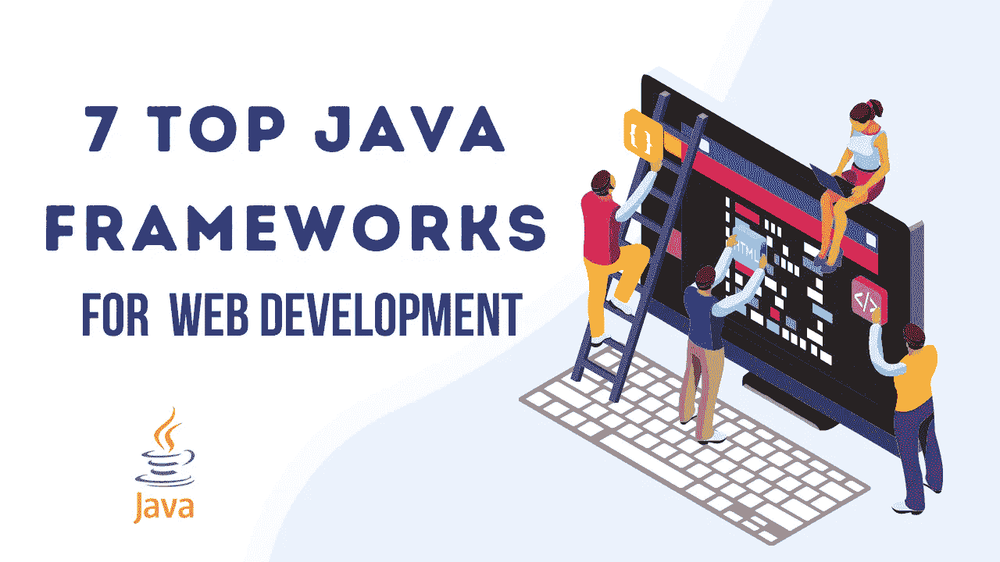
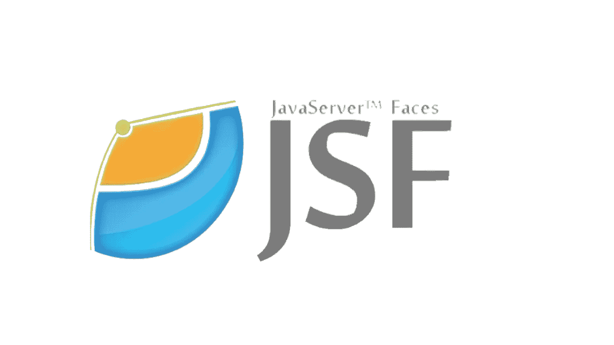
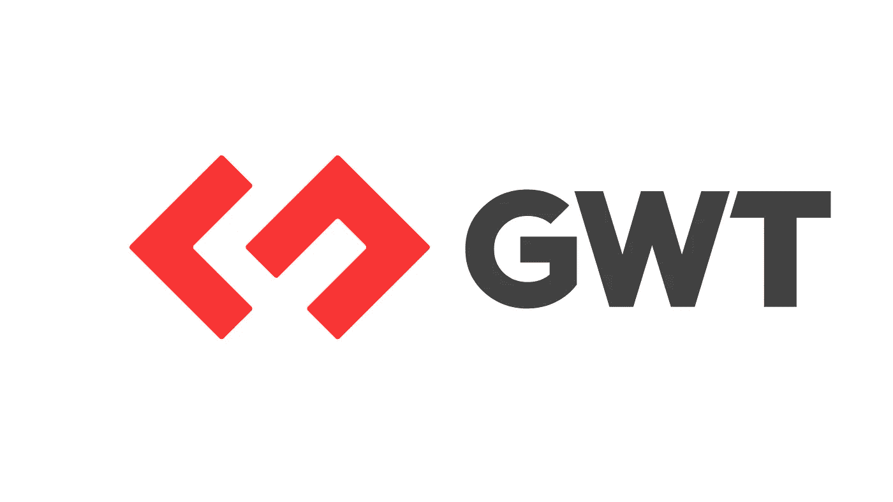
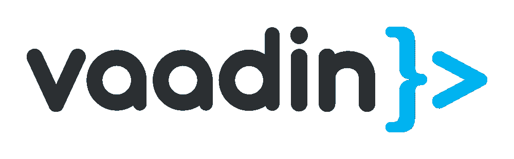
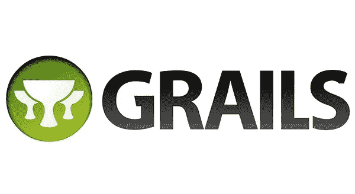

# Web 开发中你应该钦佩的 7 个顶级 Java 框架

> 原文：<https://medium.com/javarevisited/7-top-java-frameworks-you-should-admire-for-web-development-7d100f0ff247?source=collection_archive---------1----------------------->

Java 在 web、Android、云计算、大数据和机器学习项目上提供了多种优势，这也是大多数企业，无论是初创公司、中小企业还是大型企业，都更喜欢使用它进行 Web 应用程序开发的主要原因。

有数以百万计的网站，包括一些使用 Java 技术的大品牌，如谷歌、亚马逊、LinkedIn、易贝和 Stack Overflow。

市场上有许多 [Java 框架](/javarevisited/top-10-frameworks-full-stack-java-developers-can-learn-in-2020-5995021401e5)，但是都没有提供领先的解决方案；这就是为什么企业更喜欢选择合适的和最好的框架。在选择[最佳应用开发框架](/javarevisited/top-6-javascript-frameworks-you-can-learn-to-become-a-truly-fullstack-developer-27561a8cf2e0?source=---------5------------------)时，大多数企业会感到困惑，因此，他们能够做出正确且合适的决定。

因此，为了帮助你解决这个问题，我在这里列出了几个最受欢迎和推荐的 Java 框架。让我们进一步了解它。

# 7 伟大的 Java 框架

框架是具有预定义代码并充当模板的工具，可以重用它来更快地创建 web 应用程序，根据需要加载代码。这允许你不用从头开始一遍又一遍地构建每一行代码就可以编写应用程序。

很少有 Java 框架莫名其妙的难懂，这种情况下你可以 [**从最好的**](https://www.valuecoders.com/hire-developers/hire-java-developers?utm_source=medium-java_framework&utm_medium=d7&utm_campaign=quora-blockchain&utm_term=medium-java_framework) **[**Java 开发公司**](https://www.valuecoders.com/java-web-application-development-company?utm_source=medium-java_framework&utm_medium=d7&utm_campaign=quora-blockchain&utm_term=medium-java_framework) 聘请一个 Java 开发人员****；这将帮助你准确地使用复杂到小层次的框架，并创建健壮的 web 应用程序。**

**从这里提到的最佳 Java 工具列表中，您可以选择任何适合您的项目的 Java 工具。**

# **1.春天**

****

***围绕* ***803 活跃网站*** *正在使用****Spring；*** *此外，历史上有 8821 处遗址使用过。***

*****谷歌、网飞、微软、亚马逊*** *都是几大品牌使用* *的春天。***

**它是最流行的 Java 框架之一，主要以其灵活性、简单性和效力而闻名。该工具主要用于创建企业级 web 应用程序。框架 [Spring MVC](/javarevisited/10-best-spring-framework-books-for-java-developers-360284c37036) 和 [Spring Boot](/javarevisited/top-10-courses-to-learn-spring-boot-in-2020-best-of-lot-6ffce88a1b6e) 特性使其更加先进。**

****弹簧键特征****

*   **它提供了一个轻量级的容器，不需要应用程序或 web 服务器就可以激活。**
*   **它有一个大的生态系统和社区，有描述性的文档和不同的 Spring 教程。**
*   **涉及 [JDBC](/javarevisited/top-5-courses-to-learn-jdbc-and-database-connectivity-for-java-developers-free-and-best-of-lot-7945156fcc3?source=---------9------------------) ，提高效力，减少错误**
*   **它促进了模块化、XML 和基于注释的配置。**
*   **提供向后适应性和易测试性**

# **2.Java 服务器界面(JSF)**

****

*****22505 个活跃站点*** *都在使用* ***Java 服务器 Faces****；另外，****26637 网站*** *历史上使用过。***

*****德意志信贷银行股份有限公司、*** *和* ***咬位*** *是使用* ***JSF 最普遍的组织。*****

**它是基于 Java 的 web app 框架，主要用于 Java web 开发。JSF 由 Oracle 技术维护，该技术主要简化了 JavaServer 应用程序用户界面的创建。该框架的主要目标是封装各种客户端技术，并额外关注性能和显示层。**

**为了在市场上占有一席之地，雇佣 [Java 程序员](/javarevisited/the-java-programmer-roadmap-f9db163ef2c2)。这样做有助于形成一个优秀的 web 应用程序。**

****Java 服务器面临的关键特性****

*   **充满活力的库和可重用的 UI 元素**
*   **允许合并 AJAX 事件进行验证**
*   **支持区分应用程序逻辑和表示**
*   **提供 API 来设计和管理 UI 组件，而不是使用 Java 和 JSF**

# **3.谷歌网络工具包(GWT)**

****

*****30393 活跃网站*** *都在用* ***GWT。*** *另外，历史上有 37030 个站点使用过。***

*****AdSense*** *和****AdWords****是用 Google Web Toolkit (GWT)编写的非常著名的 Google apps。***

**它是一个众所周知的用于网站开发的 Java 框架。这个 Java 工具是由 Google 开发的，主要被企业用来构建高性能和复杂的 web 应用程序。Google Web Toolkit 将 Java 代码转换成 JavaScript 代码；这是该工具的主要特性之一。这个 Java 工具非常有价值，它可以支持您构建成熟的、领先的 web 应用程序。**

****谷歌网络工具包的主要特性****

*   **将 Java 源代码收集到可在主流浏览器上运行的优化的独立 JS 文件中**
*   **允许用最少的前端编程语言知识形成用户界面**
*   **适用于 [Maven](/javarevisited/6-best-maven-courses-for-beginners-in-2020-23ea3cba89) 、 [Eclipse IDE](/javarevisited/6-free-best-eclipse-ide-courses-for-java-programmers-1229ee9e5d87) 和 [Junit](/javarevisited/5-courses-to-learn-junit-and-mockito-in-2019-best-of-lot-f217d8b93688?source=---------20------------------) 。**
*   **扩展的小部件库允许你用 Java 处理 AJAX 应用程序**
*   **高效调试 AJAX 应用程序**

# **4.瓦丁**

****

***围绕****3117 个活跃网站*** *使用了****vaa din****Java 框架，此外还有 2627 个站点历史上使用过。***

*****DoubleSlash、Fraunhofer、*** *都是采用 Vaadin 工具的热门公司。***

**这个 Java 框架允许创建多功能和复杂层次的 web 应用程序。Vaadin 框架支持直接从 Java 虚拟机访问 DOM。此外，它允许您将恢复的元素与其他前端 JavaScript (JS)技术一起使用，如 [Vue](/javarevisited/top-5-online-courses-to-learn-vue-js-in-2021-249e66b60646) 和 [React](/javarevisited/top-10-free-courses-to-learn-react-js-c14edbd3b35f) 。**

****Vaadin 关键特性****

*   **在 Web 元素标准上形成**
*   **提供几个细分市场和不同的受众来支持您**
*   **Maven 和 Gradle 构建工具**
*   **带有@Push 注释的基于 WebSocket 的服务器推送**
*   **这个流行的 Java 测试框架自动化了客户机-服务器通信和路由**
*   **描述性文件**

# **5.Grails**

****

***Grails 带****955****GitHub 叉和****2.6K****GitHub 星。***

*****LinkedIn、TransferWise、*** *和****PedidosYa****是使用 Grails 的热门公司。***

**它是建立在 MVC 设计模式之上的最好的 Java 自动化测试框架之一。这个面向对象的工具有利于企业提高生产力，它使用了 [Groovy 编程语言](/javarevisited/6-best-resources-to-learn-groovy-and-grails-for-java-developers-18c04e88fa8a)。web 开发 **Java 相关工具**完全兼容 Java 语法。**

****Grails 的主要特性****

*   **对 RESTful APIs 的内置支持**
*   **特征的形成是动态的，因此不需要重启服务器**
*   **易于为视图生成标签**
*   **在 Grails 中 [Groovy](https://javarevisited.blogspot.com/2020/06/top-5-courses-to-learn-groovy-and-grails.html) 和 Java 的合并是可能的**

# **6.支杆**

****

*****8498 个活跃网站*** *使用****Struts；*** *另外，* *历史上有 5729 个站点使用这个框架。***

*****阿斯彭、贾兰、斯布克斯、QDP*** *都是利用 Struts 的大公司。***

**Struts 是一个优秀的 Java 框架，支持 MVC 模式，用于创建高级的企业级 Java web 应用程序，减少整体开发时间。这个 Java 工具整合了多个插件来支持 [REST](/javarevisited/21-spring-mvc-rest-interview-questions-answers-for-beginners-and-experienced-developers-21ad3d4c9b82) 、AJAX 和 JSON 而且可以瞬间和其他 Java 框架像 [Hibernate](/javarevisited/top-5-hibernate-online-training-courses-for-beginners-and-advance-java-programmers-469460596b2b) 和 [Spring](/javarevisited/10-best-spring-framework-books-for-java-developers-360284c37036) 联合起来。**

****Struts 的主要特性****

*   **非常有弹性，适合初学者**
*   **它支持创造性的主题和模板**
*   **基于 POJO 的操作**
*   **大幅减少开发工作和时间**

# **7.冬眠**

****

*****、IBM、【戴尔】*** *日常酒店都是少数知名公司使用* ***Hibernate 进行*** *网站开发。***

**它是最流行的 Java 工具，可以快速地与每个数据库交互，当它与各种[数据库](/hackernoon/top-5-sql-and-database-courses-to-learn-online-48424533ac61)一起工作时更有利可图。这个框架包含了优秀的 API 和一些有价值的工具，比如向导、映射编辑器和逆向工程。**

****休眠的主要特性****

*   **轻量级，易于扩展、修改和配置**
*   **使用更有限的编码进行复杂的数据操作**
*   **令人惊叹的命令行工具和 IDE 插件**
*   **RDBMS，整合了 [NoSQL 数据库](/javarevisited/10-free-online-courses-to-learn-mongodb-and-nosql-942609611664)**

# **结论**

**要开发令人难以置信的多特性 web 应用程序，您可以从上面提到的清单中选择任何 Java 框架。从列表中选择[最佳 Java 框架](/javarevisited/5-essential-frameworks-every-java-developer-should-learn-6ed83315f1fb)将支持您满足您的业务需求，并提供具有卓越性能和安全性的特殊级别的灵活性。**

**利用合适的框架使 web 开发过程更易于管理，但是为了做到这一点，有效地利用所选择的框架特性也是必要的。**

**当任何有经验的 Java 全栈开发人员利用 Java 工具时，这将变得可行；为此，你需要 [**从最好的**](https://www.valuecoders.com/hire-developers/hire-java-developers?utm_source=medium-java_framework&utm_medium=d7&utm_campaign=quora-blockchain&utm_term=medium-java_framework)**[**Java web 应用开发公司**](https://www.valuecoders.com/java-web-application-development-company?utm_source=medium-java_framework&utm_medium=d7&utm_campaign=quora-blockchain&utm_term=medium-java_framework) 聘请 Java 开发人员** 。**