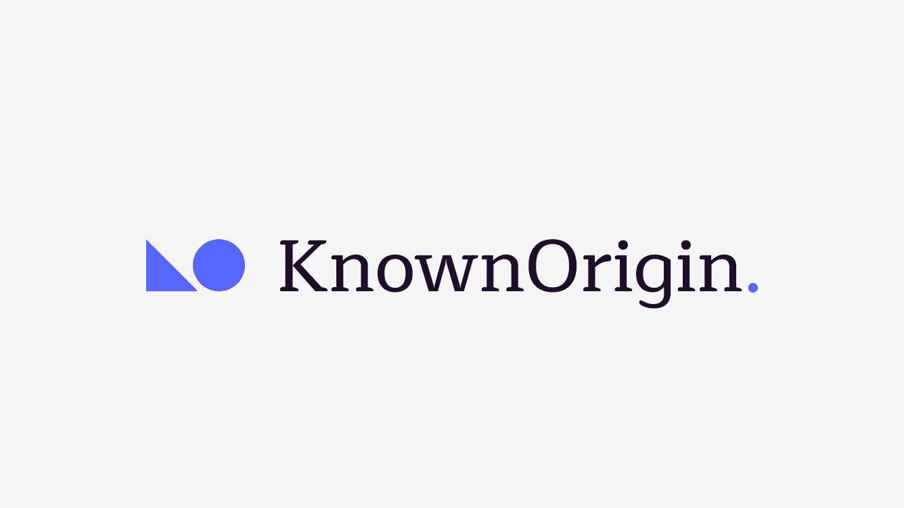
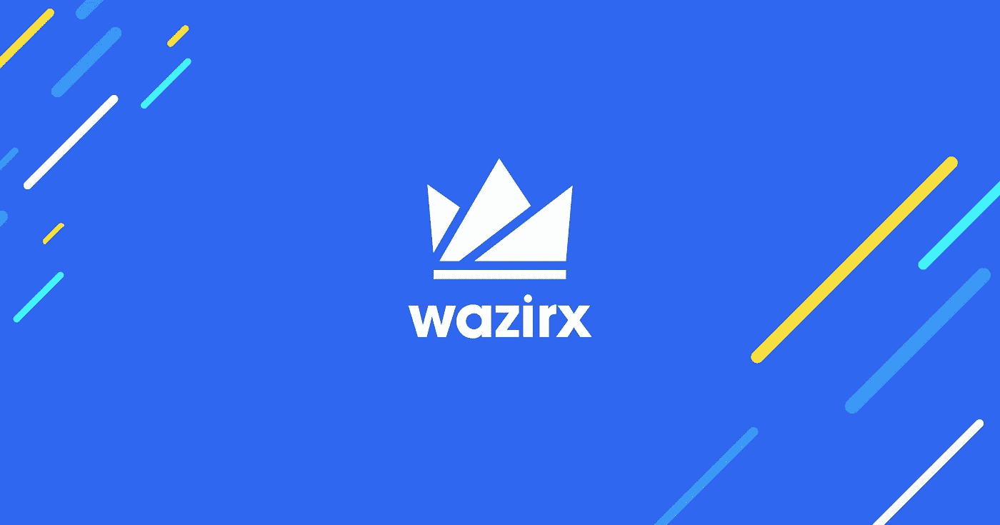
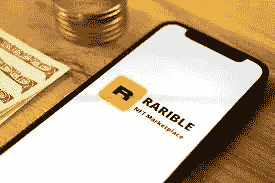

# 7 个白标 NFT 市场，提升您的 NFT 购物体验

> 原文：<https://medium.com/javarevisited/7-white-label-nft-marketplaces-that-enhance-your-nft-shopping-a5306dd939b3?source=collection_archive---------4----------------------->

白色标签 NFT 市场

NFT 已经吸引了很多关注——以至于在 2021 年超过了 T2 的 400 亿美元大关。白色标签的 NFT 市场是一个在线平台，NFT 爱好者可以在这里创造、制造、[购买&出售几种 NFT](https://savingsfunda.blogspot.com/2022/05/how-to-create-and-sell-nft-non-fungible.html)或数字收藏品，如艺术、视频、迷因、游戏项目等。这并不是说它只是一个交易热点——而是一个 [**白色标签的 NFT 市场解决方案**](https://www.appdupe.com/whitelabel-nft-marketplace?utm_source=medium&utm_medium=blog9thjuly&utm_campaign=yasmeen) 可以说服企业家在它的基础上建立他们的商业模式。白色标签仅仅是一个概念——服务提供商开发一个平台——并将其出售给终端方——由终端方重塑品牌并发布。

# **顶级白牌 NFT 市场是由什么构成的？**

白标 NFT 市场可以使用各种技术构建，包括 Polygon、[以太坊](https://javarevisited.blogspot.com/2021/11/top-5-courses-to-learn-ethereum-for.html)、币安智能链等。它可以与知名拍卖门户网站相结合，因为它对用户友好，适应性强。

📌**用户友好度**

最终用户可以轻松访问顶级的 NFT 市场平台，从而获得用户友好的体验( [UX](/javarevisited/6-best-figma-ui-ux-design-courses-for-beginners-94711d31ce61) )。

📌**顶级安全特性**

与常规的 NFT 市场不同，白牌 NFT 市场是经过精确规划的，在最高层安置了可靠的安全元素。

📌**钱包整合**

该平台应符合多个钱包——管理、存储、发送/接收 [NFTs](https://javarevisited.blogspot.com/2021/12/top-5-courses-to-learn-about-nfts-non.html) 。

📌**交叉链支架**

启用具有跨链支持的 [**顶级白标 NFT 市场**](https://www.appdupe.com/whitelabel-nft-marketplace?utm_source=medium&utm_medium=blog9thjuly&utm_campaign=yasmeen) 可确保互操作性，从而扩大业务范围。

# **让我们列出 NFT 市场的 7 大白牌平台**

说了这么多，让我们看看 2022 年提升 NFT 购物体验的 7 大白标市场平台:

## **1。** [**OpenSea**](https://www.appdupe.com/opensea-clone)

OpenSea 克隆

作为全球最受欢迎的 NFT 市场之一，OpenSea 自 2018 年开始运营。该平台因其自助服务的特点而闻名。自从 Openseas 被广泛认为是 NFT 市场的基准以来，白色标签的 Opensea 克隆脚本一直有很高的需求。OpenSea 的重点之一是自我列表的能力。事实上，艺术家可以为他们的 NFT 创造市场，而无需支付佣金或平台费，这使得它成为最常被搜索的 NFT 在线市场。

## **2。** [**魔法伊甸园**](/cryptoniche/magic-eden-the-solana-nft-marketplace-amasses-130-million-in-funding-f0a78d7a102)

魔幻伊甸园

根据每日交易量，最近看到魔术伊甸园[击败了 OpenSea](https://www.coindesk.com/business/2022/05/19/magic-eden-tops-opensea-in-daily-trading-volume-as-solana-nfts-heat-up/) 。这是一个以索拉纳为基础的 NFT 市场，以精心挑选的 NFT 来迎合目标受众。魔术伊甸园启动板作为主要的市场，是为索拉纳创作者提供的特殊服务，已经启动了 250 多个项目。此外，魔幻伊甸园占据了索拉纳 NFT 92%的市场份额，并计划进军 NFT 游戏领域。

## **3。** [**NBA 顶级投篮**](https://www.appdupe.com/nba-topshot-clone)

NBA 最佳投篮

它是最早出现在体育领域的型号之一，得到了美国国家篮球协会(NBA)的认可。NBA 球迷可以在 NFT 平台上购买反映 NBA 历史上各个时代的代币。NBA Top Shot 的销售额超过 6 亿美元，是有史以来最受欢迎的 NFT 收藏品之一。由于熟悉其他种类的传统体育纪念品，NBA Top Shot 已经能够在实验性的 NFT 市场开拓出自己的利基市场。

## **4。** [**索拉纳**](https://www.appdupe.com/blog/solanart-clone/)

索拉纳特

索拉纳上第一个全面运作的 NFT 市场是索拉纳。所有交易都是使用加密的 P2P 连接进行的，这使得它们值得信赖。索拉纳之所以如此出名，是因为它是索拉纳·区块链电视网的第一个同类节目。Solana 平台的长期用户会对使用 Solanart 感到舒适，因为它的用户友好的界面和有用的功能。索兰纳特克隆剧本的吸引力也是如此。它们提高了用户的忠诚度，并唤起了一种熟悉感。

## **5。** [**已知原点**](https://www.appdupe.com/blog/nft-art-marketplace-like-known-origin/)

KnownOrigin

这是一个以太坊本地的 NFT 市场平台，允许任何人以 NFTs 的形式创建、铸造和购买/销售数字宝藏。 [Ebay 最近对已知来源的收购](https://www.creativebloq.com/news/ebay-buys-knownorigin)可能会点燃 NFT 2.0 革命。它可能标志着 NFTs 上升到普遍接受的开始，以及为数字艺术和有形的、亲身艺术作品的融合建立一个新的基准。

## **6。** [**WazirX**](https://www.appdupe.com/blog/wazirx-nft-marketplace/)

瓦济克斯

有如此多的项目在交易，NFT 市场估计价值超过 400 亿美元。瓦齐克斯确保印度的 10 亿人民不会在 NFT 竞赛中落后。该平台现在提供各种服务，包括 NFT 市场，目前在全球范围内运营。除了用户友好的用户界面和跨平台兼容性，该平台还包括一个特殊的推荐计划，为每个推荐支付 20%的平台费。

## 7。 [**稀有**](https://www.appdupe.com/blog/create-nft-marketplace-like-rarible/)

稀有的

一个多链、混合的 NFT 市场是罕见的。除了提供一系列 NFT 流派，它还允许您购买、出售或铸造四种不同的区块链，并计划在未来支持更多。

相比较而言，大多数 NFT 市场仅支持一个或两个不同区块链上的受支持 NFT 收藏的极小安全列表。Rarible 在多链功能方面具有优势；目前，索拉纳是唯一重要的区块链，它是失踪。

## **总结**

那么——你怎么看？你觉得我在这个列表中遗漏了任何值得添加的 NFT 市场吗？如果是这样，请在下面的评论区告诉我们。

此外，如果你是一名企业家，正在阅读这篇文章，你现在就可以采用白色标签 [**NFT 市场解决方案**](https://www.appdupe.com/nft-marketplace-development?utm_source=medium&utm_medium=blog9thjuly&utm_campaign=yasmeen) 来搭建一个平台！

 [## 2022 年 10 个最佳 NFT(不可替代代币)课程和初学者证书

### 这些是最好的在线课程，可以学习关于 NFTs 的一切，从什么是 NFT 到创造、铸造、销售和…

medium.com](/javarevisited/10-best-nfts-courses-and-certifications-for-beginners-to-learn-non-fungible-tokens-in-2022-3f36a4374ba)  [## 2022 年学习区块链的五大网站-最佳

### 大家好，如果你想在 2022 年学习区块链开发，并且正在寻找最好的学习资源…

www.java67.com](https://www.java67.com/2020/07/top-5-websites-to-learn-blockchain-in.html)  [## 2022 年新手在线学习的 6 门最佳区块链认证课程| Coursera

### 大家好，如果你不是生活在岩石下，那么你知道区块链正迅速成为领先的…

javarevisited.blogspot.com](https://javarevisited.blogspot.com/2022/01/5-best-blockchain-certifications-and.html)