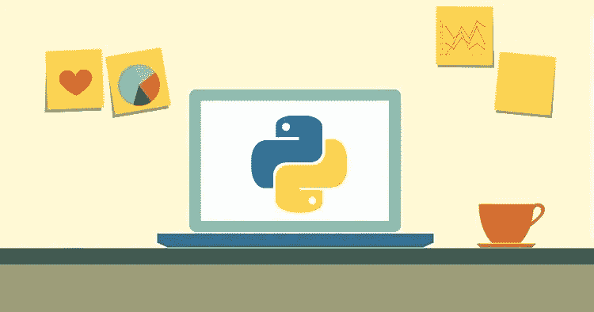
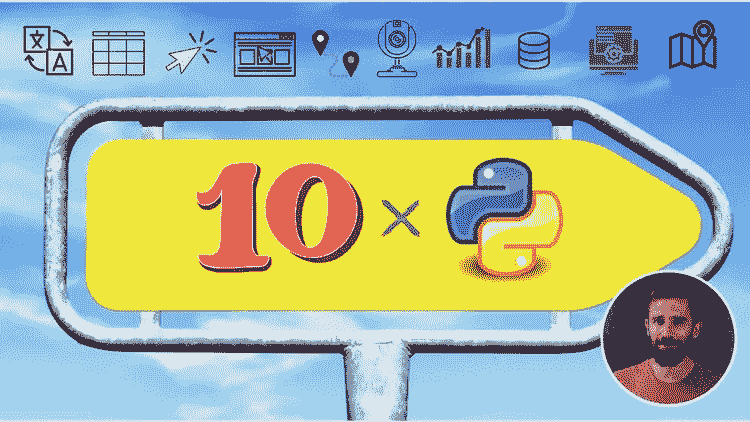
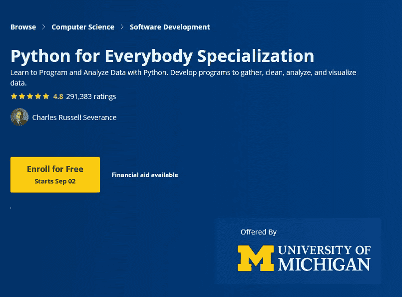
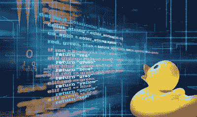
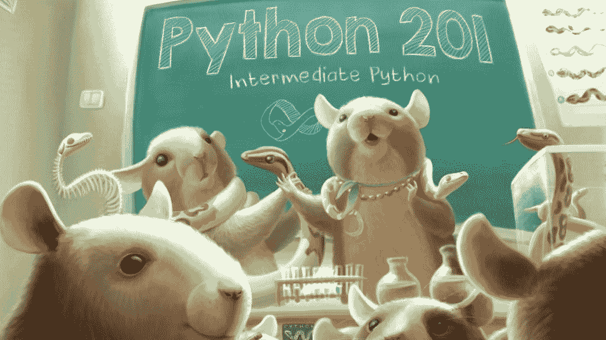
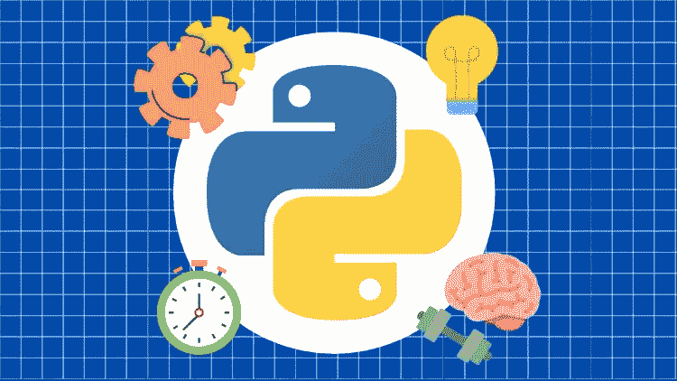

# 2023 年面向有经验开发者的 10 大高级 Python 编程课程和班级

> 原文：<https://medium.com/javarevisited/8-advanced-python-programming-courses-for-intermediate-programmer-cc3bd47a4d19?source=collection_archive---------0----------------------->

## 这些是 2023 年 Udemy、Coursera、Pluralsight、Educative、edX 提供的掌握 Python 编程最好最先进的 Python 课程。

image_credit- Pluralsight Python 课程

你好，伙计们，如果你已经知道 Python，并正在寻找高级课程，以便在 2023 年将你的 Python 技能提升到一个新的水平，那么你来对地方了。之前，我已经分享了 [**最佳 Python 编程课程**](/better-programming/top-5-courses-to-learn-python-in-2018-best-of-lot-26644a99e7ec) 和 [**书籍**](/javarevisited/my-favorite-books-to-learn-python-in-depth-77465633b46e) ，在本文中，我将分享最佳在线培训课程来提高您的 Python 技能。

根据 StackOverflow 等网站的说法，Python 是过去几年中最成功的编码语言之一。由于 Python 编程语言的通用性，对 Python 开发人员或各种经验的要求很高。

例如，同时作为一种高级编程语言，也用于一般用途，如 [AI](https://www.java67.com/2019/11/top-5-artificial-intelligence-courses.html) 和[数据可视化](https://javarevisited.blogspot.com/2019/09/top-5-courses-to-learn-d3js-best.html)和构建 web 应用程序。

Python 也是一种面向对象的语言和开源语言，因此它有一个庞大的社区来共同开发一种漂亮的编程语言。现在世界上许多开发人员正跳着使用 [Python](https://www.java67.com/2017/05/top-7-free-python-programming-books-pdf-online-download.html) ，因为它简单，就像创建 [GUI 应用](https://javarevisited.blogspot.com/2020/07/top-5-courses-to-learn-tkinter-and-pyqt.html)，网站和移动应用。

网上有很多学习 Python 的资源，有免费的，也有付费的，过去我也分享过很多免费的资源像这些免费的[书籍](https://www.java67.com/2017/05/top-7-free-python-programming-books-pdf-online-download.html)，[教程](https://dev.to/javinpaul/top-5-places-to-learn-python-programming-for-free-m4c)，[课程](https://javarevisited.blogspot.com/2018/12/10-free-python-courses-for-programmers.html)，专业化，认证，但是你们很多人要求在 2023 年掌握这个关键的编程技能需要更全面更高级的 Python 课程。

这就是为什么我们从 [Udemy](https://javarevisited.blogspot.com/2019/08/top-10-udemy-courses-and-certifications-for-programmers.html) 、 [Coursera](/javarevisited/pluralsight-or-udemy-d9a94d2e8ee) 、 [edX](https://javarevisited.blogspot.com/2021/05/top-10-edx-courses-and-certificates-for.html#axzz6v6xLSPvq) 和 [Pluralsight](https://javarevisited.blogspot.com/2017/12/top-10-pluralsight-courses-java-and-web-developers.html) 等平台中挑选了**几个高级 Python 在线培训课程**，帮助你从最好的资源中学习 Python。

如果您是从零开始学习 python，或者您对 Python 编程语言有所了解，但希望将您的 Python 技能提升到一个新的水平，这些在线培训课程可以帮助您。

这些课程由 Python 专家打造，受到全球超过 100 万 Python 开发者的信赖。这些只是深入学习 Python 的最佳课程中的最佳课程。它们对于初学者和有经验的 Python 开发人员同样适用。

我还选择了**动手**和**基于项目的课程**，在那里你将[通过创建真实的工作项目](https://dev.to/javinpaul/9-projects-you-can-do-to-become-a-python-master-in-2020-1om)来学习 Python。这可能是学习包括 Python 3 在内的任何新技术的最佳方法，而且效果非常好。你不会意识到你在开发那些项目的时候学到了这么多 Python 概念。

# 2023 年学习 Python 编程的 10 门最佳高级课程

现在，在本文中，我们将看到 5 个高级 python 课程，带你从初学者到专家，并让你成为专业程序员，无论是创建 GUI 应用程序，还是数据可视化专家，还是人工智能专家。

## 1.[完整的 Python 课程:从初级到高级！— Udemy](https://click.linksynergy.com/deeplink?id=JVFxdTr9V80&mid=39197&murl=https%3A%2F%2Fwww.udemy.com%2Fcourse%2Fpython-complete%2F)

毫无疑问，Udemy 是最好的学习平台之一，并且可能是想要学习许多不同领域技能的学生中最有名的，例如编程、设计和许多其他领域。该平台有数十门关于 python 编程语言的课程，其中一些课程会带你从初级到高级。

这显然是 Udemy 上最好的 Python 课程。我在 Udemy 上参加了很多 Python 课程，比如何塞·波尔蒂利亚的《Python 3 训练营大全》**,这真的很棒，但是这个课程更好，有很多练习、测验和动手项目。

完整的 Python 课程:初级到高级课程有超过 16 个小时的视频内容，并向您展示如何创建 10 个程序，如 web scraper、使用 Django 框架的 web 应用程序、GUI 应用程序、数据可视化、机器学习等等。**

****这里是加入本课程的链接** — [完整的 Python 课程:初级到高级！](https://click.linksynergy.com/deeplink?id=JVFxdTr9V80&mid=39197&murl=https%3A%2F%2Fwww.udemy.com%2Fcourse%2Fpython-complete%2F)**

****

## **2.[Python 巨型课程— Udemy](https://click.linksynergy.com/deeplink?id=JVFxdTr9V80&mid=39197&murl=https%3A%2F%2Fwww.udemy.com%2Fcourse%2Fthe-python-mega-course%2F)**

**Python 有许多库，你可以用它们来创建有用的东西，比如人工智能应用程序、可视化数据或创建 web 应用程序。**

**如果你不想仅仅学习 python 和如何创建一个基本程序，你可以学习 Python 大型课程:构建 10 个真实世界的应用程序课程。

本课程将带您了解 python 编程语言的基本语法，如数据类型和 for 循环，然后将向您展示如何使用这些库来创建 GUI 应用程序、可视化数据、创建 web 应用程序、在地图上可视化数据、使用 [OpenCV](https://www.java67.com/2020/07/top-5-courses-to-learn-computer-vision-opencv-python.html) 处理图像和视频，以及更多令人兴奋的项目。**

****这里是加入本课程**—[Python 大型课程](https://click.linksynergy.com/deeplink?id=JVFxdTr9V80&mid=39197&murl=https%3A%2F%2Fwww.udemy.com%2Fcourse%2Fthe-python-mega-course%2F)的链接**

****

## **3.[Python for Everybody Specialization—Coursera](https://coursera.pxf.io/c/3294490/1164545/14726?u=https%3A%2F%2Fwww.coursera.org%2Fspecializations%2Fpython)**

**许多学习平台已经认识到这种美丽的编程语言的力量和未来，他们已经创建了如何使用它的课程，并成为这些平台的专业程序员。

Python for Everybody 是由最好的大学之一密歇根大学提供的专业，讲师是这个平台上最好的老师之一。**

**他们将通过许多项目向您展示如何从头开始并成为一名高级 python 程序员，如 web crawler 和使用 SQL 数据库以及 Python 和[数据可视化](https://www.java67.com/2020/07/top-5-data-visualization-tools-every.html)。**

****这里是加入这个令人敬畏的 Python 课程**——[Python for every one](https://coursera.pxf.io/c/3294490/1164545/14726?u=https%3A%2F%2Fwww.coursera.org%2Fspecializations%2Fpython)**

****

**而且，如果你觉得 Coursera 课程有用，你应该考虑加入 Coursera Plus 课程，这是 Coursera 的一个订阅计划，让你无限制地访问他们最受欢迎的课程、专业、专业证书和指导项目。它每年花费大约 399 美元，但是它完全值得你的钱，因为你得到了**无限证书。****

** [## Coursera Plus |无限制访问 7，000 多门在线课程

### 用 Coursera Plus 投资你的职业目标。无限制访问 90%以上的课程、项目…

coursera.pxf.io](https://coursera.pxf.io/c/3294490/1164545/14726?u=https%3A%2F%2Fwww.coursera.org%2Fcourseraplus)** 

## **4.[Python 编程简介— edX](https://www.awin1.com/cread.php?awinmid=6798&awinaffid=631878&clickref=&p=%5B%5Bhttps%3A%2F%2Fwww.edx.org%2Fprofessional-certificate%2Fintroduction-to-python-programming)**

**如果你想从专业大学或大学院学习 python 编程，你可以看看 Coursera 的另一个替代品 Edx。该平台提供许多由大学和许多大公司如微软和佐治亚理工学院创建的 python 课程。你所要做的就是去 edx.org 搜索数十个 python 课程，但是为了节省你的时间，我将给你一个最好的 python 课程。Python 编程入门是在这个奇妙的平台上提供的课程，由佐治亚理工学院创建。讲师 David Joyner 是计算学院的高级研究员，他将带你从初级到高级了解如何在 python 程序中使用面向对象的编程方法( [OOP](/swlh/5-free-object-oriented-programming-online-courses-for-programmers-156afd0a3a73) ),如果你想在这个领域找到工作，这是一项基本技能，因为它向你展示了如何团队合作。**

****这里是加入本课程**—[Python 编程简介](https://www.awin1.com/cread.php?awinmid=6798&awinaffid=631878&clickref=&p=%5B%5Bhttps%3A%2F%2Fwww.edx.org%2Fprofessional-certificate%2Fintroduction-to-python-programming)的链接**

****

## **5.[用 Python&Flask](https://pluralsight.pxf.io/c/1193463/424552/7490?u=https%3A%2F%2Fwww.pluralsight.com%2Fprojects%2Fbuild-a-job-board-with-python-flask)【plural sight】搭建工作板**

**许多程序员和学习者不知道 Pluralsight 也有项目，您可以加入这些项目来构建真实世界的项目，并应用您所学的所有知识。这个项目是由汤姆·贝尔创建的，它将向你展示如何使用 Python 构建一个简单的网站。

在这个项目中，你将使用它们来构建一个简单的工作板。该网站的主页将显示所有的工作，每个工作和雇主将有专门的网页。用户还可以查看每个雇主。

这个[基于项目的课程](https://javarevisited.blogspot.com/2020/12/top-5-project-based-courses-to-learn-java-python-javascript.html) e 将首先教你如何为项目设置你的本地环境，然后带你了解你需要知道的一切，包括如何安装和配置你的环境以便能够完成所有的任务。

这种循序渐进的指导确实有助于你快速前进，创造出一款让你引以为豪的产品。你获得的成就感将会进一步提高你的学习兴趣，也有助于你成为一名更好的 Python 开发者。**

****这里是加入本课程的链接**——[用 Python & Flask](https://pluralsight.pxf.io/c/1193463/424552/7490?u=https%3A%2F%2Fwww.pluralsight.com%2Fprojects%2Fbuild-a-job-board-with-python-flask) 搭建工作板**

****

**这个基于项目的 Pluralsight 课程对初学者和中级 Python 程序员都有好处。**

**顺便说一句，你需要一个 Pluralsight 会员才能参加这个课程，费用大约是每月 29 美元或每年 299 美元(14%的折扣)。**

**我强烈推荐这个订阅计划，因为您不仅可以访问这个项目，还可以访问 40 多个这样的项目、7000 多个在线课程和互动练习。或者，您也可以使用他们的 [**10 天免费试用**](https://pluralsight.pxf.io/c/1193463/424552/7490?u=https%3A%2F%2Fwww.pluralsight.com%2Flearn) 免费访问该课程。**

** [## 个人技术技能|多视角

### 借助 Pluralsight，在开发运维、机器学习、云、安全基础设施等领域构建所需技能…

pluralsight.pxf.io](https://pluralsight.pxf.io/c/1193463/424552/7490?u=https%3A%2F%2Fwww.pluralsight.com%2Flearn)** 

## **6.[学习 Python 编程大师班— Udemy](https://click.linksynergy.com/deeplink?id=JVFxdTr9V80&mid=39197&murl=https%3A%2F%2Fwww.udemy.com%2Fcourse%2Fpython-the-complete-python-developer-course%2F)**

**这是另一个从 Udemy 深入学习 Python 的很棒的课程。虽然第一门课程对初学者来说很棒，但这门课程涵盖了一些高级概念，这对有经验的 Python 开发人员很有用。网上有这么多课程，找到学习像 python 这样一门美丽语言的最佳程序有时会很困难。在 Udemy 中，你可以绕过一个简短的测试获得适合你的 Python 课程，但是我将向你推荐一个[最好的 Python 课程](/javarevisited/the-complete-python-bootcamp-udemy-course-review-b1ab69f232b5)，你可以在 Udemy 上加入。

学习 python 编程大师班课程旨在带你从初级阶段成为一名高级 Python 开发人员，拥有超过 50 小时的视频内容和 24 个编码练习，将通过实践增强你的编码技能，你还可以在你的 LinkedIn 作品集上展示这些项目以吸引工作机会。**

****这里是加入这个深度 Python 课程**——[学习 Python 编程大师班](https://click.linksynergy.com/deeplink?id=JVFxdTr9V80&mid=39197&murl=https%3A%2F%2Fwww.udemy.com%2Fcourse%2Fpython-the-complete-python-developer-course%2F)的链接**

****

## **7. [Python 201 —交互式学习 Python 3 中的高级概念](https://www.educative.io/courses/python-201-interactively-learn-advanced-concepts-in-python-3?affiliate_id=5073518643380224) —教育性**

**这是一门高级 Python 课程，面向对 Python 3 编程语言有一定经验的中级开发人员。这个互动课程将帮助您在[编程之旅](/javarevisited/7-best-coding-course-to-learn-programming-with-zero-experience-in-2020-52f7d0d9cb80)中更上一层楼。**

**它还将向您展示在日常工作中使用 Python 的一些方法。在本课程中，我将讲述中级和一些高级材料。**

**Python 201 课程拆分为四个部分:
1。第一部分包括中间模块
2。第二部分涵盖了 Unicode、生成器和迭代器等主题。第三部分涵盖了使用 Python
4 的 web 相关任务。第四部分包括测试代码**

**总的来说，这是一个让你的 Python 技能更上一层楼的好课程。**

****这里是加入本课程的链接**—[**Python 201**](https://www.educative.io/courses/python-201-interactively-learn-advanced-concepts-in-python-3?affiliate_id=5073518643380224)**

****

**你可以单独购买这门课程，或者，如果你发现教育平台和他们的交互式 Python 和编码面试课程很有用，那么你也可以获得 [**教育订阅**](https://www.educative.io/subscription?affiliate_id=5073518643380224) ，每月只需 18 美元就可以访问他们的 100 多门课程。非常划算，非常适合准备编码面试。**

** [## 介绍:教育性订阅。获得无限制的访问权限！

### 技术领域永远不会停滞不前，我们也一样。我们定期更新课程，并不断增加新的课程…

www.educative.io](https://www.educative.io/subscription?affiliate_id=5073518643380224)** 

## **8.[用 Python 设计模式](https://click.linksynergy.com/deeplink?id=JVFxdTr9V80&mid=39197&murl=https%3A%2F%2Fwww.udemy.com%2Fcourse%2Fdesign-patterns-python%2F)**

**学习设计模式对于任何有经验的 Python 开发人员来说都是必不可少的，因为它有助于组织您的代码，并编写能够承受生产压力并且足够灵活以适应现代世界变化的代码。**

**这个 Udemy 课程是一个很好的学习 Python 设计模式的课程，它从实用的角度提供了 Python 设计模式的全面概述。本课程特别介绍了使用以下工具的模式:**

*   **Python 编程语言的最新版本**
*   **现代编程方法的使用:依赖注入、反应式编程等等**
*   **使用 JetBrains PyCharm 等现代开发工具**
*   **讨论模式变化和替代方法**

**本课程提供了所有[四人帮(g of)设计模式](/javarevisited/7-best-online-courses-to-learn-object-oriented-design-pattern-in-java-749b6399af59)的概述，如他们的开创性著作中所概述的，以及现代的变化、调整，讨论模式在语言中的内在使用。**

****这里是加入本课程**—[Python 中的设计模式](https://click.linksynergy.com/deeplink?id=JVFxdTr9V80&mid=39197&murl=https%3A%2F%2Fwww.udemy.com%2Fcourse%2Fdesign-patterns-python%2F)的链接**

****

## **9.[使用 Python 进行数据分析](https://click.linksynergy.com/deeplink?id=JVFxdTr9V80&mid=42801&murl=https%3A%2F%2Fwww.futurelearn.com%2Fexperttracks%2Fdata-analytics-using-python)【未来学习】**

**这是另一门高级 Python 课程，面向希望使用 Python 编程语言学习高级数据分析的有经验的开发人员。**

**随着公司(无论大小)越来越依赖技术来执行复杂的数学计算，数据专业人员需要强大的定量技能和对所用模型的高度理解，以及如何利用它们来解决挑战。**

**以下是您将在本课程中学到的关键技能:**

1.  **数据分析**
2.  **数据争论**
3.  **高级数据分析**

**本专业方向将帮助您在使用 Python 进行数据分析的职业生涯中取得进步；最受欢迎的编程语言之一，允许您快速工作并有效地集成系统。**

****这里是加入本专家讲座**——[的链接，使用 Python 进行数据分析](https://click.linksynergy.com/deeplink?id=JVFxdTr9V80&mid=42801&murl=https%3A%2F%2Fwww.futurelearn.com%2Fexperttracks%2Fdata-analytics-using-python)**

****

## **10.[通过解决 100 个 Python 问题来练习 Python](https://click.linksynergy.com/deeplink?id=CuIbQrBnhiw&mid=39197&murl=https%3A%2F%2Fwww.udemy.com%2Fcourse%2Fpython-video-workbook%2F)【Udemy】**

**如果你正在寻找一个可以通过练习编码问题来提高 python 技能的在线课程，那么这个课程就是为你准备的。在本课程中，您将通过解决从简单到高级的 Python 练习来艰难地学习 Python！用 Python 3 解决 100 道习题！**

**您将解决 100 个 Python 作业，从初学者到专家水平不等，包括数据分析、图像处理、可视化、web 应用等领域。**

**解决问题后，您还可以在每次练习中将您的解决方案与正确的 Python 解决方案进行比较。完成本课程后，您将了解 Python 编程技能的类别水平。**

**教师 Ardit Sulce 也非常有帮助，您可以在 Udemy 课程的 QnA 部分提出问题并获得帮助。**

****这里是加入本课程的链接** — [通过解决 100 个 Python 问题来练习 Python](https://click.linksynergy.com/deeplink?id=CuIbQrBnhiw&mid=39197&murl=https%3A%2F%2Fwww.udemy.com%2Fcourse%2Fpython-video-workbook%2F)**

****

**以上是关于深入学习 Python 并成为 Python 开发专家的一些最佳课程。正如我所说的，Python 技能需求很大，并且总是缺少真正了解 Python 的人。**

**作为一名 [**经验丰富的 Python 开发者**](https://www.java67.com/2020/05/top-5-courses-to-learn-python-in-depth.html) ，你不仅要熟悉 Python 的基本概念，还要有良好的实践知识，这样你才能在正确的地方使用正确的工具，更快地交付更好的软件。
T5 其他**Python**编程文章你可能喜欢**

*   **[2023 年学习 Python 的 10 个理由](https://javarevisited.blogspot.com/2018/05/10-reasons-to-learn-python-programming.html)**
*   **[面向初学者和中级开发人员的 8 个 Python 项目](/@javinpaul/8-projects-you-can-buil-to-learn-python-in-2020-251dd5350d56)**
*   **[来自谷歌和微软的免费 Python 教程](/javarevisited/10-free-python-tutorials-and-courses-from-google-microsoft-and-coursera-for-beginners-96b9ad20b4e6)**
*   **[2023 年学习 Python 的前 5 本书](https://www.java67.com/2019/08/top-5-books-to-learn-python-for-beginners.html)**
*   **[初学者学习 Python 的 15 门免费课程](/swlh/5-free-python-courses-for-beginners-to-learn-online-e1ca90687caf)**
*   **[我最喜欢的初学者学习 Django 的课程](/@javinpaul/my-favorite-courses-to-learn-django-for-beginners-2020-ac172e2ab920?source=rss------web_development-5)**
*   **[哈佛和 IBM 的 9 门数据科学课程](https://becominghuman.ai/9-data-science-and-machine-learning-courses-by-harvard-ibm-udemy-and-others-12a0c7c23ec1)**
*   **[Python vs Java——从哪个开始比较好](/javarevisited/python-or-java-which-programming-language-beginners-should-learn-in-2020-de992b2650ec)**
*   **[学习 Python 进行 Web 开发的 10 门课程](/javarevisited/top-10-courses-to-learn-python-for-web-development-in-2020-best-of-lot-efe11fb6d212)**
*   **[学习数据科学 Python 的 5 本书](https://javarevisited.blogspot.com/2019/08/top-5-python-books-for-data-science-and-machine-learning.html)**
*   **[Coursera 颁发的 10 个最佳 Python 专业和证书](https://javarevisited.blogspot.com/2020/02/10-best-coursera-courses--for-python.html)**
*   **[2023 年学习 Flask 的前 5 门课程](https://javarevisited.blogspot.com/2020/01/top-5-courses-to-learn-flask-for-web-development-with-python.html)**
*   **[8 个用于机器学习的 Python 库](https://javarevisited.blogspot.com/2018/10/top-8-python-libraries-for-data-science-machine-learning.html)**
*   **[每个 Java 开发者都应该知道的 10 个测试库](https://javarevisited.blogspot.sg/2018/01/10-unit-testing-and-integration-tools-for-java-programmers.html)**
*   **[Web 开发可以学习的 5 个 Python 框架](https://javarevisited.blogspot.com/2019/04/top-5-python-web-development-frameworks.html)**

**感谢您阅读本文。如果你发现这些课程对成为 Python 专家有用，那么请与你的朋友和同事分享。如果您有任何问题或反馈，请留言。**

**如果你想学习 Python 编程，但负担不起这些在线培训课程的费用，或者正在寻找免费的资源来开始学习 Python 编程，那么我也建议你看看 Udemy 上的这个[**Python 编程简介**](http://bit.ly/2D5vvnV) 课程。**

** [## 免费 Python 教程——Python 编程介绍

### Avinash Jain 目前是加州大学伯克利分校电气工程和计算机科学专业的大二学生。他是…

bit.ly](http://bit.ly/2D5vvnV)**