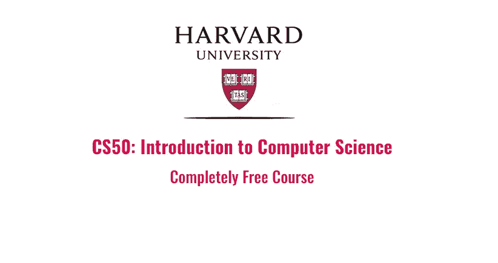
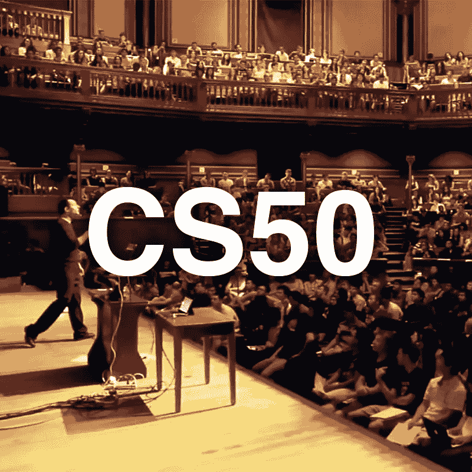
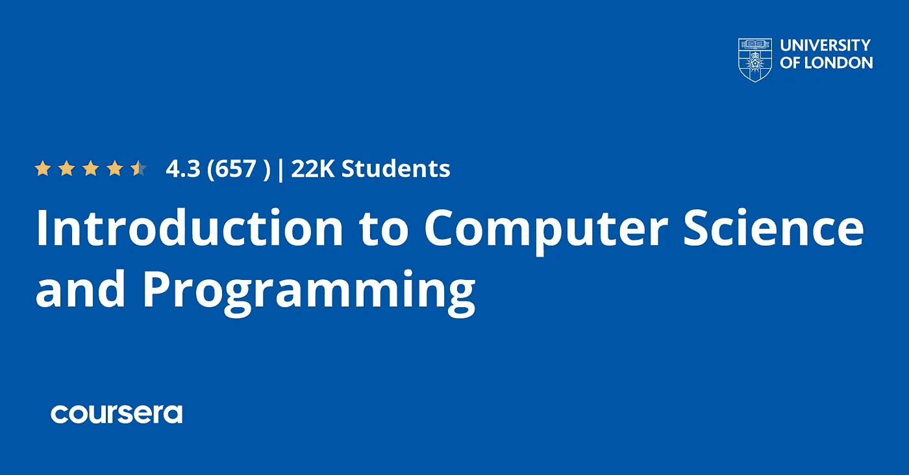
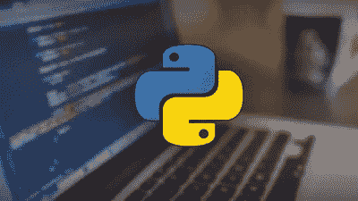
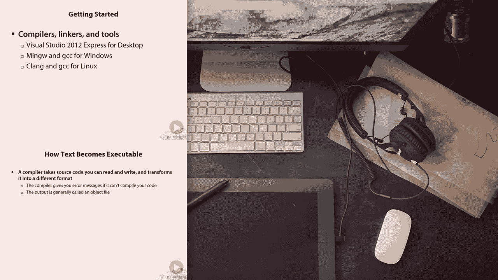
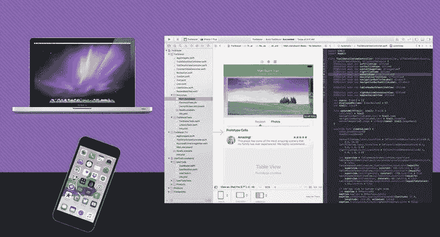
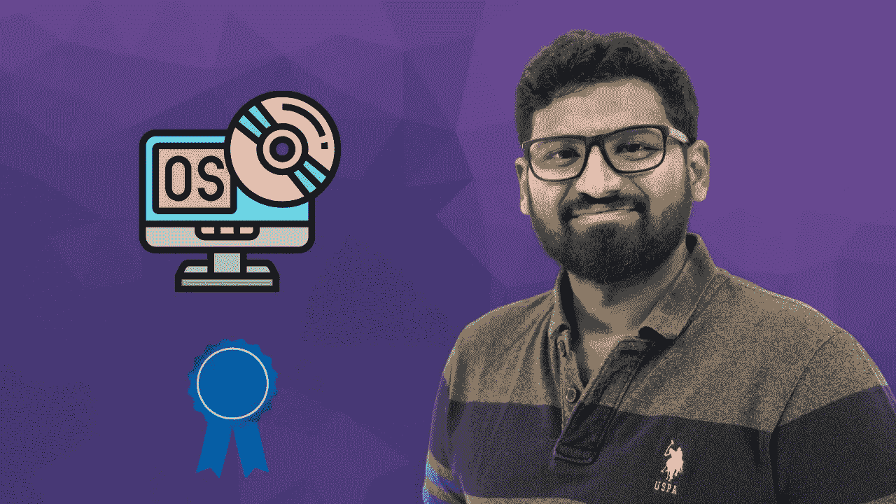
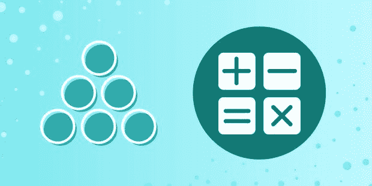

# 2023 年供初学者在线学习的 8 门最佳计算机科学课程

> 原文：<https://medium.com/javarevisited/8-best-computer-science-courses-for-beginners-to-learn-online-696379aa4e96?source=collection_archive---------0----------------------->

## 这些是从 Udemy、Coursera、edX 等网站学习计算机科学基础知识的最佳在线课程，适合任何学习编程和软件开发的人。

大家好，如果你想学习计算机科学基础知识，并寻找在线课程和书籍等最佳资源，你来对地方了。之前，我已经分享了学习数据结构和算法的最佳课程</javarevisited/7-best-courses-to-learn-data-structure-and-algorithms-d5379ae2588?source=---------18------------------>**，在这篇文章中，我将分享学习计算机科学和编程基础的最佳课程。**

**这些是初学者学习计算机科学基础知识的最佳在线课程。它们是由专家创建的，受到成千上万已经在平台上加入这些课程的人的信任，这些平台包括 [Udemy](https://click.linksynergy.com/deeplink?id=JVFxdTr9V80&mid=39197&murl=https%3A%2F%2Fwww.udemy.com%2F) 、 [Coursera](/javarevisited/10-best-coursera-certifications-and-courses-for-beginners-b13e930f2830) 、 [Pluralsight](https://pluralsight.pxf.io/c/1193463/424552/7490?u=https%3A%2F%2Fwww.pluralsight.com%2Flearn) 、 [Educative](https://www.educative.io/subscription?affiliate_id=5073518643380224) 和 [edX](https://www.awin1.com/cread.php?awinmid=6798&awinaffid=631878&clickref=&p=) 。**

**你也可以这样做，提高你的计算机科学基础知识，以促进你的职业生涯。**

**在计算机科学行业，雇员必须具备多种技能才能在这个行业中竞争。诸如 [Python](https://javarevisited.blogspot.com/2018/03/top-5-courses-to-learn-python-in-2018.html) 和 [Java](https://javarevisited.blogspot.com/2020/04/top-5-courses-to-become-full-stack-java-developer-with-Angular-and-Reactjs.html#axzz6Nq9yk7Sc) 等编程语言的受欢迎程度年复一年地波动，并且在网络、安全、物联网等行业产生了新的改进。

计算机科学是研究任何与计算机和计算有关的东西以及 [**算法**](https://www.java67.com/2019/02/top-10-free-algorithms-and-data.html) 、 [**数学**](/javarevisited/5-best-mathematics-and-statistics-courses-for-data-science-and-machine-learning-programmers-bf4c4f34e288) 、 [**编程语言**](https://www.java67.com/2017/12/10-programming-languages-to-learn-in.html) 、信息技术、硬件开发、软件等等。**

**这个行业为人们提供了许多机会，因为技术无处不在，从电脑到手机和智能设备，如相机和智能门锁。大多数想学习计算机科学的人会想到上大学，花上几年时间和几千美元，但实际上，你并不需要所有这些，因为在当今世界，许多在线课程都在教你这个行业，如果你有兴趣学习更多关于这些课程的知识，那么请继续关注学习计算机科学的最佳课程。**

**如果你是一个自学成才的开发人员或初学者，学习计算机科学基础知识可以帮助你增强知识，使你成为一个更好的开发人员。**

# **2023 年供初学者在线学习的 8 门最佳计算机科学课程**

**在不浪费你更多时间的情况下，这里有一个为初学者准备的*最佳计算机科学课程列表，让他们学习计算机科学基础知识、数据结构、网络基础知识，以及你通常在工程师同事和计算机科学学位课程中学到的其他重要知识。***

## **1. [CS50 的计算机科学入门](https://www.awin1.com/cread.php?awinmid=6798&awinaffid=631878&clickref=&p=%5B%5Bhttps%3A%2F%2Fwww.edx.org%2Fcourse%2Fcs50s-introduction-to-computer-scienc)【EDX+哈佛】**

**哈佛大学通过 edX 平台提供的这门计算机科学课程可能是最好最著名的在线课程，教你这门科学的基础和一些编程语言和 web 开发。最重要的是计算思维以及如何像计算机一样解决问题和思考。**

**这门课程将教你计算机科学和编程，以及如何像计算机一样思考和有效地解决编程问题。**

**您还将对一些概念有一个坚实的理解，如安全性、web 开发，并学习许多语言，如 [**Python**](https://javarevisited.blogspot.com/2018/12/10-free-python-courses-for-programmers.html) 、 [C](/javarevisited/10-best-c-programming-courses-for-beginners-2c2c1f6bcb12) 、 [SQL](/hackernoon/top-5-sql-and-database-courses-to-learn-online-48424533ac61) 用于数据库、 [**HTML/CSS**](https://www.java67.com/2020/08/5-best-online-courses-to-learn-html-5.html) 和 [**JavaScript**](/javarevisited/12-free-courses-to-learn-javascript-and-es6-for-beginners-and-experienced-developers-aa35874c9a32) 。**

**最后，您将利用在本课程中学到的知识创建一个项目，并在从本课程毕业并获得认证之前向您的同事展示。如果你只是想学习有证书的计算机科学，你也可以免费参加这个课程。**

****这里是加入本课程的链接** — [CS50 的计算机科学入门](https://www.awin1.com/cread.php?awinmid=6798&awinaffid=631878&clickref=&p=%5B%5Bhttps%3A%2F%2Fwww.edx.org%2Fcourse%2Fcs50s-introduction-to-computer-scienc)**

****

## **2.[计算机科学与编程导论](https://coursera.pxf.io/c/3294490/1164545/14726?u=https%3A%2F%2Fwww.coursera.org%2Fspecializations%2Fintroduction-computer-science-programming)【Coursera】**

**Coursera specialization 是最有益的课程之一，有助于学习基本的计算机科学原理以及计算机背后的数学知识，并学习解决问题和可用于许多行业的 JavaScript 语言。这个专业是由伦敦大学提供的，而且是完全在线的。该专业有 3 门在线课程，如下所示:**

1.  **计算机编程导论**
2.  **计算机如何工作**
3.  **计算机科学数学**

**该课程从计算机编程的介绍开始，并使用 JavaScript 编写 2D 图形和交互式程序。**

**然后你将学习计算机如何工作，以及可以应用于任何软件或计算机系统的基础知识。最后你会学到这个行业需要的计算机科学背后的[数学](https://javarevisited.blogspot.com/2019/09/top-5-statistics-and-mathematics-course-for-data-science.html)。**

**谈社会证明，学过这门课的人，有超过 36%的人在完成本专业后开始了新的职业生涯。超过 25%的人获得了加薪或升职。**

****这里是加入这个节目的链接**——[计算机科学与编程导论](https://coursera.pxf.io/c/3294490/1164545/14726?u=https%3A%2F%2Fwww.coursera.org%2Fspecializations%2Fintroduction-computer-science-programming)**

****

**顺便说一下，如果你计划参加多个 Coursera 课程或专业，那么考虑参加 [**Coursera Plus 订阅**](https://coursera.pxf.io/c/3294490/1164545/14726?u=https%3A%2F%2Fwww.coursera.org%2Fcourseraplus) 为你提供无限制的访问他们最受欢迎的课程、专业、专业证书和指导项目的机会。它每年花费大约 399 美元，但它完全值得你的钱，因为你可以获得无限的证书。**

**<https://coursera.pxf.io/c/3294490/1164545/14726?u=https%3A%2F%2Fwww.coursera.org%2Fcourseraplus> ** 

## **3.[计算机科学 101:掌握编程背后的理论](https://click.linksynergy.com/deeplink?id=JVFxdTr9V80&mid=39197&murl=https%3A%2F%2Fwww.udemy.com%2Fcourse%2Fcomputer-science-101-master-the-theory-behind-programming%2F)**

**在你深入编程和计算机科学行业之前，你必须学习背后的理论，比如计算机如何工作和读取数据，以及计算机如何思考，如果你有兴趣学习这些，那么考虑加入计算机科学这门课程。

这是初学者学习计算机科学的最佳 Udemy 课程之一，这个长达 10 个小时的课程将以有趣和吸引人的方式教你计算机科学的基础知识、[数据结构](/javarevisited/10-best-books-for-data-structure-and-algorithms-for-beginners-in-java-c-c-and-python-5e3d9b478eb1)和[算法](https://www.java67.com/2019/02/top-10-free-algorithms-and-data.html)。**

**首先学习二进制系统，然后分析算法、数组以及数据的存储方式。然后在一门课程中介绍节点及其重要性、链表、实现的堆栈、各种存储算法、树、[二分搜索法树](https://javarevisited.blogspot.com/2015/10/how-to-implement-binary-search-tree-in-java-example.html)，以及更多内容。**

**这也是 Udemy 上最受欢迎的计算机科学课程之一，已有超过 16，000 名学生加入，平均 4.5 分的评论也使其成为 Udemy 上评分最高的计算机科学课程。**

****这是加入本课程**——[计算机科学 101](https://click.linksynergy.com/deeplink?id=JVFxdTr9V80&mid=39197&murl=https%3A%2F%2Fwww.udemy.com%2Fcourse%2Fcomputer-science-101-master-the-theory-behind-programming%2F) 的链接**

****

## **4.[计算机科学入门](https://click.linksynergy.com/deeplink?id=JVFxdTr9V80&mid=39197&murl=https%3A%2F%2Fwww.udemy.com%2Fcourse%2Fintroduction-to-computer-science%2F)【Udemy】**

**另一个很好的课程是教你计算机科学，需要有以前的经验，会给你对这个行业的基本了解，以及一些编程技巧等等，这样你就可以对计算机科学有一个总体的了解，以决定你是否想在这个行业发展。

首先介绍计算机科学，如历史和硬件软件概述，然后介绍编程语言以及[数据结构](/javarevisited/7-best-courses-to-learn-data-structure-and-algorithms-d5379ae2588)和[算法](/javarevisited/20-algorithms-coding-problems-to-crack-you-next-technical-interviews-23191f229788?source=extreme_sidebar---------0-2----------------------)。然后移动计算机科学硬件和设计以及数据库和网络开发。**

****这是加入本课程** — [计算机科学导论](https://click.linksynergy.com/deeplink?id=JVFxdTr9V80&mid=39197&murl=https%3A%2F%2Fwww.udemy.com%2Fcourse%2Fintroduction-to-computer-science%2F)的链接**

****

## **5.[什么是编程](https://pluralsight.pxf.io/c/1193463/424552/7490?u=https%3A%2F%2Fwww.pluralsight.com%2Fcourses%2Fwhat-is-programming)【多视课程】**

**编程是计算机科学的重要组成部分，大多数人学习计算机科学是为了成为程序员或开发人员。如果你想从头开始学习编程，那么这个 Pluralsight 课程是最好的资源。**

**本课程将以独立于语言的方式，教你什么是编程，如何编写计算机程序，计算机程序如何工作，编程规则，数据类型，循环，控制语句，函数，递归，以及许多其他编程基础知识。**

**您将学习可以应用于任何编程语言的编程语言，如 Java、Python、Swift 或 JavaScript，这使得本课程对于非技术人员或希望开始编程和编码的初学者来说确实是一个很好的资源。**

****这里是加入本课程的链接**——[什么是编程](https://pluralsight.pxf.io/c/1193463/424552/7490?u=https%3A%2F%2Fwww.pluralsight.com%2Fcourses%2Fwhat-is-programming)**

****

**顺便说一下，你需要 Pluralsight 会员资格才能加入这个课程，这个课程每月花费 29 美元，但是可以访问他们 7000 多门最新技术的在线课程。您也可以通过使用 Pluralsight 的 [**10 天免费试用**](https://pluralsight.pxf.io/c/1193463/424552/7490?u=https%3A%2F%2Fwww.pluralsight.com%2Flearn) 免费观看本课程来免费参加本课程。**

**<https://pluralsight.pxf.io/c/1193463/424552/7490?u=https%3A%2F%2Fwww.pluralsight.com%2Flearn> ** 

## **6. [CS101 训练营](https://click.linksynergy.com/deeplink?id=JVFxdTr9V80&mid=39197&murl=https%3A%2F%2Fwww.udemy.com%2Fcourse%2Fcs101-introduction-to-computer-science%2F)【我的最佳课程】**

**如果你没有计算机科学和编程语言方面的技术背景，那么你可以考虑参加这个课程，它将帮助你学习一些计算机科学的概念和一些编程语言，看看哪种语言最适合你？**

**从计算机科学的介绍开始，比如硬件和软件，然后转向网络开发，学习一些 HTML 和 CSS 语言来构建简单的网站。**

**然后转向 java 和 python，创建一些简单的程序，并学习了数据库技术，如 SQL、NoSQL 和 web 服务器。最后学习移动应用和[云计算](/javarevisited/5-best-cloud-computing-courses-to-learn-in-2020-f5f091159401)。**

****这是加入本课程**——[cs 101 训练营](https://click.linksynergy.com/deeplink?id=JVFxdTr9V80&mid=39197&murl=https%3A%2F%2Fwww.udemy.com%2Fcourse%2Fcs101-introduction-to-computer-science%2F)的链接**

****

## **7.[操作系统从零开始—第一部分](https://click.linksynergy.com/deeplink?id=CuIbQrBnhiw&mid=39197&murl=https%3A%2F%2Fwww.udemy.com%2Fcourse%2Foperating-systems-from-scratch-part1%2F)【我的课程】**

**操作系统是计算机科学中需要理解的最重要的东西之一，它不仅是有史以来最复杂的软件，而且了解操作系统的工作原理对于任何计算机科学家、It 工程师或软件开发人员来说都是必不可少的。**

**这是在 Udemy 上学习操作系统的绝佳课程。旨在让你掌握在顶尖公司破解操作系统面试问题所需的操作系统技能。**

**本课程还采用了一些最好的操作系统，看起来像 Vignesh，本课程的讲师使用了 Galvin 的操作系统概念。这是一本很棒的教科书。你可以跟着它走。**

**但是他也参考了很多其他的教科书，比如塔南鲍姆，威廉·斯塔林斯等等。所以你可以选择自己喜欢的教科书，但是要遵循标准的作者书。我**

**在课程结束时，你将非常好地理解操作系统的概念，并且能够从计算机科学的任何学科开始。**

****这里是加入本课程** — [从头开始操作系统](https://click.linksynergy.com/deeplink?id=CuIbQrBnhiw&mid=39197&murl=https%3A%2F%2Fwww.udemy.com%2Fcourse%2Foperating-systems-from-scratch-part1%2F)的链接**

****

## **8.计算机科学家的数字系统**

**无论你是一个自学成才的程序员，训练营的毕业生，还是计算机科学的毕业生，理解计算机科学的基础都是有意义的。**

**其中一个基础就是数字系统。比如十进制和二进制。**

**数系的知识会给你带来两个好处:你会 A)对计算机有更深的理解，B)帮助你写出更好、更有性能的代码。**

**如果你要和计算机打交道，学习它们如何在高层次和低层次上工作是个好主意。通过这样做，你会发现如何优化你的计算机资源，并学习如何更好地解决问题。**

**总的来说，数字系统是构成计算机的众多支柱之一，知道如何使用它将有利于你的职业生涯。**

**在计算机科学家的数系课程中，你将会学到对计算机科学家来说很重要的主要数系。您将看到多种数字系统，包括二进制、八进制和十六进制表示。自始至终，您将学习如何操作和表示有符号和分数。**

**在课程的最后一部分，你将会接触到计算机的记忆、存储和字符表示。所有这些对于初学者来说都是重要的话题。**

**这里是加入本课程的链接——[计算机科学家的数字系统](https://www.educative.io/courses/number-systems-for-computer-scientists?affiliate_id=5073518643380224)**

****

**而且，如果你发现教育平台和他们的互动课程很有用，那么你还可以获得 [**教育订阅**](https://www.educative.io/subscription?affiliate_id=5073518643380224) ，每月只需 14.9 美元，不仅可以访问这门课程，还可以访问他们的 210 多门课程。它非常划算，非常适合获得一些实践学习经验。**

**<https://www.educative.io/subscription?affiliate_id=5073518643380224>  

以上就是 2023 年初学者学习计算机科学基础的 b **est 在线课程**。我试着加入一些课程来学习不同的计算机科学基础，比如数系、SQL、HTML 等等。

上面的列表包含了我从像 [Udemy](/javarevisited/15-best-udemy-courses-programmers-can-buy-on-black-friday-and-cyber-monday-2020-a803874f41d9) 、 [edX](/javarevisited/10-free-best-edx-certifications-and-courses-to-learn-online-3473d466f968) 、 [Coursera](/javarevisited/10-best-software-development-courses-certifications-from-coursera-4ccc59aae201) 、 [Educative](/javarevisited/20-free-educative-courses-for-programmers-and-software-engineers-a7135028350c) 和 [Pluralsight](/javarevisited/pluralsight-or-udemy-d9a94d2e8ee) 这样的网站上找到的最好的在线课程，这些课程教你计算机科学，让你在这个令人惊叹的行业找到职业，你现在所要做的就是选择一门课程，从今天开始你的旅程。你还在等什么？

你可能喜欢的其他**编程和计算机科学文章**

*   [2023 年如何学习编码与编程](https://javarevisited.blogspot.com/2020/05/how-to-learn-to-code-in-2020-best-books-courses-and-tips.html)
*   [5 门免费学习核心 Java 的在线课程](http://javarevisited.blogspot.sg/2017/11/top-5-free-java-courses-for-beginners.html#axzz4zuIICRs9)
*   [十大 Coursera 专精学习 Python](https://javarevisited.blogspot.com/2020/02/10-best-coursera-courses--for-python.html)
*   [面向 Java 开发者的 5 门免费 Spring 框架课程](http://www.java67.com/2017/11/top-5-free-core-spring-mvc-courses-learn-online.html)
*   [用 Spring Boot 和云学习 Spring 微服务的 5 门课程](http://javarevisited.blogspot.sg/2018/02/top-5-spring-microservices-courses-with-spring-boot-and-spring-cloud.html#axzz59dN6YO2K)
*   [面向有经验的 Java 开发人员的 5 大 Java 设计模式课程](http://javarevisited.blogspot.sg/2018/02/top-5-java-design-pattern-courses-for-developers.html)
*   [学习大数据和 Apache Spark 的 5 门课程](http://javarevisited.blogspot.com/2017/12/top-5-courses-to-learn-big-data-and.html)
*   [2023 年学习 Web 开发的 5 门课程](http://javarevisited.blogspot.sg/2018/02/top-5-online-courses-to-learn-web-development.html#axzz57wed1PWd)
*   [学习 learn Shell 脚本的 5 门课程](http://javarevisited.blogspot.sg/2018/02/5-courses-to-learn-shell-scripting-in-linux.html)
*   [来自谷歌和微软的 10 个免费 Python 教程](/javarevisited/10-free-python-tutorials-and-courses-from-google-microsoft-and-coursera-for-beginners-96b9ad20b4e6)
*   [2023 年学习 React Native 的 5 门课程](http://javarevisited.blogspot.sg/2018/02/5-react-native-courses-to-learn-mobile-development-using-JavaScript.html)
*   Python 开发者十大 Coursera 认证
*   [编程/编码工作面试的 10 门课程](http://javarevisited.blogspot.sg/2018/02/10-courses-to-prepare-for-programming-job-interviews.html)
*   IT 专业人士学习写电子邮件的 5 门课程
*   【Udemy 十大 Python 和编码课程

感谢您阅读本文。如果你觉得这些*最佳计算机科学在线课程*有用，那么请与你的朋友和同事分享。如果您有任何问题或反馈，请留言。

**P. S.** —如果你想使用 Python 开始你的编程生涯，但不能加入这些课程，并且正在寻找一个免费的课程来开始学习 Python，那么你也可以在 Udemy 上查看[**Python 编程简介**](http://bit.ly/2D5vvnV) 课程。这是完全免费的，你需要做的就是创建一个免费的 Udemy 帐户来注册这门课程。

<http://bit.ly/2D5vvnV> **