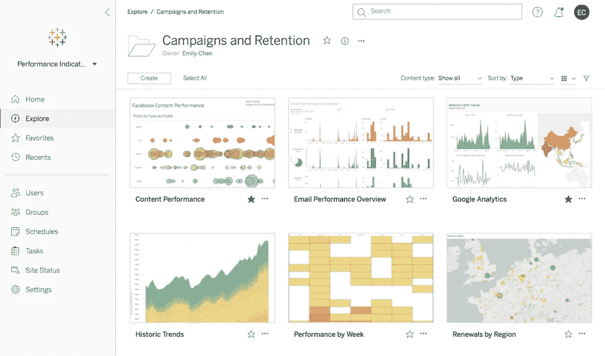
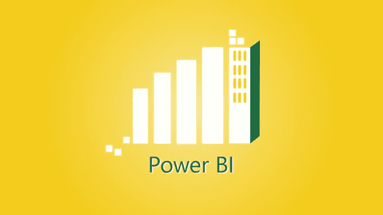
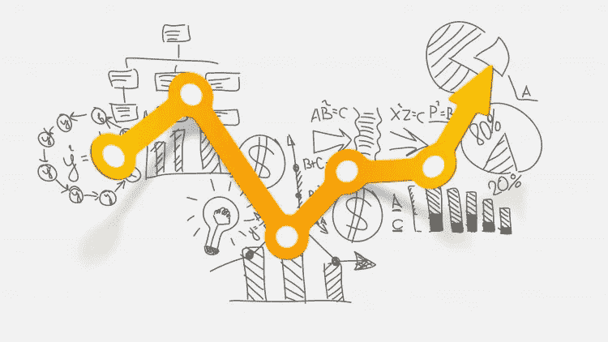
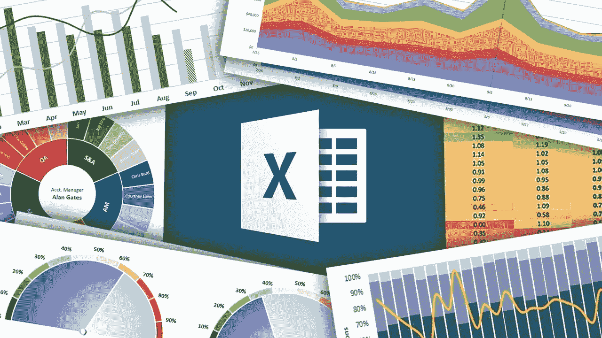
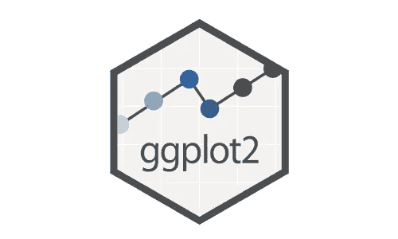

# 2023 年要学习的 8 个最佳数据可视化工具和库

> 原文：<https://medium.com/javarevisited/8-best-data-visualization-tools-and-libraries-data-analysts-and-scientists-can-learn-d2734371df16?source=collection_archive---------1----------------------->

## Tableau，Power BI，QlikView，QlikSense，还是 Microsoft Excel？这些是数据分析师或数据科学家在 2023 年可以学习的最佳数据可视化工具

image_credit — udemy

你好，伙计们，如果你正在学习数据可视化，并为这项工作寻找最好的工具和库，那么你来对地方了。之前我已经分享过[最佳数据科学课程](/javarevisited/my-favorite-data-science-and-machine-learning-courses-from-coursera-udemy-and-pluralsight-eafc73acc73f)、[图书馆](https://becominghuman.ai/10-free-courses-to-learn-python-machine-learning-libraries-scikit-learn-numpy-pandas-keras-3c77ba1a6907)、[书籍](/javarevisited/6-best-python-books-for-data-science-and-machine-learning-in-2021-2f41d9fbf8be)、[本质算法](/javarevisited/5-machine-learning-algorithms-every-data-scientists-should-learn-de467fd2e444)，今天我要分享的是最佳数据可视化工具，供数据分析师和数据科学家学习。

数据可视化是当今以数据为中心的世界中最受欢迎的技能之一。越来越多的公司利用他们的数据来寻找机会，这增加了对能够从他们的数据中讲述故事的数据分析师的需求。

数据可视化是获取任何原始数据(无论数据属于哪个行业)并将其转换为图形的过程，以便更好地理解您的数据，获得洞察力并为您的业务做出更好的决策。

为了有效地处理数据，您必须知道重要的工具，在本文中，我将与您分享每个数据科学家和数据分析师都应该知道的 **5 个基本数据可视化工具和 3 个数据可视化库。**

这些都是业内流行的工具，在简历中加入这些工具也能提升你的简历。精通数据可视化工具，如 [Tableau](https://javarevisited.blogspot.com/2019/07/top-5-tableau-online-courses-and-certifications-for-data-science-engineers.html) 、[微软 Power BI](https://www.java67.com/2020/06/top-5-courses-to-learn-microsoft-power-BI.html) 、 [Qlik View](https://javarevisited.blogspot.com/2020/07/top-5-courses-to-learn-qlikview-and-qlik-sense.html) 、Qlik sense，也能让你在下一批候选人中获得竞争优势。毫无疑问，数据可视化技能在就业市场上很受欢迎，在许多领域也是如此，例如数据分析师、机器学习工程师、数据科学家、商业分析师、数据经理以及更多要求你在简历中拥有这些技能的领域，在一些国家年薪在 5.1 万美元到 11.2 万美元之间。

如果你打算成为一名[机器学习工程师](/javarevisited/my-favorite-data-science-and-machine-learning-courses-from-coursera-udemy-and-pluralsight-eafc73acc73f)、[数据分析师](https://javarevisited.blogspot.com/2020/08/top-10-coursera-certifications-to-learn-Data-Science-Visualization-and-Data-Analysis.html)、[业务分析师](https://javarevisited.blogspot.com/2018/10/top-5-carrer-options-for-experienced-java-programmers.html)，或者在你的大学里学习商业，你肯定应该学习这些技能，以便更好地做出决策和更好地理解你的数据，你将在本文中看到许多数据可视化工具，让你轻松做到这一点。

# 8 个用于数据科学和数据分析的最佳数据可视化工具和库

这里列出了你可以学习的数据可视化和从数据中创建故事的最佳工具。该列表包括基本工具，如 [Tableau](https://www.java67.com/2020/07/top-5-courses-to-pass-tableau-desktop-specialist-certification-exam.html) 、 [Microsoft Power BI](https://www.java67.com/2021/05/top-5-free-power-bi-courses-for..html) 、Qlik View、Qlik Sense 和 [Microsoft Excel](https://javarevisited.blogspot.com/2020/07/top-5-course-to-learn-microsoft-excel.html) 。

它还包括像 [Matpltolib](https://becominghuman.ai/10-free-courses-to-learn-python-machine-learning-libraries-scikit-learn-numpy-pandas-keras-3c77ba1a6907?source=---------13------------------) 、 [ggplot2](https://javarevisited.blogspot.com/2021/05/top-10-edx-courses-and-certificates-for.html) 和 [D3.js](https://javarevisited.blogspot.com/2019/09/top-5-courses-to-learn-d3js-best.html) 这样的库，这些库也可以用于创建图表、图形和其他数据可视化工件。

## 1.[画面](https://www.tableau.com/)

如果您从未听说过这个神奇的工具，那么您可能是数据可视化的新手。Tableau 是一个数据可视化工具，创建于 2003 年，完全专注于可视化分析，能够分析任何类型的数据，并将其转换为数百个表示图和地图，使您能够更好地了解数据。

Tableau 提供了许多产品来满足您的需求，例如 tableau desktop，如果您希望将它安装在您的机器上并离线工作，能够在团队中共享您的数据，或者您可以使用 tableau public 免费版本，与您的同事在线共享您的工作。

如果你想学习 Tableau 并寻找推荐，我强烈推荐你去看看由基里尔·叶列缅科和他的 SuperDataScience 团队举办的 [**Tableau 2023 A-Z:数据科学动手 Tableau 培训**](https://click.linksynergy.com/deeplink?id=JVFxdTr9V80&mid=39197&murl=https%3A%2F%2Fwww.udemy.com%2Fcourse%2Ftableau10%2F) 课程。

这是一个全面的、动手操作的、最新的在线课程，现在就可以了解 Tableau。

## 2.[微软 Power BI](https://powerbi.microsoft.com/en-us/)

我强烈推荐学习的第二个工具是 Microsoft Power BI，它可以使用免费版本，尽管它有一些限制，而且免费。

与 [Tableau](/javarevisited/my-favorite-courses-to-learn-tableau-for-data-science-and-visualization-46623ba5b424) 或本文稍后将介绍的其他工具相比，Microsoft Power BI 没有那么多图表和可视化，对于您正在寻找的东西来说，它已经足够了。

如果您有少量或中等大小的数据要处理，建议使用 Microsoft Power BI，但是如果您有更多的数据，则需要寻找其他工具。

如果你已经喜欢上了微软 Power BI，并且正在寻找有用的资源来学习 Power BI，那么我也建议你去看看由 Maven Analytics 的 Chris Dutton 和 Aaron Parry 开设的 [**微软 Power BI——启动并运行 Power BI 桌面**](https://click.linksynergy.com/deeplink?id=JVFxdTr9V80&mid=39197&murl=https%3A%2F%2Fwww.udemy.com%2Fcourse%2Fmicrosoft-power-bi-up-running-with-power-bi-desktop%2F) 课程。

## 3. [QlikView](https://www.qlik.com/us/products/qlikview)

我们将寻找的下一个数据可视化工具叫做 [QlikView](/javarevisited/7-best-qlikview-and-qliksense-courses-for-beginners-7c356354b3e8) ，我想大多数人都没有听说过，这个工具被认为是 Tableau 的主要竞争对手，拥有超过 5 万名客户。

这个世界上很多大公司比如福特、Paypal 都用 QlikView 来分析他们的数据，因为这是一个很好的软件，无论是大数据还是小数据的可视化。

他们提供下载有限选项的免费版本的选项，或者您可以通过使用付费版本来扩展功能。

如果您想学习 QlikView，并且需要一门好的课程作为开始，那么我建议您参加 Udemy 网站上 Paul Scothford 的[**QlikView 训练营**](https://click.linksynergy.com/deeplink?id=JVFxdTr9V80&mid=39197&murl=https%3A%2F%2Fwww.udemy.com%2Fcourse%2Fthe-complete-qlikview-boot-camp%2F) 课程。不用花太多钱，在线学习 QlikView 是最好的课程之一。

## 4.QlikSense

这一现代化的数据可视化平台通过将数据转换为可视化图表，帮助您从数据中提取洞察力，从而简化您的工作并更好地制定业务决策。

该工具将人工智能和人类直觉这两种东西结合起来，通过简单的拖放就可以创建一个漂亮的数据可视化，从而进行强大的交互[数据可视化](/javarevisited/5-advanced-courses-to-learn-microsoft-excel-in-depth-b556aaee5f6c)。

它被吹捧为下一代 QlikView，该工具正在被业界迅速采用。对具有 QlikSense 技能的职业的需求也在增加，这使得学习该工具更有意义。

还有，如果你今年想学 QlikSense，建议你先从 Udemy 上的 Qlik Sense Analytics 开发 课程中的[**证书开始。这是一门很棒的课程，由一位知识渊博的老师讲授，可能是 Udemy 中最好的。**](https://click.linksynergy.com/deeplink?id=JVFxdTr9V80&mid=39197&murl=https%3A%2F%2Fwww.udemy.com%2Fcourse%2Fis-my-startup-doing-ok%2F)

## 5. [Excel](https://javarevisited.blogspot.com/2019/09/top-5-courses-to-learn-microsoft-excel-macros-vba-and-data-visualization.html)

本文中的最后一个工具，我想大家都已经听说过了，那就是 Microsoft Excel。在我们的建议中，这个工具被认为是基本工具，它很容易在你的 windows 机器或 macOS 上使用和设置。

如果你是数据可视化的初学者，可以先用 Excel 熟悉一下，然后再跳转到更高级的软件，对小数据有好处。虽然它仅限于可视化，但它仍然有很多选项，特别是对于想要创建简单报告的小公司。

## 6. [Matplotlib](https://matplotlib.org/)

*Matplotlib* 是数据分析师或数据科学家可以学习的最流行的数据可视化库之一。这是一个为 *Python* 及其数值扩展 NumPy 开发的跨平台、数据可视化和图形绘图库。

你可以使用 c 语言的 Matplotlib 在 Python 中创建静态的、动画的和交互式的可视化效果。正如他们所说，Matplotlib 让简单的事情变得更容易，让困难的事情变得可能。

Matplotlib 还附带了几个附加工具包，包括 3D 绘图工具、`axes_grid1`中的轴助手和`axisartist`中的轴助手。如果你想学习 Matplotlib，需要资源，我强烈推荐你加入 Coursera 上的 Python 课程中的 [**应用绘图、图表&数据表示。学习 MatpltoLib 库的不同功能和特性以及如何使用它们是一门很棒的课程。**](https://coursera.pxf.io/c/3294490/1164545/14726?u=https%3A%2F%2Fwww.coursera.org%2Flearn%2Fpython-plotting)

本课程是 Python 专门化 的 [**应用数据科学的一部分，Python 专门化**](https://coursera.pxf.io/c/3294490/1164545/14726?u=https%3A%2F%2Fwww.coursera.org%2Fspecializations%2Fdata-science-python)是 Coursera 中最受 Python 开发者欢迎的数据科学认证之一。

<https://coursera.pxf.io/c/3294490/1164545/14726?u=https%3A%2F%2Fwww.coursera.org%2Fspecializations%2Fdata-science-python>  

如果你需要认证，你可以直接以每月 39 美元的价格加入这个课程，或者以每月 399 美元的价格获得 [**Coursera plus 订阅**](https://coursera.pxf.io/c/3294490/1164545/14726?u=https%3A%2F%2Fwww.coursera.org%2Fcourseraplus) ，它提供无限的认证和专业化访问。

<https://coursera.pxf.io/c/3294490/1164545/14726?u=https%3A%2F%2Fwww.coursera.org%2Fcourseraplus>  

## 7. [ggplot2](https://ggplot2.tidyverse.org/)

ggplot2 是一个用于统计编程语言 R 的开源数据可视化包。这是 R 程序员和选择 R 的数据科学家最流行的数据可视化库。

它是 Tidyverse 工具集的一部分，使可视化数据变得非常容易。

简单来说，只要提供数据，告诉 ggplot2 如何将变量映射到美学，使用什么图形原语，它就会照顾到细节。

ggplot2 也是一个成熟的库。它现在已经有 10 多年的历史了，被几十万人用来制作几百万个情节。

如果你想学习 ggplot2，需要资源，我强烈推荐用 Coursera 上的 ggplot2 课程 查一下 R 中的 [**数据可视化。本课程将教你如何使用 ggplot2 制作各种可视化效果。**](https://coursera.pxf.io/c/3294490/1164545/14726?u=https%3A%2F%2Fwww.coursera.org%2Flearn%2Fjhu-data-visualization-r)

该课程由美国约翰·霍普金斯大学提供，也是 R 专业 [**数据可视化&仪表板**](https://coursera.pxf.io/c/3294490/1164545/14726?u=https%3A%2F%2Fwww.coursera.org%2Fspecializations%2Fjhu-data-visualization-dashboarding-with-r) 的一部分。如果你想要一个数据科学和 R 方面的认证，你可以加入这个认证计划。

<https://coursera.pxf.io/c/3294490/1164545/14726?u=https%3A%2F%2Fwww.coursera.org%2Fspecializations%2Fjhu-data-visualization-dashboarding-with-r>  

## 8. [D3.js](https://d3js.org/)

如果你是一名 JavaScript 开发者，那么对于数据可视化来说，没有比 D3.js 更好的工具和库了。

D3.js 代表数据驱动文档。这是一个基于数据操作文档的 JavaScript 库。D3 帮助您使用 HTML、SVG 和 CSS 将数据变得生动。

**D3** 允许您将任意数据绑定到文档对象模型(DOM)，然后将数据驱动的转换应用到文档。

例如，您可以使用 D3 从一个数字数组生成一个 HTML 表格。或者，使用相同的数据创建一个具有平滑过渡和交互的交互式 SVG 条形图。

如果你想深入学习 D3.js，我强烈推荐你参加关于 Educative 的 [**可视化使用 D3.js 介绍**](https://www.educative.io/courses/introduction-to-visualization-using-d3-js?affiliate_id=5073518643380224) 课程。这是一门基于文本的交互式课程，学习并练习在浏览器上实现数据可视化。

在本课程中，您将学习到 [D3.js](/javarevisited/7-best-online-courses-to-learn-d3-js-for-data-visualization-in-2020-1a8c79add4e4) 的基础知识，如 DOM(文档对象模型)操作、方法链接、数据绑定和数据加载。

它还涵盖了关键的数据可视化概念，并深入研究了用于绘制不同几何形状的 SVG。之后，您将使用各种地图和图表来显示您的数据。

你可以单独参加这门课程，或者如果你喜欢教育平台和互动学习，那么你可以加入 [**教育订阅**](https://www.educative.io/subscription?affiliate_id=5073518643380224) ，每月只需 14.9 美元，就可以访问他们的 250 多门课程。

<https://www.educative.io/subscription?affiliate_id=5073518643380224>  

# 学习数据可视化最好的方法是什么？

在探索了一些数据可视化工具之后，你现在可能想学习其中的一些工具，我将为你推荐 Udemy 上的这个[**数据讲述和数据可视化 2023**](https://click.linksynergy.com/deeplink?id=JVFxdTr9V80&mid=39197&murl=https%3A%2F%2Fwww.udemy.com%2Fcourse%2Fmastering-the-art-of-data-visualization-2020%2F) 课程，因为它将教你如何使用许多工具，如 Tableau Microsoft Power BI 和 Microsoft Excel。

在本课程中，您将学到:

*   如何使用不同的可视化工具？
*   如何使用不同的编程语言进行可视化？
*   了解数据在当今世界的重要性。

这就是 2023 年每个数据分析师都应该学习的**最佳数据可视化工具。**数据可视化不仅仅是一种将数据转化为图形和形状以使其在仪表板上看起来更漂亮的方法，它还是一种从数据中获得洞察力的交流方式，开发人员已经开发了工具来促进这一过程。

其他**编程文章和资源**你可能喜欢:

*   [面向数据科学和机器学习的 8 大 Python 库](https://javarevisited.blogspot.com/2018/10/top-8-python-libraries-for-data-science-machine-learning.html)
*   [你可以在线获得 5 个数据科学学位](https://www.java67.com/2020/06/top-5-data-science-degree-you-can-earn-online-coursera-edx.html)
*   [面向数据科学家的 10 大 TensorFlow 课程](https://dev.to/javinpaul/10-of-the-best-tensorflow-courses-to-learn-machine-learning-from-coursera-and-udemy-37bf)
*   [学习机器学习的 5 大免费课程](https://www.java67.com/2019/01/5-free-courses-to-learn-machine-and-deep-learning-in-2019.html)
*   [面向程序员的 10 门机器学习和深度学习课程](https://hackernoon.com/top-5-courses-to-learn-python-in-2018-best-of-lot-26644a99e7ec)
*   [2023 年深度学习 Python 的 10 个理由](https://hackernoon.com/10-reasons-to-learn-python-in-2018-f473dc35e2ee)
*   [2023 年学习电力 BI 的前 5 门课程](https://www.java67.com/2020/06/top-5-courses-to-learn-microsoft-power-BI.html)
*   [初学者学习数据科学的 10 门课程](https://hackernoon.com/10-machine-learning-data-science-and-deep-learning-courses-for-programmers-7edc56078cde)
*   [7 门最适合初学者的人工智能课程](/javarevisited/7-best-courses-to-learn-artificial-intelligence-in-2020-26d59d62f6fe)
*   [学习 QlikView 和 Qlik Sense 的五大课程](https://javarevisited.blogspot.com/2020/07/top-5-courses-to-learn-qlikview-and-qlik-sense.html)
*   [2023 年学习 Python 3 的 5 大课程](https://hackernoon.com/top-5-courses-to-learn-python-in-2018-best-of-lot-26644a99e7ec)
*   [五大基本机器学习算法](https://www.java67.com/2020/07/top-5-machine-learning-algorithms-for-beginners.html)
*   [学习数据科学表格的前 5 门课程](https://javarevisited.blogspot.com/2019/07/top-5-tableau-online-courses-and-certifications-for-data-science-engineers.html)
*   [初学者学习 Python 的 10 门免费课程](https://hackernoon.com/10-free-python-programming-courses-for-beginners-to-learn-online-38312f3b9912)
*   [学习数据科学 Python 的 5 本书](https://javarevisited.blogspot.com/2019/08/top-5-python-books-for-data-science-and-machine-learning.html)
*   [学习高级数据科学的前 5 门课程](https://hackernoon.com/top-5-data-science-and-machine-learning-course-for-programmers-e724cfb9940a)
*   [初学者学习 TensorFlow 的 5 大课程](https://hackernoon.com/top-5-tensorflow-and-ml-courses-for-programmers-8b30111cad2c)

感谢您阅读本文。如果你喜欢这些数据可视化工具和课程，请与你的朋友和同事分享。如果您有任何问题或反馈，请留言。

**P. S. —** 如果您有兴趣了解有关数据可视化的更多信息，并寻找免费的在线课程来开始您的数据可视化之旅，那么您也可以查看 Udemy 上的 [**使用 Oracle 分析云的现代数据可视化**](https://click.linksynergy.com/deeplink?id=JVFxdTr9V80&mid=39197&murl=https%3A%2F%2Fwww.udemy.com%2Fcourse%2Faugmented-analytics%2F) 课程。这是完全免费的，你只需要一个免费的 Udemy 帐户就可以参加这个课程。

<https://click.linksynergy.com/deeplink?id=JVFxdTr9V80&mid=39197&murl=https%3A%2F%2Fwww.udemy.com%2Fcourse%2Faugmented-analytics%2F> 