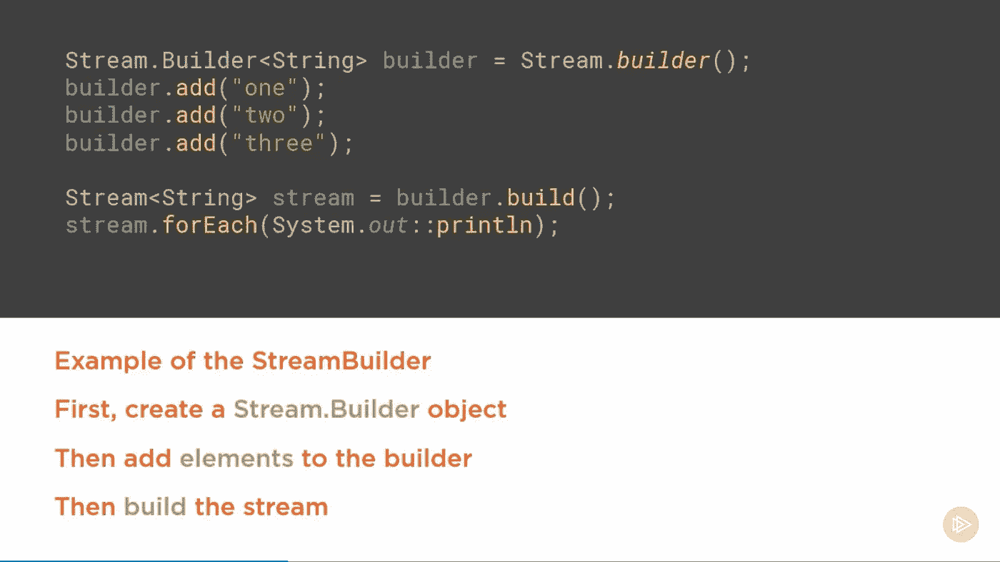
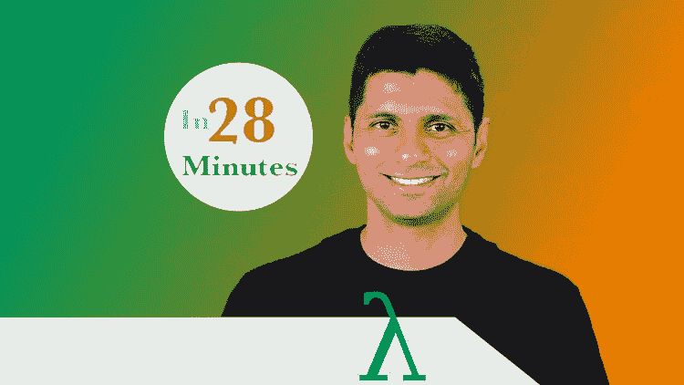
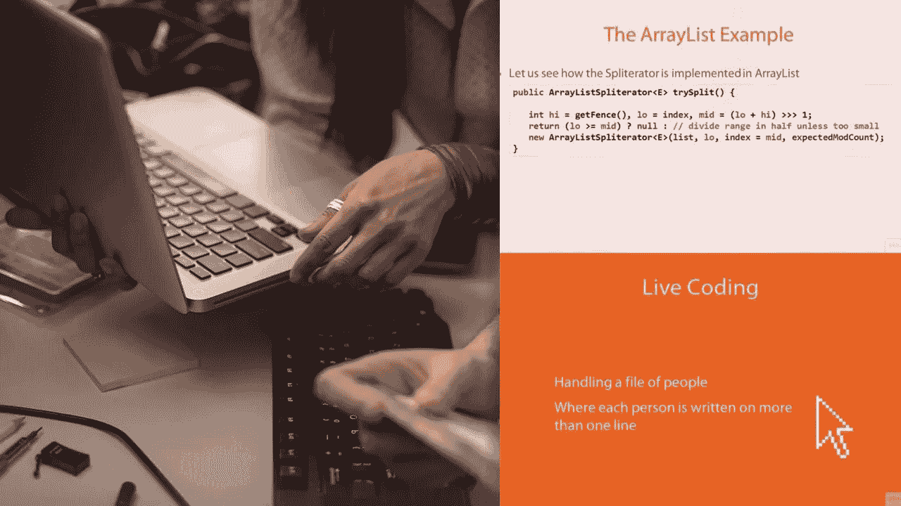
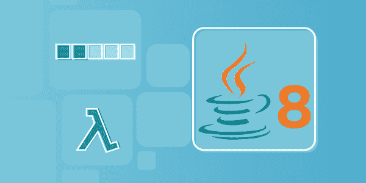

# 2023 年面向 Java 开发人员的 8 门最佳 Lambdas、Stream 和 Functional 编程课程

> 原文：<https://medium.com/javarevisited/8-best-lambdas-stream-and-functional-programming-courses-for-java-developers-3d1836a97a1d?source=collection_archive---------0----------------------->

## 我最喜欢的学习 Lambda 表达式、流 API 和 2023 年 Java 中的函数式编程的在线课程来自 Udemy、Pluralsight 和 Educative。

image_credit — Pluralsight

大家好，如果你们还记得的话，Java 8 通过引入一些函数式编程概念，改变了我们通常用 Java 编码的方式。它带来了像λ表达式和 T2 流这样的特性，这些特性催生了新的模式，从而在 Java 中产生干净的代码。

现在有了一种更好的、更具声明性的方式来编写 Java。如果你正确地使用它们，它们可以更好地表达代码的**意图**，从而更容易阅读和维护。

许多人忽略的另一点是函数式编程概念的引入，如 [map](https://www.java67.com/2015/01/java-8-map-function-examples.html) 、 [reduce](https://www.java67.com/2016/09/map-reduce-example-java8.html) 、 [flatmap](http://www.java67.com/2016/03/how-to-use-flatmap-in-java-8-stream.html) 和 [filter](https://javarevisited.blogspot.com/2018/05/java-8-filter-map-collect-stream-example.html) ，这使我们能够用 Java 编写更可读的代码。

如果你懂函数式编程，或者想学习 Java 的函数式编程，那你来对地方了。

本文将分享一些优秀的课程给[学习 Java 中的函数式编程](https://javarevisited.blogspot.com/2020/04/top-5-courses-to-learn-functional-programming-in-java-with-lambda-and-stream.html#axzz6co28cbJC)。这些课程将帮助你掌握函数式编程，并使用[流](https://www.java67.com/2014/04/java-8-stream-examples-and-tutorial.html)、[λ表达式](/javarevisited/7-best-java-tutorials-and-books-to-learn-lambda-expression-and-stream-api-and-other-features-3083e6038e14?source=---------14------------------)、[函数接口](https://javarevisited.blogspot.com/2018/01/what-is-functional-interface-in-java-8.html)和[方法引用](https://javarevisited.blogspot.com/2017/08/how-to-convert-lambda-expression-to-method-reference-in-java8-example.html#axzz5gKl3DykI)编写独特的 Java 代码。

您还将学习和理解诸如 map、reduce、fil、fil 等函数式编程模式，以及它们为何被添加到 Stream API 中，以及如何正确使用它们来编写**高性能 Java 应用程序。这些课程是为有经验的 Java 开发人员开设的，他们知道如何编写 Java 程序，并且已经在 Java 上工作了一段时间。**

如果你是一个 Java 世界的完全初学者，最好从更基础的东西开始，比如 [**完整的 Java Masterclass**](https://click.linksynergy.com/fs-bin/click?id=JVFxdTr9V80&subid=0&offerid=323058.1&type=10&tmpid=14538&RD_PARM1=https%3A%2F%2Fwww.udemy.com%2Fjava-the-complete-java-developer-course%2F) ，它涵盖了 Java 开发人员需要知道的一切，包括一些函数式编程基础。

<https://click.linksynergy.com/fs-bin/click?id=JVFxdTr9V80&subid=0&offerid=323058.1&type=10&tmpid=14538&RD_PARM1=https%3A%2F%2Fwww.udemy.com%2Fjava-the-complete-java-developer-course%2F>  

# 2023 年学习 Lambda 表达式和流 API 的 8 大 Java 函数式编程在线课程

函数式编程是在 Java 8 中引入 Java 的。在 [Java 9、](/javarevisited/5-courses-to-learn-java-9-features-in-depth-373f7afcf9fa)中增加了额外的函数式编程增强，这个列表提供了涵盖所有这些函数式编程特性的课程。不要再浪费你的时间了，下面是学习 Java 函数式编程的最佳课程:

## 1.[用 Lambdas &流](https://click.linksynergy.com/deeplink?id=JVFxdTr9V80&mid=39197&murl=https%3A%2F%2Fwww.udemy.com%2Fcourse%2Ffunctional-programming-with-java%2F)学习 Java 函数式编程

这可能是从 Java 函数式编程开始的最好的 Udemy 课程。在这个动手课程中，我们将学习用函数式编程编写一些优秀的 Java 代码。您不仅将学习 Java 函数式编程的基础知识，如 Lambda 表达式、方法引用、流和函数接口，还将通过解决难题、练习和使用 JShell 编写程序来实践这些概念。

本课程还使用了 [Eclipse](/javarevisited/top-10-courses-to-learn-eclipse-junit-and-mockito-for-java-developers-4de1e8d62b96?source=collection_home---4------1-----------------------) (Java IDE)，如果你是 Java 新手，那么不用担心；您将学习如何设置它。如果你是函数式编程的新手，这是最好的入门课程。由同为 Java 开发人员和 Udemy 畅销书讲师的 Ranga Rao 在[28 分钟官方](https://medium.com/u/811759b6432?source=post_page-----3d1836a97a1d--------------------------------)创建，这是初学者学习函数式编程的最佳课程。说到社会证明，已经有超过 16K 的学生注册了这门课程。

**这里是加入本课程**——[的链接，通过 Lambdas & Streams](https://click.linksynergy.com/deeplink?id=JVFxdTr9V80&mid=39197&murl=https%3A%2F%2Fwww.udemy.com%2Fcourse%2Ffunctional-programming-with-java%2F) 学习 Java 函数式编程。

## 2.[在 Java 8 中使用 Lambda 表达式从集合到流](https://pluralsight.pxf.io/c/1193463/424552/7490?u=https%3A%2F%2Fwww.pluralsight.com%2Fcourses%2Fjava-8-lambda-expressions-collections-streams)

这是学习 Java 函数式编程的又一门漂亮课程。本课程将向您展示 Java 8 中引入的新模式，它使用 lambda 表达式、函数接口、集合框架和流 API 来生成更简洁的 Java 代码。

由 Java Champion [José Paumard](https://medium.com/u/18673d5e2e01?source=post_page-----3d1836a97a1d--------------------------------) 创建，本课程主要关注 o lambda 表达式，这是 Java 8 中引入的最重要的概念之一。Lambdas 是个好东西，但如果没有新的模式来处理数据，它将毫无用处。

您将了解 map、 [flatMap](https://javarevisited.blogspot.com/2016/03/difference-between-map-and-flatmap-in-java8.html) 、 [reduce](https://javarevisited.blogspot.com/2014/03/2-examples-of-streams-with-Java8-collections.html) 和 [filter](https://javarevisited.blogspot.com/2018/05/java-8-filter-map-collect-stream-example.html) 等内容，这将帮助您更好、更高效地使用 Java 中的批量数据，并创建更好的模式和代码。

以下是加入本课程的链接— [从 Java 8 中的集合到流](https://pluralsight.pxf.io/c/1193463/424552/7490?u=https%3A%2F%2Fwww.pluralsight.com%2Fcourses%2Fjava-8-lambda-expressions-collections-streams)

## 3.使用 Java 8 实现设计模式

如果您一直在使用现代 Java 语法编写代码，那么您可能想知道如何使用现代 Java 特性(如 Lambdas 和 Stream)实现经典设计模式(如 Strategy 和 State)。

本课程将教你如何使用[现代 Java 特性](https://javarevisited.blogspot.com/2018/08/top-5-free-java-8-and-9-courses-for-programmers.html)实现那些设计模式。它会帮助你写出流畅而直接的代码，更容易阅读和维护。

如果你不知道荷西，这门课的授课老师是 Java 冠军，被认为是 Java 专家。这门课，以及我在这个列表中列出的另外两门课，给了你一个向专家本人学习的绝佳机会。

**这里是加入本课程的链接** — [使用 Java 8 Lambda](https://pluralsight.pxf.io/c/1193463/424552/7490?u=https%3A%2F%2Fwww.pluralsight.com%2Fcourses%2Fimplementing-design-patterns-java-8-lambda-expression) 实现设计模式

## 4.[Java 8 中用于数据处理的流、收集器和选项](https://pluralsight.pxf.io/c/1193463/424552/7490?u=https%3A%2F%2Fwww.pluralsight.com%2Fcourses%2Fjava-8-data-processing-streams-collectors-optionals)

这是 Jose Paumard 教授的另一门关于函数式编程和 Java 8 的高级课程。本课程将教你使用 lambdas、streams、spliterators、options 和 collectors 在 Java 8 中处理批量数据的高级模式。

您将学习如何构建自己的分离器，将数据流连接到非标准数据源，以及开发自己的收集器。您还将学习如何在新的流和旧的集合类(如 ArrayList、Iterator 等)之间进行互操作。

您还将了解到 [Optional](https://javarevisited.blogspot.com/2017/04/10-examples-of-optional-in-java-8.html) ，这是 Java 8 中引入的一个新概念，用于处理空流的减少，通常被视为空流的救星。总的来说，这是一门学习使用 Stream、Optional 和 Collectors 在 Java 8 中处理数据的新模式的优秀课程。

**这里是加入本课程的链接**—[Java 8](https://pluralsight.pxf.io/c/1193463/424552/7490?u=https%3A%2F%2Fwww.pluralsight.com%2Fcourses%2Fjava-8-data-processing-streams-collectors-optionals)中数据处理的流、采集器和选项

## 5. [Java Streams API 开发者指南](https://click.linksynergy.com/deeplink?id=JVFxdTr9V80&mid=39197&murl=https%3A%2F%2Fwww.udemy.com%2Fcourse%2Fjava-streams%2F)

这是另一个从 Java .util. Stream 包中学习和掌握 Stream 类及其类的动手课程。讲师纳尔逊·德加洛在解释令人困惑的函数式编程概念和方法方面做得非常出色，比如用一些现场编码示例解释了[映射](https://www.java67.com/2015/01/java-8-map-function-examples.html)、[归约](http://www.java67.com/2016/09/map-reduce-example-java8.html)、[过滤器](https://www.java67.com/2016/08/java-8-stream-filter-method-example.html)和[平面映射](http://www.java67.com/2016/03/how-to-use-flatmap-in-java-8-stream.html)。

他会先给你看代码，然后解释代码。同时，他还将向您展示如何更改代码来改变行为，这有助于您更好地学习那些流方法。

在此过程中，您还将学习一些有用的键盘快捷键和生产率提示，以便使用最流行的 Java 开发 IDE[IntelliJIDEA](https://javarevisited.blogspot.com/2018/09/top-5-courses-to-learn-intellij-idea-java-and-android-development.html)。

**这里是加入这个最佳 Java Stream 课程的链接** — [Java Streams API 开发者指南](https://click.linksynergy.com/deeplink?id=JVFxdTr9V80&mid=39197&murl=https%3A%2F%2Fwww.udemy.com%2Fcourse%2Fjava-streams%2F)

## 6.为有经验的开发者准备的 Java 8:Lambdas，Stream API & Beyond

这是 Educative 的一门中级 Java 课程，旨在学习 Java 8 的所有功能，并准备好在您的代码中利用这些新功能。

在本课程中，您将了解 lambdas、Java Stream API、函数接口以及许多其他与[集合](/javarevisited/7-best-java-collections-and-stream-api-courses-for-beginners-in-2020-3ad18d52c38)、[内存管理](/javarevisited/5-best-advanced-java-performance-and-memory-management-courses-for-experienced-programmers-f7b2e07be5ca)、[日期&时间 API](https://javarevisited.blogspot.com/2015/03/20-examples-of-date-and-time-api-from-Java8.html) 相关的新改进。

本课程由 SAURAV AGGARWAL 创建，将帮助您学习有用的 Java 8 概念，这些概念可以帮助您进行日常编码，并使您成为更好的 Java 开发人员。完成本课程后，您将精通 Java 8 的所有功能，并准备好在您的代码中利用这些新功能。

**这里是加入本课程** — [面向有经验开发者的 Java 8:Lambdas，Stream API & Beyond](https://www.educative.io/courses/java-8-lambdas-stream-api-beyond?affiliate_id=5073518643380224)

此外，如果你喜欢教育平台和他们的互动课程，特别是探险课程，你还可以获得 [**教育订阅**](https://www.educative.io/subscription?affiliate_id=5073518643380224) ，每月只需 18 美元，不仅可以访问这门课程，还可以访问他们的 100 多门课程。它非常划算，非常适合获得一些实践学习经验。

<https://www.educative.io/subscription?affiliate_id=5073518643380224>  

## [7。现代 Java——通过编码学习 Java 8 的特性](https://click.linksynergy.com/deeplink?id=JVFxdTr9V80&mid=39197&murl=https%3A%2F%2Fwww.udemy.com%2Fcourse%2Fmodern-java-learn-java-8-features-by-coding-it%2F)

Java 8 推出已经很多年了，但是仍然有开发者害怕学习 Java 8 中的 Lambdas、Streams、new Date APIs、Optionals 和并行编程，除非你开始编码，否则你是学不会的。

如果你害怕 Java 中的函数式编程，那么这门课就是为你准备的。本课程将通过编写像 [lambdas](https://javarevisited.blogspot.com/2018/07/java-8-tutorials-resources-and-examples-lambda-expression-stream-api-functional-interfaces.html) 和 [stream](https://javarevisited.blogspot.com/2018/08/top-5-free-java-8-and-9-courses-for-programmers.html) 这样的代码来教授 Java 8 的所有新特性。如果你想学习所有的新特性，比如 Lambdas、Streams、Optionals、Functional Interfaces 和并行编程，那么本课程就是为你而设的。

**以下是加入本课程的链接** — [现代 Java —通过编写代码了解 Java 8 的特性](https://click.linksynergy.com/deeplink?id=JVFxdTr9V80&mid=39197&murl=https%3A%2F%2Fwww.udemy.com%2Fcourse%2Fmodern-java-learn-java-8-features-by-coding-it%2F)

## 8.[重构到 Java 8 Streams 和 Lambdas 在线自学工作坊](https://learning.javaspecialists.eu/courses/refactoring2j8?affcode=92815_johrd7r8)

这又是一门学习 Java 8 和 Stream API，用 Java 写更好的代码的中级课程。这门课程是由 Java 冠军 Heinz M. Kabutz 博士创建的，它充满了实用的建议。

与其他课程不同，在本课程中，您将使用 Stream、Labamds 和新的函数式编程概念来重构现有的 Java 代码，这些概念包括 [map](/javarevisited/how-to-use-streams-map-filter-and-collect-methods-in-java-1e13609a318b) 、reduce、 [flatMap](https://javarevisited.blogspot.com/2016/03/difference-between-map-and-flatmap-in-java8.html) 、filter 等。

**这里是加入本课程的链接** — [重构到 Java 8 流和 Lambdas](https://learning.javaspecialists.eu/courses/refactoring2j8?affcode=92815_johrd7r8)

<https://learning.javaspecialists.eu/courses/refactoring2j8?affcode=92815_johrd7r8>  

以上就是学习 Java 函数式编程的**最佳课程**。这些将解释基本的函数式编程概念，如不变性和转换，如 map、flatmap、reduce 等。即使您不是在寻找函数式编程，您也会学到许多有用的技巧和诀窍，来编写更好的 Java 代码。

你可能喜欢的其他 **Java 编程文章**

*   [2023 年 Java 开发者路线图](https://javarevisited.blogspot.com/2019/10/the-java-developer-roadmap.html)
*   【Java 开发人员必备的 10 个测试工具
*   [面向初学者和有经验程序员的 10 门免费 Java 课程](http://www.java67.com/2018/08/top-10-free-java-courses-for-beginners-experienced-developers.html)
*   [2023 年成为更好的 Java 程序员的 10 个技巧](http://javarevisited.blogspot.sg/2018/05/10-tips-to-become-better-java-developer.html)
*   [深入了解 Spring Boot 的五大课程](https://www.java67.com/2018/06/5-best-courses-to-learn-spring-boot-in.html)
*   [2023 年每个 Java 开发人员都应该阅读的 10 本书](http://www.java67.com/2018/02/10-books-java-developers-should-read-in.html)
*   [学习 Docker 和 Kubernetes 的前 5 门课程](https://javarevisited.blogspot.com/2019/05/top-5-courses-to-learn-docker-and-kubernetes-for-devops.html)
*   [10 门免费数据结构与算法课程](http://www.java67.com/2019/02/top-10-free-algorithms-and-data.html)
*   [学习 Spring 框架的前 5 门课程](https://javarevisited.blogspot.com/2018/06/top-6-spring-framework-online-courses-Java-programmers.html)
*   [2023 年 Java 开发者应该学会的 10 件事？](https://javarevisited.blogspot.sg/2017/12/10-things-java-programmers-should-learn.html#axzz53ENLS1RB)
*   Java 和 Web 开发人员应该学习的 10 个框架
*   [学习 Java 集合框架的前 5 门课程](https://javarevisited.blogspot.com/2020/04/top-5-courses-to-learn-java-collections-and-streams.html)
*   [深入学习 Java 并发的 5 门课程](https://javarevisited.blogspot.com/2018/06/top-5-java-multithreading-and-concurrency-courses-experienced-programmers.html#axzz5kEPsvqbp)
*   [学习 Java 性能和 JVM 的前 5 门课程](https://javarevisited.blogspot.com/2019/04/top-5-courses-to-learn-jvm-internals.html)

感谢您阅读本文。如果你喜欢这些 Java 函数式编程课程，请分享给你的朋友和同事。如果您有任何问题或反馈，请留言。

**P. S. —** 如果你是 Java 编程世界的新手，正在寻找一些免费课程来开始你的 Java 编程之旅，你也可以看看这个列表[**【我最喜欢的面向初学者的免费 Java 课程**](/javarevisited/10-free-courses-to-learn-java-in-2019-22d1f33a3915) **】。**它包含了 Udemy、Coursera、Pluralsight 和 Educative 为初学者提供的一些最好的免费 Java 课程。

<https://www.java67.com/2018/08/top-10-free-java-courses-for-beginners-experienced-developers.html> 