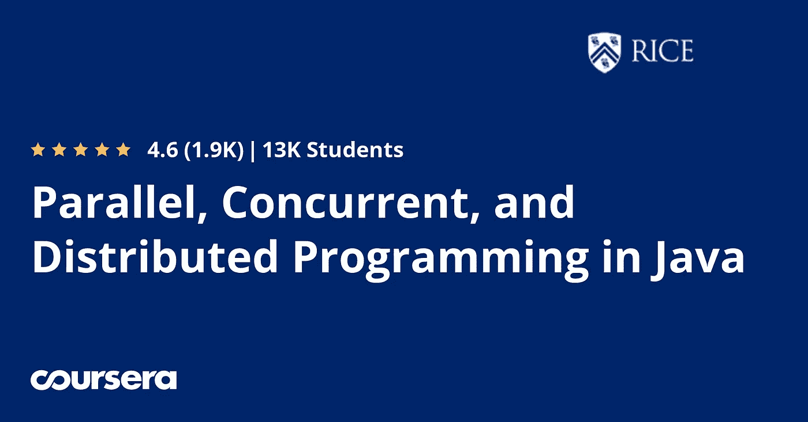
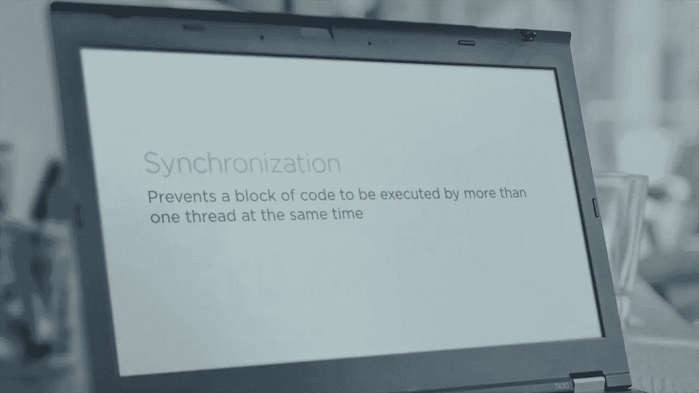
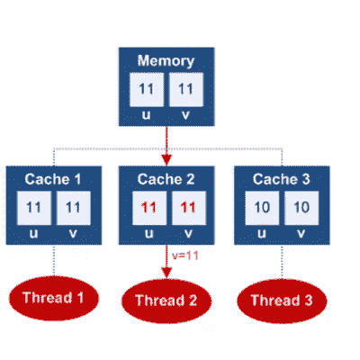

# 2023 年面向有经验程序员的 10 门最佳 Java 多线程和并发课程

> 原文：<https://medium.com/javarevisited/8-best-multithreading-and-concurrency-courses-for-experienced-java-developers-8acfd3b25094?source=collection_archive---------1----------------------->

## 这些是从 Udemy、Coursera 和 Educative 学习 Java 多线程和并发性的最好的免费在线课程。

image_credit —教育性

如果您是一名 Java 开发人员，并且正在寻找优秀的书籍和课程来提高您在 Java 中的多线程和并发技能，那么您来对地方了。

在过去，我已经分享了关于 Java 并发和多线程的[最佳书籍](/javarevisited/6-multithreading-and-concurrency-books-every-java-programmer-should-read-b6a08d2aae54)和[教程](http://www.java67.com/2018/04/java-countdownlatch-example-when-and-how.html)，而在本文中，我将谈论学习 Java 中多线程和并发的最佳免费和付费课程**。您可以加入这些免费课程，以提高您对 Java 并发和多线程的理解。**

这是 Java 开发人员最重要的技能之一，因为几乎所有面试 Java 开发人员的公司都特别关注他们在这方面的知识和经验。如果你想在像花旗银行、德意志银行或巴克莱银行这样的大型投资银行工作，或者在像 Infosys、TCS、Luxsoft 等这样的服务型公司工作，你必须精通 Java 中的多线程和并发概念。

# 什么是多线程和并发？为什么它很重要？

使用多线程执行 Java 程序通常被称为多线程。这样做通常是为了提高应用程序的吞吐量和性能，尤其是在执行大量 CPU 密集型任务时。由于 CPU 是一种稀缺资源，但许多程序都没有充分利用 CPU，通过利用多线程，您可以选择充分利用 CPU 并提高 Java 应用程序的吞吐量。

当 Java 首次登场时，它在多线程上执行程序的能力得到了关注。Java 编程语言在[同步](http://javarevisited.blogspot.sg/2011/04/synchronization-in-java-synchronized.html#axzz4sZOoYUxv)和[可变](http://javarevisited.blogspot.sg/2011/06/volatile-keyword-java-example-tutorial.html)关键字方面有内置的支持，用于在多线程中执行程序。

虽然多线程并不容易，因为当同一段代码被多个线程执行时，会发生许多数据和控制相关的问题，如[死锁](http://javarevisited.blogspot.sg/2010/10/what-is-deadlock-in-java-how-to-fix-it.html)、活锁、[竞争条件](http://javarevisited.blogspot.sg/2012/02/what-is-race-condition-in.html)等。

**第一次获得正确的并发性是非常困难的**，因此 Java 开发人员在编写多线程并发 Java 应用程序之前，应该对不同的多线程和并发概念有很好的理解。这些是你通常在工作中学到的技能，但现在人们希望你在面试前就知道，这就是这些 Java 课程和书籍能帮助你的地方。

他们为构建线程基础和其他多线程概念和术语提供了急需的基础和真实世界的例子。

# 2023 年学习 Java 多线程和并发性的 10 大在线课程

事不宜迟，下面是我列出的学习 Java 多线程和并发性的一些最佳课程。

## 1. [Java 多线程、并发和性能优化](https://click.linksynergy.com/deeplink?id=JVFxdTr9V80&mid=39197&murl=https%3A%2F%2Fwww.udemy.com%2Fcourse%2Fjava-multithreading-concurrency-performance-optimization%2F)

多线程和并发性是 Java 开发人员最需要的技能之一。对很好理解多线程和并发的 Java 开发人员要求很高，但同时，这也是很难掌握的课题之一。

如果你想让你的并发技能更上一层楼，想成为 Java 中多线程、并发和并行编程的专家，特别强调高性能，那么我向你强烈推荐这门课程。

我把它放在第一位是有原因的，因为这可能是列表中最重要的课程，强烈推荐每个 Java 开发人员都去学习。

**这里是加入本课程的链接** — [Java 多线程、并发和性能优化](https://click.linksynergy.com/deeplink?id=JVFxdTr9V80&mid=39197&murl=https%3A%2F%2Fwww.udemy.com%2Fcourse%2Fjava-multithreading-concurrency-performance-optimization%2F)

## 2.[Java 中的并行、并发和分布式编程](https://coursera.pxf.io/c/3294490/1164545/14726?u=https%3A%2F%2Fwww.coursera.org%2Fspecializations%2Fpcdp)【Coursera】

这是一门高级 Java 课程，学习 Coursera 提供的并行编程、并发应用程序和分布式 Java 编程。Coursera 是一个领先的在线学习门户网站，提供世界知名公司(Google、IBM)和大学(斯坦福大学、杜克大学、莱斯大学)的最佳在线课程。

该专业由 Rice University 提供，最适合有经验的开发人员和具有 Java 顺序编程基础知识的初学者，他们有动力学习如何编写并行、并发和分布式程序。

[专业化认证](https://coursera.pxf.io/c/3294490/1164545/14726?u=https%3A%2F%2Fwww.coursera.org%2Fspecializations%2Fpcdp)包含三门课程(可以按任何顺序或单独学习)，您可以使用它们来学习并行性、并发性和分布方面的基础主题。

以下是形成这一专业的三门课程:

1.  [**Java 并行编程**](https://coursera.pxf.io/c/3294490/1164545/14726?u=https%3A%2F%2Fwww.coursera.org%2Flearn%2Fparallel-programming-in-java)
2.  [**Java 中的并发编程**](https://coursera.pxf.io/c/3294490/1164545/14726?u=https%3A%2F%2Fwww.coursera.org%2Flearn%2Fconcurrent-programming-in-java)
3.  [**Java 分布式编程**](https://coursera.pxf.io/c/3294490/1164545/14726?u=https%3A%2F%2Fwww.coursera.org%2Flearn%2Fdistributed-programming-in-java)

并行、并发和分布式编程对于从生物医学研究到金融服务等多个领域的 Java 应用非常重要，这些课程将帮助您为从移动设备到云计算服务器等各种计算机平台的多线程和分布式编程做好准备。

**这里是加入这个 Coursera 课程的链接**—[Java 中的并行、并发和分布式编程](https://coursera.pxf.io/c/3294490/1164545/14726?u=https%3A%2F%2Fwww.coursera.org%2Fspecializations%2Fpcdp)

顺便说一下，如果你计划参加多个 Coursera 课程或专业，那么考虑参加 [**Coursera Plus 订阅**](https://coursera.pxf.io/c/3294490/1164545/14726?u=https%3A%2F%2Fwww.coursera.org%2Fcourseraplus) ，它将为你提供无限制的访问他们最受欢迎的课程、专业、专业证书和指导项目的机会。

<https://coursera.pxf.io/c/3294490/1164545/14726?u=https%3A%2F%2Fwww.coursera.org%2Fcourseraplus>  

## 3.[将并发和多线程应用于常见模式](https://pluralsight.pxf.io/c/1193463/424552/7490?u=https%3A%2F%2Fwww.pluralsight.com%2Fcourses%2Fjava-patterns-concurrency-multi-threading)【plural sight 最佳课程】

这是一门关于多线程和并发性的优秀课程，特别是对于有经验的 Java 开发人员。在本课程中，讲师 Jose Paumard 解释了如何使用 Java APIs 编写正确的多线程代码。

在本课程中，您将学习用 Java 编写[生产质量](http://javarevisited.blogspot.sg/2011/09/how-to-write-production-quality-code.html)多线程代码所需的所有线程基础知识。

您将了解多核 CPU 上并发编程的问题，如死锁、竞争条件、活锁和数据损坏。

接下来，您将了解您的应用程序如何从主内存和 **CPU 缓存**中读取数据，以及**错误共享**如何导致性能降低。

最后，您将了解 Java 内存模型和发生之前的概念，从 Java 程序的角度来看，这是最重要的概念。

**这里是加入这个多线程课程的链接**——[将并发和多线程应用于通用模式](https://pluralsight.pxf.io/c/1193463/424552/7490?u=https%3A%2F%2Fwww.pluralsight.com%2Fcourses%2Fjava-patterns-concurrency-multi-threading)

顺便说一下，你需要一个 [Pluralsight 会员](https://pluralsight.pxf.io/c/1193463/424552/7490?u=https%3A%2F%2Fwww.pluralsight.com%2Flearn)才能加入这个课程，这个课程的费用大约是每月 29 美元或每年 299 美元，但是他们现在提供 40%的折扣，你只需要 176 美元就可以得到这个。

我向所有程序员强烈推荐这个订阅，因为它提供了超过 7000 个在线课程的即时访问，以学习任何技术技能。或者，你也可以使用他们的 [10 天免费通行证](https://pluralsight.pxf.io/c/1193463/424552/7490?u=https%3A%2F%2Fwww.pluralsight.com%2Flearn)免费观看这个课程。

<https://pluralsight.pxf.io/c/1193463/424552/7490?u=https%3A%2F%2Fwww.pluralsight.com%2Flearn>  

## 4.[实践捆绑包中的 Java 并发性](https://learning.javaspecialists.eu/courses/concurrency-in-practice-bundle?affcode=92815_johrd7r8)(Java 专家)

这是 Java 冠军、著名的核心 Java 培训师、Java 专家的创始人 Heinz M. Kabutz 博士讲授的最好、最深入、最经典的 Java 并发性课程之一。

这是关于 Java 并发性的**最全面、最高级的课程之一**，是有经验的专业人员，尤其是那些在高性能领域工作的专业人员必须参加的课程。

该课程是一个捆绑的三个主要材料，与想要掌握并发的人相关:

1。
穿线要领
2。数据结构

3。极致的 Java——并发性能。

简而言之，是面向认真对待并发和多线程技巧的 Java 开发人员的高级课程。

**这里是加入本并发课程** — [Java 并发实践捆绑](https://learning.javaspecialists.eu/courses/concurrency-in-practice-bundle?affcode=92815_johrd7r8)的链接

《极限 Java——并发性能》课程大致基于 Brian Goetz and company 的经典著作《实践中的 Java 并发性》[**e**](http://www.amazon.com/dp/0321349601/?tag=javamysqlanta-20)**,但针对来自 Java 8 和 9 的现代结构(如 lambdas、fork-join pool、Phaser 和其他高级结构)进行了介绍。**

**<http://www.amazon.com/dp/0321349601/?tag=javamysqlanta-20> ** 

## **5.[Java 中的多线程和并行计算](https://click.linksynergy.com/fs-bin/click?id=JVFxdTr9V80&subid=0&offerid=323058.1&type=10&tmpid=14538&RD_PARM1=https%3A%2F%2Fwww.udemy.com%2Fmultithreading-and-parallel-computing-in-java%2F)【Udemy 课程】**

**这是 Udemy 的另一个很棒的 Java 并发和多线程课程，但是它不是免费的。它的正常价格约为 200 美元，但你可以在 Udemy 的几个 flash 销售中以 9.99 美元的价格买到它，这几乎是免费的。与之前的课程相比，本课程内容详尽，涵盖了更多主题和模式，并提供了一些真实的例子。

除了线程、锁、同步、阻塞等多线程的基础知识，您还将了解到并发集合，它可以简化一些并发设计模式。

例如，使用 BlockingQueue 类来实现[生产者-消费者模式，比使用这里所示的等待和通知的普通集合要容易得多。

本课程讨论](http://www.java67.com/2015/12/producer-consumer-solution-using-blocking-queue-java.html) [CountDowLatch、](https://javarevisited.blogspot.com/2012/07/countdownlatch-example-in-java.html#axzz5J9grtXLX) [CyclicBarrier](http://javarevisited.blogspot.sg/2012/07/cyclicbarrier-example-java-5-concurrency-tutorial.html#axzz5DmwFLA1K) 、[阻塞队列](https://javarevisited.blogspot.com/2012/02/producer-consumer-design-pattern-with.html#axzz5gssD6l67)、延迟队列、 [PriorityQueue](http://www.java67.com/2015/07/how-to-use-priorityqueue-in-java-example.html) 、交换器和并发映射，如 [ConcurrentHashMap](https://javarevisited.blogspot.com/2017/08/top-10-java-concurrenthashmap-interview.html) 。

除了生产者-消费者，本课程还解释了用餐哲学家问题，并演示了两个模拟项目，即学生图书馆模拟和小游戏模拟，这将使您能够应用所学的知识。**

****这里是加入本课程的链接**—[Java 中的多线程和并行计算](https://click.linksynergy.com/fs-bin/click?id=JVFxdTr9V80&subid=0&offerid=323058.1&type=10&tmpid=14538&RD_PARM1=https%3A%2F%2Fwww.udemy.com%2Fmultithreading-and-parallel-computing-in-java%2F)**

****

**课程还涵盖了一些高级概念，如并行算法、 [Fork-Join 框架](http://javarevisited.blogspot.sg/2016/12/difference-between-executor-framework-and-ForkJoinPool-in-Java.html)和 [MapReduce](http://www.java67.com/2016/09/map-reduce-example-java8.html) 模式。总的来说，对于一个有经验的 Java 开发人员来说，这是一门完善的课程，可以增加他在这方面的知识。**

## **6.[带执行器的高效 Java 多线程](https://click.linksynergy.com/fs-bin/click?id=JVFxdTr9V80&subid=0&offerid=323058.1&type=10&tmpid=14538&RD_PARM1=https%3A%2F%2Fwww.udemy.com%2Fefficient-java-multithreading-with-executors%2F) (Udemy)**

**这是另一个在 Udemy 上学习高级 Java 多线程的好课程。本课程特别关注 Java 5 中引入的 Executor 框架，它消除了开发人员创建和管理线程的痛苦和问题。如果你以前在多线程应用中工作过，你就会知道在请求处理时创建新的线程会降低你的速度，这就是为什么最好使用线程池来处理请求。

Java 通过在 JDK 1.5 中引入[Executor 框架](http://javarevisited.blogspot.sg/2017/02/difference-between-executor-executorservice-and-executors-in-java.html)解决了这个问题，它提供了创建和管理线程池所需的基础设施和 API。

除了 Executor 框架之外，您还将学习一些线程的基础知识，比如为调试命名线程、终止线程、处理未捕获的异常、调度任务等。**

****这里是加入这个 Java 课程的链接** — [高效的 Java 多线程与执行器](https://click.linksynergy.com/fs-bin/click?id=JVFxdTr9V80&subid=0&offerid=323058.1&type=10&tmpid=14538&RD_PARM1=https%3A%2F%2Fwww.udemy.com%2Fefficient-java-multithreading-with-executors%2F)**

****

**简而言之，这是一门填补 Java 并发和多线程知识空白的精彩课程。您可以参加本课程，同时阅读 Brian Goetz 及其团队撰写的《实践中的 [**Java 并发性**](http://www.amazon.com/dp/0321349601/?tag=javamysqlanta-20) 一书，从而获得两全其美的效果。**

## **7. [Java 多线程](https://click.linksynergy.com/fs-bin/click?id=JVFxdTr9V80&subid=0&offerid=323058.1&type=10&tmpid=14538&RD_PARM1=https%3A%2F%2Fwww.udemy.com%2Fjava-multithreading%2F)(Udemy 上的免费 Java 课程)**

**这是一门学习 Java 多线程的免费课程，你可以在最大的在线课程平台 [Udemy](http://javarevisited.blogspot.sg/2018/01/top-10-udemy-courses-for-java-and-web-developers.html) 上加入。这是一门很好的基础课程，它不会太全面，会告诉你使用 Java 库读写并发代码所需要的一切。

在本课程中，您将学习启动和停止线程、使用 synchronized 关键字的基本线程同步、锁定、[线程池](http://javarevisited.blogspot.sg/2013/07/how-to-create-thread-pools-in-java-executors-framework-example-tutorial.html)、[等待和通知](http://javarevisited.blogspot.sg/2015/07/how-to-use-wait-notify-and-notifyall-in.html)、[可调用和未来](http://javarevisited.blogspot.sg/2015/06/how-to-use-callable-and-future-in-java.html)，以及 Java 5 中引入的其他几个并发实用程序，例如 CountDownLatch 和信号量。

本课程还讨论了常见的并发模式，如[生产者-消费者](http://javarevisited.blogspot.sg/2015/06/java-lock-and-condition-example-producer-consumer.html)和常见的多线程问题，如死锁以及如何在编写 Java 代码时避免死锁。

您还将学习一些关于在 SwingWorker 中中断线程和使用多线程的知识。总的来说，这是一个开始学习 Java 多线程的好课程，最棒的是，它是免费的。

这里是加入这个免费课程的链接— [Java 多线程](https://click.linksynergy.com/fs-bin/click?id=JVFxdTr9V80&subid=0&offerid=323058.1&type=10&tmpid=14538&RD_PARM1=https%3A%2F%2Fwww.udemy.com%2Fjava-multithreading%2F)**

****

## **8.Akka Actor 模型的实用 Java 并发性**

**这是 Udemy 上的另一个高级 Java 多线程课程，学习如何使用 Java 中 Scala 的 Akka Actor 模型来避免 Java 应用程序中的线程安全问题、同步和阻塞。不需要学习 Scala。**

**本课程将教你如何使用 [Akka 框架](/javarevisited/7-best-scala-frameworks-for-concurrency-web-development-and-big-data-to-learn-fbd52dbe0a9a)提供的 Actor 模型，用 Java 构建健壮的、线程安全的并发应用。**

**与其创建线程，担心线程安全变量，使用同步和锁，不如学习 actor 模型如何为我们提供一种完全不同的方法来实现并发编程。**

**本课程充满了实际的真实场景，您甚至可以构建一个基本的区块链采矿应用程序。**

**值得注意的是，虽然 Akka 是在 Scala 中构建的，但本课程不需要 Scala 知识——本课程涵盖了使用 Java 的 Akka，我们不会编写任何 Scala 代码。**

****这里是加入本课程的链接**——[Akka Actor 模型实用 Java 并发](https://click.linksynergy.com/deeplink?id=JVFxdTr9V80&mid=39197&murl=https%3A%2F%2Fwww.udemy.com%2Fcourse%2Fpractical-java-concurrency-with-the-akka-actor-model%2F)**

****

## **9. [Java 多线程高级工程面试](https://www.educative.io/courses/java-multithreading-for-senior-engineering-interviews?affiliate_id=5073518643380224)【教育性】**

**这是另一个提升你的多线程和并发技能的极好的课程，特别是对于 Java 面试。**

**Java 中的并发性是高级工程师面试中提出的最复杂和高级的话题之一。并发和多线程的知识可以让受访者处于相当大的优势。**

**本课程奠定了高级并发和多线程的基础，并深入解释了监视器和延迟回调等概念。**

**它还为流行的并发性问题构建了简单而完整的解决方案，这些问题可以在采访中被问到，如读者-作者问题和用餐哲学家问题。**

****这里是加入本课程** — [高级工程面试 Java 多线程](https://www.educative.io/courses/java-multithreading-for-senior-engineering-interviews?affiliate_id=5073518643380224)的链接**

****

**而且，如果你喜欢 Educative 作为一个平台，特别是他们的编码面试课程，比如[钻研系统设计](https://www.educative.io/collection/5668639101419520/5649050225344512?affiliate_id=5073518643380224)，那么你也可以只花 14 美元订阅。每月 96**(**[**56 折**](https://www.educative.io/subscription?affiliate_id=5073518643380224)**39.9 美元起)**，我有一个，强烈推荐你去弄一个。**

**<https://www.educative.io/subscription?affiliate_id=5073518643380224>  

以上是针对有经验的 Java 开发人员的**最佳 Java 多线程和并发性课程**。我提供了免费和付费的课程供你参考，你可以选择你喜欢的。有时从免费资源开始是个好主意，但我会推荐你喜欢的课程。

你可能知道，多线程和并发是非常有用的技能，对于更好地理解这一点的开发人员来说，有很多令人兴奋的机会，特别是在大型投资银行。

如果你正在寻找下一份工作，那么在 [*学习并发和多线程*](https://javarevisited.blogspot.com/2022/06/5-free-java-multithreading-courses-for.html) 概念上投入的时间和金钱将在未来为你带来丰厚的回报。

其他 **Java 和 Spring 文章**你可能喜欢
[10 免费数据结构与算法课程](http://www.java67.com/2019/02/top-10-free-algorithms-and-data.html)
[Spring MVC 在 Java 内部是如何工作的？](https://javarevisited.blogspot.com/2017/06/how-spring-mvc-framework-works-web-flow.html)
[2023 年 Java 开发者应该学会的 10 件事？](https://javarevisited.blogspot.sg/2017/12/10-things-java-programmers-should-learn.html#axzz53ENLS1RB)
[面向有经验开发人员的 10 门高级核心 Java 课程](https://javarevisited.blogspot.com/2020/04/top-10-advanced-core-java-courses-for-experienced-developers.html)
[Java 和 Web 开发人员应该学习的 10 个框架](https://javarevisited.blogspot.com/2018/01/10-frameworks-java-and-web-developers-should-learn.html)
[面向 Java 开发人员的 10 个必备测试工具](https://javarevisited.blogspot.com/2018/01/10-unit-testing-and-integration-tools-for-java-programmers.html)
[面向初学者和有经验程序员的 10 门免费 Java 课程](http://www.java67.com/2018/08/top-10-free-java-courses-for-beginners-experienced-developers.html)
[成为更好的 Java 程序员的 10 个技巧](http://javarevisited.blogspot.sg/2018/05/10-tips-to-become-better-java-developer.html)
[面向有经验程序员的 10 本高级 Java 书籍](https://javarevisited.blogspot.com/2020/04/top-10-advanced-java-books-for-experienced-programmers.html)
[7 个使用理由](http://javarevisited.blogspot.sg/2018/01/7-reasons-for-using-spring-to-develop-RESTful-web-service.html#axzz55a8rTeu7) [2023 年 Java 开发者应该学习的 10 个工具](http://www.java67.com/2018/04/10-tools-java-developers-should-learn.html)
[2023 年每个 Java 开发者应该阅读的 10 本书](http://www.java67.com/2018/02/10-books-java-developers-should-read-in.html)
[我最喜欢的免费 Java 并发初学者课程](https://www.java67.com/2022/03/top-8-free-and-paid-java-multithreading.html)

感谢您阅读本文。如果您喜欢这些*最佳 Java 多线程和并发性课程*，那么请与您的朋友和同事分享它们。如果您有任何问题或反馈，请留言。

**P. S.** —如果你刚刚开始 Java 编程，或者正在寻找一些免费的课程来开始 Java 编程，你也可以看看这份针对初学者的 [**免费 Java 编程课程**](https://javarevisited.blogspot.com/2017/11/top-5-free-java-courses-for-beginners.html) 列表。

</javarevisited/10-free-courses-to-learn-java-in-2019-22d1f33a3915>  

**P. P. S.** —如果你现在只想做一件事，我建议你去看看 Udemy 上的 [**Java 多线程、并发和性能优化**](https://click.linksynergy.com/deeplink?id=JVFxdTr9V80&mid=39197&murl=https%3A%2F%2Fwww.udemy.com%2Fcourse%2Fjava-multithreading-concurrency-performance-optimization%2F) 课程。观看预览课程，开始成为 Java 并发专家的旅程。

<https://click.linksynergy.com/deeplink?id=JVFxdTr9V80&mid=39197&murl=https%3A%2F%2Fwww.udemy.com%2Fcourse%2Fjava-multithreading-concurrency-performance-optimization%2F> **