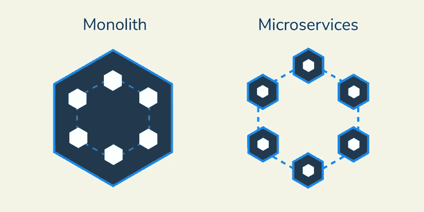
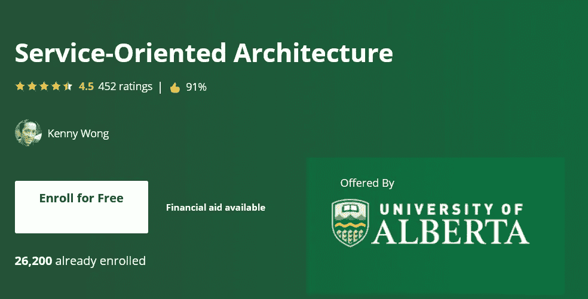
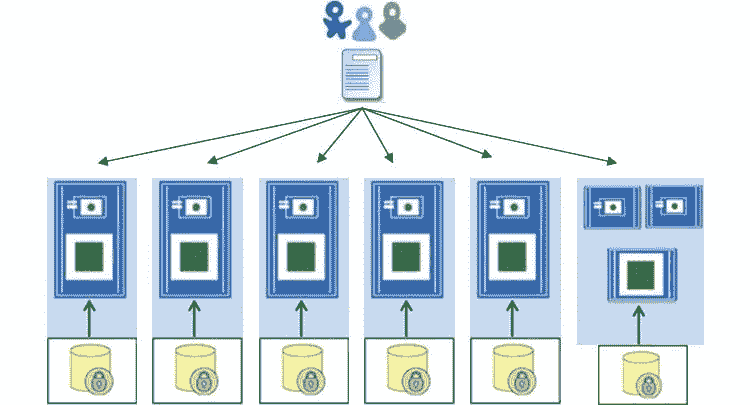
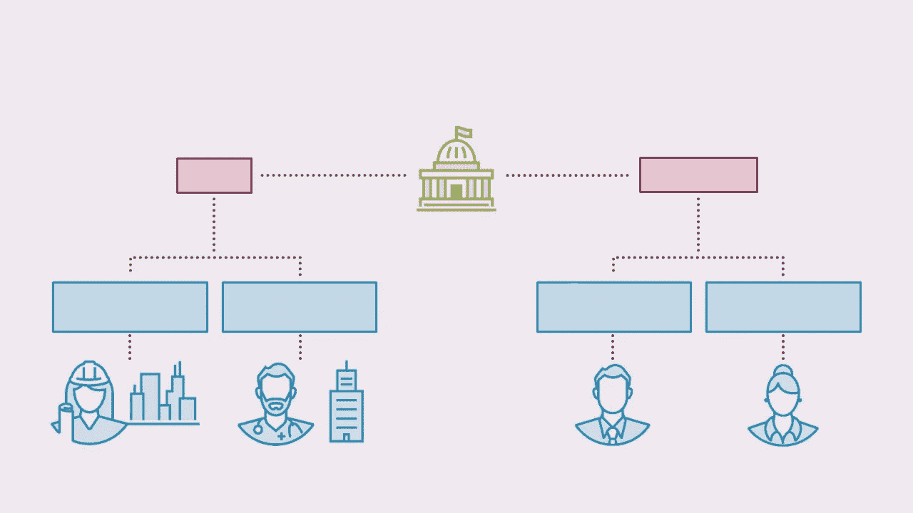
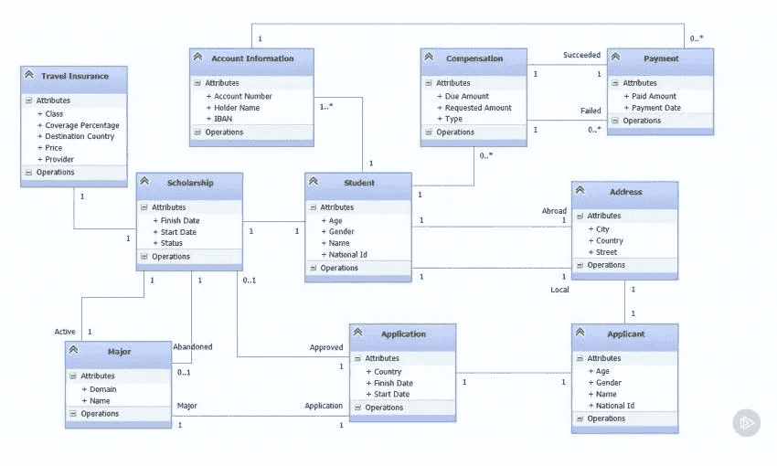
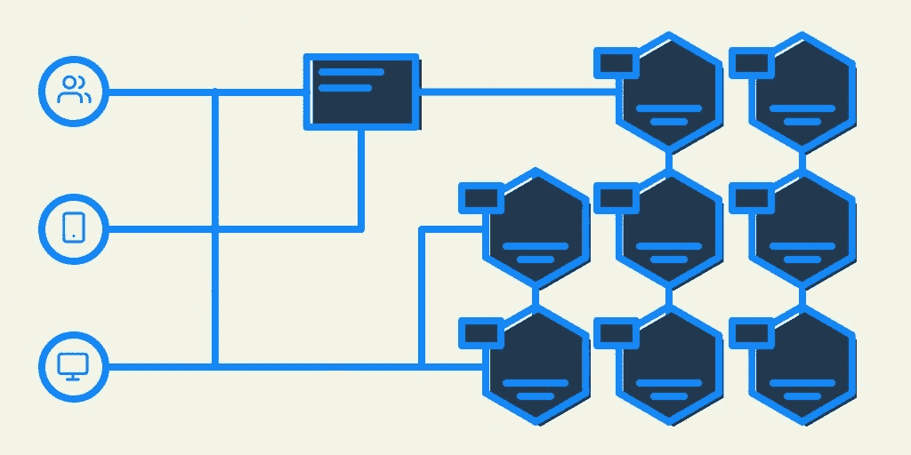

# 2023 年学习微服务和面向服务(SOA)架构的 8 大课程—最佳选择

> 原文：<https://medium.com/javarevisited/8-best-online-courses-to-learn-service-oriented-soa-and-microservices-architecture-94c01d6b94e6?source=collection_archive---------0----------------------->

## 我最喜欢的在线课程，从 Udemy、Coursera 和其他在线门户网站学习 SOA 和微服务架构

image_credit —教育性

大家好，面向服务的架构(SOA)和微服务架构是现代 Java 开发人员的必备技能，因为今天开发的大多数 Java 应用程序都遵循 SOA 和微服务架构或其变体。

不仅如此，考虑架构权衡和大规模设计系统的能力也是技术领导和软件架构师应该具备的关键技能。拥有它是升职加薪和职业发展的好方法

在建筑领域，如今很难不提到微服务。[微服务](/javarevisited/10-best-java-microservices-courses-with-spring-boot-and-spring-cloud-6d04556bdfed)的想法可能并不新鲜，但它最近已经成为设计大规模应用程序的首选方式。

在一个[微服务架构](/javarevisited/7-free-microservices-courses-for-java-programmers-c9b2f3a2ea7d)中，不同的特性被分割成独立的模块/代码库。然后，它们相互协作，作为一个整体形成一个大的服务。与单一架构相比，这有助于更轻松、更简洁的应用维护、功能开发、测试和部署。

了解微服务也可以在[系统设计面试](/javarevisited/10-best-system-design-courses-for-coding-interviews-949fd029ce65)中有所帮助，特别是当你需要解决单一责任和关注点分离的概念时。

同样，良好的 SOA 架构知识不仅可以帮助您更好地理解当前的项目，还可以促进您的职业发展，尤其是对于那些希望成为软件或解决方案架构师的高级 Java 开发人员。

过去，我曾为有抱负的软件架构师 分享过一些 [**书籍，你也可以利用这些课程来掌握你的架构和解决方案设计技能。

总之，SOA 架构为 monolith 架构提供了一种替代方案，专注于提供专用服务的小型应用。SOA 架构的一些常见例子是**](https://javarevisited.blogspot.com/2018/02/5-must-read-books-to-become-software-architect-solution.html#axzz5zZcGwmkz) **[Web 服务](https://javarevisited.blogspot.com/2018/02/top-5-restful-web-services-with-spring-courses-for-experienced-java-programmers.html)和表述性状态转移( [REST](https://javarevisited.blogspot.com/2018/02/top-5-restful-web-services-with-spring-courses-for-experienced-java-programmers.html) )架构，这在 Java 世界中非常常见。

去年在学习 SOA 的时候，我在寻找一个可以给我提供足够理论和一些现实世界实践经验的在线培训课程，但是我没有找到一个符合我要求的。我发现的大多数在线课程都有两个主要问题:从一开始就太专业，太理论化，而我需要一个平衡的课程，既不太理论化，也不太理论化。

我对学习 SOA 的最佳课程的探索给我带来了一些有用的课程，比如 Coursera 上的面向服务的架构课程，它也是由阿尔伯塔大学提供的 [**软件设计和架构专业**](https://coursera.pxf.io/c/3294490/1164545/14726?u=https%3A%2F%2Fwww.coursera.org%2Flearn%2Fservice-oriented-architecture) 的一部分。**

<https://coursera.pxf.io/c/3294490/1164545/14726?u=https%3A%2F%2Fwww.coursera.org%2Flearn%2Fservice-oriented-architecture>  

本课程解决了这两个问题，它将帮助你在进入技术领域之前理解 SOA 背后的业务。

因为您不仅将了解 SOA 的基础知识，包括架构、服务、服务类型、重用和组合，还将看到一些使用 SOA 构建的真实世界的解决方案。

你还将了解为所有 SOA 服务设计标准语义模型的重要性，完成课程后，你将了解在项目中实现 SOA 架构所需的所有工具。

本课程也是 [**软件设计和架构专业化**](https://coursera.pxf.io/c/3294490/1164545/14726?u=https%3A%2F%2Fwww.coursera.org%2Fspecializations%2Fsoftware-design-architecture) 的一部分，是软件架构方面最受欢迎的 Coursera 认证之一。

<https://coursera.pxf.io/c/3294490/1164545/14726?u=https%3A%2F%2Fwww.coursera.org%2Fspecializations%2Fsoftware-design-architecture>  

# 2023 年面向 Java 开发者的 8 门最佳 SOA 和微服务架构课程

如果你愿意，你可以直接跳到 Coursera 上的面向服务架构课程，这是一个很好的课程，但是如果你需要更多的选择，这里有一些其他对程序员有用的 SOA 课程。

## 1.[微服务架构—完整指南](https://click.linksynergy.com/deeplink?id=CuIbQrBnhiw&mid=39197&murl=https%3A%2F%2Fwww.udemy.com%2Fcourse%2Fmicroservices-architecture-the-complete-guide%2F)

这是从头学习微服务架构的最佳课程，微服务架构是当今云计算世界最流行的软件架构之一，被网飞、优步等公司采用。

如果您正在寻找一门全面而有趣的课程来学习微服务架构，那么这门课程非常适合您。该课程由资深软件架构师兼顾问练荻伽·狮式战斗机创建，将教会你学习微服务架构所需的一切。

本课程包括以下内容:

1.  什么是微服务架构，何时使用
2.  微服务解决什么问题？
3.  微服务的 9 个属性
4.  微服务的架构流程
5.  如何设计健壮可靠的微服务
6.  部署和测试微服务的技术
7.  服务网格—它是什么，它的目标，以及如何和何时使用它
8.  何时不使用微服务
9.  将整体服务转变为微服务的 3 个策略

完成本课程后，您还可以下载**微服务架构清单**，这是一份全面的清单，将指导您完成微服务系统的设计过程，并对我们将在本课程中学到的内容进行了很好的总结。

该清单将帮助您设计最佳微服务架构，帮助您决定是否应该真正利用微服务，最重要的是，它将使您成为一名更好的架构师。

**以下是加入本课程的链接—** [微服务架构—完整指南](https://click.linksynergy.com/deeplink?id=CuIbQrBnhiw&mid=39197&murl=https%3A%2F%2Fwww.udemy.com%2Fcourse%2Fmicroservices-architecture-the-complete-guide%2F)

## 2.[面向服务架构](https://coursera.pxf.io/c/3294490/1164545/14726?u=https%3A%2F%2Fwww.coursera.org%2Flearn%2Fservice-oriented-architecture)【最佳 Coursera 课程】

这是我最喜欢的，也可能是在线学习面向服务架构的最好课程。正如我之前告诉你的，它基于对架构风格的理解，你将回顾 web 应用程序的架构，然后以两种方式探索面向服务的架构(SOA)的基础:Web 服务(WS*)和表述性状态转移( [REST](https://www.java67.com/2018/02/3-books-and-courses-to-learn-restful-web-services-with-spring.html) )架构。

该课程也是 Coursera 上 [**软件设计和架构专业化**](https://coursera.pxf.io/c/3294490/1164545/14726?u=https%3A%2F%2Fwww.coursera.org%2Fspecializations%2Fsoftware-design-architecture) 的一部分，Coursera 是为有志成为软件架构师的 Java 开发人员推荐的资源。

专业化还包括一个顶点项目，在该项目中，您将把一个基于 Java 的 Android 应用程序与 Elasticsearch 连接起来，elastic search 是一个带有 REST 应用程序编程接口(API)的 web 服务。

**这里是加入本课程的链接—** [面向服务的架构](https://coursera.pxf.io/c/3294490/1164545/14726?u=https%3A%2F%2Fwww.coursera.org%2Flearn%2Fservice-oriented-architecture)

顺便说一句，如果你觉得 Coursera 课程和专业有用，那么你也应该加入 [**Coursera Plus**](https://coursera.pxf.io/c/3294490/1164545/14726?u=https%3A%2F%2Fwww.coursera.org%2Fcourseraplus) ，这是 Coursera 的一个订阅计划，为你提供**无限制访问**他们最受欢迎的课程、专业、专业证书和指导项目。它每年花费大约 399 美元，但是它完全物有所值，因为你可以获得无限制的证书

<https://coursera.pxf.io/c/3294490/1164545/14726?u=https%3A%2F%2Fwww.coursera.org%2Fcourseraplus>  

## 3.[微服务软件架构:模式和技术](https://click.linksynergy.com/deeplink?id=CuIbQrBnhiw&mid=39197&murl=https%3A%2F%2Fwww.udemy.com%2Fcourse%2Fmicroservices-software-architecture-patterns-and-techniques%2F)

这个在线课程将教你如何利用微服务架构将你的 monolith 转变成有组织的、可维护的和可扩展的服务。

本课程由 Udemy 上的 Binary Brain 创建，将教你如何使用正确的架构设计模式和技术来设计和实现微服务系统。

以下是您将在本课程中学到的内容:

1.  什么是微服务架构？好处、缺点和动机。
2.  帮助您设计、开发、部署和监控基于微服务的系统的技术
3.  如何为分布式系统实现软件架构模式，以允许可伸缩性，同时保持一致性
4.  确定技术挑战和常见陷阱

这是一个只有 1 小时视频的短期课程，但对于初学者来说，学习微服务架构非常重要，并且还提供了结业证书。

**这里是加入本课程的链接**——[微服务软件架构:模式和技术](https://click.linksynergy.com/deeplink?id=CuIbQrBnhiw&mid=39197&murl=https%3A%2F%2Fwww.udemy.com%2Fcourse%2Fmicroservices-software-architecture-patterns-and-techniques%2F)

## 4.[现实世界的 SOA:分析和设计](https://pluralsight.pxf.io/c/1193463/424552/7490?u=https%3A%2F%2Fwww.pluralsight.com%2Fcourses%2Fsoa-real-world-analysis-design)

这是由 Mohamad Halabi 教授的关于 Pluralsight 的两部分课程，非常适合任何想要正确理解 SOA 的人。这两个课程采用实用的方法来教你什么是真正的 SOA，当它适合一个组织时，它打算解决什么问题，以及如何正确地实现它。

这是第一部分，它解决了这两个问题，它将有助于您在进入技术领域之前理解 SOA 背后的业务。

首先，您将通过看到真实的业务案例来学习，并了解真实的问题和解决方案。之后，您将学习 SOA 的基础知识，包括架构、服务、服务类型、重用和组合。

最后，您将了解为所有 SOA 服务设计公共语义模型的重要性。在课程结束时，你将具备实现“正确的 SOA”所需的所有工具。

**这里是加入本课程的链接—** [真实世界的 SOA:分析与设计](https://pluralsight.pxf.io/c/1193463/424552/7490?u=https%3A%2F%2Fwww.pluralsight.com%2Fcourses%2Fsoa-real-world-analysis-design)

顺便说一下，你需要一个 [**Pluralsight 会员**](https://pluralsight.pxf.io/c/1193463/424552/7490?u=https%3A%2F%2Fwww.pluralsight.com%2Flearn) 才能加入这个课程，费用大约是每月 29 美元或每年 299 美元(14%的折扣)。我向所有程序员强烈推荐这个订阅，因为它提供了超过 7000 个在线课程的即时访问，以学习任何技术技能。或者，你也可以使用他们的 [10 天免费试用](https://pluralsight.pxf.io/c/1193463/424552/7490?u=https%3A%2F%2Fwww.pluralsight.com%2Flearn)来免费观看这个课程。

<https://pluralsight.pxf.io/c/1193463/424552/7490?u=https%3A%2F%2Fwww.pluralsight.com%2Flearn>  

## 5.[现实世界的 SOA:设计和实现](https://pluralsight.pxf.io/c/1193463/424552/7490?u=https%3A%2F%2Fwww.pluralsight.com%2Fcourses%2Fsoa-real-world-design-implementation)

本课程是“真实世界 SOA:分析和设计”课程的延续，或者在该课程中，您学习了 SOA 分析和总体设计，在这里您将获得更多关于实现的细节。

在本课程中，您将了解 SOA 服务的详细设计和实现。您将从理解驱动整个设计工作的设计原则以及服务的结构和动态开始。

然后，您将了解服务支持的不同 MEP 以及状态、会话和客户端-服务交互的管理。

最后，您将学习服务的安全性和各种其他主题。在本课程结束时，你将学到关于 SOA 的设计和实现的所有知识。

**这里是加入本课程的链接** — [真实世界的 SOA:设计和实现](https://pluralsight.pxf.io/c/1193463/424552/7490?u=https%3A%2F%2Fwww.pluralsight.com%2Fcourses%2Fsoa-real-world-design-implementation)

## 6.[微服务的进化](https://click.linksynergy.com/deeplink?id=JVFxdTr9V80&mid=39197&murl=https%3A%2F%2Fwww.udemy.com%2Fcourse%2Fevolution-of-microservices%2F%3FcouponCode%3D)【免费 Udemy 课程】

这是 Udemy 的一门免费在线课程，它比较了整体架构、面向服务架构(SOA)和微服务，这也是我将它列入这个列表的原因。

这是一个小课程，但是很好地理解了 SOA 和微服务架构的优缺点。它将帮助你回答关于 SOA 和[微服务](https://dzone.com/articles/top-5-spring-microservices-courses-with-spring-boo)的常见问题，比如在课程结束时，你将对
有相当多的了解，Monolith 看起来有什么问题？业界是如何实现 SOA 的？SOA 有什么问题？为什么选择微服务？采用[微服务](https://hackernoon.com/top-5-spring-microservice-courses-for-advanced-java-developers-ff601a57d69)时需要做的微服务优势和设计考虑。

**以下是加入本课程的链接—** [微服务的演变](https://click.linksynergy.com/deeplink?id=JVFxdTr9V80&mid=39197&murl=https%3A%2F%2Fwww.udemy.com%2Fcourse%2Fevolution-of-microservices%2F%3FcouponCode%3D)

## 7.[微服务:设计高度可伸缩的系统](https://click.linksynergy.com/deeplink?id=CuIbQrBnhiw&mid=39197&murl=https%3A%2F%2Fwww.udemy.com%2Fcourse%2Fintroduction-to-microservices%2F)【Udemy】

对于希望了解微服务架构并希望设计高可伸缩系统的高级开发人员和软件架构师来说，这是另一个很好的课程。

本课程由拥有 14 年软件设计和开发经验的资深软件工程师 Sean Campbell 创建，将教你如何设计健壮、高可伸缩和松耦合的微服务。您不仅会学到基础知识，还会学到微服务的实际设计模式。

本课程包括以下内容:

1.  微服务架构的核心原则和构建模块
2.  微服务的优势和反模式
3.  通过 API 网关进行客户端到微服务的通信
4.  使用事件总线的事件驱动通信
5.  分布式事务如何与微服务一起工作
6.  微服务的容器化
7.  构建和管理微服务的工具和技术
8.  如何将单片应用程序转换为微服务
9.  微服务模式，如 CQRS 和佐贺模式。

完成本课程后，您将对如何在基于微服务的系统中管理数据和分布式事务、如何保护微服务以及微服务如何通过异步事件驱动的通信进行交互，同时保持自主性和独立性有一个扎实的了解。

**这里是加入本课程的链接** — [微服务:设计高度可扩展的系统](https://click.linksynergy.com/deeplink?id=CuIbQrBnhiw&mid=39197&murl=https%3A%2F%2Fwww.udemy.com%2Fcourse%2Fintroduction-to-microservices%2F)

## 8.[微服务原理和概念介绍](https://www.educative.io/courses/introduction-microservice-principles-concepts?affiliate_id=5073518643380224)

如果您正在寻找一个交互式课程来了解微服务架构，那么 Educative 的这个基于文本的交互式课程是一个很好的开始。

在本课程中，您将深入了解微服务，并理解支持和反对微服务的原因。除此之外，您还将了解微观和宏观架构、迁移旧系统的策略、Docker 在该架构中的角色以及实现微服务的技术。

还有本课程的第二部分，[微服务架构:实际实施](https://www.educative.io/courses/microservice-architecture-practical-implementation?affiliate_id=5073518643380224)更进一步，您将实际学习如何用各种技术实施它们。

这些课程结束后，你将成为一名微服务专家。无论你是软件工程师还是工程经理，这些课程都将在你的职业生涯中证明其价值。

**以下是加入本课程** — [微服务原理和概念介绍](https://www.educative.io/courses/introduction-microservice-principles-concepts?affiliate_id=5073518643380224)的链接

而且，如果你发现教育平台和他们的搜索课程，像[搜索系统设计面试](https://www.educative.io/subscription?affiliate_id=5073518643380224)，搜索面向对象编程面试，然后考虑获得 [**教育订阅**](https://www.educative.io/subscription?affiliate_id=5073518643380224) ，提供对他们的 100 多门课程的访问，每月只需*$ 14.9*。非常划算，非常适合准备编码面试。

<https://www.educative.io/subscription?affiliate_id=5073518643380224>  

以上是关于学习 SOA 或面向服务架构的一些最好的在线培训课程。一旦你有了 SOA 基础的背景知识，你可以随时加入课程来学习更多关于 Web 服务或 REST 架构的知识，这是 SOA 的两个现实世界的实现。

同样，如果您了解[微服务](https://dev.to/javinpaul/top-10-courses-to-learn-spring-boot-and-microservices-for-java-programmers-3hjg)，您可以轻松地修改您的应用程序，以利用基于容器的架构，该架构在云上易于部署和扩展。

其他 **Java 编程与开发** **你可能喜欢的文章**

*   [2023 年 Java 开发者路线图](https://javarevisited.blogspot.com/2019/10/the-java-developer-roadmap.html#123)
*   [2023 年 Java 和 Web 开发人员应该学会的 10 件事](http://javarevisited.blogspot.sg/2017/12/10-things-java-programmers-should-learn.html#axzz53ENLS1RB)
*   [学习 Spring 微服务的 5 大课程](/javarevisited/top-5-courses-to-learn-microservices-in-java-and-spring-framework-e9fed1ba804d)
*   [2023 年 Java 开发者应该学习的 5 个框架](http://javarevisited.blogspot.sg/2018/04/top-5-java-frameworks-to-learn-in-2018_27.html)
*   [每个 Java 开发者都应该知道的 10 个工具](https://javarevisited.blogspot.com/2019/02/10-tools-advanced-java-developers-should-know.html)
*   [我最喜欢的学习软件架构的课程](/javarevisited/top-5-courses-to-learn-software-architecture-in-2020-best-of-lot-5d34ebc52e9)
*   Java 程序员可以学习的 10 项技能可以加速他们的职业生涯
*   每个 Java 程序员在 2023 年应该阅读的 10 本书
*   Java 开发人员在日常工作中使用的 10 种工具
*   成为更好的 Java 程序员的 10 个技巧

非常感谢您阅读这篇文章。如果你喜欢这些*最好的微服务和面向服务的架构课程*，那么请分享给你的朋友和同事。如果您有任何问题或反馈，请留言。

**【p . s .】**—如果你正在寻找学习 Java 设计模式的免费课程，这对软件架构师也很重要，那么你也可以在 Udemy 上查看 [**Java 设计模式和架构**](http://bit.ly/java-design-patterns-tutorial) 课程。也是免费的。

<http://bit.ly/java-design-patterns-tutorial> 