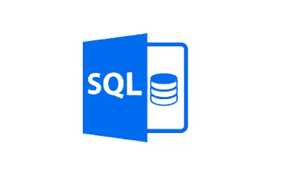
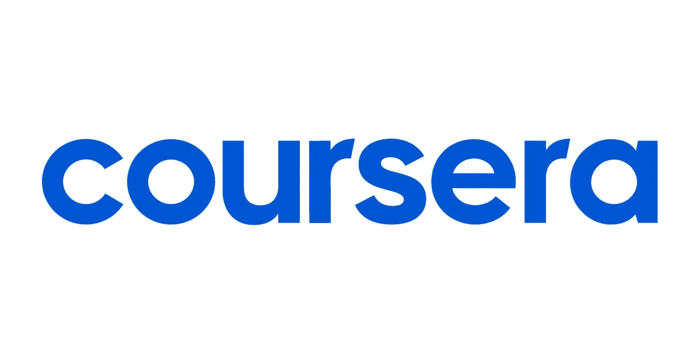
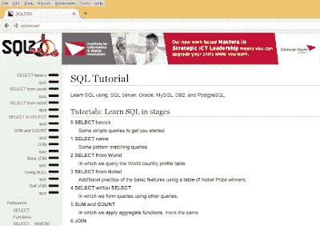
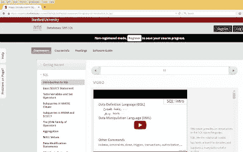
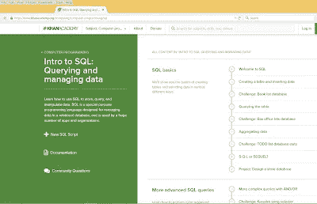
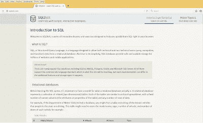
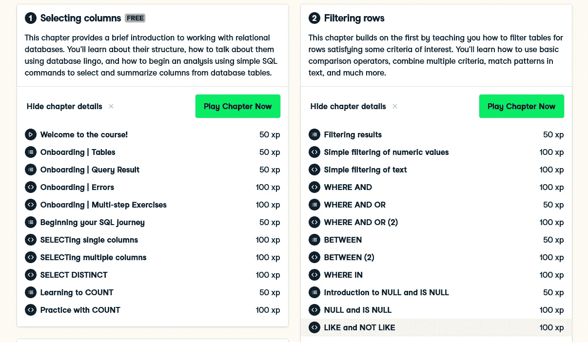
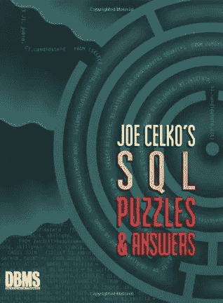

# 免费在线学习 SQL 的 10 个最佳地点

> 原文：<https://medium.com/javarevisited/8-best-resources-to-learn-sql-online-for-free-b00506d88c91?source=collection_archive---------0----------------------->

## 我最喜欢的在线学习 SQL 查询和数据库基础的网站有 SQLZoo、SQLBolt、Khan Academy 和 Udemy

image_credit — udemy

大家好，如果你想深入学习 SQL，并且正在寻找最好的免费资源，如网站、书籍和在线课程，那么你来对地方了。早些时候，我已经分享了[最好的免费 SQL 课程](/javarevisited/7-free-courses-to-learn-database-and-sql-for-programmers-and-data-scientist-e7ae19514ed2)和[书籍](/javarevisited/5-best-books-to-learn-sql-and-database-design-for-programmers-and-developers-1e7839df2f3e)，在这篇文章中，我将分享你可以为我在线学习 SQL 的最好的网站和地方。

SQL 对于任何程序员来说都是最重要的技能之一，无论是 [Java](https://javarevisited.blogspot.com/2017/11/top-5-free-java-courses-for-beginners.html) 、 [C++](http://www.java67.com/2018/02/5-free-cpp-courses-to-learn-programming.html) 、 [Python](https://javarevisited.blogspot.com/2018/12/10-free-python-courses-for-programmers.html#axzz5ajt49s2B) 、 [JavaScript](http://www.java67.com/2018/04/top-5-free-javascript-courses-to-learn.html) 还是 [Ruby](http://www.java67.com/2018/02/5-free-ruby-and-rails-courses-to-learn-online.html) 开发人员。几乎 95%的 Java 应用程序在其后端使用关系数据库，几乎所有的 web 应用程序都使用数据库。

近年来，学习任何编程技能最常见的方式之一是在线，在您舒适的办公室或家中，SQL 也不例外。在线学习 SQL 还有一个快速起步的优势，因为您不需要安装数据库和创建表来编写一些[选择查询](https://javarevisited.blogspot.com/2011/10/selct-command-sql-query-example.html#axzz6pRY6p3if)。

对于初学者来说，安装和设置绝对是一个艰难的部分，每次我必须学习一个新的数据库时，我都经历过这种痛苦。

无论如何，一旦你开始编写查询并看到结果，你会觉得需要有信心进入下一个阶段，这包括下载并在你的机器上安装流行数据库的免费副本，如 [MySQL](https://javarevisited.blogspot.com/2018/05/top-5-mysql-courses-to-learn-online.html) 、 [SQL Server](https://javarevisited.blogspot.com/2018/12/top-5-free-microsoft-sql-server-and-transact-sql-online-courses.html) 、 [PostgreSQL](/javarevisited/7-best-free-postgresql-courses-for-beginners-to-learn-in-2021-3bf369d73794) 或 [Oracle](http://www.java67.com/2018/02/5-free-oracle-and-microsoft-sql-server-online-courses.html) 。

从我的经验来看，可以说 SQL 易学难精通。您可以在大约一个小时左右开始[编写 SQL 查询](https://javarevisited.blogspot.com/2017/02/top-6-sql-query-interview-questions-and-answers.html)，但是当涉及到编写查询来解决实时需求或报告目的时，就没那么容易了。

在像 *SQLZoo* 或 *SQLFiddle* 这样的网站上在线练习 SQL 将进一步帮助你保持最新状态并提高你的 SQL 技能，这是对任何 SQL 开发人员或程序员的主要挑战。

# 免费在线学习 SQL 的 10 个最佳网站

下面是我收集的排名前五的网站，我发现学习和掌握 SQL 很好。互联网上有许多网站、博客和教程，但同时，很难找到优秀的资源。由于我热衷于收集学习技术的好资源，我总是把我的伟大发现收藏起来。这些网站只是其中的一部分，虽然有些很普通，比如 Udemy T21 和 Coursera，其他的像 SQLZoo 和 SQLBolt 是真正的瑰宝。

## 1.Udemy

这个网站有最大的在线课程集，包括免费和付费课程。由于在线课程是学习新技术或编程语言的好方法，你也可以学习 SQL 和数据库的基础知识。在那里找到合适的课程也是一项艰难的工作，因为课程实在太多了，你不确定哪个老师是最好的，哪个课程符合你的要求，所以你需要观看预览，阅读评论，并在此基础上做出决定。

要我说的话， [**乔希·波尔蒂利亚的《SQL 训练营大全**](https://click.linksynergy.com/fs-bin/click?id=JVFxdTr9V80&subid=0&offerid=634352.1&type=10&tmpid=14538&RD_PARM1=https%3A%2F%2Fwww.udemy.com%2Fthe-complete-sql-bootcamp%2F) 是学习 SQL 最好的课程。超过 127，000 名学生平均给它打了 4.5 分，这确实令人印象深刻。

唯一的问题是，它不是免费的，但你可以非常便宜地买到，比如在 Udemy 的闪购上不到 10 美元，这种事情经常发生。该课程还提供证书，表明您已经完成了 SQL 培训，添加到您的简历或 Linkedin 个人资料中。

我已经说过了，Udemy 也有很多学习 SQL 和数据库的免费课程，以下是我的建议开始学习。

1.  [**数据库和 SQL 查询简介**](https://click.linksynergy.com/fs-bin/click?id=JVFxdTr9V80&subid=0&offerid=634352.1&type=10&tmpid=14538&RD_PARM1=https%3A%2F%2Fwww.udemy.com%2Fintroduction-to-databases-and-sql-querying%2F) — 4.3 来自 17.5 万名学生的评价
2.  [**高级数据库和 SQL 查询**](https://click.linksynergy.com/fs-bin/click?id=JVFxdTr9V80&subid=0&offerid=634352.1&type=10&tmpid=14538&RD_PARM1=https%3A%2F%2Fwww.udemy.com%2Fadvanced-tsql-querying-using-sql-2014%2F) — 4.3 来自约 10 万名学生的评价
3.  [**Oracle SQL —完整介绍**](https://click.linksynergy.com/fs-bin/click?id=JVFxdTr9V80&subid=0&offerid=634352.1&type=10&tmpid=14538&RD_PARM1=https%3A%2F%2Fwww.udemy.com%2Fintroduction-to-oracle-sql%2F) — 4.5 来自 25000 名学生的评分
4.  [**微软 SQL Server —简介**](https://click.linksynergy.com/deeplink?id=JVFxdTr9V80&mid=39197&murl=https%3A%2F%2Fwww.udemy.com%2Fcourse%2Fmicrosoft-sql-server-an-introduction-2018-edition%2F) — 4.4 来自 7000 名学生的评价

你可以在 Udemy 上学习一些优秀的免费课程，学习 SQL 和数据库基础知识、查询等。尽管你需要小心，这些课程可能不会一直免费，一旦教师达到他们的推广目标，它们可能会转变为付费课程。

但是，一旦你加入，它将一直免费向你开放。所以，最好在它们成为付费课程之前加入它们，在你方便的时候学习。

## 2. [Coursera](https://coursera.pxf.io/c/3294490/1164545/14726?u=https%3A%2F%2Fwww.coursera.org%2F)

Coursera 是另一个免费学习热门技术技能的地方。很多人不知道，但是 Coursera 有很多[免费课程](/javarevisited/top-15-free-coursera-courses-and-certifications-for-it-professionals-384207d56f45)，他们的付费课程大部分也是免审核的。他们是学习数据科学的最佳网站，并获得了一些有用的课程来学习基本的数据科学技能，如 SQL。

以下是一些 Coursera 课程，你可以免费加入学习 SQL:

1.  [**数据科学 SQL**](https://coursera.pxf.io/c/3294490/1164545/14726?u=https%3A%2F%2Fwww.coursera.org%2Flearn%2Fsql-for-data-science)——Coursera 上最受欢迎的 SQL 课程，已经有超过 33 万人加入了这门课程。
2.  [**结构化查询语言(SQL)简介**](https://coursera.pxf.io/c/3294490/1164545/14726?u=https%3A%2F%2Fwww.coursera.org%2Flearn%2Fintro-sql) —这是密歇根大学在 Coursera 上提供的另一门很棒的 SQL 课程。它的平均收视率为 4.8，超过 12 万人加入了它。
3.  [**PostgreSQL 中的数据库设计和基本 SQL**](https://coursera.pxf.io/c/3294490/1164545/14726?u=https%3A%2F%2Fwww.coursera.org%2Flearn%2Fdatabase-design-postgresql) —这一本是给想学习 PostgreSQL 中的数据库设计和 SQL 的人看的，PostgreSQL 是一个流行的 SQL 厂商。这是一门相对较新的课程，但平均评分为 4.8 分。
4.  [**中级 SQL**](https://coursera.pxf.io/c/3294490/1164545/14726?u=https%3A%2F%2Fwww.coursera.org%2Flearn%2Fdatabase-design-postgresql)**——这是 Coursera 又一个牛逼的 PostgreSQL 课程，可以免费加入。更多的是针对熟悉 PostgreSQL 的中级开发者。例如，您可以在完成之前的课程后加入。**

**总的来说，这些是 Coursera 提供的最好的 SQL 课程，你可以从中学习这一有用的技术技能。大部分都是免费或者免审核的。**

****

**当谈到加入这门课程时，你有两个选择，你可以单独加入这门课程，每月花费大约 39 美元进行专业化，你也可以加入 [**Coursera Plus**](https://coursera.pxf.io/c/3294490/1164545/14726?u=https%3A%2F%2Fwww.coursera.org%2Fcourseraplus) ，每月花费 59 美元，这是 Coursera 的一个订阅计划，让你无限制地访问他们最受欢迎的课程、专业化、专业证书和指导项目。**

**<https://coursera.pxf.io/c/3294490/1164545/14726?u=https%3A%2F%2Fwww.coursera.org%2Fcourseraplus> ** 

## **[3。SQLZoo](http://sqlzoo.net/)**

**SQLZoo 是最好的，我猜也是最受欢迎的在线学习 SQL 的网站之一。它提供了教程和练习，这就是为什么它对刚开始使用 SQL 的人和了解 SQL 但希望通过一些好的实践来真正掌握它的程序员同样有用。SQLZoo 提供了易于理解的教程和交互式示例来编写查询并在浏览器中查看结果。您将在该网站上找到 SQL 交互式教程、示例和练习。它涵盖了大多数 SQL 子句，如读取数据的 SELECT 子句、创建新数据库的 CREATE 子句、更改数据库的 ALTER 子句和删除数据和表的 DELETE 子句。**

**它还涵盖了一些高级概念，如按、[索引](https://www.java67.com/2017/12/difference-between-table-scan-index.html)、[视图](https://www.java67.com/2012/11/what-is-difference-between-view-vs-materialized-view-database-sql.html)、 [SQL 连接](https://javarevisited.blogspot.com/2013/05/difference-between-left-and-right-outer-join-sql-mysql.html)、[子查询](https://www.java67.com/2017/06/difference-between-correlated-and-non-correlated-subquery-in-sql.html)，处理 SQL 中的空值等。SQLZoo 还有几个 SQL 小测验来测试你的知识。

总之，这个网站是在线学习和掌握 SQL 的最佳资源之一，而且是免费的。每个对 SQL 感兴趣的程序员都可以从这个网站中受益。**

****

## **3.[从 CodeCademy 学习 SQL【免费】](https://www.pntrs.com/t/TUJGR0lLR0JHRklJSkhCR0ZISk1N?url=https%3A%2F%2Fwww.codecademy.com%2Flearn%2Flearn-sql)**

**这是另一个免费学习 SQL 的好地方或网站。Codecademy 是我最早了解的互动网站之一，从那以后，我在 Codecademy 上学会了许多关键技能，如 [Linux bash](/javarevisited/6-free-courses-to-learn-bash-shell-scripting-in-linux-and-unix-a50461ecd4fe) 、 [SQL](/javarevisited/6-free-courses-to-learn-bash-shell-scripting-in-linux-and-unix-a50461ecd4fe) 、 [Java](/javarevisited/10-free-courses-to-learn-java-in-2019-22d1f33a3915?source=collection_home---4------8-----------------------) 和 [JavaScript](/javarevisited/my-favorite-free-tutorials-and-courses-to-learn-javascript-8f4d0a71faf2) 。**

**同样，他们的大多数课程都是免费的，但不是全部，你需要 [**Codecademy PRO 会员**](https://bit.ly/codecademypro) 才能访问他们的高级课程。**

**在这个免费的 SQL 课程中，您将学习如何通过 SQL 与关系数据库进行通信。您不仅将学习，还将通过 4 个项目进行实践——如何操作数据和构建与多个表通信的查询。**

**以下是你将在 Codecademy 的免费 SQL 课程中学到的东西:**

1.  **如何使用 SQL 访问、创建和更新存储在数据库中的数据。**
2.  **如何通过学习基本的查询关键字和功能来编写复杂的查询**
3.  **如何使用强大的功能轻松执行复杂的数据库操作？**
4.  **如何创建和操作具有多个相关表的数据库**

**超过 120 万人加入了这个[免费 SQL 课程](https://www.pntrs.com/t/TUJGR0lLR0JHRklJSkhCR0ZISk1N?url=https%3A%2F%2Fwww.codecademy.com%2Flearn%2Flearn-sql)，你也可以加入。**

****

## **[4。斯坦福大学 SQL 课程](https://lagunita.stanford.edu/courses/DB/SQL/SelfPaced/courseware/ch-sql/seq-vid-introduction_to_sql/)**

**这是斯坦福大学提供的免费 SQL 课程。本课程包含很好的 SQL 视频教程，解释基本和高级 SQL 和关系数据库概念。

你可以在注册和非注册模式下使用本课程，不过最好注册以保存你的进度。这也是一个自定进度的课程，这样你就可以按照自己的速度学习。这个[网站](https://javarevisited.blogspot.com/2015/06/5-websites-to-learn-sql-online-for-free.html)还免费提供所有课程材料，如 SQL 脚本、课程幻灯片等。，您可以从相关部分下载。鉴于本课程来自斯坦福大学，您可以放心质量。**

****

## **5.[可汗学院的 SQL 课程](https://www.khanacademy.org/computing/computer-programming/sql)**

**Khan Academy 是在线学习计算机科学和编程的最佳网站之一，它也有一个很好的 SQL 教程，标题是**“SQL 简介:查询和管理数据库”**

在这个免费的 SQL 教程中，你将学习如何使用 [SQL](/javarevisited/8-free-oracle-database-and-sql-courses-for-beginners-f4e9b25b33c4) 来存储、查询和操作数据。SQL 是一种专用编程语言，旨在管理关系数据库中的数据，被许多应用程序和组织使用。

我过去用过可汗学院的一些教程，这是其中之一；这就像一个虚拟教室。**

**SQLZoo 的好伴侣，让你的学习完整。也可以从一些好的 SQL 书籍中得到帮助，比如 [**Head First SQL**](http://www.amazon.com/Head-First-SQL-Brain-Learners/dp/0596526849?tag=javamysqlanta-20) 。如果你是一个初学者，头先的方法是学习 SQL 的最好方法之一。**

****

## **6.SQL 教程—面向初学者的完整数据库课程[FreeCodeCamp]**

**FreeCodecamp 是学习技术技能的另一个有用的地方。他们有一个 freecodecamp.org 网站和一个 Youtube 频道，里面有很多免费但全面的课程，这是其中之一。**

**这门 SQL 课程已经有超过 700 万的浏览量，我认为它是 Youtube 上最受欢迎的免费 SQL 课程。**

**该课程是为 SQL 和数据库管理系统的初学者设计的，并将介绍常见的数据库管理主题。**

**在整个课程中，您将学习关键的 SQL 主题，如模式设计、基本的 C.R.U.D 操作、[聚合](https://www.java67.com/2019/08/microsoft-sql-server-phone-interview-questions-answers.html)、[嵌套查询](https://www.java67.com/2017/06/difference-between-correlated-and-non-correlated-subquery-in-sql.html)、[连接](https://javarevisited.blogspot.com/2012/11/how-to-join-three-tables-in-sql-query-mysql-sqlserver.html#axzz6fvDCikIM)、键等等。**

**你可以在这里或者 youtube 上免费观看这个课程。**

## **7. [SQLBolt](http://sqlbolt.com/)**

**SQLBolt 是另一个很好的学习 SQL 的网站，它有简单的交互式例子。它包含一系列交互式课程和练习，旨在帮助您在浏览器中快速学习 SQL。

包含了从基本 SQL 查询到更高级的[混淆连接查询](http://javarevisited.blogspot.sg/2012/11/how-to-join-three-tables-in-sql-query-mysql-sqlserver.html)、[聚合](https://javarevisited.blogspot.com/2020/06/5-example-of-group-by-clause-in-sql.html)、[过滤](https://javarevisited.blogspot.com/2020/04/sql-group-by-and-having-example-write.html)、[处理空值](https://javarevisited.blogspot.com/2017/01/how-to-check-for-null-values-in-sql.html#axzz5h5GizveY)的 20 个教训。是完全初学者学习 SQL 的最佳资源之一。

所以如果你是一个想学习 SQL 的人，或者你知道 SQL 但是不太适应，那就去试试 SQLBolt 的 interactive SQL 教程吧。SQLBolt 在每节课之后还有 SQL 任务，会强制要求你使用课上学到的知识。**

**查询的质量很好，开始时很容易，后来变得很难。如果您在[编写 SQL 查询](https://www.java67.com/2013/04/10-frequently-asked-sql-query-interview-questions-answers-database.html)来解决任务时遇到困难，您甚至可以从他们的解决方案中获得帮助。

我建议你完成出租人后尽快完成任务，然后第二天做一些变化的任务。**

****

## **8.[数据营](https://datacamp.pxf.io/c/1193463/1012793/13294)**

**很多人不知道 Datacamp 有一门优秀的 SQL 课程，你可以用它来学习数据科学的 SQL。该课程是掌握在关系数据库(如 MySQL、SQL Server 和 PostgreSQL)中查询表的基础知识的极好资源。**

**本课程教授多种类型数据库共享的 SQL 语法，如 [PostgreSQL](https://javarevisited.blogspot.com/2020/02/top-5-courses-to-learn-postgresql-in.html) 、 [MySQL](/javarevisited/top-5-courses-to-learn-mysql-in-2020-4ffada70656f) 、 [SQL Server](/javarevisited/5-best-courses-to-learn-microsoft-sql-server-in-depth-e9f11b73c14a) 和 Oracle，它将告诉您开始使用数据库所需的一切！**

**第一章，**过滤栏目，**是完全免费的。您将了解 SQL 中的表、列和行，如何使用数据库术语谈论它们，以及如何使用简单的 SQL 命令从数据库表中选择和汇总列来开始分析。**

**通过加入本 [**SQL 课程**](https://datacamp.pxf.io/3Pdy2X) ，您将通过解决游戏化问题来学习重要的 SQL 技能，以资鼓励和学习。顺便说一下，其他章节不是免费的，您可能需要购买 Datacamp 订阅才能访问它们。然而，对于初学者来说，这是一个很好的资源，我强烈推荐这本书。**

****

**如果你像我一样了解 SQL，但总是希望增长知识，喜欢尝试一些好的 SQL 查询，请查看 Joe Celko 的 [**SQL 谜题和答案，第二版**](http://www.amazon.com/Puzzles-Answers-Edition-Kaufmann-Management/dp/0123735963?tag=javamysqlanta-20)；是学习和掌握 SQL 编程的绝佳资源之一。**

****

**以上是免费在线学习 SQL 和数据库概念的一些最佳资源**。虽然互联网上充满了免费的东西，但很难找到一个好的资源。我仍然尊重策划资源，并从中受益匪浅。虽然没有什么可以取代课堂培训，但是书籍、博客、视频教程和互动网站的结合确实可以帮助你达到目的。****

****其他一些**程序员免费在线资源******

*   ****10 门最佳 SQL 和数据库在线课程([最佳课程](/hackernoon/top-5-sql-and-database-courses-to-learn-online-48424533ac61))****
*   ****完整的 DevOps 路线图([路线图](https://javarevisited.blogspot.com/2018/09/the-2018-devops-roadmap-your-guide-to-become-DevOps-Engineer.html))****
*   ****学习 SQL Server 数据库的 10 门免费课程([免费课程](/javarevisited/top-10-free-courses-to-learn-microsoft-sql-server-and-oracle-database-in-2020-6708afcf4ad7))****
*   ****使用 SQLFiddle 在任何数据库上在线练习 SQL 查询的网站([参见此处](http://javarevisited.blogspot.com/2013/10/database-website-to-run-and-practice-sql-query-online-free.html))****
*   ****2 个学习 Java 和 Python 在线编码的网站([见这里](http://javarevisited.blogspot.sg/2015/06/2-websites-to-learn-coding-in-java-online-free.html))****
*   ****免费学习 Java 编码的五大网站([网站](https://javarevisited.blogspot.com/2018/07/top-5-websites-to-learn-coding-in-java.html))****
*   ****初学者学习 MySQL 数据库的 5 门最佳课程([课程](/javarevisited/top-5-courses-to-learn-mysql-in-2020-4ffada70656f))****
*   ****初学者学习 PostgreSQL 的五大课程([课程](/javarevisited/7-best-free-postgresql-courses-for-beginners-to-learn-in-2021-3bf369d73794))****
*   ****学习 Java 的 10 本免费书籍([查看这里](http://java67.blogspot.sg/2013/11/10-free-java-programing-books-download-PDF-HTML.html))****
*   ****初学者学习 Java 编程的 10 门免费课程([课程](http://www.java67.com/2018/08/top-10-free-java-courses-for-beginners-experienced-developers.html))****
*   ****学习春天和 Spring Boot 的 5 门免费课程([课程](http://www.java67.com/2017/11/top-5-free-core-spring-mvc-courses-learn-online.html))****
*   ****完整的 React JS 路线图([路线图](https://javarevisited.blogspot.com/2018/10/the-2018-react-developer-roadmap.html)****
*   ****在线学习数据库和 SQL 的 5 门免费课程([门课程](http://www.java67.com/2018/02/5-free-database-and-sql-query-courses-programmers.html)****

****感谢您阅读本文。如果你喜欢这些*网站免费在线学习 SQL，*请分享给你的朋友和同事。如果您有任何问题或反馈，请留言。

**p . s .**——如果你不介意花几块钱去学习像 SQL 这样的有价值的技能，而这种技能可以让你长期受益，那么我也推荐你去看看 Educative 上的[**SQL 课程入门指南，这是一个交互式的、基于文本的网站，你可以在你的浏览器上在线练习 SQL，而不需要安装任何数据库或设置表格和测试数据。**](https://www.educative.io/courses/introductory-guide-to-sql?affiliate_id=5073518643380224)****

****<https://www.educative.io/courses/introductory-guide-to-sql?affiliate_id=5073518643380224> ****