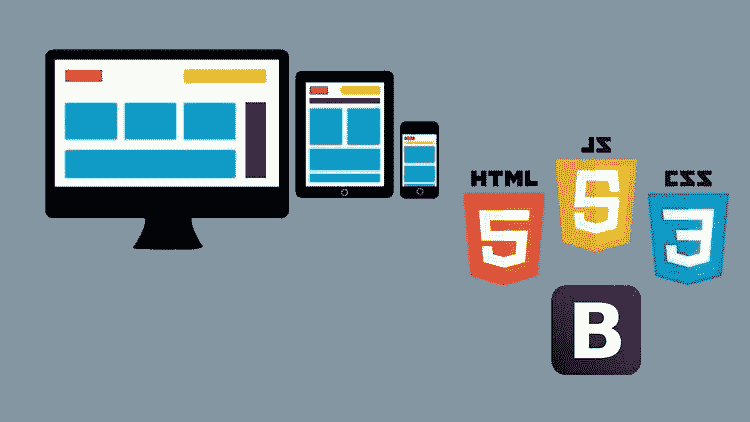
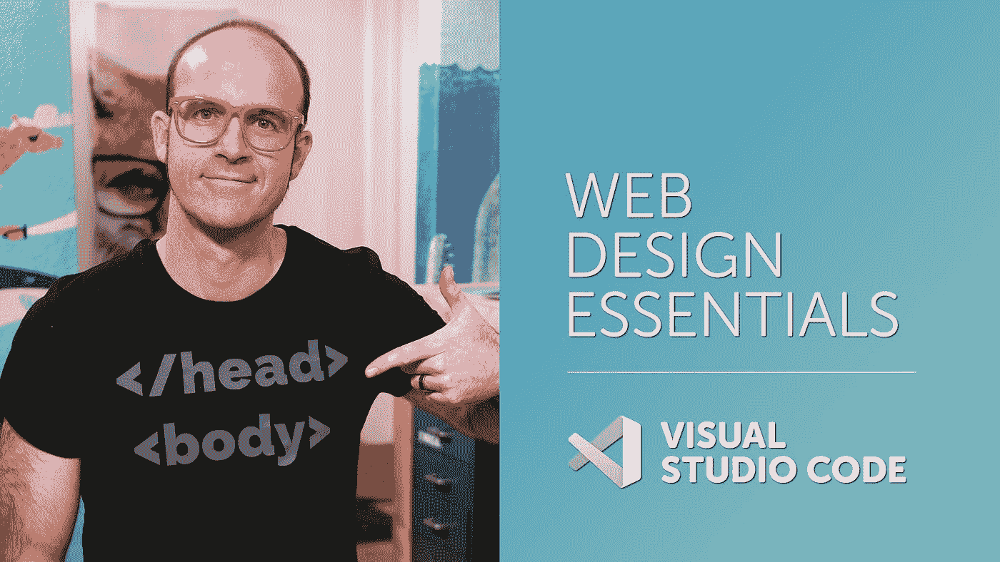
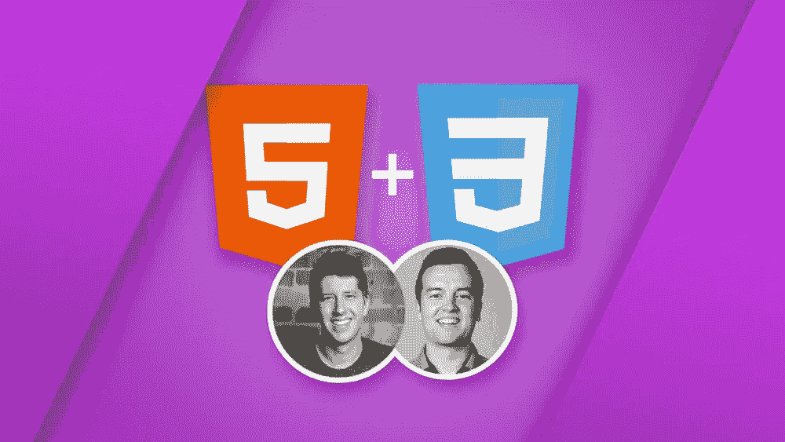
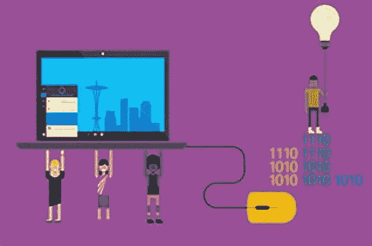

# 2023 年初学者学习响应式网页设计的 8 门最佳在线课程

> 原文：<https://medium.com/javarevisited/8-best-responsive-design-courses-for-web-developers-e507f7952774?source=collection_archive---------1----------------------->

## 我最喜欢的课程是从 Udemy、Coursera 和 Pluralsight 为 Web 开发人员学习响应式 Web 设计师。

image_credit — udemy

你好伙计们，如果你想在 2023 年学习响应式网页设计，并寻找最好的资源，如在线培训课程，那么你来对地方了。在前几篇文章中，我已经分享了学习 [**HTML**](/javarevisited/10-best-html-and-css-courses-for-beginners-in-2021-6757eec00032) **，** [**CSS**](/javarevisited/10-best-css-online-courses-for-beginners-and-experienced-developers-54aa2e8c0253) **，**[**Photoshop**](/javarevisited/6-free-online-courses-to-learn-adobe-photoshop-cc-for-beginners-47edcd2bdda5)的最佳课程，在这篇文章中，我将分享 2023 年初学者学习响应式网页设计的最佳在线课程。

这些课程是由经验丰富的网页设计师和开发人员创建的，成千上万的程序员和开发人员相信这个课程可以学习响应式网页设计。你也可以加入他们，在家里学习这一热门技能。

响应式网页设计是成为前端网页开发者、网页设计师、甚至全栈开发者的必备技能之一。

在过去的几年里，智能手机已经成为我们生活中不可或缺的一部分。我们每个人每天都在使用它。这就是为什么最近所有的网页都在开发适应任何屏幕类型的响应页面。随着越来越多的人使用不同屏幕尺寸的手机访问网站，网站拥有响应迅速的网页已经势在必行。如果网站不好看，他们也会很快离开，这意味着销售和收入的损失。对于任何电子商务企业来说，拥有一个响应迅速的网站直接意味着更好的用户体验和更高的销售额。响应式网页设计是一种创建网页的方式，因此它们自动适应多种类型的设备，调整屏幕大小并改变界面以获得更好的用户体验。

有很多工具可以让你创建这种类型的页面，我们会告诉你不同的课程，教你如何创建自己的页面。

顺便说一句，如果你刚刚开始 web 开发，那么我也建议你去参加由安吉拉·于 举办的[**2023 Web 开发训练营，这是 2023 年学习 Web 开发的最佳课程之一。**](https://click.linksynergy.com/deeplink?id=JVFxdTr9V80&mid=39197&murl=https%3A%2F%2Fwww.udemy.com%2Fcourse%2Fthe-complete-web-development-bootcamp%2F)

 [## 2023 年成为 FullStack Web 开发人员的 10 大在线课程[更新]

### 大家好，如果你想学习 Web 开发或在 2020 年成为一名全栈 Web 开发人员，那么你已经来到了…

medium.com](/javarevisited/top-10-online-courses-to-become-a-fullstack-web-developer-in-2020-d608a6b63232) 

# 2023 年 8 门最佳初学网页设计课程

这里列出了学习响应式网页设计的最佳在线课程。这些课程是由专家创建的，受到了网上和世界各地成千上万开发者的信任。它们也很实惠，尤其是 Udemy 课程，你只需花 10 美元就能在 [Udemy sales](https://click.linksynergy.com/deeplink?id=CuIbQrBnhiw&mid=39197&murl=https%3A%2F%2Fwww.udemy.com%2F) 上买到，这种事情时有发生。

## 1.[响应式网页设计精要— HTML5 CSS3 引导](https://click.linksynergy.com/deeplink?id=JVFxdTr9V80&mid=39197&murl=https%3A%2F%2Fwww.udemy.com%2Fcourse%2Fresponsive-web-design-tutorial-course-html5-css3-bootstrap%2F)

这是学习使用 HTML 5 和 CSS 3 进行响应式网页设计的最佳 Udemy 课程。它是专门为初学者创建的，通过构建 5 个项目从头开始教他们 HTML 和 CSS 基础知识。

由最畅销的 Udemy 讲师之一丹尼尔·沃尔特·斯科特(Daniel Walter Scott)创建，在这门课程中，你将学习如何使用响应图像和图标，学习如何创建表单，以及为你的网站选择优秀的字体。你还将知道如何建立一个带主机的域名，这样你的网站就可以在互联网上直播给其他人看。这结合了[**引导**](https://www.java67.com/2019/01/5-free-bootstrap-course-to-learn-online.html) 来轻松添加转盘、卡片和复杂的菜单。它是为没有任何网页设计知识的初学者准备的。它包括 16 个半小时的教程和 134 个可下载的资源。非常感谢丹尼尔·沃尔特·斯科特创造了这个令人敬畏的课程。

**这里是加入本课程的链接**——[响应式网页设计基础——html 5 CSS3 引导](https://click.linksynergy.com/deeplink?id=JVFxdTr9V80&mid=39197&murl=https%3A%2F%2Fwww.udemy.com%2Fcourse%2Fresponsive-web-design-tutorial-course-html5-css3-bootstrap%2F)

## 2. [HTML5 + CSS3 + Bootstrap:初学网页设计课程](https://click.linksynergy.com/deeplink?id=JVFxdTr9V80&mid=39197&murl=https%3A%2F%2Fwww.udemy.com%2Fcourse%2Fhtml-css-bootstrap-build-your-first-website-today%2F)

这是从 Udemy 学习 HTML 5、CSS、网页设计的又一门顶级课程。本课程的内容与上一门课程相似。它还专注于结合 HTML、CSS 和 Bootstrap 来创建定制的响应式 web 页面。由两位最受欢迎的 Udemy 讲师 Phil Ebiner 和 Nick Walter 创建，在这个 HTML 和 CSS 在线课程中，你将学习如何使用基本的构建模块创建一个专业的、现代外观的网站。

到最后，你将能够完美地组合 [**HTML**](https://www.java67.com/2020/08/5-best-online-courses-to-learn-html-5.html) **，**[**CSS**](/javarevisited/top-10-free-courses-to-learn-html-5-css-3-and-web-development-872d62d97a97)**，**[**Bootstrap**](https://javarevisited.blogspot.com/2020/07/top-5-courses-to-learn-bootstrap-in.html)来构建你想要的蛛网。本教程包括可下载的附加备忘单和指南，帮助您快速设计网站、真实示例项目和设计技巧，使您的网站看起来和做起来都很专业。8 个半小时的点播视频教程中的所有解释，您可以随时访问。

**这里是加入本课程**——[html 5+CSS3+Bootstrap:初学网页设计课程](https://click.linksynergy.com/deeplink?id=JVFxdTr9V80&mid=39197&murl=https%3A%2F%2Fwww.udemy.com%2Fcourse%2Fhtml-css-bootstrap-build-your-first-website-today%2F)的链接

## 3.[响应式网站开发与设计](https://coursera.pxf.io/c/3294490/1164545/14726?u=https%3A%2F%2Fwww.coursera.org%2Flearn%2Fresponsive-web-design)【Coursera 课程】

这是 Coursera 中学习响应式网页设计的最佳课程。本课程由 Matthew Yee-King 博士、Mick Grierson 博士、Kate Devlin 博士和 Marco Gillies 博士讲授。

他们都是来自伦敦大学的博士，他们会教你如何应用来自交互设计和人机交互的概念。目标是设计和建立一个互动的，现代外观的网站。

您还将学习如何使用响应式布局创建适合不同屏幕尺寸的[网页设计](https://www.java67.com/2020/07/top-5-free-courses-to-become-web-design.html)，并学习如何添加酷导航和其他设计元素，使您的页面看起来真正专业。

本课程是 [**响应式网站开发与设计专业化**](https://coursera.pxf.io/c/3294490/1164545/14726?u=https%3A%2F%2Fwww.coursera.org%2Fspecializations%2Fwebsite-development) 的一部分，在课程结束时，您将知道如何为最终用户的商品设计网站，创建自定义主题，使用 Bootstrap 创建完整的响应式页面设计。

您还将了解如何使用 JavaScript 数据结构来定义网页上使用的数据。在课程中，你将创建一个演示网站设计，你将能够完成一些测验和练习，以确保你达到教程的知识。

**这里是加入本课程** — [响应式网站开发与设计](https://coursera.pxf.io/c/3294490/1164545/14726?u=https%3A%2F%2Fwww.coursera.org%2Flearn%2Fresponsive-web-design)的链接

完成这门课程大约需要 19 个小时。顺便说一句，如果你觉得 Coursera 的课程有用，那么我建议你 [**加入 Coursera Plus**](https://coursera.pxf.io/c/3294490/1164545/14726?u=https%3A%2F%2Fwww.coursera.org%2Fcourseraplus) ，这是 Coursera 的一个订阅计划，让你无限制地访问他们最受欢迎的课程、专业、专业证书和指导项目。

 [## Coursera Plus |无限制访问 7，000 多门在线课程

### 用 Coursera Plus 投资你的职业目标。无限制访问 90%以上的课程、项目…

coursera.pxf.io](https://coursera.pxf.io/c/3294490/1164545/14726?u=https%3A%2F%2Fwww.coursera.org%2Fcourseraplus) 

## 4.[微软的高级 CSS 概念](https://www.awin1.com/cread.php?awinmid=6798&awinaffid=631878&clickref=&p=%5B%5Bhttps%3A%2F%2Fwww.edx.org%2Fcourse%2Fadvanced-css-concepts)【edX 最佳课程】

这是来自 edX 的最好的网页设计和 CSS 课程，它将帮助你为你的网站设计响应页面。微软为我们提供了一门课程，学习使用 CSS 的力量来开发和测试设备友好的网站。

在本课程中，你将学习如何分析样式指南来创建一个基本的 CSS，如何构建一个语义 [HTML 和 CSS 基础](https://www.java67.com/2020/08/5-best-online-courses-to-learn-html-5.html)，以及如何使用网格来调整一切以做出响应。

你还将学习创建一个图像帧模块和颜色遮罩模块等等。有关更多信息，请单击下面的链接。

本课程面向那些已经具备使用 HTML、CSS 和 JavaScript 创建网页的基础知识，并希望学习更多[高级 CSS](https://www.java67.com/2020/06/top-5-courses-to-learn-advanced-css.html) 的人。

**这是加入本课程的链接** — [微软的高级 CSS 概念](https://www.awin1.com/cread.php?awinmid=6798&awinaffid=631878&clickref=&p=%5B%5Bhttps%3A%2F%2Fwww.edx.org%2Fcourse%2Fadvanced-css-concepts)

## 5.[创建响应式网页设计](https://click.linksynergy.com/deeplink?id=JVFxdTr9V80&mid=39197&murl=https%3A%2F%2Fwww.udemy.com%2Fcourse%2Fcreating-responsive-web-design%2F)【我的课程】

这是另一个来自 Udemy 的学习响应式网页设计的在线课程。由 Chris converse 创建，该课程的重点是处理 CSS3 媒体查询，整合 Google 的 HTML5、JavaScript，并考虑多屏幕的设计调整。

还包括学习 [Photoshop](https://www.java67.com/2020/08/top-5-free-courses-to-learn-photoshop.html) 中的热点图像切片和优化技术。它不需要以前的编程知识。

此外，该教程包括总共 3 个半小时的视频，以及两个可下载的档案，您可以随时下载。总的来说，这是一门非常棒的在线课程，适合那些想学习响应式网页设计并在 2023 年成为网页设计师的人。

**这是加入本课程的链接—** [创建响应式网页设计](https://click.linksynergy.com/deeplink?id=JVFxdTr9V80&mid=39197&murl=https%3A%2F%2Fwww.udemy.com%2Fcourse%2Fcreating-responsive-web-design%2F)

## 6.[响应式网页设计](https://pluralsight.pxf.io/c/1193463/424552/7490?u=https%3A%2F%2Fwww.pluralsight.com%2Fcourses%2Fresponsive-web-design)【plural sight】

这是另一个从 Pluralsight 学习响应式网页设计的很棒的课程。这门课程由响应式网页设计的先驱本·卡拉汉创建。

在本课程中，您将学到以下内容:

1.  灵活的内容
2.  媒体查询
3.  响应式 Web 设计模式
4.  导航在响应式网页设计中的应用
5.  有条件加载等等。

总体来说，这是一门中高级课程，学习响应式网页设计和创建响应式网站。

**这是加入本课程** — [响应式网页设计](https://pluralsight.pxf.io/c/1193463/424552/7490?u=https%3A%2F%2Fwww.pluralsight.com%2Fcourses%2Fresponsive-web-design)的链接

顺便说一下，你需要一个 [Pluralsight 会员](http://pluralsight.pxf.io/c/1193463/424552/7490?u=https%3A%2F%2Fwww.pluralsight.com%2Flearn)才能加入这个课程，费用大约是每月 29 美元或每年 299 美元(14%的折扣)。我向所有程序员强烈推荐这个订阅，因为它提供了超过 7000 个在线课程的即时访问，以学习任何技术技能。或者，你也可以使用他们的 [**10 天免费通行证**](https://pluralsight.pxf.io/c/1193463/424552/7490?u=https%3A%2F%2Fwww.pluralsight.com%2Fpricing%2Ffree-trial) 免费观看这门课程。

 [## Pluralsight |个人免费试用

### 刚刚通过#思科 DEVASC 200-901 考试！考试很难，但这是一次很棒的经历。我很高兴能成为……

pluralsight.pxf.io](https://pluralsight.pxf.io/c/1193463/424552/7490?u=https%3A%2F%2Fwww.pluralsight.com%2Fpricing%2Ffree-trial) 

## 7.[学习响应式设计](https://www.pntrac.com/t/TUJGR0lLR0JHRklJSkhCR0ZISk1N?url=https%3A%2F%2Fwww.codecademy.com%2Flearn%2Flearn-responsive-design)【代码学院】

如果你正在寻找一个互动的课程来学习响应式设计，那么你会喜欢 Codecademy 的这个课程。如果你不知道， [**Codecademy**](https://bit.ly/codecademyhome) 是以引人入胜和互动的方式学习新技术和技能的最佳场所之一。

作为一名前端开发人员，你有责任确保你的网站在各种设备上保持清晰和视觉吸引力。使用响应式设计技术可以增加网站对更多用户的可访问性。

这是一个 2 小时的互动课程，学习使用 [HTML 和 CSS](/javarevisited/top-10-free-courses-to-learn-html-5-css-3-and-web-development-872d62d97a97) 的响应式设计基础。本课程结束时，您将了解如何使用相对单位和媒体查询来创建可在各种大小的设备上查看的网站。

**这是加入本课程的链接**——[学习响应式设计](https://www.pntrac.com/t/TUJGR0lLR0JHRklJSkhCR0ZISk1N?url=https%3A%2F%2Fwww.codecademy.com%2Flearn%2Flearn-responsive-design)

顺便说一句，你需要一个 [**CodeCademy PRO**](https://bit.ly/codecademypro) 才能加入这个课程。它的年费大约是每月 15.99 美元，提供所有 Codecademy 的内容、课程、测验和项目。你可以用这个来赚取、练习&
应用工作技能。

 [## 学习编码最简单的方法:PRO | Codecademy

### 您学习编码所需的一切都由我们内部的专家团队设计。这意味着我们所有的独家…

bit.ly](https://bit.ly/codecademypro) 

## 8.[响应式网页设计——建立 RWD 网站](https://click.linksynergy.com/deeplink?id=CuIbQrBnhiw&mid=39197&murl=https%3A%2F%2Fwww.udemy.com%2Fcourse%2Fresponsive-web-design-2-0-complete-guide%2F) (4 个实时项目)

如果你正在寻找一个基于项目的课程来学习响应式网页设计，那么你会喜欢这个 Udemy 课程。本课程将教你如何用高级 HTML5 CSS3 和 Bootstrap 5 构建响应式网页设计。

在这个长达 8 小时的课程中，你将学习到最先进的技术来建立一个响应迅速的移动友好的网站。你将学习如何用 CSS 框架如 Bootstrap 5 **来提高网站性能。**

您还将通过一步一步的指导构建 4 个实时项目，完成在线响应式设计课程后，您将能够创建任何网站，可能是博客、专业网站，甚至是 Web 应用程序。

**这是参加本课程的入口**——[响应式网页设计——建立 RWD 网站](https://click.linksynergy.com/deeplink?id=CuIbQrBnhiw&mid=39197&murl=https%3A%2F%2Fwww.udemy.com%2Fcourse%2Fresponsive-web-design-2-0-complete-guide%2F)

以上是关于**初学者学习响应式网页设计的最佳课程**。根据您使用的设备类型，有不同的方法来调整网站以做出响应。正如我们所看到的，最常用的方法是使用 CSS 代码，这是一种通用的方法。

还有 [Bootstrap](/javarevisited/6-best-bootstrap-online-courses-for-web-designers-and-developers-a688e192b2e2) 和其他类型库的替代方案。这是所有 web 都应该具备的扩展功能。现在是时候使用这个列表来选择哪一个更适合你，并使你的网站看起来更酷、更专业了。

其他**你可能想探索的网页设计和开发文章**

*   [成为全栈式 Web 开发人员的 10 大在线课程](/@javinpaul/top-10-online-courses-to-become-a-fullstack-web-developer-in-2020-d608a6b63232)
*   [Web 开发人员学习 Angular 的 10 门免费课程](https://javarevisited.blogspot.com/2019/04/10-free-angular-and-react-courses-for.html)
*   [2023 年前端开发者路线图](https://javarevisited.blogspot.com/2019/02/the-2019-web-developer-roadmap.html)
*   [2023 年学习 JavaScript 的 12 门免费课程](/javarevisited/12-free-courses-to-learn-javascript-and-es6-for-beginners-and-experienced-developers-aa35874c9a32)
*   [Web 开发的五大 Python 框架](https://javarevisited.blogspot.com/2019/04/top-5-python-web-development-frameworks.html)
*   [2023 年学习渐进式网络应用的 5 门课程](https://javarevisited.blogspot.com/2020/08/top-5-courses-to-learn-progressive-web-app-development.html)
*   [在线学习 React.js 的五大课程](https://javarevisited.blogspot.com/2018/08/top-5-react-js-and-redux-courses-to-learn-online.html)
*   [学习使用 Python 进行全栈 web 开发的 5 门课程](https://javarevisited.blogspot.com/2020/06/top-5-courses-to-learn-python-full-stack-web-development.html)
*   [2023 年学习 Web 开发的十大课程](https://dev.to/javinpaul/top-6-courses-to-learn-web-development-best-of-lot-2fae)
*   [2023 年学习 WordPress 的 5 个最佳在线课程](/javarevisited/5-best-wordpress-courses-for-beginners-and-experienced-website-developers-b45f7976ee40)
*   [学习网页开发打字稿的 10 门免费课程](/javarevisited/top-10-free-typescript-courses-to-learn-online-best-of-lot-44bce9da41d1)
*   [每个 Fullstack 开发者都应该知道的 10 个框架](/@javinpaul?source=post_page-----5995021401e5--------------------------------)
*   [2023 react . js 开发者路线图](/javarevisited/the-2019-react-js-developer-roadmap-9a8e290b8a56?source=collection_home---4------2-----------------------)

感谢您阅读本文。如果你喜欢这些*最佳响应式设计在线课程*，那么请分享给你的朋友和同事。如果您有任何问题或反馈，请留言。

**p . s .**——如果你热衷于学习网页设计，但正在寻找免费的在线培训课程来启动你的学习，那么你必须看看这个 [**为网页开发者设计的网页:创建漂亮的网站！**](https://click.linksynergy.com/deeplink?id=CuIbQrBnhiw&mid=39197&murl=https%3A%2F%2Fwww.udemy.com%2Fcourse%2Fweb-design-secrets%2F)Udemy 上的课程**。**这个课程完全免费，完全没有资源和电子书。你只需要一个免费的 Udemy 帐户就可以参加这个课程。

 [## 免费网页设计教程-网页开发人员的网页设计:建立美丽的网站！

### 重要提示:这门课的内容也包含在我的另一门关于网页设计和开发的课程中

udemy.com](https://click.linksynergy.com/deeplink?id=CuIbQrBnhiw&mid=39197&murl=https%3A%2F%2Fwww.udemy.com%2Fcourse%2Fweb-design-secrets%2F)