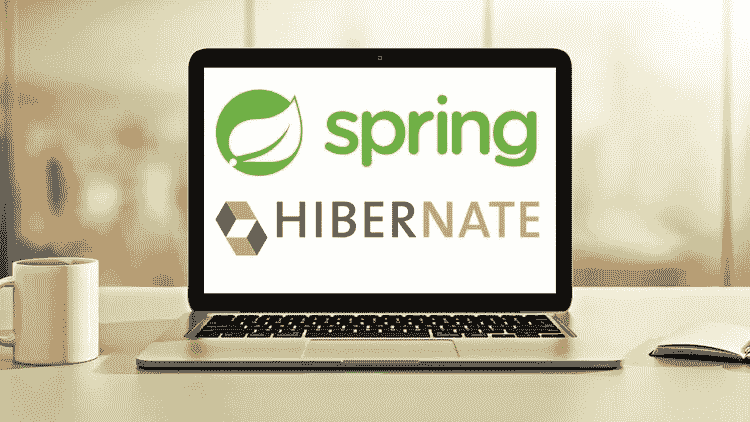
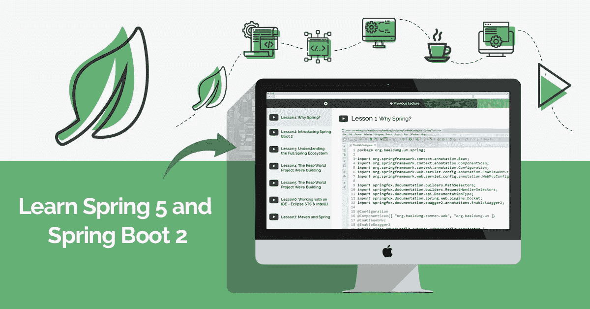
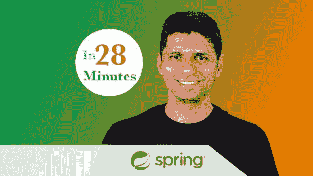
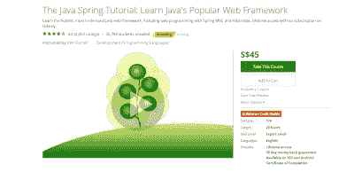

# 2023 年 Java 程序员学习 Spring 和 Hibernate 的 8 门最佳课程

> 原文：<https://medium.com/javarevisited/8-best-spring-and-hibernate-training-courses-for-java-developers-acf09aa0e244?source=collection_archive---------0----------------------->

## 这些是 Java 程序员学习 Spring、Spring Boot 和 Hibernate 的最佳在线培训课程。

image_credit — Udemy

Spring 和 Hibernate 是 Java 世界中最热门和最受欢迎的两个 web 框架，也是任何 Java 程序员在 web 开发领域获得工作的两个最基本的技能。

Spring 框架是在 2004 年左右出现的，并且已经成为核心 Java 和 web 开发领域开发 Java 应用程序的领先框架。

Spring 框架附带了许多模块来支持不同类型的开发，如 Spring Security，以满足大多数 web 和企业 Java 应用程序的安全需求。

它支持单点登录、 [LDAP 认证、](http://javarevisited.blogspot.com/2011/11/ldap-authentication-active-directory.html)、[基于角色的访问控制](http://javarevisited.blogspot.com/2013/07/role-based-access-control-using-spring-security-ldap-authorities-mapping-mvc.html)以及更多这样的基本特性。Spring 还支持 REST 服务的开发，REST 服务并没有成为提供 web 服务的标准方式。

Hibernate 是另一个开源框架，非常受 Java 开发者的欢迎。它提供了 ORM 功能，比如让你不用写任何 JDBC 代码就可以管理数据库事务。它允许您保存、加载和修改企业和 web 应用程序中的对象，让您的生活变得轻松。

我经常收到我的读者关于[好的 Spring 和 Hibernate 课程](https://javarevisited.blogspot.com/2016/12/top-5-spring-and-hibernate-training-courses-java-jee-programmers.html)的询问，大多来自有 3 到 4 年经验的中级开发人员，他们希望学习和掌握 Spring 和 Hibernate 框架，以获得职业发展和更好的工作机会。

早些时候，我分享了一些学习 Spring 框架的[书籍](http://javarevisited.blogspot.com/2013/03/5-good-books-to-learn-spring-framework-mvc-java-programmer.html)和 [hibernate 书籍](https://javarevisited.blogspot.com/2018/08/top-5-hibernate-books-for-java.html#axzz6cRYpiwdu)，在本文中，我将为中级和有经验的 Java 开发人员分享一些最好的 Spring 和 hibernate 课程。您可以参加这些课程来提高您在 Spring 和 Hibernate 框架方面的专业知识。

# 面向 Java 开发人员的 8 大 Spring 和 Hibernate 课程和培训

在这篇文章中，我加入了学习 Spring 框架、Spring 安全性、使用 Spring 进行 REST 开发、使用 Spring 进行测试以及掌握 Hibernate 性能的课程。这些课程不是针对除 Spring 以外的初学者，而是针对已经了解 Spring 和 Hibernate 的 Java 开发者。

## [1。Spring 框架 5:初学者到大师](https://click.linksynergy.com/fs-bin/click?id=JVFxdTr9V80&subid=0&offerid=323058.1&type=10&tmpid=14538&RD_PARM1=https%3A%2F%2Fwww.udemy.com%2Fspring-framework-5-beginner-to-guru%2F)

这是市面上最新的学习 Spring 框架的课程。你可能知道，Spring 框架去年发布了几个版本，如 Spring 5 和 Spring Boot 2，它们为编写现代 web 应用程序(如反应式编程)带来了许多有用的功能。

大多数 Java web 应用程序都是使用 Servlet API 编写的，它最初是用同步和阻塞语义创建的，但多年来，在 Servlet 3.0 和 Servlet 3.1 上增加了对非阻塞和异步处理的支持。

Spring Framework 通过引入一个名为 [WebFlux](/javarevisited/7-best-webflux-and-reactive-spring-boot-courses-for-java-programmers-33b7c6fa8995) 的新框架，轻松地用 Java 创建一个反应式 web 应用程序，它既是异步的，也是事件驱动的。这种应用程序的主要优点是它可以在 JVM 中纵向扩展，因为它需要更少的线程，而不是增加更多的服务器和横向扩展。本课程不仅会教你使用 Spring 5 特性进行反应式编程，还会教你更多关于 Spring 框架的知识。总之是 Java 开发者学习 Spring 框架的最新课程。

这里是加入这个最好的 Spring 课程的链接— [Spring Framework 5:初学者到大师](https://click.linksynergy.com/fs-bin/click?id=JVFxdTr9V80&subid=0&offerid=323058.1&type=10&tmpid=14538&RD_PARM1=https%3A%2F%2Fwww.udemy.com%2Fspring-framework-5-beginner-to-guru%2F)

## 2.[春季&适合初学者的冬眠(包括 Spring Boot)](https://click.linksynergy.com/link?id=JVFxdTr9V80&offerid=323058.647428&type=2&murl=https%3A%2F%2Fwww.udemy.com%2Fspring-hibernate-tutorial%2F)

这是 Udemy 的另一个很棒的课程，从零开始学习春天和冬眠，包括 Spring Boot。本课程由 Chad Darby 创建，将教你 Spring 5、Core Spring、AOP、Spring MVC、Spring Security、Spring REST、 [Spring Boot 2](/javarevisited/top-10-courses-to-learn-spring-boot-in-2020-best-of-lot-6ffce88a1b6e) 、百里香叶、JPA & Hibernate。

Chad Darby 在组织这门课程方面做得非常出色，他让 Spring Framework、MVC、AOP、 [Hibernate](/javarevisited/top-5-books-to-learn-hibernate-for-java-developers-b2cb4b16ccd6?source=---------14------------------) 、Security 变得易于学习和使用。这个在线课程的好处是，它充满了实时项目，意味着你将在实践中学习。

以下是您将在本课程中构建的项目列表:

*   Spring MVC 和 Hibernate CRUD 实时项目
*   Spring Security(在数据库中使用密码加密)
*   Spring REST(带全数据库 CRUD 实时项目)
*   Spring Boot REST(带全数据库 CRUD 实时项目)
*   带有 JPA 和 Spring Data JPA 的 Spring Boot(带有完整数据库 CRUD 实时项目)
*   带有 Spring Data REST 的 Spring Boot(带有完整的数据库 CRUD 实时项目)
*   含百里香叶的 Spring Boot(含实时完整数据库 CRUD)

你可以看到它触及了 Spring 框架的每个部分，这使得它成为一起学习 Spring 和 Hibernate 的理想课程。

这里是加入这个最好的课程的链接——[春天&为初学者准备的冬眠](https://click.linksynergy.com/link?id=JVFxdTr9V80&offerid=323058.647428&type=2&murl=https%3A%2F%2Fwww.udemy.com%2Fspring-hibernate-tutorial%2F)

image_credit — Udemy

## 3.[学春 5 和 Spring Boot 2 +用春休息](https://courses.baeldung.com/p/ls-rws-certification-class?utm_source=javarevisited&utm_medium=web&utm_campaign=lss&affcode=22136_bkwjs9xa)

在过去的几年里，REST 已经成为主流，Spring 引领了 RESTful web 服务在 Java 中的发展。Eugen 在用 Spring 构建 RESTful APIs 方面拥有丰富的知识和经验。

这些 Spring 在线培训课程从使用 Spring 构建实用 API 的基础开始，并引导您学习一个成熟的、架构良好的 REST 项目的最先进的学科。这是他的两个最畅销课程的组合，以引导的方式学习 Spring 5 和 Spring Boot。在课程中，你不仅将学习如何使用 Spring 框架创建 REST web 服务，更重要的是如何设计一个好的 REST API，这更具挑战性。

一个好的 REST API 设计与其说是科学，不如说是艺术，本课程将帮助你掌握这门艺术。它将教你如何设计一个好的 API，如何使用 JavaScript 使用它们，如何使用 OAuth2 使它们安全，以及如何正确地测试它们。

**这里是加入这个春季课程**——[学春 5 和 Spring Boot](https://courses.baeldung.com/p/ls-rws-certification-class?utm_source=javarevisited&utm_medium=web&utm_campaign=lss&affcode=22136_bkwjs9xa) 的链接

## 4.[弹簧框架大师班](https://click.linksynergy.com/fs-bin/click?id=JVFxdTr9V80&subid=0&offerid=323058.1&type=10&tmpid=14538&RD_PARM1=https%3A%2F%2Fwww.udemy.com%2Fspring-tutorial-for-beginners%2F) — Udemy

这是另一门综合性的春季课程。它首先介绍广泛使用的 Java Spring 框架，然后解释如何使用 Spring 和依赖注入将 Java 对象连接在一起。

您还将学习如何为 Spring 开发设置系统，如何使用 Maven，如何使用 [Spring](/javarevisited/10-best-online-courses-to-learn-spring-framework-in-2020-f7f73599c2fd) 和 [Hibernate](https://www.java67.com/2016/02/top-20-hibernate-interview-questions.html) 处理数据库，以及如何使用 Spring MVC 创建 web 应用程序。

由 28 分钟官方创建，本课程还将教你使用 Spring Security，JDBC 管理用户账户，使用 web 表单，构建模块化网页的 Apache tiles，面向方面编程(AOP)，以及使用 Log4J 和 JUnit。它有大约 12 个小时的课程，价格约为 210 美元，但你可以在著名且值得信赖的在线培训和课程提供商之一 Udemy 的 flash sale 上只花 9.99 美元买到。

**这里是加入本课程** — [Spring 框架大师班](https://click.linksynergy.com/fs-bin/click?id=JVFxdTr9V80&subid=0&offerid=323058.1&type=10&tmpid=14538&RD_PARM1=https%3A%2F%2Fwww.udemy.com%2Fspring-tutorial-for-beginners%2F)的链接

## [5。由欧根](http://www.baeldung.com/learn-spring-security-course?utm_source=javarevisited&utm_medium=web&utm_campaign=lss&affcode=22136_bkwjs9xa)学习春季安全

如果您想知道为什么要学习 Spring security，那么让我告诉您，对于任何 Java web 或企业应用程序来说，安全性都是至关重要的。此外，Web 安全市场相当巨大，一旦你理解了安全的基础知识以及 Spring Security 如何帮助你实现它们，你将会受到很高的需求。

学习安全方面的挑战在于安全形势每年都在变化。现在，随着 REST APIs 变得越来越流行，以及单页面应用 [OAuth2](/javarevisited/top-10-courses-to-learn-spring-security-and-oauth2-with-spring-boot-for-java-developers-8f0222d6066d?source=---------5-----------------------) 的引入，双因素认证变得更加具有挑战性。在过去的几年里，Spring 的安全性随着每个版本的发布而变得越来越好，新的 Java 配置风格成为 XML 的可靠替代。现在，没有争论。如果你正在用 Java 工作，Spring Security 是一个恰当而智能地做安全工作的工具。欧根的春季安全课程无疑是快速学习春季安全的最佳途径之一。这对初学者和有经验的 Java 程序员都很有用。

这是加入本课程的链接。[由欧根学习春安](http://www.baeldung.com/learn-spring-security-course?utm_source=javarevisited&utm_medium=web&utm_campaign=lss&affcode=22136_bkwjs9xa)

加入欧根的春季课程有很多选择。比如说。春季大师班<http://courses.baeldung.com/?affcode=22136_bkwjs9xa>**将花费你大约 318 美元，但是它完全值得你所花的钱。或者，你也可以参加认证课程，费用约为 398 美元。**

**如果你喜欢现场会议而不是录制的视频会议来进行主动学习，那么你可以加入 Eugen 的现场课程，其中包括完整的大师课程材料，3 个高级研讨会和 12 次小组辅导电话。**

**由于 COVID，欧根还为他所有的课程提供 20%的折扣**

**<https://courses.baeldung.com/?affcode=22136_bkwjs9xa> ** 

## **[6。Vlad Mihalcea 的高性能 Java 持久性](https://vladmihalcea.teachable.com/p/high-performance-java-persistence-mach-1?utm_source=javarevisited&utm_medium=web&utm_campaign=hpjpmach1&affcode=172599_kuoszt8s)**

**Vlad Mihalcea 是一位知名的冬眠专家，他最大的优点是能够用最简单易懂的方式解释任何与冬眠相关的事情。因为我在他的邮件列表上，并且关注他的博客，所以我知道他的 Hibernate 技巧有多有用。

[Hibernate](/javarevisited/top-5-hibernate-online-training-courses-for-beginners-and-advance-java-programmers-469460596b2b) 和 [JPA](https://javarevisited.blogspot.com/2018/01/top-5-hibernate-and-jpa-courses-for-java-programmers-learn-online.html) 非常容易使用，你可以在 1 或 2 个小时内学会基础知识，但是真正的问题从你构建企业应用程序开始。用户数量增加，您面临着挑战性的性能要求。在他的课程中，Vlad 解释了你需要了解的关于 Hibernate 性能调优的一切，以及如何从设计阶段就处理负载和解决挑战，而不是在挑战到来时才积极应对，因为你没有时间做任何计划。

他实际上不时地进行他的培训，即使他的 Hibernate 性能调优在线培训目前已经关闭，您也可以在他的电子邮件列表中注册，无论何时打开，您都会收到通知。**

****这里是加入这个 Hibernate 课程的链接—** [高性能 Java 持久性](https://vladmihalcea.teachable.com/p/high-performance-java-persistence-mach-1?utm_source=javarevisited&utm_medium=web&utm_campaign=hpjpmach1&affcode=172599_kuoszt8s)**

****

**我的一些读者也提出，Pluralsight 上的[**Java Persistence API 2.2**](https://pluralsight.pxf.io/c/1193463/424552/7490?u=https%3A%2F%2Fwww.pluralsight.com%2Fcourses%2Fjava-persistence-api-21)也是在线学习 JPA 和 Hibernate 的一个很好的资源。你也可以通过注册一个 [10 天的免费试用](https://pluralsight.pxf.io/c/1193463/424552/7490?u=https%3A%2F%2Fwww.pluralsight.com%2Flearn)来获得它。如果您喜欢按照自己的进度学习，这是深入理解 Hibernate 和 Hibernate 性能调优的理想软件包。**

**<https://pluralsight.pxf.io/c/1193463/424552/7490?u=https%3A%2F%2Fwww.pluralsight.com%2Flearn> ** 

## **7。Java Spring 教程:学习 Java 流行的 Web 框架**

**这是 Udemy 最受欢迎的春季课程之一，由 John Purcell 教授。约翰是一位经验丰富的优秀培训师，他很好地涵盖了这个主题，并提供了可行和不可行的建议。John 解释了 Java 开发人员应该知道的关于 Spring 的所有重要事情，包括配置 Spring 的旧 XML 方式，这对于增强和维护旧的 Spring 项目仍然非常重要。**

**他还教您一种新的 Java 配置，您应该在新的 Spring Java 项目中使用这种配置。

课程费用约为 45 美元，你将获得终身课程使用权和结业证书，所以你的钱完全值得。**

****这里是加入这个春季课程的链接**-[Java Spring 教程](https://click.linksynergy.com/link?id=JVFxdTr9V80&offerid=323058.65830&type=2&murl=https%3A%2F%2Fwww.udemy.com%2Fjavaspring%2F)**

****

## **[8。学习 Spring Boot —快速 Spring 应用程序开发](https://click.linksynergy.com/fs-bin/click?id=JVFxdTr9V80&subid=0&offerid=323058.1&type=10&tmpid=14538&RD_PARM1=https%3A%2F%2Fwww.udemy.com%2Fspring-boot-intro%2F)**

**这是另一个[优秀的课程](https://click.linksynergy.com/fs-bin/click?id=JVFxdTr9V80&subid=0&offerid=323058.1&type=10&tmpid=14538&RD_PARM1=https%3A%2F%2Fwww.udemy.com%2Fspring-boot-intro%2F)为初学者学习 Spring Boot，即没有 Spring Boot 经验的人。**

**它不仅会教你 Spring Boot 的基础知识，还会教你 Spring 框架的基础知识，比如[依赖注入](https://javarevisited.blogspot.sg/2015/06/difference-between-dependency-injection.html)、[控制反转](https://javarevisited.blogspot.com/2012/12/inversion-of-control-dependency-injection-design-pattern-spring-example-tutorial.html#axzz5N1cdCqrn)、应用上下文等等。**

**在本课程中，讲师 Dan Vega，Udemy 上一位受欢迎的 Spring 框架讲师，将教你如何使用 Spring Boot 开发一个 web 应用程序。您将创建一个端到端的 Spring MVC 应用程序。**

**您将使用 Spring Boot 构建 REST 服务，使用 Spring 数据连接到数据库，并使用 Spring Security 保护您的应用程序。您还将学习如何创建应用程序的可执行 JAR。**

**以下是加入课程的链接: [**学习 Spring Boot —快速申请**](https://click.linksynergy.com/fs-bin/click?id=JVFxdTr9V80&subid=0&offerid=323058.1&type=10&tmpid=14538&RD_PARM1=https%3A%2F%2Fwww.udemy.com%2Fspring-boot-intro%2F)**

****

**以上是针对初学者和有经验的 Java/JEE 开发者的**最佳 Spring 和 Hibernate 在线课程**。这些是针对高级 Java 开发人员的一些最好的 Spring 和 Hibernate 课程，如果您对掌握 Spring 和 Hibernate 感兴趣，应该好好利用它们。**

**对于目前正在从事 Spring 和 Hibernate 项目的 Java 开发人员来说，它是理想的，但是对于中级 Java 开发人员来说，通过添加这些 Java 世界中最热门的框架来变得更有市场并提高他们的 CV 也是很好的。

其他**你可能喜欢的 Java 和 Spring 文章****

*   **Java 开发人员的 15 个 Spring Boot 面试问题([问题](http://www.java67.com/2018/06/top-15-spring-boot-interview-questions-answers-java-jee-programmers.html))**
*   **学习和掌握 Spring Cloud 的五大课程([课程](http://javarevisited.blogspot.sg/2018/04/top-5-spring-cloud-courses-for-java.html))**
*   **Java 开发人员应该知道的 5 大 Spring Boot 注释([阅读](http://www.java67.com/2019/01/top-5-spring-boot-annotations-java-programmers-should-know.html))**
*   **@ spring boot application vs @ enable auto configuration？([回答](http://www.java67.com/2018/05/difference-between-springbootapplication-vs-EnableAutoConfiguration-annotations-Spring-Boot.html))**
*   **初学者学习 Spring 框架的 5 门免费课程([免费课程](http://www.java67.com/2017/11/top-5-free-core-spring-mvc-courses-learn-online.html))**
*   **深入学习春季安全的 5 门课程([门课程](http://www.java67.com/2017/12/top-5-spring-security-online-training-courses.html))**
*   **有经验的 Java 开发人员应该阅读的 5 本春季书籍([书籍](http://javarevisited.blogspot.sg/2018/04/5-spring-framework-books-experienced-Java-developers-2018.html))**
*   **Java 开发人员应该知道的五大框架([框架](https://javarevisited.blogspot.sg/2018/04/top-5-java-frameworks-to-learn-in-2018_27.html))**
*   **Java 开发者应该学会的 10 个 Spring MVC 注解([注解](https://www.java67.com/2019/04/top-10-spring-mvc-and-rest-annotations-examples-java.html))**
*   **学习 Spring Security 和 OAuth2 的 10 门课程([课程](/javarevisited/top-10-courses-to-learn-spring-security-and-oauth2-with-spring-boot-for-java-developers-8f0222d6066d)**
*   **Java 程序员应该学习的 5 大春云注解([云](https://www.java67.com/2018/12/top-5-spring-cloud-annotations-for-java.html))**
*   **5 门课程深入学习春云([课程](https://dzone.com/articles/5-courses-to-learn-spring-cloud-in-2019))**
*   **面向 Java 开发人员的 10 门高级 Spring Boot 课程([课程](/javarevisited/10-advanced-spring-boot-courses-for-experienced-java-developers-5e57606816bd))**
*   **学习 Java 微服务的 7 大课程([课程](/javarevisited/top-5-courses-to-learn-microservices-in-java-and-spring-framework-e9fed1ba804d))**

**感谢您阅读本文。如果你觉得这些最好的 Spring 和 Hibernate 在线培训课程有用，那么请与你的朋友和同事分享。如果您有任何问题或反馈，请留言。如果你有一门课程应该在这个列表上，请随意建议。

**PS**。—我的一些读者建议，Dan Vega 的 [**介绍 Spring Boot**](https://click.linksynergy.com/fs-bin/click?id=JVFxdTr9V80&subid=0&offerid=323058.1&type=10&tmpid=14538&RD_PARM1=https%3A%2F%2Fwww.udemy.com%2Fspring-boot-getting-started%2F) 和 Bryan Hansen 在 Pluralsight 上的 [**介绍 Spring MVC**](https://pluralsight.pxf.io/c/1193463/424552/7490?u=https%3A%2F%2Fwww.pluralsight.com%2Fcourses%2Fspring-mvc4-introduction) 也是学习 Spring 和 Spring MVC 4 的非常好的课程。它们是免费的@ Udemy 和 Pluralsight(免费试用)，你也可以看看。**

**<https://click.linksynergy.com/fs-bin/click?id=JVFxdTr9V80&subid=0&offerid=323058.1&type=10&tmpid=14538&RD_PARM1=https%3A%2F%2Fwww.udemy.com%2Fspring-boot-getting-started%2F> **