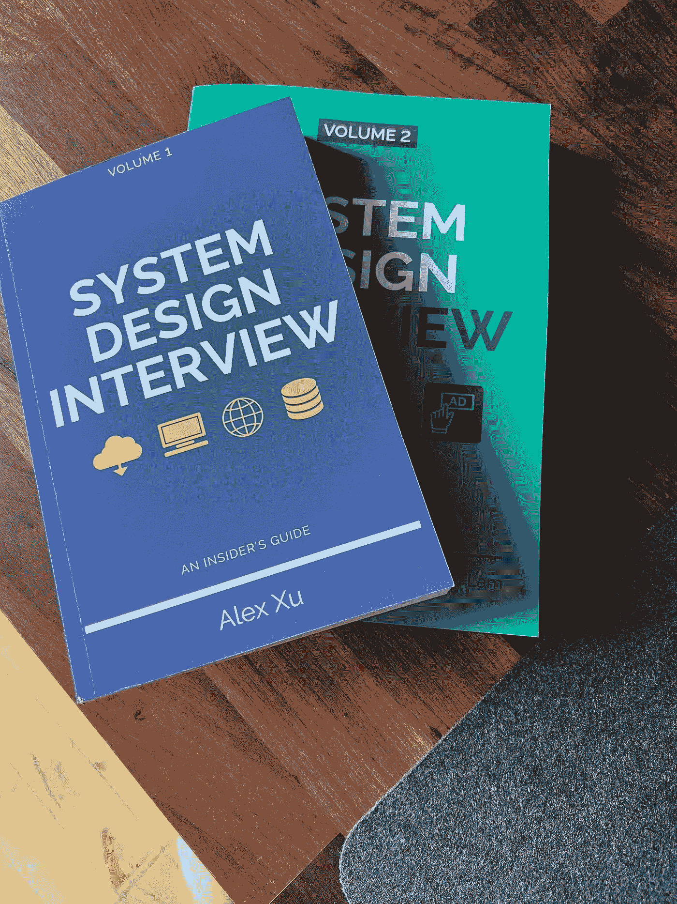
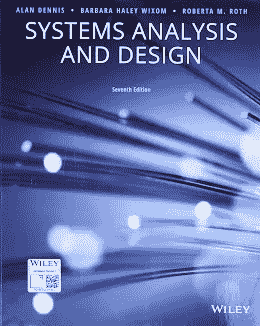
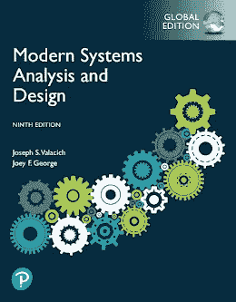
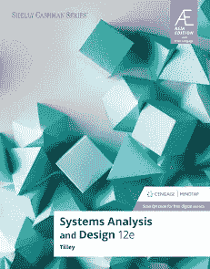
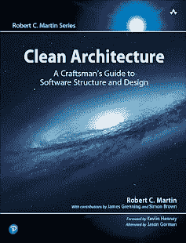
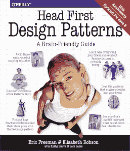

# 程序员的 8 本最佳系统设计和软件设计书籍

> 原文：<https://medium.com/javarevisited/8-best-system-design-and-software-design-books-for-programmers-be54cb313106?source=collection_archive---------0----------------------->

## 这里有一个学习面试系统设计和软件设计以及编程和软件开发的最佳书籍列表

大家好，系统设计和软件设计是编码面试的两个重要话题，也是软件开发人员的两个重要技能。不知道如何设计系统，你就不能创造新的软件，也很难学习和理解现有的软件和系统。

这也是为什么 FAANG 这样的大技术公司会特别注重[系统设计技巧](https://javarevisited.blogspot.com/2022/03/how-to-prepare-for-system-design.html)并且对应聘者进行彻底的测试。如果你想学习系统设计并寻找最好的资源，比如最好的系统设计书籍和课程，那么你来对地方了。

之前，我已经分享了[最佳**系统设计在线课程**](https://www.java67.com/2019/09/top-5-courses-to-learn-system-design.html)**以及[软件架构课程](https://javarevisited.blogspot.com/2019/03/5-courses-programmers-can-join-to-learn.html)，以及[常见系统设计问题](https://www.java67.com/2018/05/top-20-system-design-interview-questions-answers-programming.html)，在这篇文章中，我将与您分享学习软件设计的最佳系统设计书籍。**

**无论你是初学者还是有经验的开发者，你都可以阅读这些书，因为你一定会找到有价值的东西。我读了它们，尽管我已经做了超过 15 年的软件开发，我还是学到了很多。**

**但是，在我们开始阅读 7 本最好的书*之前，让我告诉你它到底是什么。***

****系统设计**基本上是用来指定义一个系统要素的过程。这些元素可以是架构、模块、组件、接口或数据。这对于基于某些特定需求的系统尤其有用。**

**你需要从本质上理解的是，系统设计包括定义、开发和设计满足组织的特定需求和要求的系统的过程。**

**当设计一个运行良好且连贯的系统时，你首先需要的是一个系统化的方法。为此，您可以使用自顶向下或自底向上的方法。一个好的系统设计师能够使用建模语言来表达信息和知识。这必须构建成一个由一套一致的规则定义的系统。您可以使用图形或文本建模语言。**

# **2023 年 8 本最佳系统设计和软件设计书籍**

**有很多好的图形建模语言。统一建模语言或 UML 用于描述软件的结构和行为以及图形符号。业务流程建模符号作为流程建模语言非常有用。**

**作为一个系统设计者，也有很多设计方法可以利用。架构设计非常适合描述系统的视图、模型、行为和结构。**

****逻辑设计**对于表示系统的数据流、输入和输出以及实体关系图非常有用。**

****物理设计**关注数据是如何在系统中建模和存储的。它对于了解用户如何向系统添加信息以及系统如何向用户反馈详细信息也很有用。**

**在这里，我们整理了 7 本关于系统设计的最佳书籍。继续阅读，了解更多。**

## **1.Martin Kleppmann 设计对数据不敏感的应用**

**在这本关于系统设计的精彩书籍中，Martin Kleppmann 将帮助您理解用于存储和处理数据的所有不同技术的优缺点。这本书以清晰的风格写成，对数据存储系统进行了广泛的概述。**

**您将很好地掌握基本概念、算法以及各种技术的实际应用。这也是学习软件设计和系统设计时最受欢迎的书之一，我向所有类型的软件开发人员强烈推荐这本书。**

**这本书对于初学者和有经验的人，开发者和软件架构师以及任何想在 2023 年更好地进行软件设计的人来说也是很好的。如果你愿意，也可以把这本书和 Udemy 上 Frank Kane(前亚马逊招聘经理)的 [**掌握系统设计面试**](https://click.linksynergy.com/deeplink?id=JVFxdTr9V80&mid=39197&murl=https%3A%2F%2Fwww.udemy.com%2Fcourse%2Fsystem-design-interview-prep%2F) 结合起来，更好的准备。**

****

## **2.[Alex Xu 的系统设计访谈第 1 和第 2 部分](https://www.amazon.com/System-Design-Interview-insiders-Second/dp/B08CMF2CQF/?tag=javamysqlanta-20)**

**顾名思义，对于每个准备系统面试的人来说，这是一本完美的书。相信我，这本书是目前网上最好的。这本书是由 Alex Xu 创作的，他也经历了同样的过程。**

**你将接触到大量的绘图和图表，这将有助于你理解真实的系统。你将能够理解招聘人员在你的问题答案中寻找什么。**

**Alex 还在 ByteByteGo 上有一个同伴 [**系统设计课程，在那里你不仅可以找到本书的所有内容和 Alex Wu 的系统设计访谈书的第二部分，还可以找到新的内容，深入探讨流行的系统问题，如如何设计 YouTube 和 WhatsApp，以及解决软件设计问题的成熟系统设计框架。**](https://bytebytego.com?fpr=javarevisited)**

**简而言之，如果你读了这本书，你将为你的下一次系统设计面试打下良好的基础。这也是 Reddit、Quora、HackerNews、Twitter 和其他在线平台上最值得推荐的系统设计书籍之一，从这本书在亚马逊上的评论数量可以明显看出这一点。**

****

## **3.[Dennis、Wixom 和 Wroth 的系统分析和设计](https://www.amazon.com/Systems-Analysis-Design-Alan-Dennis/dp/1118897846?tag=javamysqlanta-20)**

**这是一本很棒的书，会让你对系统分析和设计有很好的理解，就像书名暗示的那样。你将获得广泛的描述，以及反映现实生活情况的实际项目。**

**这本书的第六版也是由许多案例研究和许多例子以及对所有案例研究和例子的深入解释组成的。**

**作为一名设计专业的学生，这本书一定会帮助你实现你的目标。你将牢固掌握与系统分析和设计相关的所有原则。如果你愿意，你也可以将这本书与关于教育的 [**探索系统设计面试**](https://www.educative.io/collection/5668639101419520/5649050225344512?affiliate_id=5073518643380224) 课程结合，这是系统设计的最佳互动课程之一。**

****

## **4.[约瑟夫·瓦拉契和乔伊·乔治的《现代系统分析与设计》](https://www.amazon.com/Modern-Systems-Analysis-Design-9th/dp/0135172756?tag=javamysqlanta-20)**

**这是另一本很棒的书，它将教你所有与系统分析和设计相关的技能、思想和技术。相信我，当我说这是最完美和最全面的系统设计书给你。**

**这本系统设计和分析的书是由 Joshep Valacich 和 Joey George 编写的，其中有一部分是关于敏捷方法的，这将确保这是一个适合系统设计者的完美的学生学习系统。**

**写作风格非常简单，但内容丰富，这意味着每个人都可以理解，包括那些母语不是英语的人。**

**这些书有多个版本，以确保你选择最新版本，第九版，如果你需要一门 Udemy 课程来搭配这本书，我推荐 Udemy 上的 [**实用系统设计**](https://click.linksynergy.com/deeplink?id=JVFxdTr9V80&mid=39197&murl=https%3A%2F%2Fwww.udemy.com%2Fcourse%2Fpragmatic-system-design%2F) 课程。我发现通过看书和看课程是学习系统设计的最好方法。**

****

## **5.[斯科特·蒂利的系统分析与设计](https://www.amazon.com/Systems-Analysis-Design-MindTap-Course-dp-0357117816/dp/0357117816?tag=javamysqlanta-20)**

**根据行业专家的说法，这是当今市场上最重要的系统设计教材之一。这是因为这本书会让你意识到这个行业发生了什么变化，以及为什么首先需要改变。**

**此外，这本书还有专门介绍[面向对象编码](https://javarevisited.blogspot.com/2018/08/5-object-oriented-programming-and-design-courses-for-Java-programmers.html)和[敏捷方法](https://www.java67.com/2020/10/best-agile-and-scrum-courses-for-programmers-developers.html)的章节，这是目前最常用的两种方法。您还将学习系统如何运行，以及云计算和移动应用程序。**

**Scott Tilley 的《系统分析和设计》第 12 版是这一系列的最新书籍，你应该阅读它来获得最新的知识。如果您正在准备系统设计面试，那么您也可以查看 Sandeep Kaul(技术主管@脸书)的 [**系统设计面试指南**](https://click.linksynergy.com/deeplink?id=JVFxdTr9V80&mid=39197&murl=https%3A%2F%2Fwww.udemy.com%2Fcourse%2Fsystem-design-a-comprehensive-guide%2F) 进行更好的准备。**

****

## **6.罗伯特·马丁的清洁建筑**

**系统设计、软件设计和软件架构密切相关。当你读这本书的时候，你会学到关于软件结构和设计的所有知识。您还将能够使您的代码更加流畅，并将敏捷方法集成到您的解决方案中。**

**这本书是由罗伯特·c·马丁创作的，他被亲切地称为鲍勃大叔，也是著名的[清洁代码](/javarevisited/clean-code-a-must-read-coding-book-for-programmers-9dc80494d27c)和[清洁编码书](https://javarevisited.blogspot.com/2017/10/clean-code-by-uncle-bob-book-review.html)的作者。这是该系列的第三篇，许多人阅读这三篇文章是为了成为更好的软件开发人员。**

**这本书关注于与系统分析和设计相关的不同原则，以及系统设计者在现实世界中开发解决方案时所面临的不同挑战。**

**此外，您将学习如何运行单元测试，并使用测试驱动策略来提高系统的效率。并且，如果你愿意，也可以把这本书和 Coursera 的 [**软件设计与架构专精**](https://coursera.pxf.io/c/3294490/1164545/14726?u=https%3A%2F%2Fwww.coursera.org%2Fspecializations%2Fsoftware-design-architecture) 结合起来学习更好。**

****

## **7.[Eric Freeman 和 Elisabeth Robson 的 Head First 设计模式](https://www.amazon.com/Head-First-Design-Patterns-Object-Oriented-dp-149207800X/dp/149207800X/?tag=javamysqlanta-20)**

**这是一本很棒的书，它解释了什么样的模式是重要的，以及如何将这些模式应用到你的设计中。它侧重于作为这些模式基础的面向对象原则。**

**使用这本书，你将能够极大地提高你的软件开发知识。您将了解到重要的设计原则，这些原则对于解决软件设计原则非常有用。**

**这本书的第二版现在已经出版了，你应该阅读它来学习 Java 8 及更高版本的设计模式。最重要的是如何使用 Lambdas 和 Stream 在 Java 中实现经典的设计模式。如果你需要一个在线课程来学习这本书，那么 Udemy 上 Dmitri Nestruk 的 [**Java 设计模式课程是最好的，因为它展示了经典设计模式在 Java 中的现代实现。**](https://www.amazon.com/Head-First-Design-Patterns-Object-Oriented-dp-149207800X/dp/149207800X/?tag=javamysqlanta-20)**

****

## **8.盖尔·麦克道尔的《破解编码访谈》**

**这是你的通用编码面试本。Gayle Laakmann McDowell 分享了他对编程面试的见解，以及像[谷歌](http://javarevisited.blogspot.com/2012/01/google-interview-questions-answers-top.html)、[亚马逊](http://javarevisited.blogspot.com/2016/01/top-20-amazon-and-google-programming-interview-questions.html)、[微软](http://javarevisited.blogspot.com/2015/12/30-microsoft-interview-questions-for-software-development-engineers.html)、脸书、推特或苹果这样的科技公司在招聘程序员时是如何看待候选人的。**

**这些书通过涵盖编程面试的所有关键主题，如数据结构、算法、SQL、Java、网络、数据库、操作系统和如何准备代码面试的一般指南，提供了必要的基础知识。**

**这本书也是常见编程问题的海量集合，这也是我推荐它的最重要原因。**

**此外，回答这些问题需要良好的计算机基础知识，如数据结构和算法，如果您需要复习，您可以参加 Udemy 上的课程，这是关于算法的最佳课程之一。**

****

**以上就是关于**编码面试最佳系统设计书籍**的全部内容。您可以阅读这些书籍来学习基本的系统设计概念以及如何构建系统。Alex Hu 的《系统设计》一书也涵盖了常见的软件设计问题，并向您展示了如何解决这些问题，这对面试非常有益。**

**如果你喜欢这 7 本最好的系统设计书籍，请随意与你的朋友和家人分享。如果您对系统设计有任何疑问，也可以发表评论，我们会尽快回复您。**

**您可能喜欢的其他**编程、书籍和文章****

*   **[5 面向对象设计与分析面试问题](https://www.java67.com/2016/07/top-5-object-oriented-design-interview-questions.html)**
*   **[如何准备系统设计面试](/javarevisited/how-to-crack-system-design-interviews-in-2022-tips-questions-and-resources-fcad05e2dab)**
*   **[初学者学习机器学习的 5 本最佳书籍](https://javarevisited.blogspot.com/2022/06/machine-learning-best-books-for.html)**
*   **[10 个基本微服务设计模式和原则](https://javarevisited.blogspot.com/2021/09/microservices-design-patterns-principles.html)**
*   **[2023 年如何破解 Java 面试](https://javarevisited.blogspot.com/2017/01/how-to-prepare-for-java-interviews.html)**
*   **[给有经验的开发者的 5 本最好的 DevOps 书](https://javarevisited.blogspot.com/2020/04/top-5-books-to-learn-devops-for-developers.html)**
*   **[新手最好的 5 本区块链书籍](https://javarevisited.blogspot.com/2022/06/top-5-books-to-learn-blockchain-for.html)**
*   **[初学者学习网络安全的 5 本最佳书籍](https://javarevisited.blogspot.com/2022/05/5-best-books-to-learn-cyber-security-in.html)**
*   **[学习 Python 编程的前 5 本书](https://javarevisited.blogspot.com/2019/07/top-5-books-to-learn-python-in-2019.html)**
*   **[学习 SOA 和微服务架构的 8 门最佳课程](/javarevisited/8-best-online-courses-to-learn-service-oriented-soa-and-microservices-architecture-94c01d6b94e6)**

**感谢您阅读本文。如果你喜欢这些技术面试的最佳系统设计书籍，那么请与你的朋友和同事分享。如果你有任何反馈或者你认为列表中缺少一本好的软件设计书，请在评论中提出建议。我也会包括他们。**

**如果你正在寻找 2023 年学习系统设计的最佳在线课程，那么我也建议你去看看 Udemy 上 Frank Kane 的[掌握系统设计面试](https://click.linksynergy.com/deeplink?id=JVFxdTr9V80&mid=39197&murl=https%3A%2F%2Fwww.udemy.com%2Fcourse%2Fsystem-design-interview-prep%2F)课程。弗兰克是一名前招聘经理，知道如何才能在 2023 年通过那些大型 FAANG 公司的系统设计面试。或者，您也可以加入 Alex Yu 的 [***系统设计面试—知情者指南***](https://www.amazon.com/System-Design-Interview-insiders-Second/dp/B08CMF2CQF/?tag=javamysqlanta-20) 和 ByteByteGo，进行完整的系统设计面试准备。**

** [## ByteByteGo | Ace 您的下一次系统设计面试

### 让您的系统设计技能更上一层楼所需的一切

bytebytego.com](https://bytebytego.com?fpr=javarevisited)**