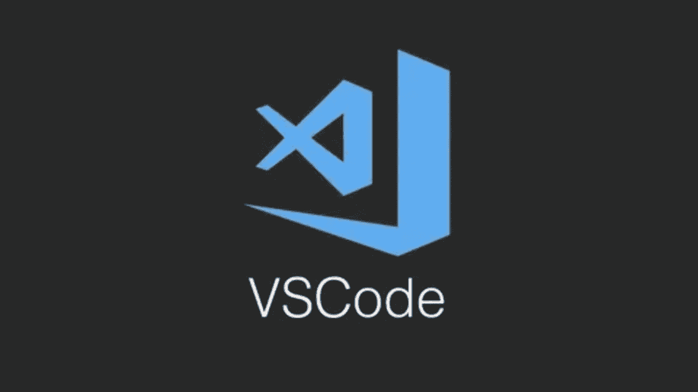
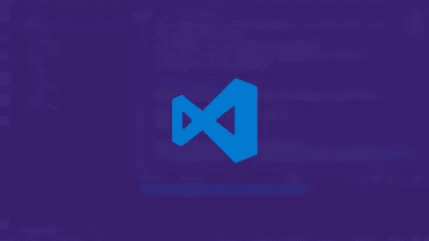
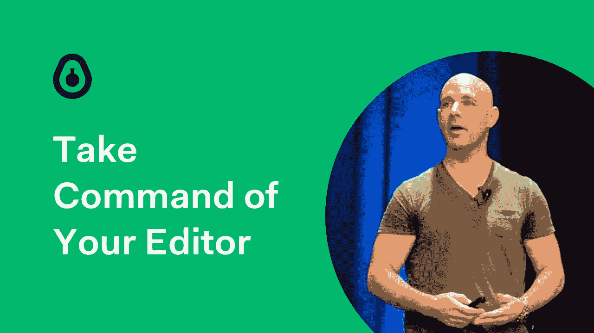
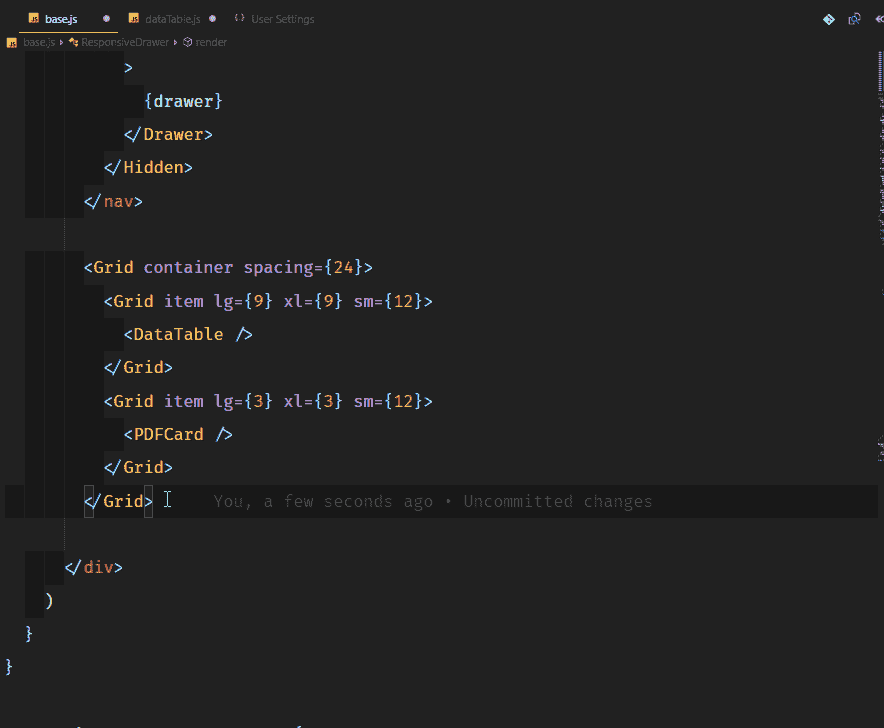
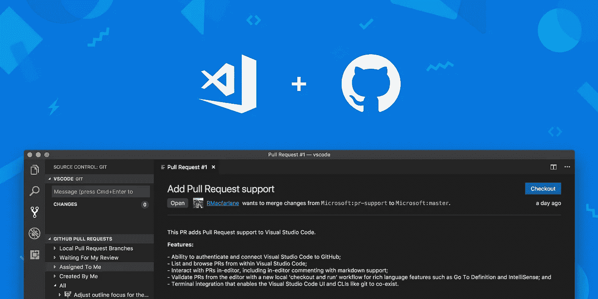

# 2023 年新手在线学习的 8 门最佳 VS 代码课程

> 原文：<https://medium.com/javarevisited/8-best-vs-code-courses-for-beginners-to-learn-online-bd5c169f59b7?source=collection_archive---------0----------------------->

## 以上是 2023 年学习 Visual Studio 代码最好的在线课程，适合初学者。有几个也是免费的。

image_credit — Udemy

大家好，如果你想学习 VS 代码并寻找最好的在线课程和教程，那么你来对地方了。在过去，我已经分享了 [**最佳 web 开发课程**](/javarevisited/top-10-online-courses-to-become-a-fullstack-web-developer-in-2020-d608a6b63232) 和 [**最佳网站为初学者学习 Git**](/javarevisited/11-best-online-places-to-learn-git-for-beginners-in-2021-6dc2b7c6ef48)，在本课程中，我将分享最佳在线课程给*学习 VS 代码，2023 年最受欢迎的免费代码编辑器之一*。

*披露—顺便说一句，其中一些链接是附属链接，如果你使用我的链接加入这些课程，我可能会得到报酬。*

如果你从事 web 开发或软件开发，那么你可能听说过 VS Code 或 Visual Studio Code，这是微软为现代开发人员提供的最好的现代 IDE 之一。

[Visual Studio Code](https://code.visualstudio.com/) 是一个快速、轻量级的跨平台代码编辑器，用于编写现代 web 和云应用程序。你不仅可以在 Windows 上使用 VS 代码，也可以在 Mac 上使用。

我的很多读者都在询问关于深入学习 VS 代码的课程建议，特别是为了提高他们的开发速度和生产力。

这些最好的在线课程不仅会教你 VS 代码基础，还会教你调试、重构、代码导航、智能感知以及如何提高整体速度的高级技术。

如果你不知道什么是 Visual Studio 代码，让我给你简单介绍一下。Visual Studio Code 是一个快速、轻量级的跨平台代码编辑器，用于编写现代 web 和云应用程序。它也是编写 [JavaScript](https://javarevisited.blogspot.com/2018/06/top-10-courses-to-learn-javascript-in.html) 、 [TypeScript](https://javarevisited.blogspot.com/2018/07/top-5-courses-to-learn-typescript.html) 和其他 web 技术的最流行的编辑器。

短短几年，Visual Studio 代码已经成为 [Web 开发](/better-programming/my-5-favorite-courses-to-learn-web-development-in-2019-a5e74167f8b2)最流行的编辑器。VS 代码最棒的地方在于它是免费的、开源的、跨平台的、功能齐全的，并且背后有一个令人惊叹的社区。

Web 开发领域的许多知名人士已经做出了改变，您也应该如此！如果你想学习 VS 代码的来龙去脉，同时提高你作为开发人员的效率和熟练程度，这个课程非常适合你。无论你是 Web 开发的新手还是经验丰富的老手，每个人都有适合自己的东西。

# 2023 年 8 门学习 VSCode 的最佳免费课程

不浪费你更多的时间，这里是我为程序员和开发人员列出的一些最好的 VS 代码课程。这些课程是由像约翰·帕帕这样的专家和托德·麦克劳德这样的优秀教师创建的，它们是从像 [Udemy](/javarevisited/15-best-udemy-courses-programmers-can-buy-on-black-friday-and-cyber-monday-2020-a803874f41d9) 、 [Pluralsight](/javarevisited/top-10-pluralsight-courses-to-learn-programming-and-software-development-during-covid-19-stay-at-30b7d8a4f88f) 和 [LinkedIn learning](/javarevisited/10-best-linkedin-learning-courses-for-java-programmers-fd5ae9ff1358) 这样的热门在线学习平台中挑选出来的。成千上万的学生已经加入了这些课程来学习和提高他们的 VS 代码技能，你也可以这样做。

## 1.[学习 Visual Studio 代码](https://click.linksynergy.com/deeplink?id=JVFxdTr9V80&mid=39197&murl=https%3A%2F%2Fwww.udemy.com%2Fcourse%2Flearn-visual-studio-code%2F)

这是 web 开发人员学习 Visual Studio 代码的最佳在线课程之一。您将简洁而生动地学习 VC 代码的所有相关特性。它组织得很好，表达得很好，所有的例子都很简单，很容易理解。

伟大的历程！尽可能简洁，同时仍然触及 VS 代码的所有相关特性。它组织得很好，呈现得很好，例子都很简单，容易理解，同时清楚地展示了所涵盖的特性。

如果你想对 VS 代码有一个很好的介绍，我强烈推荐这个课程。如果你是一个有经验的开发人员，那么你也可以很容易地切换到你的相关功能或跳过你已经知道的东西。它的结构非常好，可以让你很容易地浏览课程。

**这里是加入本课程**——[学习 Visual Studio 代码](https://click.linksynergy.com/deeplink?id=JVFxdTr9V80&mid=39197&murl=https%3A%2F%2Fwww.udemy.com%2Fcourse%2Flearn-visual-studio-code%2F)的链接

## 2. [Visual Studio 代码教程—VS 代码入门](https://click.linksynergy.com/deeplink?id=JVFxdTr9V80&mid=39197&murl=https%3A%2F%2Fwww.udemy.com%2Fcourse%2Fvisual-studio-code-tutorial%2F)

这是 Udemy 的又一门学习 2023 年 VS 代码的综合课程。讲师 Todd McLeod 在讲述 VS 代码的基础以及将它链接到 GitHub 方面做得非常好。

在 Udemy 上看了 Todd 的[T3e](https://click.linksynergy.com/deeplink?id=CuIbQrBnhiw&mid=39197&murl=https%3A%2F%2Fwww.udemy.com%2Fcourse%2Flearn-how-to-code%2F)的 Golang 课程后，我非常喜欢他的教学风格。如果你想在 2023 年学习 Golang，我强烈推荐他的课程。

无论如何，这个课程也是在同一个联盟中，它提供了它所承诺的，VS 代码的深入知识，这样你就可以工作得更快更有效率。

以下是您将在本课程中学到的内容:

*   基本编码技能
*   如何在 windows 上运行 bash 命令
*   如何安装 VS 代码
*   VS 代码快捷键和功能
*   如何从 VS 代码连接 git
*   如何在 VS 代码中进行多光标编辑
*   移动到副本并移动代码行
*   如何根据需要定制 VS 代码
*   如何使用 VS 代码进行调试
*   如何找到一个安装 VS 代码扩展，以提高生产力和更多

总的来说，即使对初学者和有经验的开发人员来说，这也是一门非常精确和详细的课程。托德是我认识的最好的老师之一，非常感谢他创造了这个神奇的课程。如果你想掌握 VS 代码或者想从头开始学习，这是你可以加入的最好的在线课程。

**以下是加入本课程的代码** — [Visual Studio 代码教程—VS 代码入门](https://click.linksynergy.com/deeplink?id=JVFxdTr9V80&mid=39197&murl=https%3A%2F%2Fwww.udemy.com%2Fcourse%2Fvisual-studio-code-tutorial%2F)

## 3.[掌握 Visual Studio 代码](https://click.linksynergy.com/deeplink?id=JVFxdTr9V80&mid=39197&murl=https%3A%2F%2Fwww.udemy.com%2Fcourse%2Fmastering-visual-studio-code%2F)【Udemy 课程】

这是从 Udemy 学习 VS 代码并提高生产力的又一个令人惊奇的课程。由 Alex Horea 创建，这个课程将教你如何使用强大的 VS 代码特性和扩展来将你的 web 开发技能提升到一个新的水平。在过去的几年里，VSCode 已经成为使用 JavaScript、TypeScript 或 [HTML](https://javarevisited.blogspot.com/2019/05/top-5-html-5-and-css-3-courses-for-web-developers.html#axzz6uiUE2EEk) 进行 Web 开发的标准编辑器。作为专业人士，我一直说你要多了解工具，多了解你的必备工具，VS 代码就是其中之一。这个生产力课程，并通过从这个令人敬畏的工具中获得所有你需要的帮助，大大提高你的编码时间！

以下是您将在本课程中学到的内容:

*   如何安装和配置 VSCode
*   重构，智能感知
*   高级调试技术
*   如何使用 Visual Studio 进行网页设计
*   使用 VSCode 的远程 SSH
*   如何在 Docker 容器中开发
*   如何找到并使用框架的 VSCode 扩展(React，Vue，Angular)

本课程还包含一个关于 Git 和 GitHub 的扩展部分，将向您展示在 IDE 中直接使用版本控制所需的所有知识。 [Python](https://javarevisited.blogspot.com/2020/06/top-5-courses-to-learn-python-full-stack-web-development.html) 和 [Fullstack Java 开发者](https://javarevisited.blogspot.com/2020/04/top-5-courses-to-become-full-stack-java-developer-with-Angular-and-Reactjs.html#axzz6uiUE2EEk)也可以加入这个课程，学习如何使用 VS 代码获得更好的开发体验。

**以下是加入本课程** — [掌握 Visual Studio 代码](https://click.linksynergy.com/deeplink?id=JVFxdTr9V80&mid=39197&murl=https%3A%2F%2Fwww.udemy.com%2Fcourse%2Fmastering-visual-studio-code%2F)的代码

## 4.约翰·帕帕的 Visual Studio 代码

如果你正在寻找在 Pluralsight 上学习 Visual Studio 代码的最佳课程，那么这里有一个 Pluralsight 课程，可以在 2023 年教你如何使用 VS 代码。

您将了解如何调试、重构、查找引用和用法、获得智能感知和自动完成、如何使用多光标，以及如何在各种语言和平台中工作，如 [JavaScript](/javarevisited/7-best-courses-and-books-to-learn-design-patterns-in-javascript-5b0b30fa5c3) 、 [Node.js](/javarevisited/top-10-online-courses-to-learn-node-js-in-depth-8ef0e31ca139) 、【ASP.Net】和 [TypeScript](/javarevisited/top-10-free-typescript-courses-to-learn-online-best-of-lot-44bce9da41d1)

由 John Papa 创建的这个课程不仅会教你 VS 代码的基础知识，还会教你像多光标编辑这样的高级技巧。

如果你不知道的话，John Papa 是微软的主要开发者拥护者，也是谷歌开发者专家、微软地区总监和 MVP 项目的校友。，也是 Pluralsight 上最好的老师之一。

**这里是加入本课程** — [约翰爸爸的 Visual Studio 代码](https://pluralsight.pxf.io/c/1193463/424552/7490?u=https%3A%2F%2Fwww.pluralsight.com%2Fcourses%2Fvisual-studio-code)的链接

顺便说一下，你需要一个 [Pluralsight 会员](/javarevisited/pluralsight-or-udemy-d9a94d2e8ee)才能加入这个课程，费用大约是每月 29 美元或每年 299 美元(14%的折扣)。我向所有程序员强烈推荐这个订阅，因为它提供了超过 7000 个在线课程的即时访问，以学习任何技术技能。或者，你也可以使用他们的 [**10 天免费通行证**](https://pluralsight.pxf.io/c/1193463/424552/7490?u=https%3A%2F%2Fwww.pluralsight.com%2Flearn) 免费加入这个课程。

<https://pluralsight.pxf.io/c/1193463/424552/7490?u=https%3A%2F%2Fwww.pluralsight.com%2Flearn>  

## 5. [Visual Studio 代码生产力提示](http://linkedin-learning.pxf.io/c/1193463/449670/8005?u=https%3A%2F%2Fwww.linkedin.com%2Flearning%2Fvisual-studio-code-productivity-tips)【LinkedIn 学习】

这是一个高级 VS 代码培训课程，从 LinkedIn Learning 中学习加快您的发展和生产力的技巧和诀窍。如果你已经知道了 VS 代码的基础知识，并且想让你的 VS 代码技能更上一层楼，这是一个完美的培训课程。

在本课程中，LinkedIn Learning 的讲师 Walt Ritscher 将向您传授使用 VS 代码中智能的上下文相关特性来提高您的工作效率的技巧和技术。您将学习如何更快地找到代码引用，生成样板文件 [HTML](/javarevisited/10-best-html-and-css-courses-for-beginners-in-2021-6757eec00032) ，并通过代码重构提高质量。

您还将了解如何为您最常用的命令创建自定义的键绑定，轻松地复制和移动代码块，比如用于动态生成 [SQL 命令](/javarevisited/top-5-sql-and-database-courses-to-learn-online-48424533ac61)的多光标编辑等。

您还将了解 Walt 最喜欢的 VS 代码扩展，比如 GitLens，它可以让您在不离开 VS 代码的情况下深入了解 Git 库。

这对我来说是一个真正的发现。如果你真的想提高你的 VS 代码技能，我向所有中级和有经验的开发人员强烈推荐这个课程。

**这里是加入本课程的链接** — [Visual Studio 代码生产力提示](http://linkedin-learning.pxf.io/c/1193463/449670/8005?u=https%3A%2F%2Fwww.linkedin.com%2Flearning%2Fvisual-studio-code-productivity-tips) [

顺便说一句，你需要 LinkedIn Learning 会员才能观看这门课程，每月费用约为 19.99 美元，但你也可以通过参加他们的 [**1 个月免费试用**](http://linkedin-learning.pxf.io/c/1193463/449670/8005?u=https%3A%2F%2Fwww.linkedin.com%2Flearning%2Fsubscription%2Fproducts) 来免费观看这门课程，这是探索他们 16000 多门最新技术在线课程的好方法。

  

## 7. [Visual Studio 代码改进提高您的编辑效率。](https://click.linksynergy.com/deeplink?id=CuIbQrBnhiw&mid=39197&murl=https%3A%2F%2Fwww.udemy.com%2Fcourse%2Fvisual-studio-code-hacks-to-boost-your-edition-productivity%2F)【免费】

这是一个免费的课程或教程，学习一些很酷的 VS 代码技巧来提高你的工作效率。本课程的目标是通过很好地理解 visual studio 代码的不同组件、快捷方式和操作策略之间的关系，向您介绍以更好的方式进行编辑所必需的**工具，从而提高您的编辑效率。**

这是你在这门课中学到的东西—

⚡️How 用 visual studio code 2019 快速编辑。

💡如何在 HTML、 [CSS](/javarevisited/10-best-css-online-courses-for-beginners-and-experienced-developers-54aa2e8c0253) 、js、json、CSV、txt 等文件中进行快速编辑？

🐬在 UI 组件、vs 代码实例、文件、文件内部等之间导航。

导航与编辑中的工作流🛠Examples。

💰编辑时不重复(值得你花时间)。

总的来说，这是一个非常棒的免费 VS 代码课程，适合想了解组件之间内部关系的开发人员。

**这里是加入本课程的链接**——[Visual Studio 代码技巧，提高你的编辑效率。](https://click.linksynergy.com/deeplink?id=CuIbQrBnhiw&mid=39197&murl=https%3A%2F%2Fwww.udemy.com%2Fcourse%2Fvisual-studio-code-hacks-to-boost-your-edition-productivity%2F)

## 8.[Github 和 Visual Studio 代码介绍](https://coursera.pxf.io/c/3294490/1164545/14726?u=https%3A%2F%2Fwww.coursera.org%2Fprojects%2Fgithub-visual-studio-code-desktop)【Coursera】

这是一个 Coursera 指导的项目，学习 Github 和 Visual Studio 代码，这是程序员和软件开发人员的两个基本工具。

在这个 2 小时长的基于项目的课程中，您将学习如何使用 Github 为软件开发提供托管，以及如何使用 Visual Studio 在您自己的机器上本地托管代码。

我知道看起来到项目结束时，很多人会对 Github 和 Visual Studio 代码有更好的理解。

如果你不知道[*Coursera Guided project*](https://coursera.pxf.io/c/3294490/1164545/14726?u=https%3A%2F%2Fwww.coursera.org%2Fprojects%2Fgithub-visual-studio-code-desktop)提供了最好的学习体验之一，你可以在分屏视频中与你的导师一起工作，跟随他/她的导师。您也不需要下载任何软件或设置一台机器，因为您只需在浏览器中的云工作空间中工作。

**这里是加入这个项目的链接**——[GitHub 和 Visual Studio 代码介绍](https://coursera.pxf.io/c/3294490/1164545/14726?u=https%3A%2F%2Fwww.coursera.org%2Fprojects%2Fgithub-visual-studio-code-desktop)

当谈到加入 Coursera 课程时，你有两个选择，你可以单独加入这个课程，每月花费大约 39 美元进行专业化，你也可以加入 [**Coursera Plus**](https://coursera.pxf.io/c/3294490/1164545/14726?u=https%3A%2F%2Fwww.coursera.org%2Fcourseraplus) 每年 399 美元，这是 Coursera 的一个订阅计划，让你无限制地访问他们最受欢迎的课程、专业化、专业证书和指导项目。

<https://coursera.pxf.io/c/3294490/1164545/14726?u=https%3A%2F%2Fwww.coursera.org%2Fcourseraplus>  

以上是关于学习 Visual Studio 代码或 VS 代码的一些**最佳课程，VS 代码是 web 开发人员最流行的 IDE 和文本编辑器。许多公司已经采用 VS 代码进行开发，这就是为什么学习 VS 代码是有意义的，这样你就可以和团队一起工作。**

正如我所说的，知道如何马上很好地使用它，可以在开发过程中为您节省大量的时间和精力。

您可能喜欢的其他**编程和资源文章**

*   [完整的 Java 开发者路线图](https://javarevisited.blogspot.com/2019/10/the-java-developer-roadmap.html)
*   [学习 Spring 框架的 10 门高级课程](https://javarevisited.blogspot.com/2020/06/10-advanced-spring-framework-courses.html)
*   [40+ OOP 面试问题及答案](https://javarevisited.blogspot.com/2020/05/object-oriented-programming-questions-answers.html)
*   [50+ SQL 和数据库电话面试问题](https://javarevisited.blogspot.com/2020/05/top-20-spring-boot-interview-questions-answers.html)
*   [5 门最佳 UI 设计 Figma 课程](https://javarevisited.blogspot.com/2021/05/top-5-courses-to-learn-figma-for-ui-and.html)
*   [2023 年我最喜欢学的免费 DevOps 课程](https://javarevisited.blogspot.com/2020/07/5-free-courses-to-learn-devops-in-2020.html)
*   Web 开发人员的 5 门最佳 CSS 课程
*   [我最喜欢的初学春季 MVC 在线课程](https://javarevisited.blogspot.com/2020/08/top-5-courses-to-learn-spring-mvc-for.html)
*   [20 个 Spring Boot 面试问题及答案](https://javarevisited.blogspot.com/2020/05/top-20-spring-boot-interview-questions-answers.html)
*   [2023 年学习 Openshift 的前 5 门课程](https://javarevisited.blogspot.com/2020/07/top-5-courses-to-learn-redhat-openshift.html)
*   [我最喜欢的提高我编码技能的课程](https://javarevisited.blogspot.com/2020/12/top-5-course-to-improve-coding-skills.html)
*   [2023 年你可以学习的 20 多个 Java 库](/javarevisited/20-essential-java-libraries-and-apis-every-programmer-should-learn-5ccd41812fc7)
*   [2023 年要学习的 5 个基本 Java 框架](/javarevisited/5-essential-frameworks-every-java-developer-should-learn-6ed83315f1fb)

感谢您阅读本文。如果您喜欢这些 *best VS code 在线培训课程*，请与您的朋友和同事分享。如果您有任何问题或反馈，请留言。

**附言——**如果你是 VS 代码新手，正在寻找免费的在线课程来学习 VS 代码，那么你也可以在 Udemy 上查看 [**初学者 VS 代码【免费】**](https://click.linksynergy.com/deeplink?id=CuIbQrBnhiw&mid=39197&murl=https%3A%2F%2Fwww.udemy.com%2Fcourse%2Fbeginner-vs-code%2F) 课程。这个课程是完全免费的，已经有超过 25，000 名程序员加入了这个课程。你需要的只是一个免费的 Udemy 帐户来观看这个课程。

<https://click.linksynergy.com/deeplink?id=CuIbQrBnhiw&mid=39197&murl=https%3A%2F%2Fwww.udemy.com%2Fcourse%2Fbeginner-vs-code%2F> 