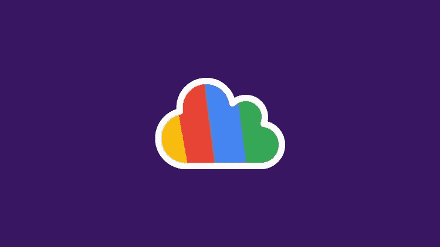
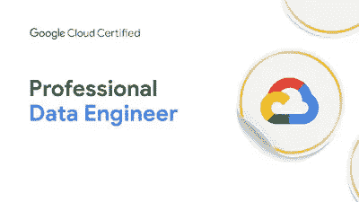
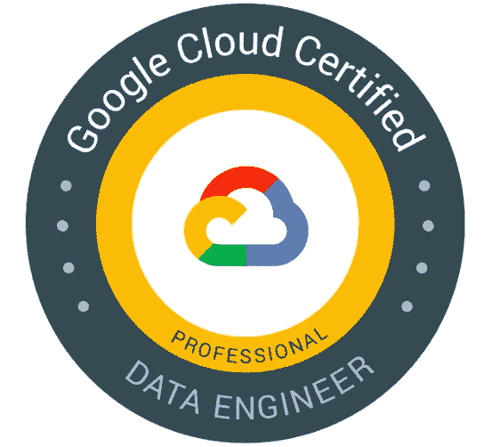
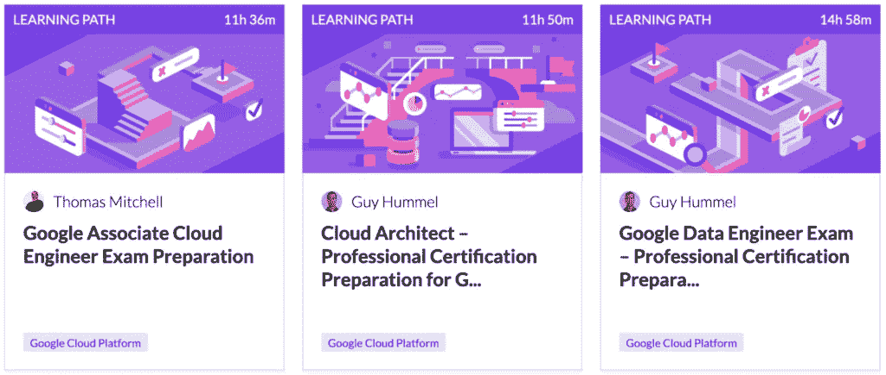
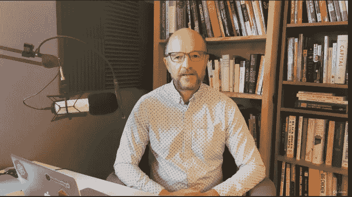

# 2023 年 8 次免费谷歌云数据工程师认证课程和实践测试

> 原文：<https://medium.com/javarevisited/8-free-google-cloud-data-engineer-certification-courses-and-practice-tests-594f31643b58?source=collection_archive---------0----------------------->

## 这些是 Udemy，Coursera 和其他网站上 2023 年谷歌云数据工程师认证的最佳免费在线课程。

image_credit — Udemy

你好伙计们，如果你正在准备 2023 年的谷歌云专业云数据工程师认证，并在寻找免费的在线谷歌云数据工程师课程，那么你来对地方了。

过去，我已经分享了学习谷歌云 的 [**最佳课程，以及通过**](/javarevisited/5-best-courses-to-learn-google-cloud-platform-gcp-in-2021-169093a3771a)**[云工程师](/javarevisited/5-best-gcp-associate-cloud-engineer-certification-courses-in-2021-c93d7e35228a) r 和[云架构师](https://javarevisited.blogspot.com/2020/07/top-5-courses-to-become-google-cloud-professional-architect.html)认证的最佳在线培训课程，今天，我将为初学者和有经验的云专业人士分享**免费的 GCP 云数据工程师认证课程**。**

这是最难和最负盛名的考试之一，类似于 [AWS 数据分析](https://javarevisited.blogspot.com/2020/09/top-10-aws-certifications-for-cloud-professionals.html)认证，一旦你通过了这个考试，你将拥有足够的知识和技能来提出基于谷歌云的解决方案，这是一项非常抢手的技能。

现在每家公司都专注于数据。大多数公司甚至改变了他们的工作领域。早些时候，他们在处理其他事情，但现在他们在处理数据。

在未来几年，数据将是公司最宝贵的资产，为了保护这些数据，将需要云服务器。因此，如果你期待成为一名**谷歌专业云数据工程师**，你将拥有一个光明的职业未来。

如果你还在摇摆不定，那么建议报读一些课程，然后决定哪个领域最适合你。

在本指南中，我列出了 8 门免费的最佳在线课程，这些课程可以帮助您通过 GCP 专业云数据工程师考试。

顺便说一句，如果你需要一个全面的在线课程，那么我也强烈推荐你加入由 Dan Sullivan 教授的 [**谷歌云专业数据工程师:获得认证 2023**](https://click.linksynergy.com/deeplink?id=JVFxdTr9V80&mid=39197&murl=https%3A%2F%2Fwww.udemy.com%2Fcourse%2Fgoogle-cloud-professional-data-engineer-get-certified%2F) 课程，他在 Udemy 上撰写了谷歌官方认证文件。

 [## 谷歌云专业数据工程师:2020 年获得认证

### 对数据工程师的需求不断增长，认证数据工程师是一些薪酬最高的认证…

udemy.com](https://click.linksynergy.com/deeplink?id=JVFxdTr9V80&mid=39197&murl=https%3A%2F%2Fwww.udemy.com%2Fcourse%2Fgoogle-cloud-professional-data-engineer-get-certified%2F) 

此**在线课程不是免费的**，而是针对谷歌云认证的最全面的在线课程，为包括云数据工程师在内的所有四种谷歌云认证提供学习材料。

# 2023 年破解谷歌云数据工程师考试的 8 门免费课程

在这个列表中，每门课程都是免费的，而且有些课程之间是相互联系的。因此，你必须参加所有这些课程，做好充分准备。

现在让我们从列表开始。

## 1.[云计算简介](https://click.linksynergy.com/deeplink?id=JVFxdTr9V80&mid=39197&murl=https%3A%2F%2Fwww.udemy.com%2Fcourse%2Fintroduction-to-cloud-computing%2F)【免费】

单子上接下来的两门课是相互关联的。如果你正在寻找一门课程，可以帮助你建立一个强大的云计算基础，然后想了解 GCP，那么这些课程是给你的。

可以用云计算吗？云计算的优势是什么？云计算的未来是什么样的？

如果你是一个完全的初学者，对[云计算](/javarevisited/5-best-cloud-computing-courses-to-learn-in-2020-f5f091159401)一无所知，那么这段代码将作为你的基础。完成本课程后，您可以开始专门为 GCP 专业云数据工程师考试而学习。

**这里是加入这个免费课程** — [云计算简介](https://click.linksynergy.com/deeplink?id=JVFxdTr9V80&mid=39197&murl=https%3A%2F%2Fwww.udemy.com%2Fcourse%2Fintroduction-to-cloud-computing%2F)的链接

## 2.[准备谷歌云专业数据工程师考试](https://coursera.pxf.io/c/3294490/1164545/14726?u=https%3A%2F%2Fwww.coursera.org%2Flearn%2Fpreparing-cloud-professional-data-engineer-exam)

这门课程可以在 Coursera 上找到，它是互联网上最好的课程之一。在本课程中，你将了解 GCP 的基本知识和复杂概念。除此之外，它是由谷歌云培训团队创建的。因此理解这些概念对你来说并不重要。

本课程是 [*准备谷歌云认证的一部分:云数据工程师职业证书*](https://coursera.pxf.io/c/3294490/1164545/14726?u=https%3A%2F%2Fwww.coursera.org%2Fprofessional-certificates%2Fgcp-data-engineering) 已有超过 23000 名学生注册本课程，在平台上被评为 4.6 星(满分 5 分)。这是一个长达 7 小时的视频课程，在本课程中，您将了解以下主题:

*   设计数据处理系统
*   数据处理系统的建立
*   DPS 应用程序的部署
*   GCP 安全方面的介绍

完成本课程后，您会发现处理 GCP 数据非常简单。除此之外，你还能以优异的成绩通过 GCP 云专业数据工程师考试。

**这里是加入本课程的链接** — [准备谷歌云专业数据工程师考试](https://coursera.pxf.io/c/3294490/1164545/14726?u=https%3A%2F%2Fwww.coursera.org%2Flearn%2Fpreparing-cloud-professional-data-engineer-exam)

但是为什么当参加审计专业的免费课程时，你将不会得到任何证书。如果你参加这个课程是为了获得 Coursera 证书，那么你需要注册参加这个专业或者参加一个订阅计划，比如 [**Coursera Plus**](https://coursera.pxf.io/c/3294490/1164545/14726?u=https%3A%2F%2Fwww.coursera.org%2Fcourseraplus) ，它可以提供超过 5000 个 Coursera 课程、项目和专业证书的无限制访问。

 [## Coursera Plus |无限制访问 7，000 多门在线课程

### 用 Coursera Plus 投资你的职业目标。无限制访问 90%以上的课程、项目…

coursera.pxf.io](https://coursera.pxf.io/c/3294490/1164545/14726?u=https%3A%2F%2Fwww.coursera.org%2Fcourseraplus) 

## 3.[谷歌云概念](https://click.linksynergy.com/deeplink?id=JVFxdTr9V80&mid=39197&murl=https%3A%2F%2Fwww.udemy.com%2Fcourse%2Flinux-academy-google-cloud-concepts%2F)(免费 Udemy 课程)

只有在您成功完成上述代码后，本课程才会对您有所帮助。在这个 16 分钟的视频课程中，超过 17000 名学生注册。本课程由 Linux 学院创建。

在本课程中，您将了解以下内容:

1.  什么是云？
2.  什么是谷歌云？
3.  谷歌云提供哪些服务？
4.  为什么要用谷歌云？

虽然本课程没有涉及到任何与数据相关的内容，但是在 [GCP 专业云数据工程师考试](https://www.java67.com/2020/10/5-free-courses-to-pass-google-cloud-professional-data-engineer-certification-exam.html)中，注意到大部分问题都是从基础开始问的。如果你有很强的基础，你可以轻松通过 GCP 专业云数据工程师考试。

如果您时间不够，那么您可以简单地报名参加本课程。即使有基础知识，也能扫清考试。

**这是加入这个在线课程**的链接。[谷歌云概念](https://click.linksynergy.com/deeplink?id=JVFxdTr9V80&mid=39197&murl=https%3A%2F%2Fwww.udemy.com%2Fcourse%2Flinux-academy-google-cloud-concepts%2F)

## 4.[谷歌数据工程师考试——专业认证备考](https://cloudacademy.com/learning-paths/data-engineer-professional-certification-preparation-for-google-83/)

如果你正在寻找一个中等难度的课程，并且不是为初学者设计的，那么这个课程就是为你设计的。

上面列出的两个课程都是专门为初学者设计的，但本课程是为那些事先了解 GCP 和[云计算](/javarevisited/5-best-cloud-computing-courses-to-learn-in-2020-f5f091159401)的人设计的。

在本课程中，讲师将直接从您要寻找的主题开始教您。在本课程中，不会向您介绍云计算等相关内容。

除了云计算的基础知识，本课程还需要数据库的基础知识。因此，如果您刚刚开始接触云计算，并且从未从事过数据库方面的工作，则不建议您注册本课程。

**这里是加入这个免费课程的链接**——[谷歌数据工程师考试](https://cloudacademy.com/learning-paths/data-engineer-professional-certification-preparation-for-google-83/)

## 5.[拥有谷歌云专业证书的数据工程](https://coursera.pxf.io/c/3294490/1164545/14726?u=https%3A%2F%2Fwww.coursera.org%2Fprofessional-certificates%2Fgcp-data-engineering)

Coursera 上也有这门课，不过这次比上一次更详细。该课程也是由谷歌云培训团队创建的，完成该课程后，您将获得一份结业证书。

这是一组课程，将教你与 GCP 数据工程相关的每一点。这是互联网上最详细的课程之一。如果你每周花 4 个小时上这门课，你将需要 4 个月才能完成这门课。

在本课程中，您将学习数据的基础知识，稍后，讲师将教您不同的 [SQL 语句](/hackernoon/top-5-sql-and-database-courses-to-learn-online-48424533ac61)来处理 GCP 上的数据。超过 23，000 名学生注册了这门课程，根据超过 500 名学生的评论；这门课的评分是 4.4 分(满分 5 分)。

在这门课程中，图形的使用非常巧妙，因为课程很长，所以每一个特定的步骤都会被多次演示。如果你有充足的时间，那么你必须参加这个项目。它也会给你现场项目的实践经验。

**这是加入本课程**——[谷歌云数据工程专业](https://coursera.pxf.io/c/3294490/1164545/14726?u=https%3A%2F%2Fwww.coursera.org%2Fprofessional-certificates%2Fgcp-data-engineering)的链接

顺便说一句，如果你发现 Coursera 的课程很有用，因为它们是由世界各地的知名公司和大学创建的，我建议你加入 Coursera Plus 的订阅计划，它可以让你无限制地访问他们最受欢迎的课程、专业、专业证书和指导项目。它每年花费大约 399 美元，但它完全值得你的钱，因为你可以获得无限的证书。

 [## Coursera Plus |无限制访问 7，000 多门在线课程

### 用 Coursera Plus 投资你的职业目标。无限制访问 90%以上的课程、项目…

coursera.pxf.io](https://coursera.pxf.io/c/3294490/1164545/14726?u=https%3A%2F%2Fwww.coursera.org%2Fcourseraplus) 

## 6.[谷歌云基础 101:学习 GCP 的快速指南](https://click.linksynergy.com/deeplink?id=JVFxdTr9V80&mid=39197&murl=https%3A%2F%2Fwww.udemy.com%2Fcourse%2Fgoogle-cloud-fundamentals-101-a-quick-guide-to-learn-gcp%2F)

这是 Udemy 的另一个免费课程，学习谷歌云，你也可以用它来准备谷歌云数据工程师认证。

顺便说一句，这是一门入门课程，用于入门谷歌云平台(GCP)。在本课程中，您将了解什么是云计算、什么是不同的云计算模型、重要的 GCP 服务以及实际操作。

本课程没有先决条件，但是，熟悉其他云计算，熟悉 IT 项目将有所帮助。

**这里是加入这个免费课程的链接**——[谷歌云基础 101](https://click.linksynergy.com/deeplink?id=JVFxdTr9V80&mid=39197&murl=https%3A%2F%2Fwww.udemy.com%2Fcourse%2Fgoogle-cloud-fundamentals-101-a-quick-guide-to-learn-gcp%2F)

## 7.[GCP——谷歌云平台概念[免费]](https://click.linksynergy.com/deeplink?id=JVFxdTr9V80&mid=39197&murl=https%3A%2F%2Fwww.udemy.com%2Fcourse%2Fgoogle-cloud-fundamentals-101-a-quick-guide-to-learn-gcp%2F)

这是 Udemy 上 Google 云平台的一门综合免费课程。这个长达 6 小时的课程和任何付费课程一样好，我强烈建议每个初学者都加入这个课程，从头开始学习谷歌云的概念。

这是你将在本课程中学到的东西

1.  计算机、数据库和存储服务背景
2.  谷歌云平台界面
3.  谷歌云计算服务
4.  谷歌云网络服务
5.  谷歌云存储服务等等

**这里是加入这个免费课程的链接** — [谷歌云基础 101](https://click.linksynergy.com/deeplink?id=JVFxdTr9V80&mid=39197&murl=https%3A%2F%2Fwww.udemy.com%2Fcourse%2Fgoogle-cloud-fundamentals-101-a-quick-guide-to-learn-gcp%2F)

## 8.[如何通过谷歌云认证考试](https://click.linksynergy.com/deeplink?id=JVFxdTr9V80&mid=39197&murl=https%3A%2F%2Fwww.udemy.com%2Fcourse%2Fhow-to-pass-google-cloud-certification-exams%2F)

这是一个关于如何在 Udemy 上通过谷歌云认证的简短免费课程。这个课程是由 Dan Sullivan 创建的，他是 Google 官方认证指南的作者，也为 Google 云认证创建了最畅销的 Udemy 课程，如 [**Google 云专业数据工程师:获得认证 2023**](https://click.linksynergy.com/deeplink?id=JVFxdTr9V80&mid=39197&murl=https%3A%2F%2Fwww.udemy.com%2Fcourse%2Fgoogle-cloud-professional-data-engineer-get-certified%2F) **，**，如果你花不了多少钱，我强烈推荐这些课程。

谷歌云认证考试极具挑战性。即使你对谷歌云服务有很深的了解，如果你不熟悉考试的结构，你也可能通不过认证考试。

这门免费课程将帮助您了解谷歌云认证考试是如何组织的，参加这些考试的规则，以及您可能会遇到的各种问题。

也许最重要的是，本课程展示了如何分析问题，准确识别被问到的问题，以及如何对每个可能的答案进行推理，以便你能选择最佳选项。

**这里是加入这个免费课程的链接**——[如何通过谷歌云认证考试](https://click.linksynergy.com/deeplink?id=JVFxdTr9V80&mid=39197&murl=https%3A%2F%2Fwww.udemy.com%2Fcourse%2Fhow-to-pass-google-cloud-certification-exams%2F)

以上就是 2023 年通过 Google Cloud 专业云数据工程师**免费在线课程。在这本指南中，每一种都被列出来了。如果你正在寻找一个详细的课程你会在这里找到它，如果你正在寻找一个简单和短期的课程你会在这里找到它。**

除此之外，以上所列课程均由行业专家打造；因此理解对你来说不是问题。尽管上面列出了五种不同的课程，我们还是建议您参加所有这些课程。然后完成几个视频后，你就可以决定哪个课程对你来说更容易理解。

您可能喜欢的其他**云计算和 IT 认证课程**和文章

*   [微软 Azure 基础知识前 5 名模拟测试](https://javarevisited.blogspot.com/2020/02/top-5-AZ-900-exam-Azure-Fundamentals-certification-practice-tests-and-mock-exams-to.html)
*   [如何破解 2023 年 AZ-103 Azure 行政考试](https://javarevisited.blogspot.com/2020/04/how-to-crack-microsoft-az-103-azure-administrator-associate-exam-certification.html)
*   [学习 Docker 和 Kubernetes 的十大课程](https://dev.to/javinpaul/top-10-courses-to-learn-docker-and-kubernetes-for-programmers-4lg0)
*   [破解 Azure 开发人员助理考试的前 5 门课程](https://javarevisited.blogspot.com/2020/06/top-5-course-to-crack-Microsoft-Azure-Developer-Certification-Exam-AZ-203.html)
*   [如何破解 AWS 解决方案架构师考试](https://javarevisited.blogspot.com/2019/08/how-to-crack-aws-certified-solution-architect-exam.html)
*   [通过 Azure 开发人员助理认证(AZ-203)的 5 门在线课程](https://javarevisited.blogspot.com/2020/06/top-5-course-to-crack-Microsoft-Azure-Developer-Certification-Exam-AZ-203.html)
*   [破解 AWS 解决方案架构师认证的 5 大课程](https://javarevisited.blogspot.com/2019/05/top-5-courses-to-crack-aws-solutions-architect-associate-certification-exam-SAA-C01.html#axzz5rHwAwycj)
*   [学习微软 Azure 概念的 5 门免费课程](https://www.java67.com/2020/07/5-free-courses-to-learn-microsoft-azure-cloud.html)
*   [如何在 2023 年成为 Azure 解决方案架构师助理](https://javarevisited.blogspot.com/2020/04/how-to-crack-microsoft-azure-solution-architect-exam-az-300.html)
*   [通过 Azure 云架构考试的前 5 门课程](https://javarevisited.blogspot.com/2019/07/top-5-courses-to-crack-azure-architecture-technologies-certification-az-300-exam.html)
*   [如何通过 Spring Core Professional 5.0 认证](https://javarevisited.blogspot.com/2018/08/how-to-crack-spring-core-professional-certification-exam-java-latest.html)
*   [2023 年通过 AZ-900 认证的前 5 名课程](https://javarevisited.blogspot.com/2020/02/top-5-courses-to-crack-az-900-microsoft-azure-fundamentals-certification-exam.html)
*   [破解 Azure 云架构师(AZ-300)考试的前 5 门课程](https://javarevisited.blogspot.com/2019/07/top-5-courses-to-crack-azure-architecture-technologies-certification-az-300-exam.html#axzz6E6VuRMsx)
*   [如何破解甲骨文 2023 年 Java 认证？](https://medium.freecodecamp.org/how-to-pass-oracles-java-certifications-a-practical-guide-for-developers-e9b607ba6173)
*   [通过谷歌助理云工程师认证的前 5 门课程](https://javarevisited.blogspot.com/2019/07/top-5-google-cloud-platform-gcp-courses-certifications-online.html)
*   [如何成为 DevOps 工程师？](https://javarevisited.blogspot.com/2018/09/the-2018-devops-roadmap-your-guide-to-become-DevOps-Engineer.html)
*   [10 门数据科学和机器学习认证课程](https://dev.to/javinpaul/10-data-science-and-machine-learning-courses-for-programmers-looking-to-switch-career-57kd)
*   [如何破解 Azure Fundamentals (AZ-900)认证](https://javarevisited.blogspot.com/2020/04/how-to-crack-microsoft-azure-fundamentals-certification-az-900-exam.html)

感谢您阅读本文。如果你觉得这些*免费的 Google 云平台和云工程师认证课程*有用，那么，请分享给你的朋友和同事。如果您有任何问题或反馈，请留言。

**P. S.** —如果你需要更全面、更集中的在线认证课程，那么我也强烈推荐你参加 Udemy 上的 [**终极谷歌云认证:全包(4)**](https://click.linksynergy.com/deeplink?id=JVFxdTr9V80&mid=39197&murl=https%3A%2F%2Fwww.udemy.com%2Fcourse%2Fgoogle-certified-architect-developer-engineer-data-devops%2F) 课程。这不是免费的，而是最全面的谷歌云认证在线课程，为包括云数据工程师在内的所有四种谷歌云认证提供学习材料。

 [## 终极谷歌云认证:一切尽在一个捆绑包中(4)

### 嗨，云专家们，我们有 405，000 多名学生和 280，000 名独立学生获得了谷歌云平台认证…

udemy.com](https://click.linksynergy.com/deeplink?id=JVFxdTr9V80&mid=39197&murl=https%3A%2F%2Fwww.udemy.com%2Fcourse%2Fgoogle-certified-architect-developer-engineer-data-devops%2F)