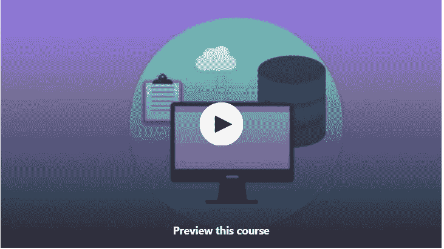
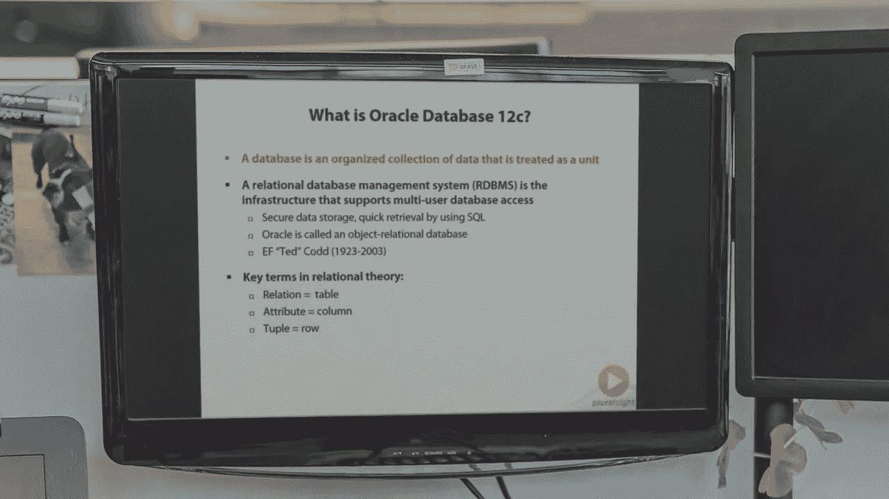
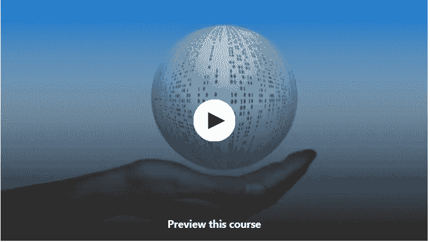
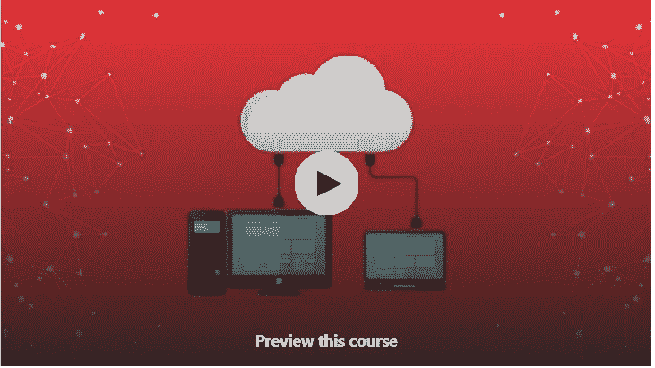
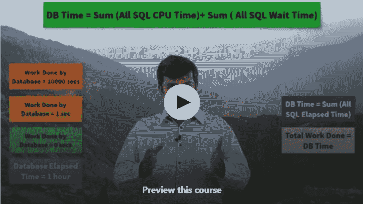

# 2023 年面向初学者的 8 门最佳免费 Oracle 数据库和 SQL 课程

> 原文：<https://medium.com/javarevisited/8-free-oracle-database-and-sql-courses-for-beginners-f4e9b25b33c4?source=collection_archive---------0----------------------->

## 我最喜欢的课程是从 Udemy、Coursera、Educative 和其他在线门户网站为初学者学习 Oracle 数据库和 PL/SQL。

大家好，如果你想在 2023 年学习 Oracle 数据库和 SQL，并寻找免费的在线课程，那么你来对地方了。前面我已经分享过 [**最好的 SQL 和数据库课程**](/hackernoon/top-5-sql-and-database-courses-to-learn-online-48424533ac61) 和 [**书籍**](/javarevisited/5-best-books-to-learn-sql-and-database-design-for-programmers-and-developers-1e7839df2f3e?source=---------7------------------) ，今天我要分享的是免费的 Oracle SQL 初学者课程。

这些免费课程来自像 Udemy、Pluralsight、Coursera 和其他著名的在线学习网站。出于教育和学习目的，它们是免费的。成千上万的人已经加入了本课程，您也可以这样做，在家中或办公室舒适地学习 Oracle SQL。

[Oracle](https://www.oracle.com) 是最受欢迎的数据库之一，许多银行、保险公司和电子商务网站都在后端使用 Oracle。Linux + Oracle 的组合是一个流行的组合，成千上万的公司都在这个堆栈上运行他们的公司。

这就是为什么对 Oracle DBAs 和 Oracle SQL 开发人员的需求一直很高的原因。我是一名 Java 开发人员，我学习了 Oracle SQL，因为我需要参与一个在后端使用 Oracle 数据库的项目。

我的工作要求我编写 Oracle SQL 查询 T21、存储过程、触发器和其他与数据库相关的东西，这些都是应用程序开发的一部分。当时我是通过看博客和教程，从一个网站跳到另一个网站来学习 Oracle SQL 的。我真的错过了在线课程提供的学习 Oracle SQL 的结构化方法。

这不仅能让你学得更快，还能为进一步学习打下基础。卡住的机会也更少，因为总有人可以指导你，告诉你如何以正确的方式做这件事。

# 2023 年初学者学习 Oracle SQL 和数据库课程的 8 个最佳免费课程

为了不浪费你更多的时间，这里有一个来自 Udemy 和其他网站的免费课程列表。这些课程非常适合从 Oracle SQL 开始并奠定基础，最重要的是它们是免费的，这意味着您不需要花任何钱来学习 Oracle SQL。

## 1. [Oracle SQL —完整介绍](http://bit.ly/2xaoka3)[免费]

成为 Oracle SQL 开发人员的第一步
本课程向学生介绍 Oracle SQL。任何对 Oracle SQL 开发感兴趣的人都可以通过本课程学习 Oracle SQL。

在本课程中，您将学到以下内容:

*   如何编写与 Oracle 数据库交互的 SQL 查询
*   如何成为一名数据库开发人员
*   如何使用 Oracle SQL 开发代码
*   了解 Oracle RDBMS 体系结构的基础知识
*   如何获得 Oracle SQL 认证
*   如何理解 Oracle 12c 数据库

这是一门免费课程，包含大量视频讲座，不仅向您介绍 Oracle SQL，还将带您深入了解数据库开发。

**以下是参加本课程的链接** — [Oracle SQL —完整介绍](http://bit.ly/2xaoka3)

## 2. [Oracle SQL:最流行数据库简介](https://click.linksynergy.com/deeplink?id=JVFxdTr9V80&mid=39197&murl=https%3A%2F%2Fwww.udemy.com%2Fcourse%2Foracle-sql-an-introduction-to-the-most-popular-database%2F)

这是另一个学习 Oracle SQL 的免费 Udemy 课程。这个 1.5 小时的课程是使用 Oracle SQL 中最重要的 SELECT 子句的初级课程。

您将首先免费安装一个版本的 Oracle Express Edition 和 Oracle SQL Developer，然后学习如何使用 SELECT 语句及其 6 个主要子句( [SELECT](https://javarevisited.blogspot.com/2011/10/selct-command-sql-query-example.html) ，FROM， [WHERE](https://www.java67.com/2019/06/difference-between-where-and-having-in-sql.html) ， [GROUP BY](https://javarevisited.blogspot.com/2020/04/sql-group-by-and-having-example-write.html) ，HAVING 和 ORDER BY)。

在本课程中，您将学习:

*   如何编写自己的 SELECT 语句？
*   学习 SELECT、FROM、WHERE、GROUP BY、HAVING 和 ORDER BY 子句。
*   找到一种简单的方法来记住这些从句的顺序。
*   找出你还需要知道什么，以及如何学习的资源。

这是一门免费课程，因此您不会有任何损失，也没有先决条件，您需要的只是学习 Oracle SQL 的意愿。

**以下是加入本课程的链接—** [Oracle SQL:最流行数据库简介](https://click.linksynergy.com/deeplink?id=JVFxdTr9V80&mid=39197&murl=https%3A%2F%2Fwww.udemy.com%2Fcourse%2Foracle-sql-an-introduction-to-the-most-popular-database%2F)

## 3. [Oracle SQL Developer:提示和技巧](https://click.linksynergy.com/deeplink?id=JVFxdTr9V80&mid=39197&murl=https%3A%2F%2Fwww.udemy.com%2Foracle-sql-developer-tips-and-tricks%2F)

Oracle SQL Developer 是目前数据库开发人员和 Oracle SQL 学习者中最受欢迎的工具。这就像面向 MSSQL 开发人员的 SQL Server Management studio，但是，由于它使启动命令和查询数据库变得如此容易，许多人觉得没有必要研究它的特性，最终只使用那些显而易见的、可见的和默认启用的特性。

如果您愿意再接再厉，想要掌握这个有用的 Oracle SQL 工具，那么您应该在 [Udemy](/javarevisited/top-15-java-and-spring-framework-courses-from-udemy-best-of-lot-d7b965b62a9f?source=---------42----------------------------) 参加这个 Oracle SQL 课程。

在本课程中，您将学习:

*   安装并配置 Oracle SQL Developer，使其以您想要的语言运行，并且只提供您需要的功能。
*   创建数据库连接并执行命令和脚本。
*   以一种使你的工作更容易的方式展示你的结果。
*   使用代码模板和代码片段来加速您的工作。
*   使用不同的方法以不同的格式导出数据。
*   其他一些有用有趣的东西。

总的来说，这是一门很好的课程，学习如何使用 Oracle SQL Developer 并利用其最有用的特性。

**以下是参加本课程的链接** — [Oracle SQL Developer:提示和技巧](https://click.linksynergy.com/deeplink?id=JVFxdTr9V80&mid=39197&murl=https%3A%2F%2Fwww.udemy.com%2Foracle-sql-developer-tips-and-tricks%2F)

## [4。Oracle Database 12c 基础知识](https://pluralsight.pxf.io/c/1193463/424552/7490?u=https%3A%2F%2Fwww.pluralsight.com%2Fcourses%2Foracle-database-12c-fundamentals)【plural sight】

这是 Pluralsight 的最佳 Oracle 数据库课程之一。本课程将帮助您全面了解 Oracle 数据库平台，尤其是 Oracle Database 12c 版本。

您还将准备通过 Oracle 认证管理员(OCA)认证考试。

为了从本课程中获得最大收益，您应该已经对关系数据库管理系统、关系模型以及使用 SQL 查询数据库有了基本的了解。

**以下是参加本课程的链接—** [Oracle Database 12c 基础知识](https://pluralsight.pxf.io/c/1193463/424552/7490?u=https%3A%2F%2Fwww.pluralsight.com%2Fcourses%2Foracle-database-12c-fundamentals)

顺便说一句，这门课程并不完全免费，但你可以通过使用 Pluralsight 的 [**10 天免费试用**](https://pluralsight.pxf.io/c/1193463/424552/7490?u=https%3A%2F%2Fwww.pluralsight.com%2Flearn) 免费观看这门课程，它提供了对他们所有 7000+在线课程的访问。

<https://pluralsight.pxf.io/c/1193463/424552/7490?u=https%3A%2F%2Fwww.pluralsight.com%2Flearn>  

## 5.[循序渐进实用 Oracle SQL](https://click.linksynergy.com/deeplink?id=JVFxdTr9V80&mid=39197&murl=https%3A%2F%2Fwww.udemy.com%2Foracle-and-sql-step-by-step-learning%2F) 【免费 Udemy 课程】

在本课程中，您将学习 Oracle PL/SQL 编程语言的基础知识。一步一步的实际 Oracle SQL 与现实生活中的练习，它解释了什么和为什么 Oracle SQL 的概念。处理现实生活中的情况。

以下是您将在这个免费的 Oracle SQL 课程中学到的重要内容

*   创建表格并将数据插入其中。
*   从表中选择数据，并使用 [WHERE 子句](https://www.java67.com/2019/06/difference-between-where-and-having-in-sql.html)对其进行过滤
*   跨多个表联接数据
*   使用 [GROUP BY](https://javarevisited.blogspot.com/2020/06/5-example-of-group-by-clause-in-sql.html) 对结果进行分组并计算总量
*   使用函数处理数据。
*   使用授权和同义词控制对用户的访问。
*   为性能原因和数据约束创建索引，以保护数据完整性

以下是参加本课程的链接— [逐步实用 Oracle SQL](https://click.linksynergy.com/deeplink?id=JVFxdTr9V80&mid=39197&murl=https%3A%2F%2Fwww.udemy.com%2Foracle-and-sql-step-by-step-learning%2F)

## 6.[Oracle SOA 12c 快速入门指南](https://click.linksynergy.com/deeplink?id=CuIbQrBnhiw&mid=39197&murl=https%3A%2F%2Fwww.udemy.com%2Fcourse%2Fquick-start-guide-to-oracle-soa-12c%2F)【Udemy 免费课程】

这是 Udemy 上学习 Oracle SOA 12c 的另一个免费课程。在本课程中，您将学习如何使用 QuickStart 发行版来构建 Oracle SOA 12c 开发环境，而不是花费数小时来安装完整的发行版。

以下是你将在本课程中学到的主要内容—

1.  了解 Oracle SOA 12c 快速入门和 Oracle SOA 12c 企业部署之间的差异，
2.  如何创建 OTN 账户
3.  如何下载 Oracle SOA 12c 快速入门发行版？
4.  如何准备安装环境？
5.  如何在 Linux 和 Windows 上安装 Oracle SOA 12c 快速入门发行版

**这里是参加这个免费课程的链接**—[Oracle SOA 12c 快速入门指南](https://click.linksynergy.com/deeplink?id=CuIbQrBnhiw&mid=39197&murl=https%3A%2F%2Fwww.udemy.com%2Fcourse%2Fquick-start-guide-to-oracle-soa-12c%2F)

## 7.[甲骨文数据库架构](https://click.linksynergy.com/deeplink?id=CuIbQrBnhiw&mid=39197&murl=https%3A%2F%2Fwww.udemy.com%2Fcourse%2Foracle-database-architecture%2F)【免费】

这是了解 Oracle 数据库架构的难得的免费课程之一。这个免费课程也来自 Udemy，它将教你 Oracle 数据库架构的基本概念。

在这门免费的 Oracle 课程中，您将了解 Oracle 数据库的架构组件。例如，您将了解 Oracle 数据库架构中涉及的各种进程、内存区域和文件。

本课程将帮助您深入理解 Oracle 数据库架构的基础知识，为 DBA 的工作技能打下基础，并帮助您获得 DBA 认证。

谈到社会证明，已经有超过 15000 名学生加入了这门课程。这有超过 3.5 小时的内容，与 Udemy 上的许多付费课程一样好。

**这是加入免费课程** — [Oracle 数据库架构](https://click.linksynergy.com/deeplink?id=CuIbQrBnhiw&mid=39197&murl=https%3A%2F%2Fwww.udemy.com%2Fcourse%2Foracle-database-architecture%2F)的链接

## 8. [Oracle 数据库性能调优—基础知识](https://click.linksynergy.com/deeplink?id=CuIbQrBnhiw&mid=39197&murl=https%3A%2F%2Fwww.udemy.com%2Fcourse%2Foracle-database-performance-tuning-fundamentals%2F)[免费]

这是 Udemy 上 Ramkumar Swaminathan 提供的另一个学习 Oracle 数据库性能调优的免费课程。在这个免费的 Oracle DB 课程中，您将了解性能调优的重要概念

这是一门免费课程，要了解更多详细信息，您可以参加 Oracle 数据库故障排除和调优课程。那门课程会深入探讨阅读和解读 AWR 报告的更多细节，并为你提供更多信息。

这个 2.5 小时的课程非常适合任何有兴趣对 Oracle 数据库进行故障排除和调优的人。已经有 13，000 多人参加了这一课程。

**这是参加本课程的链接** — [Oracle 数据库性能调优—基础](https://click.linksynergy.com/deeplink?id=CuIbQrBnhiw&mid=39197&murl=https%3A%2F%2Fwww.udemy.com%2Fcourse%2Foracle-database-performance-tuning-fundamentals%2F)

以上是关于学习 Oracle SQL 和数据库的一些**最好的免费在线课程。如果您正在使用 Oracle，可以通过这些课程快速学习基本概念。**

正如我所说，它们是完全免费的，你只需要一个 Udemy 账户就可以加入那些免费的 Udemy 课程。对于 [Pluralsight](/javarevisited/7000-free-pluralsight-courses-to-build-in-demand-tech-skills-without-leaving-your-house-40edb50a8cf2) ，它们并不完全免费，但你可以使用 Pluralsight 免费试用版免费观看这些课程。

您可能喜欢的其他**编程文章和资源**

*   [6 门针对初学者的免费数据库和 SQL 课程](https://javarevisited.blogspot.com/2019/01/top-6-free-database-and-sql-courses-to-learn-online.html)
*   [2023 年网络开发者路线图](https://javarevisited.blogspot.com/2019/02/the-2019-web-developer-roadmap.html)
*   [学习 MySQL 数据库的 5 门最佳课程](/javarevisited/top-5-courses-to-learn-mysql-in-2020-4ffada70656f)
*   [2023 年学习 PostgreSQL 的 5 大课程](https://javarevisited.blogspot.com/2020/02/top-5-courses-to-learn-postgresql-in.html)
*   为有经验的开发者提供的 10 门免费 Java 课程
*   [7 门免费的最好的学习 PostgreSQL 的课程](/javarevisited/7-best-free-postgresql-courses-for-beginners-to-learn-in-2021-3bf369d73794)
*   [我最喜欢的学习 GraphQL 的课程](/javarevisited/top-5-graphql-tutorials-and-courses-for-beginners-fb5543506fc2)
*   [2023 年学习 Docker 的 10 门免费课程](http://www.java67.com/2018/02/5-free-docker-courses-for-java-and-DevOps-engineers.html)
*   [devo PS 工程师五大免费 Kubernetes 课程](https://javarevisited.blogspot.com/2019/01/top-5-free-kubernetes-courses-for-DevOps-Engineer.html#axzz5d2bEyYmv)
*   [2023 年学习 Maven 和 Jenkins 的 5 门免费课程](http://www.java67.com/2018/02/6-free-maven-and-jenkins-online-courses-for-java-developers.html)
*   [面向程序员的 2023 年 DevOps 路线图](https://javarevisited.blogspot.com/2018/09/the-2018-devops-roadmap-your-guide-to-become-DevOps-Engineer.html)
*   [Web 开发人员应该知道的 10 个 JavaScript 框架](http://www.java67.com/2019/01/top-10-javascript-frameworks-and-libraries-for-web-developers.html)
*   [2023 年 10 大最佳 SQL 和数据库课程](/hackernoon/top-5-sql-and-database-courses-to-learn-online-48424533ac61)

感谢您阅读本文。如果您觉得这些免费的 Oracle SQL 和数据库课程*有用，请与您的朋友和同事分享。如果您有任何问题或反馈，请留言。*

**附言** —如果你对学习 Oracle SQL 和 PL/SQL 语言很认真，并且不介意花点钱，那么我强烈推荐你在 Udemy 上查看这个 [**完整的 Oracle SQL 认证课程**](http://bit.ly/2zNcfKH) ，深入学习 Oracle PL/SQL。这是评分最高、最受欢迎的学习 PL/SQL 的 Udemy 课程，已经有成千上万的人加入了这个课程。

<http://bit.ly/2zNcfKH> 