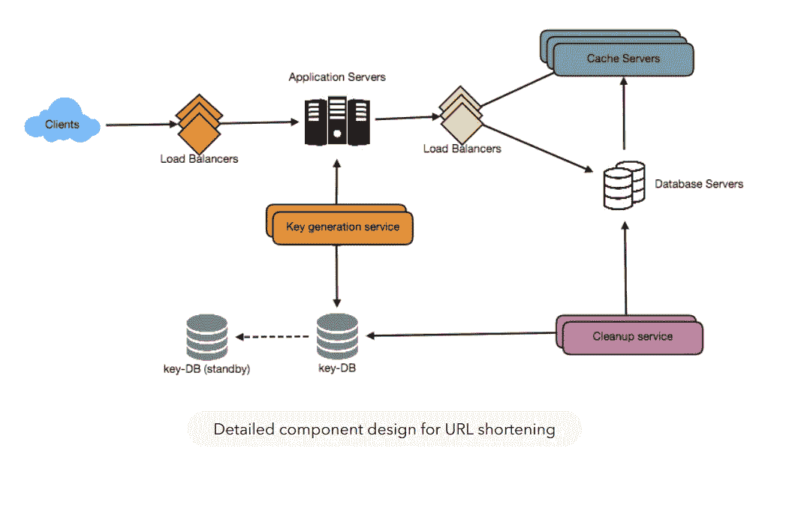
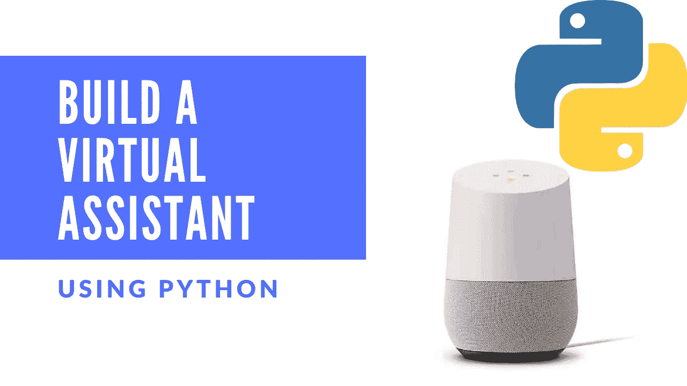
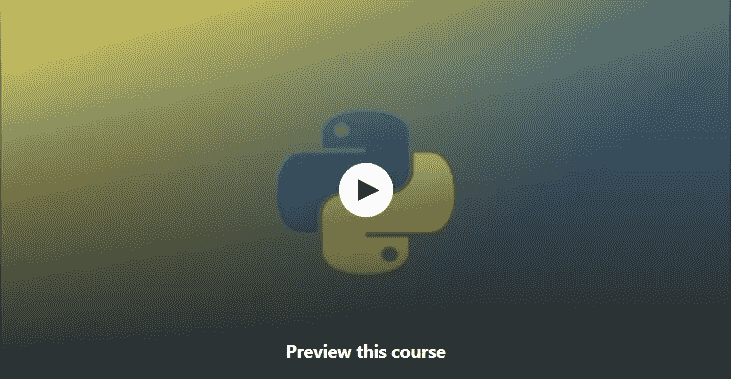
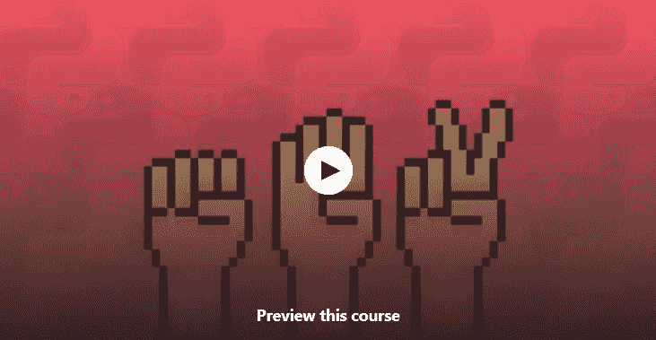
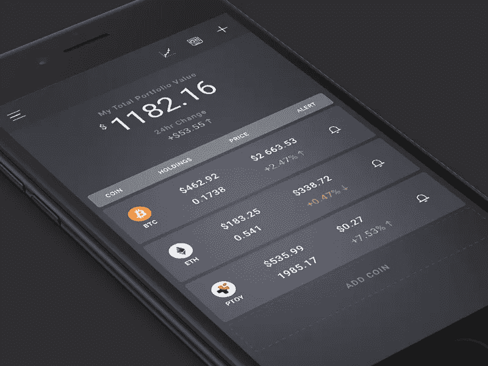
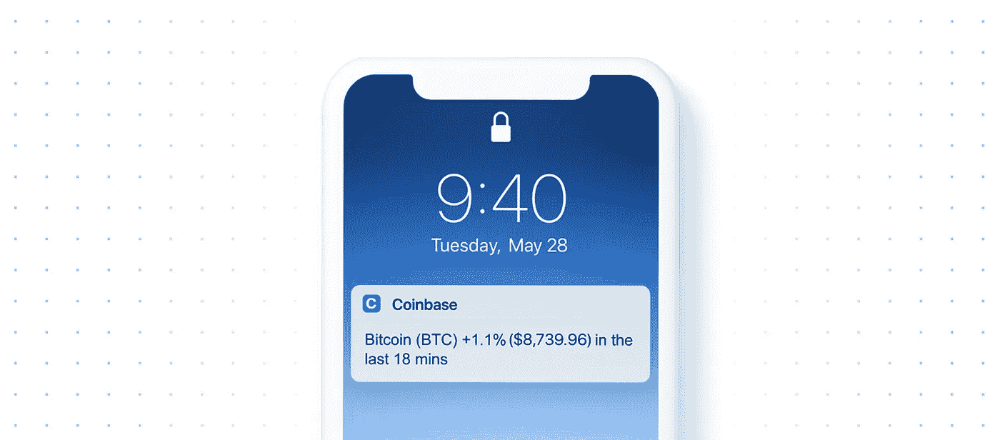
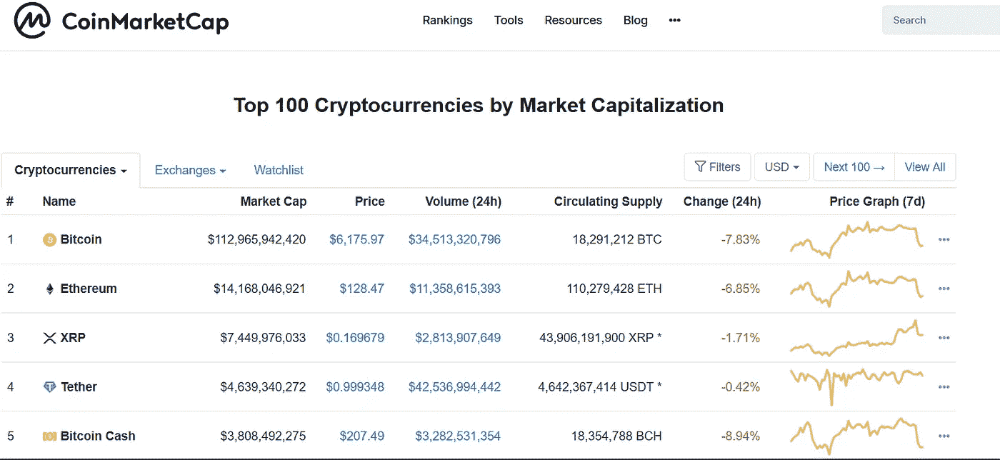
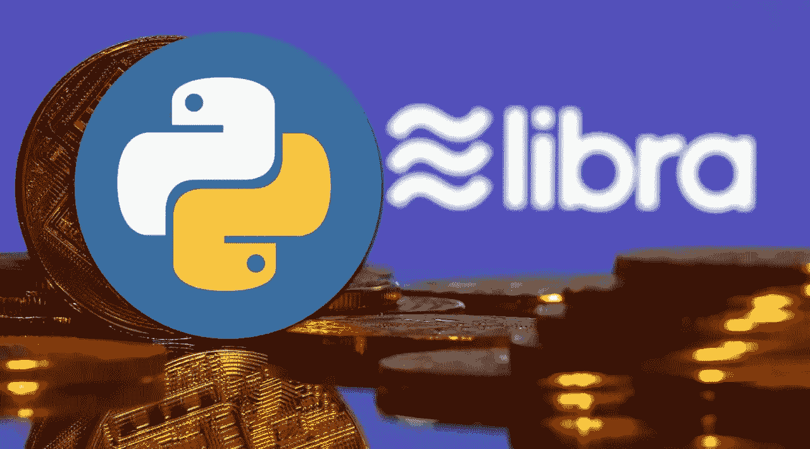

# 2023 年学习 Python 可以搭建的 8 个项目

> 原文：<https://medium.com/javarevisited/8-projects-you-can-buil-to-learn-python-in-2020-251dd5350d56?source=collection_archive---------0----------------------->

## Python 初学者的项目想法，提供免费课程/文章的链接来构建这些项目

image_credit — [钻研系统设计面试](https://www.educative.io/collection/5668639101419520/5649050225344512?affiliate_id=5073518643380224)

大家好，今天，我将分享一些基于项目的免费课程，你们不仅可以用它们来使用 Python 构建项目，还可以更好地学习 Python。这些也是完全免费的课程，来自 [Udemy](https://click.linksynergy.com/fs-bin/click?id=JVFxdTr9V80&offerid=323058.9410&type=3&subid=0) 和 [Coursera](https://coursera.pxf.io/c/3294490/1164545/14726?u=https%3A%2F%2Fwww.coursera.org%2F) 等网站，由他们的讲师出于教育和营销目的免费提供。不过，你应该在加入之前检查一下价格，因为一些讲师在达到他们的营销目标后会将免费课程转为付费课程。

回到 Python，这可能是你现在知道要学的最好的东西。Python 是一种用途广泛的通用语言。您可以将 Python 用于 web 开发、自动化、机器学习和数据科学。你也可以用 Python 找一份自由职业，或者在谷歌这样的大科技公司找一份工作。很少有语言同时具备这两种可能性。

我一直在说每个程序员都应该学习 Python，这篇文章是该系列的下一篇。在过去，我曾分享过 [**15 门免费 Python 课程**](/swlh/5-free-python-courses-for-beginners-to-learn-online-e1ca90687caf) 和 [**5 门付费 Python 课程**](https://hackernoon.com/top-5-courses-to-learn-python-in-2020-best-of-lot-bdq3y42) ，帮助我的读者获得学习 Python 的最佳资源。

这是非常重要的，因为互联网上充满了免费和付费的资源，如果你不小心，你会花所有的时间做一个资源，希望这是一个策划的课程列表有所帮助。

如果你是 Python 新手，并且能花上几块钱，我强烈推荐最好的在线 Python 课程之一 Udemy 上何塞·马西亚尔·波尔蒂利亚的完整 Python 训练营课程。这不是免费的，但是你可以在 Udemy 上花 10 美元买到。它也包括你将作为课程的一部分建立的一个期末专题。

记住，没有什么比实际构建东西更能帮助你，所以继续吧，磨砺你的思维，学习 Python。

# 2023 年成为 Python 开发者可以做的 8 个项目

在不浪费你更多时间的情况下，这里有 5 个项目，任何初学 Python 的人都可以同时构建和学习 Python。

## 1.构建虚拟助手

在这个项目中，您将使用 Python 编程语言构建自己的虚拟助手！虚拟助理是一种可以理解语音命令并为用户完成任务的应用程序。谷歌的 assistant 和亚马逊的 Alexa 就是虚拟助手的好例子。

如果你在这个项目上需要任何帮助，你可以查看 Udemy 的免费 Python 课程[学习 Python:构建虚拟助手](http://bit.ly/2lI6epr)。这是一个基于项目的课程，学习和建立一些东西是非常好的。作为本课程的一部分，你将从基本的 python 到为你的计算机创建一个虚拟助手

以下是免费加入课程的链接: [***学习 Python:打造虚拟助手***](http://bit.ly/2lI6epr)

这篇 Medium.com 的文章作者是 randerson112358

 [## 使用 Python 构建虚拟助手

### 在这篇文章中，我将向你展示如何使用 Python 编程语言来构建你自己的虚拟助手！一个…

medium.com](/@randerson112358/build-a-virtual-assistant-using-python-2b0f78e68b94) 

## 2.建造一个侦察扫描仪

在本项目中，您将构建一个侦察扫描仪，它将扫描任何可通过 internet 访问的网站，并以文件形式向您提供结果。

如果你需要帮助，那么你可以看看 [Python 编程——构建一个侦察扫描仪](http://bit.ly/2lQ5oqU)，这是另一个免费的基于项目的课程，在 2023 年学习 Python。在本课程中，您将学习如何在 Ubuntu 和中使用 Python 2.x 和 Python 3.x

以下是免费加入课程的链接: [***Python 编程—搭建侦察扫描仪***](http://bit.ly/2lQ5oqU)

## 3.建立一个石头剪刀布游戏克隆

创建游戏可能是学习编码、逻辑和任何像 Python 这样的新编程语言的最好方法。它也给你一种创造有用的东西的感觉。

这是另一个免费的基于项目的课程，可以在家里或办公室在线学习 Python，它提供了用 Python 创建石头剪刀布程序的深度指导。

以下是免费加入课程的链接: [***石头剪刀布— Python 教程***](http://bit.ly/2OcNn2a)

## 4.创建一个类似 bit.ly 的 URL 缩短服务

如果你想做网络开发，创建网站和网络应用，那么 Python 是一个很好的选择。它有很多很棒的框架，比如 Python 和 Flask，这使得创建 web 应用程序变得很容易。

这个免费的 Python 课程将教你 Django，它是最强大的 web 框架之一，使构建 web 应用程序变得容易，这也是它成为#1 Python 库的原因

以下是免费加入课程的链接: [***试试 Django 1.10 |创建网址缩短服务***](http://bit.ly/2xZSPip)

image_credit — [参加系统设计面试](https://www.educative.io/collection/5668639101419520/5649050225344512?affiliate_id=5073518643380224)

## 5. ***一款加密货币组合 App***

您可以轻松地构建一个项目来跟踪您的所有加密资产。查看您所有加密资产的总价值以及每项资产的详细信息。正值和负值被涂上绿色和红色。

如果需要帮助，查看[**Python&Cryptocurrency:构建 5 个现实世界应用**](https://click.linksynergy.com/deeplink?id=JVFxdTr9V80&mid=39197&murl=https%3A%2F%2Fwww.udemy.com%2Fcourse%2Fcoinmarketcap%2F) **，**Udemy 上的免费 Python 课程。

## ***6。一款实时价格提醒 App***

在这个项目中，你需要建立一个实时价格警报应用程序，当加密货币达到一定的美元价格时，它会通知你。你可以让这个程序在后台运行。你的电脑会大喊“比特币涨到 12000 美元了！”。

如果需要帮助，查看[**Python&Cryptocurrency:构建 5 个真实世界的应用**](https://click.linksynergy.com/deeplink?id=JVFxdTr9V80&mid=39197&murl=https%3A%2F%2Fwww.udemy.com%2Fcourse%2Fcoinmarketcap%2F) **，**Udemy 上的免费 Python 课程。

## ***7。百强加密货币排名 App***

在这个迷你项目中，你需要为加密货币建立一个排名应用程序，如[比特币](https://javarevisited.blogspot.com/2022/01/5-best-courses-to-learn-cryptocurrency.html)、[以太网](https://javarevisited.blogspot.com/2021/11/top-5-courses-to-learn-ethereum-for.html)、莱特币、天秤座等，你可以按排名、每日百分比变化或每日交易量进行排序。正值和负值被涂上绿色和红色，有点像 CoinMarketCap.com

如果需要帮助，查看[**Python&Cryptocurrency:构建 5 个真实世界应用**](https://click.linksynergy.com/deeplink?id=JVFxdTr9V80&mid=39197&murl=https%3A%2F%2Fwww.udemy.com%2Fcourse%2Fcoinmarketcap%2F) **，**Udemy 上的免费 Python 课程。

## ***8。预测前 100 种加密货币的未来价值***

这是另一个迷你项目，旨在探索如果全球市值达到一定水平(如世界股市水平)，加密货币的价格会是多少

最后一门课，我将与你分享的是一门免费的 Python 开发者课程，它将帮助你完成这些项目。如果你卡住了，你可以参加这个课程。

这里是免费加入本课程的链接— [**Python &加密货币:构建 5 个现实世界应用**](https://click.linksynergy.com/deeplink?id=JVFxdTr9V80&mid=39197&murl=https%3A%2F%2Fwww.udemy.com%2Fcourse%2Fcoinmarketcap%2F)

以上是你在 2023 年学习 Python 可以做的一些最好的项目。这些都是很棒的项目，既不琐碎也不超级复杂，这使得它们非常适合初学 Python 的人。我也分享了免费的 Python 课程，如果你遇到困难，它可以帮助你。

如果您需要更多项目，您还可以查看 Udemy 上的[**Python 大型课程:构建 10 个真实世界的应用程序**](https://click.linksynergy.com/deeplink?id=JVFxdTr9V80&mid=39197&murl=https%3A%2F%2Fwww.udemy.com%2Fcourse%2Fthe-python-mega-course%2F) 课程，该课程提供了构建 10 个真实世界项目的分步指南，如

1.  在浏览器上创建 web 地图应用程序
2.  创建一个桌面应用程序来存储书籍数据
3.  创建 web scraper
4.  创建数据库应用程序
5.  创建网站拦截器
6.  创建一个翻译英语单词的应用程序
7.  创建一个作品集网站，并在真实的服务器上发布
8.  创建一个检测移动物体的网络摄像头视频应用程序
9.  创建数据可视化应用程序
10.  创建地理编码 web 应用程序
11.  使用 Python 根据计算机事件安排程序。

 [## Python 大型课程:构建 10 个真实世界的应用程序

### Python Mega 课程是你今天在网上能找到的最实用的课程。到目前为止，超过 140，000 名学生已经…

udemy.com](https://click.linksynergy.com/deeplink?id=JVFxdTr9V80&mid=39197&murl=https%3A%2F%2Fwww.udemy.com%2Fcourse%2Fthe-python-mega-course%2F) 

如果你真的想深入学习 Python，这里有更多免费和付费的资源供你进一步学习

*   [2023 年学习 Python 的 10 个理由](https://javarevisited.blogspot.com/2018/05/10-reasons-to-learn-python-programming.html)
*   [初学者学习 Python 的 5 大课程](https://javarevisited.blogspot.com/2018/03/top-5-courses-to-learn-python-in-2018.html)
*   [Python 开发者的 5 大 Web 开发框架](https://javarevisited.blogspot.com/2019/04/top-5-python-web-development-frameworks.html)
*   [Python 和 JavaScript——从哪个开始比较好？](https://javarevisited.blogspot.com/2019/05/python-vs-javascript-which-programming-language-beginners-should-learn.html)
*   [深入学习 Python 的 10 门免费在线课程](https://javarevisited.blogspot.com/2018/12/10-free-python-courses-for-programmers.html)
*   [面向数据科学和机器学习的 8 大 Python 库](https://javarevisited.blogspot.com/2018/10/top-8-python-libraries-for-data-science-machine-learning.html)
*   [Python vs . Java——初学者应该学习哪种编程语言？](https://javarevisited.blogspot.com/2018/06/java-vs-python-which-programming-language-to-learn-first.html)
*   [5 Python 中的数据科学和机器学习课程](https://javarevisited.blogspot.com/2018/03/top-5-data-science-and-machine-learning-online-courses-to-learn-online.html)
*   [10 门 Python 课程和程序员认证](/better-programming/top-5-courses-to-learn-python-in-2018-best-of-lot-26644a99e7ec)
*   [学习数据科学的五大 Python 书籍](https://javarevisited.blogspot.com/2019/08/top-5-python-books-for-data-science-and-machine-learning.html)
*   [面向程序员的 10 本免费 Python 编程书籍](http://www.java67.com/2017/05/top-7-free-python-programming-books-pdf-online-download.html)

感谢您阅读本文。如果你喜欢这些 Python 项目，那么请把这篇文章分享给你的朋友和同事。如果您有任何问题或反馈，请留言，如果您有一个 Python 项目应该在此列表中，请随时与我们分享。

**p . s .**——如果你更喜欢互动阅读和边做边学，而不是看书或看视频，那么你也可以看看 [**Codecademy 的学习 Python 3 课程**](https://bit.ly/learnpython3codecademy) ，这是一门边做边学 Python 的很棒的课程。这是他们职业套装的一部分，但值得学习。

 [## Python 训练营:学习 Python 编程和代码培训

### 这是 Udemy 上针对 Python 编程语言的最全面、最直接的课程！你是否…

udemy.com](https://click.linksynergy.com/deeplink?id=JVFxdTr9V80&mid=39197&murl=https%3A%2F%2Fwww.udemy.com%2Fcourse%2Fcomplete-python-bootcamp%2F) 

## 您可能喜欢的其他媒体文章:

 [## 我最喜欢在线学习的 SQL 和数据库课程

### 大家好，如果你是一名计算机科学毕业生或编程新手，并且对学习感兴趣…

medium.com](/hackernoon/top-5-sql-and-database-courses-to-learn-online-48424533ac61)  [## 10 门数据结构、算法和编程课程，破解任何编码面试

### 许多初级开发人员梦想在大型科技公司工作，但是，说实话，获得你的…

medium.com](/hackernoon/10-data-structure-algorithms-and-programming-courses-to-crack-any-coding-interview-e1c50b30b927)  [## 15 门免费 Python 课程，供初学者在线学习

### 学习 Python 的一些免费在线课程的精选列表。

medium.com](/swlh/5-free-python-courses-for-beginners-to-learn-online-e1ca90687caf)