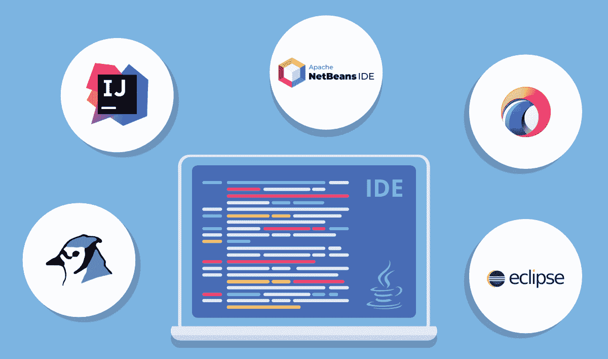
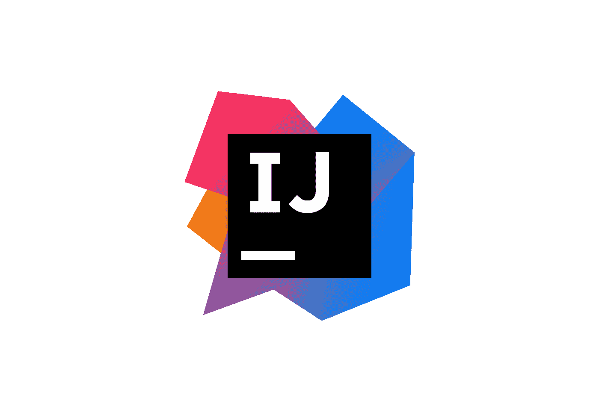
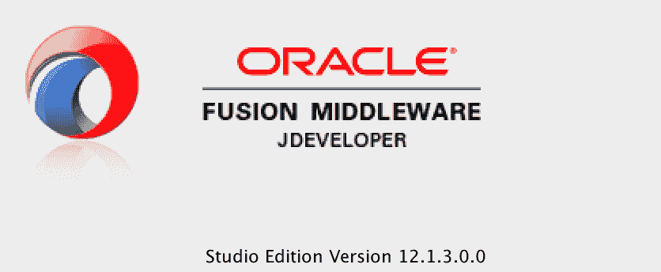

# 2021–22 年将开发的 8 个精彩 Java IDEs

> 原文：<https://medium.com/javarevisited/8-wonderful-java-ides-to-exploit-in-2021-22-942d4d0ab3fd?source=collection_archive---------1----------------------->

[图像来源](https://www.geeksforgeeks.org/what-will-be-the-best-java-ides-in-2020/)

Java 无需介绍；世世代代都知道。此外，它是创建健壮的 web 和独立应用程序的最流行的编程语言。Java 开发人员是世界上最受欢迎的项目程序员之一，这意味着永远都需要他们！然而，有这么多的 ide 可供选择，很难知道哪一个适合您的需要。

在本帖中，我们将收集 2021 年要考虑的不同最佳 Java IDE 的见解，并帮助您决定哪一个最适合您。

## **1。** [**月食**](https://www.eclipse.org/downloads/)

[图像来源](https://www.iri.com/blog/iri/business/brief-history-of-eclipse/)

Eclipse 是最流行的 Java 开发 IDE。它背后有一个庞大的社区。最重要的是，Eclipse 是免费下载的，所以您可以在决定是否要购买许可证之前进行试验。

而且，不仅仅是[Java](/javarevisited/top-5-java-online-courses-for-beginners-best-of-lot-1e1e240a758)；它支持多种编程语言，并适合定制编译器。有了它，建模、测试和制图等过程变得更加容易。

Eclipse 是一个跨平台的 IDE，这意味着它可以在任何操作系统上工作。最棒的是，Eclipse 内置了用于[调试](https://javarevisited.blogspot.com/2011/07/java-debugging-tutorial-example-tips.html#axzz6bYzaddcE)和分析代码的工具，以确保线程尽可能平稳地运行！

Eclipse 最棒的部分之一是它有大量可供下载的插件。该平台可以让您访问从数据可视化工具到重构和调试代码的所有内容！网上也有大量的教程，这意味着如果你遇到困难或者需要帮助来弄清楚一些东西是如何工作的。

## **为什么选择？**

*   提供运行时核心
*   轻松的 [Git](/javarevisited/11-best-online-places-to-learn-git-for-beginners-in-2021-6dc2b7c6ef48?source=---8-d3a191ac6ed-----0-1-----------------10-----) 和 [Apache Maven](/javarevisited/6-best-maven-courses-for-beginners-in-2020-23ea3cba89) 集成
*   编辑、浏览、调试和重构功能
*   定制编译器
*   安装插件的市场
*   代码完成

***价格:*** *免费*

## **#2。**[**NetBeans**](https://netbeans.apache.org/)

[图像来源](https://cwiki.apache.org/confluence/display/NETBEANS/NetBeans+Logo)

NetBeans 是十年来另一个流行的 **Java 集成开发环境** (IDE)，它是一个开源的说服工具，具有令人难以置信的功能，使开发人员能够为桌面、移动和 web 开发多个应用程序。

NetBeans 有各种内置工具，允许 Java 程序员轻松构建代码。

使用这个健壮的 IDE 平台，您可以在 [**Java 应用程序开发**](https://www.valuecoders.com/java-web-application-development-company?utm_source=medium-javaide&utm_medium=d7) 中实现轻松快捷。此外，它有许多扩展，使您能够使用其他编程语言，如 [C](/javarevisited/9-free-c-programming-courses-for-beginners-2486dff74065) 、 [C++](/javarevisited/10-best-c-and-c-programming-books-for-beginners-and-experienced-programmers-eb5ee8dbdc5a) 、 [PHP](/javarevisited/10-best-php-courses-for-beginners-and-experienced-developers-db18057a814f) 、 [JavaScript](/javarevisited/my-favorite-free-tutorials-and-courses-to-learn-javascript-8f4d0a71faf2) 、 [HTML](/javarevisited/10-best-html-and-css-courses-for-beginners-in-2021-6757eec00032) 等等。

总之，它可以在 Linux、Solaris、macOS 和 windows 上运行。此外，它的重构和调试工具提供了准确性和无与伦比的效率。

## **为什么选择？**

*   并排代码比较
*   更简单的插件环境
*   [*项目管理工具*](/javarevisited/10-best-project-management-courses-to-learn-online-f3e15802fe86)
*   脚本编写模板
*   源代码分析有助于增强代码
*   有 28 种语言版本
*   延伸到移动使用
*   Maven 支持

***价格:*** *免费*

## **#3。** [**BlueJ**](https://bluej.org/)

BlueJ 没有其他 ide 那么受欢迎；然而，被大量的 Java 程序员使用。该平台对 Java 编码是免费的，并使开发者能够创建微型软件解决方案。

该平台由英国肯特大学和澳大利亚迪肯大学设计，主要目的是用于学术研究。这个平台有一个教学视角和一个完全不同的基本设计，让 OOPs 程序员受益。

因此，设计界面使学员和初学者能够无障碍地使用平台。此外，应用程序的可视化格式有助于初学者理解 [OOPs 元素](https://javarevisited.blogspot.com/2020/05/object-oriented-programming-questions-answers.html)的概念，比如在 BlueJ 上用图形表示的组件和类。

## **为什么选择？**

*   直接调用 Java 表达式的无缝 GUI 能力
*   物体间的相互作用
*   显示项目的 UML 图表

***价格:*** *免费*

## **#4。**[**IntelliJ IDEA**](https://www.jetbrains.com/idea/)

[图片来源](https://dwglogo.com/intellij-idea/)

作为最好的 Java IDEs 之一，IntelliJ 迎合了人体工程学的特点，提高了工作效率，而且你也不需要在用户界面上妥协。该平台包括许多工具，通过智能完成、数据流分析、跨语言重构和语言插入来实现无缝编程。

IntelliJ 的两个版本:Apache 2，licensed [IntelliJ IDEA](/javarevisited/7-best-courses-to-learn-intellij-idea-for-beginners-and-experienced-java-programmers-2e9aa9bb0c05) 是最受欢迎的 Java IDE，为开发人员提供了难以置信的生产力。此外，该平台支持诸如 [Java](/javarevisited/5-best-core-java-books-for-beginners-20e3f723e3a) 、 [Scala](/javarevisited/10-best-scala-and-functional-programming-online-courses-for-beginners-b6461b27bf) 、 [Groovy](/javarevisited/6-best-resources-to-learn-groovy-and-grails-for-java-developers-18c04e88fa8a) 、 [Kotlin](/javarevisited/top-5-courses-to-learn-kotlin-in-2020-dfc3fa7706d8) 等语言。总之对于[**java web 开发**](https://www.valuecoders.com/blog/technology-and-apps/java-web-development-technologies/?utm_source=medium-javaide&utm_medium=d7) 和创建企业解决方案来说是一个不可思议的解决方案。

总之，它自动化了乏味的开发工作。它还提供了一个内置的开发工具，用于单元测试、代码完成、调试、代码重构、代码检查等等。此外，框架还支持 JPQL、 [SQL](/javarevisited/top-10-free-courses-to-learn-microsoft-sql-server-and-oracle-database-in-2020-6708afcf4ad7) 、 [JavaScript](https://www.java67.com/2019/01/best-websites-to-learn-javascript-online.html) 和 [HTML](/javarevisited/top-10-free-courses-to-learn-html-5-css-3-and-web-development-872d62d97a97) 。

## **为什么选择？**

*   强大的定制功能
*   启用对基于 JVM 的编程语言的支持，如 [Kotlin](/javarevisited/7-free-courses-to-learn-kotlin-in-2020-327c3872c1e1?source=collection_home---4------2-----------------------)
*   强大的插件和集成支持
*   [Gradle](/javarevisited/5-best-gradle-courses-and-books-to-learn-in-2021-93f49ce8ff8e) 构建系统
*   多种编程语言支持
*   内置版本控制支持
*   强大的编译器

***价格:*** *免费社区版，旗舰版每月 49.90 美元*

## **#5。**[**JDeveloper**](https://www.oracle.com/application-development/technologies/jdeveloper.html)

[图像来源](https://blogs.oracle.com/jdeveloperpm/oracle-jdeveloper-and-oracle-adf-1213-are-here)

您可能很少听说过 JDeveloper，但它是 Oracle 提供的免费 IDE。该平台由许多编程语言的应用程序开发特性组成，包括 [XML](https://javarevisited.blogspot.com/2011/12/parse-xml-file-in-java-example-tutorial.html) 、 [SQL](https://javarevisited.blogspot.com/2015/06/5-websites-to-learn-sql-online-for-free.html) 、 [PHP](/javarevisited/top-10-free-courses-to-learn-php-and-mysql-for-web-development-e96e69982675) 、 [JavaScript](/javarevisited/5-best-javascript-books-for-beginners-and-experienced-web-developers-2c6353d1cc85?source=social.tw) 等等。

它涵盖了应用程序开发的整个周期，包括编码、设计、优化、概要分析、调试和部署。此外，它提供了可视化和声明性的编辑器，直接从编码环境中提供应用程序编辑。

此外，公司提供的 Oracle 应用开发框架也简化了开发。对于一个 [**Java 开发公司**](https://www.valuecoders.com/hire-developers/hire-java-developers?utm_source=medium-javaide&utm_medium=d7) 来说，集成开发环境是极乐之源。

## **为什么选择？**

*   敏捷开发和软件版本组件的强大融合
*   可视化 HTML 5 编辑器
*   整个生命周期管理
*   无缝执行 [SQL 查询](https://www.java67.com/2013/04/10-frequently-asked-sql-query-interview-questions-answers-database.html)的能力
*   与数据库的可靠连接

***价格:*** *免费*

## **#6。J** [**把握**](https://www.jgrasp.org/)

[图像来源](https://aspiringcoders.com/java-ides/)

作为一个令人难以置信的轻量级 Java IDE，jGRASP 提供了一个集成的调试器和工作台来简化应用程序开发。此外，它使开发人员能够生成复杂性剖面图和 [UML 类图](/javarevisited/5-best-uml-books-and-courses-for-java-programmers-13c551a9235d)来衡量性能。

开发该系统的主要目的是实现软件可视化的自动化，提高软件的集成开发环境。它还能够在运行时创建源代码和数据结构的静态可视化。

jGRASP 是其他非 java 语言的基本源代码编辑器，使其能够与各种免费和商业编译器一起工作，用于各种编程语言。

## **为什么选择？**

*   自动生成软件可视化
*   易于学习并提供可靠的文档
*   对非 Java 语言有用的源代码编辑器
*   为 Junit 提供插件，检查风格，查找 bug 等。

***价格:*** *免费*

## **#7。** [**绿脚**](https://www.greenfoot.org/door)

[图像来源](https://solaceinfotech.com/blog/top-10-java-ide-you-must-know-in-2020/)

开发 Greenfoot 的最初目的是教育高中生和本科生，但后来证明它是二维图形应用程序的 Java 应用程序开发的关键平台。此外，它还可以用来开发模拟和互动游戏。

该平台由 Oracle 支持，提供动画图形和声音。开发平台的交互设计是为了说明 [OOPs 编程](/swlh/5-free-object-oriented-programming-online-courses-for-programmers-156afd0a3a73)的基本抽象和概念。

此外，创建这个 Java 框架的另一个重要意图是为年轻开发者简化 Java 编程。

这个 Java 框架对初学者和有经验的开发人员都很有吸引力，可以让他们进行在线交互。雇佣 Java 开发人员的公司正在寻找一个了解绿色技能的人。

## **为什么选择？**

*   强大的在线社区
*   最好找到并替换
*   全球互动体验
*   范围突出显示
*   简单易学
*   新导航视图

***价格:*** *免费*

## **#8。**[**JCreator**](http://www.jcreator.com/)

[图像来源](https://aspiringcoders.com/java-ides/)

它是另一个轻量级的 Java 框架，提供了最简单的可视化界面，就像 Microsoft Visual Studio 一样。该平台小巧的尺寸和更高的速度使其成为最吸引每个 Java 初学者的平台。

该平台包括三个版本:专业版，生活专业版，和精简版。而且已经建立在 [C++](/javarevisited/top-10-courses-to-learn-c-for-beginners-best-and-free-4afc262a544e) 之上，也就是说没有 JRE 来执行 Java 代码，你根本不需要。凭借非常直观的用户界面、代码完成、语法高亮、向导和项目模板等特性，它在年轻开发人员中广受欢迎。

它有潜力为多个项目处理各种 JDK 配置文件，并提供帮助开发人员的 API 指南。如果您想确保使用 Java 轻松开发应用程序，那么您应该为微型项目和简单的解决方案设计选择这个 IDE。

## **为什么选择？**

*   付费版有 Ant 支持
*   工作空间结构
*   源代码导航
*   运行时配置
*   集成的 CVS JDK 工具
*   自动缩进

***价格:*** *Pro 版售价 79 美元*

## **包装**

给定的 Java 集成开发环境是可靠的，并且为 java web 开发提供了便利。这就是为什么每个 java web 开发公司都在使用这两种平台。如果您想开发一个无缝的、高性能的、轻量级的应用程序，您可以选择其中的任何一个。

然而，您必须对您的应用程序开发需求进行简要分析，以选择正确的 Java IDE 来确保轻松的应用程序开发。