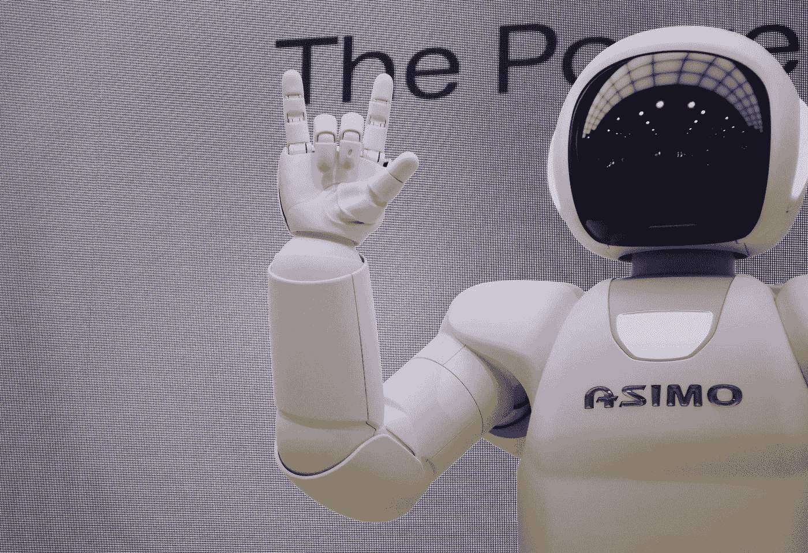

# ChatGPT 的 9 件趣事

> 原文：<https://medium.com/javarevisited/9-cool-things-to-do-with-chatgpt-bf6d64e146dc?source=collection_archive---------0----------------------->

[附身摄影](https://unsplash.com/@possessedphotography?utm_source=medium&utm_medium=referral)在 [Unsplash](https://unsplash.com?utm_source=medium&utm_medium=referral) 上拍照

11 月 30 日，OpenAI 研究实验室发布了 ChatGPT，这是一款在你的浏览器中运行的[聊天机器人](/javarevisited/5-best-dialogflow-and-chatbots-courses-to-learn-in-2021-14ce2e85090d)，类似于你在网站上看到的提供客户支持聊天的机器人。

ChatGPT i 由 GPT-3.5 系列模型提供支持，这些模型使用 Azure AI 超级计算基础设施上的文本和代码数据进行训练。人工智能的能力已经得到增强，可以处理奇怪的、技术性的、抽象的或具体的…