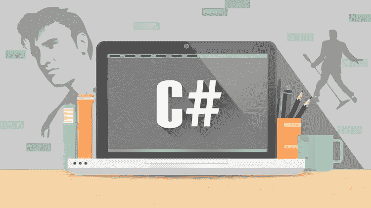
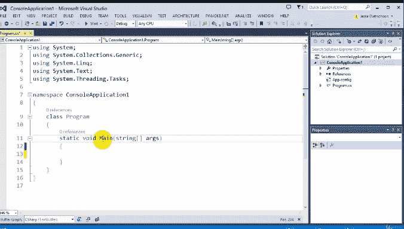
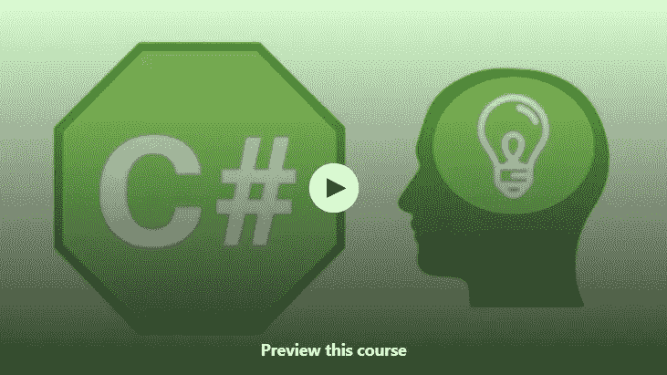
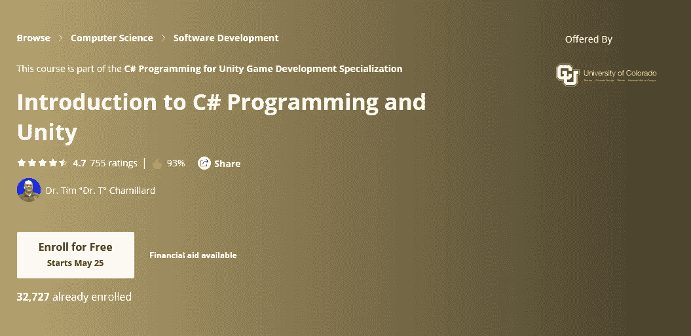
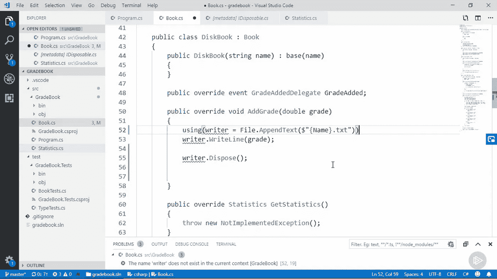
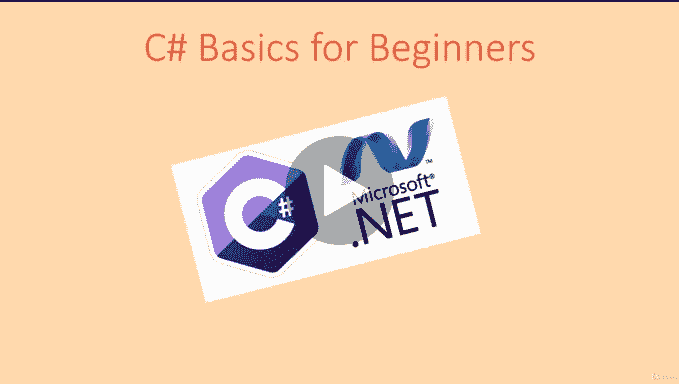
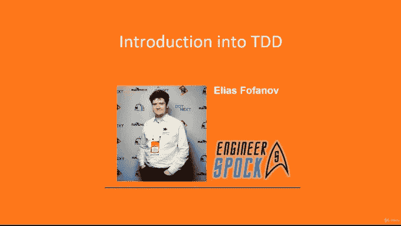
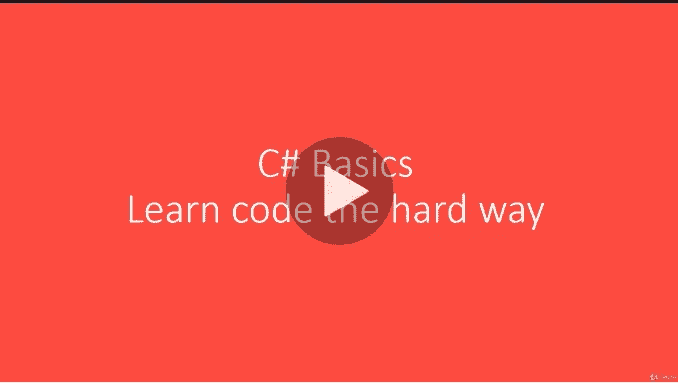

# 9 个面向初学者和中级程序员的免费 C# (C-Sharp)课程和教程——最好的

> 原文：<https://medium.com/javarevisited/9-free-c-c-sharp-courses-and-tutorials-for-beginners-and-intermediate-programmers-best-of-lot-dc8c793aab31?source=collection_archive---------0----------------------->

很多人低估了 C#的强大，在谈到编程语言时，从来没有给予它很高的评价。尽管如此，事实是 C#是当今世界最流行的编程语言之一，在 StackOverFlow 过去几年的开发者调查中，仅次于 [JavaScript](https://javarevisited.blogspot.com/2018/06/top-10-courses-to-learn-javascript-in.html) 、 [SQL](https://javarevisited.blogspot.com/2018/05/top-5-sql-and-database-courses-to-learn-online.html) 和 [Java](https://javarevisited.blogspot.com/2018/05/top-5-java-courses-for-beginners-to-learn-online.html) 。

有经验的 C#开发人员有很多工作和机会。对于使用微软技术(如 Windows 和 SQL Server)的开发人员来说，它是一种至关重要的语言。

它也是开发桌面 GUI 最流行的编程语言之一，在过去几年中完全超过了 Java Swing。我见过许多大的投资银行在 GUI 开发工作中从 Swing 转向 C#。

C#也因为 [Unity](https://javarevisited.blogspot.com/2019/03/5-free-game-development-courses-unity-corona-libgdx-java.html) 而在游戏开发上很大，Unity 是当今游戏界最流行的游戏引擎。如果你不知道 Unity 是什么，它是由 Unity Technologies 开发的跨平台游戏引擎，用于为 PC、游戏机、移动设备和网站创建视频游戏。

超过三分之一的顶级游戏是使用 Unity 制作的，使用 Unity 游戏引擎制作的游戏有数百万活跃用户。Unity 也用于 VR，90%的三星 Gear 和 53%的 Oculus Rift VR 游戏都是使用 Unity 开发的。

C#也是[的一部分。NET](https://javarevisited.blogspot.com/2019/10/top-5-courses-to-learn-asp-net-in-2019.html) ，所以它在 web 开发和应用程序中与 ASP 等语言一起使用，特别是在 Windows 8 和 10 平台上。

顺便说一句，如果你不介意为你的学习投入一些钱，那么我也建议你加入 Udemy 上 Mosh Hamedani 的 [**C#初学者基础:通过编码课程学习 C#基础**](https://click.linksynergy.com/deeplink?id=JVFxdTr9V80&mid=39197&murl=https%3A%2F%2Fwww.udemy.com%2Fcourse%2Fcsharp-tutorial-for-beginners%2F) 。

 [## C#基础入门教程通过编码学习 C#基础

### 拥有超过 50，000 名快乐的学生和 15，000+积极的评论，这门课程是 Udemy 最受欢迎的学习课程…

click.linksynergy.com](https://click.linksynergy.com/deeplink?id=JVFxdTr9V80&mid=39197&murl=https%3A%2F%2Fwww.udemy.com%2Fcourse%2Fcsharp-tutorial-for-beginners%2F) 

有这么多的提示、例子、练习，是学习 C#最好的课程之一。你只需花 9.99 美元就可以在不时发生的疯狂的 Udemy 销售上获得这门课程。

# 面向程序员的 10 大免费 C-Sharp 教程、课程和教程

所以，这些只是我认为 C#是一门好语言的一些原因，主要是如果你对游戏开发和 GUI 开发感兴趣的话。如果这些领域让你兴奋，并且你想学习 C#，这里有几个**免费的 C-sharp 教程和课程**你可以加入开始你的旅程。

## 1.[编程基础:理解 C#](https://click.linksynergy.com/deeplink?id=JVFxdTr9V80&mid=39197&murl=https%3A%2F%2Fwww.udemy.com%2Fcourse%2Funderstandingc%2F)

这是一个全面的，10 多个小时的免费课程，从零开始学习 C+。由 Jesse Dietrichson 创建的这个课程是为没有编程经验的人设计的。

你将学习如何使用 Microsoft Visual C#编写计算机程序。本课程的主题是精心挑选的，旨在为所有新程序员打下坚实的基础。

是什么让这门课程比其他课程更好？由于授课的设计，本课程比其他课程更好。复杂的话题用任何人都能理解的方式解释。

讲师开始是一个自学成才的程序员，知道新程序员在哪里犯错误和困惑。本课程中的所有主题都有导师帮助他取得成功的个人提示和技巧。

**这里是免费报名这门课的链接—** [**编程基础:理解 C#**](https://click.linksynergy.com/deeplink?id=JVFxdTr9V80&mid=39197&murl=https%3A%2F%2Fwww.udemy.com%2Fcourse%2Funderstandingc%2F)

## 2.[c#面向对象编程基础](https://click.linksynergy.com/deeplink?id=JVFxdTr9V80&mid=39197&murl=https%3A%2F%2Fwww.udemy.com%2Fbasics-of-object-oriented-programming-with-csharp%2F)【Udemy】

这是另一门从头开始学习 C#编程的免费课程。这个课程也很短而且切题，这意味着你不会感到无聊，你可能一次就能完成课程。例如，你将学习如何使用 C#创建类、对象，如何使用抽象、封装、多态、继承和其他面向对象的编程概念。

如果你不知道，C#是一种面向对象的编程语言，很像 [Java](http://www.java67.com/2018/08/top-10-free-java-courses-for-beginners-experienced-developers.html) 和 [C++](http://www.java67.com/2018/02/5-free-cpp-courses-to-learn-programming.html) ，本课程将教你使用 C#进行 [OOP](http://www.java67.com/2015/12/top-30-oops-concept-interview-questions-answers-java.html) 的基础知识。

**这里是免费加入本课程的链接—**[c#面向对象编程基础](https://click.linksynergy.com/deeplink?id=JVFxdTr9V80&mid=39197&murl=https%3A%2F%2Fwww.udemy.com%2Fbasics-of-object-oriented-programming-with-csharp%2F)

## 3.[c#编程与 Unity 简介](https://coursera.pxf.io/c/3294490/1164545/14726?u=https%3A%2F%2Fwww.coursera.org%2Flearn%2Fintroduction-programming-unity)【Coursera】

这是由 Tim Chamillard 博士(又名 t 博士)指导，由科罗拉多大学提供的从 Coursera 学习 C#的优秀课程之一。

这门课程是 Unity 游戏开发专业 **的 [**C#编程的一部分，但是**像许多其他 Coursera 课程一样，如果你只是想学习，这个专业的所有课程也是免费审核的，但是如果你希望获得认证，你也需要付费。

本课程的主要目标是教你如何在 Windows 或 Mac 上使用 C#编程语言和](https://coursera.pxf.io/c/3294490/1164545/14726?u=https%3A%2F%2Fwww.coursera.org%2Fspecializations%2Fprogramming-unity-game-development) [Unity 游戏引擎](https://javarevisited.blogspot.com/2019/03/5-free-game-development-courses-unity-corona-libgdx-java.html)开发游戏，但你也可以用它来学习 C#编程。**

**这里是免费加入本课程的链接—**[c#编程和 Unity 简介](https://click.linksynergy.com/deeplink?id=JVFxdTr9V80&mid=40328&murl=https%3A%2F%2Fwww.coursera.org%2Flearn%2Fintroduction-programming-unity)

如果你从未做过任何[编码](/javarevisited/top-20-sites-to-learn-coding-in-2020-f57ff63d9cb3)，那么这个在线课程对你来说会很方便。讲课引人入胜，讲师非常热情，课堂节奏很快，这意味着你在观看那些课程时不会感到无聊。

总体来说，学习 C#编程的一门优秀的[课程](https://javarevisited.blogspot.com/2019/11/top-5-courses-to-learn-c-sharp-in.html)。该课程在 14000 名学生中的平均评分为 4.8，这确实令人印象深刻。

顺便说一句，如果你觉得 Coursera 的课程有用，因为它们是由知名公司如**谷歌**、 **IBM** 、**亚马逊**和世界上最好的大学创建的，我建议你加入 Coursera 的年度订阅计划**。**

**这种单次订阅可以让你无限制地访问他们最受欢迎的**课程**、**专业**、**专业证书**和**指导项目**。它每年花费大约 399 美元，但是它完全物有所值，因为你可以获得无限证书。**

** [## Coursera Plus |无限制访问 7，000 多门在线课程

### 用 Coursera Plus 投资你的职业目标。无限制访问 90%以上的课程、项目…

coursera.pxf.io](https://coursera.pxf.io/c/3294490/1164545/14726?u=https%3A%2F%2Fwww.coursera.org%2Fcourseraplus)** 

## **4. [C#基础](https://pluralsight.pxf.io/c/1193463/424552/7490?u=https%3A%2F%2Fwww.pluralsight.com%2Fcourses%2Fcsharp-fundamentals-csharp5)**

**这是学习 C#最受欢迎和最全面的课程之一，由热门讲师 Scott Allen 在 Pluralsight 上讲授。本课程将教你成为一名高效的 C#开发人员所需的一切。NET 平台，并涵盖了 C#的语法(类似于 [Java](https://javarevisited.blogspot.com/2017/11/top-5-free-java-courses-for-beginners.html) 、 [JavaScript](http://www.java67.com/2018/04/top-5-free-javascript-courses-to-learn.html) 和 [C++](https://javarevisited.blogspot.com/2011/06/top-programming-interview-questions.html) )、C#中的类和对象、类型和程序集等内容。

你还将学习如何使用 Visual Studio，它是 C#开发人员的强大集成开发环境之一，也是面向对象的编程范例。

一旦完成课程，你应该对在自己的应用中读写 C#代码有信心。我向所有认真学习 C#的人强烈推荐这门课程。**

****下面是加入这个的链接—** [**C#基础**](https://pluralsight.pxf.io/c/1193463/424552/7490?u=https%3A%2F%2Fwww.pluralsight.com%2Fcourses%2Fcsharp-fundamentals-csharp5)**

****

**不过，你需要一个 [Pluralsight 会员](https://pluralsight.pxf.io/c/1193463/424552/7490?u=https%3A%2F%2Fwww.pluralsight.com%2Flearn)才能进入这个课程，费用大约是每月 29 美元或每年 299 美元(嗯，我是在他们最后一次推广时花 199 美元买的)。**

**这乍一看似乎有点贵，但非常值得，因为它提供了访问 Pluralsight 上超过 [5000+在线课程的机会，您可以用它来学习任何最新的技术。](/javarevisited/7000-free-pluralsight-courses-to-build-in-demand-tech-skills-without-leaving-your-house-40edb50a8cf2)**

**我是 Pluralsight 会员，如果你能在一年内为你的学习投入那么多钱，我也建议你加入它。无论如何，即使你没有 Pluralsight 会员资格，你仍然可以通过注册 [**10 天免费试用**](http://pluralsight.pxf.io/c/1193463/424552/7490?u=https%3A%2F%2Fwww.pluralsight.com%2Flearn) 来免费访问该课程，该课程提供 200 分钟的所有课程。**

** [## 对个人来说

### Pluralsight 帮助个人学习者获得掌握最新软件开发所需的技术技能…

pluralsight.pxf.io](http://pluralsight.pxf.io/c/1193463/424552/7490?u=https%3A%2F%2Fwww.pluralsight.com%2Flearn)** 

## **5.[编程基础——初学者 C#基础](https://click.linksynergy.com/deeplink?id=JVFxdTr9V80&mid=39197&murl=https%3A%2F%2Fwww.udemy.com%2Fcourse%2Fprogramming-fundamentals-the-basics-with-c-for-beginners%2F)**

**这是另一个在 Udemy 上学习 C#的免费课程。由 Tod Vachev 创建，这门课程将教你 C#编程语言背后的理论和实践。**

**你还会发现许多例子和项目来实践我们所学的东西，不会遗漏任何东西。在每一部分的最后，将会有一个小测验来测试你该部分的一些棘手的部分。**

**还提供了练习，以便您可以尝试自己编写代码，其中大部分不会在课程中解决，但您会不时得到如何解决一些难题的提示。**

**如果你在任何地方遇到困难，你都可以在课程的 QnA 部分提出问题。**

****这里是免费加入本课程的链接——**[编程基础——初学者 C#基础](https://click.linksynergy.com/deeplink?id=JVFxdTr9V80&mid=39197&murl=https%3A%2F%2Fwww.udemy.com%2Fcourse%2Fprogramming-fundamentals-the-basics-with-c-for-beginners%2F)**

****

## **6. [C#从初学者到专业人员—编写一个 WindowsUI 风格的应用程序表单](https://click.linksynergy.com/deeplink?id=JVFxdTr9V80&mid=39197&murl=https%3A%2F%2Fwww.udemy.com%2Fcourse%2Fc-from-beginner-to-pro-build-a-windowsui-app-in-winforms%2F)**

**这是另一个免费学习 C#的动手和基于项目的课程。由 Cindy Oakes 创建的这个 *7 个半小时长的课程*将教你关于用 C#开发 GUI 所需要知道的一切。**

**本课程涵盖以下主题:**

1.  **C#中的面向对象编程**
2.  **C#中的数据结构**
3.  **提高生产率的技巧和诀窍**
4.  **在 Visual Studio 中调试 C#程序**
5.  **在 Winforms 中创建自定义控件**
6.  **用户界面设计和创建自定义事件**

**总的来说，这是一门学习 C#基础知识的好课程。Cindy 声音好听，口音清晰，擅长简化复杂的 C#概念，这让学习变得非常容易。**

****这里是免费加入本课程的链接—** [C#从初学者到专业人士—编写 WindowsUI 风格的应用程序表单](https://click.linksynergy.com/deeplink?id=JVFxdTr9V80&mid=39197&murl=https%3A%2F%2Fwww.udemy.com%2Fcourse%2Fc-from-beginner-to-pro-build-a-windowsui-app-in-winforms%2F)**

****

## **7.[c#中的 TDD 介绍](https://click.linksynergy.com/deeplink?id=JVFxdTr9V80&mid=39197&murl=https%3A%2F%2Fwww.udemy.com%2Fcourse%2Fintro-tdd%2F)**

**TDD 是现代应用程序开发人员的一项重要技能。您可以学习测试驱动的开发，以使您的代码可测试、健壮和可维护，并将单元测试技能带到下一个级别。**

**这个课程是关于使用 C#编程语言和作为单元测试框架的 NUnit 来练习 TDD。在这个过程中，我们将学习与单元测试相关的概念。本课程并未涵盖 **NUnit** 的所有功能。这门课更有趣。**

**学习**单元测试**和 **TDD** 让一个强大且非常有用的工具触手可及。熟悉了单元测试和 TDD 之后，你就可以写出可靠的、可维护的应用程序，这能让你成为更好的程序员。本课程对初学者和中级 C#开发人员都很有用。**

****这里是免费加入本课程的链接—**[c#中的 TDD 介绍](https://click.linksynergy.com/deeplink?id=JVFxdTr9V80&mid=39197&murl=https%3A%2F%2Fwww.udemy.com%2Fcourse%2Fintro-tdd%2F)**

****

## **8. [C#基础——学习正确的编码方式](https://click.linksynergy.com/deeplink?id=JVFxdTr9V80&mid=39197&murl=https%3A%2F%2Fwww.udemy.com%2Fc-sharp-basics-learn-to-code-the-hard-way%2F)**

**这也是 C#的基础课程之一，它将教你编程的基础，比如数据类型，使用 C#的 OOP 基础，比如类和对象，使用[数组，](http://www.java67.com/2018/02/10-examples-of-array-in-java-tutorial.html)等等。

这门课程的好处在于它非常注重实践，你不仅会学到如何在 C#上编码，还会学到专业 C#开发人员使用的工具，比如微软的 Visual Studio。

它也是完全免费的，这要感谢 [Udemy](http://javarevisited.blogspot.sg/2018/01/top-10-udemy-courses-for-java-and-web-developers.html) 上这门课的讲师 Wasim Hamami。一旦你注册了这个教程，你将终身免费使用。**

****这里是加入这个的链接—** [C#基础知识—学习正确的编码方式](https://click.linksynergy.com/deeplink?id=JVFxdTr9V80&mid=39197&murl=https%3A%2F%2Fwww.udemy.com%2Fc-sharp-basics-learn-to-code-the-hard-way%2F)**

****

**谈到社会证明，这门课程得到了近 12500 名学生的平均 3.9 分，这太棒了。该课程唯一的缺点是它不够全面，只有 1.5 小时的内容涵盖了 C#编程语言的基础。**

## **9.[C # 6 的新特性](https://click.linksynergy.com/deeplink?id=JVFxdTr9V80&mid=39197&murl=https%3A%2F%2Fwww.udemy.com%2Fwhat-is-new-in-csharp-6%2F)**

**这是另一个关于 C#编程语言的短期课程，通过实际例子来学习 C# 6 的新特性。

你将了解 C# 6 的新特性，比如自动属性初始化器、仅支持 getter 的自动属性、表达式体成员、使用[静态](https://javarevisited.blogspot.com/2013/11/difference-between-static-vs-non-static-method-java.html)、空条件操作符、字符串插值、表达式名称、索引初始化器、异常过滤器、await in catch 和 finally 块。

本课程最棒的地方在于，所有功能都用 Visual Studio IDE 中的实用代码示例进行了演示。

**下面是加入这个的链接—**[C # 6 的新特性](https://click.linksynergy.com/deeplink?id=JVFxdTr9V80&mid=39197&murl=https%3A%2F%2Fwww.udemy.com%2Fwhat-is-new-in-csharp-6%2F)**

****

**这门 C#课程不是为初学者开设的，而是为那些对 C#有所了解并想学习 C# 6 版本新特性的程序员开设的。**

**以上是关于在线学习 C#的一些最好的免费课程。这些课程将为你提供成为一名优秀的 C#开发者所需的一切，这对于你用 C#开发的任何东西都是必不可少的，比如桌面图形用户界面、使用 Unity 游戏引擎的游戏，或者使用[的网络应用。NET](https://javarevisited.blogspot.com/2019/10/top-5-courses-to-learn-asp-net-in-2019.html) 框架。

其他**免费编程课程**你可能喜欢**

*   **[2023 年网络开发者路线图](https://javarevisited.blogspot.com/2019/02/the-2019-web-developer-roadmap.html)**
*   **[2023 年 Java Web 开发者应该学习的 10 个框架](http://javarevisited.blogspot.sg/2018/01/10-frameworks-java-and-web-developers-should-learn.html#axzz53Soo0i1a)**
*   **[学习 Python 的十大 Udemy 课程](https://javarevisited.blogspot.com/2020/05/top-10-udemy-courses-to-learn-python-programming.html)**
*   **[2023 年探索 10 种编程语言](http://www.java67.com/2017/12/10-programming-languages-to-learn-in.html)**
*   **[学习 Swift 编程语言的 5 门免费课程](http://www.java67.com/2019/03/5-free-courses-to-learn-swift.html)**
*   **[2023 年 DevOps 开发者路线图](https://javarevisited.blogspot.com/2018/09/the-2018-devops-roadmap-your-guide-to-become-DevOps-Engineer.html)**
*   **[面向程序员和开发人员的十大 Udemy 课程](https://javarevisited.blogspot.com/2019/08/top-10-udemy-courses-and-certifications-for-programmers.html)**
*   **[学习 iOS App 开发的 5 门免费课程](https://javarevisited.blogspot.com/2018/11/5-free-ios-app-development-courses-for.html)**
*   **[面向 Java 程序员的 5 门免费 Spring 框架课程](http://www.java67.com/2017/11/top-5-free-core-spring-mvc-courses-learn-online.html)**
*   **[面向初学者的 5 门免费核心 Java 课程](http://www.java67.com/2017/11/top-5-free-core-spring-mvc-courses-learn-online.html)**
*   **[5 门免费学习机器和深度学习的课程](http://www.java67.com/2019/01/5-free-courses-to-learn-machine-and-deep-learning-in-2019.html)**
*   **[如何在 2023 年成为 React 开发者](https://javarevisited.blogspot.com/2018/10/the-2018-react-developer-roadmap.html)**

**感谢您阅读本文。如果你喜欢这些**免费的 C#课程和教程**，那么请分享给你的朋友和同事。如果您有任何问题或反馈，请留言。

**P.S.** —如果你不介意为一门优秀的课程花费一些钱，那么我也建议你加入 [**使用 C#**](https://click.linksynergy.com/deeplink?id=JVFxdTr9V80&mid=39197&murl=https%3A%2F%2Fwww.udemy.com%2Funitycourse%2F) 的 Unity 游戏开发，因为我个人发现游戏开发是学习编程和培养编码意识的最佳途径。**

** [## C# Unity 开发者 2D 编码:学习视频游戏编码

### 这门课程在 Kickstarter 上获得巨大成功，并成为最受欢迎和最受关注的课程…

udemy.com](https://click.linksynergy.com/deeplink?id=JVFxdTr9V80&mid=39197&murl=https%3A%2F%2Fwww.udemy.com%2Funitycourse%2F)**