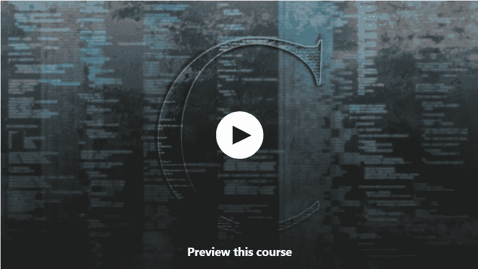
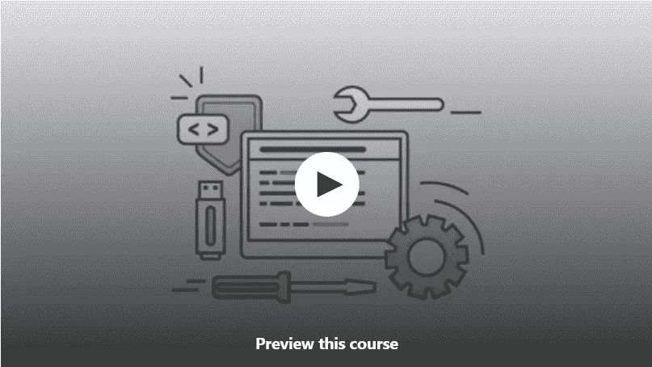
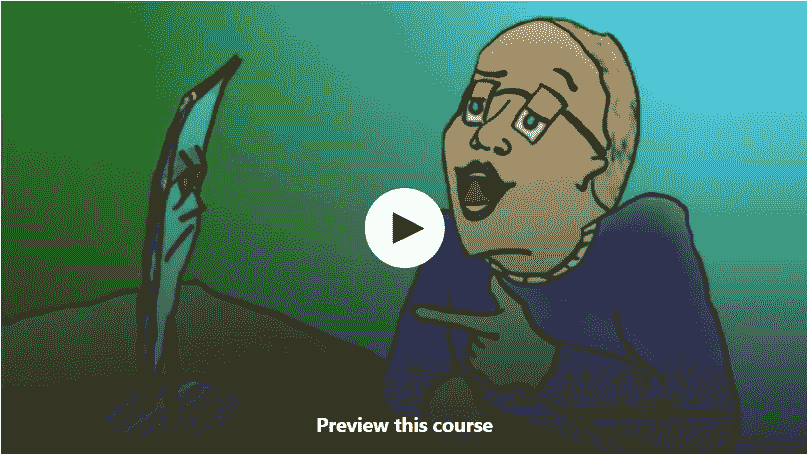
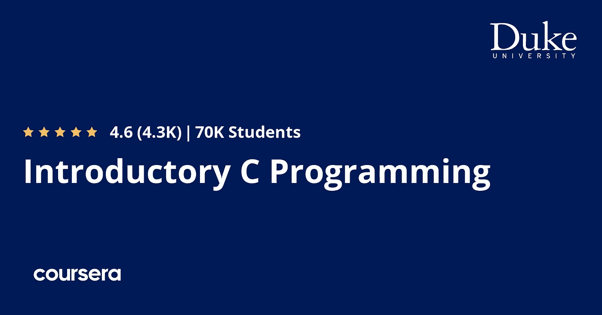
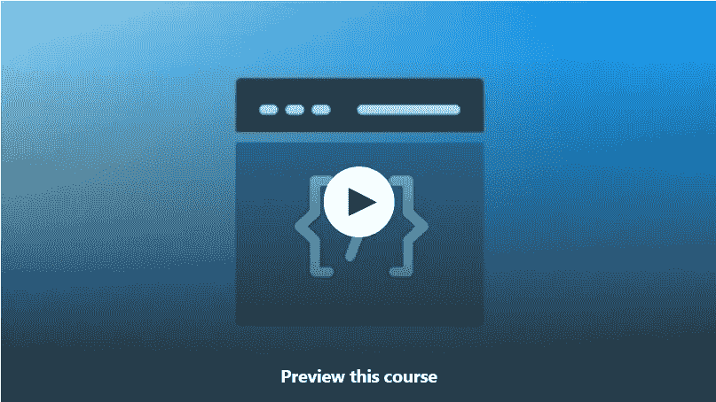
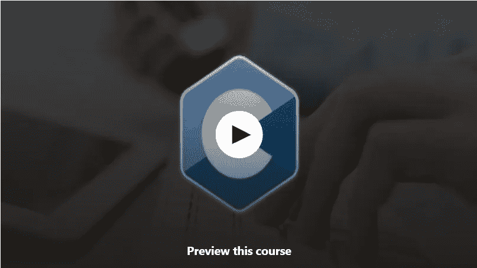
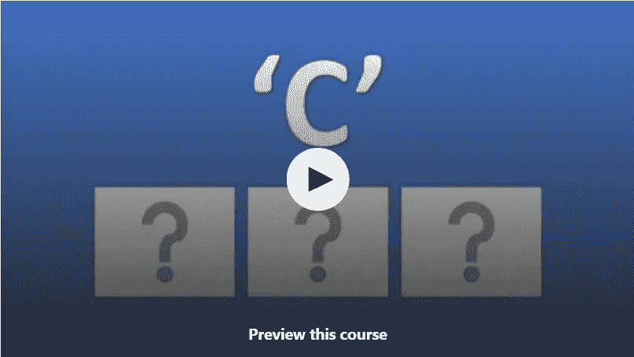
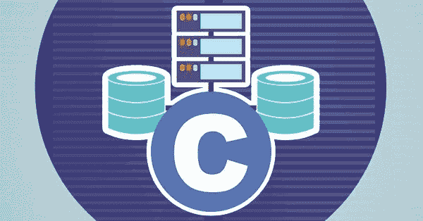

# 2023 年 9 门最佳免费 C 编程初学者课程

> 原文：<https://medium.com/javarevisited/9-free-c-programming-courses-for-beginners-2486dff74065?source=collection_archive---------0----------------------->

## 我最喜欢的 2023 年用 C 编程语言学习编码的免费在线课程来自 Udemy，Coursera，Educative 等网站。

image_credit — Udemy

大家好，如果你想学习 C 编程语言并寻找免费的在线课程，那么你来对地方了。以前我分享过 [**最好的 C 编程课程**](/javarevisited/10-best-c-programming-courses-for-beginners-2c2c1f6bcb12) 和[**顶级 C++课程**](/javarevisited/top-10-courses-to-learn-c-for-beginners-best-and-free-4afc262a544e) 今天我要分享的是初学者最好的免费 C 编程课程。

c 语言是世界上最具扩展性的编程语言之一。它用于创建操作系统和嵌入式应用程序。

随着面向对象编程的日益流行，C 正在迅速被 C++取代，C ++是 C 语言的一个超集，它使用了一套完全不同的编程概念，但两者的基础是相同的。

即使在 50 年的 C 编程之后，对具有良好 C 编程技能的程序员的需求仍然很大，我强烈建议程序员学习 C 并开始用 C 编程。

正如我之前所说，如果你想在 2023 年**从头开始学习 C 编程**并寻找免费的在线培训课程，那么你来对地方了。

在这里，我要分享 *5 门最好的免费在线课程，供初学者学习 C 编程*。这些课程是从像 [Udemy](https://javarevisited.blogspot.com/2020/05/top-10-udemy-courses-to-learn-python-programming.html) 、 [Coursera](https://javarevisited.blogspot.com/2020/02/10-best-coursera-courses--for-python.html) 和 [Educative](https://javarevisited.blogspot.com/2020/05/top-10-educative-courses-for-programmers.html) 这样的网站上收集的，这些网站提供互动学习，不需要你设置任何开发环境，类似于 [Codecademy](https://bit.ly/codecademyhome) 。这真的可以加速你的学习。

正如我说过的， [C](https://javarevisited.blogspot.com/2019/11/top-5-courses-to-learn-c-programming-in.html) 是一种非常棒的语言，如果你还没有编程过任何东西，它可以帮助你开始编程，但也是扩展你已经知道的知识的非常好的知识。这种语言通常用于低层程序，有时非常接近汇编语言，几乎就是机器码。

大多数内核(操作系统的地下部分，其功能是在硬件和软件之间进行通信)都是用 c 开发的，例如 Windows、Linux、Mac 或移动操作系统，如 [Android](/hackernoon/top-5-courses-to-learn-android-for-java-programmers-667e03d995b4) 或 [iOS](/javarevisited/top-5-online-courses-to-learn-ios-12-swift-in-2019-a35ae1be7b2b) 。

如果你有兴趣*学习 C 语言*，这里有一份*九大免费在线 C 语言编程课程的清单*，你可以从中了解如何用这种语言编程。顺便说一句，如果你负担得起，我也强烈推荐你去看看由 Tim Buchalaka 和他的团队在 Udemy 上举办的 C 编程大师班，这是初学者学习 C 编程的最佳课程之一，而且价格也很实惠，你可以在 Udemy 上花 10 美元购买。

 [## C 编程初学者-掌握 C 语言

### 你以前从来没有编写过计算机程序，并且认为或被告知 C 是一种很好的编程语言吗？

udemy.com](https://click.linksynergy.com/deeplink?id=JVFxdTr9V80&mid=39197&murl=https%3A%2F%2Fwww.udemy.com%2Fcourse%2Fc-programming-for-beginners-%2F) 

# Udemy Coursera 为初学者提供的 9 门最佳免费 C 编程课程

在不浪费你更多时间的情况下，这里列出了 2023 年你可以参加的从零开始学习 C 编程的最好的免费在线课程。这些课程是完全免费的，可以在流行的在线学习网站上找到，比如 Udemy、Coursera、freeCodeCamp 和 Educative。

## 1. [C 编程:掌握基础！](https://click.linksynergy.com/deeplink?id=JVFxdTr9V80&mid=39197&murl=https%3A%2F%2Fwww.udemy.com%2Fcourse%2Fc-programming-2019-master-the-basics%2F)【Udemy 免费教程】

这是一个免费的学习 C 编程的 Udemy 课程，它是为了让初学者记住你而创建的。你将学会使用 C 编程语言以一种容易、简单和有效的方式编码，在我看来，C 编程语言是学习编码和编程的最佳语言。

本课程包括 3 个小时的点播内容，您将学习以下关键技能，开始您的 C 编程之旅:

*   C 语言的基础
*   如何创建用 c 开发的第一个应用程序？
*   了解不同的变量和数据类型
*   如何解决初学编程问题？

这个免费的在线课程是为完全没有编程经验的初学者准备的。本教程包含许多挑战和演示，以真正理解如何在现实世界中编程。一个好的方面是，教师也关注学生，以解决他们可能遇到的一些麻烦。

**这里是加入这个免费的 C 编码课程** — [C 编程:掌握基础！](https://click.linksynergy.com/deeplink?id=JVFxdTr9V80&mid=39197&murl=https%3A%2F%2Fwww.udemy.com%2Fcourse%2Fc-programming-2019-master-the-basics%2F)

## 2.[C 编程快速入门指南](https://click.linksynergy.com/deeplink?id=JVFxdTr9V80&mid=39197&murl=https%3A%2F%2Fwww.udemy.com%2Fcourse%2Fquickstart-guide-c-programming%2F)【Udemy 免费课程】

这是另一个从 Udemy 学习 C 编程的免费课程，它也是由初学者和没有编程经验的人创建的。

这个 3.5 的在线课程集中在 C 编程的本质上，从真正的基础开始。

以下是您将在该计划中学习到的关键技能

*   如何有效地编写 C 程序
*   构建您的代码
*   制作你的程序。
*   如何相应地分配和重新分配内存空间
*   部署和运行您的实时应用
*   对堆栈和队列执行操作。
*   操纵文本
*   条件和循环
*   变量，使用数据

对于任何想在线学习 C 编程并开始编程生涯的人来说，这是一门理想的免费课程。本课程分为 8 个部分，将教授你 C 语言的基础知识，并为你提供一个学习高级 C 语言编程概念的平台。

**这里是免费加入这门 C 课程的链接**——[C 编程快速入门指南](https://click.linksynergy.com/deeplink?id=JVFxdTr9V80&mid=39197&murl=https%3A%2F%2Fwww.udemy.com%2Fcourse%2Fquickstart-guide-c-programming%2F)

## 3. [C 语言程序设计教程—第一部分](https://click.linksynergy.com/deeplink?id=JVFxdTr9V80&mid=39197&murl=https%3A%2F%2Fwww.udemy.com%2Fcourse%2Fc-language-foundations-demystified%2F)【免费课程】

这门课程是为编程新手设计的。其目的是提供 C 语言各种概念的实际编程知识。您将练习的所有代码示例都可以在课程中复习和练习。

你将:获得编写 C 程序的信心，明确 C 编程概念的知识。以下是您将在本课程中探讨的主要话题:

*   创建您的第一个程序
*   了解数据类型和结构
*   制作数组
*   具备处理文件的知识。

还带来了一个额外的附录，学习众多的 [C 程序](https://javarevisited.blogspot.com/2011/06/top-programming-interview-questions.html)。课程时长为 5 个半小时的视频。

**这里是免费加入本课程的链接** — [C 语言编程循序渐进](https://click.linksynergy.com/deeplink?id=JVFxdTr9V80&mid=39197&murl=https%3A%2F%2Fwww.udemy.com%2Fcourse%2Fc-language-foundations-demystified%2F)

## 4.[C 语言编程入门](https://coursera.pxf.io/c/3294490/1164545/14726?u=https%3A%2F%2Fwww.coursera.org%2Fspecializations%2Fc-programming)【Coursera 免费课程】

本课程的重点是为希望通过编写计算机程序解决复杂问题的学习者提供强大的编程基础。

以下是您将在本课程中学到的关键技能:

*   如何用 C 开发
*   阅读并编写 C 代码来理解它
*   运用所学知识创建专业项目。

这将为你从事软件开发或其他计算领域的职业做好准备。

该项目包括一个实践，即编写一个程序，使用蒙特卡洛模拟来计算扑克手牌概率。扑克项目分为三个课程，因此当您获得更高级的技能时，您可以编写程序中更具挑战性的部分。

这里是加入免费 Coursera 课程的链接—[**C 语言编程入门**](https://coursera.pxf.io/c/3294490/1164545/14726?u=https%3A%2F%2Fwww.coursera.org%2Fspecializations%2Fc-programming)

顺便说一句，如果你觉得 Coursera 课程有用，因为它们是由世界各地的知名公司和大学创建的，我建议你加入 [**Coursera Plus**](https://coursera.pxf.io/c/3294490/1164545/14726?u=https%3A%2F%2Fwww.coursera.org%2Fcourseraplus) ，这是一个课程订阅计划，可以访问他们最受欢迎的课程、专业、专业证书和指导项目。它每年花费大约 399 美元，但它完全值得你的钱，因为你可以获得无限的证书。

 [## Coursera Plus |无限制访问 7，000 多门在线课程

### 用 Coursera Plus 投资你的职业目标。无限制访问 90%以上的课程、项目…

coursera.pxf.io](https://coursera.pxf.io/c/3294490/1164545/14726?u=https%3A%2F%2Fwww.coursera.org%2Fcourseraplus) 

## 5.[C 语言编程入门:全教程【免费教程】](https://click.linksynergy.com/deeplink?id=JVFxdTr9V80&mid=39197&murl=https%3A%2F%2Fwww.udemy.com%2Fcourse%2Fget-started-with-programming-in-c-full-course%2F)

这是 Udemy 为初学者提供的另一个学习 C 的免费课程。这个 1.5 小时长的课程将通过常规作业和动手编程练习教你 C 编程。

本课程详细介绍了以下主题:

1.c 编程库

2.编译 C 程序

3.变量

4.数据类型第 1 部分(下一课程的第 2 部分)

5.运算符和操作数

6.接受用户输入

7.If-else 条件

8.一维数组

9.“for”循环

(X)课程项目结束

在本课程结束时，你将会成功地接触到 C 编程语言的基础知识和一般的编程概念。你也可以自己编写许多 C 程序，还可以带一个有趣的游戏回家。

**这里是加入这个免费 C 课程的链接**——[开始用 C 语言编程](https://click.linksynergy.com/deeplink?id=JVFxdTr9V80&mid=39197&murl=https%3A%2F%2Fwww.udemy.com%2Fcourse%2Fget-started-with-programming-in-c-full-course%2F)

## 6. [C 编程训练营:从零开始](https://click.linksynergy.com/deeplink?id=JVFxdTr9V80&mid=39197&murl=https%3A%2F%2Fwww.udemy.com%2Fcourse%2Fc-programming-bootcamp-from-scratch%2F)【免费 Udemy 课程】

这是 Udemy 的又一个全新的从零开始学习 C 编程的免费课程。本课程面向任何想学习编程或选择编程作为职业的人。它涵盖了不同概念的基本实现。

以下是您将在本课程中学到的内容:

*   编码者和非编码者基础。
*   学习逻辑以及如何使用不同的语法和函数来构建解决方案
*   理解 C 语言及其功能

总的来说，这是一个非常棒的免费教程，适合初学 C 语言的开发者和程序员。

**这里是加入这个免费课程的链接**——[C 编程训练营:从零开始](https://click.linksynergy.com/deeplink?id=JVFxdTr9V80&mid=39197&murl=https%3A%2F%2Fwww.udemy.com%2Fcourse%2Fc-programming-bootcamp-from-scratch%2F)

## 7.[‘C’面试问题](https://click.linksynergy.com/deeplink?id=JVFxdTr9V80&mid=39197&murl=https%3A%2F%2Fwww.udemy.com%2Fcourse%2Fc-language-interview-questions%2F)【免费在线课程】

这是一门不同类型的 C 编程课程，它涵盖了任何想破解 C 编程工作面试的人的面试问题。由 Srikanth Pragada 创建的这门课程将向你展示如何在面试中处理 C 类问题。

本课程包含 65 个面试问题及其答案，旨在帮助 C 开发人员获得自信面对“C”面试所需的知识。

它也适用于那些想要评估他们的 C 语言知识并使他们能够识别需要改进的地方的 C 程序员。

总的来说，这是一门很好的课程，学习如何自信地面对与 C 语言编程相关的技术面试

**以下是加入本次 C 面试课程**——[‘C’面试问题](https://click.linksynergy.com/deeplink?id=JVFxdTr9V80&mid=39197&murl=https%3A%2F%2Fwww.udemy.com%2Fcourse%2Fc-language-interview-questions%2F)的链接

## 8.c 编程初学者教程[FreeCodeCamp + Youtube]

这是为初学者学习 C 编程语言的另一个很棒的免费教程。这门 3.45 小时的免费课程将向您全面介绍 C 编程语言的所有核心概念。

你可以在 Youtube 免费代码营频道或者这里观看这个免费课程

## 9.[从零开始学 C 由 Fahim ul Haq](https://www.educative.io/courses/learn-c-from-scratch?affiliate_id=5073518643380224) 【教育性免费课程】

这门广泛的课程总共有 17 个单元，所有的单元都有很好的解释，可以理解所有的内容。它是为那些想了解编程世界的初学者准备的

这里是本课程涉及的重要主题:

*   数据类型
*   控制流
*   功能
*   输入/输出特征
*   记忆
*   汇编
*   如何调试
*   其他一些高级主题

它以一种全面而简洁的方式进行解释，并包括一些练习来练习你在课程中获得的知识。

**这里是加入这个令人敬畏的免费课程的链接**——[从零开始学习 C 语言](https://www.educative.io/courses/learn-c-from-scratch?affiliate_id=5073518643380224)

顺便说一下，Educative 是一个相对较新的学习平台，它不同于 Udemy 和 Coursera，因为它是交互式的和基于文本的。

它与 [Codecademy](https://bit.ly/codecademyhome) 非常相似，也有一个 [**订阅计划**](https://www.educative.io/subscription?affiliate_id=5073518643380224) ，非常实惠，提供 100 多门软件工程课程和面试准备课程。

在他们的年度计划中，费用大约是 14.99 美元/月，我发现这非常划算，因为个别课程的价格大约是 79 美元或 49 美元，这意味着只需几门课程的费用，你就可以访问他们的 100 多门课程。

 [## 教育无限:保持领先

### 我们听到了您的反馈。你现在只需支付一次费用，就可以获得 Educative 上的所有课程。

www.educative.io](https://www.educative.io/subscription?affiliate_id=5073518643380224) 

以上就是 2023 年初学者学习 C 编程的**最佳免费在线课程**。这些都是来自 Udemy，Coursera 和 Educative 的完全免费的课程，我希望在这个列表中增加更多的在线课程。如果你有任何建议，请在评论中留言。我们已经看到，C 是一种非常扩展的语言，用于许多功能。这是一种非常好的开始开发的语言，因为通过学习它，你可以看到编程的许多方面。我认为是所有程序员都应该懂一点的语言。更好地掌握这种编程语言肯定会帮助你成为一名更好的程序员和开发人员。

其他**你可能喜欢的免费编程资源**

*   [5 门免费的数据结构与算法课程](https://javarevisited.blogspot.com/2018/01/top-5-free-data-structure-and-algorithm-courses-java--c-programmers.html)
*   [初学者学习打字稿的 10 门免费课程](/javarevisited/top-10-free-typescript-courses-to-learn-online-best-of-lot-44bce9da41d1)
*   [2023 年学习 Web 开发的前 5 门课程](https://javarevisited.blogspot.com/2018/02/top-5-online-courses-to-learn-web-development.html)
*   [面向程序员和开发人员的 5 门免费 Linux 课程](http://www.java67.com/2018/02/5-free-linux-unix-courses-for-programmers-learn-online.html)
*   [2023 年学习 Kubernetes 的 7 门免费课程](/javarevisited/7-free-online-courses-to-learn-kubernetes-in-2020-3b8a68ec7abc)
*   [2023 年学习 JavaScript 的 12 门免费课程](/javarevisited/12-free-courses-to-learn-javascript-and-es6-for-beginners-and-experienced-developers-aa35874c9a32?source=collection_home---4------0-----------------------)
*   [20 个免费学习编码的网站](/javarevisited/top-20-sites-to-learn-coding-in-2020-f57ff63d9cb3)
*   [面向 Java 开发者的 5 门免费 Spring 框架课程](http://www.java67.com/2017/11/top-5-free-core-spring-mvc-courses-learn-online.html)
*   [2023 年学习 Docker 和 DevOps 的 5 门免费课程](/javarevisited/10-free-courses-to-learn-docker-and-devops-for-frontend-developers-691ac7652cee?source=---------94------------------)
*   [学习大数据和 Apache Spark 的 5 门课程](http://javarevisited.blogspot.com/2017/12/top-5-courses-to-learn-big-data-and.html)
*   [我最喜欢的免费课程学棱角](/javarevisited/10-free-angular-and-react-js-courses-from-udemy-and-coursera-best-of-lot-e67f7d811e6b)
*   [面向 Web 开发人员的十大 JavaScript 教程和课程](https://javarevisited.blogspot.com/2018/06/top-10-courses-to-learn-javascript-in.html)
*   [2023 年学习 Spring Boot 的 5 大课程](https://javarevisited.blogspot.com/2018/05/top-5-courses-to-learn-spring-boot-in.html)
*   [我最喜欢的学习 PHP 和 MySQL 的免费课程](/javarevisited/top-10-free-courses-to-learn-php-and-mysql-for-web-development-e96e69982675)
*   [学习 React JS 框架的 5 门免费课程](http://www.java67.com/2018/02/5-free-react-courses-for-web-developers.html)
*   [2023 年每个 Java 开发人员都应该学习的 10 个工具](https://www.java67.com/2018/04/10-tools-java-developers-should-learn.html)

**P. S.** —如果你负担得起，我也强烈推荐你去看看 Udemy 的这个长达 31 小时的 [**完整 C 编程课程——面向学生的 C 语言**](https://click.linksynergy.com/deeplink?id=JVFxdTr9V80&mid=39197&murl=https%3A%2F%2Fwww.udemy.com%2Fcourse%2Fc-programming-for-beginners-programming-in-c%2F) 课程，它是初学者学习 C 编程的最佳课程之一，而且它也非常实惠，你只需花 10 美元就可以在不时举行的 Udemy 大减价上买到。

 [## 完整的 C 程序设计课程-面向学生的 C 语言

### 我已经在学院做了几年的学术人员，我想这是一个很好的时机，我也会…

udemy.com](https://click.linksynergy.com/deeplink?id=JVFxdTr9V80&mid=39197&murl=https%3A%2F%2Fwww.udemy.com%2Fcourse%2Fc-programming-for-beginners-programming-in-c%2F)