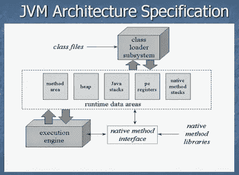
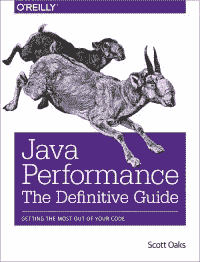
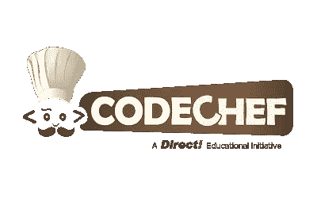

# 2023 年 Java 程序员应该学会的 11 件事

> 原文：<https://medium.com/javarevisited/9-things-java-programmers-should-learn-in-2018-3f0b2207dfc4?source=collection_archive---------0----------------------->

由[弗兰基](https://unsplash.com/@frankieis?utm_source=medium&utm_medium=referral)在 [Unsplash](https://unsplash.com?utm_source=medium&utm_medium=referral) 上创作的“兰开斯特牛奶拿铁艺术杯中的咖啡”

作为一名 Java 开发人员和一个 [Java 博客](http://java67.blogspot.com/)的作者，我经常收到来自世界各地的 Java 程序员的请求，询问他们如何提高自己。

在过去，我已经分享了我的成为一名更好的程序员的 10 个技巧，那篇文章中的每个技巧仍然适用，但是考虑到这是新的一年，我决定为 Java 程序员写下新的技巧，以提高他们自己，增强他们的 Java 编程知识，并增加他们对未来职业发展的价值。

所以不再浪费时间，让我们来看看我的*2023 年 Java 程序员的 11 个学习目标*。你可以从这些想法中获得灵感来创建自己的目标。

顺便说一句，伙计们，在这篇文章中，你不仅会发现要学什么，还会发现我的许多读者经常回来问我，他们如何提高某些技能，从哪里开始，等等。

# 2023 年 Java 开发人员可以学习的 11 件事

这里是我列出的一个有经验的 Java 开发人员应该在 2023 年学习的事情，以成为一个更好的 Java 程序员，并在他们的职业生涯中成长。

## 1.了解 Java 性能调优

在过去的几年里，我参加了超过 50 场针对高级 Java 开发人员的面试，我清楚地看到他们缺乏的一项技能是关于 JVM 内部、GC 行为和 Java 性能调优的知识和理解。

随着您的 Java 经验的增长，您将成为一名拥有超过 5-6 年经验的高级 Java 开发人员，您应该了解 Java 基础知识的大背景和小细节。

如果你不能分析一个应用程序，或者不知道它为什么慢或者如何让它变快，那么你应该读一本关于 JVM 内部和性能调优的好书，例如 Scott Oaks 的畅销书《Java 性能权威指南》。

了解 JVM 内部

我已经读了好几年了，只要有时间，我仍然会参考它。我的目标是今年再读一遍。

如果你更喜欢在线课程而不是书籍，那么我建议你看看 Pluralsight 上的 [**了解 Java 虚拟机**](https://pluralsight.pxf.io/c/1193463/424552/7490?u=https%3A%2F%2Fwww.pluralsight.com%2Fcourses%2Funderstanding-java-vm-memory-management) 系列课程，它解释了内存管理、类加载、安全性和反射。

 [## 了解 Java 虚拟机:内存管理

### 本课程涵盖了 Java 中垃圾收集的所有方面，包括内存如何分成代和…

pluralsight.pxf.io](https://pluralsight.pxf.io/c/1193463/424552/7490?u=https%3A%2F%2Fwww.pluralsight.com%2Fcourses%2Funderstanding-java-vm-memory-management) 

## 2.Docker 和 Kubernetes

你可能听说过围绕 Docker 和 Kubernetes 的讨论以及它对 DevOps 团队的影响。一开始你可能会想，“啊，我需要学习的又一项新技术”，但是我会说 Docker 不仅仅是另一项技术，而是真正的游戏规则改变者。

与 Kubernetes 一样，它是你可以学习的最重要的工具之一，并将伴随你的整个职业生涯。

现在的 [Docker](/javarevisited/top-15-online-courses-to-learn-docker-kubernetes-and-aws-for-fullstack-developers-and-devops-d8cc4f16e773) 和 [Kubernetes](/javarevisited/10-best-kubernetes-courses-for-developers-and-devops-engineers-94c35cd3a2fd) 几乎每个开发团队都在用，无论是大型企业还是小型创业公司。可以肯定地说，如果你现在进入职场，你很可能会在某个时候碰到 Docker。

如果你已经意识到 Kubernetes 的重要性，并希望在 2023 年学习 Kubernetes，那么 Stephen Grider 在 Udemy 上撰写的[**Docker and Kubernetes:The Complete Guide**](https://click.linksynergy.com/deeplink?id=JVFxdTr9V80&mid=39197&murl=https%3A%2F%2Fwww.udemy.com%2Fcourse%2Fdocker-and-kubernetes-the-complete-guide%2F)是一门很好的课程。

如果你喜欢免费的资源，比如免费的在线课程，那么你也可以看看这个为 Java 开发人员提供的免费 Docker 和 Kubernetes T21 课程列表。

## 3.德沃普斯(詹金斯)

随着越来越多的公司转向 DevOps 并采用持续集成和部署，这是我去年看到的另一个很有吸引力的领域。

DevOps 非常庞大，需要学习很多工具和原理，而这也是让很多开发者不知所措的，但是你不需要担心。我已经分享了一个 [DevOps 路线图](https://javarevisited.blogspot.com/2018/09/the-2018-devops-roadmap-your-guide-to-become-DevOps-Engineer.html)，你可以按照自己的速度学习和掌握 DevOps，尤其是 Jenkins。

这意味着如果你是一名经验丰富的 Java 程序员，对管理环境、自动化和改进整体结构充满热情，你可以成为一名 DevOps 工程师。

如果你正在寻找一些优秀的资源，那么 [**Jenkins，从零到英雄:成为 DevOps Jenkins 高手**](https://click.linksynergy.com/deeplink?id=JVFxdTr9V80&mid=39197&murl=https%3A%2F%2Fwww.udemy.com%2Fcourse%2Fjenkins-from-zero-to-hero%2F) 是一个很好的入门课程，尤其是对于 Java 开发者来说。

## 4.每天编码 2 小时

去年我注意到的另一件事是，随着你经验的增长，你会花时间在协调、回复电子邮件、充当催化剂、故障排除、指导，以及通常作为项目经理一类的人。

你留下的是[编码](http://javarevisited.blogspot.com/2015/06/2-websites-to-learn-coding-in-java-online-free.html)，这是一个程序员最重要的技能。

如果你觉得自己编码做得不够，那就下定决心每天编码。至少，写点东西，可以是你的项目、开源框架、库或实用程序。

\代码、代码和代码

由于开始是最困难的事情，我建议任何时候你感到有阻力，就开始阅读和重构代码来寻找乐趣。你会喜欢这样，在这个过程中，你也会写代码。

也可以解决[**破解编码面试给出的问题，189 编程题**](https://www.amazon.com/Cracking-Coding-Interview-Programming-Questions/dp/0984782850/tag=javamysqlanta-20) 。这不仅能确保你为面试做好准备，还能提高你对数据结构、算法和编程逻辑的了解。

 [## 破解编码面试:189 个编程问题和解决方案

### 我不是招聘人员。我是一名软件工程师。因此，我知道被要求创造辉煌是什么感觉…

www.amazon.com](https://www.amazon.com/Cracking-Coding-Interview-Programming-Questions/dp/0984782850/tag=javamysqlanta-20) 

## 5.每月分析一次您的 Java 应用程序

这篇技巧文章附在第一篇关于阅读一本关于 JVM 内部的好书和/或参加 Java 性能调优课程的技巧文章之后。顺便说一句，仅仅读这本书或者参加一个课程是不够的。你必须将这些知识应用到你的实际项目中。

我建议你[至少每月一次对你的 Java 应用](http://javarevisited.blogspot.com/2013/06/find-cpu-and-memory-used-by-java-solaris-prstat-command-example.html)进行评测，并花大量时间理解和分析结果。

您还可以获取 Java 进程的堆转储，或者，如果您最近发生了崩溃，那么获取堆转储并找出哪个对象占用了您的大部分内存。你的 Java 应用中有没有[内存泄漏](http://javarevisited.blogspot.com/2012/01/tomcat-javalangoutofmemoryerror-permgen.html)？

原因是什么？如果其他 10 万新客户端访问你的应用会怎么样？如果你能舒服地回答所有这些问题，那么你的状态很好。如果你需要一些解决内存和 CPU 问题的指导，我建议你看看理查德·沃伯顿的 [**了解和解决 Java 内存问题**](https://pluralsight.pxf.io/c/1193463/424552/7490?u=https%3A%2F%2Fwww.pluralsight.com%2Fcourses%2Fjava-understanding-solving-memory-problems) 。

 [## 理解和解决 Java 内存问题

### 课程概述大家好，我是理查德·沃伯顿，欢迎来到我的课程:理解和解决记忆…

www.pluralsight.com](https://www.pluralsight.com/courses/java-understanding-solving-memory-problems?clickid=yo33dNx7GXIOyjqxhLyTY0btUklztH3iAS9Y0M0&irgwc=1&mpid=1193463&utm_source=impactradius&utm_medium=digital_affiliate&utm_campaign=1193463&aid=7010a000001xAKZAA2) 

## 6.参与编码挑战

同样，这个目标与我们的第二个决心有点关系——每天花两个小时写代码。让我们面对现实吧，有时候，你在你的直播项目中没有足够的机会去[编码](http://www.java67.com/2018/06/21-websites-to-learn-how-to-code-for.html)。

如果你渴望挑战代码，那么没有什么比参与编程和编码挑战更好的了。

互联网上有许多网站主办编程挑战，并给你测试技能的机会，但 [TopCoder](http://javarevisited.blogspot.sg/2015/06/2-websites-to-learn-coding-in-java-online-free.html) 绝对是最好的。

如果你正在寻找一些艰难的编程挑战，那么你也可以看看我的[列表中练习编码的好网站](http://javarevisited.blogspot.sg/2017/02/5-websites-for-practicing-data-structure-algorithms-for-coding-interviews.html)。

## 7.用 Java 学习网络编程

我从[采访人](http://javarevisited.blogspot.com/2014/07/top-50-java-multithreading-interview-questions-answers.html)中了解到的另一件事是，Java 开发人员需要提高他们的套接字编程和网络基础。

我问了我的 Java 网络编程问题列表中的许多问题，但是大多数开发人员都没有回答其中的大部分问题。

他们中的一些人甚至很难概括出 TCP 和 UDP 之间的关键区别[，我认为这对于任何有 2-5 年经验的 Java 开发人员来说都太简单了。](http://javarevisited.blogspot.com/2014/07/9-difference-between-tcp-and-udp-protocol.html)

如果你觉得你没有足够的机会学习 Java 套接字编程，或者因为你是一个使用 JSP、Servlet 和 JSF 的 Java web 开发人员，所以你不需要学习，那么我建议你至少读一本关于 Java 网络、NIO 和套接字编程的好书。

我极力推荐的一本书是**[**Java 中的 TCP/IP 套接字，第二版，程序员实用指南**](http://aax-us-east.amazon-adsystem.com/x/c/Qu9nH3FrFIYy8uRAinia6YsAAAFgt88EegEAAAFKAcCy0TM/https://assoc-redirect.amazon.com/g/r/http://www.amazon.com/TCP-Sockets-Java-Second-Edition/dp/0123742552/ref=as_at?creativeASIN=0123742552&linkCode=w61&imprToken=RmYoBNsnk3AzvnC6fOpC0g&slotNum=3&tag=javamysqlanta-20) **。**很容易阅读，很有趣，也是学习套接字编程基础的好方法。**

****

## **8.Java 8 到 18**

**在过去的几年里，我们看到了几部大片，其中之一就是《JDK 12》和《13》。我还没有从 JDK 11 号开始，忘了 12 号，但这是我在 2023 年要研究的第一件事。**

**如果你想学习 Java 9 的新特性，比如 Jigsaw、反应流、API 增强等。，那么 [**Java 大师班**](https://click.linksynergy.com/fs-bin/click?id=JVFxdTr9V80&subid=0&offerid=323058.1&type=10&tmpid=14538&RD_PARM1=https%3A%2F%2Fwww.udemy.com%2Fjava-the-complete-java-developer-course%2F) 就是一个很好的开始课程。**

**类似地，对于 Java 10 的特性，比如局部变量的 var，你可以查看 Java 17 的一门好课程，比如 T2，T3，完整的 Java MasterClass，T4，T5，它也是最新的，最近也为 Java 11 更新了。**

** [## 完整的 Java Masterclass(针对 Java 170 进行了更新)

### 你刚刚在网上偶然发现了最完整、最深入的 Java 编程课程。拥有超过 260，000 名学生…

udemy.com](https://click.linksynergy.com/fs-bin/click?id=JVFxdTr9V80&subid=0&offerid=323058.1&type=10&tmpid=14538&RD_PARM1=https%3A%2F%2Fwww.udemy.com%2Fjava-the-complete-java-developer-course%2F)** 

## **9.春天 6.0**

**Spring Framework 6.0 是现在最流行的 Spring 版本。它有很多令人兴奋的特性，比如反应式编程模型和对 Java 11 的采用，Spring 6.0 的采用将会加快，这就是为什么每个 Java 开发人员都应该学习它。如果你需要一些帮助， [**Spring:初学者到大师**](https://click.linksynergy.com/fs-bin/click?id=JVFxdTr9V80&subid=0&offerid=323058.1&type=10&tmpid=14538&RD_PARM1=https%3A%2F%2Fwww.udemy.com%2Fspring-framework-5-beginner-to-guru%2F) 是一个很好的开始课程。**

****

## **10.春天安全**

**2017 年另一个有趣的发布，我准备在 2023 年学习的，是 Spring Security 5.0。Spring Security 5.0 是一个主要版本，他们重写了几个模块并修复了数百个错误。**

**最有趣的部分是 OAuth 2.0 模块。可惜目前学习 Spring Security 5.0 的资源并不多，不过值得庆幸的是，Eugen 已经更新了他的[**学习 Spring Security**](https://courses.baeldung.com/p/learn-spring-security-the-master-class?utm_source=javarevisited&utm_medium=web&utm_campaign=lss&affcode=22136_bkwjs9xa) 覆盖 5.0 版本，还在 OAuth 2.0 上增加了新的模块。**

** [## 学习春季安全:大师课

### 保护您的 Java 应用程序的权威视频指南

courses.baeldung.com](https://courses.baeldung.com/p/learn-spring-security-the-master-class?utm_source=javarevisited&utm_medium=web&utm_campaign=lss&affcode=22136_bkwjs9xa)** 

## **11.单元测试**

**如果你想在 2023 年成为一名更好的开发者，那么你应该在你的单元测试技能上下功夫。不仅仅是单元测试，而是一般的自动化测试。这也包括集成测试。**

**你可以学习 [JUnit 5](https://dev.to/javinpaul/top-10-java-test-framework-for-automation-in-2019-1mgb) 和其他先进的[单元测试库](https://javarevisited.blogspot.com/2018/01/10-unit-testing-and-integration-tools-for-java-programmers.html)，如 Mockito、PowerMock、Cucumber 和 Robot Framework，将你的单元测试技能提升到一个新的水平。**

**Mockito 非常强大，它允许您通过模仿依赖关系并只关注被测对象来编写复杂类的单元测试。**

**如果你是单元测试初学者，想在 2023 年学习，那么 Udemy 的 [**JUnit 和 Mockito 速成班**](https://click.linksynergy.com/fs-bin/click?id=JVFxdTr9V80&subid=0&offerid=323058.1&type=10&tmpid=14538&RD_PARM1=https%3A%2F%2Fwww.udemy.com%2Fjunitandmockitocrashcourse%2F) 是一个很好的起点。**

****

## **摘要**

**这是我的建议！如果你是一个有几年经验的 Java 程序员，你也可以从这个列表中获得灵感来设定你的目标。你可以添加到这个列表中的一些其他东西是学习 [Android](http://javarevisited.blogspot.sg/2017/12/top-5-android-online-training-courses-for-Java-developers.html) 、 [Docker](http://javarevisited.blogspot.sg/2017/12/top-10-pluralsight-courses-java-and-web-developers.html) 和 [Spark](http://javarevisited.blogspot.sg/2017/12/top-5-courses-to-learn-big-data-and.html) ，因为这些对于任何 Java 程序员来说都是必不可少的。**

**我有目的地保持这个简单和可实现的，因为我个人相信小的成功导致大的成功。**

**设定小目标并实现它们比设定不切实际的大目标并在开始前失败要好。**

**你还在等什么？写下你今年的目标，与我们分享。年底的时候，你可以回来告诉我们你取得了多少成绩。**

**您可能喜欢的其他**编程文章****

**[2023 年 Web 开发者路线图](https://hackernoon.com/the-2019-web-developer-roadmap-ab89ac3c380e)
[2023 年学习 Python 的 10 个理由](https://javarevisited.blogspot.com/2018/05/10-reasons-to-learn-python-programming.html)
[2023 年你可以学习的 10 种编程语言](http://www.java67.com/2017/12/10-programming-languages-to-learn-in.html)
[每个 Java 开发者都应该知道的 10 个工具](http://www.java67.com/2018/04/10-tools-java-developers-should-learn.html)
[学习 Java 编程语言的 10 个理由](http://javarevisited.blogspot.sg/2013/04/10-reasons-to-learn-java-programming.html)
[2023 年 Java 和 Web 开发者应该学习的 10 个框架](http://javarevisited.blogspot.sg/2018/01/10-frameworks-java-and-web-developers-should-learn.html)
[成为更好的 Java 开发者的 10 个技巧](http://javarevisited.blogspot.sg/2018/05/10-tips-to-become-better-java-developer.html)**

# **结束语**

**感谢您阅读本文。你可能会想，有这么多东西要学，有这么多课程要参加，但你不需要担心。**

**很有可能你已经知道了大部分内容，也有很多有用的免费资源供你使用，我也在这里和那里链接了它们以及最佳资源，它们当然不是免费的，但很值钱。**

**说到底，你应该对这里提到的事情有足够的知识和经验。**

**如果你喜欢这篇文章，那么请考虑在 medium ( [javinpaul](https://medium.com/u/bb36d8439904?source=post_page-----3f0b2207dfc4--------------------------------) )上关注我并订阅我们的出版物。**

**如果你想在每篇新文章发布时都得到通知，别忘了在 Twitter 上关注**[**【Java re visited】**](https://twitter.com/javarevisited)！****

******P. S. —** 如果你是初学者，2023 年开始学习 Java，我建议你加入 Tim Buchalaka 在 [Udemy](https://medium.com/u/b32aa0132f1b?source=post_page-----3f0b2207dfc4--------------------------------) 上开设的 [**Java 编程大师班**](https://click.linksynergy.com/fs-bin/click?id=JVFxdTr9V80&subid=0&offerid=323058.1&type=10&tmpid=14538&RD_PARM1=https%3A%2F%2Fwww.udemy.com%2Fjava-the-complete-java-developer-course%2F) 课程，这是深入学习 Java 的最佳课程之一。****

**** [## 完整的 Java Masterclass(针对 Java 17 进行了更新)

### 你刚刚在网上偶然发现了最完整、最深入的 Java 编程课程。拥有超过 260，000 名学生…

udemy.com](https://click.linksynergy.com/fs-bin/click?id=JVFxdTr9V80&subid=0&offerid=323058.1&type=10&tmpid=14538&RD_PARM1=https%3A%2F%2Fwww.udemy.com%2Fjava-the-complete-java-developer-course%2F) 

## 你可能喜欢的其他文章来自 Medium

 [## 破解任何编程和技术面试的 25 个软件设计面试问题

### 常见系统设计问题和有用资源的链接

medium.com](/javarevisited/25-software-design-interview-questions-to-crack-any-programming-and-technical-interviews-4b8237942db0)  [## 技术访谈中的 20 大链表编码问题

### 大家好，我已经分享了很多给正在积极找工作的程序员的编码面试问题…

medium.com](/javarevisited/top-20-linked-list-coding-problems-from-technical-interviews-90b64d2df093)  [## 2023 年学习 Java 的 10 大课程

### 如果你是计算机科学专业的毕业生，或者想学习 Java 并且正在寻找一些很棒的资源，比如…

medium.com](/javarevisited/top-5-java-online-courses-for-beginners-best-of-lot-1e1e240a758)****