# 2023 年成为更好的 Java 程序员的 9 个技巧

> 原文：<https://medium.com/javarevisited/9-tips-to-become-a-better-java-programmer-cad4c9334cc1?source=collection_archive---------0----------------------->

## 成为更好的 Java 开发人员的实用技巧，以及学习这些技能的链接

[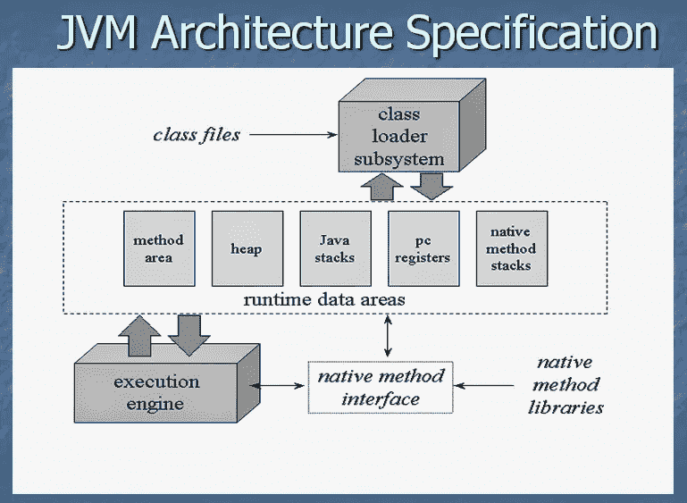](https://click.linksynergy.com/deeplink?id=JVFxdTr9V80&mid=39197&murl=https%3A%2F%2Fwww.udemy.com%2Fcourse%2Fjava-application-performance-and-memory-management%2F)

我经常收到我的读者发来的电子邮件，询问他们如何成为一名更好的 Java 开发人员，他们应该学习什么，以及他们可以在哪些方面努力成为一名 **Rockstar Java 开发人员**。

在过去几年逐一回答了这些问题之后，我想记下几个要点，我认为这将使您成为一名更好的 Java 程序员和应用程序开发人员。

但是，在深入讨论之前，我想强调的是**一个更好的程序员总是更好的 Java 开发人员**，这就是为什么我之前分享的所有[关于](http://javarevisited.blogspot.sg/2014/01/10-tips-to-improve-programming-skill-become-better-programmer.html)[提高你的编程技能](http://www.java67.com/2016/02/5-books-to-improve-coding-skills-of.html)并成为一个更好的程序员的技巧仍然适用。

如果您还没有阅读它们，您可以在阅读完本文后阅读，它们将帮助您提高编程和编码技能，这对于成为一名更好的 Java 开发人员是必不可少的。

这篇文章完全集中在 Java 开发的角度，我假设你已经很擅长基本的东西，比如编码，数据结构和算法，以及计算机科学的概念，比如网络，协议，面向对象编程等等。

这些技巧对于核心 Java 开发人员同样有用，我指的是编写服务器端应用程序但并不真正涉及 web 开发技能的 Java 人员，如 [JSP](http://www.java67.com/2018/02/5-free-servlet-jsp-and-jdbc-online-courses-for-java-developers.html) 、 [Servlet](http://www.java67.com/2012/10/servlet-jsp-interview-questions-answer-faq-experience.html) 和 [JEE](http://javarevisited.blogspot.sg/2015/12/5-good-books-for-java-jee-programming.html#axzz5ExLqlYVa) ，以及主要工作是使用 Java 技术编写 Web 应用程序的 Java Web 开发人员。

# 2023 年成为更好的 Java 开发人员的 9 个技巧

尽管如此，为了保持列表简短，我还是把一些网络内容留到了另一天，比如学习 JSF 或者 Servlet 4.0。不管怎样，不多说了，这里有一些成为更好的 Java 开发人员和软件工程师的技巧和建议。

## 1.学习 JVM 内部和 Java 性能调优

如果你真的想成为一名 Rockstar Java 开发人员，那么你必须首先花时间学习 JVM 的内部知识，比如 JVM 的不同部分，它们是如何工作的， [JIT](http://www.java67.com/2013/02/difference-between-jit-and-jvm-in-java.html) ， [JVM 选项](http://www.java67.com/2016/08/10-jvm-options-for-java-production-application.html)，[垃圾收集](http://javarevisited.blogspot.sg/2011/04/garbage-collection-in-java.html)，以及收集器等等。

> *如果你很了解 JVM，你可以编写健壮的高性能 Java 应用程序，这就是 Rockstar Java 开发人员所做的。*

作为其中的一部分，您还应该学习如何分析您的 Java 应用程序，如何找到性能瓶颈，比如哪些对象占用了您的大部分内存，以及占用了 CPU。

对于结构化学习，我推荐 Scott Oaks 的《Java 性能权威指南》，这是我最近几年读过的一本好书。

[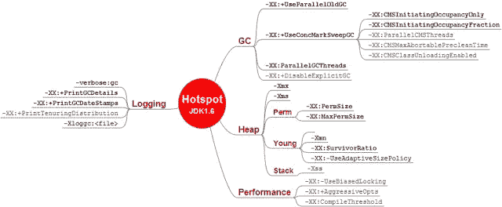](https://click.linksynergy.com/deeplink?id=JVFxdTr9V80&mid=39197&murl=https%3A%2F%2Fwww.udemy.com%2Fcourse%2Fjava-application-performance-and-memory-management%2F)

对于那些更喜欢在线课程而不是书本的人来说，在 Pluralsight 上 [**了解 Java 虚拟机系列**](https://pluralsight.pxf.io/c/1193463/424552/7490?u=https%3A%2F%2Fwww.pluralsight.com%2Fcourses%2Funderstanding-java-vm-memory-management) 也是掌握 JVM 内部的一个很好的收集。

顺便说一下，你需要一个 [Pluralsight 会员](https://pluralsight.pxf.io/c/1193463/424552/7490?u=https%3A%2F%2Fwww.pluralsight.com%2Fpricing)才能加入这个课程，费用大约是每月 29 美元或每年 299 美元(14%的折扣)。如果你没有这个计划，我强烈推荐你加入，因为它能促进你的学习，而且作为一名程序员，你总是需要学习新的东西。

或者，你也可以使用他们的 1 [0 天免费试用](https://pluralsight.pxf.io/c/1193463/424552/7490?u=https%3A%2F%2Fwww.pluralsight.com%2Flearn)来免费观看这个课程。

如果您需要更多的选择，那么学习 Udemy 上的两门课程也是一个不错的选择，学习如何读取堆转储、如何解决内存泄漏以及理解 GC 日志:

1.  [**Java 应用性能和内存管理**](https://click.linksynergy.com/deeplink?id=JVFxdTr9V80&mid=39197&murl=https%3A%2F%2Fwww.udemy.com%2Fcourse%2Fjava-application-performance-and-memory-management%2F)
2.  [**Java 多线程、并发&性能优化**](https://click.linksynergy.com/deeplink?id=JVFxdTr9V80&mid=39197&murl=https%3A%2F%2Fwww.udemy.com%2Fcourse%2Fjava-multithreading-concurrency-performance-optimization%2F)

<https://click.linksynergy.com/deeplink?id=JVFxdTr9V80&mid=39197&murl=https%3A%2F%2Fwww.udemy.com%2Fcourse%2Fjava-multithreading-concurrency-performance-optimization%2F>  

## 2.了解微服务和云

架构在不断变化，许多公司正在从单一应用转向微服务。

Java 开发人员是时候学习**微服务架构**以及如何用 Java 创建微服务来利用最近的浪潮了。

幸运的是，Spring 框架提供了 [Spring Cloud](http://javarevisited.blogspot.sg/2018/04/top-5-spring-cloud-courses-for-java.html#axzz5DbV6r2Ll) 和 [Spring Boot](http://www.java67.com/2017/11/top-5-free-core-spring-mvc-courses-learn-online.html) ，这大大简化了 Java 中的微服务开发。

如果您正在寻找课程，那么[**Spring Boot 和 Spring Cloud**](https://click.linksynergy.com/fs-bin/click?id=JVFxdTr9V80&subid=0&offerid=323058.1&type=10&tmpid=14538&RD_PARM1=https%3A%2F%2Fwww.udemy.com%2Fmicroservices-with-spring-boot-and-spring-cloud%2F) 的主微服务是一个不错的开始。

[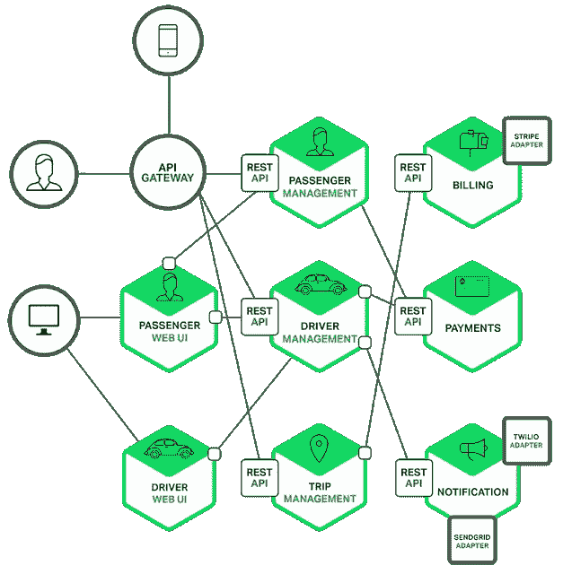](https://click.linksynergy.com/fs-bin/click?id=JVFxdTr9V80&subid=0&offerid=323058.1&type=10&tmpid=14538&RD_PARM1=https%3A%2F%2Fwww.udemy.com%2Fmicroservices-with-spring-boot-and-spring-cloud%2F)

而且，如果你喜欢书，我建议你去看看 Josh Long 写的云原生 Java 的全面指南。

## 3.学习 Spring 框架(Spring Boot)

如今，对于 Java 开发人员来说，学习 Spring 框架几乎是势在必行的，因为大多数公司更喜欢使用 Spring 框架进行开发，如用于开发 web 应用程序的 [Spring MVC](https://javarevisited.blogspot.com/2017/06/how-spring-mvc-framework-works-web-flow.html#axzz5HSzBBwn4) 、 [Spring Boot](https://javarevisited.blogspot.com/2018/05/top-5-courses-to-learn-spring-boot-in.html) 和 [Spring Cloud](https://javarevisited.blogspot.com/2018/07/top-5-books-to-learn-spring-boot-and-spring-cloud-java.html) 以及[微服务](/javarevisited/top-5-books-to-learn-spring-boot-and-microservices-for-experienced-java-developers-499a9d921d18)。

它还促进了最佳实践，如依赖注入，并使您的应用程序更具可测试性，这是现代软件的关键要求。

如果你是一个新的 Java 开发者，那么我建议你从这个 Java 和 Spring 教程开始学习这个令人敬畏的框架的基础，如果你已经熟悉 Spring，那么你应该探索 Spring Boot 和 Spring Cloud 来开发下一代 Java 应用。

如果您正在寻找一些参考资料，那么学习 Spring Boot 的[**——Dan Vega 的快速 Spring 应用程序开发**](https://click.linksynergy.com/fs-bin/click?id=JVFxdTr9V80&subid=0&offerid=323058.1&type=10&tmpid=14538&RD_PARM1=https%3A%2F%2Fwww.udemy.com%2Fspring-boot-intro%2F) 是一个不错的起点。

[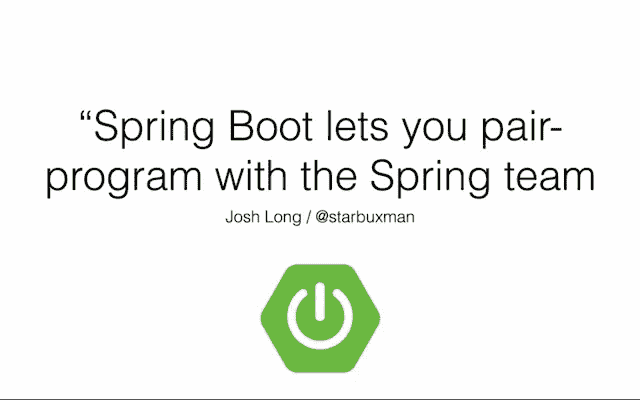](https://click.linksynergy.com/fs-bin/click?id=JVFxdTr9V80&subid=0&offerid=323058.1&type=10&tmpid=14538&RD_PARM1=https%3A%2F%2Fwww.udemy.com%2Fspring-boot-intro%2F)

## 4.学习 Java APIs 和库

如果你和优秀的 Java 开发人员一起工作过，你可能会注意到他们对 Java 生态系统和 API 的全面了解是其中的主要部分。

Java 是世界上最流行和最成熟的编程语言，有大量的库和 API 可以用来做几乎所有可能的事情。

当然，你不需要知道所有这些，但是你应该熟悉一些关键的 API，比如 JSON 处理 API 如 [Jackson](http://javarevisited.blogspot.sg/2017/10/jackson-json-parsing-error.html) 和 [Gson](http://www.java67.com/2016/10/3-ways-to-convert-string-to-json-object-in-java.html) ，XML 处理 API 如 [JAXB](http://javarevisited.blogspot.sg/2013/01/jaxb-xml-binding-tutorial-marshalling-unmarshalling-java-object-xml.html) 和 Xerces，单元测试库如 [Mockito](/javarevisited/top-10-courses-to-learn-eclipse-junit-and-mockito-for-java-developers-4de1e8d62b96) 和 [JUnit](https://hackernoon.com/5-courses-java-programmers-can-join-to-learn-junit-and-mockito-in-2019-h74t38r4) 等等。

如果你不知道他们，你可以学习或者至少了解他们的概况。首先，你可以看看我列出的每个 Java 开发人员都应该知道的 20 个 Java 库的清单，这些库涵盖了解析、字节码操作、[并发](https://javarevisited.blogspot.com/2018/06/top-5-java-multithreading-and-concurrency-courses-experienced-programmers.html)、[集合](https://javarevisited.blogspot.com/2020/04/top-5-courses-to-learn-java-collections-and-streams.html)等关键领域。

[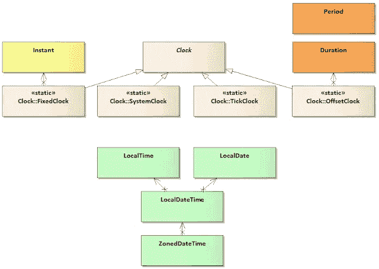](https://click.linksynergy.com/fs-bin/click?id=JVFxdTr9V80&subid=0&offerid=323058.1&type=10&tmpid=14538&RD_PARM1=https%3A%2F%2Fwww.udemy.com%2Fjava-the-complete-java-developer-course%2F)

## 5.学习 Java 8+ (Java 17)

这是目前 Java 开发人员最重要的事情。它已经 4 年了，甚至 Java 13 已经发布了 6 个月，人们都在谈论 Java 10 的特性，我知道许多程序员没有使用 lambdas 和 Stream API 等 Java 8 特性编写过一行代码。

不幸的是，他们中的大多数都是经验丰富的 Java 开发人员，在他们的领域有 7 到 10 年的丰富经验。我知道在你职业生涯的某个阶段，学习会变得很慢，但是如果你现在不行动，你就会被甩在后面。

现在几乎所有的 Java 开发工作都需要 Java 8 技能，如果你不具备这些技能，你将很难在 Java 面试中表现出色。

现在，如果你已经下定决心学习 Java 8，但又担心从哪里开始，我建议你查看 Udemy 上的 [**完整的 Java MasterClass**](https://click.linksynergy.com/fs-bin/click?id=JVFxdTr9V80&subid=0&offerid=323058.1&type=10&tmpid=14538&RD_PARM1=https%3A%2F%2Fwww.udemy.com%2Fjava-the-complete-java-developer-course%2F) ，它会教你 Java 8 特性的所有基础知识。

[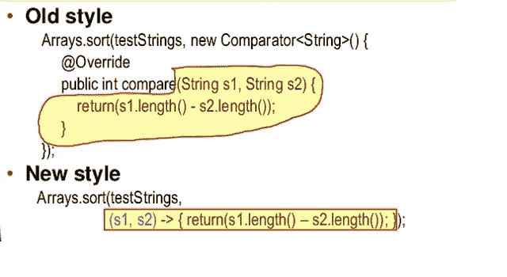](https://click.linksynergy.com/fs-bin/click?id=JVFxdTr9V80&subid=0&offerid=323058.1&type=10&tmpid=14538&RD_PARM1=https%3A%2F%2Fwww.udemy.com%2Fjava-the-complete-java-developer-course%2F)

而且，如果你对更高级的课程感兴趣，那么海因茨·卡布茨博士的 [**重构 Java 8**](https://learning.javaspecialists.eu/courses/refactoring2j8?affcode=92815_johrd7r8) 实践课程是一个很好的加入方式。

## 6.学习设计模式和编码最佳实践

如果你正在从头开始编写一个 Java 应用程序，那么大部分时间你都在编写面向对象的代码，而[设计模式](http://javarevisited.blogspot.sg/2018/02/top-5-java-design-pattern-courses-for-developers.html)是常见问题的久经考验的解决方案。

通过了解它们并将其合并到您的代码中，您可以使您的应用程序更加灵活，并且在将来更容易更改。

> *它还提高了整体代码质量和文档，因为其他 Java 开发人员也熟悉设计模式，他们会很快理解您的解决方案。*

但是，不要只关注代码部分，要理解精神，要有创意。使用 Java 8 特性如 [lambdas](http://javarevisited.blogspot.com/2014/02/10-example-of-lambda-expressions-in-java8.html) 和 [Streams](http://www.java67.com/2014/04/java-8-stream-examples-and-tutorial.html) 来重写模式如[策略模式](http://javarevisited.blogspot.sg/2015/07/strategy-design-pattern-and-open-closed-principle-java-example.html)。

如果你正在寻找一些学习设计模式的资源，那么我建议你去看看 Dmitri Nesteruk 的 Java 课程中的设计模式。本课程从实用的角度和现代的实现方式全面概述了 Java 中的 [**设计模式。**](https://click.linksynergy.com/deeplink?id=JVFxdTr9V80&mid=39197&murl=https%3A%2F%2Fwww.udemy.com%2Fcourse%2Fdesign-patterns-java%2F)

[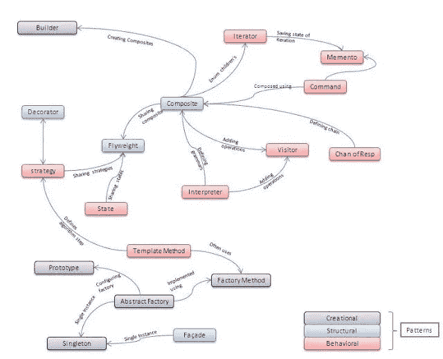](https://click.linksynergy.com/deeplink?id=JVFxdTr9V80&mid=39197&murl=https%3A%2F%2Fwww.udemy.com%2Fcourse%2Fdesign-patterns-java%2F)

而且，如果你需要更多的选择，那么这个[设计模式课程列表](http://javarevisited.blogspot.sg/2018/02/top-5-java-design-pattern-courses-for-developers.html)是一个很好的进一步探索的地方。并且，对于那些喜欢书的人，我推荐的关于设计模式的书可以在[这里](http://www.java67.com/2016/10/top-5-object-oriented-analysis-and-design-patterns-book-java.html)找到。

## 7.学习开发工具和 ide

优秀的 Java 开发人员的一个最重要的特点是他们非常擅长使用他们的工具。他们不仅比一般的开发人员知道更多的工具，而且他们非常了解他们的工具。

因为像 Eclipse、NetBeans 和 IntelliJ IDEA 这样的 ide 是 Java 程序员最重要的工具，所以花一些时间更好地学习是有意义的。

你可以了解一些让你的任务变得简单的插件或者一些帮助你更好导航的[键盘快捷键](https://javarevisited.blogspot.com/2018/07/top-30-eclipse-keyboard-shortcuts-java-programming.html)。

即使是一些小提示也会有很大帮助，因为你使用它们的次数比你想象的要多得多。如果你真的想让你的 IDE 技能更上一层楼，并使用 Eclipse，那么我建议你查看 Udemy 上的 [**Eclipse 调试技术和技巧**](https://click.linksynergy.com/fs-bin/click?id=JVFxdTr9V80&subid=0&offerid=323058.1&type=10&tmpid=14538&RD_PARM1=https%3A%2F%2Fwww.udemy.com%2Feclipse-debugging-techniques-and-tricks%2F) ，这是一门提高你的 Eclipse 知识的完美课程。

[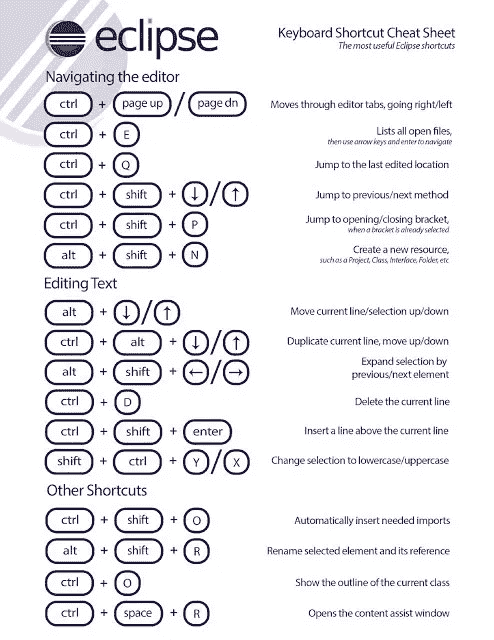](https://click.linksynergy.com/fs-bin/click?id=JVFxdTr9V80&subid=0&offerid=323058.1&type=10&tmpid=14538&RD_PARM1=https%3A%2F%2Fwww.udemy.com%2Feclipse-debugging-techniques-and-tricks%2F)

而且，如果你是 IntelliJ DEA 的粉丝，那么你也可以在 Udemy 上看看这个由@尼尔森·德加洛提供的免费课程——[**启动并运行 IntelliJ IDEA**](https://click.linksynergy.com/deeplink?id=JVFxdTr9V80&mid=39197&murl=https%3A%2F%2Fwww.udemy.com%2Fcourse%2Fintellij-idea-ide%2F) 。现在它是免费的，但是请在加入它之前检查价格。

<https://click.linksynergy.com/deeplink?id=JVFxdTr9V80&mid=39197&murl=https%3A%2F%2Fwww.udemy.com%2Fcourse%2Fintellij-idea-ide%2F>  

## 8.学习 DevOps

对于现代 Java 开发人员来说，DevOps 知识是必不可少的。他至少应该熟悉持续集成和持续部署，以及 [Jenkins](http://www.java67.com/2018/02/6-free-maven-and-jenkins-online-courses-for-java-developers.html) 如何帮助实现这一点。

对于经常负责设定编码最佳实践和创建环境、构建脚本和指南的高级 Java 开发人员来说，这变得更加重要。

我还建议你和 Maven、Jenkins 一起花时间学习更多关于 DevOps 的知识，以及像 [Docker](http://javarevisited.blogspot.sg/2018/02/10-free-docker-container-courses-for-Java-Developers.html) 、 [Ansible](https://javarevisited.blogspot.com/2019/11/top-5-course-to-learn-ansible-for-devops.html) 、 [Kubernetes](https://www.udemy.com/course/learn-devops-ci-cd-with-jenkins-using-pipelines-and-docker/) 等工具。

如果您需要一些资源，那么使用管道和 Udemy 中的 Docker 与 Jenkins 一起学习 DevOps: CI/CD 可能是最好的开始课程。您不仅会了解 CI 和 CD，还会深入了解 Maven 和 Jenkins。

[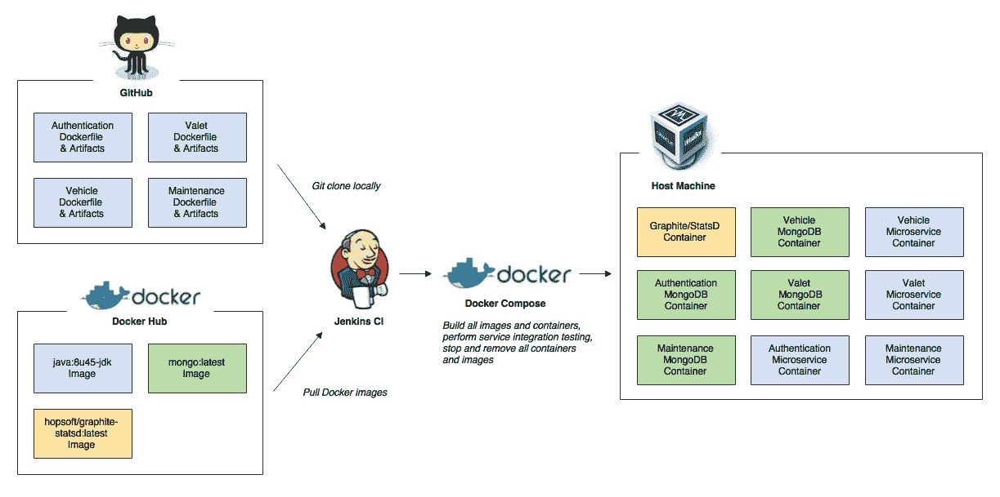](https://click.linksynergy.com/deeplink?id=JVFxdTr9V80&mid=39197&murl=https%3A%2F%2Fwww.udemy.com%2Fcourse%2Flearn-devops-ci-cd-with-jenkins-using-pipelines-and-docker%2F)

而且，如果你喜欢书的话， [**凤凰计划**](https://www.amazon.com/Phoenix-Project-DevOps-Helping-Business/dp/1942788290/?tag=javamysqlanta-20) 是一本很好的关于 IT、自动化和 DevOps 的小说。这本书很容易阅读，这意味着你可以毫不费力地阅读它，并且它会教你自动化如何在 It 和软件开发中帮助你。

还有一门课程，我想特别推荐给 Docker 和 Kubernetes 的是 Stephen Grider 的 [**Docker 和 Kubernetes:完全指南**](https://click.linksynergy.com/deeplink?id=JVFxdTr9V80&mid=39197&murl=https%3A%2F%2Fwww.udemy.com%2Fdocker-and-kubernetes-the-complete-guide%2F) ，你将在一门课程中学习这两个重要的工具。

<https://click.linksynergy.com/deeplink?id=JVFxdTr9V80&mid=39197&murl=https%3A%2F%2Fwww.udemy.com%2Fdocker-and-kubernetes-the-complete-guide%2F>  

## 9.学习 Scala 或 Kotlin

几年前，我读过一本名为 [**《扎实的 Java 开发人员**](http://www.amazon.com/dp/1617290068/?tag=javamysqlanta-20) 的书，书中强调了成为一名通晓多种语言的程序员的优势。

> 它启发我学习 Scala，后来我也尝试了 Groovy，因为它在创建构建脚本和单元测试中的使用越来越多。

那段经历对我帮助很大，这就是为什么我鼓励 Java 开发人员学习一种新的 JVM 语言。我以前在博客上写过关于 Java 开发人员应该学习的 3 种 JVM 语言的文章，但是如果你赶时间，就学习 Kotlin 吧。

这是一种来自 JetBrains(IntelliJ IDEA 背后的公司)的优秀语言，也是 Google 宣布的 Android 开发的官方语言。

这不仅能提高你的生产力，还能帮助你进入 Android 开发领域。如果你想学习 Kotlin 并寻找一些好的资源，那么 [**完整的 Android Kotlin 开发者**](https://click.linksynergy.com/deeplink?id=JVFxdTr9V80&mid=39197&murl=https%3A%2F%2Fwww.udemy.com%2Fcourse%2Fthe-complete-kotlin-developer-course%2F) 课程是一个很好的起点。

[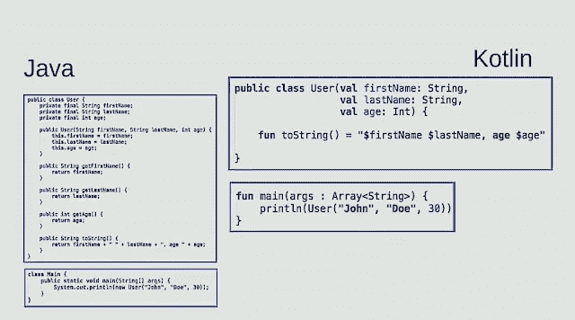](https://click.linksynergy.com/deeplink?id=JVFxdTr9V80&mid=39197&murl=https%3A%2F%2Fwww.udemy.com%2Fcourse%2Fthe-complete-kotlin-developer-course%2F)

如果你需要更多的选择，这里有一个最好的科特林球场列表供你进一步探索。

## 10.学习单元测试

> 如果一个优秀的 Java 开发人员和一个普通的 Java 开发人员之间有一个共同点，那么这个共同点就是他的单元测试技能。

一个优秀而专业的 Java 开发人员几乎总是为他的代码编写单元测试，如果他真的是一个摇滚明星开发人员，你可以从他的代码和测试中看出这一点。

测试也取得了长足的进步，Java 开发人员可以使用多种工具进行单元测试、集成测试和自动化测试。

你可以花大量的时间来磨练你的 Java 测试技能，但是对于那些不熟悉 Java 世界和单元测试的人来说，JUnit 是最好的入门库。最新版本 JUnit 5 既强大又灵活，每个 Java 开发人员都应该知道这一点。

如果你正在寻找一个关于 JUnit 和 Java 单元测试的好的概述，那么 [**JUnit 和 Mockito 速成班**](https://click.linksynergy.com/fs-bin/click?id=JVFxdTr9V80&subid=0&offerid=323058.1&type=10&tmpid=14538&RD_PARM1=https%3A%2F%2Fwww.udemy.com%2Fjunitandmockitocrashcourse%2F) **s** 是一个完美的开始。它不是最新的，因为它没有涵盖 JUnit 5，但对初学者仍然非常有用。

[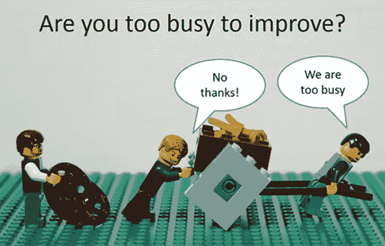](https://click.linksynergy.com/fs-bin/click?id=JVFxdTr9V80&subid=0&offerid=323058.1&type=10&tmpid=14538&RD_PARM1=https%3A%2F%2Fwww.udemy.com%2Fjunitandmockitocrashcourse%2F)

以上是我的一些成为更好的 Java 程序员的建议。我知道很难遵循所有这些建议，我不是要求这样做，这根本不实际。

> 如果你还不了解 Java 8 和 Spring Framework，你可以先专注于更重要的事情，但是如果你擅长这些，你可以选择其他话题，比如单元测试、JVM 内部机制和 DevOps。

首先，您需要选择一个类似 Java 8 的版本，并在转到下一篇技巧文章之前使用它。如果你正在寻找一些唾手可得的果实，那么更好地学习你的 IDE 是一个不错的选择。

你已经了解了你的 IDE，花些时间更好地学习它会让你在短时间内成为一个更有生产力和更好的 Java 开发人员。

> *祝你一切顺利，别忘了分享你认为让你成为更好的 Java 开发者的技巧。*

如果你有任何建议或反馈，那么你是最受欢迎的，我们都互相学习。

其他**编程文章**你可能喜欢的
[10 本算法书每个程序员都应该读的](http://www.java67.com/2015/09/top-10-algorithm-books-every-programmer-read-learn.html)
[完整的 Web 开发人员路线图](https://javarevisited.blogspot.com/2019/02/the-2019-web-developer-roadmap.html#axzz63HbZbxLC)
[提高编程技能的 10 个技巧](https://javarevisited.blogspot.com/2014/01/10-tips-to-improve-programming-skill-become-better-programmer.html)
[10 个 OOP 设计原则每个程序员都应该知道的](https://javarevisited.blogspot.com/2018/07/10-object-oriented-design-principles.html)
[10 个工具每个软件工程师都应该知道的](https://javarevisited.blogspot.com/2018/01/10-tools-every-software-developer-know.html)
[完整的 Java 开发人员路线图](https://javarevisited.blogspot.com/2019/10/the-java-developer-roadmap.html#axzz64YOHJ2TL)
[程序员和开发人员的 10 个高薪职业选择 成为更好的 Java 开发人员](http://javarevisited.blogspot.sg/2018/02/top-10-highest-paying-technical-jobs-programmers-software-developers.html#axzz58Gi5STbU)
[100+给程序员的数据结构和算法问题](http://www.java67.com/2018/06/data-structure-and-algorithm-interview-questions-programmers.html)
[给 Java 程序员的 10 个单元测试工具](http://javarevisited.blogspot.sg/2018/01/10-unit-testing-and-integration-tools-for-java-programmers.html)

感谢您阅读本文。如果你觉得这篇文章有用，那么请分享给你的朋友和同事。如果您有任何问题或反馈，请留言。

如果你现在只想做一件事，我建议你关注并发性和性能。如果需要资源入手，没有比 Udemy 上的 [**Java 多线程、并发&性能优化**](https://click.linksynergy.com/deeplink?id=JVFxdTr9V80&mid=39197&murl=https%3A%2F%2Fwww.udemy.com%2Fcourse%2Fjava-multithreading-concurrency-performance-optimization%2F)**by**Michael pogrebsky 更好的课程了。

<https://click.linksynergy.com/deeplink?id=JVFxdTr9V80&mid=39197&murl=https%3A%2F%2Fwww.udemy.com%2Fcourse%2Fjava-multithreading-concurrency-performance-optimization%2F> 