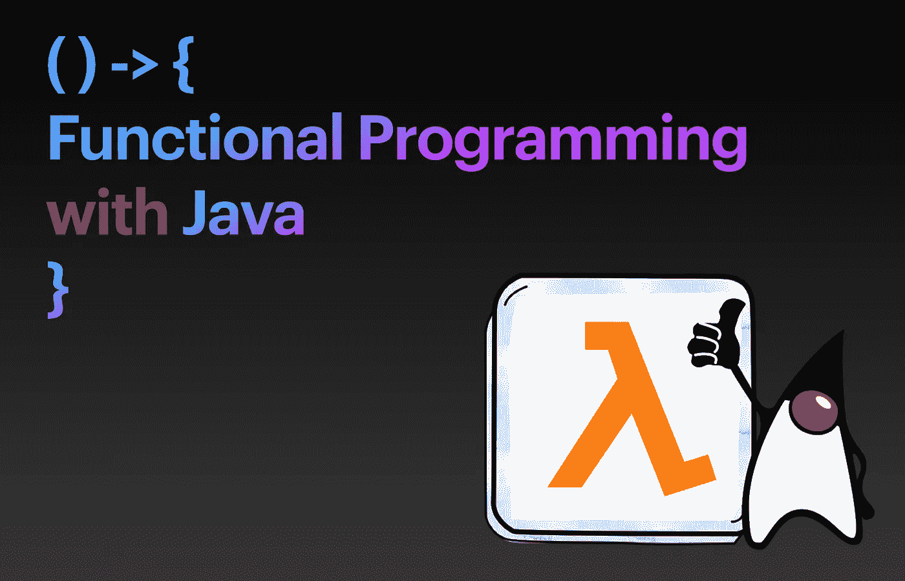

# Java 函数式编程一瞥

> 原文：<https://medium.com/javarevisited/a-beginners-guide-to-functional-programming-with-java-5987101b3713?source=collection_archive---------1----------------------->

从 [Java 8](/hackernoon/top-5-java-8-courses-to-learn-online-2db57d9dfb8d) 开始，我们可以用函数方法增强我们的 Java 代码解决方案。酪 Java 到底提供了什么？让我们来看看。

# 什么是函数式编程？

函数式编程是一种编程范式，其焦点是*“解决什么”*，与此相反，过程式编程范式的主要焦点是*“如何解决”*换句话说，函数式编程是一种**声明性范例**。函数式编程的核心是解决作为**数学函数求值的计算问题。**是的，函数，这些关系将集合中的元素 *X(输入)*关联到集合中的单个元素 *Y(输出)*。在函数式编程中，**函数无处不在**。函数可以存储在变量中。函数可以作为参数传递。函数可以接收函数作为参数，甚至返回一个函数作为结果。此外，函数可以是表达式(方法内部的指令，比如 2+2，这是一个算术表达式)👀。

## 作为方法的函数

等等，我们在 Java 中称之为方法的，在其他语言中叫做函数，比如在 [C](/javarevisited/10-best-c-programming-courses-for-beginners-2c2c1f6bcb12) 中。它们在使用 Java 的[函数式编程的上下文中起作用吗？是的，他们是。但他们不是唯一的。](/javarevisited/8-best-lambdas-stream-and-functional-programming-courses-for-java-developers-3d1836a97a1d)

## 作为对象的功能

我们提到存储在变量中，作为参数传递，作为结果返回。只有变量和对象可以被存储、传递和返回。函数在 Java 中是用对象表示的吗？是的，他们是。我们有什么叫做 [**功能界面**](https://javarevisited.blogspot.com/2018/01/what-is-functional-interface-in-java-8.html) **。我们从函数接口实现类。然后，我们可以创建对象。这些对象被称为**一级函数。**为什么？据说是因为职能终于被当做*一等公民*🙂。当封装在对象中时，它们最终可以被存储、返回并用作其他函数的参数。**

## 用作表达式

进一步，我们提到函数可以是表达式；因此，它们可以存在于方法内部，就像我们结合运算符和值创建的表达式一样，对吗？是的，他们可以。我们将需要一种新的表达式(我稍后会解释)，称为</javarevisited/7-best-java-tutorials-and-books-to-learn-lambda-expression-and-stream-api-and-other-features-3083e6038e14>**。它们也是函数。**

**让我们回顾一下实现——函数接口、高阶函数和 Lambda 表达式。**

# **功能界面**

**函数接口也叫 [**单一抽象方法接口**](http://www.java67.com/2017/06/10-points-about-lambda-expressions-in-java-8.html) 。顾名思义，它们是只允许一个抽象(未实现)方法的接口。可以实现函数接口，实现的类可以用来创建表示函数的对象——记住，它们被称为**一级函数。这允许语言支持将函数作为参数传递给其他函数，将它们作为其他函数的值返回，并将它们分配给变量或存储在数据结构中。****

**Java API 包含一组为常见用例设计的功能接口，因此您不必为每个小用例创建自己的功能接口。它们位于***Java . util . Function***包中，包括: ***函数*** ， ***谓词*** ， ***一元运算符*** ， ***二元运算符*** ， ***供应商，*** ***消费者，比较器*让我们看看其中的两个例子来了解一下这个想法。****

## **java.util.function .函数**

*****函数*** 接口表示接受单个参数并返回单个值的函数。函数名为 ***apply()*** *，*，参数类型为参数化类型。下面是一个实现 ***函数*** 并使 *apply()* 方法将一个*整数*作为参数并返回一个*整数*的例子。图 1 显示了一个例子。**

**图一。PlusOne.java—Java . util . function . function 接口实现示例**

## **java.util.function .谓词**

**[***谓词***](https://javarevisited.blogspot.com/2015/02/how-to-filter-collections-in-java-8.html) 接口表示一个简单的函数，以单个值作为参数，返回 true 或 false。函数名为 ***test()*** *。*您可以使用一个类来实现 ***谓词*** 接口，如图 2 所示。**

**图二。AreHappy.java—Java . util . function . predicate 接口实现的示例**

**然后我们可以使用这些实现来创建我们的类 *PlusOne* 和 *AreHappy，*的实例，如图 3 所示。**

**图 3。Main.java——函数和谓词接口用法示例**

**至此，你有了想法:接口封装了一个要在类中实现的方法；从类中，我们可以创建对象，然后对象可以被存储、作为参数传递或返回。请不要绝望，这是一块积木，我们接下来将进入核心部分。**

# **高阶函数**

**高阶函数是:(1)以一个或多个*函数*为参数的函数；或者(2)返回一个*函数*作为结果的函数。例如， *Collections.sort()* 方法将一个*比较器*作为参数。是的，那个 [*比较器*](https://www.java67.com/2019/06/top-5-sorting-examples-of-comparator-and-comparable-in-java.html) 是一个*函数*——一个封装在类中的方法，实现一个只有一个(未实现的)方法的接口🙂。看一下图 4 中的代码。**

**图 4。MyComparator.java-将其用作 Collection.sort()方法的参数**

**注意， *Collection.sort()* 的第一个参数是一个*列表，*，第二个参数是一个函数。第二个参数是使 *Collections.sort()* 成为高阶函数的原因。有点令人兴奋，但仍然不像函数式编程。**

# ****λ表达式****

**你有没有注意到在上面的例子中，我们有多少次创建了一个类来承载一个方法(函数)？我们只使用一次的功能！**

****lambda 表达式是一小段代码，用于替换方法声明**。它接受参数并返回一个值。但是，它不需要名字，它可以在另一个方法体中实现。此外，[λ表达式](https://javarevisited.blogspot.com/2018/07/java-8-tutorials-resources-and-examples-lambda-expression-stream-api-functional-interfaces.html)可用于直接从函数接口实现单个方法。lambda 表达式如下所示:**

**`(parameters inside parenthesis) **->** {body inside curly brackets}`**

**因此，我们可以删除图 1 和图 2 中的代码，重写图 3，如图 5 所示。正如您所注意到的，*函数*接口实现现在内联在 plusOne lambda 变量的声明中，而不是在一个单独的类中。这个比较短。那么，一个表达式(一行)能代替一个新类的创建(用它的实现指令)和一个方法体的覆盖吗？是的，没错。**

**图 5。Main.java—Lambda 表达式取代了函数接口的显式实现**

**值得扩展我们对高阶函数的定义，并声明高阶函数可以是以一个或多个 lambda 表达式作为参数或返回 lambda 表达式的函数。例如，在[*collections . sort()*](https://javarevisited.blogspot.com/2017/09/java-8-sorting-hashmap-by-values-in.html)*中，第一个参数仍然是一个*列表*，第二个参数是一个 lambda 表达式。***

# ***连接点:流 API***

***更好地利用函数式编程特性的 Java 部分之一是 [**流 API**](/javarevisited/7-best-java-collections-and-stream-api-courses-for-beginners-in-2020-3ad18d52c38) ，它提供了一种函数式方法来处理对象的**集合。流 API 与包 *InputStream* 或 *OutputStream — t* 无关，而 *InputStream* 和 *OutputStream* 与**字节流**相关。请看图 6 中的例子。他们展示了如何:*****

1.  ***创建一个元素流—method**of()**和 items 作为参数。***
2.  ***使用 Fluent-Builder 样式将元素直接添加到流中。***
3.  ***从我们已有的收藏中创建一个流。***
4.  ***对流的元素执行操作—对每个元素执行相同的操作。因此，N 个元素产生 N 个结果。注意例子中的[*方法*](/javarevisited/how-to-use-streams-map-filter-and-collect-methods-in-java-1e13609a318b)*。****
5.  ****创建一个流管道——一系列流源、中间操作和终端操作。注意示例中的 ***map()*** 和 ***sort()*** 方法的组合。****
6.  ****简化流，即通过某种方式组合(使用)流中的所有元素来获得值。因此，N 个元素产生 1 个结果。注意例子中的 ***reduce()*** 方法。****
7.  ****应用并行化。Java 8 引入了一种以函数风格实现并行的方式**。流 API 允许创建并行流，以并行模式执行操作。注意***parallels stream()***方法。******

****图 6。StreamsExamples.java—利用函数式编程方法的例子****

****注意，流本身可以迭代它的元素。不需要 Java 迭代器、for-each 循环或任何类型迭代的显式实现。此外，请注意对 [**Fluent-Builder 设计模式**](https://mscjaviergs.medium.com/design-patterns-101-factory-vs-builder-vs-fluent-builder-da2babf42113) 的大量使用——所有那些`object*.foo().bar().more()*` *…*****

****我们可以用上面描述的元素做什么？如何将它们与面向对象的元素结合起来？例如，从文件中读取数据、将数据存储在数据结构(集合)中、进行排序或搜索、迭代数据以进行打印、计算统计数据等。让我们在另一个故事中回顾一下。****