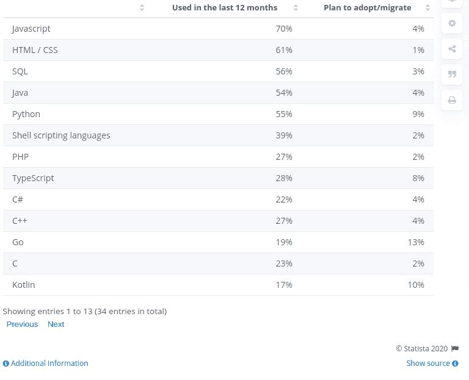
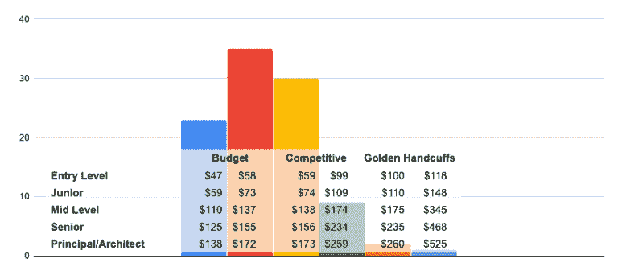
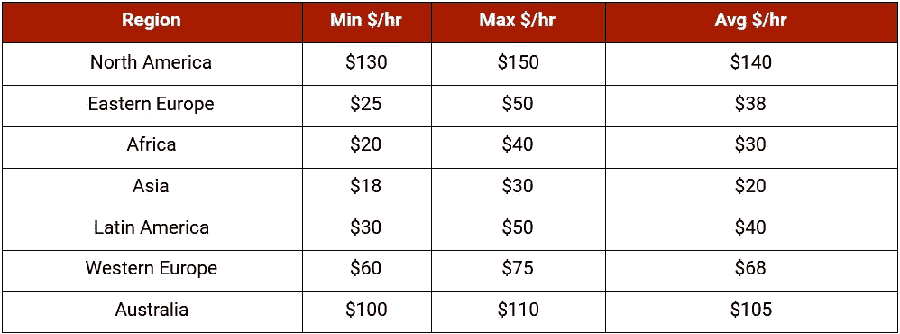

# 雇佣 JavaScript 开发人员要花多少钱

> 原文：<https://medium.com/javarevisited/a-complete-guide-to-know-the-actual-cost-of-hiring-javascript-developers-6a61a84e616d?source=collection_archive---------1----------------------->

你有没有想过，即使是一家小咖啡馆也会有自己的网站或网络应用程序？

数字化的热潮推动了当地每一家商店上网，扩大用户群。

因此，无论你是决定开发一个网站还是一个 web 应用程序来促进你的业务增长， [JavaScript](/javarevisited/10-best-online-courses-to-learn-javascript-in-2020-af5ed0801645) 是一种独立的编程语言，在开发大多数网站、移动应用程序和桌面小工具时仍然占有重要地位。

但是，在这里，你们中的许多人很想知道“雇佣一个 JavaScript 开发人员要花多少钱？”

有很多软件开发公司帮你雇佣开发者，平均成本 25 到 50 美元。然而，现实是，要得到这个问题的答案，你需要考虑几件事情。

开发人员的成本会因技能、专业知识、地点、经验等因素而有很大差异。所以在这篇文章中，我们解释了各种参与模式，雇佣一个 [JavaScript 开发人员](/javarevisited/top-10-online-courses-to-become-a-fullstack-web-developer-in-2020-d608a6b63232)的清单，以及开发人员每小时平均成本的估算。

***下面是 JavaScript 的重点:***

*   为什么 JavaScript 仍然占据行业优势？
*   雇佣 JavaScript 开发人员的成本
*   影响雇佣 JavaScript 开发人员成本的因素
    *-自由职业者 Vs 内部开发团队 Vs 专门开发团队
    -开发人员的地理位置
    -专业知识和技能
    -雇佣模式的选择*
*   聘请 JavaScript 开发人员的清单
    *——项目需要什么类型的开发人员？
    -开发商的技术和软技能
    -市场专业知识
    -项目交付跟踪记录*
*   结论

> 让我们详细讨论每一点……

# **1。为什么 JavaScript 仍然占据行业优势？**

JavaScript 是一种编程语言，最早出现于 1995 年，是一种客户端脚本语言，被广泛用于创建交互式 web 和移动应用程序。然而，尽管已经在一家公司存在了 30 多年，JavaScript 仍然是前端开发的主要工具，也是最受欢迎、最理想和最流行的编程语言。

[图像来源](https://www.statista.com/statistics/869092/worldwide-software-developer-survey-languages-used/)

## 除此之外，以下是 JavaScript 成为应用程序开发项目中要求最高的编程语言的几个原因:

*   所有浏览器都支持 JavaScript，它使您能够构建交互式 web 应用程序。利用 HTML 和 CSS，开发者可以定制网页，包括标题、文本、图像布局、设计、字体等等。说只有 HTML 和 CSS 网站是静态的并显示数据不会错，但是使用 JavaScript，你可以给你的网页增加交互性。
*   JavaScript 为您带来更快的用户体验，因为代码过去可以直接在浏览器中运行，并最大限度地减少加载时间。
*   由于是异步的，JavaScript 与服务器通信时不会中断前端的用户交互。
*   JavaScript 在开发行业已经存在了 30 多年，已经建立了一个非常庞大的社区。因此，如果你想雇佣 JavaScript 开发人员，你将有机会从大量的开发人员中进行选择。
*   JS 语法对于新手来说很容易理解，也很灵活，它使得应用程序开发过程对于初学者来说更容易。
*   从电子商务网站、实时数据应用到按需应用，如订餐、出租车预订应用，都是需要更广泛的数据库和更快加载页面的一些很好的例子。此外，包括 Paypal、网飞、LinkedIn 和优步在内的大多数全球领先网站和应用都在使用 JavaScript。
*   JavaScript 为您带来了广泛的库和框架选择，使开发人员更容易构建大型的基于 web 的应用程序。从 [AngularJS](https://javarevisited.blogspot.com/2019/04/10-free-angular-and-react-courses-for.html) 、 [ReactJS](https://www.java67.com/2018/02/5-free-react-courses-for-web-developers.html) 到 EmberJS，许多[动态 JS 框架](/javarevisited/10-of-the-most-popular-javascript-frameworks-libraries-for-web-development-in-2019-a2c8cea68094)使你能够开发高度交互和专业外观的 web 应用。

所有这些原因都有助于为你的下一个应用程序开发项目雇佣一名 JavaScript 开发人员。但现在的问题是，雇佣 JavaScript 应用开发者要花多少钱？

不用担心；这篇文章旨在帮助你找到最好的 [**JavaScript 应用开发公司**](https://www.xicom.biz/offerings/web-development/) ，并了解雇佣 JS 开发者的费用。

# **2。雇佣 JavaScript 开发人员的成本**

无论你是创业者还是领先的企业家，应用程序开发成本始终是企业面临的紧迫问题之一。

根据调查报告，2020 年 JavaScript 开发人员的平均工资在美国达到[114，986 美元，](https://jaxenter.com/javascript-careers-2020-167054.html)全球平均每小时工资为 61-90 美元。

调查报告显示， [C++](/javarevisited/top-10-courses-to-learn-c-for-beginners-best-and-free-4afc262a544e) 是要求最高的编程语言之一，但是， [JavaScript](/javarevisited/12-free-courses-to-learn-javascript-and-es6-for-beginners-and-experienced-developers-aa35874c9a32) 仍然是一项在未来将永远保持趋势的基本技术。

> 此外，[1100 万开发人员](https://jaxenter.com/dev-report-javascript-164201.html)正在积极利用这种语言进行开发，因此为您的项目寻找最佳开发团队对企业来说从来都不是一个大挑战。

[图像来源](https://jaxenter.com/javascript-careers-2020-167054.html)

> 另一方面，在澳大利亚、欧洲、非洲和亚洲雇佣 JS 开发人员的成本分别为 110 美元、75 美元、40 美元和 18 美元/小时。

由于开发人员的每小时成本将直接影响应用程序的整体开发成本，因此，值得理解“为什么开发人员的成本会有这么大的变化？”。

雇用 JS 开发人员没有标准成本，因为有几个因素影响开发人员的成本。

# **3。影响雇佣 JavaScript 开发人员成本的因素**

当决定雇佣 JavaScript 开发人员的成本时，有几个因素会影响开发人员的成本。

> 因此，让我们开始详细讨论它们:

*   **自由职业者 Vs 内部开发团队 Vs 专业开发团队**

现代 IT 市场为您提供了一个机会来雇佣最适合您需求的资源。有多种招聘选择，包括自由职业的 JavaScript 开发人员，开发自己的内部开发团队，或者外包专门的开发团队。每个选项都有其优点和局限性，因此在做出任何决定之前，有必要详细了解每个选项。

*   **自由开发者**

雇用自由职业者是一个理想的选择，以防你有足够的资格和技术知识为你找到合适的专家。有一些网站，包括 Freelancer、Fiverr、Upwork 等等，允许你雇佣开发者。雇用自由职业者的最大优势是他们是最便宜的选择，沟通和开发人员的技能是自由职业者的最大问题。自由职业者的平均费用从 10 美元到 15 美元不等，取决于专家的技能和专业知识。

*   **内部应用开发团队**

发展一个开发团队对于领先的企业来说是一个很好的主意，但是为项目选择合适的专家的实际障碍使得事情变得复杂。很少有像 LinkedIn、Glassdoor、Indeed 和 Dice 这样的平台可以帮助你找到开发人员，但面试各种候选人并管理他们的月薪可能很耗时。但是，拥有一个内部开发团队的最大优势是沟通顺畅。在美国，开发人员的年薪可以从 9.5 万美元不等，也可以超过这个数字。

*   **外包开发人员的专门开发团队**

外包是目前最常见也是最受欢迎的选择之一，因为一些 [**软件开发公司**](https://www.xicom.biz/)/提供给你有吸引力的价格来雇佣一个开发团队。外包公司最大的好处是他们有经验丰富的合格的 JavaScript 开发人员支持，致力于交付高质量和准时的项目交付。外包公司最可靠的平台是离合器、GoodFirms 和 IT 公司。平均下来，你可以外包一个专门的开发团队，价格从 35 美元到 50 美元+不等。

*   **开发者的地理位置**

一个 JS 开发者的费用多少将很大程度上取决于专家的位置。无论您选择开发一个内部开发团队还是利用外包的优势，开发人员的每小时成本根据开发人员的专业知识、经验和位置而有很大的不同。但全球公认的事实是，印度相对而言是企业雇佣开发人员的首选，因为价格最便宜。

*   **专业知识和技能**

专家的专业知识和技能是不可忽视的最重要的成本推动因素。随着开发人员市场经验的增加，他们会更好地理解应该集成哪些技术和方法来开发以客户为中心的产品。

简单的应用程序开发要求可以通过雇佣至少有 5 年经验的 JS 开发人员来实现，在印度这可能要花费你每小时 20 美元左右。而复杂的应用程序开发项目需要现代功能和较长的完成时间，最好留给经验丰富的开发人员，他们的起薪可能是每小时 50 美元。

*   **选择雇佣模式**

不同的企业有不同的要求，因此大多数开发公司为您提供了以灵活的参与模式雇佣开发人员的灵活性。有两种参与模式:

**部分雇佣模式:**兼职雇佣模式是标准模式，是需要为短期项目雇佣开发人员的企业的理想选择。

例如，您有一个应用程序的想法，或者正在寻找专家来用现代的应用程序升级您现有的应用程序；那么外包开发团队是有意义的，他们会分析您的需求，并向您建议完成项目所需的不确定的时间。但最终的选择将是你的，比如你想雇佣多少个小时的开发人员。最终的账单将根据开发人员的每小时成本和他/她投入项目的总小时数来计算。

**专门的参与模式:**当你需要一个专家从零开始到最终开发全程协助你时，雇佣一个专门的开发团队是一个很好的选择。

当你外包开发团队时，基本上你会在一个项目上得到最好的专家。他们包括项目管理、业务分析师、开发人员、质量保证、 [UX/UI 设计师](https://javarevisited.blogspot.com/2020/06/top-5-courses-to-learn-ux-design-in.html#axzz6dwcQP2gs)，他们会深入评估你的应用创意，并利用成熟的方法和最新的技术来提供强大的解决方案。

那么现在你明白了影响雇佣一个 JavaScript 开发者成本的各种因素，但是面对数百万的应用开发者，你将如何为你的项目选择 [**最好的应用开发者**](https://www.xicom.biz/solutions/hire-developers/) ？

# **4。招聘 JavaScript 开发人员的清单**

谈到雇佣应用程序开发人员，许多专家会指导你寻找雇佣开发人员的经验、技能、知识和预算。毫无疑问，这些是必要的参数，但是用这些参数正确地评估开发人员的档案是很重要的。让我们来看一下帮助您为项目雇佣合适的 JavaScript 开发人员的清单:

## **项目需要什么类型的开发者？**

JavaScript 是用于后端和前端的编程语言。因此，开发商类型的选择取决于项目的需求。简单的网站和应用程序可以处理静态内容，而拥有大量数据存储的大型网站，如电子商务网站和 Paypal 类型的应用程序，则需要强大的编程语言。

据[调查报告](https://insights.stackoverflow.com/survey/2016)显示，毫无疑问，Javascript 开发者的需求量很大，在 5 万名程序员中，有 55.4%的人在使用 JavaScript 进行 app 开发项目。并且发现 90%的前端开发者和 54%的后端开发者都在使用 JS。所以很难透露 JavaScript 是适合 T2 的后端开发者还是 T4 的前端开发者。

## **开发人员的技术和软技能**

应用程序的性能在很大程度上取决于开发人员的技能和专业知识，因此这里有一些重要的技术和软技能，您需要在 JS developer 中使用:

> **JS 开发者的技术技能**

*   理解用 JavaScript 构建 CSS[使复杂的开发过程对开发团队来说更容易。](https://www.java67.com/2020/06/top-5-courses-to-learn-advanced-css.html)
*   JS 开发人员应该了解如何集成第三方 API，如 [REST](/javarevisited/top-5-books-and-courses-to-learn-restful-web-services-in-java-using-spring-mvc-and-spring-boot-79ec4b351d12?source=---------17------------------) 和 [GraphQL](/javarevisited/top-5-graphql-tutorials-and-courses-for-beginners-fb5543506fc2?source=collection_home---4------1-----------------------) 。
*   使用[角度的知识。JS](/javarevisited/10-courses-to-learn-angular-for-web-development-6da1bd2856dc) 、 [React](/javarevisited/top-10-free-courses-to-learn-react-js-c14edbd3b35f?source=extreme_main_feed----d3a191ac6ed-----5-1--------------------561c2dc6_a2b4_41e0_b7be_1d97edbf631c--8) 和 [Vue](https://javarevisited.blogspot.com/2019/08/top-5-online-courses-to-learn-vue.js-best.html) 创建一个高度交互的用户界面和特定于组件的应用程序。
*   在网站开发中使用 HTML5 和 CSS3 等技术的专业知识。
*   了解 Node.js 和 Koa 等其他框架。JS 和 Express。JS 开发美丽但功能齐全的网站。

> **JavaScript 开发人员的通用技能**

*   操作技能
*   分析技能
*   特定行业的专业知识
*   时间管理
*   协力
*   创造力

## **市场专业知识**

JavaScript 开发人员在市场上随处可见，但是为项目找到合适的技能和专业知识是一项具有挑战性的任务。因此，在招聘应用程序开发人员时，要确保专家在处理 JavaScript 开发项目方面有多年的领域经验，并且能够开发以客户为中心的解决方案。

## **项目交付跟踪记录**

在现代[应用程序开发](https://javarevisited.blogspot.com/2020/08/top-5-courses-to-learn-progressive-web-app-development.html)行业，技术正在快速发展，所以要确保应用程序开发人员有在严格的时间框架内交付项目的记录，并致力于遵循标准的沟通程序。

# **结论**

作为这篇文章的结尾，值得一提的是，雇佣合适的 Javascript 开发人员是企业面临的挑战之一。它需要一些技术经验以及对 JavaScript 开发人员参与模型的理解。由于有多种因素影响雇用一名 JavaScript 开发人员 的成本，因此，我们试图在这篇博客中涵盖所有要点，帮助您评估该项目的 JS 开发人员的正确概况。