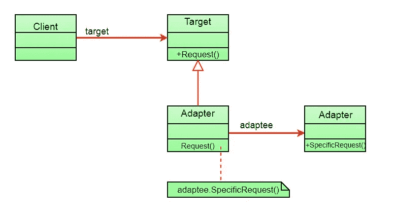
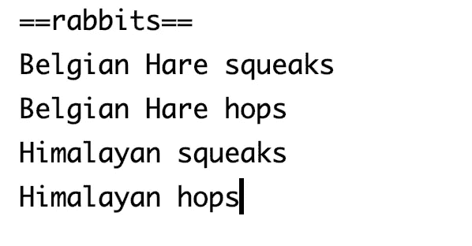

# Java 结构化设计模式完全指南:适配器模式

> 原文：<https://medium.com/javarevisited/a-complete-guide-to-structural-design-patterns-in-java-the-adapter-pattern-14b1c76fad6b?source=collection_archive---------1----------------------->

# 什么是设计模式？

一个[软件设计模式](/javarevisited/top-10-microservice-design-patterns-for-experienced-developers-f4f5f782810e)是一个通用的、可重用的解决方案，用于解决在[软件设计](https://javarevisited.blogspot.com/2022/08/top-7-websites-to-learn-system-design.html)中给定上下文中经常出现的问题。

# 我为什么要学习模式？

> *不用重新发明轮子，让生活更简单*

1.  软件设计中常见问题的**久经考验的**解决方案工具箱。
2.  定义团队和组织之间的共同语言，以解决与技术进步相关的新问题。
3.  开始理解库和语言中的模式。

# 模式分类

> *创造性*
> 
> *结构性*
> 
> *行为*

有 7 种结构设计模式:

1.  [适配器](https://javarevisited.blogspot.com/2016/08/adapter-design-pattern-in-java-example.html)
2.  桥
3.  外表
4.  [装饰者](https://javarevisited.blogspot.com/2011/11/decorator-design-pattern-java-example.html)
5.  轻量级
6.  [复合](https://javarevisited.blogspot.com/2018/02/composite-design-pattern-in-java-real.html)
7.  代理人

在本文中，我们将详细关注适配器设计模式。

# 用法:

> 让不兼容的类一起工作

它允许具有不兼容接口的对象通过结合两个独立接口的能力来协作。

# 存在的问题:

有一个类(客户端)期望使用某些对象。

突然，出现了一个新的需求，客户端类需要处理一个完全不同的对象，这个对象与现有的对象不兼容。

> 现实生活中的例子:
> 
> 我们使用的移动充电器是由于移动充电插座和墙上插座的电压要求不同而发明的。
> 
> 移动电池充电需要 3 伏，但普通插座产生 120 伏到 240 伏。因此， ***移动充电器充当移动充电插座和墙壁插座之间的适配器*** 。

# 适配器模式有什么帮助？

> 通过将一个类的接口转换成客户期望的另一个接口。

将有一个适配器类作为中介**并将实现现有的接口。 ***它将组成新的界面。*****

客户端现在向适配器发出请求(*不知道它是适配器，因为适配器仍然通过使用目标接口调用现有接口*上的方法来实现它。

适配器使用被适配器接口在被适配器上翻译该请求。

下面是 UML 图:

图片致谢—极客论坛

# 代码:

我们有一个玩具 **RabbitSimulator** 类，测试不同类型的玩具兔子发出的声音。

假设*我们缺少玩具兔子*，我们想用**火鸡**来代替它们。Turkeys 有一些类似的功能，但是实现了不同的接口，所以我们不能直接使用它们。

*下面是生产各种玩具兔子的客户端代码:*

*输出:*

*下面是兔子界面:*

*下面是兔子品种的具体实现:*

比利时野兔—

喜马拉雅山—

*介绍 Turkey 接口，它现在需要包含在我们上面讨论的客户端类中。*

*上述土耳其接口的具体实现:*

野生火鸡—

由于接口的不同，我们将使用一个' **TurkeyAdapter** '类，它将 ***实现* Rabbit *接口，而* Turkey *接口将成为适配器。***

*下面是火鸡适配器的代码:*

请注意，我们是如何将土耳其行为的自定义实现添加到被覆盖的方法中的。

*下面是最终修改后的客户端代码:* ***(* 不破坏任何现有逻辑)**

*输出*:

因此，在**适配器模式**的帮助下，我们已经能够在现有的客户端类中容纳一个全新的接口，而根本不需要修改客户端代码。

*如果你喜欢这篇文章，请点击“鼓掌”按钮👏有几次。*

给了我足够的动力去发布更多这样的内容。请分享给你认为这篇文章可能会有帮助的朋友。

关注我 [Varsha Das](https://medium.com/u/1afbfeaec6b0?source=post_page-----13737bd712da--------------------------------) 接收我的每周文章。

与我联系— [瓦莎达斯](https://www.linkedin.com/in/varsha-das-se/) | [领英](https://www.linkedin.com/in/varsha-das-se/)

关注我的 Youtube 频道— ***轻松代码—作者 Varsha*** ，在这里我们讨论数据结构&算法。

**感谢阅读。**

快乐学习！😁