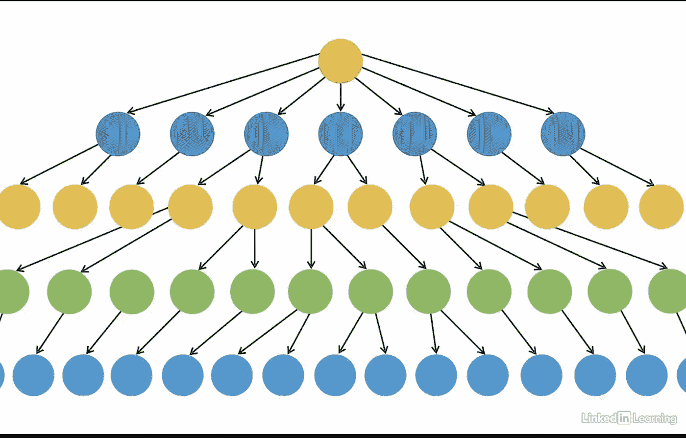

# Java 结构设计模式完全指南:桥模式

> 原文：<https://medium.com/javarevisited/a-complete-guide-to-structural-design-patterns-in-java-the-bridge-pattern-12cc6f886522?source=collection_archive---------0----------------------->

# 什么是设计模式？

[软件设计模式](https://dev.to/javinpaul/8-best-free-and-paid-websites-to-learn-system-design-and-software-design-2ig4)是一种通用的、可重用的解决方案，用于解决软件设计中给定环境下经常出现的问题。

# 我为什么要学习模式？

> *不用重新发明轮子，让生活更简单*

1.  **软件设计常见问题久经考验的**解决方案工具箱。
2.  定义团队和组织之间的共同语言，以解决与技术进步相关的新问题。
3.  开始理解库和语言中的模式。

# 模式分类

> *创造性*
> 
> *结构上的*
> 
> *行为*

我们已经讨论了创造模式——查看这里的[和](/@varshadas21)

有 7 种结构设计模式:

1.  [适配器](https://javarevisited.blogspot.com/2016/08/adapter-design-pattern-in-java-example.html)
2.  桥
3.  外表
4.  [装饰者](https://javarevisited.blogspot.com/2011/11/decorator-design-pattern-java-example.html)
5.  轻量级
6.  [复合](https://javarevisited.blogspot.com/2018/02/composite-design-pattern-in-java-real.html)
7.  代理人

在本文中，我们将详细讨论桥设计模式。

# 用法:

> 将抽象与其实现解耦，这样两者可以独立变化

简单地说，这种模式有助于**简化继承结构。**

桥模式包含一个**接口**作为桥，属于结构模式，因为这个模式*通过在实现类和抽象类*之间提供一个桥结构来解耦它们。

# 存在的问题:

见过使用大量继承的应用程序吗？

它从一棵漂亮简单的树开始，有一个父母和几个孩子。

随着时间的推移，你发现你需要添加另一个层次，一段时间后，你有一个巨大的继承树，看起来像这样。

可以使用桥接模式的一个经典例子是在图形用户界面中。你有一个名为**形状**的界面，在你的下面有一些类，比如**六边形、三角形和正方形**。

然后你可能决定你想要有不同的颜色形状，所以下一个合乎逻辑的步骤是扩展继承树有一个**蓝色六边形，一个红色三角形，一个绿色正方形，和一个红色六边形**等等。

> 每次你想添加一种颜色，你都要创建两个新的类。

这最终会导致更大的、重复的、难以理解的代码。

# 桥接模式有什么帮助？

> 分离出你的层次结构，使你的代码更加灵活。

桥设计模式的实现遵循组合优先于继承的概念。

根据上面的例子，桥模式允许实例化一个蓝色方块对象，例如， ***，而不需要编写一个蓝色方块类作为一个整体。***

相反，我们可以利用' ***独立的*** '方形类和蓝色形状类的特点。

通过这种方式，桥模式可以帮助编写更易维护的代码，它将具体的实现从接口中分离出来，并提供了更多的灵活性。

# 代码:

假设我们需要重构一个在画布上绘制不同类型按钮的应用程序。

有一个抽象类叫做**按钮**，在它下面，还有三个抽象类叫做**复选框**按钮、**下拉菜单**按钮和**单选按钮**按钮。在这一层之下是具体的类。

每种类型的按钮都有小型、中型和大型版本。所以这里混合了两个层次**，按钮的类型和按钮的大小。**

**预期产出:**

快速浏览一下 IDE 中的类:

相当多的课，是吧？

我们添加的按钮类型越多，这个工作流程就越复杂。

## ***让我们使用桥接模式*** 来分隔层次结构

我们创建了一个名为 ButtonSize 的接口，它有一个名为 getSize 的方法。

接下来，我们将有三个实现 ButtonSize 的类，分别叫做 LargeButtonSize、MediumButtonSize 和 SmallButtonSize。

它们都覆盖了 getSize()方法，并打印出按钮的大小。

现在，在不同类型的按钮 DropdownButton、CheckboxButton 和 RadioButton 的构造函数中，我们都在传递一个按钮大小的对象。

最后，在 Canvas 类 ***中，我们没有为每种大小和类型的按钮*** 创建单独的类，而是传入了一个新的 button-size 对象，它指定了我们想要的按钮的大小。

**输出:**

所以现在我们有了两个独立的层次结构，一个用于按钮类型，一个用于按钮大小，而不必创建很多新的类。

如果你喜欢这篇文章，请点击“鼓掌”按钮👏有几次。

给了我足够的动力去发布更多这样的内容。请分享给你认为这篇文章可能会有帮助的朋友。

关注我 [Varsha Das](https://medium.com/u/1afbfeaec6b0?source=post_page-----13737bd712da--------------------------------) 接收我的每周文章。

联系我— [瓦尔莎达斯](https://www.linkedin.com/in/varsha-das-se/) | [领英](https://www.linkedin.com/in/varsha-das-se/)

轻松关注我的 Youtube 频道— [***代码—作者 Varsha***](https://www.youtube.com/@codewithease-byvarsha) ，在这里我们讨论数据结构&算法。

**感谢阅读。**

快乐学习！😁