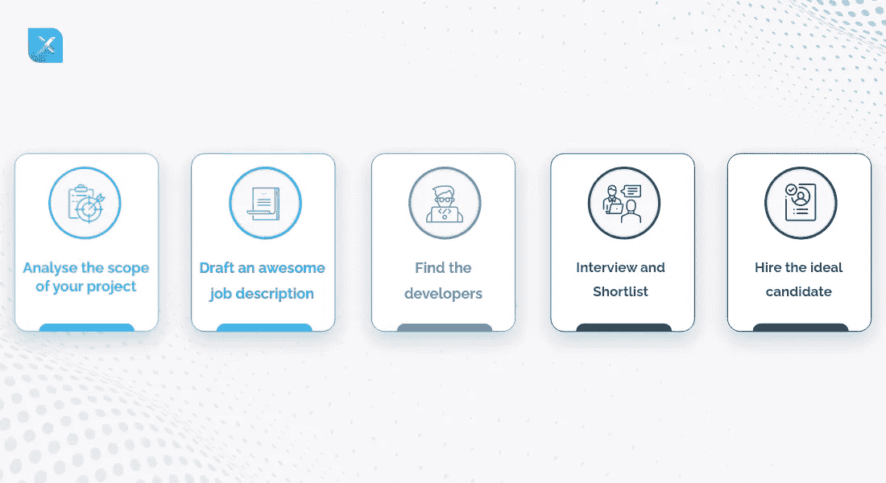

# 为您的公司找到理想开发人员的全面指南！

> 原文：<https://medium.com/javarevisited/a-comprehensive-guide-to-get-the-ideal-developer-for-your-firm-babb8f675075?source=collection_archive---------0----------------------->

编程的世界是广阔的，其中的语言也是如此。从基础的 [C](/javarevisited/10-best-c-programming-courses-for-beginners-2c2c1f6bcb12) 到 [Python](/javarevisited/10-free-python-tutorials-and-courses-from-google-microsoft-and-coursera-for-beginners-96b9ad20b4e6) ，开发语言已经走过了漫长的道路。与其他语言不同，广受欢迎的编程语言是 [Java](/javarevisited/10-best-places-to-learn-java-online-for-free-ce5e713ab5b2) 。如今，它被广泛用于开发各种顶级 app、网站、游戏等。

根据 2021 年的[栈溢出调查，Java 连续第九次占据第一的位置。Java 的广泛流行使得开发人员倾向于使用它。尽管有无数的 Java 开发人员，但他们可能并不都具备所需的专业知识。](https://insights.stackoverflow.com/survey/2021#:~:text=Newcomer%20Svelte%20takes%20the%20top,by%20one%20in%20four%20developers.&text=Perl%20moves%20from%20being%20the,place%20which%20belongs%20to%20F%23.)

因此，如果你正在[招聘 Java 开发人员](https://www.inexture.com/hire-java-app-developers/)，你就要小心了。而且，有策略超级关键。在本文中，我们将帮助您策划一个策略，帮助您筛选出最佳 Java 开发人员。

# 如何雇佣最好的 Java 开发人员？

一个典型的招聘 [Java 开发人员](/javarevisited/the-java-programmer-roadmap-f9db163ef2c2)的过程有点全面。有很多方面需要记住。如果你采用试凑法，可能不会找到理想的人选。你必须深入挖掘需求、技能、项目范围等。

# 分析项目的范围

雇佣 Java 程序员的第一步是要知道你的项目是什么，它需要什么。比如你在做一个基于 Java 的游戏，需求就会不一样。而且，如果是针对一个 app，需求也会不一样。

要为您的 Java 项目找到最好的开发人员，您需要分析项目的各个关键方面。它们可能包括但不限于以下内容:

*   功能
*   功能
*   目标
*   市场
*   预算
*   营销需求

当你有了关于它们的信息，你和开发者就更容易知道它们的发展方向。

除此之外，你还需要检查它是一个什么样的项目。例如，如果是一个 [Java 游戏开发项目](/javarevisited/6-best-game-development-books-courses-for-java-and-android-developers-3861bdaa4a79)，Java app 开发、网站开发、迁移、升级等。由于每个项目所需的专业知识是不同的，因此了解项目类别是必要的。

一方面，游戏开发需要优秀的图形技能，但 web 开发需要 web 技术方面的专业知识。

在[雇佣开发商](https://www.inexture.com/hire-dedicated-developer/)之前，运营模式是你需要分析的第三个方面。你会为现有团队雇佣新的开发人员吗？你是打算雇佣远程开发人员还是整个远程团队？根据选择，您的需求可能会受到影响。

最后，考虑一下您当前的团队！你需要一个开发人员来满足特定的需求还是整个过程？在开始招聘之前，确保你已经得到了这些问题的答案。

# 起草一份出色的工作描述

在对项目进行自上而下的分析之后，是时候创建一个工作描述了。虽然这看起来是一个简单的任务，但事实并非如此。一份精心起草的职位描述在你的招聘过程中起着至关重要的作用。因此，你需要确保它是正确的。

首先，你需要确定确切的需求。你需要的是一个特定的开发人员还是一个开发团队？你需要一个内部开发人员，还是想要[的离岸 Java 开发人员](https://www.inexture.com/6-unexpected-benefits-you-get-when-you-outsource-java-development/)？

当你知道你需要什么类型的开发人员时，你需要做一份工作描述。根据所需的专业知识水平，您可以包括以下内容:

*   职位名称(初级、高级或首席开发人员)
*   团队中的角色
*   报告官员
*   主要职责(设计、开发、维护和管理 Java 应用程序。)
*   目标
*   需要的软技能和技术技能(通信、[核心 Java](/javarevisited/5-best-core-java-books-for-beginners-20e3f723e3a) 、Java EE 组件等)。)

# 找到开发商

在你完成了最好的 JD(工作描述)之后，你可以传阅它，并在那里找到最好的开发人员。您可以通过各种方法开始搜索，例如:

*   **LinkedIn:** 无论你是想[雇佣一家 Java 开发公司](https://www.inexture.com/strategy-to-hire-your-next-java-development-company/)还是一个单独的 Java 开发人员，LinkedIn 都可以是最好的起点。
*   像 Upwork 这样的自由职业者平台:雇佣一个 Java 开发人员最好的方法是通过一个自由职业者平台，比如 Upwork，Fivver 等。
*   **活动和推荐:**如果你喜欢参加科技活动和会议，它们可能是 Java 开发人员的绝佳去处。另一方面，你可以利用你的社交圈进行推荐。
*   **求职门户:**你可以制作一份法学博士学位，然后像 Indeed 一样上传到在线求职门户。肯定会吸引求职。
*   顾问:一个工作顾问可以大大减少你的招聘麻烦。公司雇佣顾问是为了加快招聘过程。由于他们有一份合适的候选人名单以及他们的专业知识，他们可以为公司减少很多麻烦。

# 面试和入围名单

当你在网上发布完职位描述后，你会收到大量潜在候选人的简历。在这里，你需要根据他们的技能、经验、证书、承担的项目等列出候选名单。

Java 在开发领域已经存在很长时间了。它经历了无数次升级和增加。所以，当你雇佣一名 Java 顾问时，要确保他们具备所需的技能。你可以很容易地从他们的简历或他们在面试中的实际操作技能中看出这一点。

以下是 Java 开发人员需要的一些技术技能！

1.  基本的 Java 概念，如 [OOP](/swlh/5-free-object-oriented-programming-online-courses-for-programmers-156afd0a3a73) ，抽象类，序列化，[数据结构](/javarevisited/10-data-structure-algorithms-and-programming-courses-to-crack-any-coding-interview-e1c50b30b927)，算法等等。
2.  像 HTML，JQuery，CSS， [React](https://javinpaul.medium.com/top-5-courses-to-learn-react-js-in-2019-best-of-lot-fa02cd96cdf0) ， [Angular](/javarevisited/is-full-stack-web-development-with-angular-specialization-on-coursera-worth-it-review-e1077792f6af) 等 Web 技术。
3.  Java EE 和其他组件，如 Servlets 和 Java Beans。
4.  像 Play、 [Spring MVC](/javarevisited/my-favorite-spring-mvc-courses-for-java-developers-5ede7f85dd88) 、Struts 等 Java 框架。
5.  应用程序容器
6.  Java 测试工具如 TestNG、Selenium、 [JUnit](/javarevisited/5-courses-to-learn-junit-and-mockito-in-2019-best-of-lot-f217d8b93688) 等。
7.  提高质量的坚实原则
8.  [Java IDE (Intellij IDE，Eclipse)](https://www.datasciencecentral.com/top-java-ides-meant-to-enhance-java-development-services/)
9.  开发工具和构建工具

除了技术技能，你还需要检查非技术技能来[雇佣 Java 开发者进行应用开发](https://www.inexture.com/hire-java-developers-for-application-development/)。您雇佣的开发人员应该具备以下技能:

1.  时间管理
2.  通讯技能
3.  能够在团队和不同团队中工作
4.  人际关系技巧
5.  能够跟上所有最新的升级、变化和趋势

评估完技能后，是时候实际分析它们了。为此，你需要面试候选人！这里有一些测试，会让你很容易判断候选人。

*   核心 Java 能力倾向测验
*   高级 Java 测试(针对高级开发人员)
*   Java MCQ 测试(针对 Java 架构师角色)
*   Liferay 在线测试
*   全栈开发者测试
*   春季开机在线测试

这些测试结果出来后，你只要测试基本的技术和非技术技能就行了。你可以根据你需要应聘者具备的技能类型制作一份调查问卷。

# 雇用理想的候选人

基于测试和面试的综合过程，你可以为你的 [Java 开发公司](https://www.inexture.com/services/java-development/)雇用理想的候选人。确保新候选人清楚以下事项！

1.  项目角色
2.  项目要求
3.  薪资或薪酬方案
4.  质量标准
5.  工作时间
6.  通信电路
7.  组织层级和文化

拥有一个计划好的、有组织的入职流程可以让新开发人员融入公司环境。

# 你要付给一个 Java 开发者多少钱？

这里的一个关键问题是，Java 开发人员应该得到多少报酬？

根据 Glassdoor，Java 开发人员的平均年薪是 93，118 美元。一名 Java 开发的新生可以拿到相当于或超过 68，000 美元的工资。

Java 是当今最好的语言之一，它的开发者也是如此。如果你计划为你的 [Java 开发服务](https://www.inexture.com/services/java-development/)雇佣开发人员，你需要小心，因为所有的开发人员可能都不在理想的范畴内。你的过程应该是严格的，定性的，全面的。

最初发布于[https://www . in ture . com/hire-Java-developers-for-next-project/](https://www.inexture.com/hire-java-developers-for-next-project/)