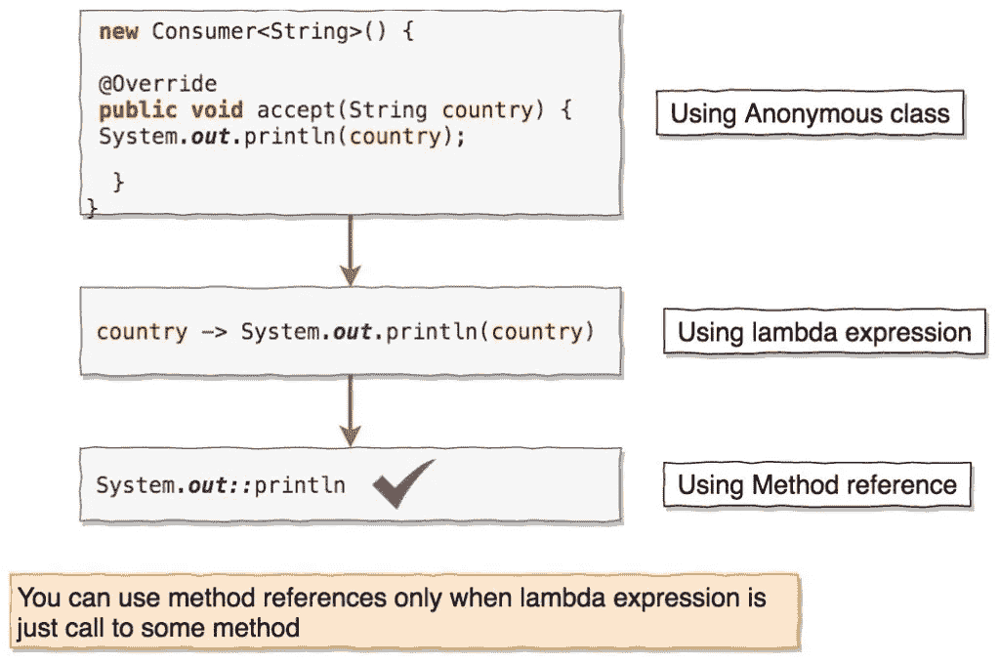
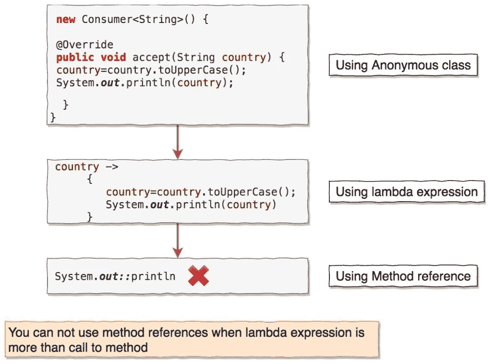

# Java 8 方法参考综合指南

> 原文：<https://medium.com/javarevisited/a-comprehensive-guide-to-java-8-method-reference-f0bf5457b72d?source=collection_archive---------0----------------------->

[Java 8](https://java2blog.com/java-8-tutorial/) 引入了许多新特性，如 [lambda 表达式](https://java2blog.com/lambda-expressions-in-java-8/)、流、方法引用等。

在这篇文章中，我们将看到什么是方法引用，以及我们如何使用它。我会尽量提供更多的例子，而不是理论。

# 方法参考简介

`Method references`是特殊类型的 [lambda 表达式](https://java2blog.com/lambda-expressions-in-java-8/)，它们只执行一种方法。
**方法引用的一般语法:**

> 对象::方法名称

你可能已经猜到你需要先理解 lambda 表达式。如果你对 lambda 表达式感到满意，那么让我们继续。

*   [Java 8 中的 Lambda 表达式](https://java2blog.com/lambda-expressions-in-java-8/)
*   [Java 8 中的函数接口](https://java2blog.com/java-8-functional-interface-example/)

让我们借助例子来理解这一点。

让我们创建一个类`MethodReferecesLambdaExpressionMain`，我们将在其中使用 stream 的 [foreach](https://java2blog.com/java-8-foreach-examples/) 方法打印列表。

**输出:**

> =======================
> 使用匿名类
> = = = = = = = = = = = = = = = = = = = =
> 印度
> 中国
> 尼泊尔
> 俄罗斯
> = = = = = = = = = = = = = = = = = = =
> 使用 lambda 表达式
> = = = = = = = = = = = = = = = = =
> 印度
> 中国
> 尼泊尔
> 俄罗斯
> = = = = = = = = = = = = = = = = = = = = = = = =

`stream.foreach()`方法以[消费者](https://java2blog.com/java-8-consumer-example/)功能接口为参数。

[消费者](https://java2blog.com/java-8-consumer-example/)是接受单个参数且不返回任何内容的函数接口。
我们以 3 种方式使用消费者功能界面。

> **1。使用匿名类**
> 消费者 consumer1 =新消费者(){
> 
> @Override
> public void accept(字符串国家){
> System.out.println(国家)；
> }
> }；
> 
> **2。使用λ表达式**
> 
> Consumer Consumer 2 = country->system . out . println(country)；
> 
> **3。使用方法引用**
> 
> Consumer Consumer 3 = system . out::println；
> 
> *你可能已经知道可以使用 lambda 表达式来代替匿名类，但是只有当 lambda 表达式只是调用一个方法时，你才可以使用方法引用。*

所以如果你看看下面的语法:

`Consumer consumer3 = System.out::println;`

在方法引用中，我们在`::`之前有类或对象，在`::`之后有方法名，没有参数。

你注意到方法引用没有参数了吗？是的，我们不需要将参数传递给方法引用，参数是根据方法引用的类型在内部自动传递的。

下面的图表将使它更清楚。
您可以使用如下方法参考:

假设您想在打印之前将`country`转换成`uppercase`。您可以使用`anonymous class`和`lambda expression`来实现它，但不能使用方法引用。

您不能使用方法引用，如下所示:

显然，在打印之前，可以使用流的 [map()](https://java2blog.com/java-8-stream-map/) 方法将`country`转换为`uppercase`。我只是想演示一下方法引用什么时候不能用。

# 方法引用的类型

有四种类型的方法引用。

1.  静态方法的引用
2.  引用对象类型的实例方法
3.  引用现有对象的实例方法
4.  引用构造函数

# 静态方法的引用

当你有一个调用静态方法的 lambda 表达式时，你就可以引用静态方法。

λ表达式语法
`(args) -> ClassName.someStaticMethod(args)`
可以转换为
`ClassName::someStaticMethod`

让我们借助例子来看看这一点。

创建一个类名`PowerFunctions`

[函数](https://java2blog.com/java-8-function-example/)是接受单个输入 T 并返回单个输出 r 的函数接口。

我们可以如下调用`calculatePowOf2ForList()`:

当您运行上面的程序时，您将得到下面的输出:

> [1，4，9，16，25]
> 【1，4，9，16，25】
> 【1，4，9，16，25】

如果您注意到，`Function<Integer,Integer> function2 = (num) -> PowerFunctions.power(num);`在这里属于类型`(args) -> className.someStaticMethod(args)`
，

*   `PowerFunctions`是类名
*   someStaticMethod 是`power`方法
*   `num`是权法论证。

我们在 lambda 表达式中调用了类`PowerFunctions`的静态方法`power`，这就是为什么我们可以将它用作方法引用。

所以我们可以用
代替
`Function<Integer,Integer> function2 = (num) -> PowerFunctions.power(num);`

这里，

*   `Function`(整数)的第一个类型参数是静态方法`power()`的第一个参数。
*   `Function` (Integer)的第二个类型参数是静态方法`power()`的返回类型。

# 引用对象类型的实例方法

当你有一个 lambda 表达式，其中对象的实例被传递并调用一个带有/不带有参数的实例方法时，那么你可以使用方法引用一个带有对象类型的实例方法。

λ表达式语法
`(obj,args) -> obj.someInstanceMethod(args)`
可以转换为
`objectType::someInstanceMethod`

让我们借助例子来看看这一点。

`BiFunction`是接受两个参数并返回单个输出的函数接口。

如果你注意到了，`BiFunction<String,Integer,String> bf2 = (t,u) -> t.substring(u);`的类型是`(obj,args) -> obj.someInstanceMethod(args)`

这里，

*   `obj`属于字符串类型。
*   someInstanceMethod 是 String 的`substring()`方法。
*   args 是用于`substring()`方法参数的`beginIndex`。

所以`BiFunction<String,Integer,String> bf2 = (t,u) -> t.substring(u);`可以转化为
`BiFunction<String,Integer,String> bf3 = String::substring;`

这里，

*   第一个`BiFunction`参数类型(字符串)是字符串对象本身。
*   第二个`BiFunction`参数类型(整数)是`substring()`方法的自变量
*   第三个`BiFunction`参数类型(字符串)是`substring()`方法的返回类型

# 引用现有对象的实例方法

当你有一个 lambda 表达式，其中对象的实例被用来调用一个有/没有参数的实例方法，那么你可以使用方法引用一个现有对象的实例方法。
λ表达式语法
`(args) -> obj.someInstanceMethod(args)`
可以转换为
`objectType::someInstanceMethod`

这里`obj`是在别处定义的，不是 lambda 表达式的参数的一部分。

让我们借助例子来理解。

创建一个名为`Country.java`的类。

创建另一个类`MethodReferenceExistingObjectMain.java`

**输出:**

> [ name =印度人口= 20000]
> 【name =印度人口= 30000】
> 【name =印度人口= 40000】

消费者是接受单个参数且不返回任何内容的函数接口。如果你注意到的话，`Consumer popCons2 = (population) -> c.setPopulation(population);`的类型是`(args) -> obj.someInstanceMethod(args)`

这里

*   obj 的类型是 Country，并在其他地方声明。
*   某些实例方法是国家的设定人口方法。
*   对于 setPopulation 方法参数，args 是`population`。

所以`Consumer<Long> popCons2= (population) -> c.setPopulation(population);`可以转化为`Consumer<Long> popCons3 = c::setPopulation;`

这里，

*   第一个使用者参数类型(Long)是 setPopulation 方法的参数。

# 引用构造函数

当 lambda 表达式用于创建带/不带参数的新对象时，那么可以使用引用方法构造函数。
λ表达式语法
`(args) -> new ClassName(args)`
可以转换为
`ClassName::new`

让我们借助例子来看看。
这里我们将使用方法引用将列表转换为集合。

`Function<List,Set>`是一个函数接口，它接受一个参数列表，并通过调用 HashSet [构造函数](https://java2blog.com/constructor-java/) `public HashSet(Collection<? extends E> c)`返回 set

**输出:**

[斯内哈，安迪，洛汗]
【斯内哈，安迪，洛汗】
【斯内哈，安迪，洛汗】

如果你注意到了，`Function<List<String>,Set<String>> f2 = (nameList) -> new HashSet<>(nameList);`的类型是`(args) -> new ClassName(args)`

这里

*   参数的类型为`list`
*   类名是`HashSet`

所以`Function<List<String>,Set<String>> f2 = (nameList) -> new HashSet<>(nameList);`可以转化为`Function<List<String>,Set<String>> f3= HashSet::new;`

这里，

*   第一个`Function`参数类型(列表)是 HashSet 构造函数的参数。

# 锻炼

让我们在方法参考的基础上练习几个练习。

# 练习:1

给定一个整数列表，你需要找到列表中每个数的平方根并作为 List <double>返回。
需要调用 Math 的`sqrt`静态方法求数的平方根，作为`method reference`。</double>

***解决方案:***
我们可以用方法引用创建[函数](https://java2blog.com/java-8-function-example/)函数接口，并将其传递给[流的 map](https://java2blog.com/java-8-stream-map/) 方法。

**输出:**

> 5.0，6.557438524302，7.211102550927978，5.567767676436，283005，9.0
> 【5.0，6.5574385385，24302，7.2111025095

# 练习:2

给定一个列表字符串，你需要将所有的字符串转换成`uppercase`然后返回一个新的列表<字符串>。

***解决方案:***
我们可以用方法引用创建[函数<字符串，字符串>](https://java2blog.com/java-8-function-example/) 函数接口并将其传递给 Stream 的 [map](https://java2blog.com/java-8-stream-map/) 方法。

**输出:**

> 安德鲁，玛丽，索汉，黛比

如果你注意到，我们在 lambda 表达式中调用 String 的`toUpperCase()`，因此
我们可以将`Function<String,String> function1= (name) -> name.toUpperCase();`
转换为
`Function<String,String> function2= String::toUpperCase;`。

# 练习:3

给定一个颜色对象列表，你需要按照颜色的名称对它们进行排序，并返回一个排序后的颜色名称列表(`List<String>` )
这里是颜色类的定义。

***解决方法:***
我们可以使用[图](https://java2blog.com/java-8-stream-map/)中的方法引用，排序方法如下。

**输出:**

> = = = = = = = = = = = = = = = = = = = = = = = = = = = =
> 使用λ表达式
> = = = = = = = = = = = = = = = = = = = = = =
> 蓝色
> 绿色
> 红色
> 白色
> = = = = = = = = = = = = = = = = = = = = = = =
> 使用方法参考
> = = = = = = = = = = = = = = = = = = =
> 蓝色
> 绿色
> 红色
> 白色

# 结论

方法引用是简单调用方法的特殊类型的λ表达式。它使代码更加易读和简洁，但是如果方法引用导致任何混乱，那么使用它们就没有意义。

# Java 8 教程系列

*   [Java 8 教程](https://java2blog.com/java-8-tutorial/)
*   [Java 8 功能接口](https://java2blog.com/java-8-functional-interface-example/)
*   [Java 8 lambda 表达式](https://java2blog.com/lambda-expressions-in-java-8/)
*   [Java 8 可选](https://java2blog.com/java-8-optional/)
*   [Java 8 面试问题](https://java2blog.com/java-8-interview-questions/)

这就是 java 中方法引用的全部内容。

 [## 我最喜欢的深入学习 Java 的免费课程

### 我的免费课程列表深入学习 Java 从核心 Java 到多线程到 JDBC 到合集，什么都有…

medium.com](/javarevisited/10-free-courses-to-learn-java-in-2019-22d1f33a3915)  [## 7 本学习 Lambda 表达式和流 API 的最佳 Java 教程和书籍，以及函数式…

### 虽然术语“lambda 表达式”听起来可能很抽象和学术化，但 Java 8 Lambdas 可能会对您如何…

medium.com](/javarevisited/7-best-java-tutorials-and-books-to-learn-lambda-expression-and-stream-api-and-other-features-3083e6038e14)  [## 我最喜欢的 2020 年学习软件架构的课程——最好的

### 这些是 2020 年学习软件架构并成为解决方案架构师的最佳课程

medium.com](/javarevisited/top-5-courses-to-learn-software-architecture-in-2020-best-of-lot-5d34ebc52e9)