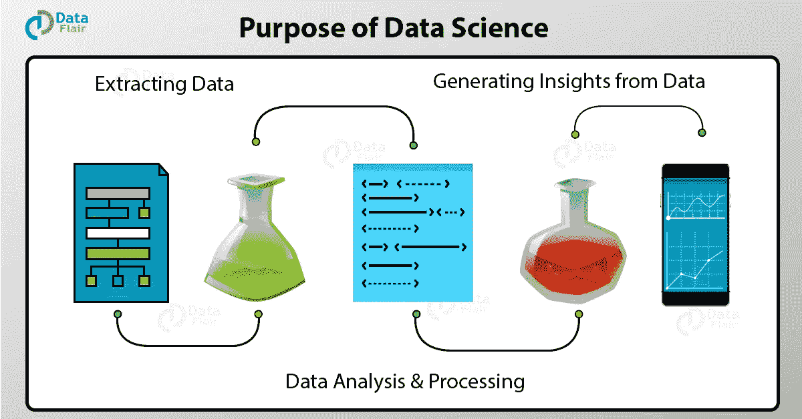
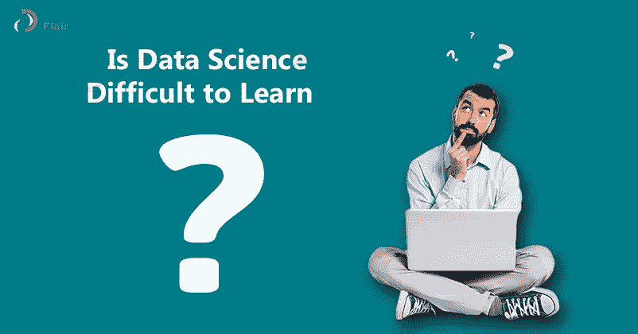

# 数据科学家的一天

> 原文：<https://medium.com/javarevisited/a-day-in-the-life-of-a-data-scientist-998189dab87c?source=collection_archive---------0----------------------->

数据科学是一个多维领域，它使用科学方法、工具和[算法](/javarevisited/10-data-structure-and-algorithms-articles-programmer-should-read-this-week-585404a9403b)从结构化和非结构化数据中提取知识和见解。

## ***听过这个定义 n 次了吧？我希望书生气永远是真的。***

事实上，数据科学家不仅仅是研究数据。诚然，他的工作围绕着数据，但除此之外，它还涉及许多其他基于数据的过程。

这个多学科领域。它涉及科学和统计方法、过程、[算法开发](https://hackernoon.com/10-data-structure-algorithms-and-programming-courses-to-crack-any-coding-interview-e1c50b30b927)和技术的系统融合，以从数据中提取有意义的信息。

还可以了解数据科学 所需的必要工具和[**技能。**](https://data-flair.training/blogs/data-science-skills/)

***那么，所有这些领域是如何协同工作的呢？***

要理解这一点，您需要了解数据科学的流程/数据科学家的日常工作:

## **1)提出问题来构建业务问题**

第一步，试着了解一家公司的需求是什么，并在此基础上提取数据。通过提出正确的问题来找出问题所在，你开始了数据科学的过程。就拿一个包包公司很常见的问题来说吧——销售问题。

对于问题的分析，你需要从**问很多问题**开始:

谁是目标市场和客户？

你如何接近目标市场？

*c)销售流程目前看起来如何？*

你对目标市场有什么了解？

我们如何识别更有可能购买我们产品的顾客？

在与营销团队讨论之后，你需要关注这个问题:“我们如何识别更有可能购买我们产品的潜在客户？”等等！你还怀疑还是觉得很难学？然后，检查出 [**数据科学难学！神话还是真相？**](https://data-flair.training/blogs/is-data-science-difficult/) 澄清你的困惑。

你的下一步是弄清楚你能得到什么数据来回答上述问题。

## **2)获取分析问题的相关数据**

现在，您已经了解了您的业务问题，是时候收集将帮助您解决问题的数据了。在收集数据之前，你应该问公司是否已经有了所需的数据？

在许多情况下，您可能会获得以前在其他调查中收集的数据集。需要与以下相关的数据:*年龄、性别、以前的客户交易历史等。*对这些数据的需求非常重要，这也是 Salesforce 和 Tableau 达成价值 153 亿美元的 [**交易的原因。**](https://data-flair.training/blogs/salesforce-tableau-big-deal/)

您发现大多数与客户相关的数据都在公司的客户关系管理(CRM)软件中，由销售团队管理。

SQL 数据库是 CRM 软件的后台工具，有多个表。当您浏览 [SQL 数据库](https://hackernoon.com/top-5-sql-and-database-courses-to-learn-online-48424533ac61)时，您会发现该系统存储了客户的详细身份、联系方式和人口统计信息(他们向公司提供了这些信息)以及他们的详细销售过程。查看 [**SQL 教程**](https://data-flair.training/blogs/sql-tutorial/) 获得更多见解。

如果你认为现有的数据不够充分，那么你必须安排收集新的数据。您甚至可以通过展示或分发反馈表来获取访问者和客户的反馈。我同意，这是大量的工程工作，需要时间和精力。

您收集的数据实际上是包含错误和缺失值的**【原始数据】**。所以在你分析数据之前，你需要清理(争论)数据。

## **3)探索数据以进行错误纠正**

探索数据实际上是清理和组织数据。数据科学家 70%以上的时间都花在这个过程上。尽管收集了所有的数据，但您还没有准备好使用它，因为您收集的原始数据通常可能包含一些奇怪的东西。

首先，你需要确保数据是干净的，没有错误。这是过程中最重要的步骤，需要耐心和专注。

为此使用了各种工具和技术，如**[*R*](https://hackernoon.com/5-free-r-programming-courses-for-data-scientists-and-ml-programmers-5732cb9e10)*[*SQL*](https://javarevisited.blogspot.com/2018/05/top-5-sql-and-database-courses-to-learn-online.html)等。***

**然后，你开始回答这些问题:**

***数据中是否有缺失值，即是否有没有联系电话的客户？***

***有没有无效值？如果有，怎么修？***

***是否有多个数据集？合并数据集是个好选择吗？如果是，那么你应该如何合并它们？***

**一旦在数据中发现缺失值和错误值，就可以进行分析了。请记住，从数据中获得错误的洞察力比完全没有洞察力更糟糕。**

## ****4)为深入分析建立数据模型****

**浏览完数据后，您就有足够的信息来创建一个模型来回答这个问题:“我们如何识别更有可能购买我们产品的潜在客户？”**

**在这一步中，您分析数据以从中获取信息。分析数据需要应用各种算法，从中提取意义:**

***建立数据模型回答问题***

***根据收集的数据验证模型***

***使用各种可视化工具呈现数据***

***执行必要的算法和统计分析***

***将结果与其他技术和来源进行比较***

**但是，回答这些问题只会给你提示和假设。数据建模是一种简单的方法，可以用机器能够理解的适当方程来近似数据。你应该能够根据模型做出预测。为了找到最合适的，你可能要尝试几种型号。**

**回到销售问题，这个模型将能够帮助你预测哪些客户更有可能购买。预测可以是具体的，比如生活在印度的 16-36 岁的女性。**

## ****5)传达分析结果****

**沟通技能是数据科学家工作的重要组成部分，但也非常被低估。这实际上将是你工作中非常具有挑战性的一部分，因为它涉及到以一种他们容易理解的方式向公众和团队的其他成员展示你的发现。**

**您需要有效地传达之前指出的问题的结果:**

***用工具将信息图形化或图表化展示-***[*Python*](https://hackernoon.com/10-free-python-programming-courses-for-beginners-to-learn-online-38312f3b9912)*、Tableau、Excel*****

***使用“讲故事”来拟合结果***

***回答各种后续问题***

***以不同格式呈现数据——报告、网站***

**相信我，答案总会引发更多的问题，过程又重新开始。**

# ****概要:****

**希望你已经了解了数据科学的流程。这是数据科学家工作中的一天。**具体任务包括:****

*   **识别与为组织提供巨大机会的数据相关的分析问题。**
*   **从各种不同的来源收集大量结构化和非结构化数据。**
*   **确定正确的数据集和变量。**
*   **清理和消除数据中的错误，以确保准确性和完整性。**
*   **提出并应用模型、算法和技术来挖掘大数据的存储。**
*   **分析数据以发现隐藏的模式和趋势。**
*   **解读数据以发现解决方案和机会，并据此做出决策。**
*   **使用可视化和其他方式向经理和其他人传达调查结果。**

**数据科学是一个基于多个领域的广阔领域。日常工作不是小菜一碟，但需要基础领域的知识。但是，正如人们所说的那样，天下没有免费的午餐，获得数据科学技能也是有代价的。**

**希望你喜欢阅读这篇文章。**

# **相关主题—**

1.  **[**为什么要学数据科学？**](https://data-flair.training/blogs/why-learn-data-science/)**
2.  **[**数据科学的目的是什么？知道它的重要性**](https://data-flair.training/blogs/purpose-of-data-science/)**
3.  **[**数据科学先决条件——每个数据科学家需要具备的顶级技能**](https://data-flair.training/blogs/get-your-first-job-in-data-science/)**
4.  **[**吴恩达的机器学习**](https://click.linksynergy.com/fs-bin/click?id=JVFxdTr9V80&subid=0&offerid=467035.1&type=10&tmpid=18061&RD_PARM1=https%3A%2F%2Fwww.coursera.org%2Flearn%2Fmachine-learning)**
5.  **[**数据科学 A-Z:真实数据科学练习包括**](https://click.linksynergy.com/fs-bin/click?id=JVFxdTr9V80&subid=0&offerid=323058.1&type=10&tmpid=14538&RD_PARM1=https%3A%2F%2Fwww.udemy.com%2Fdatascience%2F)**
6.  **[**8 大 Python 机器学习库**](https://javarevisited.blogspot.com/2018/10/top-8-python-libraries-for-data-science-machine-learning.html)**
7.  **[**排名前五的数据科学和机器学习课程**](https://hackernoon.com/top-5-data-science-and-machine-learning-course-for-programmers-e724cfb9940a)**
8.  **[**前 5 名 TensorFlow 和机器学习课程**](https://hackernoon.com/top-5-tensorflow-and-ml-courses-for-programmers-8b30111cad2c)**
9.  **[**学习 Python 最好的 5 门课程**](http://javarevisited.blogspot.sg/2018/03/top-5-courses-to-learn-python-in-2018.html)**
10.  **[**一个日本黄瓜农如何使用深度学习和 TensorFlow**](https://cloud.google.com/blog/products/gcp/how-a-japanese-cucumber-farmer-is-using-deep-learning-and-tensorflow)**