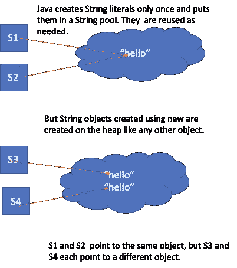
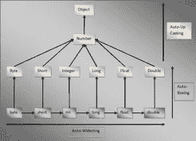
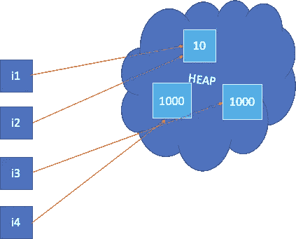
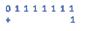

# 有趣的 Java 脑筋急转弯

> 原文：<https://medium.com/javarevisited/a-few-java-brain-teasers-73d980bbe0e1?source=collection_archive---------0----------------------->


由[奥拉夫·阿伦斯·罗特内](https://unsplash.com/@olav_ahrens?utm_source=medium&utm_medium=referral)在 [Unsplash](https://unsplash.com?utm_source=medium&utm_medium=referral) 拍摄的照片

我想出了一些 Java 难题，只是为了刷新我们对 Java 微妙之处的知识。

1.  **下面这个函数的输出是什么？**

```
*public static void function() {**String s1 = "hello";**String s2 = "hello";**String s3 = new String("hello");**String s4 = new String("hello");**if (s1 == s2)**System.out.println("s1 == s2");**if (s3 == s4)**System.out.println("s3 == s4");**}*
```

**2。将执行下面两个函数中的哪一个？**

```
*public void function(long l) {**System.out.println(“long”);**}**public void function(Integer i) {**System.out.println(“Integer”);**}**int i  = 10;**function(i);*
```

3.下面函数的输出会是什么？

```
*public static void function() {**Integer i1 = Integer.valueOf(10);**Integer i2 = Integer.valueOf(10);**Integer i3 = Integer.valueOf(1000);;**Integer i4 = Integer.valueOf(1000);**if (i1 == i2)**System.out.println("i1 == i2");**if (i3 == i4)**System.out.println("i3 == i4");**}*
```

4.**I，j，k 的值分别是多少？**

```
*public void function(int i, int j, int k) {**System.out.println(i);**System.out.println(j);**System.out.println(k);**}**int i = 10;**function(i++, i++, i++);*
```

5.**I 的什么非零值会使它等于下面函数中的 j？**

```
*public static void function() {**int i =* ***??;****int  j  =  i  * -1;**if* (i == j && i != 0) *{**System.out.println (“i ==  j”);**}**}*
```

如果你需要更多的问题，在你去面试之前回顾一下这些 Java 面试问题

<https://codeburst.io/review-these-50-questions-to-crack-your-java-programming-interview-69d03d746b7f>  

# **准备好解决方案了吗？**

1.  该函数的输出将是“s1 == s2”。

[](https://medium.com/javarevisited/top-10-frameworks-full-stack-java-developers-can-learn-in-2020-5995021401e5)

S1 和 S2 指向同一个对象，而 S3 和 S4 指向堆中不同的对象。然而，如果你使用*等于*的方法来比较字符串，所有的 4 个对象，S1、S2、S3 和 S4 将是*彼此等于*。

2.完美匹配是具有整数原始参数的函数，

```
function(int i){} 
```

在没有这种函数的情况下，下一个最佳匹配是接受长整型的函数。



因为 function(int i)不存在，所以自动加宽首先发生，然后自动装箱以找到下一个最佳匹配。如果没有找到合适的原语，JVM 会自动将原语 int 打包成 integer 对象。

3.“i1”和“i2”指向同一个对象，但“i3”和“i4”指向不同的对象。

[](https://medium.com/javarevisited/top-5-java-online-courses-for-beginners-best-of-lot-1e1e240a758)

Java 有一个整数缓存。默认情况下，JVM 会在缓存中存储-128 到 127 范围内的整数对象，以便重用这些对象。

4.“I”、“j”和“k”将分别是 10、11 和 12。

在 Java 中，函数参数(实际参数)是从左到右计算的。

5.将“I”设置为整数。最小值


整数。MIN_VALUE 以二进制表示，除了最左边的位，其他都是 0。



乘以-1 就是取一个数的二进制补码，也就是 1 的补码(翻转位)加 1。


结果又是`Integer.MIN_VALUE`。

如果你想重温 Java 知识，我推荐这两本我最喜欢的书

[头一版 Java，第二版。](https://amzn.to/2x2k9QI)

[有效 Java](https://www.amazon.com/gp/product/0134685997/ref=as_li_tl?ie=UTF8&tag=programmi0c59-20&camp=1789&creative=9325&linkCode=as2&creativeASIN=0134685997&linkId=8e15e4fac9358f2bf070188551dd990a)

阿什·默西是一名[编程面试教练。](http://www.programminginterviewprep.com)你可以联系他进行面试指导，为脸书、谷歌和亚马逊等顶级科技公司的编码面试做准备。

# 您可能喜欢的其他文章:

</javarevisited/10-free-courses-to-learn-java-in-2019-22d1f33a3915>  </javarevisited/my-favorite-books-to-learn-java-in-depth-must-read-9c4468aeec99>  </free-code-camp/these-are-the-best-free-courses-to-learn-data-structures-and-algorithms-in-depth-4d52f0d6b35a> 