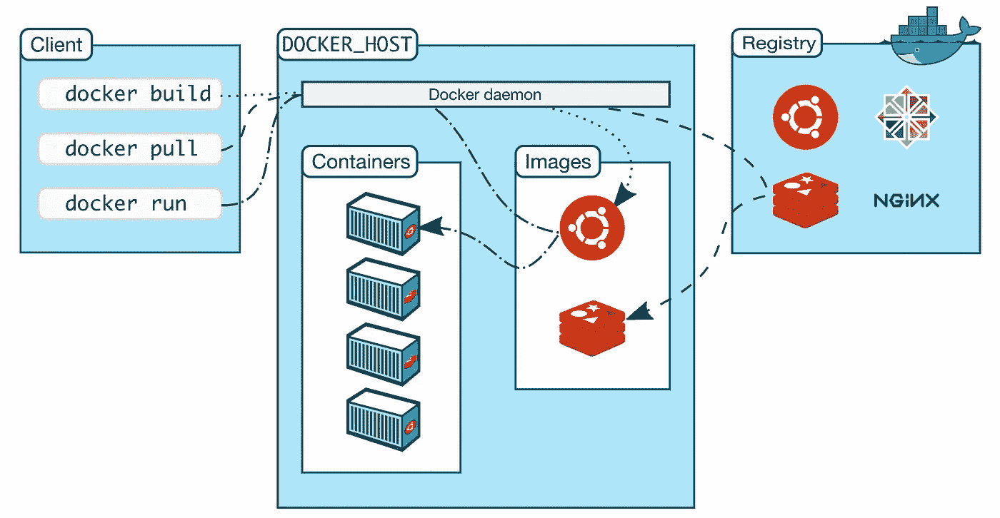

# 初学者 Docker 基础指南

> 原文：<https://medium.com/javarevisited/a-fundamental-guide-to-docker-for-beginners-4dd2b69ffdc1?source=collection_archive---------0----------------------->

在我之前的文章中，我已经讨论了 Docker 是什么以及我们为什么需要它。我建议你仔细阅读那篇文章，了解 Docker 是什么，以及使用 [Docker](/javarevisited/5-best-docker-courses-for-java-and-spring-boot-developers-bbf01c5e6542) 将应用程序容器化的必要性

[](https://www.java67.com/2021/04/top-5-courses-to-learn-docker-for-java.html)

[图片来源](https://www.docker.com/)

# 码头工人

首先， [**Docker**](/javarevisited/top-5-free-courses-to-learn-docker-for-beginners-best-of-lot-b2b1ad2b98ad) 是一个用于在松散耦合的隔离环境中开发、运输和运行应用程序的工具，该环境被称为**容器**。容器是轻量级的进程，它包括应用程序运行所需的所有依赖项或库，而不会干扰同一主机上运行的其他容器。使用容器的优势在于，不管主机上的操作系统或相互冲突的依赖关系如何，您的应用程序在任何机器上都可以以相同的方式运行。

现在，让我们讨论一下 [Docker](/javarevisited/top-10-free-courses-to-learn-jenkins-docker-and-kubernetes-for-devops-in-2020-best-of-lot-62a0541ffeb3) 的主要组成部分

# Docker 架构

## **Docker 引擎**

**Docker 引擎**是负责创建和管理所有容器和其他 Docker 对象的核心容器化技术。它作为一个客户端-服务器应用程序，包括:

1.  **Docker 守护进程**，它是一个后台运行的守护进程，一直监听任何 API 请求，并相应地管理 Docker 对象
2.  一组与 Docker 守护进程通信的**API**
3.  Docker CLI 客户端帮助用户与 Docker 守护进程通信，并通过使用这些 Docker APIs 执行用户的请求

[](https://javarevisited.blogspot.com/2019/05/top-5-courses-to-learn-docker-and-kubernetes-for-devops.html)

[图像来源](https://docs.docker.com/get-started/overview/)

# Docker 对象

Docker 引擎管理的所有文件和单个组件，如图像、容器、Docker 文件、卷和网络，在 Docker 上下文中称为对象。让我们逐一讨论这些对象，并了解它们代表什么

**docker file:**docker file 是带有指令和命令的文本文件，用户打算执行这些指令和命令作为构建 docker 映像的一部分。Dockerfile 首先用于构建图像，然后用于创建容器本身。一个简单的 docker 文件如下所示

```
FROM ubuntuRUN apt-get update
RUN apt-get install –y nginx
CMD [“echo”,”Image created”]
```

**Docker 镜像:**Docker 镜像只是一个模板，它包含了 Docker 文件中的所有指令和命令，这反过来又被用来创建实际的容器。我们可以使用相同的 docker 映像来运行相同的指令集，并在相同的主机上创建多个 docker 容器，假设它们运行在不同的端口上

[**Docker 容器**](https://javarevisited.blogspot.com/2020/09/top-5-courses-to-crack-docker-certified-associate-certification.html#axzz6mKbga8XV)**:**Docker 容器是基于 Docker 映像的实际实例。它打包了应用程序需要的所有依赖项和库，并以松散耦合的隔离方式运行它。

既然我们已经理解了 does 文件、图像和容器代表什么，那么让我们来理解上面引用的 does 文件是做什么的

*   这条语句告诉 docker 在构建当前映像时使用哪个基础映像。在本例中，我们是 ubuntu 映像，它是在构建映像时从已配置的 docker 注册表中提取的。您需要指定`FROM`命令来告诉 docker 您的当前图像基于哪个基础图像
*   `RUN apt-get update`:在 ubuntu 系统上运行更新命令
*   `RUN apt-get install -y nginx`:在系统上安装 nginx 服务器
*   `CMD [“echo”,”Image created”]`:在终端上打印“图像已创建”信息

**Docker Volume:** 默认情况下，当容器终止或重启时，与容器相关的数据不会被持久化。docker 中的卷有助于将容器相关的数据存储在主机的文件系统中，然后由 Docker 进行管理

**Docker 网络:**对于各个容器之间的相互通信或者与主机的通信，Docker 提供了联网的概念。可以使用的不同网络驱动程序有:网桥(默认)、主机、覆盖、ipvlan、macvlan 和无(禁用所有网络)

# 码头登记处

Docker 注册表是您可以存储所有 docker 图像的地方。码头工人的正式登记，即:Docker Hub 是一个公共注册表，允许任何用户将图像拉或推至注册表。也可以创建自己的私有注册表。当您第一次安装 Docker 时，Docker Hub 被设置为默认注册表，并且您为了上传或下载图像而运行的所有 pull 和 push 命令都使用 Docker Hub

# Docker 撰写

因此，您已经创建了一些 docker 文件，基于这些 docker 文件构建了映像，并使用这些映像运行了容器。但是使用这种方法，很难管理所有的容器、它们的配置以及各个容器之间建立通信的网络链接，这就是 **Docker compose** 发挥作用的地方。

Docker compose 是一个容器编排工具，用于在一台主机上运行多容器应用程序。Docker compose 帮助用户通过使用一个文件和一个命令来启动多个依赖容器。这个文件用于维护应用程序所需容器的所有配置、网络链接、卷和端口映射，通常以 YAML 格式编写

# 码头工人群

Docker Swarm 类似于 Docker compose，是一个容器编排工具，它使管理运行在多台主机上的多个容器变得更加简单。这组机器被称为一个集群，每个机器都需要运行 Docker。组成集群的单个机器被称为节点，集群的所有活动由称为群管理器的节点控制

</codex/what-is-docker-and-why-do-we-need-it-7dedc616366e>  

# 参考

1.  https://docs.docker.com/
2.  【https://www.tutorialspoint.com/docker/index.htm 

*关注更多与 Docker 和软件工程相关的文章:)*

**你也可以在** [GitHub](https://github.com/ahmedgulabkhan)
[dev . to](https://dev.to/ahmedgulabkhan)上找到我