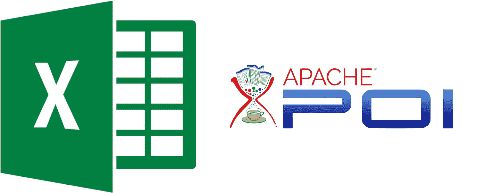
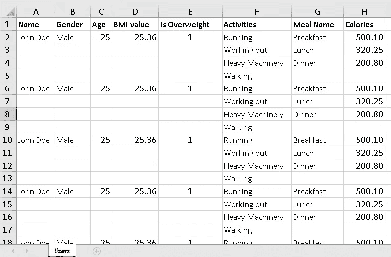

# 使用 Apache POI 和 Java 反射编写 Excel 文件的一般方法

> 原文：<https://medium.com/javarevisited/a-generic-approach-to-write-excel-using-apache-poi-17a1dfd4b98e?source=collection_archive---------1----------------------->



**简介**

使用 Excel 文档是软件应用程序中经常使用的功能。

在本文中，通过使用 Apache POI 并在 Java 反射特性的支持下，实现了一种将任何类型的对象(包括单个和复合(数组)类型的字段)写入 Excel 文件的方法。编写每种类型的字段和行-列处理的定制代码的需求已经减少，只需最少的定制就可以了。

Apache POI(Poor Obfuscation Implementation)是由 Apache Software Foundation 运行的一个流行的开源库，它是为读写 Microsoft Office 格式的文件而开发的，如 Word、PowerPoint 和 Excel。

[Apache POI](https://javarevisited.blogspot.com/2015/06/how-to-read-write-excel-file-java-poi-example.html) 的目标是设计一个跨平台的 API，可以操作微软 Office 的各种文件格式，打开 Office 文档。由于我们专注于编写 Excel 文件，我们将使用以下 Apache POI 文件格式的电子表格。

> HSSF(糟糕的电子表格格式)-用于 MS-Excel(97–2007)文件的 xlsx 文件格式。
> 
> XSSF (XML 电子表格格式)-用于 MS-Excel (2007 及更高版本)文件的 xlsx 文件格式。

每个 Apache POI 库都专用于操作每种特定类型的文件。XSSF 库包含处理 xlsx Excel 格式的类。下图显示了用于操作 xlsx Excel 文件的 Apache POI 相关接口和类。

[](https://www.java67.com/2014/09/how-to-read-write-xlsx-file-in-java-apache-poi-example.html)

此外，它还为其他 excel 功能提供了出色的支持，如处理公式、通过填充颜色和边框、字体、页眉和页脚、数据验证、图像、超链接等来创建单元格样式。

让我们开始工作吧。

实施时将遵循以下主要步骤:

1.  *使用 Apache POI 依赖项和其他必要的依赖项建立 Spring Boot 项目。*
2.  *创建一个 API 端点来发送一个下载 Excel 文件的 HTTP 请求。*
3.  *定义将用于动态类反射的 Java 注释接口。*
4.  *定义 Java POJO 类，用于写入 Excel 表。并且建立一个 POJO 类来保存上面类的每个字段的元数据。*
5.  *使用动态类反射和 POI 电子表格数据填充实现通用 Xlsx 编写器到工作簿中。*
6.  *获取 POJO 类对象列表并传递给编写器，以字节数组的形式获得响应。*
7.  *以数据字节数组的形式发送 API 响应，并将 openxmlformats 的相关头细节作为媒体类型*

**建立具有 Apache POI 依赖项和其他必要依赖项的 Spring Boot 项目**

```
<dependency>
   <groupId>org.apache.poi</groupId>
   <artifactId>poi</artifactId>
   <version>4.1.2</version>
</dependency>
<dependency>
   <groupId>org.apache.poi</groupId>
   <artifactId>poi-ooxml</artifactId>
   <version>4.1.2</version>
</dependency>
```

**创建一个 API 端点来接收下载 Excel 文件的 HTTP 请求**

```
@RequestMapping(method = RequestMethod.*POST*, value = "/download-users-excel")
public ResponseEntity downloadUsersExcel() {
    try {
        final byte[] data = userService.getUserXlsData();
        HttpHeaders header = new HttpHeaders();
    header.setContentType(MediaType.*parseMediaType*("application/vnd.openxmlformats-officedocument.spreadsheetml.sheet;charset=UTF-8"));
        header.set(HttpHeaders.*CONTENT_DISPOSITION*, "inline; filename= users.xlsx");
        header.setContentLength(data.length);
        return new ResponseEntity<>(data, header, HttpStatus.*OK*);
    } catch (Exception e) {
        return new ResponseEntity<>(null, HttpStatus.*INTERNAL_SERVER_ERROR*);
    }
}
```

**定义将用于动态类反射的 Java 注释接口**

```
@Documented
@Target(ElementType.*TYPE*)
@Retention(RetentionPolicy.*RUNTIME*)
public @interface XlsxSheet {
    String value();
}@Documented
@Target(ElementType.*FIELD*)
@Retention(RetentionPolicy.*RUNTIME*)
public @interface XlsxSingleField {
    int columnIndex();
}@Documented
@Target(ElementType.*FIELD*)
@Retention(RetentionPolicy.*RUNTIME*)
public @interface XlsxCompositeField {
    int from();
    int to();
}
```

**定义 Java POJO 类，用于写入 Excel 表**

这里出于演示的目的，使用了一个 POJO，它包括用户详细信息和一个 DietPlan 列表:

```
@Getter
@NoArgsConstructor
@AllArgsConstructor
@Setter
@XlsxSheet(value = "Users")
public class XlsxUser {

    @XlsxSingleField(columnIndex = 0)
    private String name;
    @XlsxSingleField(columnIndex = 1)
    private String gender;
    @XlsxSingleField(columnIndex = 2)
    private Integer age;
    @XlsxSingleField(columnIndex = 3)
    private Double bmiValue;
    @XlsxSingleField(columnIndex = 4)
    private Boolean isOverweight;
    @XlsxSingleField(columnIndex = 5)
    private List<String> activities;
    @XlsxCompositeField(from = 6, to = 7)
    private List<XlsxDietPlan> plans;

    @Getter
    @AllArgsConstructor
    @NoArgsConstructor
    @Setter
    public static class XlsxDietPlan {
        @XlsxSingleField(columnIndex = 6)
        private String mealName;
        @XlsxSingleField(columnIndex = 7)
        private Double calories;
    }

}
```

如上所示，前面定义的注释用于为 POJO 类及其字段提供元数据。此元数据将在运行时针对 POJO 类反射进行评估，并在通用编写器中填充工作簿。

**设置一个 POJO 类来保存上述类的每个字段的元数据**

如果我们观察它，可能的数据集类很可能由以下数据结构组成。

1.  单字段(整数、字符串、浮点、双精度、布尔类型)
2.  数组字段(单个字段的列表)
3.  复合字段(由单个字段组成的对象列表)

因此，每个字段都被映射到一个 XlsxField 实例，该实例保存关于 POJO 类字段的元数据，这在以后会很有用。

```
@Getter
@NoArgsConstructor
@AllArgsConstructor
@Setter
public class XlsxField {
    private String fieldName;
    private int cellIndex;
    private int cellIndexFrom;
    private int cellIndexTo;
    private boolean isAnArray;
    private boolean isComposite;
}
```

**使用动态类反射实现通用 Xlsx 编写器，并将 POI 电子表格数据填充到工作簿中**

```
@Service
public class XlsxFileWriter implements XlsxWriter {

   private static final Logger *logger* = LoggerFactory.*getLogger*(XlsxFileWriter.class);

    @Override
    public <T> void write(List<T> data, ByteArrayOutputStream bos, String[] columnTitles, Workbook workbook) {

        if (data.isEmpty()) {
            *logger*.error("No data received to write Xls file..");
            return;
        }

        long start = System.*currentTimeMillis*();

//      setting up the basic styles for the workbook
        Font boldFont = getBoldFont(workbook);
        Font genericFont = getGenericFont(workbook);
        CellStyle headerStyle = getLeftAlignedCellStyle(workbook, boldFont);
        CellStyle currencyStyle = setCurrencyCellStyle(workbook);
        CellStyle centerAlignedStyle = getCenterAlignedCellStyle(workbook);
        CellStyle genericStyle = getLeftAlignedCellStyle(workbook, genericFont);

   try {
// using POJO class metadata for the sheet name
    XlsxSheet annotation = data.get(0).getClass().getAnnotation(XlsxSheet.class);
    String sheetName = annotation.value();
    Sheet sheet = workbook.createSheet(sheetName);

//  get the metadata for each field of the POJO class into a list
    List<XlsxField> xlsColumnFields = *getFieldNamesForClass*(data.get(0).getClass());

      int tempRowNo = 0;
      int recordBeginRowNo = 0;
      int recordEndRowNo = 0;

//    set spreadsheet titles
      Row mainRow = sheet.createRow(tempRowNo);
      Cell columnTitleCell;

      for (int i = 0; i < columnTitles.length; i++) {
        columnTitleCell = mainRow.createCell(i);
        columnTitleCell.setCellStyle(headerStyle);
        columnTitleCell.setCellValue(columnTitles[i]);
      }
      recordEndRowNo++;

//    get class of the passed dataset
      Class<?> clazz = data.get(0).getClass();//    looping the past dataset
      for (T record : data) {
        tempRowNo = recordEndRowNo;
        recordBeginRowNo = tempRowNo;
        mainRow = sheet.createRow(tempRowNo++);
        boolean isFirstValue;
        boolean isFirstRow;
        boolean isRowNoToDecrease = false;
        Method xlsMethod;
        Object xlsObjValue;
        ArrayList<Object> objValueList;

//      get max size of the record if its multiple row
        int maxListSize = getMaxListSize(record, xlsColumnFields, clazz);

//      looping through the fields of the current record
        for (XlsxField xlsColumnField : xlsColumnFields) {
//       writing a single field
         if (!xlsColumnField.isAnArray() && !xlsColumnField.isComposite()) {
            writeSingleFieldRow(mainRow, xlsColumnField, clazz, currencyStyle, centerAlignedStyle, genericStyle,
                                record, workbook);

//       overlooking the next field and adjusting the starting row
         if (isNextColumnAnArray(xlsColumnFields, xlsColumnField, clazz, record)) {
             isRowNoToDecrease = true;
             tempRowNo = recordBeginRowNo + 1;
          }

//       writing an single array field
         } else if (xlsColumnField.isAnArray() && !xlsColumnField.isComposite()) {
           xlsMethod = getMethod(clazz, xlsColumnField);
           xlsObjValue = xlsMethod.invoke(record, (Object[]) null);
           objValueList = (ArrayList<Object>) xlsObjValue;
           isFirstValue = true;

//       looping through the items of the single array
         for (Object objectValue : objValueList) {
            Row childRow;
            if (isFirstValue) {
             childRow = mainRow;
             writeArrayFieldRow(childRow, xlsColumnField, objectValue, currencyStyle, centerAlignedStyle, genericStyle, workbook);
             isFirstValue = false;
            } else if (isRowNoToDecrease) {
             childRow = getOrCreateNextRow(sheet, tempRowNo++);
             writeArrayFieldRow(childRow, xlsColumnField, objectValue, currencyStyle, centerAlignedStyle,genericStyle, workbook);
             isRowNoToDecrease = false;
            } else {
             childRow = getOrCreateNextRow(sheet, tempRowNo++);
             writeArrayFieldRow(childRow, xlsColumnField, objectValue, currencyStyle, centerAlignedStyle, genericStyle, workbook);
            }
          }

 //      overlooking the next field and adjusting the starting row
         if (isNextColumnAnArray(xlsColumnFields, xlsColumnField, clazz, record)) {
            isRowNoToDecrease = true;
            tempRowNo = recordBeginRowNo + 1;
         }

//      writing a composite array field
         } else if (xlsColumnField.isAnArray() && xlsColumnField.isComposite()) {
           xlsMethod = getMethod(clazz, xlsColumnField);
           xlsObjValue = xlsMethod.invoke(record, (Object[]) null);
           objValueList = (ArrayList<Object>) xlsObjValue;
           isFirstRow = true;

//       looping through the items of the composite array
           for (Object objectValue : objValueList) {
             Row childRow;
             List<XlsxField> xlsCompositeColumnFields = *getFieldNamesForClass*(objectValue.getClass());
             if (isFirstRow) {
               childRow = mainRow;
               for (XlsxField xlsCompositeColumnField : xlsCompositeColumnFields) {  
                                                                  writeCompositeFieldRow(objectValue, xlsCompositeColumnField, childRow, currencyStyle,centerAlignedStyle, genericStyle, workbook);
               }
              isFirstRow = false;
              } else if (isRowNoToDecrease) {
               childRow = getOrCreateNextRow(sheet, tempRowNo++);
               for (XlsxField xlsCompositeColumnField : xlsCompositeColumnFields) {
                                    writeCompositeFieldRow(objectValue, xlsCompositeColumnField, childRow, currencyStyle, centerAlignedStyle, genericStyle, workbook);
            }
            isRowNoToDecrease = false;
           } else {
            childRow = getOrCreateNextRow(sheet, tempRowNo++);
            for (XlsxField xlsCompositeColumnField : xlsCompositeColumnFields) {
                                    writeCompositeFieldRow(objectValue, xlsCompositeColumnField, childRow, currencyStyle, centerAlignedStyle, genericStyle, workbook);
           }
          }
         }

//       overlooking the next field and adjusting the starting row
         if (isNextColumnAnArray(xlsColumnFields, xlsColumnField, clazz, record)) {
            isRowNoToDecrease = true;
            tempRowNo = recordBeginRowNo + 1;
           }
         }
       }

//      adjusting the ending row number for the current record
        recordEndRowNo = maxListSize + recordBeginRowNo;
     }

// auto sizing the columns of the whole sheet
   autoSizeColumns(sheet, xlsColumnFields.size());            
   workbook.write(bos);
   *logger*.info("Xls file generated in [{}] seconds", processTime(start));
  } catch (Exception e) {
    *logger*.info("Xls file write failed", e);
  }
}

  private void writeCompositeFieldRow(Object objectValue, XlsxField xlsCompositeColumnField, Row childRow,CellStyle currencyStyle, CellStyle centerAlignedStyle, CellStyle genericStyle, Workbook workbook) throws NoSuchMethodException, InvocationTargetException, IllegalAccessException {

        Method nestedCompositeXlsMethod = getMethod(objectValue.getClass(), xlsCompositeColumnField);
        Object nestedCompositeValue = nestedCompositeXlsMethod.invoke(objectValue, (Object[]) null);
        Cell compositeNewCell = childRow.createCell(xlsCompositeColumnField.getCellIndex());
        setCellValue(compositeNewCell, nestedCompositeValue, currencyStyle, centerAlignedStyle, genericStyle, workbook);
    }

    private void writeArrayFieldRow(Row childRow, XlsxField xlsColumnField, Object objectValue,
                                    CellStyle currencyStyle, CellStyle centerAlignedStyle, CellStyle genericStyle, Workbook workbook) {
        Cell newCell = childRow.createCell(xlsColumnField.getCellIndex());
        setCellValue(newCell, objectValue, currencyStyle, centerAlignedStyle, genericStyle, workbook);
    }

    private <T> void writeSingleFieldRow(Row mainRow, XlsxField xlsColumnField, Class<?> clazz, CellStyle currencyStyle,CellStyle centerAlignedStyle, CellStyle genericStyle, T record, Workbook workbook) throws NoSuchMethodException, InvocationTargetException, IllegalAccessException {

  Cell newCell = mainRow.createCell(xlsColumnField.getCellIndex());
  Method xlsMethod = getMethod(clazz, xlsColumnField);
  Object xlsObjValue = xlsMethod.invoke(record, (Object[]) null);
  setCellValue(newCell, xlsObjValue, currencyStyle, centerAlignedStyle, genericStyle, workbook);
    }

    private <T> boolean isNextColumnAnArray(List<XlsxField> xlsColumnFields, XlsxField xlsColumnField,Class<?> clazz, T record)
            throws NoSuchMethodException, InvocationTargetException, IllegalAccessException {
  XlsxField nextXlsColumnField;
  int fieldsSize = xlsColumnFields.size();
  Method nestedXlsMethod;
  Object nestedObjValue;
  ArrayList<Object> nestedObjValueList;
   if (xlsColumnFields.indexOf(xlsColumnField) < (fieldsSize - 1)) {
      nextXlsColumnField = xlsColumnFields.get(xlsColumnFields.indexOf(xlsColumnField) + 1);
  if (nextXlsColumnField.isAnArray()) {
   nestedXlsMethod = getMethod(clazz, nextXlsColumnField);
   nestedObjValue = nestedXlsMethod.invoke(record, (Object[]) null);
   nestedObjValueList = (ArrayList<Object>) nestedObjValue;
                return nestedObjValueList.size() > 1;
            }
        }
        return xlsColumnFields.indexOf(xlsColumnField) == (fieldsSize - 1);

    }

    private void setCellValue(Cell cell, Object objValue, CellStyle currencyStyle, CellStyle centerAlignedStyle,
                              CellStyle genericStyle, Workbook workbook) {
        Hyperlink link = workbook.getCreationHelper().createHyperlink(HyperlinkType.*URL*);
          if (objValue != null) {
            if (objValue instanceof String) {
                String cellValue = (String) objValue;
                cell.setCellStyle(genericStyle);
                if (cellValue.contains("https://") || cellValue.contains("http://")) {
                    link.setAddress(cellValue);
                    cell.setCellValue(cellValue);
                    cell.setHyperlink(link);
                } else {
                    cell.setCellValue(cellValue);
                }
            } else if (objValue instanceof Long) {
                cell.setCellValue((Long) objValue);
            } else if (objValue instanceof Integer) {
                cell.setCellValue((Integer) objValue);
            } else if (objValue instanceof Double) {
                Double cellValue = (Double) objValue;
                cell.setCellStyle(currencyStyle);
                cell.setCellValue(cellValue);
            } else if (objValue instanceof Boolean) {
                cell.setCellStyle(centerAlignedStyle);
                if (objValue.equals(true)) {
                    cell.setCellValue(1);
                } else {
                    cell.setCellValue(0);
                }
            }
        }
    }

    private static List<XlsxField> getFieldNamesForClass(Class<?> clazz) {
        List<XlsxField> xlsColumnFields = new ArrayList();
        Field[] fields = clazz.getDeclaredFields();
        for (Field field : fields) {
          XlsxField xlsColumnField = new XlsxField();
           if (Collection.class.isAssignableFrom(field.getType())) {
                xlsColumnField.setAnArray(true);
                XlsxCompositeField xlsCompositeField = field.getAnnotation(XlsxCompositeField.class);
                if (xlsCompositeField != null) {
          xlsColumnField.setCellIndexFrom(xlsCompositeField.from());
              xlsColumnField.setCellIndexTo(xlsCompositeField.to());
                    xlsColumnField.setComposite(true);
                } else {
                    XlsxSingleField xlsField = field.getAnnotation(XlsxSingleField.class);
                xlsColumnField.setCellIndex(xlsField.columnIndex());
                }
            } else {
                XlsxSingleField xlsField = field.getAnnotation(XlsxSingleField.class);
                xlsColumnField.setAnArray(false);
                if (xlsField != null) {
                xlsColumnField.setCellIndex(xlsField.columnIndex());
                    xlsColumnField.setComposite(false);
                }
            }
            xlsColumnField.setFieldName(field.getName());
            xlsColumnFields.add(xlsColumnField);
        }
        return xlsColumnFields;
    }

    private static String capitalize(String s) {
        if (s.length() == 0)
            return s;
        return s.substring(0, 1).toUpperCase() + s.substring(1);
    }

    private <T> int getMaxListSize(T record, List<XlsxField> xlsColumnFields, Class<? extends Object> aClass)
            throws NoSuchMethodException, InvocationTargetException, IllegalAccessException {

        List<Integer> listSizes = new ArrayList<>();
        for (XlsxField xlsColumnField : xlsColumnFields) {
          if (xlsColumnField.isAnArray()) {
           Method method = getMethod(aClass, xlsColumnField);
            Object value = method.invoke(record, (Object[]) null);
             ArrayList<Object> objects = (ArrayList<Object>) value;
                if (objects.size() > 1) {
                  listSizes.add(objects.size());
                }
            }
        }

        if (listSizes.isEmpty()) {
            return 1;
        } else {
            return Collections.*max*(listSizes);
        }

    }

    private Method getMethod(Class<?> clazz, XlsxField xlsColumnField) throws NoSuchMethodException {
        Method method;
        try {
            method = clazz.getMethod("get" + *capitalize*(xlsColumnField.getFieldName()));
        } catch (NoSuchMethodException nme) {
            method = clazz.getMethod(xlsColumnField.getFieldName());
        }

        return method;
    }

    private long processTime(long start) {
        return (System.*currentTimeMillis*() - start) / 1000;
    }

    private void autoSizeColumns(Sheet sheet, int noOfColumns) {
        for (int i = 0; i < noOfColumns; i++) {
            sheet.autoSizeColumn((short) i);
        }
    }

    private Row getOrCreateNextRow(Sheet sheet, int rowNo) {
        Row row;
        if (sheet.getRow(rowNo) != null) {
            row = sheet.getRow(rowNo);
        } else {
            row = sheet.createRow(rowNo);
        }
        return row;
    }

    private CellStyle setCurrencyCellStyle(Workbook workbook) {
        CellStyle currencyStyle = workbook.createCellStyle();
        currencyStyle.setWrapText(true);
        DataFormat df = workbook.createDataFormat();
        currencyStyle.setDataFormat(df.getFormat("#0.00"));
        return currencyStyle;
    }

    private Font getBoldFont(Workbook workbook) {
        Font font = workbook.createFont();
        font.setBold(true);
        font.setFontHeight((short) (10 * 20));
        font.setFontName("Calibri");
        font.setColor(IndexedColors.*BLACK*.getIndex());
        return font;
    }

    private Font getGenericFont(Workbook workbook) {
        Font font = workbook.createFont();
        font.setFontHeight((short) (10 * 20));
        font.setFontName("Calibri");
        font.setColor(IndexedColors.*BLACK*.getIndex());
        return font;
    }

    private CellStyle getCenterAlignedCellStyle(Workbook workbook) {
        CellStyle cellStyle = workbook.createCellStyle();
        cellStyle.setAlignment(HorizontalAlignment.*CENTER*);
        cellStyle.setVerticalAlignment(VerticalAlignment.*BOTTOM*);
        cellStyle.setBorderTop(BorderStyle.*NONE*);
        cellStyle.setBorderBottom(BorderStyle.*NONE*);
        cellStyle.setBorderLeft(BorderStyle.*NONE*);
        cellStyle.setBorderRight(BorderStyle.*NONE*);
        return cellStyle;
    }

    private CellStyle getLeftAlignedCellStyle(Workbook workbook, Font font) {
        CellStyle cellStyle = workbook.createCellStyle();
        cellStyle.setFont(font);
        cellStyle.setAlignment(HorizontalAlignment.*LEFT*);
        cellStyle.setVerticalAlignment(VerticalAlignment.*BOTTOM*);
        cellStyle.setBorderTop(BorderStyle.*NONE*);
        cellStyle.setBorderBottom(BorderStyle.*NONE*);
        cellStyle.setBorderLeft(BorderStyle.*NONE*);
        cellStyle.setBorderRight(BorderStyle.*NONE*);
        return cellStyle;
    }
}
```

**获取 POJO 类对象的列表并传递给编写器，以** [**字节数组**](https://javarevisited.blogspot.com/2020/04/7-examples-to-read-file-into-byte-array-in-java.html) 的形式获得响应

出于演示目的，将使用一些虚拟数据来创建样本 POJO 记录列表。

然后创建 [ByteArrayOutputStream](https://javarevisited.blogspot.com/2014/04/how-to-convert-byte-array-to-inputstream-outputstream-java-example.html) 和 XSSFWorkbook 的实例。电子表格的标题被定义为一个字符串数组。这些作为参数传递给编写器。ByteArrayOutputStream 的传递实例包含在写入工作簿的数据的字节流中。在 Finally 子句中，ByteArrayOutputStream 被关闭，并返回字节数组。

```
@Service
public class UserServiceImpl implements UserService {

    private final XlsxWriter xlsxWriter;
    private static final Logger *logger* = LoggerFactory.*getLogger*(UserServiceImpl.class);

    public UserServiceImpl(XlsxWriter xlsxWriter) {
        this.xlsxWriter = xlsxWriter;
    }

    @Override
    public byte[] getUserXlsData() throws IOException {
        List<XlsxUser> xlsxUserList = new ArrayList<>();
        for (int i = 0; i < 10; i++) {
            XlsxUser user = new XlsxUser();
            List<String> activities = new ArrayList<>(Arrays.*asList*("Running", "Working out", "Heavy Machinery", "Walking"));
            List<XlsxUser.XlsxDietPlan> plans = new ArrayList<>(Arrays.*asList*(new XlsxUser.XlsxDietPlan("Breakfast", 500.10),
                    new XlsxUser.XlsxDietPlan("Lunch", 320.25), new XlsxUser.XlsxDietPlan("Dinner", 200.80)));
            user.setName("John Doe");
            user.setAge(25);
            user.setBmiValue(25.36);
            user.setGender("Male");
            user.setIsOverweight(true);
            user.setActivities(activities);
            user.setPlans(plans);
            xlsxUserList.add(user);
        }
        ByteArrayOutputStream bos = new ByteArrayOutputStream();
        try (Workbook workbook = new XSSFWorkbook()) {
            String[] columnTitles = new String[]{"Name", "Gender", "Age", "BMI value", "Is Overweight", "Activities", "Meal Name", "Calories"};
            xlsxWriter.write(xlsxUserList, bos, columnTitles, workbook);
        } catch (Exception e) {
            *logger*.error("Generating users xls file failed", e);
        } finally {
            bos.close();
        }
        return bos.toByteArray();
     }
}
```

## 抽样输出

[](https://javarevisited.blogspot.com/2020/11/top-10-business-and-finance-courses.html#axzz6v6xLSPvq)

**总结**

努力使用 Apache POI 和 Java 核心特性(如反射和注释)实现一个通用且健壮的 Excel writer，它将使用 HTTP 请求下载一个 Excel 文件。当写入 Excel 表时，这将匹配 POJO 结构的大多数用例。希望这将有所帮助，也很容易定制。

可以在[这里的](https://github.com/jsb9009/generic-xlsx-writer)中找到该项目的存储库。

欢迎在下方留言评论。希望你喜欢这个故事..！:)