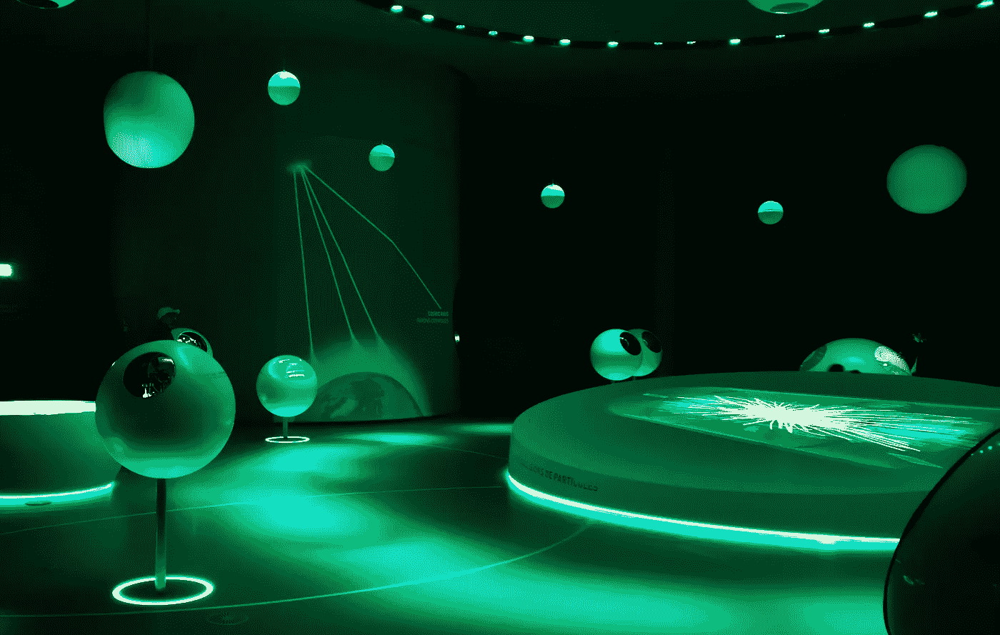

# 欧洲核子研究中心一瞥

> 原文：<https://medium.com/javarevisited/a-glance-at-the-cern-17ebc03f95df?source=collection_archive---------3----------------------->

## 世界上最迷人的地方之一

CERN —个人作者照片，@HardFreedomCom

你知道万维网诞生于欧洲粒子物理研究所吗？直到我参观了所有科学家的圣地——CERN(法语:*Conseil Européen pour la Recherche nucéaire*)。

去年，我们一家应邀去了瑞士。知道 CERN 在瑞士，我不能错过参观这个科学的机会…