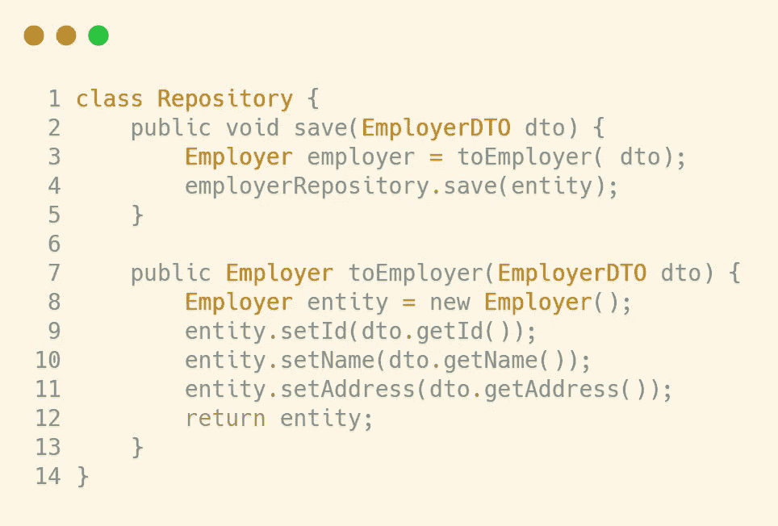
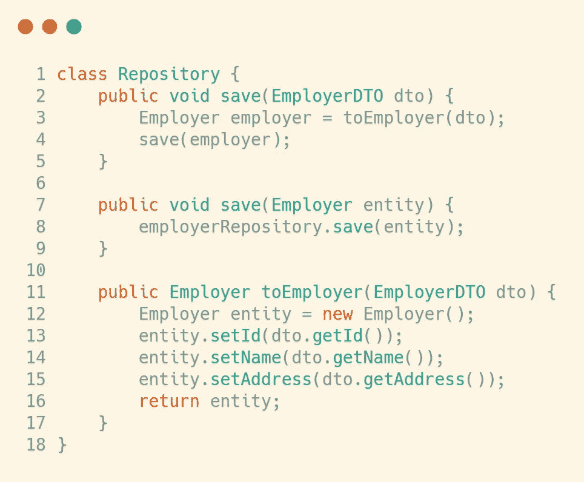
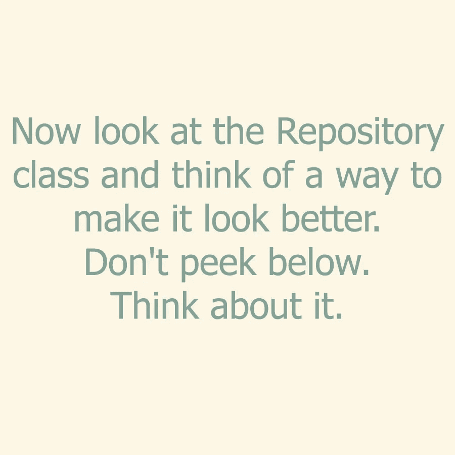
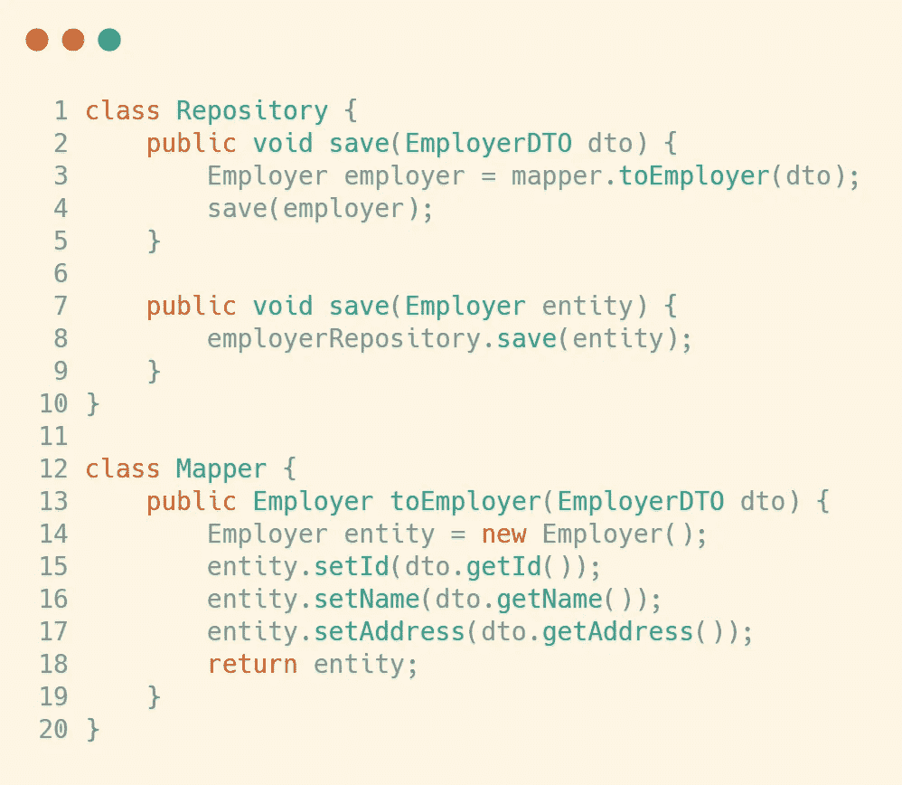
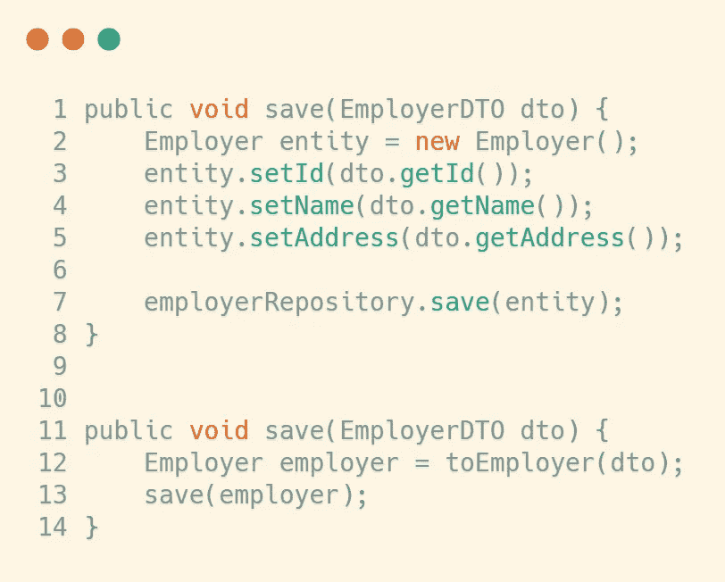
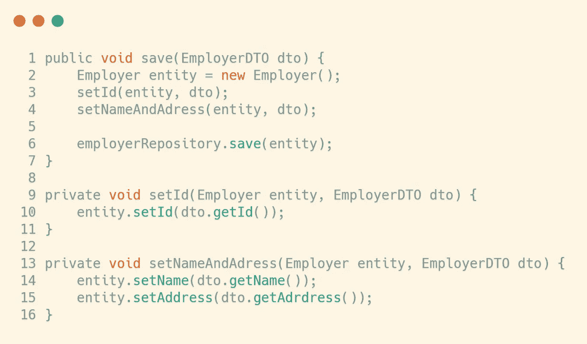

# 清理代码的关键——小方法

> 原文：<https://medium.com/javarevisited/a-key-to-clean-code-small-methods-cff120538eba?source=collection_archive---------0----------------------->

为什么我们需要把方法变小？一个方法应该有多小？如何使我们的方法变小以保持代码有条理和易读？我们将回答这个问题和许多其他问题，让我们开始吧。

这篇文章是名为[“软件实践和编写干净代码”](https://rebrand.ly/spcc-medium-small-methods)的干净代码深入课程的一部分，你可以去看看。它目前以 87%的折扣出售。

你应该记住的主要事情是:**把方法变小**。一个方法应该只做一件事。但这意味着什么呢？让我们看一个例子:

我们有一个方法叫做**救**。它将 DTO 对象映射到实体对象，然后保存它。

这个方法做一件事吗？它救了一个雇主，所以这是一回事，对不对？没有。其实有两件事。我们将 DTO 映射到一个实体，然后保存它。好吧，这很明显。您应该尽可能地拆分方法，这样做是合乎逻辑的。所以让我们重构它:

那更好。你看，每个方法都有不同的职责。但是代码可以更好。为了更加灵活，我们可以有一个包装器方法来连接 **save** 和 **toEmployer** 方法。在这种情况下，我们将创建另一个保存方法来扮演这个角色。所以让我们再次重构代码:

现在我们有三种方法。一个**保存**方法，我们可以传递一个 DTO 参数，它将映射并保存它。一个**保存**方法，我们可以直接传递雇主参数。和一个用于映射的 **toEmployer** 方法。

我觉得很明显有些东西不在它该在的地方。即使你没有想过，你也会对这些事情有感觉，你只需要练习。

答案是:toEmployer 方法不再属于 Repository 类。因为我们将它从方法中分离出来，所以现在是免费的，我们可以将它移到一个单独的类中，如下所示:

你看，当我们分离方法时，我们不仅得到更小的方法，也得到更小的类。我们只需要将方法分离成逻辑上更小的方法，然后架构“自己”构建。多酷啊。

现在，我知道这没什么不同，有人可能会说这毫无意义。但这并不完全正确。这里有三个原因

1.  有了这种结构，我们有了更多的代码分离——这总是好的。记住——分离应该是有意义的。一会儿，我们会看到一个分离没有意义的例子。
2.  这里我们有更多的灵活性，因为我们可以保存实体或 DTO。
3.  这将更容易测试，因为我们可以分别测试实体的保存、DTO 的保存和映射。

你可能会说:“你真笨。DTO 保存方法又做了两件事，它映射到雇主并进行保存。”。你将是正确的…对于第一个声明。是的，我是个哑巴。但你在第二个陈述上大错特错。你需要知道做多件事的方法和**包装方法**之间的区别。

# 包装方法

包装器方法调用两个或更多的方法，并以某种方式组装它们。让所有的方法只做一件事是不可能的，你需要包装方法。您需要编排和管理其他方法的方法。包装方法的一个例子是 DTO 保存方法。仔细想想，这个方法做了两件事:将 DTO 映射到一个实体，然后保存它。但这是一个包装方法。它实际上并没有实现这些动作。它只是调用正确的方法来完成工作。它控制着其他人。在模型-视图-控制器设计模式中，这一层称为控制器。控制器的想法是连接模型和视图。这里也一样。

做多件事的方法是最初的保存方法。请并排查看这两种方法。

看出区别了吗？top 方法实现到实体的映射和保存。底层只调用实现这些动作的方法。这两者之间只有一线之隔，知道这一点很重要。

# 我们不应该总是分开

现在，我们来看一个没有意义的分离方法。我会用之前的例子，我知道这个例子很愚蠢，就像我的大多数例子一样，但这真的没什么难理解的。我甚至在想我是否应该添加这个，但是你最好知道**更小的方法并不意味着更好的方法**:

我们有和以前一样的保存方法，但是我们把不同的 setters 分成不同的方法。这太愚蠢了。不要这样。不要以为很多小方法总是更好。动动脑筋。我知道你明白我的意思，但我只是想提一下，以防万一。

# 自我记录的代码

这种分离的一个非常大的优点是它有助于代码的可读性和文档化。你用不同的方法分离代码片段，并给它们命名。在更高层次的代码中，这使得它看起来更像文档而不是代码。如果你想看这个“文档”的细节，你可以进入内部方法。让我们看一个例子:

我们有一盘棋。方法 **startGame** ，你可能猜到了，开始游戏。让我们试着阅读代码:

我们正在打印一些线条。然后我们得到 FROM 位置，并打印一些消息，之后，我们得到“to 位置”。然后我们创建一个新的移动对象，并检查它是否有效。如果是，我们进行移动，如果不是，我们打印一个错误消息。

好的，从一个方法中可以读出很多信息。尤其是第一次看的话。有对方法的调用，打印消息，创建实例，一切都很混乱。乱七八糟。让我们看一个更好的版本:

如果你看到最上面的方法，你会发现我们没有任何细节。我们对游戏如何运作只有抽象的概念。这甚至可以被非程序员阅读。我们来读一下。

在 gameIsRunning、printPlayerTurnMessage 和 printChoosingFigureMessage 时，在读取人物的输入位置和 printFigureNewDestinationMessage 之后，获取新目的地的位置并将人物移动到新目的地。

太好了。读起来很好。现在，如果你想看到一些抽象动作的细节，你可以进入方法内部。注意，我们越深入，实现细节就越多。假设我们想看看 **move** 方法是如何工作的。我们进入它，我们看到——我们创建了一个新的移动对象，然后我们检查它是否有效，如果是，我们就移动，如果不是，我们打印 InvalidMoveMessage。你想深入了解吗？我们可以进入 **makeMove** 方法内部。诸如此类。

现在，慢慢来，看看最顶级方法之间的区别。你可以挑衅地看看哪个更好。我还强烈建议您比较这两个实现，看看我是如何提取方法的，并研究它们。这将帮助你理解这个想法，并使你的代码更容易阅读和维护。

**在你离开之前——我们惊人的干净代码课程**

如果你喜欢这篇文章，你会喜欢我们关于[干净代码](/javarevisited/clean-code-a-must-read-coding-book-for-programmers-9dc80494d27c)的课程

*   46 场讲座
*   3 小时的内容
*   做一个真实的项目来测试你的知识
*   27 个可下载资源
*   30 天退款保证

你可以在这里注册课程— [干净的代码:在 7 天内让你的编程生涯扶摇直上](https://rebrand.ly/spcc-medium-small-methods)

