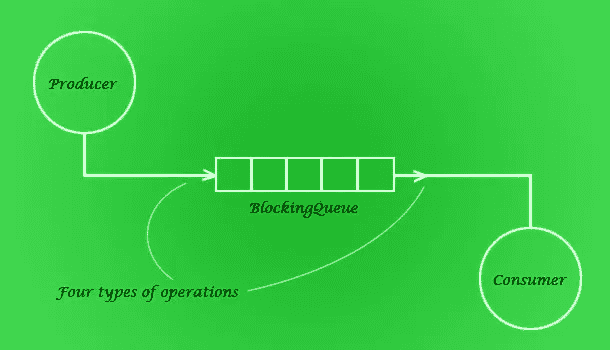
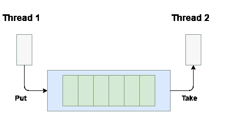
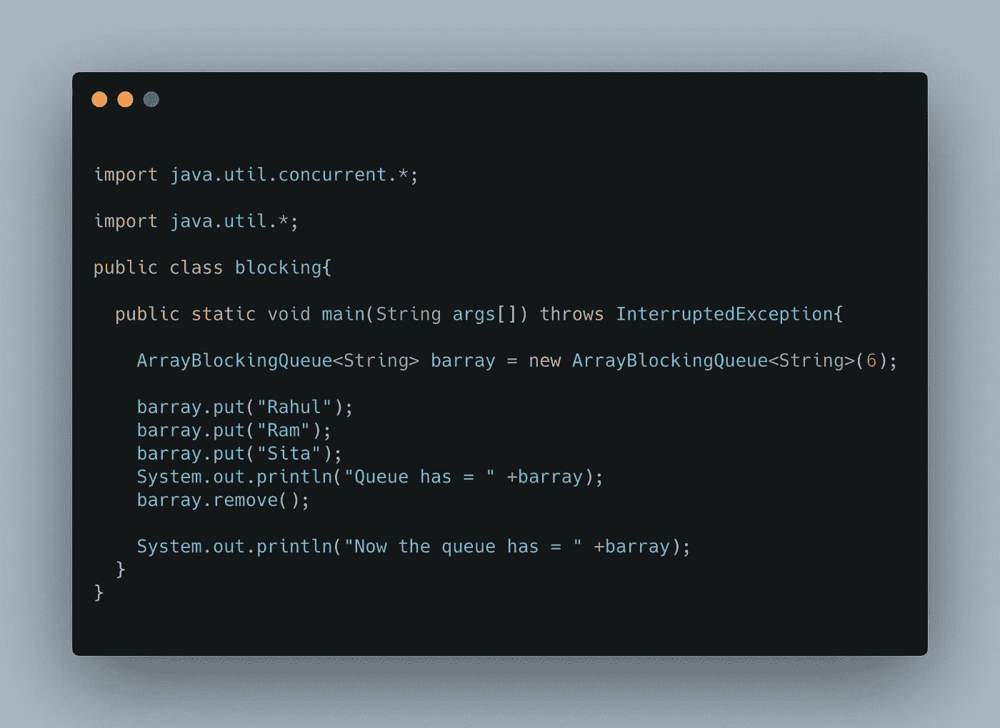
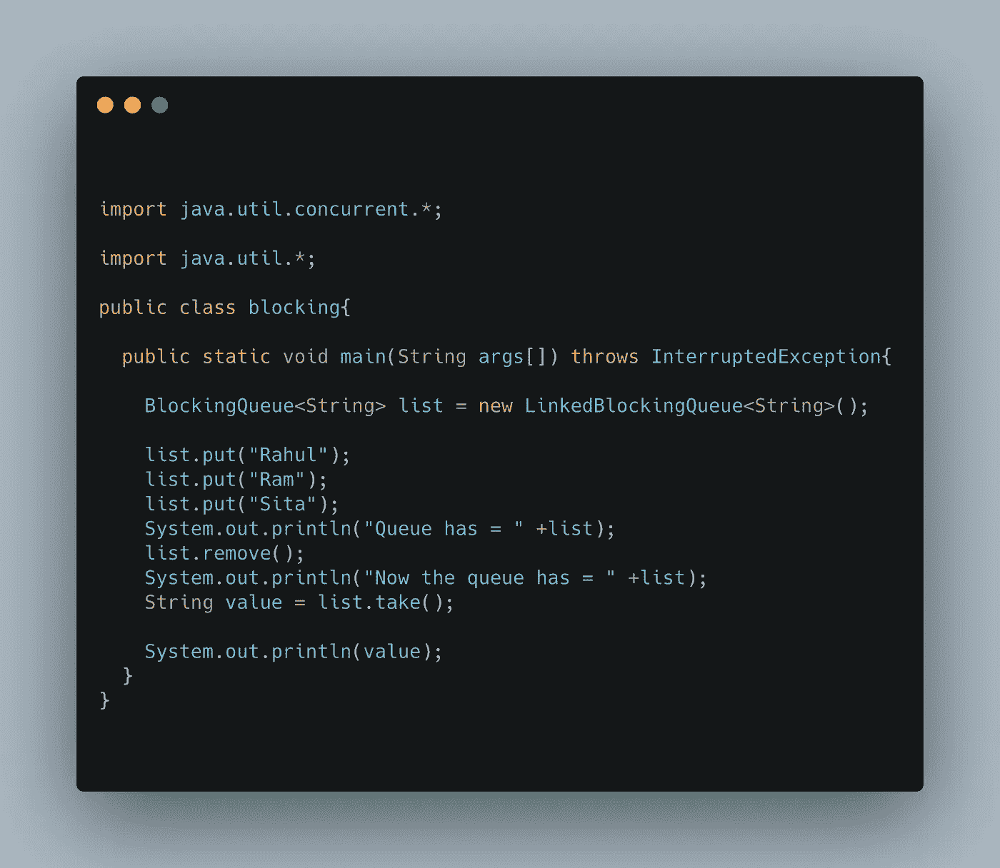

# 快速浏览一下 Java 中的阻塞队列！

> 原文：<https://medium.com/javarevisited/a-quick-glance-on-blocking-queue-in-java-7a95a9ae5a47?source=collection_archive---------3----------------------->

图 1.1:说明阻塞队列工作的示意图

读者们好，

我带着关于阻塞队列的新教程回来了，它解释了阻塞队列的所有基本概念和基本介绍，以及它们是如何工作的，以及它们是如何在 Java 中实现的。

**阻塞队列:**阻塞队列被定义为当队列未被完全填满时发生元素插入的队列，否则执行操作的线程将被阻塞，并且它将等待一个或多个元素从队列中被移除或者队列被完全清空以将另一个元素插入到队列中，并且当元素必须从队列中出列时， 如果队列已经是空的，那么执行操作的线程被阻塞，它等待另一个元素插入队列来执行它的操作，阻塞队列图如上所示。

**注意:**队列不接受空值，如果空值被传递给队列它会抛出 NullPointerException。

**阻塞队列的类型**

有两种类型的阻塞队列，描述如下:

*   **有界阻塞队列:**有界阻塞队列可以理解为阻塞队列，其中阻塞队列的大小是有限的或固定的，一旦通过将它传入参数来分配大小，就不能再增加。使用有界阻塞队列的阻塞队列的一些实现是阻塞队列的数组实现，也可以将[阻塞队列](https://www.java67.com/2015/12/producer-consumer-solution-using-blocking-queue-java.html)的链接表示视为有界阻塞队列，但它并不完全是有界阻塞队列。
*   **无界阻塞队列:**无界队列可以理解为阻塞队列，其中阻塞队列的大小不受限制，并且它能够随着元素的插入而增长。使用无界阻塞队列的阻塞队列的一些实现是阻塞队列、优先级阻塞队列等的链接表示。

**数组阻塞队列:** [数组阻塞队列](https://javarevisited.blogspot.com/2012/12/blocking-queue-in-java-example-ArrayBlockingQueue-LinkedBlockingQueue.html)可以理解为大小固定且在运行时不能改变的有界阻塞队列。它遵循由正常队列数据结构维护的 **FIFO 规则**，即(先进先出)。示例如下所示:

图 1.1:Java 中数组阻塞队列的例子

**上述代码的输出将是:** 【队列已经=【Rahul Ram Sita】。
现在，队列已经= [Ram Sita]

**链接阻塞队列:链接阻塞队列可以理解为有界阻塞队列和无界阻塞队列，其中元素的存储如同节点在链表中的存储，也遵循 **FIFO 规则**(先进先出)，它的头定义存储时间最长的元素，尾定义存储时间最短的节点。示例如下所示:**

**

图 2.2:Java 中链接阻塞队列的例子** 

****上述代码的输出将是:** Queue has =【Rahul Ram Sita】。
现在，队列已经= [Ram Sita]
Ram**

****延迟队列:**延迟队列定义为延迟方法返回的时间应为等待时间或当前元素释放的延迟时间的阻塞队列。**

****优先级阻塞队列:**优先级阻塞队列定义为无界阻塞队列，其中元素按照用户给定的优先级排列。用户不能将 null 元素添加到队列中。**

## **[同步队列](https://javarevisited.blogspot.com/2014/06/synchronousqueue-example-in-java.html) : **同步队列定义为最多包含一个元素的队列，当一个元素必须被推入队列，而队列中已经有一个元素时，那么执行该操作的线程被阻塞，然后在移除该元素后，另一个元素被插入，反之亦然。****

****不断学习，不断成长，不断探索！****

**祝一切顺利！**

**更多有趣和信息丰富的文章和提示请关注我的 [**媒体**](https://swapnilkant11.medium.com/) **和**[**Linkedin**](https://www.linkedin.com/in/swapnil-kant-279a3b148/)**