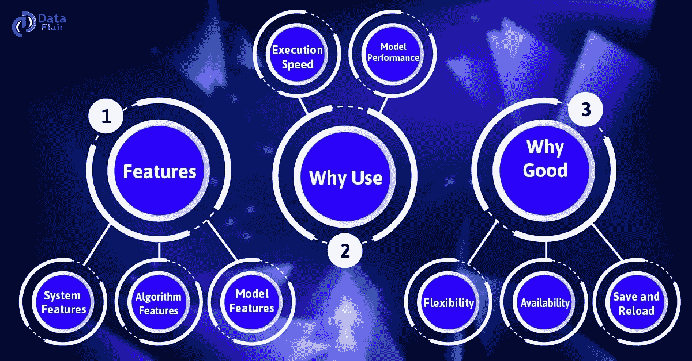

# 机器学习中快速学习 XGBoost 的方法？

> 原文：<https://medium.com/javarevisited/a-quick-way-to-learn-xgboost-in-machine-learning-84a0b6b5b896?source=collection_archive---------0----------------------->

*XGBoost 是一个算法*。那个最近一直称霸应用的[机器学习](https://data-flair.training/blogs/machine-learning-tutorial/)。

XGBoost 算法是梯度推进决策树的一种实现。这是为速度和性能而设计的。

基本上，XGBoosting 是一种软件库。您可以下载并安装到您的机器上。然后必须从各种接口访问它。

***具体来说，XGBoosting 支持以下主要接口:***

*   命令行界面(CLI)。
*   C++(编写库的语言)。
*   [Python](https://data-flair.training/blogs/python-tutorial-for-beginners/) 接口以及 sci-kit-learn 中的一个模型。
*   [R](https://data-flair.training/blogs/r-programming-tutorial/) 接口以及脱字包中的一个模型。
*   朱莉娅。
*   像 Scala 这样的 Java 和 JVM 语言以及 Hadoop 这样的平台。

点击此链接了解更多关于 [XGBoost 算法](https://data-flair.training/blogs/xgboost-algorithm/)

# XGBoost 特性

# a.模型特征

XGBoost 模型实现支持 scikit-learn 和 R 实现的特性。支持三种主要形式的梯度增强:

梯度推进

这也叫梯度推进机，包括学习率。

随机梯度推进

这是在行、列和每分离级的列处进行子采样的提升。

正则化梯度增强

它包括促进 L1 和 L2 正则化。

# b.系统功能

*对于一系列计算环境的使用，本库提供:*

*   在训练过程中使用所有 CPU 核心并行构建树。
*   使用机器集群训练超大型模型的分布式计算。
*   针对不适合内存的超大型数据集的核外计算。
*   数据结构和算法的缓存优化，以充分利用硬件。

# c.算法特征

为了提高计算时间和内存资源的效率，我们使用 XGBoost 算法。此外，这也是为了利用可用的资源来训练模型。

***一些关键算法实现特性包括:***

*   稀疏感知实现，自动处理丢失的数据值。
*   块结构来支持树结构的并行化。
*   继续培训，以便您可以根据新数据进一步提升已经拟合的模型。
*   XGBoost 是免费的开源软件。它可以在许可的 Apache-2 许可证下使用。

必读[现实世界中 9 大机器学习应用](https://data-flair.training/blogs/machine-learning-applications/)

# 为什么是 XGBoosting？

使用 XGBoosting 算法的两个原因也是该项目的两个目标:

# a.XGBoost 执行速度

当我们将 XGBoosting 与梯度增强的实现进行比较时，它是如此之快。

它将 XGBoost 与梯度提升和袋装决策树的其他实现进行了比较。此外，他在 2015 年 5 月发表了一篇名为。那就是“基准随机森林实现”。

此外，它还提供了 GitHub 上的所有代码和一份更全面的硬数字结果报告。

# b.XGBoost 模型性能

它在分类和回归预测建模问题上主导结构化数据集。

证据是，它是竞赛获胜者的首选算法。这是基于 Kaggle 竞争数据科学平台。

# 为什么 XGBoosting 好？

# a.灵活性

XGBoosting 支持带有分类、回归和排序问题的用户自定义目标函数。我们使用一个目标函数来衡量模型的性能。给定一组特定的参数。此外，它还支持用户定义的评估指标。

# b.有效性

因为它适用于 R、[、Python](https://data-flair.training/blogs/python-features/) 、Java、Julia 和 Scala 等编程语言。

# c.保存并重新加载

我们可以很容易地保存我们的数据矩阵和模型，并在以后重新加载它。假设，如果我们有一个大型数据集，我们可以简单地保存模型。此外，我们在未来使用它，而不是浪费时间重新计算。

市场上有几种机器学习软件工具。参考这篇文章[用 10 大机器学习工具提升技能并被录用](https://data-flair.training/blogs/machine-learning-tools/)

这就是 XGBoost 教程。希望你喜欢。

其他**机器学习文章**你可能喜欢:
[5 门免费课程学习机器学习的 R 编程](http://www.java67.com/2018/09/top-5-free-R-programming-courses-for-Data-Science-Machine-Learning-Programmers.html)
[2018 年 5 门免费课程学习 Python](http://www.java67.com/2018/02/5-free-python-online-courses-for-beginners.html)
[前 5 名数据科学与机器学习课程](https://hackernoon.com/top-5-data-science-and-machine-learning-course-for-programmers-e724cfb9940a)
[前 5 名 TensorFlow 与机器学习课程](https://hackernoon.com/top-5-tensorflow-and-ml-courses-for-programmers-8b30111cad2c) |
[2019 年学习深度学习的 10 门课程](http://P. S. --- If you need some FREE resources to start with, you can check out this free courseLearn Machine Learning algorithms, software, deep learning to start your preparation.)
[面向 Web 开发者的 10 大 JavaScript 教程和课程](https://javarevisited.blogspot.com/2018/06/top-10-courses-to-learn-javascript-in.html)
[一个日本黄瓜农是如何利用深度学习和 tensor flow](https://cloud.google.com/blog/products/gcp/how-a-japanese-cucumber-farmer-is-using-deep-learning-and-tensorflow)
[2019 年学习数据科学的 10 大课程](https://dev.to/javinpaul/10-data-science-and-machine-learning-courses-for-programmers-looking-to-switch-career-57kd)

**P. S.** — —如果你需要一些免费的资源来入手，可以查看这些免费的课程 [***学习机器学习算法、软件、深度学习***](http://bit.ly/2DNKMdZ) 来开始你的准备。