# Spring REST 和 H2 数据库在树莓 Pi 上的应用

> 原文：<https://medium.com/javarevisited/a-spring-rest-and-h2-database-application-on-the-raspberry-pi-8e4587d57c4f?source=collection_archive---------2----------------------->

# 树莓派上的 Java

Raspberry Pi 名称中的“Pi”指的是 Python，但是作为一名 Java 开发人员，我喜欢了解和试验我在工作中使用的各种 Java 框架。Spring 是主要的一个，我想开发一个概念验证的应用程序，它提供 REST API，通过 Raspberry Pi 上的数据库后端来存储和检索传感器数据。

这是从我的书[“Raspberry Pi 上的 Java 入门”](https://webtechie.be/books)中摘录的一个示例应用程序，在这本书中，你可以找到更多关于 Java、Raspberry Pi、 [Pi4J](https://pi4j.com) …

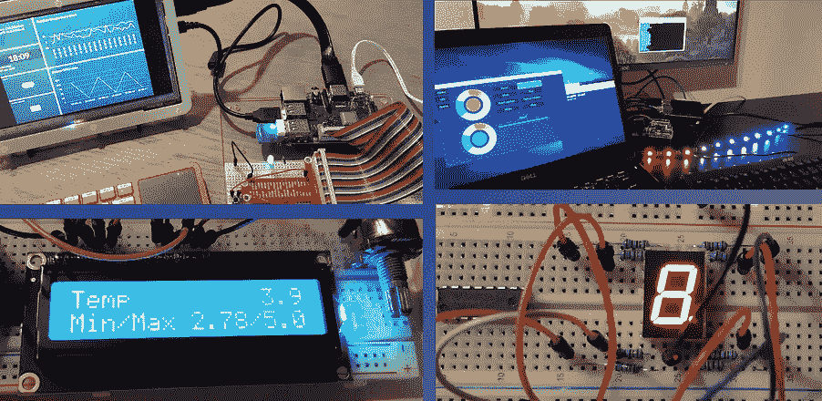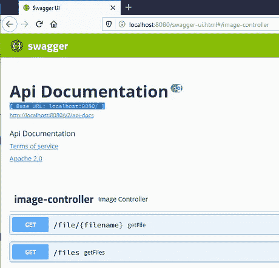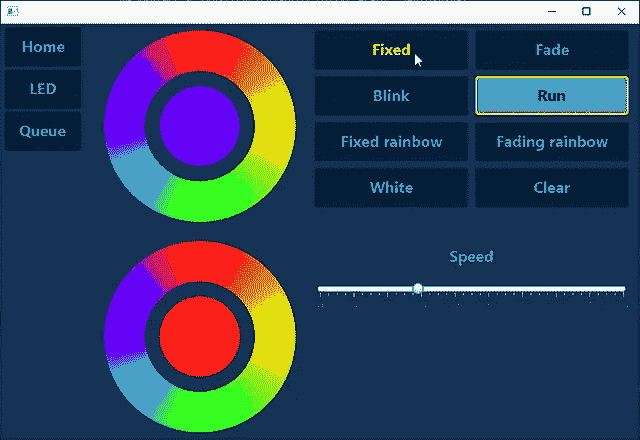

书中的几个例子[“Raspberry Pi 上的 Java 入门”](https://webtechie.be/books)

# 代码

这个应用程序的源代码可以在 GitHub JavaOnRaspberryPi 资源库中找到，这个资源库包含了所有的例子、链接、方案等等。从我的书里。

我们将使用的 [H2 数据库](https://www.h2database.com)是一个完整的 Java 解决方案，它不需要任何额外的安装，但完全是应用程序本身的一部分。

有很多“讨论”是应该将 H2 仅用于测试还是可以用于生产。近年来，它已经发展成为一个非常稳定的数据库解决方案，在我看来，这是嵌入式项目的一个非常好的选择。

[JPA 是用于与数据库“通信”的持久性规范](https://en.wikipedia.org/wiki/Jakarta_Persistence)。它帮助您定义哪些对象(实体)可以存储在数据库的哪些结构(表)中。

# 弹簧初始化 r

多亏了 Spring Initializr 网站，我们可以很容易地开始一个 Spring Boot 项目。为最新的 Java 应用程序选择所有选项并添加

*   弹簧网
*   春季数据 JPA
*   Rest 存储库
*   H2 数据库

这将为您创建一个 ZIP 下载，其中包含一个完整的 Maven 项目，您可以在 IDE 中打开并进一步扩展。

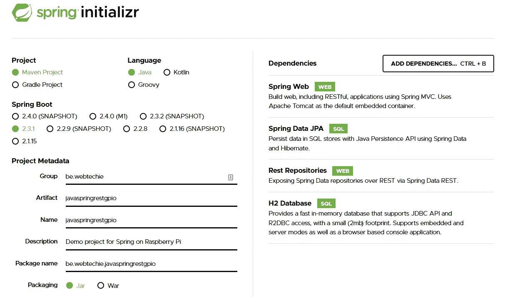

# 创建数据库实体

JPA 的主要优势是我们可以用代码定义数据库结构。我们不需要创建和定义表；代码会处理好这个问题。

这是我们希望在示例中使用的模型:

*   传感器
*   每个传感器的测量次数不受限制

在图表中是这样的:

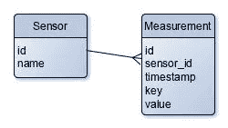

这可以通过在一个包(目录)“entity”中向我们的项目添加两个类来实现。首先，我们为传感器创建一个名为“SensorEntity.java”的文件。正如你所看到的，这段代码包含了很多“注释”(以@)来帮助框架将代码映射到数据库。

```
/**
 * Maps a database entity from the table SENSORS to a Java object.
 * The ID is marked as the unique identifier.
 */
@Entity
@Table(name = "SENSORS", 
    uniqueConstraints={@UniqueConstraint(
        name="UN_SENSOR_ID", 
        columnNames={"ID"})})
public class SensorEntity {
    /**
     * Auto-generated identifier to have a unique key for
     * this sensor.
     */
    @Id
    @GeneratedValue
    private Long id;

    /**
     * Name of the sensor, a required value.
     */
    @Column(nullable = false)
    private String name;

    /**
     * Relationship between the sensor and a list of measurements.
     */
    @OneToMany(
            mappedBy = "sensorEntity",
            cascade = {CascadeType.MERGE},
            fetch = FetchType.LAZY
    )
    private Set<MeasurementEntity> measurements = new HashSet<>();

    ...
}
```

同样，我们添加一个类“MeasurementEntity.java”

```
/**
 * Maps a database entity from the table MEASUREMENTS to a Java
 * object. The ID is marked as the unique identifier.
 */
@Entity
@Table(name = "MEASUREMENTS", 
    uniqueConstraints={@UniqueConstraint(
        name="UN_MEASUREMENT_ID", 
        columnNames={"ID"})})
public class MeasurementEntity {

    /**
     * Auto-generated identifier to have a unique key for 
     * this sensor.
     */
    @Id
    @GeneratedValue
    private Long id;

    /**
     * Relationship between the measurement and its sensor.
     */
    @ManyToOne
    @JoinColumn(
        name = "SENSOR_ID", 
        nullable = false, 
        foreignKey = @ForeignKey(name="FK_MEASUREMENT_SENSOR"))
    private SensorEntity sensorEntity;

    /**
     * Timestamp of the measurement.
     */
    @Column(nullable = false)
    private long timestamp;

    /**
     * Key for the type of measurement, e.g. "temperature", 
     * "distance"...
     */
    @Column(nullable = false)
    private String key;

    /**
     * Value of the measurement
     */
    @Column(nullable = false)
    private double value;

    ...
}
```

这两个类是我们定义数据库表和数据存储方式所需要的！

# 在数据库中存储数据

我们将用两个存储库类和最少的代码做到这一点！让我们从传感器开始，创建一个包“repository”和一个文件“SensorRepository.java”。通过扩展“JpaRepository ”,我们可以免费获得大多数 CRUD 功能(创建、读取、更新和删除),并且只需要定义我们需要的额外方法。通过使用与实体中的值相同的参数名，Spring 将为我们处理功能！

```
@Repository
public interface SensorRepository extends   
       JpaRepository<SensorEntity, Long> {
    Page<SensorEntity> findAll(Pageable pageable);

    List<SensorEntity> findAllByName(String name);

    SensorEntity findById(@Param("id") long id);
}
```

“MeasurementRepository.java”甚至更小:

```
@Repository
public interface MeasurementRepository extends 
    JpaRepository<MeasurementEntity, Long>{
    Page<MeasurementEntity> findAll(Pageable pageable);
}
```

# 添加其他服务

现在让我们用 REST-services 来公开我们的数据库功能，这样任何人都可以从数据库中读取数据和向数据库中写入数据！

创建包“resource”和文件“SensorResource.java”。在这里，我们定义了 URL 上可用的三个服务:

*   从数据库中获取 localhost:8080/sensor:所有传感器
*   从数据库中获取 localhost:8080/sensor/id: one 传感器
*   POST localhost:8080/sensor:添加一个具有给定名称的传感器，检查该名称是否尚未使用

所有这些都是通过我们之前创建的 SensorRepository 完成的:

```
@RestController
public class SensorResource {
    @Autowired
    private SensorRepository sensorRepository;

    @GetMapping("/sensor")
    public List<SensorEntity> retrieveAllSensors() {
        return sensorRepository.findAll();
    }

    @GetMapping("/sensor/{id}")
    public SensorEntity retrieveSensor(@RequestParam long id) {
        return sensorRepository.findById(id);
    }

    @PostMapping("/sensor")
    public ResponseEntity createSensor(@RequestParam String name) {
        List<SensorEntity> sensorEntities = sensorRepository
            .findAllByName(name);

        if (sensorEntities.size() > 0) {
            return ResponseEntity.status(HttpStatus.BAD_REQUEST)
                .body("There is already a sensor with the name: " 
                        + name);
        }

        SensorEntity sensorEntity = new SensorEntity(name);
        sensorRepository.save(sensorEntity);
        return ResponseEntity.ok(sensorEntity);
    }
}
```

我们需要对测量进行同样的操作，以提供这些 URL:

*   获取 localhost:8080/measurement:数据库中的所有测量值
*   POST localhost:8080/measurement:在检查给定的传感器 ID 是否在数据库中定义后，为给定的传感器 ID、键和值添加测量:

```
@RestController
public class MeasurementResource {
    @Autowired
    private SensorRepository sensorRepository;

    @Autowired
    private MeasurementRepository measurementRepository;

    @GetMapping("/measurement")
    public List<MeasurementEntity> retrieveAllMeasurements() {
        return measurementRepository.findAll();
    }

    @PostMapping("/measurement")
    public ResponseEntity createMeasurement(
        @RequestParam long sensorId, 
        @RequestParam String key, 
        @RequestParam double value) {

        SensorEntity sensorEntity = sensorRepository
            .findById(sensorId);

        if (sensorEntity == null) {
            return ResponseEntity.status(HttpStatus.BAD_REQUEST)
                .body("No sensor defined with the ID: " + sensorId);
        }

        MeasurementEntity measurementEntity = new MeasurementEntity(
            sensorEntity, System.currentTimeMillis(), key, value);
        measurementRepository.save(measurementEntity);

        return ResponseEntity.ok().build();
    }
}
```

# 在 PC 上测试

我们来试试吧！在“javaspringrestdbapplication . Java”中的 main 函数上点击 run，并浏览到[http://localhost:8080/swagger-ui . html .](http://localhost:8080/swagger-ui.html.)通过使用 Swagger 界面，我们可以通过点击“POST /sensor”和“试用”来创建一些传感器。您可以通过尝试“/sensor”和“/sensor/{id}”的 GET 来查看创建的记录，也可以直接浏览到[http://localhost:8080/sensor。](http://localhost:8080/sensor.)查看截图，了解存储数据的示例。

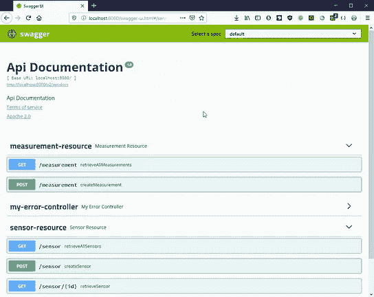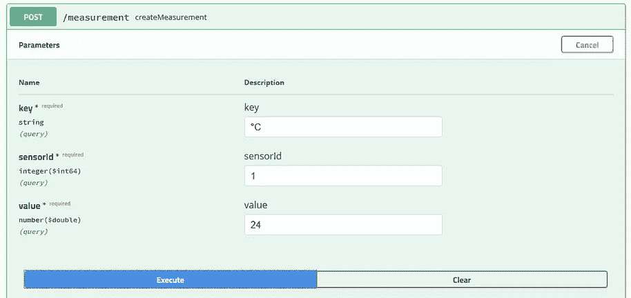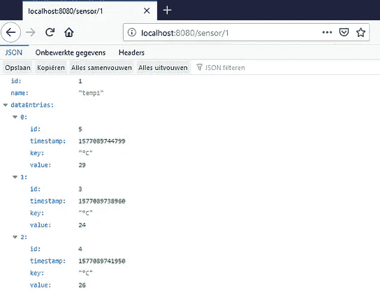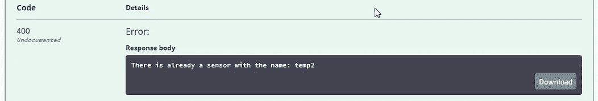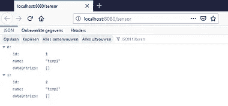

允许测试 REST API 的 Swagger 接口的屏幕截图

# 检查 H2 控制台中的数据

如果你在“src > main > resources > application . properties”中添加一个额外的设置，神奇的事情就会发生。出乎意料的是，我们的应用程序扩展了一个完整的数据库浏览器！

```
spring.h2.console.enabled=true
```

重新启动应用程序，以便应用新设置。因为默认情况下，H2 将所有内容都存储在内存中，所以我们的测试数据已经没有了，我们需要像前面描述的那样，首先使用 Swagger 再次生成一些数据。现在浏览到[http://localhost:8080/H2-console](http://localhost:8080/h2-console)并确保“jdbc:h2:mem:testdb”被用作“JDBC URL”。在下面的截图中，您可以看到我们在代码中为两个表定义的数据库结构，并检查数据。

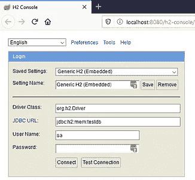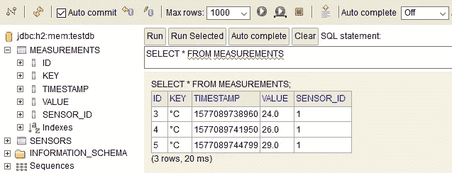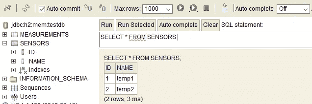

允许您浏览数据库的 H2 网络界面的屏幕截图

# 在 Raspberry Pi 上运行的配置

我们的应用程序可以在 PC 上运行，现在让我们准备树莓派。Spring 将在启动时在 config 目录中查找 application.properties 文件，如果找到，将使用该文件而不是 jar 中包含的文件。让我们使用这个功能来重新配置应用程序，使用文件数据库而不是内存数据库，这样在重新启动时数据就不会丢失。

我们将为应用程序创建一个目录，并添加如下属性:

```
$ mkdir /home/pi/dbapp $ cd /home/pi/dbapp $ mkdir config $ nano config/application.properties spring.datasource.url=jdbc:h2:file:/home/pi/dbapp/spring-boot-h2-db spring.datasource.username=sa spring.datasource.password= spring.datasource.driver-class-name=org.h2.Driver spring.jpa.hibernate.ddl-auto=update
```

将 PC 上的应用程序构建到带有“mvn clean package”的 jar 中，并将“Java-spring-rest-d b-0 . 0 . 1-snapshot . jar”从“target”目录复制到您的 Pi 的“/home/pi/dbapp”目录中。

在这个屏幕截图中，您还可以看到创建的数据库文件“spring-boot-h2-db.mv.db ”,如属性文件中所定义的。当通过 Swagger 添加数据时，您会看到这个文件的大小在增长。

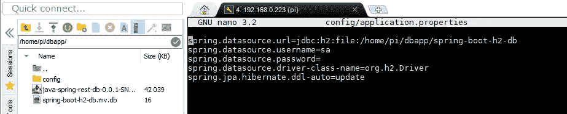

在 Raspberry Pi 上配置使用 H2 数据库文件 so 数据

运行该应用程序会得到类似于 PC 上的预期输出:

```
$ java -jar java-spring-rest-db-0.0.1-SNAPSHOT.jar

  .   ____          _            __ _ _
 /\\ / ___'_ __ _ _(_)_ __  __ _ \ \ \ \
( ( )\___ | '_ | '_| | '_ \/ _` | \ \ \ \
 \\/  ___)| |_)| | | | | || (_| |  ) ) ) )
  '  |____| .__|_| |_|_| |_\__, | / / / /
 =========|_|==============|___/=/_/_/_/
 :: Spring Boot ::        (v2.1.8.RELEASE)

Starting JavaSpringRestDbApplication v0.0.1-SNAPSHOT on raspberrypi with PID 4557 
    (/home/pi/dbapp/java-spring-rest-db-0.0.1-SNAPSHOT.jar
    started by pi in /home/pi/dbapp)
No active profile set, falling back to default profiles: default
Bootstrapping Spring Data repositories in DEFAULT mode.
Finished Spring Data repository scanning in 465ms. Found 2 repository interfaces.
...
Tomcat started on port(s): 8080 (http) with context path ''
Started JavaSpringRestDbApplication in 63.416 seconds (JVM running for 67.637)
```

与我的开发电脑相比，最大的区别在于最后一行:

```
Started JavaSpringRestDbApplication in 5.452 seconds (JVM running for 7.338)
```

事实上，您需要考虑到这个应用程序需要在 Pi 上有较长的启动时间。但是一旦它运行，你就可以通过你的 Pi 的 IP 地址，在你的网络中的任何一台 PC 上访问 Swagger 和其他服务，在我的例子中是 192.168.0.223。

# 结论

这只是一个包含两个表的基本示例，但它向您展示了如何用最少的代码快速构建一个数据库应用程序。REST-服务适用于所有通过网络连接到您的 Raspberry Pi 的设备，因此它们可以在一个中心位置存储数据和/或读取数据。

REST-services 提供的 JSON 数据可以被所有不同类型的设备或应用程序用来可视化结果。在 [Elektor 网站上，你可以找到一个微控制器在屏幕上显示 JSON 数据的好例子](https://www.elektormagazine.com/labs/9292-dutch-public-transport-monitor)。

在 Raspberry Pi 上运行 Java 和 Spring 只是这种小巧、廉价但非常强大的机器的多功能性的一个例子！想了解#JavaOnRaspberryPi 的更多乐趣，请查看我的书[“Raspberry Pi 上的 Java 入门”](https://webtechie.be/books)。

*原载于*[*https://web techie . be*](https://webtechie.be/post/2020-07-13-spring-rest-h2-raspberry-pi/)*。*