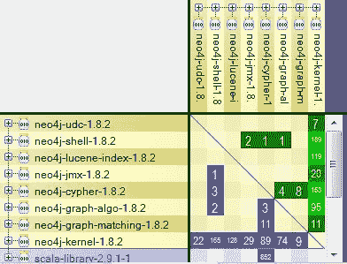
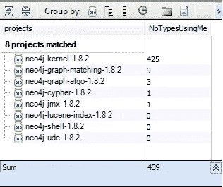
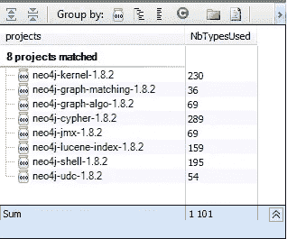
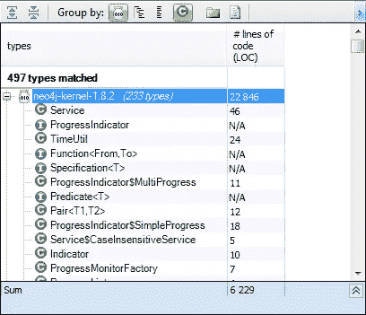
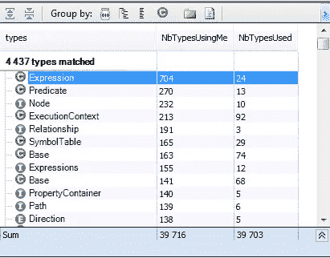

# 抽象性与不稳定性:Neo4j 案例研究

> 原文：<https://medium.com/javarevisited/abstractness-vs-instability-neo4j-case-study-c453f46a6ea5?source=collection_archive---------5----------------------->

《干净的代码》和《T2 干净的架构》的作者 Robert C.Martin 写了一篇有趣的文章，关于一组度量标准，可以用来测量一个面向对象设计(T4)的质量，根据设计的子系统之间的相互依赖性。

以下是他在文章中谈到的模块之间的相互依赖:

> 是什么让一个设计僵化、脆弱、难以重用？这是设计中子系统的相互依赖。如果一个设计不能轻易改变，它就是僵化的。这种僵化是由于这样一个事实，即对高度相互依赖的软件的一个单独的改变开始了对相关模块的一连串改变。当设计者或维护者无法预测这一连串变更的程度时，变更的影响就无法估计。这使得变革的成本无法估计。面对这种不可预测性，经理们变得不愿意授权变革。因此，设计变得僵化。

为了对抗僵化，他引入了像传入耦合、传出耦合、抽象和不稳定性这样的度量。

让我们来发现所有这些指标，以及它们如何对改进应用程序的设计非常有用。为此，让我们通过 [JArchitect](http://www.jarchitect.com/) 来分析 [Neo4j](http://www.neo4j.org/) 。

Neo4j 是一个健壮的事务属性图数据库。由于它的图形数据模型，Neo4j 非常敏捷，速度极快。对于连接的数据操作，Neo4j 的运行速度比关系数据库快一千倍。

这是所有 Neo4j jars 之间的依赖关系图

Neo4j 包含许多 jar，并且它们都依赖于 neo4j-kernel，为了获得关于使用每个 jar 的权重的更多细节，DSM(依赖关系结构矩阵)是一种表示和导航组件间依赖关系的紧凑方式。

如矩阵所示，neo4j 内核被其他 jar 大量使用。

**传入耦合**

该项目的外部类型数量取决于该项目的内部类型。

让我们执行以下 CQLinq 查询来获取 Neo4j jars 的传入耦合:

> 从项目中的 p 到哪里！p . is 第三方选择新的{ p，p.NbTypesUsingMe }

如前所述，内核更多地被其他 jar 请求。

**传出耦合**

此项目的类型使用的此项目之外的类型数。

> 从项目中的 p 到哪里！p . is 第三方选择新的{ p，p.NbTypesUsed }

传出耦合和传入耦合也可以应用于包和类型。例如，特定类型的传出耦合是它直接依赖的类型的数量。TypeCe 非常高的类型是依赖于太多其他类型的类型。他们是复杂的，一般来说，有一个以上的责任。

**抽象性**

内部抽象类型(即抽象类和接口)的数量与内部类型数量的比率。此指标的范围是 0 到 1，A=0 表示完全具体的项目，A=1 表示完全抽象的项目

> A = Na / Nc
> 
> 其中:
> 
> A =模块的抽象性
> Zero 是一个完全具体的模块。一个是完全抽象的模块。
> Na =模块中抽象类的数量。
> Nc =模块中具体类的数量。

让我们以 neo4j-kernel-1.8.2 jar 为例，搜索所有抽象类型。

> 从其中 t.IsAbstract || t.IsInterface
> 的类型中选择 new { t，t.NbLinesOfCode }

neo4j-kernel-1.8.2 有 1071 种类型，所以抽象度等于 233/1071 = 0.21755

为了增加项目的抽象性，我们必须添加更多的抽象类或接口。

**不稳定**

传出耦合(Ce)与总耦合的比率。I = Ce / (Ce + Ca)。此度量是项目对变化的适应能力的指标。该指标的范围是 0 到 1，I=0 表示完全稳定的项目，I=1 表示完全不稳定的项目。

> I = Ce/(Ce + Ca)
> I 代表与项目相关的不稳定程度。
> Ca 代表传入耦合或传入依赖，而
> Ce 代表传出耦合或传出依赖

让我们以一个类为例，其中许多其他类使用它，而它不使用任何其他类。在这种情况下，该类被认为是稳定的，原因如下:

–这种类完全不依赖于任何东西，因此被依赖者的变化不会波及到它并导致它发生变化。这种特征被称为“独立性”。独立类是不依赖于任何其他东西的类。

–它依赖于许多其他类。对其进行更改变得更加困难。如果我们要改变它，我们必须改变依赖它的所有其他类。因此，有很大的力量阻止我们改变这些类，并提高它们的稳定性。

被严重依赖的类被称为“负责的”。负责任的类往往是稳定的，因为任何变化都有很大的影响。

让我们通过执行以下 CQLinq 查询来搜索更可靠的类型

> (从 t in Types
> order by t.NbTypesUsingMe 降序，t.NbTypesUsed 降序，t.NbBCInstructions 降序
> select new { t，t . NbTypesUsingMe，t.NbTypesUsed})

表达式类是最受欢迎的一个。

**抽象性 vs 不稳定性图形和疼痛区域**

这是 Neo4j 框架的图表

这个图表背后的思想是程序的代码元素越流行，它就越应该是抽象的。或者换句话说，避免过于直接依赖实现，而是依赖抽象。对于流行的代码元素，我指的是一个被程序的其他项目大量使用的项目(但是这个想法也适用于包和类型)。
在你的代码库中使用非常流行的具体类型并不是一个好主意。这引发了程序中的一些痛苦区域，在这些区域中，更改实现可能会潜在地影响程序的很大一部分。众所周知，实现比抽象发展得更快。

上图中的主序列线(虚线)显示了抽象性和不稳定性应该如何平衡。一个稳定的组件将被放置在左边。如果您检查主序列，您可以看到这样一个组件应该非常抽象，接近理想的行—另一方面，如果它的抽象程度低，它就位于一个称为“痛苦区”的区域。

例如，neo4j 内核有许多类依赖于它，所以它位于左侧，在这种情况下，最好更抽象地离开橙色区域，前往绿色区域。

重要的是避免痛苦的区域，如果一个 jar 在这个区域内，对它的任何改变都会影响很多类，并且很难维护或发展这个模块。