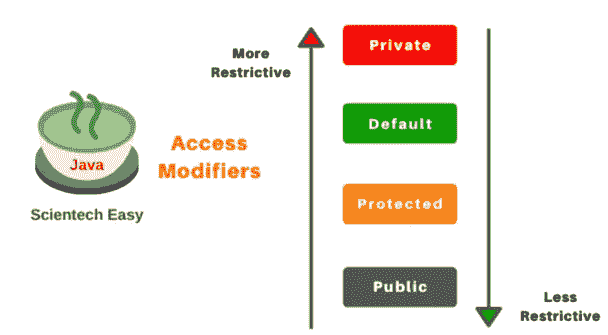
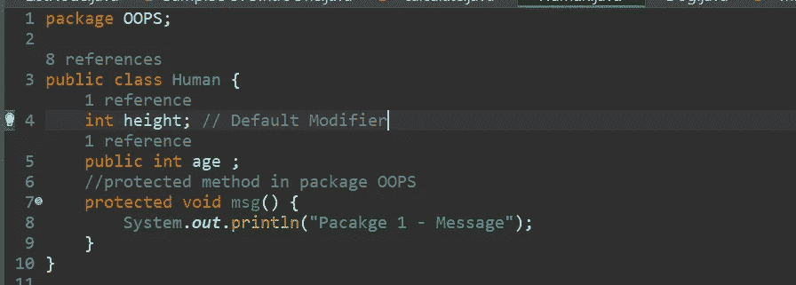
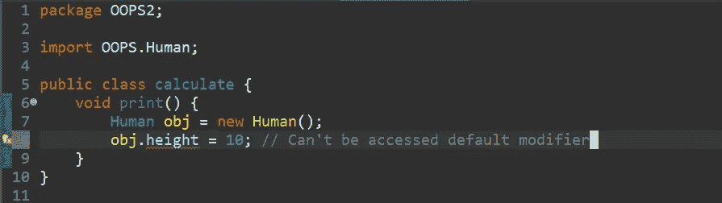
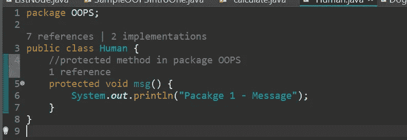
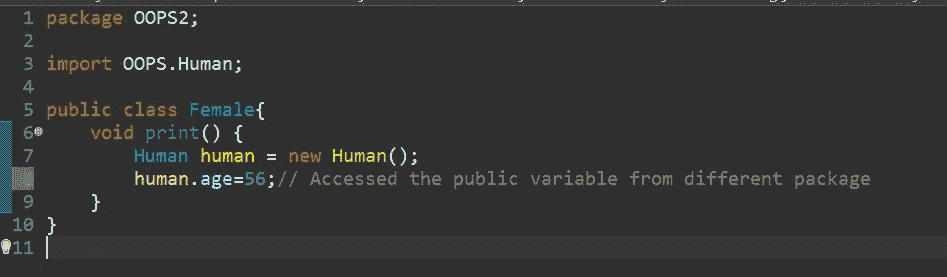
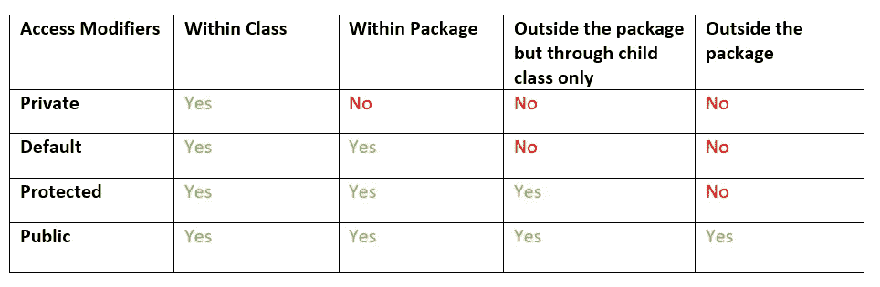

# Java 中的访问修饰符

> 原文：<https://medium.com/javarevisited/access-modifiers-in-java-a07ca3493500?source=collection_archive---------2----------------------->

Java 中的访问修饰符

访问修饰符指定变量、方法、构造函数或类的范围或可访问性。我们可以通过应用访问修饰符来改变变量、方法和类的可访问性级别。

Java 中有 4 种类型的访问修饰符。它们是:

1.  [Private](https://www.java67.com/2019/02/can-you-add-non-abstract-method-on-interface-in-java.html):Private 修饰符的访问级别只在类内。我们不能访问类外的私有字段。
2.  默认:默认修改器的访问等级在[包](https://www.java67.com/2018/06/a-beginners-guide-to-package-in-java.html)内。我们不能在包裹外接触到它。
3.  [Protected](https://javarevisited.blogspot.com/2012/10/difference-between-private-protected-public-package-access-java.html) :默认修饰符的访问级别在包内，也可以在包外通过子类访问。
4.  [Public](http://www.java67.com/2012/12/what-is-public-private-protected-package-default-private-access-modifier-java.html):Public 修饰符的访问级别无处不在。我们可以在类内、类外、包内以及包外访问它。

现在让我们通过一个简单的例子来逐一理解。

1.  **私人:**

它只能在类中访问。

**示例:**

私有访问修饰符示例

**2。默认:**

如果你不使用任何修改器，那么默认情况下它被视为默认修改器。有了这个，我们可以在类之外但在同一个包内访问。

**示例:**

包装-1

包装— 2

**3。受保护:**

受保护的访问修饰符可以在包内和包外访问，但只能通过子类访问。

**示例:**

包装— 1

包装— 2

**4。公共:**

公共访问修饰符可以在任何地方访问。

**例如:**

包装— 1

包装— 2

**访问修饰符表:**

访问修饰符-表

✨It's ended✨

如果你想鼓励我，你可以点击下面的链接，给我买杯咖啡。它帮助我写更多有创意的文章。你的支持意义重大！谢谢你。

[*给我买杯咖啡*](https://ko-fi.com/hemanthraju) ☕️！！！！！😍

感谢阅读我的文章。😊

[**如果你 liked🧡读了这篇文章，你可能也会喜欢下面的文章。看看吧！**](http://cool/)

<https://bootcamp.uxdesign.cc/css-box-model-5a397de31ae9>  </nerd-for-tech/top-10-books-to-learn-java-e6aa9c68164>  <https://python.plainenglish.io/maximum-sum-subarray-using-sliding-window-technique-8667ca805a02>  

请订阅我的电子邮件，你会得到定期更新！

保持微笑！

祝您愉快！！！