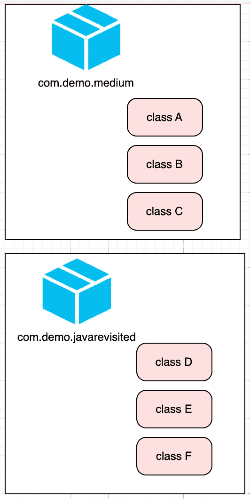

# JAVA 中的访问修饰符

> 原文：<https://medium.com/javarevisited/access-modifiers-in-java-b8e387fd8b46?source=collection_archive---------7----------------------->

java 程序的访问和范围

访问修饰符用于指定类及其成员的范围。通俗地说，我们可以说，通路意味着到达该地方的一种方式。这里我们讨论的是我们的代码，即一个 java 程序，在这里我们定义了特定代码相对于其修饰符的作用域。

# 私有范围

1.  当我们对类的成员使用 private 修饰符时，这些成员的作用域将是私有的。
2.  私有成员只能从同一个类中访问，甚至不能从子类中访问，这意味着我们不能继承私有类成员。
3.  我们不能在这个职业中使用[**私有**修饰符](https://javarevisited.blogspot.com/2012/03/private-in-java-why-should-you-always.html)。

现在让我们来看看当我们想要子类化这个类的私有成员时会发生什么。

```
class HelloWorld {
     private int a = 60;
   }
class ByeWorld extends HelloWorld{
     public static void main(String[] args) {
       ByeWorld hello = new ByeWorld();
        System.out.println(hello.a);
    }
}
```

```
javac /tmp/gOVuc9VvLe/ByeWorld.java
/tmp/gOVuc9VvLe/ByeWorld.java:11: error: a has private access in HelloWorld
        System.out.println(hello.a);
^
1 error
```

这里我们可以清楚地看到 [**JVM**](/javarevisited/7-best-courses-to-learn-jvm-garbage-collection-and-performance-tuning-for-experienced-java-331705180686) 抛出一个错误为“ ***a 在 HelloWorld*** 中有私有访问”，这清楚地陈述了上面的第 2 点。

# 默认范围

当我们不使用任何修饰符(如 public、private 或 protected)时，默认的作用域实际上是 scope。

1.  它也被称为打包作用域，因为这个作用域的成员可以从同一个类、子类和非子类访问，但是在同一个包中可用。
2.  不能从包外部访问该类的默认成员。
3.  与[私有范围](http://www.java67.com/2012/12/what-is-public-private-protected-package-default-private-access-modifier-java.html)不同，默认范围是类及其成员。

[](https://www.java67.com/2019/02/can-you-add-non-abstract-method-on-interface-in-java.html)

默认范围图

所以从上面我们可以说，包 com.demo.medium 的类 A 的默认成员是不能被 com.demo.javarevisited 的类 D、类 E 或类 F 访问的。

# **保护范围**

在受保护的范围内，我们对类的成员使用了受保护的修饰符。受保护类的成员可以从同一个包中的同一个子类和非子类中访问。

**注意** : ***保护成员可以从不同包*** 的子类中访问

protected 修饰符只能用于该类的成员。

# **公开范围**

当我们对类的成员使用一个 [public 修饰符](https://javarevisited.blogspot.com/2012/10/difference-between-private-protected-public-package-access-java.html)时，我们说作用域是公共的。公共成员没有任何限制，因为他们可以访问整个项目中的任何地方。

public 修饰符可用于类及其成员。

我希望你明白这个主题，如果你有任何困惑，请告诉我，以便我可以用一些更具互动性的例子来更深入地解释它。更多类似的话题，请关注，如果你喜欢这些内容，请鼓掌。敬请期待！

