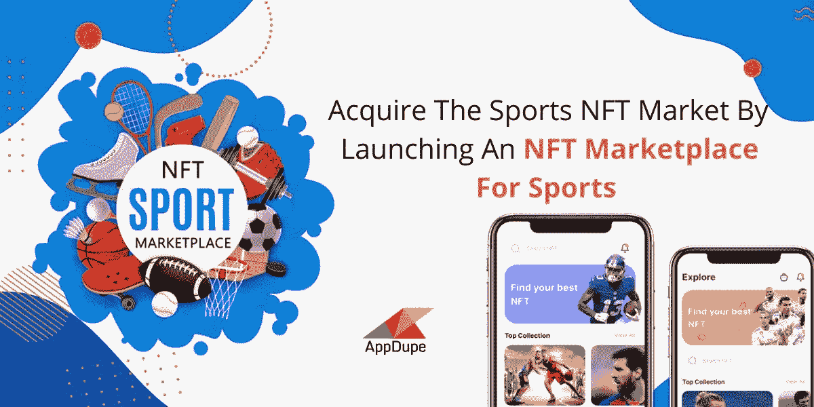
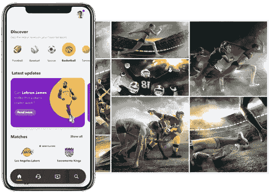

# 通过推出 NFT 体育市场来获得 NFT 体育市场

> 原文：<https://medium.com/javarevisited/acquire-the-sports-nft-market-by-launching-an-nft-marketplace-for-sports-ca12ce8f61be?source=collection_archive---------2----------------------->

NFT 体育市场

不可替代代币不再是一个新名词，它们被个人视为一种投资选择。随着无数种类的 NFT 的频繁亮相，[NFT](https://javarevisited.blogspot.com/2021/12/top-5-courses-to-learn-about-nfts-non.html)的市场规模正在迅速扩大。根据全球 NFT 市场分析，到 2028 年，市场规模将达到 1230 亿美元。在这里，我们将更详细地讨论 NFT 体育市场，以及如何在预计的时间跨度内 [**打造您的 NFT 体育交易平台**](https://www.appdupe.com/nft-sports-marketplace-development) 。

# 📌什么是运动 NFT？

体育 NFT 是人们熟悉的、交易量最大的数字收藏品之一。体育收藏品的类型将取决于创作者，它可以是从图像、视频、交易卡到游戏配件的任何东西。体育 NFT 市场是一个建立在任何特定的区块链技术上的交易平台，体育 NFT 的创造者/卖家和买家可以在这里一起进行交易。

例如，NBA Top Shot 是一个 NFT 体育市场，在那里可以找到数字篮球交易卡和其他 NFTs 形式的比赛纪念品。同样，体育 NFTs 可以是任何东西，并以带有图像、描述和价格的任何运动为特色。

# 📌受欢迎的 NFT 体育市场——一个有趣的细分

⚈ **泽德跑**

Zed Run 是一个迷人的 NFT 赛马平台，数字马是这里的 NFT。NFT 是独一无二的，平台上的马也是如此，玩家可以买卖和繁殖。最初，愿意参加比赛的玩家必须从平台上购买一匹数码马。每匹马都有不同类别的个性特征，如血统、基因、性别、皮肤类型等。游戏玩家将根据他们的马在比赛中的表现获得奖励。此外，玩家可以通过任意两匹马的配对来繁殖马匹。游戏变得有趣，玩家购买、饲养和出售他们的数码马。

⚈ **NBA 顶级投篮**

美国国家篮球协会(NBA)是由多个球队组成的篮球联盟。此外，NBA 是美国和加拿大的体育联盟之一。NBA 与 Dapper Labs 合作，开发并推出了 NBA Top Shot，这是一个以篮球交易卡为特色的独家平台。除了列出交易卡，该平台还设有挑战，参与并赢得挑战的人将获得奖励。平台上的交易卡将根据稀有程度进行分类。越是稀有的卡片，价值越大。

⚈ **索拉雷**

类似于 NBA Top Shot 的篮球交易卡，Sorare 的足球交易卡被称为 [NFTs](https://savingsfunda.blogspot.com/2022/05/top-10-online-courses-to-learn-nfts-non-fun.html) 。该平台每周托管多个官方许可的运动俱乐部。整个游戏基于玩家拥有的卡片类型，卡片分为 4 类:有限、稀有、超级稀有和独特。

# 📌NFT 体育市场是如何运作的？

🔥**报名**

注册是一个强制性的步骤，用户必须在这个步骤中集成他们的加密钱包。如果他们没有数字钱包，那么就必须创建一个，并将其与 NFT 体育市场整合。

🔥**列举体育收藏品**

体育协会或运动员可以在市场上列出他们的 NFT 收藏品，以便向购买者展示。平台用户可以访问所有列出的收藏品，还可以了解价格、描述、所有者等详细信息。

🔥**拍卖**

NFT 一般通过拍卖的方式购买。业主将确定基本销售价格，同时提及投标的最后日期。因此，买家可以根据他们支付得起的密码开始竞拍 [NFT](https://www.courserevisited.com/2022/02/10-best-courses-to-learn-nft-in-2022.html) 。

🔥**交易**

拍卖过程将会结束，出价最高的人将有资格拥有那辆 NFT。因此，购买者的钱包将被记入相应加密货币的借方，而 NFT 将被记入他们的钱包。

# 白标 NFT 体育市场开发——开发你的市场的可行途径

白标解决方案是使用一些首选的或最少的定制来开发应用程序或市场(根据此上下文)的快捷方法。核心优势在于时间要求，因为白标解决方案是预先构建的，您将超越一些定制，总体而言，您将从中受益。为了开发您的<https://www.appdupe.com/nft-sports-marketplace-development>**NFT 体育市场，您可以选择白牌解决方案，如 NBA Top Shot 克隆、Sorare 克隆、Zed Run 克隆等。**

# **📌结论**

**如果您有成本效益、更少的时间消耗和可快速部署等标准，白标解决方案将最适合您。此外，你需要意识到开发你的 NFT 体育平台的成本和你可以利用的定制化水平可能会因开发商而异。考虑在你的市场中加入创新和高效的特性，使你的平台成为一个非常独特的平台。祝你好运！**