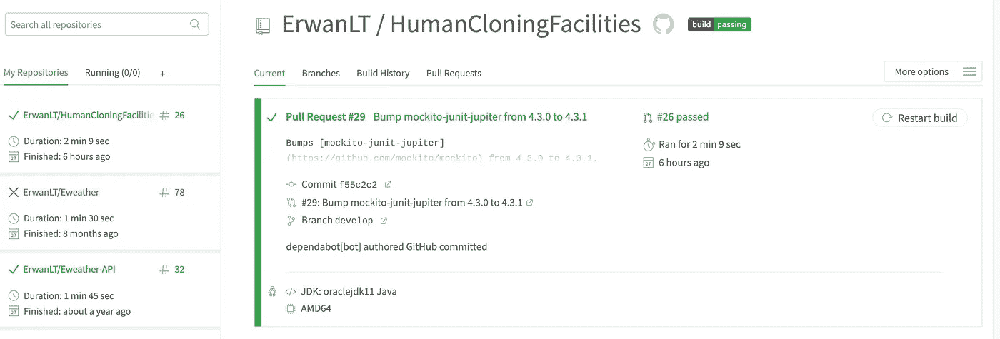
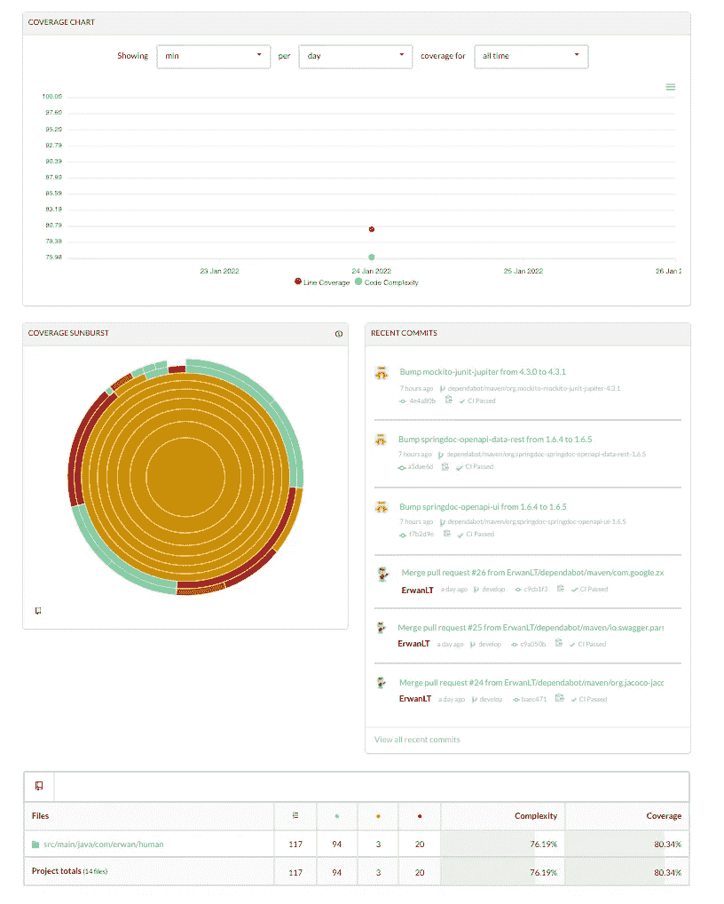
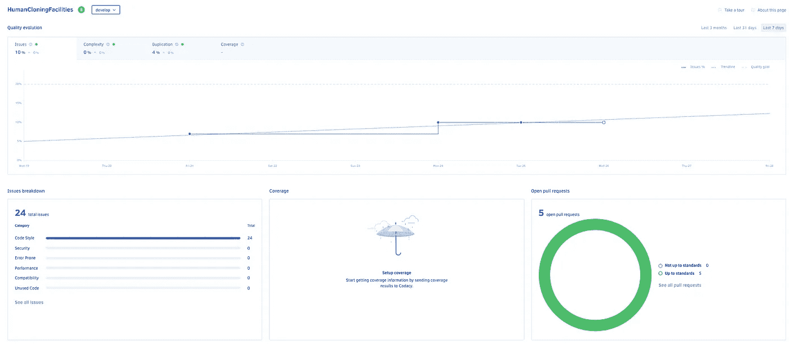
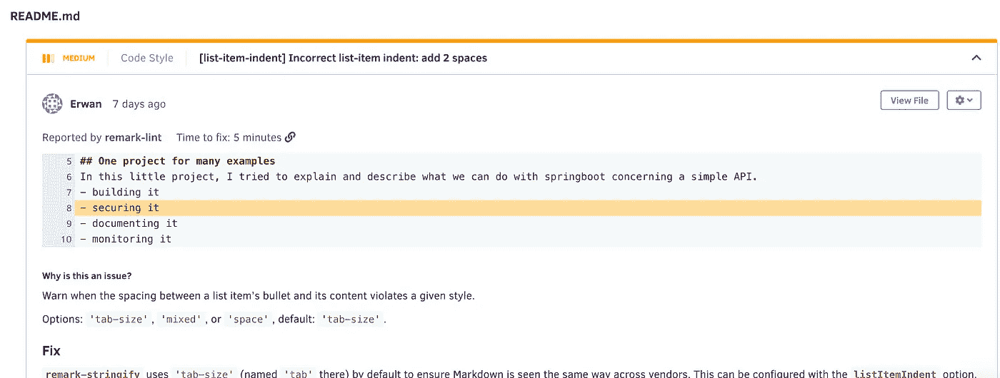

# 向 Github 项目添加一些配置项

> 原文：<https://medium.com/javarevisited/adding-some-ci-to-your-github-project-a10953dacfd7?source=collection_archive---------5----------------------->

## 走向持续集成之路


# 我们将做什么

在前面的步骤中[创建了我们的 API 之后，我们现在将在 Github 项目中添加一些持续集成。
这可以用以下工作流程来描述:](https://letutour-e.medium.com/what-can-i-do-with-api-2c0ea1b7ed36)

*   **本地运行测试:** CI 旨在与通过[测试驱动开发](https://en.wikipedia.org/wiki/Test-driven_development)的实践编写的自动化单元测试结合使用。这是通过在提交到主线之前，在开发人员的本地[环境](https://en.wikipedia.org/wiki/Deployment_environment)中运行并通过所有单元测试来完成的。
*   **在 CI 中编译代码:**构建服务器定期地或者甚至在每次提交之后编译代码，并将结果报告给开发人员。
*   **在 CI 中运行测试:**除了自动化的单元测试之外，使用 CI 的组织通常使用构建服务器来实现*连续的*应用[质量控制](https://en.wikipedia.org/wiki/Quality_control)的过程——小部分工作，经常应用。除了运行单元测试和集成测试之外，这些过程还运行额外的静态分析，测量和分析性能，从源代码中提取和格式化文档，并简化手动 [QA](https://en.wikipedia.org/wiki/Quality_assurance) 过程。

# 它会是什么样子


不是很令人印象深刻，但是对于那些将你的项目传递给他们的人来说非常有用，告诉他们项目的状态，它是否构建，代码覆盖率，以及最后的代码质量。

在本文中，我将向您展示如何使用 3 个工具来给出这些指示(请注意，还有许多其他工具，您也可以自由测试) :

*   [Travis CI](https://www.travis-ci.com/) 委托构建
*   [Codecov](https://app.codecov.io/gh) 为覆盖范围
*   [编码质量](https://www.codacy.com/)

要使用它们，你只需要用你的 Github 证书登录。

# 安装 Travis


为了将我们项目的构建委托给 travis，我们需要两件东西:

*   在您的项目中添加一个配置文件 *.travis.yml* ，并提交+推送。
*   登录网站找到您的回购，然后触发构建(触发构建是可选的，因为文件的提交应该会触发它)。

## Travis 配置文件

这是一个配置文件的例子

```
language: java
jdk: oraclejdk11
dist: trusty

install: true
script: mvn clean install

after_success:
  - bash <(curl -s https://codecov.io/bash)
```

正如你所看到的，里面描述道:

*   项目的语言
*   使用的语言版本
*   将运行的脚本
*   成功后做什么

关于更多的配置和选项，我推荐你阅读文档:[这里](https://docs.travis-ci.com/user/for-beginners/)。

## Travis CI 界面



**崔维斯 CI** 的界面分为两部分 **:**

*   每个项目的构建历史
*   所选版本的详细信息

在“更多选项”中，您可以访问更多设置，允许您添加一些环境变量并使用 cron 触发构建。

单击您的回购名称旁边的徽章，您还可以获得一个降价链接，以添加到 README 页面，该页面将在每次构建后更新。

# Codecov

在我的 travis 配置文件中，我已经指出在成功之后，它应该向 codecov 上传一个覆盖报告。为了生成这个报告，我们需要将 jacoco maven 插件添加到 pom.xml 中(如果您使用 maven 的话)。

自然，代码覆盖需要测试，没有测试就没有代码覆盖，测试我们的代码应该是正常的。

这样，Travis 的每个远程构建都会向 codecov 上传一个新报告。

## Codecov 接口

像以前一样，我们将使用 Github 凭据登录。

通常会显示您的回购列表。


你只需要找到应该上传报告的地方，点击它就可以看到更多的细节。



旭日图是你的项目覆盖范围的一个全局指示器，并且是交互式的，如果你点击一个条纹，你会进入你的项目树的更深处。

你也可以使用底部的文件浏览器来获得每个文件的更多信息。

要获得您的覆盖范围统计徽章，只需转到您的回购设置并以降价格式获取，然后将其添加到您的自述文件中。与 Travis 的版本一样，这个版本也会在每次上传报告后更新。

# Codacy

不，是时候对我们的代码进行质量检查了。

像其他工具一样，我们也将使用 Github 凭证登录。
为了对您的代码进行质量检查，您需要在您的帐户中添加您的库。要做到这一点，只需点击按钮


然后在显示的列表中选择它。
第一次添加项目时，可能需要一些时间来运行检查。

运行结束后，您可以访问存储库仪表板



仪表板主图表允许您跟踪代码质量随时间的演变，以及:

*   代码发布的数量
*   你的代码的复杂性
*   代码重复的百分比
*   覆盖范围(再次是)

在*问题分解*部分，您可以看到代码中不同类型的问题。
如果您点击该号码，您将被重定向到“问题”面板，在该面板中您会看到有关该号码的详细信息

*   文件受到影响
*   问题的类型
*   严重性
*   如何解决



要将徽章添加到您的存储库中，请转到设置面板，并在底部复制降价链接。您也可以单击一个按钮，向您的回购协议打开一个拉取请求来添加它。

感谢您的阅读时间，和以前一样，本教程中使用的代码可以在[Github 资源库](https://github.com/ErwanLT/HumanCloningFacilities)中找到