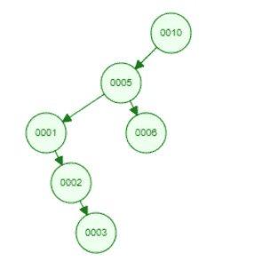
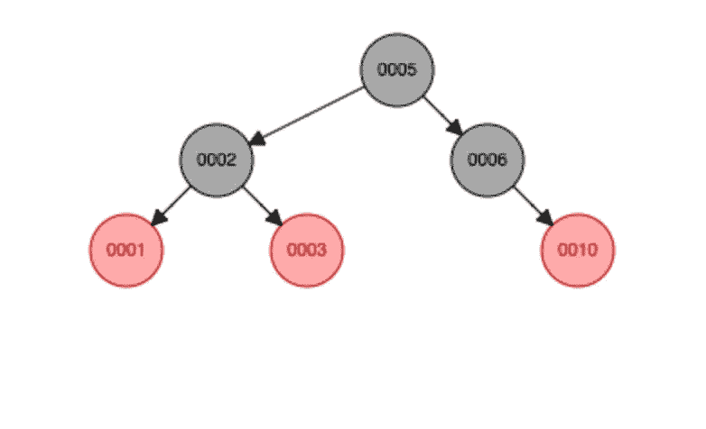
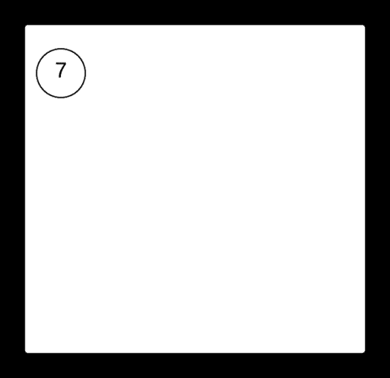
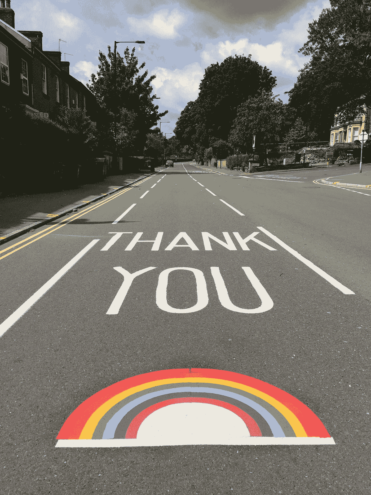

# 高级数据结构

> 原文：<https://medium.com/javarevisited/advance-data-structures-f611f0cc9049?source=collection_archive---------1----------------------->

## 高级数据结构

## 软件工程师需要知道的一些高级数据结构

大家好👋,

在这一集里，我们将会看到一些基本数据结构模块中通常不会涉及的高级数据结构。但它肯定会帮助每个人在复杂问题中以更有效的方式设计我们的程序。我们将会看到二叉查找树树、树莓树、T2 树、红黑树和八字树。BST 可能包含在基本数据结构中。但是我将在这里再次讨论它，以便更好地理解其他主题，因为这些数据结构是从 BST 发展而来的。不再拖延，让我们进入主题。

照片由[维克多·罗德里格兹](https://unsplash.com/es/@vimarovi?utm_source=medium&utm_medium=referral)在 [Unsplash](https://unsplash.com?utm_source=medium&utm_medium=referral) 上拍摄

## **二叉查找树**

BST 又名[二叉查找树](/javarevisited/20-binary-tree-algorithms-problems-from-coding-interviews-c5e5a384df30)是一个基于节点的数据结构，有一些基本的属性需要遵循。BST 的每个节点都应遵循以下属性。

*   在左侧子树中只能找到键低于节点键的节点。
*   只有键大于节点键的节点才会出现在节点的右子树中。
*   左侧和右侧的每个子树也必须是二叉查找树。

下图将让您更好地理解 BST 的属性。所有大于 3 的数字都在树的右侧，而较小的元素在树的右侧。下面的树是按照 3，6，5，10，2，1 的键插入顺序生成的。

图 1

插入顺序将决定 BST 的形状。如果我们插入 10，5，6，1，2，3。

图 2

BST 的效率取决于 BST 的**高度。但是我们不能确定，因为它可能没有适当的平衡，并且比必要的高度要高。让我们比较一下图 1 和图 2。尽管两者具有相同的元素，但图 1 中的 BST 更有效，因为其高度低于图 2 中的 BST。**

BST 支持多种操作，如插入、删除、搜索等。在每次操作之后，BST 树中必须满足上述每个 BST 属性。插入、删除和查询需要 O(h)时间。这里 h 表示树的高度。第一棵树的高度是二，而第二棵树的高度是四。如果你想进一步了解英国夏令时，你可以观看下面的视频。

BST 树插入和删除说明

## Treap

Treaps 是一种数据结构，具有树和堆的属性( **Tree + Heap = Treap** )。堆属性用于节点的随机排序。Treap 是一个 BST，它以随机的方式对节点进行排序。treap 中的节点有两个属性。首先是类似于 BST 的密钥。第二个是优先级属性(独立选择的随机数)。在 Treap 中，键服从二叉搜索树属性，而优先级服从堆顺序属性。如果我们考虑一个 treap 的最小堆实现，必须保持以下属性。

*   如果 v 是 u 的左孩子，那么 v.key u.key
*   如果 v 是 u 的右子，那么 v.key > u.key
*   如果 v 是 u 的孩子，那么 v.priority > u.priority

诸如插入、删除、搜索等处理操作的预期时间复杂度是 O(h)。这是对数 n 的顺序。

在开始 treap 操作之前，你必须清楚地理解树的旋转。树旋转是一种改变节点/子树的位置而不违反任何树或堆属性的操作。

树的旋转以恒定的时间发生。下面的视频给出了一个更好的树木旋转清晰的看法。在进入以下部分之前，请确保您清楚了解以下视频的内容。

来自 Youtube 的树旋转

我给了下面一个 treap 插入视频，让你更好地理解 treap 上的插入。

从 Youtube 上截取插入内容

如果你清楚地理解了 treaps 中的插入。理解 treaps 中的删除会更容易。如果您想在 treap 中延迟一个节点，您需要将它向下旋转到叶节点。然后把它从树上扔下来。搜索和 BST 一模一样。

## 红色黑色的树

一棵红黑树是一个[平衡的 BST](/javarevisited/20-binary-tree-algorithms-problems-from-coding-interviews-c5e5a384df30) 。因此对于 n 个节点，操作的时间复杂度为 O(log2 n)。红黑树中的每个节点除了类似于 BST 的 key 属性之外，还有一个 color 属性。

安妮·斯普拉特在 [Unsplash](https://unsplash.com?utm_source=medium&utm_medium=referral) 上的照片

以下是红黑树必须具备的主要属性。

*   RBT 中的每个节点不是黑色就是红色。
*   RBT 的根和叶是黑色的。
*   如果 RBT 中的节点是红色的，则其父节点是黑色的。
*   从任何节点到其后代叶子的所有简单路径都有相同数量的黑色节点。

你需要很好地理解树的旋转来理解[红黑树](https://javarevisited.blogspot.com/2011/12/treemap-java-tutorial-example-program.html)中的删除和插入。由于旋转需要恒定的时间，红黑树任务中的操作对于 n 个节点来说需要 O(log2 n)的时间。下面的视频将解释插入和删除是如何在红黑树中发生的。

**插在红黑色的树上**

**红色黑树上的缺失**

*   下面的红黑树是用 10，5，6，1，2，3 的键插入顺序生成的。让我们将它与图 2 中的 BST 进行比较。两者具有相同的钥匙插入顺序。但是红黑树更平衡。

图 3 —红色黑色树

*   当我们在红黑树中搜索一个键时，树的结构没有变化。

## 八字树

二分搜索法树并不总是平衡的(如图 2 所示)。因此运算的时间复杂度甚至可能达到 O(n)。八字树也是 BST。但是，在展曲树的顶部执行每个操作之后，它是平衡的。它会自我调节以保持平衡。m 个操作的序列的时间复杂度为 O(m log n)。但是，每个操作的摊余成本为 O(log n)。

张开树在每次操作后通过旋转将期望的节点带到根。随着节点被访问，八字树随着时间的推移变得更加平衡(自我调整，高度降低)。展曲树上的每个操作都有助于利用时间局部性。它有助于当前项目在不久的将来被再次访问，而无需花费太多成本。

让我们看看在下面的 gif 图像中以同样的顺序在一个八字形树中插入 7，3，9。7 首先被插入到一个空的 spaly 树中，它是根，所以那里没有变化。则相对于 BST 属性插入 3。然后 3 被旋转到根，因为它是被访问的最后一个元素。那么 9 被插入到关于 BST 属性的输出展曲树中。然后 9 也旋转，直到它成为根。

来源:[https://brilliant.org/wiki/splay-tree/](https://brilliant.org/wiki/splay-tree/)

**在八字树中插入**

**红黑树中的缺失**

*   在展开树中搜索一个键时，如果找到该键，它将作为根键旋转。如果没有找到，最后访问的元素将作为根元素旋转。您可以在下面的视频中查看所有的展开树操作，以了解更多关于展开树的信息。

*   所有类型的高级数据结构操作都可以在这里[可视化](https://www.cs.usfca.edu/~galles/visualization/Algorithms.html)。动画将有助于更多的理解。

我相信你学了一些高级数据结构。如果您有任何问题或任何澄清，不要犹豫，通过回复部分与我联系。感谢你花宝贵的时间阅读这篇博客，我相信这将激励你继续阅读我的其他博客[这里](https://sthenusan.medium.com/)。

*喜欢这篇文章吗？成为* [*中等会员*](https://sthenusan.medium.com/membership) *继续学习没有任何限制。如果你使用上面的链接，我会收到你的一部分会员费，不需要你额外付费。提前感谢。*

[Caleb Chen](https://unsplash.com/@calebchen?utm_source=medium&utm_medium=referral) 在 [Unsplash](https://unsplash.com?utm_source=medium&utm_medium=referral) 上拍摄的照片