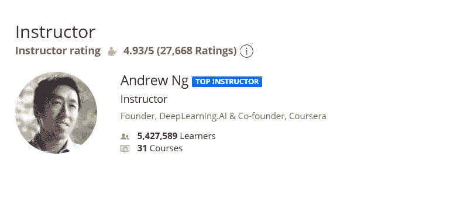
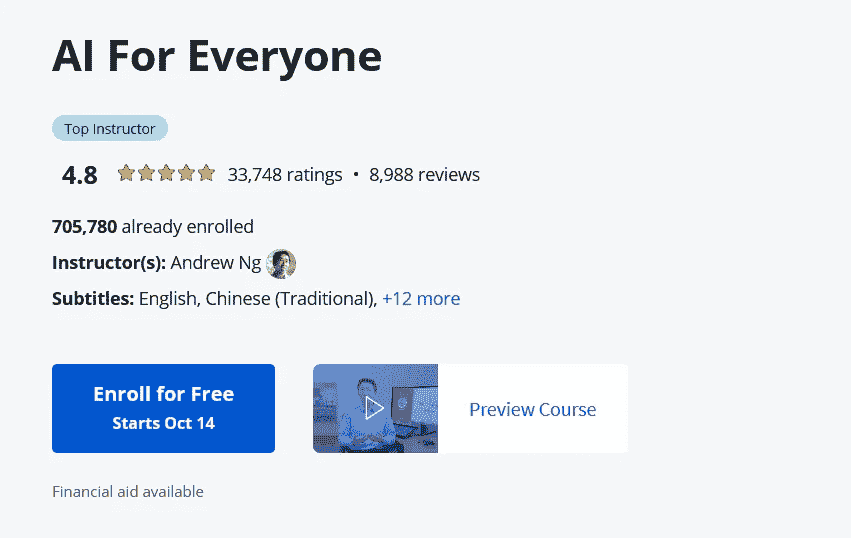

# Coursera 评论——吴恩达的《人工智能为每个人服务》值得吗

> 原文：<https://medium.com/javarevisited/ai-for-everyone-by-andrew-ng-coursera-course-review-3bdf02ac3f4d?source=collection_archive---------1----------------------->

## 我对 Coursera 最受欢迎的人工智能课程之一《面向所有人的人工智能》(the AI For Everyone)的评论不是别人，正是人工智能先驱、Coursera 创始人吴恩达。

你好伙计们，如果你正在寻找一门关于人工智能的入门课程，以及它能做什么或不能做什么，那么吴恩达的[**AI for everybody**](https://coursera.pxf.io/c/3294490/1164545/14726?u=https%3A%2F%2Fwww.coursera.org%2Flearn%2Fai-for-everyone)是最好的选择。

这门课程内容丰富，有趣，它会教你人工智能的基础知识，而不会让你对复杂的细节感到厌烦。课程的长度也正好。演示既有趣又吸引人，这使得学习更容易。

如果你赶时间，我强烈建议你参加这个课程，如果你有时间，那就留下来，我们将详细回顾[这个课程](https://coursera.pxf.io/c/3294490/1164545/14726?u=https%3A%2F%2Fwww.coursera.org%2Flearn%2Fai-for-everyone)，并了解更多关于人工智能和 Coursera 的课程。

毫无疑问，AI(人工。智能)是未来的技能，预计到 2030 年将有 150 亿美元为世界贡献新的科学。

当我们谈论非常合格的人工智能人才时，存在技能短缺，这意味着获得该领域的证书或学位可以保证在公司中获得一个好职位，甚至可以创建和推出你自己的使用人工智能解决人们问题的产品。

大多数人在生活中使用人工智能，甚至没有意识到它们，就像 YouTube 和亚马逊上的购物推荐系统，回答你问题的谷歌助手，你的电子邮件提供商中的垃圾邮件过滤系统，转账时的欺诈检测，甚至像特斯拉这样的自动驾驶汽车，等等，但选项是无穷无尽的。

因此，我们从所有这些统计数据中了解到，人工智能是未来的发展方向，大多数公司都应该在他们的系统中应用这一领域，以利用它让用户的生活变得更加轻松。

跟你说实话，人工智能是一个广阔的领域，没有多少在线课程可以给你在 AI 领域创业所需知道的所有实用知识。吴恩达 的《AI for Everyone》是为数不多的课程之一，它对人工智能进行了很好的概述，而不会让你感到无聊。

<https://coursera.pxf.io/c/3294490/1164545/14726?u=https%3A%2F%2Fwww.coursera.org%2Flearn%2Fai-for-everyone>  

如果你已经决定参加这个课程，那就去参加吧，你不会后悔你的决定。它值得你花费时间和金钱。

# 回顾 Coursera 上吴恩达的《人工智能为所有人服务》值得吗？初学者应该参加这个课程吗？

正如我当时所说，AI for everyone 的课程是一门非常棒的入门课程，可以给大家提供关于人工智能的理论知识。

不仅程序员可以了解人工智能是如何实现的，在你的生活中是如何使用的，任何非技术人员也可以加入这门课程，了解 AI 是如何改变未来的，以及 AI 在现代生活中的影响。

现在，我们来详细回顾一下本课程。我在加入一门课程时一般会看三样东西，讲师简介，比如谁是讲师，他对这个话题是否了解，以及我是否与他有联系。

二、我看由吴恩达 **为大家准备的 [**AI 课程**结构、内容、大纲；这是关于我在课程中学到的东西，第三件事是我看别人对课程的评价。我们将在所有这些参数中为每个人回顾人工智能，以发现它是否是任何想学习人工智能的初学者的正确课程。](https://coursera.pxf.io/c/3294490/1164545/14726?u=https%3A%2F%2Fwww.coursera.org%2Flearn%2Fai-for-everyone)**

## 1.教员回顾

这门课程是由 Coursera 平台的联合创始人和幕后策划者之一吴恩达创建的。我第一次知道吴恩达是在我加入他的免费机器学习课程 时，这是迄今为止最受欢迎的机器学习课程，有超过 430 万名学生参加，我对他的知识和教学风格印象深刻。

[吴恩达](https://coursera.pxf.io/c/3294490/1164545/14726?u=https%3A%2F%2Fwww.coursera.org%2Finstructor%2Fandrewng)在斯坦福大学担任兼职教授，在机器学习、机器人和其他类似领域发表了 100 多篇论文。

他也是 deeplearning.ai 平台的创始人，致力于通过许多课程在理论和实践上向全世界的人教授人工智能。

他在 Coursera 中创建了超过 31 门课程，注册人数超过 500 万，这是一个疯狂的数字，大多数世界上最好的导师甚至无法接近这个庞大的数字。学习 AI 或机器学习时可以加入 [**吴恩达**](https://coursera.pxf.io/c/3294490/1164545/14726?u=https%3A%2F%2Fwww.coursera.org%2Finstructor%2Fandrewng) 的任意一门课程；他是一个天才和大师级的老师。

# 2.课程内容和结构

关于这位讲师，我们已经说得够多了，让我们把注意力更多地放在“面向所有人的人工智能”课程的内容上。现在，让我们来看看本课程是如何组织的，以及本课程涵盖了哪些主题。

## 2.1.[什么是人工智能？](https://coursera.pxf.io/c/3294490/1164545/14726?u=https%3A%2F%2Fwww.coursera.org%2Flearn%2Fai-for-everyone)

你首先需要记住，这整个课程是为每个人准备的。这是一门理论性而非实践性的课程，所以你将介绍机器学习领域，以及计算机如何在没有被编程的情况下从数据中学习。你会明白算法从中学习所需的数据是什么。

接下来，你将了解[人工智能](https://www.java67.com/2020/05/best-artificial-intelligence-courses-for-beginners.html)的术语，以及是什么让一家公司成为人工智能公司。机器学习也有它的能力，不能做你能想象到的一切。你会用一些例子知道机器学习能做什么，不能做什么，通过理解深度学习来完成这个课程。

## 2.2.构建人工智能项目

在学习了人工智能和机器学习的原理之后，你将进入如何构建人工智能项目的工作流阶段，如数据收集和预处理、模型训练、模型评估等。

您还将看到数据科学项目的工作流程，如数据准备和自动文档流程。最后，您将看到如何选择一个人工智能项目，并与您的团队一起构建人工智能项目。

## 2.3.在你的公司里建立人工智能

这门课程还教你公司如何建立人工智能项目，并在他们的系统中实施这些项目，这样你将学习任何人工智能团队中的一些角色，或者换句话说，任何人工智能团队需要什么样的职位，如数据工程师、[数据分析师、](https://becominghuman.ai/5-best-courses-to-learn-pythons-pandas-libary-for-data-analysis-and-data-science-34b62abb0e96) [、数据科学家](https://javarevisited.blogspot.com/2021/05/best-johns-hopkins-courses-for-data-science-coursera.html)、[统计学家](https://javarevisited.blogspot.com/2019/09/top-5-statistics-and-mathematics-course-for-data-science.html)、机器学习工程师，甚至更多。

创建一个 AI 项目并不容易，你可能会面临一些问题，这些问题会阻止你创建这个项目，所以你会看到大多数公司都会遇到的一些 AI 陷阱，以及如何避免它们，以及如何迈出你进入 AI 世界的第一步。

## 2.4.人工智能与社会

人工智能可以显著改善工作环境，也许可以去人类不能去的危险地方。这部分将会给你一个关于人工智能的现实的观点，人工智能的对抗性攻击，这个领域的一些不利使用，等等。

<https://coursera.pxf.io/c/3294490/1164545/14726?u=https%3A%2F%2Fwww.coursera.org%2Flearn%2Fai-for-everyone>  

# 3.人民评论

这是我复习任何课程或加入任何课程时第三重要的参数。看看已经学过这门课程的人对这门课程的评价是个好主意。这会让你对其他人在本课程中发现的优点有所了解。

谈论 [**AI For Everyone**](https://coursera.pxf.io/c/3294490/1164545/14726?u=https%3A%2F%2Fwww.coursera.org%2Flearn%2Fai-for-everyone) ，超过 76000K 人加入了这门课程，这是课程质量的最大社会证明之一。超过 12%的参加本课程的学员还获得了新的工作或职业利益，这是本课程的另一个好处。

我读到的关于这门课程的大多数评论也是积极的，表明这是一门很好的初级课程，可以了解人工智能，它能做什么，不能做什么，以及如何使用它作为工具来改善事情。现在，如果你被说服或者已经下定决心要参加这个课程，那么。

以下是加入本课程的链接—[**AI for every one**](https://coursera.pxf.io/c/3294490/1164545/14726?u=https%3A%2F%2Fwww.coursera.org%2Flearn%2Fai-for-everyone)

顺便说一句，如果你计划参加多个 Coursera 课程或专业，那么考虑参加 [**Coursera Plus 订阅**](https://coursera.pxf.io/c/3294490/1164545/14726?u=https%3A%2F%2Fwww.coursera.org%2Fcourseraplus) ，它可以让你无限制地访问他们最受欢迎的课程、专业、专业证书和指导项目。

<https://coursera.pxf.io/c/3294490/1164545/14726?u=https%3A%2F%2Fwww.coursera.org%2Fcourseraplus>  

它每月花费大约 59 美元，但很值得，因为你可以访问 7000 多门课程和项目，还可以获得无限的证书。

以上就是 Coursera 上**对《人工智能为每个人服务》课程的回顾。本课程将向您概述人工智能，以及世界和经济如何受益于这项技术。尽管如此，如果你想在人工智能方面有一个职业生涯，你必须看到其他实用的课程，这些课程将深入地教你机器学习和深度学习。**

你可能喜欢的其他 Coursera 资源文章

*   [学习 Python 的 10 个 Coursera 专业和认证](https://javarevisited.blogspot.com/2020/02/10-best-coursera-courses--for-python.html)
*   [5 个最佳 Coursera 程序员职业证书](https://javarevisited.blogspot.com/2019/10/top-5-coursera-professional-certificates-for-programmers-IT-professionals.html)
*   [2022 年学习 Python 可以做的 8 个项目](/javarevisited/8-projects-you-can-buil-to-learn-python-in-2020-251dd5350d56)
*   [学习数据科学的十大 Coursera 课程](https://javarevisited.blogspot.com/2020/08/top-10-coursera-certifications-to-learn-Data-Science-Visualization-and-Data-Analysis.html)
*   [向顶级科技公司学习的 18 门 Coursera 课程](/javarevisited/18-coursera-courses-you-can-join-in-2020-to-learn-from-the-worlds-top-tech-companies-google-74af46967d1e?source=collection_home---4------0-----------------------)
*   [面向程序员和开发人员的 Coursera 十大项目](https://javarevisited.blogspot.com/2020/08/top-10-coursera-projects-to-learn-essential-programming-skills.html)
*   你可以在 Coursera 上在线申请排名前五的计算机科学学位
*   [开始职业生涯的十大 Coursera 认证](/javarevisited/top-10-coursera-certificates-to-start-your-career-in-cloud-data-science-ai-mainframe-and-it-558690c83587)
*   [2022 年学习人工智能的 7 门最佳课程](/javarevisited/7-best-courses-to-learn-artificial-intelligence-in-2020-26d59d62f6fe)
*   [学习云计算的 10 门最佳 Coursera 课程](https://javarevisited.blogspot.com/2020/08/top-10-coursera-certifications-to-learn-cloud-computing-aws.html#axzz6WK1yC5WW)
*   [Coursera Plus Review——在 Coursera 上学习的更好方式](https://javarevisited.blogspot.com/2020/08/coursera-plus-better-way-to-take-coursera-courses-specilizations-certification.html)
*   [学习 Web 开发的 10 大 Coursera 课程](https://javarevisited.blogspot.com/2020/08/top-10-coursera-certifications-to-learn-web-development.html)
*   [2022 年程序员十大课程课程](https://javarevisited.blogspot.com/2020/08/top-10-coursera-courses-specilizations-and-certifications.html)

感谢阅读这篇文章。如果你喜欢这个 *AI For Everyone Review* 并觉得这个信息有用，那么请与你的朋友和同事分享。如果您有任何问题或反馈，请留言。

如果你正在寻找 2022 年的免费人工智能课程，那么你也可以看看我为初学者 **s** 提供的 [**免费人工智能课程列表。包含了从零开始学习深度学习、机器学习、人工智能的最佳免费课程。**](/javarevisited/10-free-deep-learning-courses-for-beginners-37b5de61f8dc)

</javarevisited/10-free-machine-learning-courses-for-beginners-181f83b4c816> 